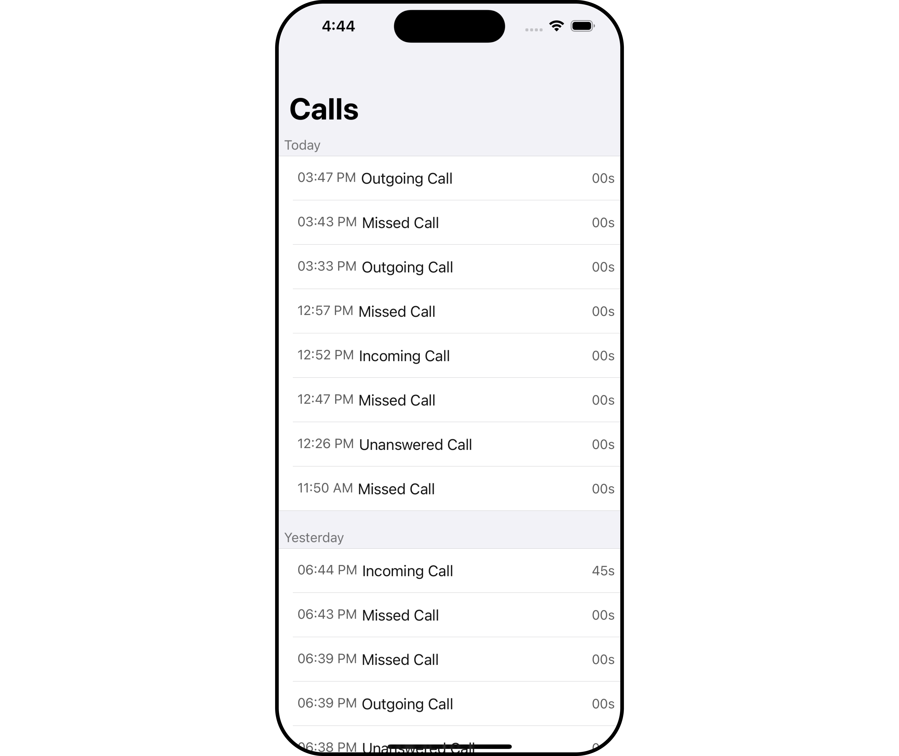
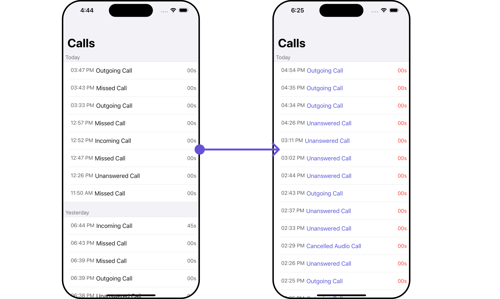
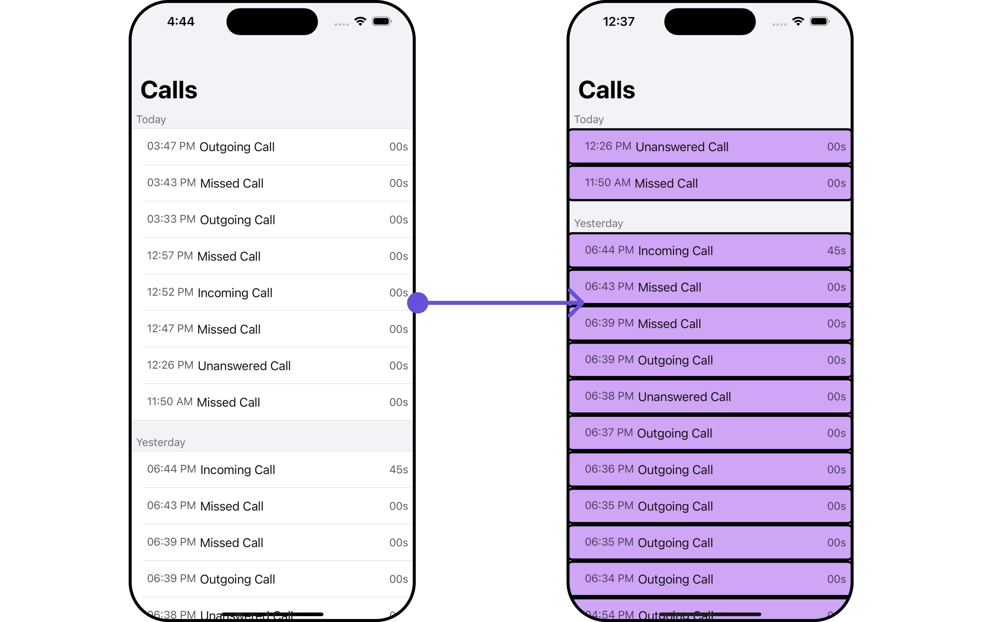
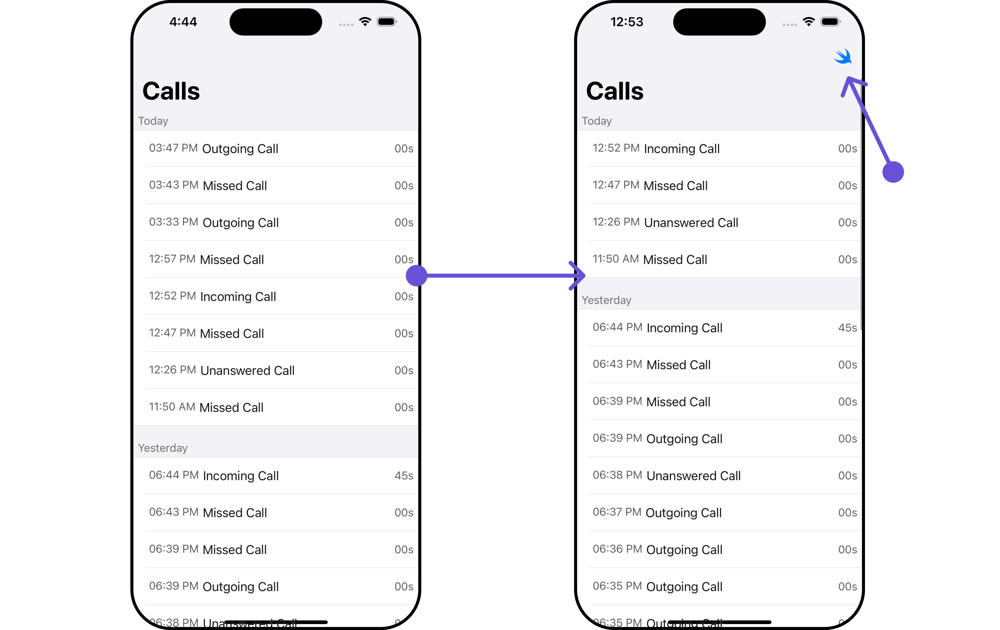
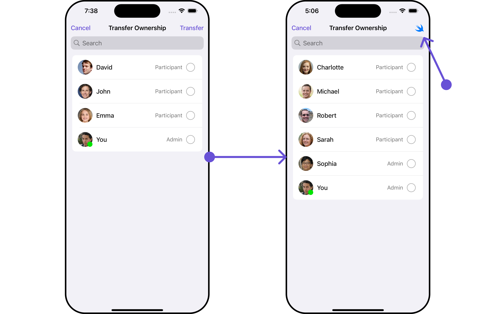

import Tabs from '@theme/Tabs';
import TabItem from '@theme/TabItem';

## Overview

`CometChatCallLogHistory` is a [Component](/ui-kit/ios/components-overview#components) that shows a paginated list of all the calls between the logged-in user & another user or group. This allows the user to see all the calls with a specific user/group they have initiated/received/missed.



The `Call Log History` component is composed of the following BaseComponents:

| Components                                 | Description                                                                                                                                                                              |
| ------------------------------------------ | ---------------------------------------------------------------------------------------------------------------------------------------------------------------------------------------- |
| [CometChatListBase](/ui-kit/ios/list-base) | `CometChatListBase` is a container component featuring a title, customizable background options, and a dedicated list view for seamless integration within your application's interface. |
| [CometChatListItem](/ui-kit/ios/list-item) | This component displays data retrieved from a CallLog object on a card, presenting a title and subtitle.                                                                                 |

---

<!--  -->

---

## Usage

### Integration

`CometChatCallLogHistory` is a **ViewController**, it can be seamlessly presented within your application. To display the details of a CallLog, you simply need to pass the corresponding CallLog object to the CometChatCallLogHistory instance using its setCallLog property. This enables you to efficiently showcase specific call log details within your application's interface.

<Tabs>
<TabItem value="swift" label="Swift">

```swift
let callHistory = CometChatCallLogHistory()
.set(uid: "your-uid")

self.navigationController?.pushViewController(callHistory, animated: true)
```

</TabItem>

</Tabs>

### Actions

[Actions](/ui-kit/ios/components-overview#actions) dictate how a component functions. They are divided into two types: Predefined and User-defined. You can override either type, allowing you to tailor the behavior of the component to fit your specific needs.

<!-- The `Call Log History` component does not have any exposed Actions. -->

##### 1. OnItemClick

This method proves valuable when users seek to override onItemClick functionality within CometChatCallLogsWithDetails, empowering them with greater control and customization options.

The `setOnItemClick` action doesn't have a predefined behavior. You can override this action using the following code snippet.

<Tabs>

<TabItem value="swift" label="Swift">
    ```swift
let callLogHistoryConfiguration = CallLogHistoryConfiguration()
    .set (onItemClicked:{ callLog, UIViewController in
    //Perform Your Action   
        
})
    ```
</TabItem>

</Tabs>

---

### Filters

**Filters** allow you to customize the data displayed in a list within a Component. You can filter the list based on your specific criteria, allowing for a more customized. Filters can be applied using RequestBuilders of Chat SDK.

<!-- The `Call Log History` component does not have any exposed filters. -->

##### 1. CallLogBuilder

The [callLogBuilder](/sdk/ios/call-logs) enables you to filter and customize the call list based on available parameters in callLogBuilder. This feature allows you to create more specific and targeted queries during the call. The following are the parameters available in [callLogBuilder](/sdk/ios/call-logs)

| Method            | Description                                         | Code                                                                                                                      |
| ----------------- | --------------------------------------------------- | ------------------------------------------------------------------------------------------------------------------------- |
| **fetchPrevious** | Fetches previous call logs                          | `fetchPrevious(authToken: String, onSuccess: (([CallLog]) -> Void), onError: (_ error: CometChatCallException?) -> Void)` |
| **fetchNext**     | Fetches next call logs                              | `fetchNext(onSuccess: (([CallLog]) -> Void), onError: (_ error: CometChatCallException?) -> Void)`                        |
| **limit**         | Sets the limit for the call logs request            | `.set(limit: Int)`                                                                                                        |
| **callType**      | Sets the call type for the call logs request        | `.set(callType: CallType)`                                                                                                |
| **callCategory**  | Sets the call Category                              | `.set(callCategory: CallCategory)`                                                                                        |
| **callStatus**    | Sets the call status for the call logs request      | `.set(callStatus: CallStatus)`                                                                                            |
| **hasRecording**  | Sets the recording status for the call logs request | `.set(hasRecording: Bool)`                                                                                                |
| **callDirection** | Sets the call direction for the call logs request   | `.set(callDirection: CallDirection)`                                                                                      |
| **uid**           | Sets the user ID for the call logs request          | `.set(uid: String)`                                                                                                       |
| **guid**          | Sets the group ID for the call logs request         | `.set(guid: String)`                                                                                                      |
| **authToken**     | Sets the auth token for the call logs request       | `.set(authToken: String?)`                                                                                                |
| **build**         | Builds the call logs request                        | `.build()`                                                                                                                |

**Example**

In the example below, we are applying a filter based on limit , calltype , call status and calling fetchNext.

<Tabs>
<TabItem value="swift" label="Swift">

```swift title=''

let callLogBuilder = CallLogsRequest.CallLogsBuilder().set(authToken: CometChat.getUserAuthToken()).set(callCategory: .call).set(callType: .audio).set(uid: "emma-uid")

let callLogsRequest = CallLogsRequest(builder: callLogBuilder)
callLogsRequest.fetchNext(onSuccess: {
    (callLogs) in
    // Call logs fetched successfully. 'callLogs' is an array of Call objects.
    print("Call logs fetched successfully. Found \(callLogs.count ) call logs.")
}
                          , onError: {
                              (error) in
                              // Error occurred while fetching call logs
                              print("Call logs fetching failed with error: \(String(describing: error?.errorDescription))")
                          })
let callHistory = CometChatCallLogHistory()
.set(callLogBuilder: callLogBuilder)

```

</TabItem>

</Tabs>

##### 2. CallRequestBuilder

The [callRequestBuilder](/sdk/ios/call-logs) enables you to filter and customize the call list based on available parameters in callRequestBuilder. This feature allows you to create more specific and targeted queries during the call. The following are the parameters available in [callRequestBuilder](/sdk/ios/call-logs)

<!-- | Method                  | Description                                         | Code                                            |
| ----------------------- | --------------------------------------------------- | ----------------------------------------------- |
| **fetchPrevious**       | Fetches previous call logs                          | `fetchPrevious(authToken: String, onSuccess: (([CallLog]) -> Void), onError: (_ error: CometChatCallException?) -> Void)` |
| **fetchNext**           | Fetches next call logs                              | `fetchNext(onSuccess: (([CallLog]) -> Void), onError: (_ error: CometChatCallException?) -> Void)` |
| **limit**         | Sets the limit for the call logs request            | `.set(limit: Int)`                              |
| **callType**      | Sets the call type for the call logs request        | `.set(callType: CallType)`                      |
| **callStatus**    | Sets the call status for the call logs request      | `.set(callStatus: CallStatus)`                  |
| **hasRecording**  | Sets the recording status for the call logs request | `.set(hasRecording: Bool)`                      |
| **callDirection** | Sets the call direction for the call logs request   | `.set(callDirection: CallDirection)`            |
| **uid**           | Sets the user ID for the call logs request          | `.set(uid: String)`                             |
| **guid**          | Sets the group ID for the call logs request         | `.set(guid: String)`                            |
| **authToken**     | Sets the auth token for the call logs request       | `.set(authToken: String?)`                      |
| **build**               | Builds the call logs request                        | `.build()`                                      | -->

**Example**

In the example below, we are applying a filter based on limit , calltype and call status.

<Tabs>
<TabItem value="swift" label="Swift">

```swift title=''

let callRequestBuilder = CallLogsRequest.CallLogsBuilder()
.set(limit: 2)
.set(callType: .audio)
.set(callStatus: .initiated)
.set(authToken: CometChat.getUserAuthToken())

let callHistory = CometChatCallLogHistory()
.set(callRequestBuilder: callRequestBuilder)
.set(uid: "your-uid")

self.navigationController?.pushViewController(callHistory, animated: true)
```

</TabItem>

</Tabs>

---

### Events

[Events](/ui-kit/ios/components-overview#events) are emitted by a `Component`. By using event you can extend existing functionality. Being global events, they can be applied in Multiple Locations and are capable of being Added or Removed.

The `Call Log History` component does not have any exposed events.

---

## Customization

To fit your app's design requirements, you can customize the appearance of the conversation component. We provide exposed methods that allow you to modify the experience and behavior according to your specific needs.

### Style

Using Style you can customize the look and feel of the component in your app, These parameters typically control elements such as the color, size, shape, and fonts used within the component.

##### 1. CallLogHistory Style

You can customize the appearance of the `CallLogHistory` Component by applying the `CallLogHistoryStyle` to it using the following code snippet.


<Tabs>
<TabItem value="swift" label="Swift">

```swift

let callLogHistoryStyle = CallLogHistoryStyle()
.set(background: .systemYellow)
.set(borderColor: .systemRed)
.set(durationTextColor: .systemRed)
.set(borderWidth: 4)
.set(statusTextColor: .systemIndigo)

let callLogHistoryConfiguration = CallLogHistoryConfiguration()
.set(style: callLogHistoryStyle)

let callHistory = CometChatCallLogHistory()
.set(configuration: callLogHistoryConfiguration)
.set(uid: "your-uid")

```

</TabItem>

</Tabs>

| Property          | Description                                  | Code                                       |
| ----------------- | -------------------------------------------- | ------------------------------------------ |
| background        | Used to set the background color             | `.set(background: UIColor)`                |
| borderWidth       | Used to set border                           | `.set(borderWidth: CGFloat)`               |
| cornerRadius      | Used to set border radius                    | `.set(cornerRadius: CometChatCornerStyle)` |
| borderColor       | Used to set the border color                 | `.set(borderColor: UIColor)`               |
| timeTextColor     | Used to set the text color of the time text  | `.set(timeTextColor: UIColor)`             |
| timeTextFont      | Used to set the text font of the time text   | `.set(timeTextFont: UIFont)`               |
| statusTextFont    | Used to set the text font of the status text | `.set(statusTextFont: UIFont)`             |
| statusTextColor   | Used to set Text Color for Duration          | `.set(statusTextColor: UIColor)`           |
| durationTextColor | Used to set Text Color for Duration          | `.set(durationTextColor: UIColor)`         |
| durationTextFont  | Used to set Font for Duration Text           | `.set(durationTextFont: UIFont)`           |

##### 2. ListItem Styles

To apply customized styles to the `ListItemStyle` component in the `CallLogHistory` Component, you can use the following code snippet. For further insights on `ListItemStyle` Styles [refer](/ui-kit/ios/list-item#set-listitem-style)



<Tabs>
<TabItem value="swift" label="Swift">

```swift title='Swift'

let listItemStyle = ListItemStyle()

listItemStyle.set(background: .init(red: 0.81, green: 0.64, blue: 0.96, alpha: 1.00))
.set(titleFont: .systemFont(ofSize: 18))
.set(titleColor: .systemBlue)
.set(cornerRadius: CometChatCornerStyle(cornerRadius: 8.0))
.set(borderColor: .black)
.set(borderWidth: 3)

let callLogHistoryConfiguration = CallLogHistoryConfiguration()
.set(listItemStyle: listItemStyle)

let callHistory = CometChatCallLogHistory()
.set(configuration: callLogHistoryConfiguration)
.set(uid: "your-uid")

```

</TabItem>

</Tabs>

:::info
Ensure to pass and present `CometChatCallLogHistory`. If a navigation controller is already in use, utilize the pushViewController function instead of directly presenting the view controller.
:::

---

### Functionality

These are a set of small functional customizations that allow you to fine-tune the overall experience of the component. With these, you can change text, set custom icons, and toggle the visibility of UI elements.

<Tabs>

<TabItem value="swift" label="Swift">

```swift
let callHistory = CometChatCallLogHistory()
.set(title: "Cc", mode: .automatic)
.hide(separator: true)
.set(backButtonIcon: UIImage(systemName: "cricket.ball.fill")!)

self.navigationController?.pushViewController(callHistory, animated: true)

```

</TabItem>

</Tabs>

Below is a list of customizations along with corresponding code snippets

| Property               | Description                        | Code                                                                |
| ---------------------- | ---------------------------------- | ------------------------------------------------------------------- |
| titleFont              | Sets the font for the title        | `.set(titleFont: UIFont)`                                           |
| titleColor             | Sets the color for the title       | `.set(titleColor: UIColor)`                                         |
| title                  | Sets the title for the title bar   | `.set(title: String, mode: UINavigationItem.LargeTitleDisplayMode)` |
| largeTitleFont         | Sets the large title font          | `.set(largeTitleFont: UIFont)`                                      |
| backButtonTitle        | Sets the back button title         | `.set(backButtonTitle: String?)`                                    |
| largeTitleColor        | Sets the large title color         | `.set(largeTitleColor: UIColor)`                                    |
| backButtonTitleColor   | Sets the back button title color   | `.set(backButtonTitleColor: UIColor)`                               |
| hide(search)           | Hides the search bar               | `.hide(search: Bool)`                                               |
| hide(separator)        | Hides the separator                | `.hide(separator: Bool)`                                            |
| hide(errorText)        | Hides the error text               | `.hide(errorText: Bool)`                                            |
| guid                   | Sets the guid                      | `.set(guid: String)`                                                |
| backButtonFont         | Sets the back button font          | `.set(backButtonFont: UIFont?)`                                     |
| backButtonIcon         | Sets the back button icon          | `.set(backButtonIcon: UIImage)`                                     |
| backButtonTint         | Sets the back button tint          | `.set(backButtonTint: UIColor)`                                     |
| background             | Sets the background                | `.set(background: [CGColor]?)`                                      |
| borderColor            | Sets the border color              | `.set(borderColor: UIColor)`                                        |
| borderWidth            | Sets the border width              | `.set(borderWidth: CGFloat)`                                        |
| corner                 | Sets the corner style              | `.set(corner: CometChatCornerStyle)`                                |
| emptyStateText         | Sets the empty state text          | `.set(emptyStateText: String)`                                      |
| emptyStateTextColor    | Sets the empty state text color    | `.set(emptyStateTextColor: UIColor)`                                |
| emptyStateTextFont     | Sets the empty state text font     | `.set(emptyStateTextFont: UIFont)`                                  |
| errorStateText         | Sets the error state text          | `.set(errorStateText: String)`                                      |
| errorStateTextColor    | Sets the error state text color    | `.set(errorStateTextColor: UIColor)`                                |
| errorStateTextFont     | Sets the error state text font     | `.set(errorStateTextFont: UIFont)`                                  |
| searchBackground       | Sets the search background         | `.set(searchBackground: UIColor)`                                   |
| searchIcon             | Sets the search icon               | `.set(searchIcon: UIImage?)`                                        |
| searchPlaceholder      | Sets the search placeholder        | `.set(searchPlaceholder: String)`                                   |
| searchIconTint         | Sets the search icon tint          | `.set(searchIconTint: UIColor)`                                     |
| searchTextFont         | Sets the search text font          | `.set(searchTextFont: UIFont)`                                      |
| searchBarHeight        | Sets the search bar height         | `.set(searchBarHeight: CGFloat)`                                    |
| searchClearIcon        | Sets the search clear icon         | `.set(searchClearIcon: UIImage)`                                    |
| searchTextColor        | Sets the search text color         | `.set(searchTextColor: UIColor)`                                    |
| searchBorderColor      | Sets the search border color       | `.set(searchBorderColor: UIColor)`                                  |
| searchBorderWidth      | Sets the search border width       | `.set(searchBorderWidth: CGFloat)`                                  |
| searchCornerRadius     | Sets the search corner radius      | `.set(searchCornerRadius: CometChatCornerStyle)`                    |
| searchClearIconTint    | Sets the search clear icon tint    | `.set(searchClearIconTint: UIColor)`                                |
| searchPlaceholderColor | Sets the search placeholder color  | `.set(searchPlaceholderColor: UIColor)`                             |
| searchCancelButtonFont | Sets the search cancel button font | `.set(searchCancelButtonFont: UIFont)`                              |
| searchCancelButtonTint | Sets the search cancel button tint | `.set(searchCancelButtonTint: UIColor)`                             |

---

### Advanced

For advanced-level customization, you can set custom views to the component. This lets you tailor each aspect of the component to fit your exact needs and application aesthetics. You can create and define your views, layouts, and UI elements and then incorporate those into the component.

#### EmptyView <a data-tooltip-id="my-tooltip-html-prop"> <span class="material-icons red">report</span> </a>

You can set a custom EmptyView using `.set(emptyView: UIView)` to match the empty view of your app.

<Tabs>

<TabItem value="swift" label="swift">
```swift
let callHistory = CometChatCallLogHistory()
.set(emptyView: UIView)       //you can pass your own view

````

</TabItem>

</Tabs>


**Example**
<!--  -->


In this example, we will create a `Custom_Empty_State_GroupView`a UIView file.

```swift
import UIKit

class CustomEmptyStateGroupView: UIView {
    // Initialize your subviews
    let imageView: UIImageView = {
        let imageView = UIImageView(image: UIImage(named: "noDataImage"))
        imageView.translatesAutoresizingMaskIntoConstraints = false
        return imageView
    }()

    let messageLabel: UILabel = {
        let label = UILabel()
        label.text = "No groups available"
        label.translatesAutoresizingMaskIntoConstraints = false
        label.font = UIFont.boldSystemFont(ofSize: 16)
        label.textColor = .black
        return label
    }()

    // Override the initializer
    override init(frame: CGRect) {
        super.init(frame: frame)
        // Add subviews and layout constraints
        addSubview(imageView)
        addSubview(messageLabel)
        NSLayoutConstraint.activate([
            imageView.centerXAnchor.constraint(equalTo: centerXAnchor),
            imageView.centerYAnchor.constraint(equalTo: centerYAnchor),
            imageView.heightAnchor.constraint(equalToConstant: 120),
            imageView.widthAnchor.constraint(equalToConstant: 120),

            messageLabel.topAnchor.constraint(equalTo: imageView.bottomAnchor, constant: 8),
            messageLabel.centerXAnchor.constraint(equalTo: centerXAnchor)
        ])
    }

    required init?(coder: NSCoder) {
        fatalError("init(coder:) has not been implemented")
    }
}
```
We will be passing a custom empty view to CometChatCallLogHistory, ensuring a tailored and user-friendly interface.

<Tabs>

<TabItem value="swift" label="Swift">
```swift
let customEmptyStateGroupView = CustomEmptyStateGroupView()


let callHistory = CometChatCallLogHistory()
.set(emptyView: customEmptyStateGroupView)

self.navigationController?.pushViewController(callHistory, animated: true)
````

</TabItem>

</Tabs>

:::info
Ensure to pass and present `CometChatCallLogHistory`. If a navigation controller is already in use, utilize the pushViewController function instead of directly presenting the view controller.
:::

---

#### ErrorView <a data-tooltip-id="my-tooltip-html-prop"> <span class="material-icons red">report</span> </a>

You can set a custom ErrorView using `.set(errorView: UIView)` to match the error view of your app.

<Tabs>

<TabItem value="swift" label="Swift">

```swift
let callHistory = CometChatCallLogHistory()
.set(errorView: UIView)    //you can pass your own view

```

</TabItem>

</Tabs>

**Example**

<!--  -->
<!--  -->

In this example, we will create a UIView file `Custom_ErrorState_GroupView` and pass it inside the `.set(errorView: UIView)` method.

```swift title="Custom_ErrorState_GroupView"
import UIKit

let CustomErrorStateGroupView: UIView = {
        // Create main view
        let view = UIView()
        view.backgroundColor = .white

        // Create an imageView and add it to the main view
        let imageView = UIImageView(image: UIImage(systemName: "exclamationmark.triangle"))
        imageView.tintColor = .red
        imageView.translatesAutoresizingMaskIntoConstraints = false
        view.addSubview(imageView)

        // Create a label with error message and add it to the main view
        let label = UILabel()
        label.text = "An error occurred. Please try again."
        label.font = UIFont.systemFont(ofSize: 16)
        label.textColor = .darkGray
        label.numberOfLines = 0
        label.textAlignment = .center
        label.translatesAutoresizingMaskIntoConstraints = false
        view.addSubview(label)

        // Create constraints for imageView and label
        NSLayoutConstraint.activate([
            imageView.centerXAnchor.constraint(equalTo: view.centerXAnchor),
            imageView.centerYAnchor.constraint(equalTo: view.centerYAnchor, constant: -50),

            label.topAnchor.constraint(equalTo: imageView.bottomAnchor, constant: 20),
            label.leadingAnchor.constraint(equalTo: view.leadingAnchor, constant: 20),
            label.trailingAnchor.constraint(equalTo: view.trailingAnchor, constant: -20)
        ])

        return view
    }()
```

<Tabs>

<TabItem value="swift" label="Swift">

```swift
let customErrorStateGroupView = CustomErrorStateGroupView

let callHistory = CometChatCallLogHistory()
.set(errorView: customErrorStateGroupView)

self.navigationController?.pushViewController(callHistory, animated: true)
```

</TabItem>

</Tabs>

:::info
Ensure to pass and present `CometChatCallLogHistory`. If a navigation controller is already in use, utilize the pushViewController function instead of directly presenting the view controller.
:::

---

#### Menus

You can set the Custom Menus to add more options to the CometChatCallLogHistory component.

<Tabs>

<TabItem value="swift" label="Swift">

```swift
let callHistory = CometChatCallLogHistory()
.set(menus: [UIBarButtonItem])

```

</TabItem>

</Tabs>

- You can customize the menus for CometChatCallLogHistory to meet your requirements

**Example**



<!--  -->
<!--  -->

In this example, we'll craft a custom button tailored for `CometChatCallLogHistory`, enhancing its interface with a personalized `menu` for a more user-friendly experience.

<Tabs>

<TabItem value="swift" label="Swift">
```swift
let customMenuButton: UIBarButtonItem = {
    let button = UIButton(type: .system)
    button.setImage(UIImage(systemName: "swift"), for: .normal)
    button.setTitle("", for: .normal)
    button.addTarget(self, action: #selector(handleCustomMenu), for: .touchUpInside)
    let barButtonItem = UIBarButtonItem(customView: button)
    return barButtonItem
}()

let callHistory = CometChatCallLogHistory()
.set(menus: [customMenuButton])

```
</TabItem>


</Tabs>

:::info
Ensure to pass and present `CometChatCallLogHistory`. If a navigation controller is already in use, utilize the pushViewController function instead of directly presenting the view controller.
:::


---


import { Tooltip } from 'react-tooltip'
import 'react-tooltip/dist/react-tooltip.css'

<Tooltip
  id="my-tooltip-html-prop"
  html="Not available "
/>

---
```
