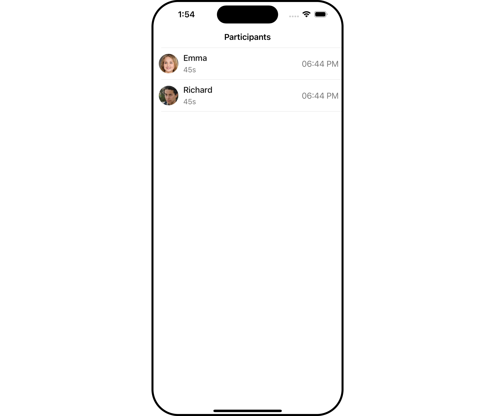
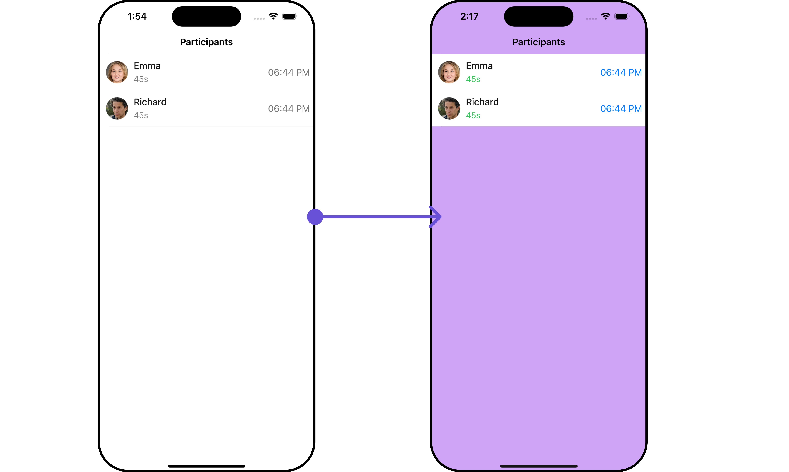
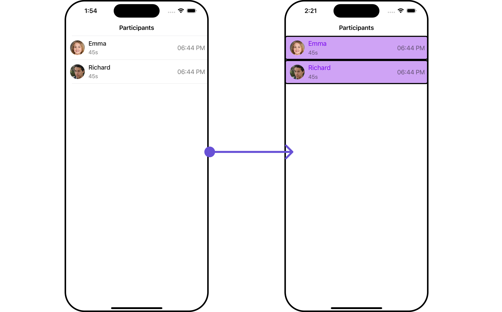
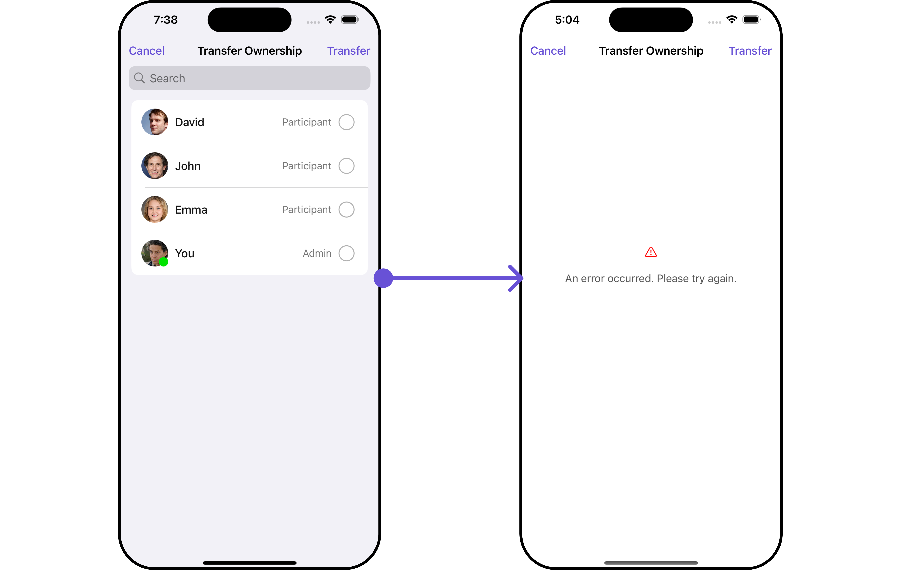
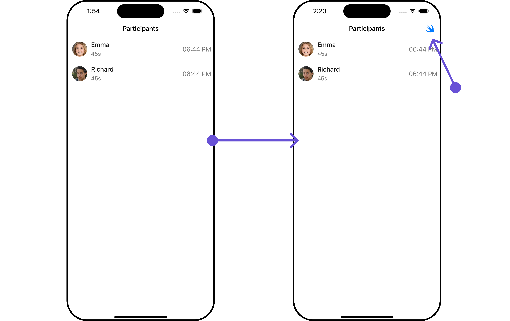
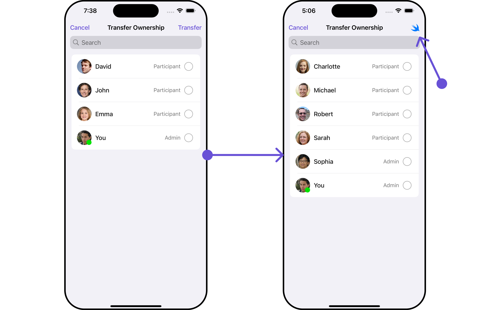

import Tabs from '@theme/Tabs';
import TabItem from '@theme/TabItem';

## Overview

`CometChatCallLogParticipants` is a [Component](/ui-kit/ios/components-overview#components) that shows a separate view that displays comprehensive information about Call. This will enable users to easily access details such as the call participants, call details for a more informed communication experience.



The `Call Log Participants` component is composed of the following BaseComponents:

| Components                                 | Description                                                                                                                                                                              |
| ------------------------------------------ | ---------------------------------------------------------------------------------------------------------------------------------------------------------------------------------------- |
| [CometChatListBase](/ui-kit/ios/list-base) | `CometChatListBase` is a container component featuring a title, customizable background options, and a dedicated list view for seamless integration within your application's interface. |
| [CometChatListItem](/ui-kit/ios/list-item) | This component displays data retrieved from a CallLog object on a card, presenting a title and subtitle.                                                                                 |

---

<!--  -->

---

## Usage

### Integration

`CometChatCallLogParticipants` is a ViewController component that seamlessly integrates into your application. To present the participants of a call, you can instantiate the `CometChatCallLogParticipants` instance and provide the list of participants using its setter function. This allows for easy customization and efficient display of call participant details within your application's interface.

<Tabs>
<TabItem value="swift" label="Swift">

```swift
let callParticipant = CometChatCallLogParticipant()
.set(participants: [Any]?)

self.navigationController?.pushViewController(callParticipant, animated: true)

```

</TabItem>

</Tabs>

### Actions

[Actions](/ui-kit/ios/components-overview#actions) dictate how a component functions. They are divided into two types: Predefined and User-defined. You can override either type, allowing you to tailor the behavior of the component to fit your specific needs.

##### 1. OnItemClicked

The `setOnItemClicked` action is typically triggered when a participant in the call log is clicked, executing a predefined action. However, by implementing the provided code snippet, you can effortlessly customize or override this default behavior to meet your specific requirements.

<Tabs>

<TabItem value="swift" label="Swift">
    ```swift
let callLogParticipantConfiguration =  CallLogParticipantConfiguration()
    .set (onItemClicked:{ callLog, UIViewController in
    //Perform Your Action

})

````
</TabItem>

</Tabs>

---

### Filters

**Filters** allow you to customize the data displayed in a list within a Component. You can filter the list based on your specific criteria, allowing for a more customized. Filters can be applied using RequestBuilders of Chat SDK.

The `Call Log Participants` component does not have any exposed filters.

---

### Events

[Events](/ui-kit/ios/components-overview#events) are emitted by a `Component`. By using event you can extend existing functionality. Being global events, they can be applied in Multiple Locations and are capable of being Added or Removed.

The `Call Log Participants` component does not have any exposed events.

---

## Customization

To fit your app's design requirements, you can customize the appearance of the conversation component. We provide exposed methods that allow you to modify the experience and behavior according to your specific needs.

### Style

Using Style you can customize the look and feel of the component in your app, These parameters typically control elements such as the color, size, shape, and fonts used within the component.

##### 1. CallLogParticipant Style

You can customize the appearance of the `CallLogParticipant` Component by applying the `CallLogParticipantStyle` to it using the following code snippet.



<Tabs>
<TabItem value="swift" label="Swift">

```swift
let callLogParticipantStyle = CallLogParticipantStyle()
.set(durationTextColor: .systemGreen)
.set(joinedAtTextColor: .systemBlue)
.set(background:.init(red: 0.81, green: 0.64, blue: 0.96, alpha: 1.00))

let callLogParticipantConfiguration =  CallLogParticipantConfiguration()
.set(style: callLogParticipantStyle)

let callParticipant = CometChatCallLogParticipant()
.set(configuration: callLogParticipantConfiguration)

self.navigationController?.pushViewController(callParticipant, animated: true)
````

</TabItem>

</Tabs>

| Property          | Description                               | Code                                       |
| ----------------- | ----------------------------------------- | ------------------------------------------ |
| background        | Sets the background color                 | `.set(background: UIColor)`                |
| borderWidth       | Sets the border width                     | `.set(borderWidth: CGFloat)`               |
| bordercolor       | Sets the border color                     | `.set(borderColor: UIColor)`               |
| cornerRadius      | Sets the corner radius                    | `.set(cornerRadius: CometChatCornerStyle)` |
| durationTextColor | Sets the text color of the duration text  | `.set(durationTextColor: UIColor)`         |
| durationTextFont  | Sets the font of the duration text        | `.set(durationTextFont: UIFont)`           |
| joinedAtTextColor | Sets the text color of the Joined At text | `.set(joinedAtTextColor: UIColor)`         |
| joinedAtTextFont  | Sets the font of Joined At Text text      | `.set(joinedAtTextFont: UIFont)`           |
| nameTextFont      | Sets the font of the name text            | `.set(nameTextFont: UIFont)`               |

##### 2. ListItem Styles

To apply customized styles to the `ListItemStyle` component in the `CallLogParticipants` Component, you can use the following code snippet. For further insights on `ListItemStyle` Styles [refer](/ui-kit/ios/list-item)


<Tabs>
<TabItem value="swift" label="Swift">

```swift title='Swift'

let listItemStyle = ListItemStyle()

listItemStyle.set(background: .init(red: 0.81, green: 0.64, blue: 0.96, alpha: 1.00))
.set(titleFont: .systemFont(ofSize: 18))
.set(titleColor: .init(red: 0.47, green: 0.02, blue: 0.93, alpha: 1.00))
.set(cornerRadius: CometChatCornerStyle(cornerRadius: 8.0))
.set(borderColor: .black)
.set(borderWidth: 3)

let callLogParticipantConfiguration =  CallLogParticipantConfiguration()
.set(listItemStyle: listItemStyle)

let callParticipant = CometChatCallLogParticipant()
.set(configuration: callLogParticipantConfiguration)

```

</TabItem>

</Tabs>

:::info
Ensure to pass and present `CometChatCallLogParticipants`. If a navigation controller is already in use, utilize the pushViewController function instead of directly presenting the view controller.
:::

---

### Functionality

These are a set of small functional customizations that allow you to fine-tune the overall experience of the component. With these, you can change text, set custom icons, and toggle the visibility of UI elements.

<Tabs>

<TabItem value="swift" label="Swift">

```swift
let callParticipant = CometChatCallLogParticipant()
.set(title: "Cc", mode: .automatic)
.hide(separator: true)
.set(backButtonIcon: UIImage(systemName: "bell")!)

self.navigationController?.pushViewController(callParticipant, animated: true)

```

</TabItem>

</Tabs>

Below is a list of customizations along with corresponding code snippets

| Property                | Description                          | Code                                                                |
| ----------------------- | ------------------------------------ | ------------------------------------------------------------------- |
| titleFont               | Sets the font for the title          | `.set(titleFont: UIFont)`                                           |
| titleColor              | Sets the color for the title         | `.set(titleColor: UIColor)`                                         |
| title                   | Sets the title for the title bar     | `.set(title: String, mode: UINavigationItem.LargeTitleDisplayMode)` |
| largeTitleFont          | Sets the large title font            | `.set(largeTitleFont: UIFont)`                                      |
| backButtonTitle         | Sets the back button title           | `.set(backButtonTitle: String?)`                                    |
| largeTitleColor         | Sets the large title color           | `.set(largeTitleColor: UIColor)`                                    |
| backButtonTitleColor    | Sets the back button title color     | `.set(backButtonTitleColor: UIColor)`                               |
| hide(search)            | Hides the search bar                 | `.hide(search: Bool)`                                               |
| hide(separator)         | Hides the separator                  | `.hide(separator: Bool)`                                            |
| hide(errorText)         | Hides the error text                 | `.hide(errorText: Bool)`                                            |
| callLog                 | Sets the call log                    | `.set(callLog: Any?)`                                               |
| backButtonFont          | Sets the back button font            | `.set(backButtonFont: UIFont?)`                                     |
| backButtonIcon          | Sets the back button icon            | `.set(backButtonIcon: UIImage)`                                     |
| backButtonTint          | Sets the back button tint            | `.set(backButtonTint: UIColor)`                                     |
| background              | Sets the background                  | `.set(background: [CGColor]?)`                                      |
| borderColor             | Sets the border color                | `.set(borderColor: UIColor)`                                        |
| borderWidth             | Sets the border width                | `.set(borderWidth: CGFloat)`                                        |
| corner                  | Sets the corner style                | `.set(corner: CometChatCornerStyle)`                                |
| emptyStateText          | Sets the empty state text            | `.set(emptyStateText: String)`                                      |
| emptyStateTextColor     | Sets the empty state text color      | `.set(emptyStateTextColor: UIColor)`                                |
| emptyStateTextFont      | Sets the empty state text font       | `.set(emptyStateTextFont: UIFont)`                                  |
| errorStateText          | Sets the error state text            | `.set(errorStateText: String)`                                      |
| errorStateTextColor     | Sets the error state text color      | `.set(errorStateTextColor: UIColor)`                                |
| errorStateTextFont      | Sets the error state text font       | `.set(errorStateTextFont: UIFont)`                                  |
| searchBackground        | Sets the search background           | `.set(searchBackground: UIColor)`                                   |
| searchIcon              | Sets the search icon                 | `.set(searchIcon: UIImage?)`                                        |
| searchPlaceholder       | Sets the search placeholder          | `.set(searchPlaceholder: String)`                                   |
| searchIconTint          | Sets the search icon tint            | `.set(searchIconTint: UIColor)`                                     |
| searchTextFont          | Sets the search text font            | `.set(searchTextFont: UIFont)`                                      |
| searchBarHeight         | Sets the search bar height           | `.set(searchBarHeight: CGFloat)`                                    |
| searchClearIcon         | Sets the search clear icon           | `.set(searchClearIcon: UIImage)`                                    |
| searchTextColor         | Sets the search text color           | `.set(searchTextColor: UIColor)`                                    |
| searchBorderColor       | Sets the search border color         | `.set(searchBorderColor: UIColor)`                                  |
| searchBorderWidth       | Sets the search border width         | `.set(searchBorderWidth: CGFloat)`                                  |
| searchCornerRadius      | Sets the search corner radius        | `.set(searchCornerRadius: CometChatCornerStyle)`                    |
| searchClearIconTint     | Sets the search clear icon tint      | `.set(searchClearIconTint: UIColor)`                                |
| searchPlaceholderColor  | Sets the search placeholder color    | `.set(searchPlaceholderColor: UIColor)`                             |
| searchCancelButtonFont  | Sets the search cancel button font   | `.set(searchCancelButtonFont: UIFont)`                              |
| searchCancelButtonTint  | Sets the search cancel button tint   | `.set(searchCancelButtonTint: UIColor)`                             |
| participants            | Sets the participants                | `.set(participants: [Any]?)`                                        |
| loading stateview style | Sets the style for loading stateview | `.set(loadingStateView: UIActivityIndicatorView.Style)`             |

---

### Advanced

For advanced-level customization, you can set custom views to the component. This lets you tailor each aspect of the component to fit your exact needs and application aesthetics. You can create and define your views, layouts, and UI elements and then incorporate those into the component.

#### EmptyView <a data-tooltip-id="my-tooltip-html-prop"> <span class="material-icons red">report</span> </a>

You can set a custom EmptyView using `.set(emptyView: UIView)` to match the empty view of your app.

<Tabs>

<TabItem value="swift" label="swift">
```swift
let callParticipant = CometChatCallLogParticipant()
.set(emptyView: UIView)      //you can pass your own view

````

</TabItem>

</Tabs>


**Example**
<!--  -->


In this example, we will create a `Custom_Empty_State_GroupView`a UIView file.

```swift
import UIKit

class CustomEmptyStateGroupView: UIView {
    // Initialize your subviews
    let imageView: UIImageView = {
        let imageView = UIImageView(image: UIImage(named: "noDataImage"))
        imageView.translatesAutoresizingMaskIntoConstraints = false
        return imageView
    }()

    let messageLabel: UILabel = {
        let label = UILabel()
        label.text = "No groups available"
        label.translatesAutoresizingMaskIntoConstraints = false
        label.font = UIFont.boldSystemFont(ofSize: 16)
        label.textColor = .black
        return label
    }()

    // Override the initializer
    override init(frame: CGRect) {
        super.init(frame: frame)
        // Add subviews and layout constraints
        addSubview(imageView)
        addSubview(messageLabel)
        NSLayoutConstraint.activate([
            imageView.centerXAnchor.constraint(equalTo: centerXAnchor),
            imageView.centerYAnchor.constraint(equalTo: centerYAnchor),
            imageView.heightAnchor.constraint(equalToConstant: 120),
            imageView.widthAnchor.constraint(equalToConstant: 120),

            messageLabel.topAnchor.constraint(equalTo: imageView.bottomAnchor, constant: 8),
            messageLabel.centerXAnchor.constraint(equalTo: centerXAnchor)
        ])
    }

    required init?(coder: NSCoder) {
        fatalError("init(coder:) has not been implemented")
    }
}
```
We will be passing a custom empty view to CometChatCallLogParticipants, ensuring a tailored and user-friendly interface.

<Tabs>

<TabItem value="swift" label="Swift">
```swift
let customEmptyStateGroupView = CustomEmptyStateGroupView()

let callParticipant = CometChatCallLogParticipant()
            .set(emptyView: customEmptyStateGroupView)

self.navigationController?.pushViewController(callParticipant, animated: true)
````

</TabItem>

</Tabs>

:::info
Ensure to pass and present `CometChatCallLogParticipants`. If a navigation controller is already in use, utilize the pushViewController function instead of directly presenting the view controller.
:::

---

#### ErrorView <a data-tooltip-id="my-tooltip-html-prop"> <span class="material-icons red">report</span> </a>

You can set a custom ErrorView using `.set(errorView: UIView)` to match the error view of your app.

<Tabs>

<TabItem value="swift" label="Swift">

```swift
let callParticipant = CometChatCallLogParticipant()
.set(errorView: UIView)   //you can pass your own view

```

</TabItem>

</Tabs>

**Example**

<!--  -->
<!--  -->

In this example, we will create a UIView file `Custom_ErrorState_GroupView` and pass it inside the `.set(errorView: UIView)` method.

```swift title="Custom_ErrorState_GroupView"
import UIKit

let CustomErrorStateGroupView: UIView = {
        // Create main view
        let view = UIView()
        view.backgroundColor = .white

        // Create an imageView and add it to the main view
        let imageView = UIImageView(image: UIImage(systemName: "exclamationmark.triangle"))
        imageView.tintColor = .red
        imageView.translatesAutoresizingMaskIntoConstraints = false
        view.addSubview(imageView)

        // Create a label with error message and add it to the main view
        let label = UILabel()
        label.text = "An error occurred. Please try again."
        label.font = UIFont.systemFont(ofSize: 16)
        label.textColor = .darkGray
        label.numberOfLines = 0
        label.textAlignment = .center
        label.translatesAutoresizingMaskIntoConstraints = false
        view.addSubview(label)

        // Create constraints for imageView and label
        NSLayoutConstraint.activate([
            imageView.centerXAnchor.constraint(equalTo: view.centerXAnchor),
            imageView.centerYAnchor.constraint(equalTo: view.centerYAnchor, constant: -50),

            label.topAnchor.constraint(equalTo: imageView.bottomAnchor, constant: 20),
            label.leadingAnchor.constraint(equalTo: view.leadingAnchor, constant: 20),
            label.trailingAnchor.constraint(equalTo: view.trailingAnchor, constant: -20)
        ])

        return view
    }()
```

<Tabs>

<TabItem value="swift" label="Swift">

```swift
let customErrorStateGroupView = CustomErrorStateGroupView

let callParticipant = CometChatCallLogParticipant()
.set(errorView: customErrorStateGroupView)

self.navigationController?.pushViewController(callParticipant, animated: true)
```

</TabItem>

</Tabs>

:::info
Ensure to pass and present `CometChatCallLogParticipants`. If a navigation controller is already in use, utilize the pushViewController function instead of directly presenting the view controller.
:::

---

#### Menus

You can set the Custom Menus to add more options to the CometChatCallLogParticipants component.

<Tabs>

<TabItem value="swift" label="Swift">

```swift
let callLogDetails = CometChatCallLogDetails()
.set(menus: [UIBarButtonItem])

```

</TabItem>

</Tabs>

- You can customize the menus for CometChatCallLogParticipants to meet your requirements

**Example**



<!--  -->
<!--  -->

In this example, we'll craft a custom button tailored for `CallLogParticipants`, enhancing its interface with a personalized `menu` for a more user-friendly experience.

<Tabs>

<TabItem value="swift" label="Swift">
```swift
let customMenuButton: UIBarButtonItem = {
    let button = UIButton(type: .system)
    button.setImage(UIImage(systemName: "swift"), for: .normal)
    button.setTitle("", for: .normal)
    button.addTarget(self, action: #selector(handleCustomMenu), for: .touchUpInside)
    let barButtonItem = UIBarButtonItem(customView: button)
    return barButtonItem
}()

let callParticipant = CometChatCallLogParticipant()
.set(menus: [customMenuButton])

```
</TabItem>


</Tabs>

:::info
Ensure to pass and present `CometChatCallLogParticipants`. If a navigation controller is already in use, utilize the pushViewController function instead of directly presenting the view controller.
:::


---


import { Tooltip } from 'react-tooltip'
import 'react-tooltip/dist/react-tooltip.css'

<Tooltip
  id="my-tooltip-html-prop"
  html="Not available "
/>

---
```
