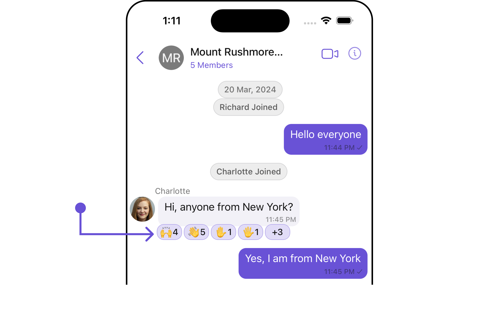
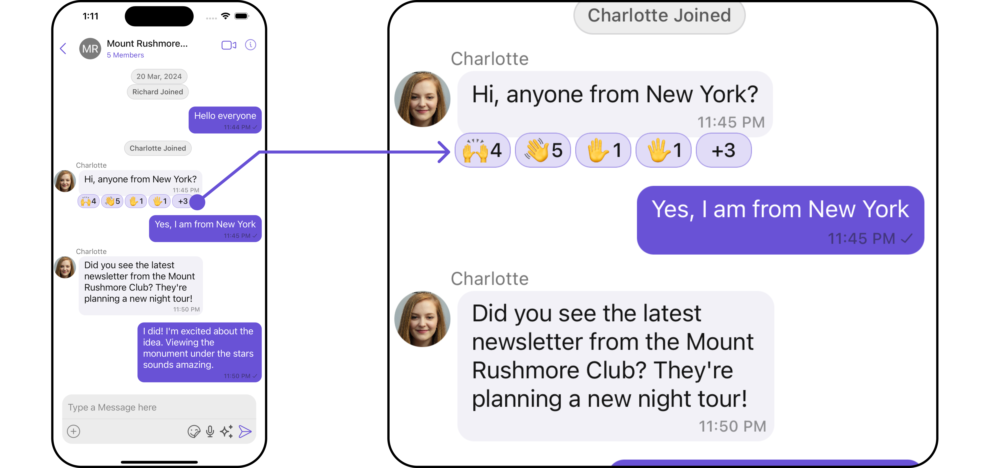
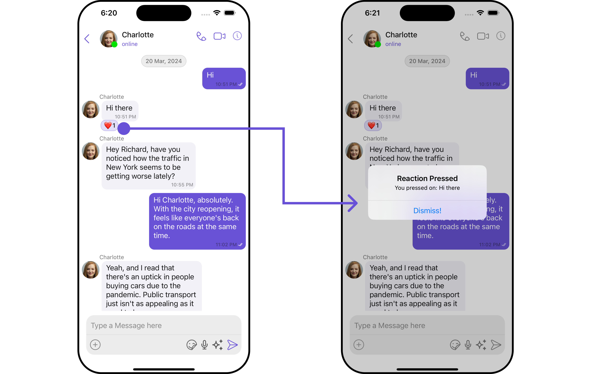
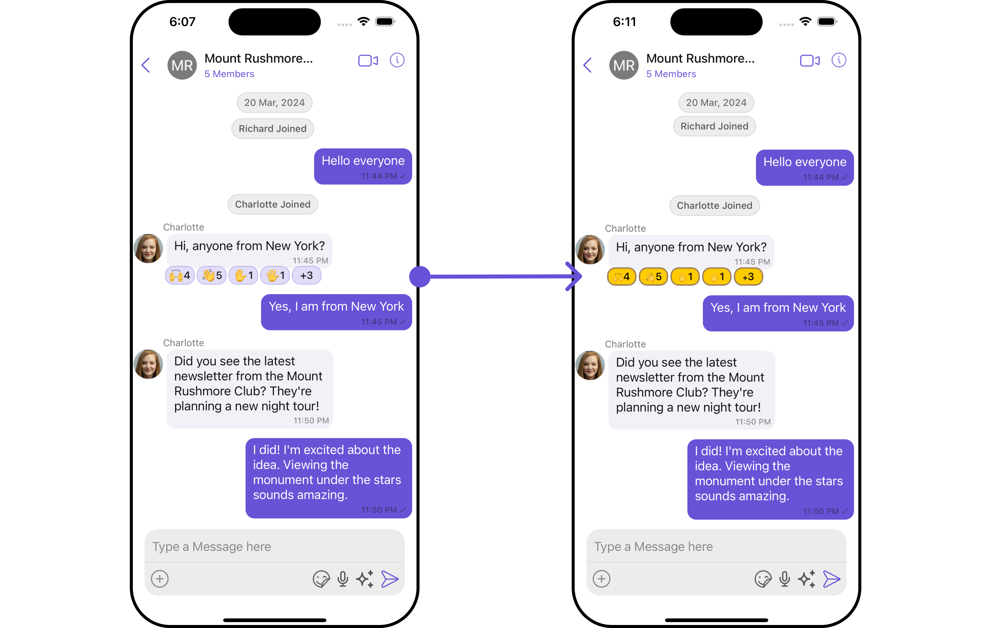
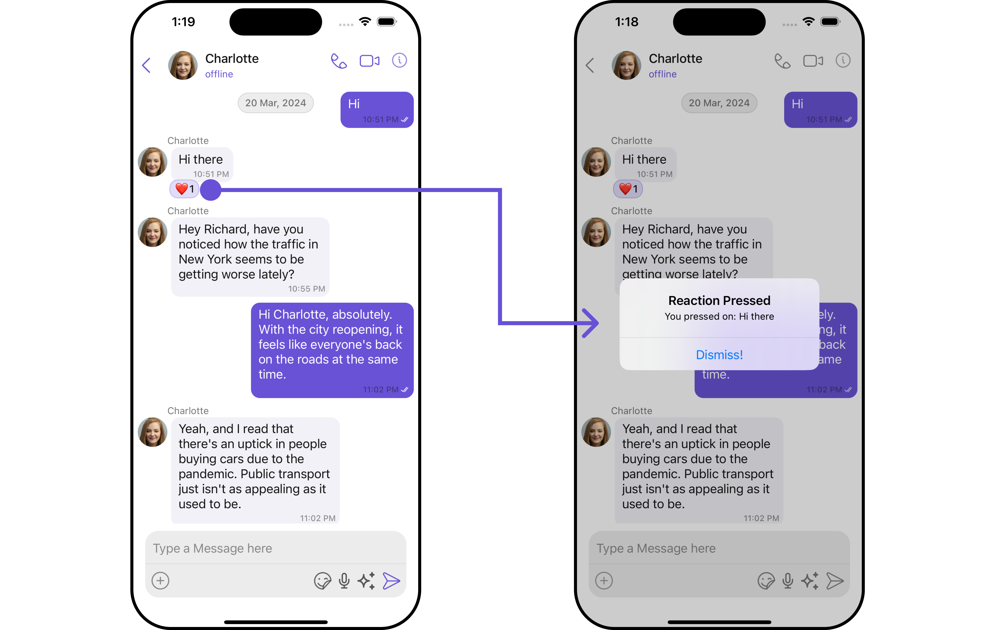
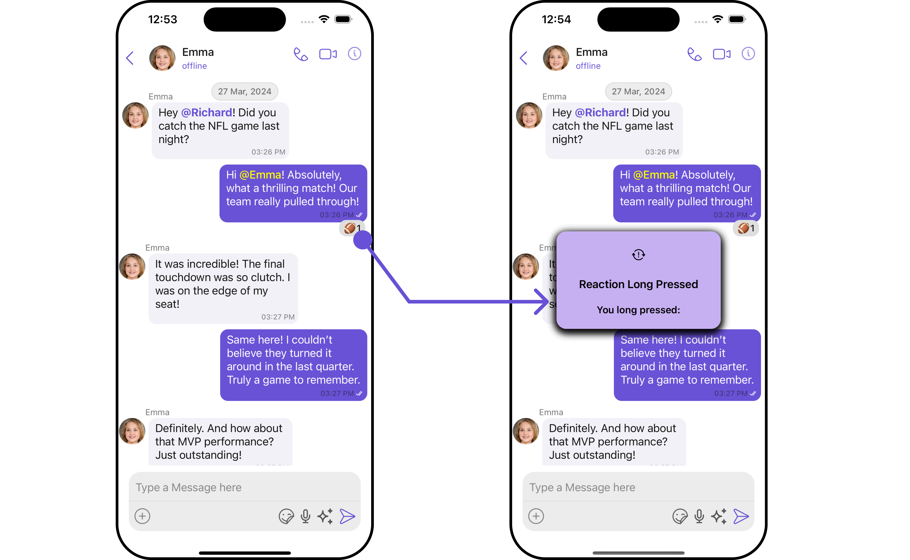

import Tabs from '@theme/Tabs';
import TabItem from '@theme/TabItem';

## Overview

The `CometChatReactions` component is designed to visually represent the reactions received by a message. Each reaction appears in a horizontal alignment beneath the message to indicate which emojis users have used to react.

The number of visible reactions depends on the width of the view. For example, if a message has 5 reactions but the CometChatReactions view can only accommodate 4 reactions within its width, the first three reactions will be displayed visibly. Additionally, an element will be added at the end of the row to indicate the number of other unique reactions that are not immediately visible. This element informs users of the total count of different reactions beyond those initially shown.



<!--  -->
<!--  -->

## Usage

### Integration

The `CometChatReactions` component is a standard **UIView** that displays a list of reactions as its children. In the provided UI example, it is utilized within the footer view of the CometChatMessageBubble. However, it is versatile and can be incorporated anywhere a **UIView** can be placed. The minimum requirement for this component to function is to provide the reactions to display, which can be passed using the baseMessage property.

```swift title='Swift'
let cometChatReaction = CometChatReactions()
    .set(message: forMessage)
    .build()

self.addSubViews(cometChatReaction)
```

### Actions

[Actions](/ui-kit/ios/components-overview#actions) dictate how a component functions. They are divided into two types: Predefined and User-defined. You can override either type, allowing you to tailor the behavior of the component to fit your specific needs.

##### 1. onReactionsPressed

The `onReactionsPressed` event is triggered when a user interacts with a reaction by pressing it, typically to indicate a response or provide feedback.

<Tabs>

<TabItem value="swift" label="Swift">
    ```swift
let reactionsConfiguration = ReactionsConfiguration()
    .set(onReactionsPressed: { reaction, baseMessage in
                
 })
    ```
</TabItem>

</Tabs>

**Example**
In this example, we are using the `onReactionsPressed` action.



```swift title='Swift'
let reactionsConfiguration = ReactionsConfiguration()
    .set(onReactionsPressed: { reaction, baseMessage in

let messageText = (baseMessage as? TextMessage)?.text ?? "a message"
let alertController = UIAlertController(title: "Reaction Pressed",
                                        message: "You pressed on: \(messageText)",
                                        preferredStyle: .alert)
alertController.addAction(UIAlertAction(title: "Dismiss!", style: .default, handler: nil))
UIApplication.shared.keyWindow?.rootViewController?.present(alertController, animated: true)
})

let messageListConfiguration = MessageListConfiguration()
    .set(reactionsConfiguration: reactionsConfiguration)

let messagesConfiguration = MessagesConfiguration()
    .set(messageListConfiguration: messageListConfiguration)

let cometChatConversationsWithMessages = CometChatConversationsWithMessages()
            .set(messagesConfiguration: messagesConfiguration)
```

---

### Filters

**Filters** empower you to customize the displayed data within a component's list by applying specific criteria. This capability allows for a more tailored and personalized view of the content. Filters are implemented using RequestBuilders of Chat SDK.

The `Reactions` component does not provide any exposed filtering options.

---

### Events

**Events** are triggered by a component, enabling you to enhance its functionality. These events are global in scope, making them applicable across multiple areas of your application, and they can be added or removed as required.

The `Reactions` component does not provide any available events.

---

## Customization

For customization aligned with your app's design, you can adjust the appearance of the Reaction component using our accessible methods. These methods enable you to tailor the experience and behavior to suit your specific needs.

### Style

Through Style, you can customize the visual presentation of the component in your app. This includes controlling elements such as color, size, shape, and fonts to achieve the desired look and feel.

##### 1. Reactions Style

The ReactionsStyle class encapsulates properties that facilitate customization of the CometChatReactions component's visual appearance.

<Tabs>

<TabItem value="swift" label="Swift">

```swift
let reactionsStyle = ReactionsStyle()
    .set(countFont: CometChatTheme.typography.text2)
    .set(reactionBorderWidth: 3)
    .set(background: .black)
```

</TabItem>

</Tabs>

**Example**

Here, we are applying the `reactionsStyle` to customize the appearance.



```swift title='Swift'
let reactionsStyle = ReactionsStyle()
    .set(countColor: .black)
    .set(emojiFont: .monospacedDigitSystemFont(ofSize: 10, weight: .bold))
    .set(reactionBorderWidth: 20)
    .set(activeReactionBackgroundColor: .systemYellow)
    .set(activeReactionBorderColor: .systemBrown)
    .set(activeReactionBorderWidth: 2)

let reactionsConfiguration = ReactionsConfiguration()
    .set(style: reactionsStyle)

let messageListConfiguration = MessageListConfiguration()
    .set(reactionsConfiguration: reactionsConfiguration)

let messagesConfiguration = MessagesConfiguration()
    .set(messageListConfiguration: messageListConfiguration)

let cometChatConversationsWithMessages = CometChatConversationsWithMessages()
    .set(messagesConfiguration: messagesConfiguration)

```

The following properties are exposed by MessageInformationStyle:

| Property                                                                                                         | Description                                                                 | Code                                                     |
| ---------------------------------------------------------------------------------------------------------------- | --------------------------------------------------------------------------- | -------------------------------------------------------- |
| **Background Color**                                                                                             | Sets the background color                                                   | `.set(background: UIColor)`                              |
| **Corner Radiu**                                                                                                 | Sets the corner radius                                                      | `.set(cornerRadius: CometChatCornerStyle)`               |
| **Border Width**                                                                                                 | Sets the width of the border                                                | `.set(borderWidth: CGFloat)`                             |
| **Border Color**                                                                                                 | Sets the color of the border                                                | `.set(borderColor: UIColor)`                             |
| **Emoji Font**                                                                                                   | Sets the font for all emojis                                                | `.set(emojiFont: UIFont)`                                |
| **Count Color**                                                                                                  | Sets the text color for emojis count                                        | `.set(countColor: UIColor)`                              |
| **Count Font**                                                                                                   | Sets the font for emojis count                                              | `.set(countFont: UIFont)`                                |
| **Active Reaction Font**                                                                                         | Sets the font for emojis i.e. reacted by the loggedIn user                  | `.set(activeReactionFont: UIFont)`                       |
| **Active Reaction TextColor**                                                                                    | Sets the text colour for emojis i.e. reacted by the loggedIn user           | `.set(activeReactionTextColor: UIColor)`                 |
| **Active Reaction Background Color**                                                                             | Sets the background color for emojis i.e. reacted by the loggedIn user      | `.set(activeReactionBackgroundColor: UIColor)`           |
| **Active Reaction Border Color**                                                                                 | Sets the border colour for emojis i.e. reacted by the loggedIn user         | `.set(activeReactionBorderColor: UIColor)`               |
| **Active Reaction Border Width**                                                                                 | Sets the border width for emojis i.e. reacted by the loggedIn user          | `.set(activeReactionBorderWidth: CGFloat)`               |
| **Active Reaction Corner Radius**                                                                                | Sets the corner radius for emojis i.e. reacted by the loggedIn user         | `.set(activeReactionCornerRadius: CometChatCornerStyle)` |
| **Reaction Font** <a data-tooltip-id="my-tooltip-html-prop"> <span class="material-icons red">report</span> </a> | Sets the Font for emojis i.e. not reacted by the loggedIn user              | `.set(reactionfont: CGFloat)`                            |
| **Reaction Text Color**                                                                                          | Sets the text colour for emojis i.e. not reacted by the loggedIn user       | `.set(reactionTextColor: UIColor)`                       |
| **Reaction Background Color**                                                                                    | Sets the background colour for emojis i.e. not reacted by the loggedIn user | `.set(reactionBackgroundColor: UIColor)`                 |
| **Reaction Border Color**                                                                                        | Sets the border colour for emojis i.e. not reacted by the loggedIn user     | `.set(reactionBorderColor: UIColor)`                     |
| **Reaction Corner Radiusr**                                                                                      | Sets the text color for the subtitle                                        | `.set(reactionCornerRadius: CometChatCornerStyle)`       |
| **Reaction Border Width**                                                                                        | Sets the border width for emojis i.e. not reacted by the loggedIn user      | `.set(reactionBorderWidth: CGFloat)`                     |

---

### Functionality

These functional customizations provide ways to enhance the component's overall experience. They allow for text modification, custom icon setting, and UI element visibility toggling.

<Tabs>

<TabItem value="swift" label="Swift">
```swift
let reactionsConfiguration = ReactionsConfiguration()
    .set(style: reactionsStyle)
    .set(reactionAlignment: .right)
            
let messageListConfiguration = MessageListConfiguration()
    .set(reactionsConfiguration: reactionsConfiguration)

let messagesConfiguration = MessagesConfiguration()
.set(messageListConfiguration: messageListConfiguration)

let cometChatConversationsWithMessages = CometChatConversationsWithMessages()
.set(messagesConfiguration: messagesConfiguration)

````
</TabItem>

</Tabs>

Below is a customizations list along with corresponding code snippets

| Property                                                                                                 | Description                                                                                                                        | Code                                                        |
| -------------------------------------------------------------------------------------------------------- | ---------------------------------------------------------------------------------------------------------------------------------- | ----------------------------------------------------------- |
| **onReactionsLongPressed** | This callback is triggered when a user long-presses a reaction.| `(( reaction: ReactionCount, baseMessage: BaseMessage?) -> ())?`|
| **onReactionsPressed** | This call back get trigger when a add reaction button is clicked.| `(( reaction: ReactionCount, baseMessage: BaseMessage?) -> ())?	`|
| **configuration** | Used to customize configuration for CometChatReactions..| `ReactionsConfiguration`|

## Configuration

[Configurations](/ui-kit/ios/components-overview#configurations) offer the ability to customize the properties of each component within a Composite Component.


### On Reactions Pressed

If you want to customize the properties of the Reaction `onReactionsPressed` Component inside Reactions Component, you need use the `ReactionsConfiguration` object.


<Tabs>
<TabItem value="swift" label="Swift">

```swift title='Swift'
let reactionsConfiguration = ReactionsConfiguration()
     .set(onReactionsPressed: { reaction, baseMessage in

})
````

</TabItem>
</Tabs>

**Example**



<!--  -->

```swift title='Swift'
let reactionsConfiguration = ReactionsConfiguration()
    .set(onReactionsPressed: { reaction, baseMessage in

let messageText = (baseMessage as? TextMessage)?.text ?? "a message"
let alertController = UIAlertController(title: "Reaction Pressed",
                                        message: "You pressed on: \(messageText)",
                                        preferredStyle: .alert)
alertController.addAction(UIAlertAction(title: "Dismiss!", style: .default, handler: nil))
UIApplication.shared.keyWindow?.rootViewController?.present(alertController, animated: true)
})

let messageListConfiguration = MessageListConfiguration()
    .set(reactionsConfiguration: reactionsConfiguration)

let messagesConfiguration = MessagesConfiguration()
    .set(messageListConfiguration: messageListConfiguration)

let cometChatConversationsWithMessages = CometChatConversationsWithMessages()
            .set(messagesConfiguration: messagesConfiguration)
```

<!--  -->

In the example above, we are customizing specific properties of the Reactions component using `ReactionsConfigurations`.

### On Reactions LongPressed

If you want to customize the properties of the Reaction `onReactionsLongPressed` Component inside Reactions Component, you need use the `ReactionsConfiguration` object.

<Tabs>
<TabItem value="swift" label="Swift">

```swift title='Swift'
let reactionsConfiguration = ReactionsConfiguration()
    .set (onReactionsLongPressed:{ reaction, baseMessage in

 })
```

</TabItem>
</Tabs>

**Example**



<!--  -->

<Tabs>
<TabItem value="swift" label="Swift">

```swift title='Custom_alert_View.swift'
import UIKit

class CustomAlertView: UIView {
    let titleLabel: UILabel = {
    let label = UILabel()
        label.textAlignment = .center
        label.font = UIFont.boldSystemFont(ofSize: 17)
        label.textColor = .black
        return label
}()

    let messageLabel: UILabel = {
        let label = UILabel()
        label.textAlignment = .center
        label.font = UIFont.boldSystemFont(ofSize: 15)
        label.textColor = .black
        return label
}()

    let iconImageView: UIImageView = {
    let imageView = UIImageView(image: UIImage(systemName: "exclamationmark.arrow.triangle.2.circlepath"))
        imageView.tintColor = .black
        imageView.contentMode = .scaleAspectFit
        return imageView
 }()

    var timer: Timer?

    init(title: String, message: String, icon: UIImage? = nil) {
            super.init(frame: .zero)
            titleLabel.text = title
            messageLabel.text = message
            if let icon = icon {
                iconImageView.image = icon
            }
        setupView()
}

    required init?(coder: NSCoder) {
        fatalError("init(coder:) has not been implemented")
    }

    func setupView() {
        backgroundColor = .init(red: 0.78, green: 0.69, blue: 0.95, alpha: 1.00)
        layer.cornerRadius = 15
        layer.shadowColor = UIColor.black.cgColor
        layer.shadowOpacity = 0.5
        layer.shadowOffset = CGSize(width: 0, height: 4)
        layer.shadowRadius = 6

        addSubview(iconImageView)
        addSubview(titleLabel)
        addSubview(messageLabel)

        iconImageView.translatesAutoresizingMaskIntoConstraints = false
        titleLabel.translatesAutoresizingMaskIntoConstraints = false
        messageLabel.translatesAutoresizingMaskIntoConstraints = false

        NSLayoutConstraint.activate([
            iconImageView.topAnchor.constraint(equalTo: topAnchor, constant: 20),
            iconImageView.centerXAnchor.constraint(equalTo: centerXAnchor),
            iconImageView.heightAnchor.constraint(equalToConstant: 30),

            titleLabel.topAnchor.constraint(equalTo: iconImageView.bottomAnchor, constant: 20),
            titleLabel.leadingAnchor.constraint(equalTo: leadingAnchor, constant: 20),
            titleLabel.trailingAnchor.constraint(equalTo: trailingAnchor, constant: -20),

            messageLabel.topAnchor.constraint(equalTo: titleLabel.bottomAnchor, constant: 20),
            messageLabel.leadingAnchor.constraint(equalTo: leadingAnchor, constant: 20),
            messageLabel.trailingAnchor.constraint(equalTo: trailingAnchor, constant: -20),

            messageLabel.bottomAnchor.constraint(equalTo: bottomAnchor, constant: -20)
        ])
 }

    func showAlert(in view: UIView) {
        view.addSubview(self)
        translatesAutoresizingMaskIntoConstraints = false
        centerYAnchor.constraint(equalTo: view.centerYAnchor).isActive = true
        centerXAnchor.constraint(equalTo: view.centerXAnchor).isActive = true
        widthAnchor.constraint(equalToConstant: 250).isActive = true
        alpha = 0

        UIView.animate(withDuration: 0.1) { self.alpha = 1 }

        timer?.invalidate()
        timer = Timer.scheduledTimer(withTimeInterval: 2.0, repeats: false) { _ in
          UIView.animate(withDuration: 0.2) {
                self.alpha = 0
            } completion: { _ in
                self.removeFromSuperview()
            }
        }
    }
}

```

</TabItem>
</Tabs>

Make sure to pass the CustomAlertView file to `ReactionsConfigurations`

```swift title='Swift'
let reactionsConfiguration = ReactionsConfiguration()
    .set(onReactionsLongPressed: { reaction, baseMessage in
let title = "Reaction Long Pressed"
let message = "You long pressed:"
let alertView = CustomAlertView(title: title, message: message)
    alertView.showAlert(in: UIApplication.shared.keyWindow!)
})

let messageListConfiguration = MessageListConfiguration()
    .set(reactionsConfiguration: reactionsConfiguration)

let messagesConfiguration = MessagesConfiguration()
    .set(messageListConfiguration: messageListConfiguration)

let cometChatConversationsWithMessages = CometChatConversationsWithMessages()
    .set(messagesConfiguration: messagesConfiguration)
```

<!--  -->

In the example above, we are customizing specific properties of the Reactions component using `ReactionsConfigurations`.

import { Tooltip } from 'react-tooltip'
import 'react-tooltip/dist/react-tooltip.css'

<Tooltip
  id="my-tooltip-html-prop"
  html="Not available "
/>
