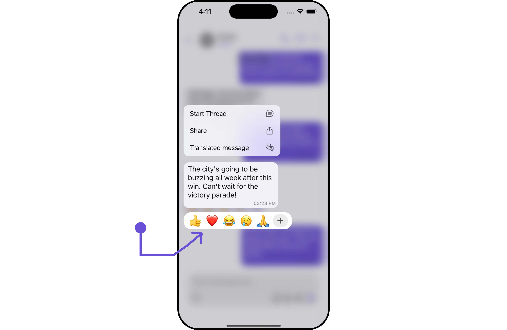
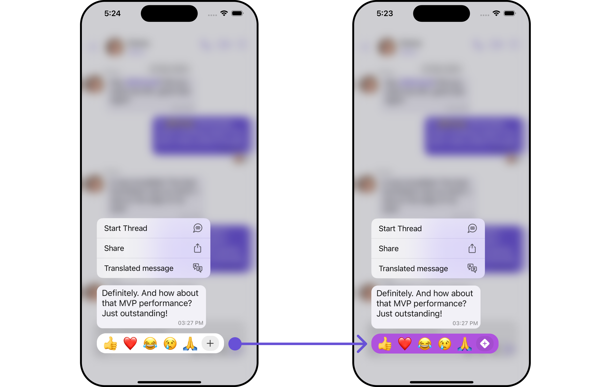
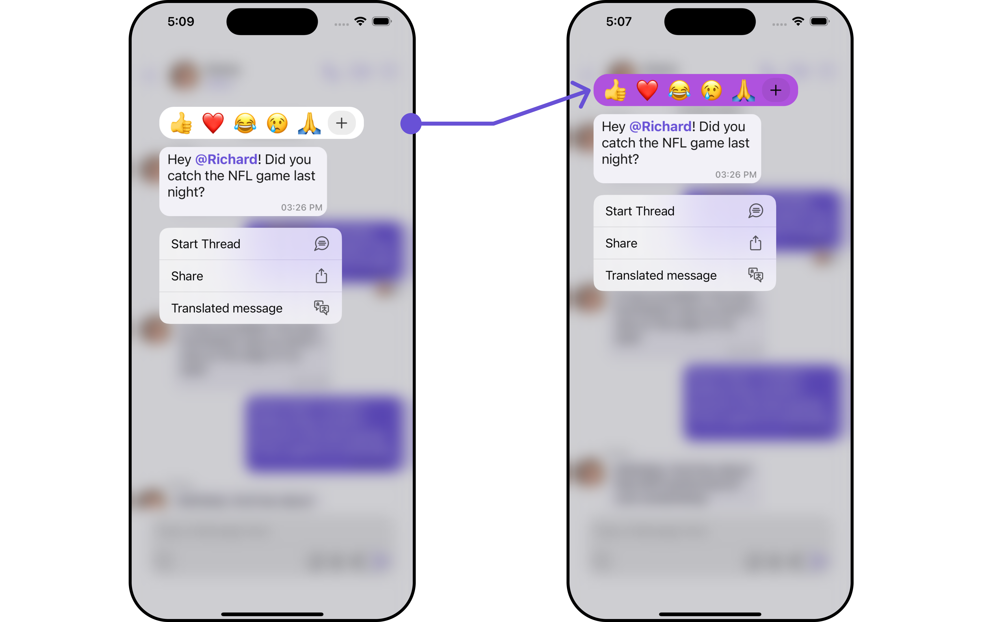
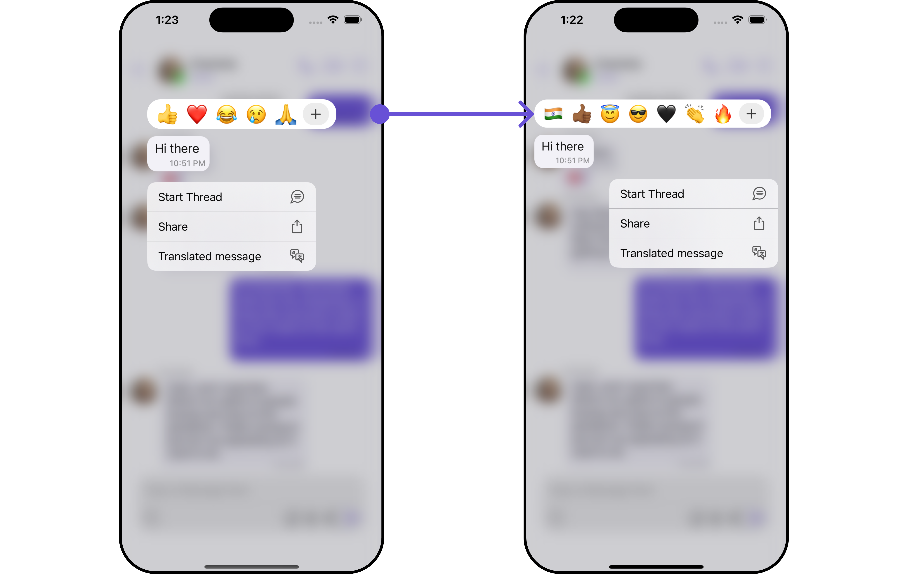

import Tabs from '@theme/Tabs';
import TabItem from '@theme/TabItem';

## Overview

`CometChatQuickReactions` is a `UIView` component designed for displaying a row of reactions that users can apply to messages. Initially, it shows favorite reactions along with a plus icon. Tapping the plus icon opens the CometChatEmojiKeyboard, providing access to a broader range of reactions. Selecting a reaction from the keyboard or the favorite reactions list automatically applies it to the respective message.

The number of reactions shown depends on the message bubble width. If the message bubble can only fit a limited number of reactions, it displays the first few with an indicator for additional reactions not immediately visible. This indicator informs users of the total number of reactions available.

This component is typically activated by long-pressing a message bubble in the message list.



## Usage

### Integration

`CometChatQuickReactions` is a standard UIView that displays a list of favorite reactions with a plus button. It's showcased in the UIContextMenu for CometChatMessageBubble but is versatile enough to be used in various `UIView` contexts. The component requires a list of favorite reactions to function, which can be supplied using the reactions property.

```swift title='Swift'
let reactionView = CometChatQuickReactions()
    .set(reactions: ["👍", "❤️", "😂", "😢", "🙏"])
    .build() //this method will start building the UI

self.addSubviews(reactionView)
```

### Actions

[Actions](/ui-kit/ios/components-overview#actions) dictate how a component functions. They are divided into two types: Predefined and User-defined. You can override either type, allowing you to tailor the behavior of the component to fit your specific needs.

##### 1. AddReactionIcon

The `addReactionIcon` does customize the add reaction button icon.
<Tabs>

<TabItem value="swift" label="Swift">
    ```swift
let quickReactionsStyle = QuickReactionsStyle()
    .set(background: .systemPurple)
    .set(plusIconTintColor: .white)

let quickReactionsConfiguration = QuickReactionsConfiguration()
.set(style: quickReactionsStyle)
.set(addReactionIcon: UIImage(systemName: "plus.diamond.fill"))

let messageListConfiguration = MessageListConfiguration()
.set(quickReactionsConfiguration: quickReactionsConfiguration)

let messagesConfiguration = MessagesConfiguration()
.set(messageListConfiguration: messageListConfiguration)

let cometChatConversationsWithMessages = CometChatConversationsWithMessages()
.set(messagesConfiguration: messagesConfiguration)

    ```

</TabItem>

</Tabs>

**Example**

In this example, we are using the `addReactionIcon` action.



##### 2. On Reacted

The `onReacted` callback is triggered when a reaction is selected.

```swift title='Swift'
let quickReactionsConfiguration = QuickReactionsConfiguration()
    .set (onReacted:{ reaction in
        //Perform your Action

})
```

##### 3. On AddReaction Icon Tapped

The `onAddReactionIconTapped` callback is triggered when the add reaction button is clicked.

```swift title='Swift'
let reactionView = CometChatQuickReactions()
    .set(onAddReactionIconTapped: {
    //Perform Your Action

})
```

---

### Filters

**Filters** empower you to customize the displayed data within a component's list by applying specific criteria. This capability allows for a more tailored and personalized view of the content. Filters are implemented using RequestBuilders of Chat SDK.

The ` Quick Reactions` component does not provide any exposed filtering options.

---

### Events

**Events** are triggered by a component, enabling you to enhance its functionality. These events are global in scope, making them applicable across multiple areas of your application, and they can be added or removed as required.

The `Quick Reactions` component does not provide any available events.

---

## Customization

For customization aligned with your app's design, you can adjust the appearance of the Quick Reaction component using our accessible methods. These methods enable you to tailor the experience and behavior to suit your specific needs.

### Style

Through Style, you can customize the visual presentation of the component in your app. This includes controlling elements such as color, size, shape, and fonts to achieve the desired look and feel.

##### 1. Quick Reaction Style

`QuickReactionsStyle` is a class designed for customizing the visual styles of the CometChatQuickReactions view. It enables developers to easily modify colors, borders, backgrounds, and other visual attributes to align the QuickReactions component with the overall design aesthetics of their application.

This class is essential for enhancing user experience and ensuring visual consistency within the messaging interface.

<Tabs>

<TabItem value="swift" label="Swift">

```swift
let quickReactionsStyle = QuickReactionsStyle()
    .set(background: .systemPurple)
    .set(plusIconTintColor: .black)

let quickReactionsConfiguration = QuickReactionsConfiguration()
    .set(style: quickReactionsStyle)

let messageListConfiguration = MessageListConfiguration()
    .set(quickReactionsConfiguration: quickReactionsConfiguration)

let messagesConfiguration = MessagesConfiguration()
    .set(messageListConfiguration: messageListConfiguration)

let cometChatConversationsWithMessages = CometChatConversationsWithMessages()
    .set(messagesConfiguration: messagesConfiguration)
```

</TabItem>

</Tabs>

**Example**

Here, we are applying the `QuickReactionsStyle` to customize the appearance.



The following properties are exposed by MessageInformationStyle:

| Property                       | Description                                | Code                                               |
| ------------------------------ | ------------------------------------------ | -------------------------------------------------- |
| **Background Color**           | Sets the background color                  | `.set(background: UIColor)`                        |
| **Corner Radius**              | Sets the corner radius                     | `.set(cornerRadius: CometChatCornerStyle)`         |
| **Border Width**               | Sets the width of the border               | `.set(borderWidth: CGFloat)`                       |
| **Border Color**               | Sets the color of the border               | `.set(borderColor: UIColor)`                       |
| **PlusIcon Background Color**  | Sets the background color for the plusicon | `.set(plusIconBackgroundColor: UIColor)`           |
| **PlusIcon Tint Color**        | Sets the tint color of plusicon            | `.set(plusIconTintColor: UIColor)`                 |
| **PlusIcon Corner Radius**     | Sets the corner radius of the plusicon     | `.set(plusIconCornerRadius: CometChatCornerStyle)` |
| **Reactions Background Color** | Sets the background color of the reactions | `.set(reactionsBackgroundColor: UIColor)`          |
| **Reaction Font**              | Sets the text appearance                   | `.set(reactionFont: UIFont)`                       |
| **Reaction Corner Radius**     | Sets the corner radius of reactions        | `.set(reactionCornerRadius: CometChatCornerStyle)` |

---

### Functionality

These functional customizations provide ways to enhance the component's overall experience. They allow for text modification, custom icon setting, and UI element visibility toggling.

<Tabs>

<TabItem value="swift" label="Swift">
```swift
let reactionView = CometChatQuickReactions()
    .set(addReactionIcon: UIImage?)
         
```
</TabItem>

</Tabs>

**Example**

In this illustrative example, we empower users to engage more dynamically within `CometChatConversationsWithMessages` by incorporating `Quick Reactions`.

By leveraging custom configurations, such as `QuickReactionsStyle` and `QuickReactionsConfiguration`, users can seamlessly add reactions to `messages`, enriching their communication experience. Notably, we've fine-tuned the visual aspects, setting the background color to systemPurple and ensuring clarity with a white plus icon.

Additionally, we've opted for a visually appealing plus diamond icon as the add reaction option, enhancing the overall user interaction.


<Tabs>

<TabItem value="swift" label="Swift">
```swift
let quickReactionsStyle = QuickReactionsStyle()
.set(background: .systemPurple)
.set(plusIconTintColor: .white)

let quickReactionsConfiguration = QuickReactionsConfiguration()
.set(style: quickReactionsStyle)
.set(addReactionIcon: UIImage(systemName: "plus.diamond.fill"))

let messageListConfiguration = MessageListConfiguration()
.set(quickReactionsConfiguration: quickReactionsConfiguration)

let messagesConfiguration = MessagesConfiguration()
.set(messageListConfiguration: messageListConfiguration)

let cometChatConversationsWithMessages = CometChatConversationsWithMessages()
.set(messagesConfiguration: messagesConfiguration)

````
</TabItem>

</Tabs>

Below is a customizations list along with corresponding code snippets

| Property            | Description                                  | Code                              |
| ------------------- | -------------------------------------------- | --------------------------------- |
| **addReactionIcon** | used to set custom add reaction button icon. | `.set(addReactionIcon: UIImage?)` |

### Advanced

For advanced-level customization, you can set custom views to the component. This lets you tailor each aspect of the component to fit your exact needs and application aesthetics. You can create and define your views, layouts, and UI elements and then incorporate those into the component.

---

#### Reaction List

To customize the reactions displayed in your **Quick** **Reactions** component, you can use the `setReactionList( )` method. This method allows you to pass a custom list of reactions, which will override the default reaction list functionality.
By utilizing this method, you can tailor the reactions displayed in your application to meet specific requirements.

<Tabs>

<TabItem value="swift" label="Swift">

```swift
let quickReactionsConfiguration = QuickReactionsConfiguration()
    .set(reactionList: [String]?)
````

</TabItem>

</Tabs>

**Example**



In this example, we will pass a custom list of reactions.

```swift title="Swift"
let customReactions: [String] = ["🇮🇳", "👍🏾", "😇", "😎", "🖤", "👏", "🔥"]

let quickReactionsConfiguration = QuickReactionsConfiguration()
    .set(reactionList: customReactions)

let messageListConfiguration = MessageListConfiguration()
    .set(quickReactionsConfiguration: quickReactionsConfiguration)

let messagesConfiguration = MessagesConfiguration()
    .set(messageListConfiguration: messageListConfiguration)

let cometChatConversationsWithMessages = CometChatConversationsWithMessages()
    .set(messagesConfiguration: messagesConfiguration)
```

:::info
Ensure to pass and present `CometChatConversationsWithMessages`. If a navigation controller is already in use, utilize the pushViewController function instead of directly presenting the view controller.
:::

---
