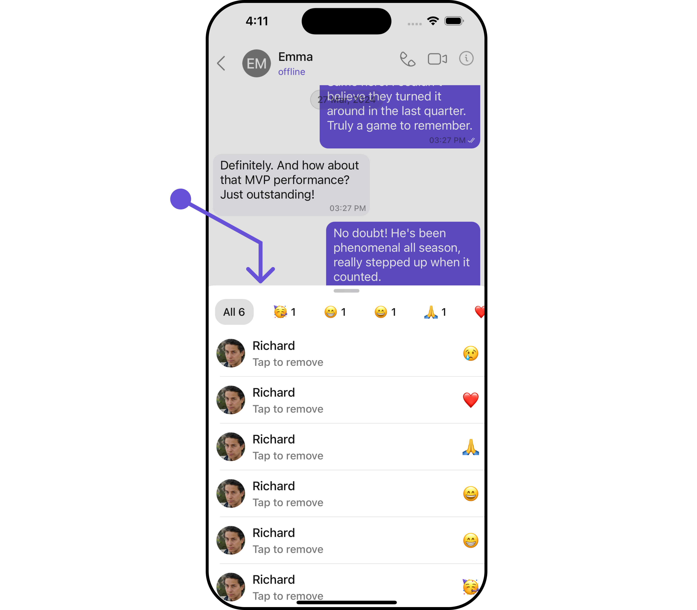
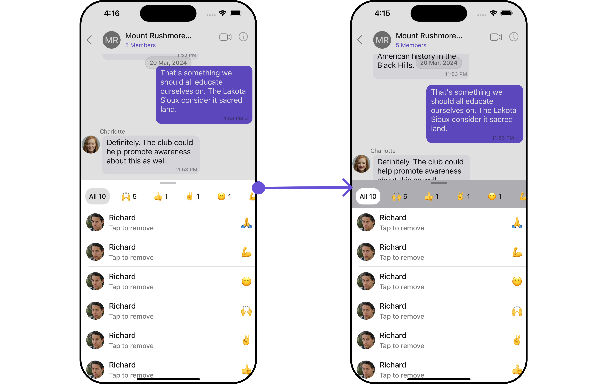
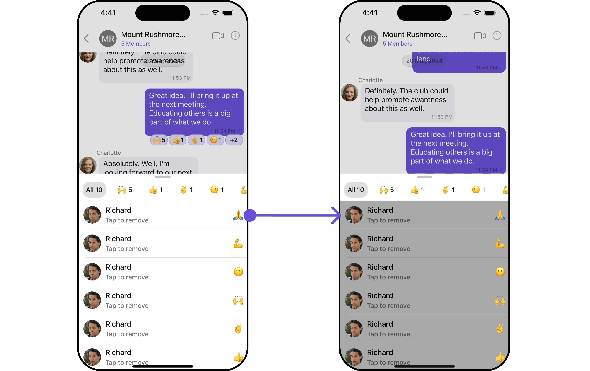

import Tabs from '@theme/Tabs';
import TabItem from '@theme/TabItem';

## Overview

The `CometChatReactionsList` component is designed to manage and display reactions associated with messages. It offers a user-friendly interface for users to express their reactions to messages and provides options to remove reactions when necessary. The component intelligently organizes reactions by emoji, giving a clear overview of the variety of reactions for a message along with details of who reacted with each emoji.

The component consists of two distinct lists: one at the top with horizontal scrolling to display unique reactions and their counts, allowing users to select reactions for further details. The middle list shows selected reactions and the users who reacted to them.

Additionally, the interface seamlessly integrates functionality to remove reactions added by the logged-in user.



## Usage

### Integration

`CometChatReactionList` is a **UIViewController** that contains a list of reactions. It is commonly used within the CometChatMessageList, but it can be integrated into any **UIViewController**. The component requires a list of reactions (provided via the baseMessage) to function properly.

```swift
let reactionList = CometChatReactionList()
    .set(message: message)

//presenting in half sheet format
if let presentationController = reactionList.presentationController as? UISheetPresentationController {
    presentationController.detents = [.medium()]
    presentationController.prefersGrabberVisible = true
    self.present(reactionList, animated: true)
}
```

:::info
If you are already using a `navigation controller`, you can use the `pushViewController` function instead of presenting the view controller.
:::

### Actions

[Actions](/ui-kit/ios/components-overview#actions) dictate how a component functions. They are divided into two types: Predefined and User-defined. You can override either type, allowing you to tailor the behavior of the component to fit your specific needs.

##### 1. OnClick

The `onClick` event is triggered when a user interacts with a reaction by pressing it, typically to indicate a response or provide feedback.

<Tabs>

<TabItem value="swift" label="Swift">
    ```swift
let reactionList = CometChatReactionList()
    .set { messageReaction, messageObject in
                //Perform your actions
}
    ```
</TabItem>

</Tabs>

<!-- **Example**

In this example, we are using the `OnClick` action. -->

##### 2. OnTappedToRemoveClicked

The `onTappedToRemoveClicked` callback is triggered when a list item is tapped to remove.

<Tabs>

<TabItem value="swift" label="Swift">
    ```swift
let reactionListConfiguration = ReactionListConfiguration()
    .set (onTappedToRemoveClicked:{ messageReaction, messageObject in
            //Perform Your Action
 })
    ```
</TabItem>

</Tabs>

---

### Filters

**Filters** enable customization of the displayed data in a `component`'s list by applying specific criteria. Using the `ReactionsRequestBuilder` in the Reaction List Component, you can customize your reaction list based on various options to suit your requirements. For more information about ReactionsRequestBuilder, refer to the documentation on [ReactionsRequestBuilder](/sdk/ios/reactions).

In the example below, we illustrate how to apply a filter to the reactions list, allowing you to specify a limit on the number of users who have reacted to a particular message.

```swift title='Swift'
let reactionsRequestBuilder = ReactionsRequestBuilder()
    .set(limit: 2)

let reactionListConfiguration = ReactionListConfiguration()
    .set(reactionRequestBuilder: reactionsRequestBuilder)

let messageListConfiguration = MessageListConfiguration()
    .set(reactionListConfiguration: reactionListConfiguration)

let messagesConfiguration = MessagesConfiguration()
    .set(messageListConfiguration: messageListConfiguration)

let cometChatConversationsWithMessages = CometChatConversationsWithMessages()
    .set(messagesConfiguration: messagesConfiguration)
```

:::info
Ensure to pass and present `CometChatConversationsWithMessages`. If a navigation controller is already in use, utilize the pushViewController function instead of directly presenting the view controller.

:::

<!-- The `Reactions List` component does not provide any exposed filtering options. -->

---

### Events

**Events** are triggered by a component, enabling you to enhance its functionality. These events are global in scope, making them applicable across multiple areas of your application, and they can be added or removed as required.

The `Reactions List` component does not provide any available events.

---

## Customization

For customization aligned with your app's design, you can adjust the appearance of the Reaction List component using our accessible methods. These methods enable you to tailor the experience and behavior to suit your specific needs.

### Style

Through Style, you can customize the visual presentation of the component in your app. This includes controlling elements such as color, size, shape, and fonts to achieve the desired look and feel.

##### 1. Reactions List Style

The ReactionsListStyle class encapsulates properties that facilitate customization of the `CometChatReactionsList` component's visual appearance.

<Tabs>

<TabItem value="swift" label="Swift">

```swift
let reactionListStyle = ReactionListStyle()
    .set(background: .systemGray2)
    .set(loadingTint: .darkGray)
    .set(errorTextColor: .black)
    .set(activeEmojiBackgroundColor: .white)
    .set(activeEmojiCornerRadius: CometChatCornerStyle(cornerRadius: 5))

 let reactionListConfiguration = ReactionListConfiguration()
    .set(style: reactionListStyle)

let messageListConfiguration = MessageListConfiguration()
    .set(reactionListConfiguration: reactionListConfiguration)

let messagesConfiguration = MessagesConfiguration()
    .set(messageListConfiguration: messageListConfiguration)

let cometChatConversationsWithMessages = CometChatConversationsWithMessages()
    .set(messagesConfiguration: messagesConfiguration)
```

</TabItem>

</Tabs>

**Example**

Here, we are applying the `ReactionsListStyle` to customize the appearance using `setStyle` method.



The following properties are exposed by ReactionListStyle:

| Property                          | Description                                                    | Code                                                  |
| --------------------------------- | -------------------------------------------------------------- | ----------------------------------------------------- |
| **Background Color**              | Sets the background color                                      | `.set(background: UIColor)`                           |
| **Corner Radius**                 | Sets the corner radius                                         | `.set(cornerRadius: CometChatCornerStyle)`            |
| **Border Width**                  | Sets the width of the border                                   | `.set(borderWidth: CGFloat)`                          |
| **Border Color**                  | Sets the color of the border                                   | `.set(borderColor: UIColor)`                          |
| **Subtitle Color**                | Sets the subtitle color that has "Tap to remove" text          | `.set(subtitleColor: UIColor)`                        |
| **Subtitle Font**                 | Sets the font for subtitle that has "Tap to remove" text       | `.set(subtitleFont: UIFont)`                          |
| **TailView Font**                 | Sets the font for tailView that has reaction                   | `.set(tailViewFont: UIFont)`                          |
| **Active Emoji Background Color** | Sets the background color for selected emoji in the top slider | `.set(activeEmojiBackgroundColor: UIColor)`           |
| **Slider Emoji Count Color**      | Sets the UIColor for emojies count text in the top slidersl    | `.set(sliderEmojiCountColor: UIColor)`                |
| **Error Text Color**              | Sets the color for error text                                  | `.set(errorTextColor: UIColor)`                       |
| **Error TextFont**                | Sets the error font                                            | `.set(errorTextFont: UIFont)`                         |
| **Loading Tint**                  | Sets the loading tint color for loading spinner                | `.set(loadingTint: UIColor)`                          |
| **Active Emoji Corner Radius**    | Sets the corner radius for selected emoji in the top slider    | `.set(activeEmojiCornerRadius: CometChatCornerStyle)` |

##### 2. Avatar Style <a data-tooltip-id="my-tooltip-html-prop"> <span class="material-icons red">report</span> </a>

<Tooltip
  id="my-tooltip-html-prop"
  html="Not available"
/>

If you want to apply customized styles to the `Avatar` component within the `Reaction List` Component, you can use the following code snippet. For more information you can refer [Avatar Styles](/ui-kit/ios/avatar#methods).

<Tabs>
<TabItem value="swift" label="Swift">

```swift
let avatarStyle = AvatarStyle()
    .set(background: .red)
    .set(borderColor: .green)

let reactionListConfiguration = ReactionListConfiguration()
    .set(avatarStyle: avatarStyle)

let messageListConfiguration = MessageListConfiguration()
    .set(reactionListConfiguration: reactionListConfiguration)

let messagesConfiguration = MessagesConfiguration()
    .set(messageListConfiguration: messageListConfiguration)

let cometChatConversationsWithMessages = CometChatConversationsWithMessages()
    .set(messagesConfiguration: messagesConfiguration)
```

</TabItem>
</Tabs>

##### 3. ListItem Style

If you want to apply customized styles to the `ListItemStyle` component within the `Reaction List` Component, you can use the following code snippet. For more information, you can refer [ListItem Styles](/ui-kit/ios/list-item#set-listitem-style).



<Tabs>
<TabItem value="swift" label="Swift">

```swift
let listitemStyle  = ListItemStyle()
    .set(background: .lightGray)
    .set(borderColor: .cyan)
    .set(titleColor: .black)
    .set(selectionIconTint: .green)

let reactionListConfiguration = ReactionListConfiguration()
    .set(listItemStyle: listitemStyle)

let messageListConfiguration = MessageListConfiguration()
    .set(reactionListConfiguration: reactionListConfiguration)

let messagesConfiguration = MessagesConfiguration()
    .set(messageListConfiguration: messageListConfiguration)

let cometChatConversationsWithMessages = CometChatConversationsWithMessages()
    .set(messagesConfiguration: messagesConfiguration)
```

</TabItem>
</Tabs>

---

### Functionality

These functional customizations provide ways to enhance the component's overall experience. They allow for text modification, custom icon setting, and UI element visibility toggling.

The `Reactions List` component does not offer any additional functionality.

### Advanced

For advanced-level customization, you can set custom views to the component. This lets you tailor each aspect of the component to fit your exact needs and application aesthetics. You can create and define your views, layouts, and UI elements and then incorporate those into the component.

---

#### Loading State View

You can customize the loading state view in your **Reaction List** by using the `.setLoadingStateView()` method.
This method allows you to set a custom loading view that will be displayed while the reaction list is loading. It's important to note that using this method will **override** the default loading state functionality of the component.

<Tabs>

<TabItem value="swift" label="Swift">

```swift
let reactionListConfiguration = ReactionListConfiguration()
    .set(loadingStateView: UIView?)
```

</TabItem>

</Tabs>

**Example**

<!--  -->

In this example, we will create a UIView file `custom_loading_View`.

```swift title="CustomLoadingView"
class CustomLoadingView: UIView {
    let activityIndicator = UIActivityIndicatorView(style: .large)

    override init(frame: CGRect) {
        super.init(frame: frame)
        self.backgroundColor = UIColor.black.withAlphaComponent(0.8)
        setupActivityIndicatorView()
    }

    required init?(coder: NSCoder) {
        fatalError("init(coder:) has not been implemented")
    }

    private func setupActivityIndicatorView() {
        addSubview(activityIndicator)
        activityIndicator.startAnimating()
    }
}
```

we will pass the `custom_loading_View` to `ReactionListConfiguration`.

```swift title='Swift'
let customLoadingView = CustomLoadingView()

let reactionListConfiguration = ReactionListConfiguration()
    .set(loadingStateView: customLoadingView)

let messageListConfiguration = MessageListConfiguration()
    .set(reactionListConfiguration: reactionListConfiguration)

let messagesConfiguration = MessagesConfiguration()
    .set(messageListConfiguration: messageListConfiguration)

let cometChatConversationsWithMessages = CometChatConversationsWithMessages()
    .set(messagesConfiguration: messagesConfiguration)
```

:::info
Ensure to pass and present `CometChatConversationsWithMessages`. If a navigation controller is already in use, utilize the pushViewController function instead of directly presenting the view controller.
:::

---

#### Error State View

You can customize the error state view in your **Reaction List** by using the `.setErrorStateView()` method. This method allows you to set a custom error view that will be displayed when there's an error in loading the reaction list. It's important to note that using this method will **override** the default error state functionality of the component.

<Tabs>

<TabItem value="swift" label="Swift">

```swift
 let reactionListConfiguration = ReactionListConfiguration()
    .set(errorStateView: UIView?)
```

</TabItem>

</Tabs>

**Example**

<!--  -->

In this example, we will create a UIView file `Custom_Error_View`.

```swift title="CustomLoadingView"
import UIKit

class CustomErrorView: UIView {
    private let errorLabel = UILabel()

    override init(frame: CGRect) {
        super.init(frame: frame)
        setupErrorLabel()
    }

    required init?(coder: NSCoder) {
        fatalError("init(coder:) has not been implemented")
    }

    private func setupErrorLabel() {
        errorLabel.translatesAutoresizingMaskIntoConstraints = false
        errorLabel.text = "An error occurred. Please try again."
        errorLabel.textAlignment = .center
        errorLabel.textColor = .white
        errorLabel.font = UIFont.systemFont(ofSize: 15, weight: .medium)
        addSubview(errorLabel)

        NSLayoutConstraint.activate([
            errorLabel.centerXAnchor.constraint(equalTo: self.centerXAnchor),
            errorLabel.centerYAnchor.constraint(equalTo: self.centerYAnchor)
        ])

        self.backgroundColor = .red
    }
}

```

we will pass the `Custom_Error_View` to `ReactionListConfiguration`.

```swift title='Swift'
let customErrorView = CustomErrorView()

let reactionsRequestbuilder = ReactionsRequestBuilder()
    .set(limit: 1000)

let reactionListConfiguration = ReactionListConfiguration()
    .set(errorStateView: customErrorView)
    .set(reactionRequestBuilder: reactionsRequestbuilder)

let messageListConfiguration = MessageListConfiguration()
    .set(reactionListConfiguration: reactionListConfiguration)

let messagesConfiguration = MessagesConfiguration()
    .set(messageListConfiguration: messageListConfiguration)

let cometChatConversationsWithMessages = CometChatConversationsWithMessages()
    .set(messagesConfiguration: messagesConfiguration)
```

:::info
Ensure to pass and present `CometChatConversationsWithMessages`. If a navigation controller is already in use, utilize the pushViewController function instead of directly presenting the view controller.
:::

---

import { Tooltip } from 'react-tooltip'
import 'react-tooltip/dist/react-tooltip.css'

<Tooltip
  id="my-tooltip-html-prop"
  html="Not available "
/>
