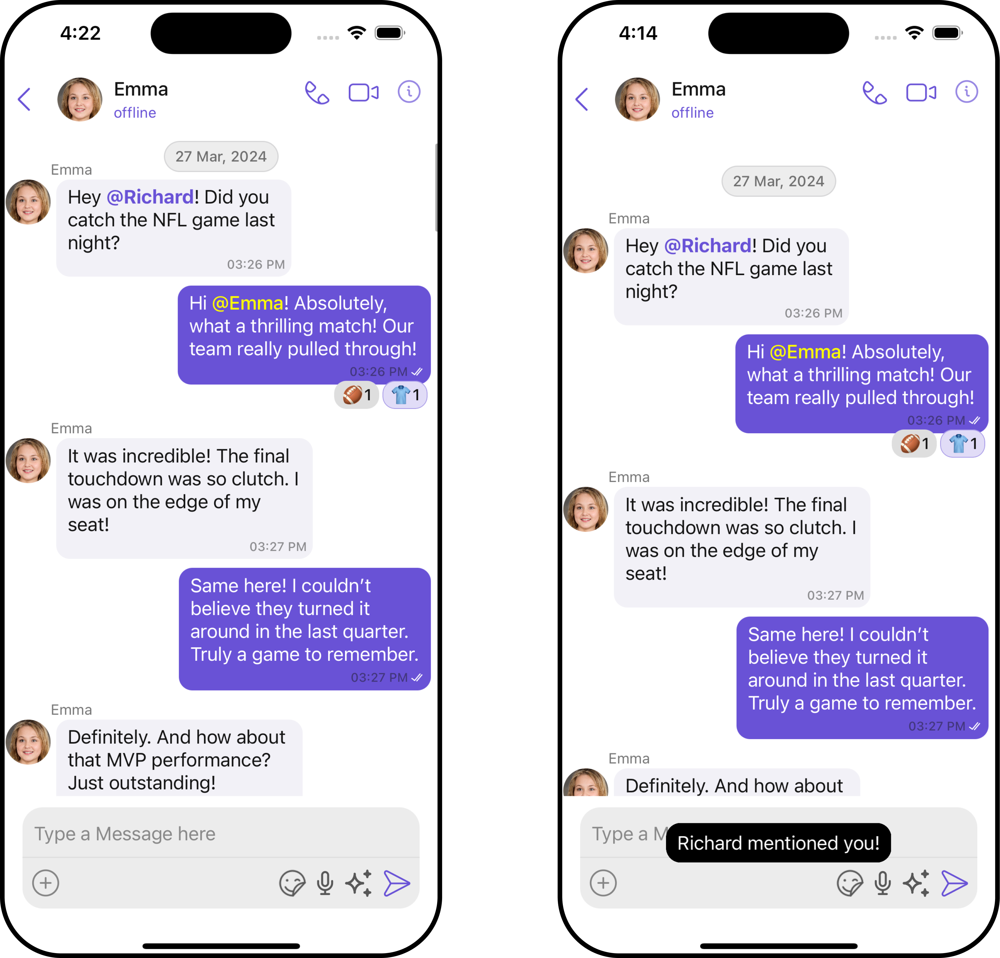
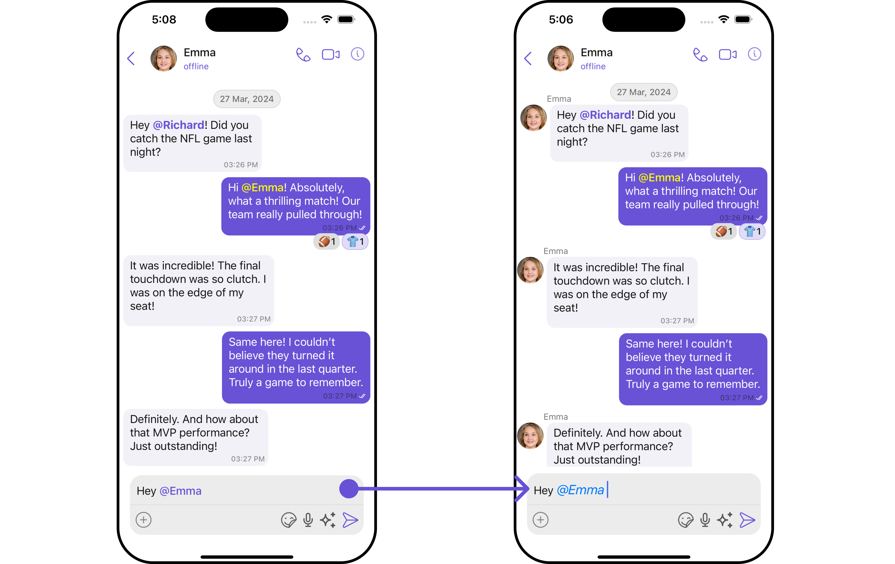

import Tabs from '@theme/Tabs';
import TabItem from '@theme/TabItem';

## Overview

The `CometChatMentionsFormatter` class is a part of the CometChat UI Kit, a ready-to-use chat UI component library for integrating CometChat into your iOS applications. This class provides functionality to format mentions within text messages displayed in the chat interface. Mentions allow users to reference other users within a conversation, providing a convenient way to direct messages or involve specific participants.

## Features

- **Mention Formatting**: Automatically formats mentions within text messages based on provided styles and settings.
- **Customizable Styles**: Allows customization of text styles for mentions, including colors, fonts, and background colors.
- **User and Group Member Mentions**: Supports mentions for both individual users and group members, providing flexibility in communication scenarios.
- **Mention List Generation**: Generates a list of suggested mentions based on user input, facilitating easy selection of recipients during message composition.
- **Mention Click Handling**: Provides a listener interface for handling click events on mentions, enabling custom actions to be performed when a mention is tapped by the user.

## Usage

To integrate the `CometChatMentionsFormatter` class into your application:

1. **Initialization**: Create an instance of the `CometChatMentionsFormatter` class and configure it with desired settings, such as mention text styles and limit settings.
2. **Set Mention Listeners**: Set listeners for handling mention click events (`.setonMentionCLicked`).

3. **Format Messages**: Use the `.set(leftBubbleTextStyle)`, `.set(rightBubbleTextStyle)`, `.set(composerTextStyle)`, and ` .set(conversationListTextStyle)` methods to format text messages with mentions appropriately for display in the chat interface.

4. **Customization**: Customize the appearance and behavior of mentions by adjusting the text styles, colors, and other formatting properties as needed.

`CometChatMentionsFormatter` can directly be initialised, tweak using its properties and passed into different configurations.

Below is an example demonstrating how to use the `CometChatMentionsFormatter` class in components such as [CometChatConversations](../05-Components/01-Conversations/00-Conversations.md), [CometChatMessageList](../05-Components/04-Messages/03-message-list.md), [CometChatMessageComposer](../05-Components/04-Messages/05-message-composer.md).

<Tabs>
<TabItem value="swift" label="Swift">

```swift
let customMentionFormatter = CometChatMentionsFormatter()

// Pass this customMentionFormatter to your message list's configuration
let messageListConfiguration = MessageListConfiguration()
 .set(textFormatter: [customMentionFormatter])

```

</TabItem>

</Tabs>

## Actions

[Actions](/ui-kit/ios/components-overview#actions) dictate how a component functions. They are divided into two types: Predefined and User-defined. You can override either type, allowing you to tailor the behavior of the component to fit your specific needs.

##### setOnMentionClick

Setting a listener for mention-click events in Message Bubbles enhances interactivity within the chat. This listener is activated when a mention is clicked, returning the corresponding user object. This feature transforms mentions into interactive links, enabling more in-depth and contextual engagement with the user associated with the clicked mention.

**Example**


<!--  -->

<Tabs>
<TabItem value="swift" label="Swift">

    ```swift
        // Initialize the MentionTextStyle for the composer

let composerTextStyle = MentionTextStyle()
.set(textColor: UIColor.systemIndigo)
.set(textFont: UIFont.systemFont(ofSize: 18, weight: .bold))
.set(loggedInUserTextColor: UIColor.red)
.set(loggedInUserTextFont: UIFont.systemFont(ofSize: 18, weight: .bold))

        // Initialize and set the CometChatMentionsFormatter properties

let customMentionFormatter = CometChatMentionsFormatter()
.set(composerTextStyle: composerTextStyle)
.set(onMentionClicked: { baseMessage, tappedText, controller in
let senderName = baseMessage.sender?.name ?? "Unknown User"
// Displaying a toast message via Extenions
controller?.view.showToastMessage(message: "\(senderName) mentioned you!")
})

let messageComposerConfiguration = MessageComposerConfiguration()
.set(textFormatter: [customMentionFormatter])

let messageListConfiguration = MessageListConfiguration()
.set(textFormatter: [customMentionFormatter])

let messageConfiguration = MessagesConfiguration()
.set(messageComposerConfiguration: messageComposerConfiguration)
.set(messageListConfiguration: messageListConfiguration)

let cometChatConversationsWithMessages = CometChatConversationsWithMessages()
.set(messagesConfiguration: messageConfiguration)

````

</TabItem>

</Tabs>

The following code snippet represents a UIView extension used to display `showToastMessage`.

```swift title='Swift'
extension UIView {
    func showToastMessage(message : String) {
        let toastLabel = UILabel(frame: CGRect(x: self.frame.size.width/2 - 100, y: self.frame.size.height-120, width: 200, height: 35))
        toastLabel.backgroundColor = UIColor.black
        toastLabel.textColor = UIColor.white
        toastLabel.textAlignment = .center
        toastLabel.text = message
        toastLabel.alpha = 2.0
        toastLabel.layer.cornerRadius = 13
        toastLabel.clipsToBounds = true
        self.addSubview(toastLabel)
        UIView.animate(withDuration: 4.0, delay: 0.4, options: .curveEaseOut, animations: {
            toastLabel.alpha = 0.0
        }, completion: {(isCompleted) in
            toastLabel.removeFromSuperview()
        })
    }
}

````

## Customization

| Methods                             | Description                                                  | Code                                                                                        |
| ----------------------------------- | ------------------------------------------------------------ | ------------------------------------------------------------------------------------------- |
| **Set Conversation List TextStyle** | Use to set stying for conversation list's formatted text.    | `MentionTextStyle`                                                                          |
| **Set GroupMembersRequestBuilder**  | Sets the builder for fetching group members.                 | `GroupMembersRequest.GroupMembersRequestBuilder?`                                           |
| **Set UsersRequestBuilder**         | Sets the builder for fetching users.                         | `UsersRequest.UsersRequestBuilder?	`                                                         |
| **Set OnMentionCLick**              | Sets a listener for mention click in Message Bubbles events. | `((_ baseMessage: BaseMessage, _ tappedText: String, _ controller: UIViewController?)->())	` |
| **Set composerTextStyle**           | Use to set stying for composer's formatted text.             | `MentionTextStyle`                                                                          |

## Advance

For advanced-level customization, you can set the style of the Mentions formatters. This lets you tailor each aspect of the component to fit your exact needs and application aesthetics. You can create and define your formatters style.

### Composer Mention Text Style

Assigns the list of text formatters. If the provided list is not null, it sets the list. Otherwise, it assigns the default text formatters retrieved from the data source. To configure the existing Mentions look and feel for [CometChatMessageComposer](../../ios/05-Components/04-Messages/05-message-composer.md) refer to the below code snippet

**Example**


<!--  -->

<Tabs>
<TabItem value="swift" label="Swift">

    ```swift
        // Initialize the MentionTextStyle for the composer

let composerTextStyle = MentionTextStyle()
.set(textColor: .systemBlue)
.set(textFont: .italicSystemFont(ofSize: 20))
.set(loggedInUserTextColor: UIColor.red)
.set(loggedInUserTextFont: UIFont.systemFont(ofSize: 18, weight: .bold))

        // Initialize and set the CometChatMentionsFormatter properties

let customMentionFormatter = CometChatMentionsFormatter()
.set(composerTextStyle: composerTextStyle)

let messageComposerConfiguration = MessageComposerConfiguration()
.set(textFormatter: [customMentionFormatter])

let messageListConfiguration = MessageListConfiguration()
.set(textFormatter: [customMentionFormatter])

let messageConfiguration = MessagesConfiguration()
.set(messageComposerConfiguration: messageComposerConfiguration)
.set(messageListConfiguration: messageListConfiguration)

let cometChatConversationsWithMessages = CometChatConversationsWithMessages()
.set(messagesConfiguration: messageConfiguration)

````

</TabItem>

</Tabs>

### Message Bubble Mention Text Style

Assigns the list of text formatters. If the provided list is not null, it sets the list. Otherwise, it assigns the default text formatters retrieved from the data source. To configure the existing Mentions look and feel for [CometChatMessageList](../../ios/05-Components/04-Messages/03-message-list.md)

**Example**


<!--  -->

<Tabs>

<TabItem value="swift" label="Swift">

    ```swift
        //  Initialize the MentionTextStyle for the right bubble

let rightBubbleTextStyle = MentionTextStyle()
.set(textColor: .cyan)
.set(textFont: UIFont.systemFont(ofSize: 18, weight: .bold))
.set(loggedInUserTextColor:.cyan)
.set(loggedInUserTextFont: UIFont.systemFont(ofSize: 18, weight: .bold))

        // Initialize and set the CometChatMentionsFormatter properties

let customMentionFormatter = CometChatMentionsFormatter()
.set(rightBubbleTextStyle: rightBubbleTextStyle)

let messageComposerConfiguration = MessageComposerConfiguration()
.set(textFormatter: [customMentionFormatter])

let messageListConfiguration = MessageListConfiguration()
.set(textFormatter: [customMentionFormatter])

let messageConfiguration = MessagesConfiguration()
.set(messageComposerConfiguration: messageComposerConfiguration)
.set(messageListConfiguration: messageListConfiguration)

let cometChatConversationsWithMessages = CometChatConversationsWithMessages()
.set(messagesConfiguration: messageConfiguration)
````

</TabItem>

</Tabs>

### Conversations Mention Text Style

Assigns the list of text formatters. If the provided list is not null, it sets the list. Otherwise, it assigns the default text formatters retrieved from the data source. To configure the existing Mentions look and feel for [CometChatConversations](../../ios/05-Components/01-Conversations/00-Conversations.md)

**Example**


<!--  -->
<Tabs>

<TabItem value="swift" label="Swift">

    ```swift
        // Initialize the MentionTextStyle for the right bubble

let conversationListStyle = MentionTextStyle()
.set(textColor: .orange)
.set(textFont: UIFont.systemFont(ofSize: 18, weight: .bold))
.set(loggedInUserTextColor:.orange)
.set(loggedInUserTextFont: UIFont.systemFont(ofSize: 14, weight: .regular))

        // Initialize and set the CometChatMentionsFormatter properties

let customMentionFormatter = CometChatMentionsFormatter()
.set(conversationListTextStyle: conversationListStyle)

let conversationConfiguration = ConversationsConfiguration()
.set(textFormatters: [customMentionFormatter])

let cometChatConversationsWithMessages = CometChatConversationsWithMessages()

```

</TabItem>

</Tabs>
```
