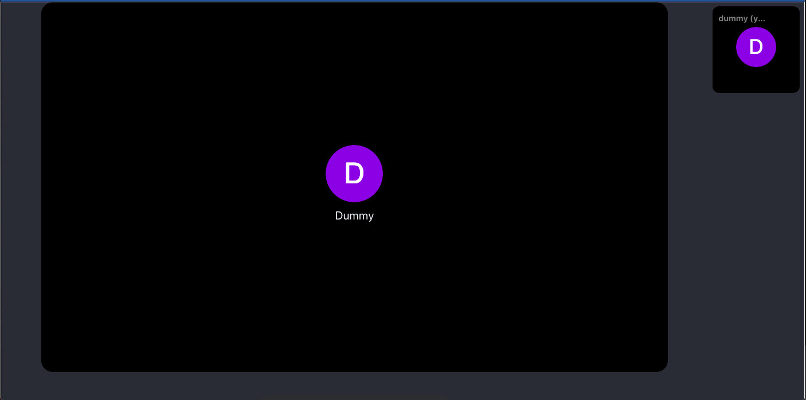
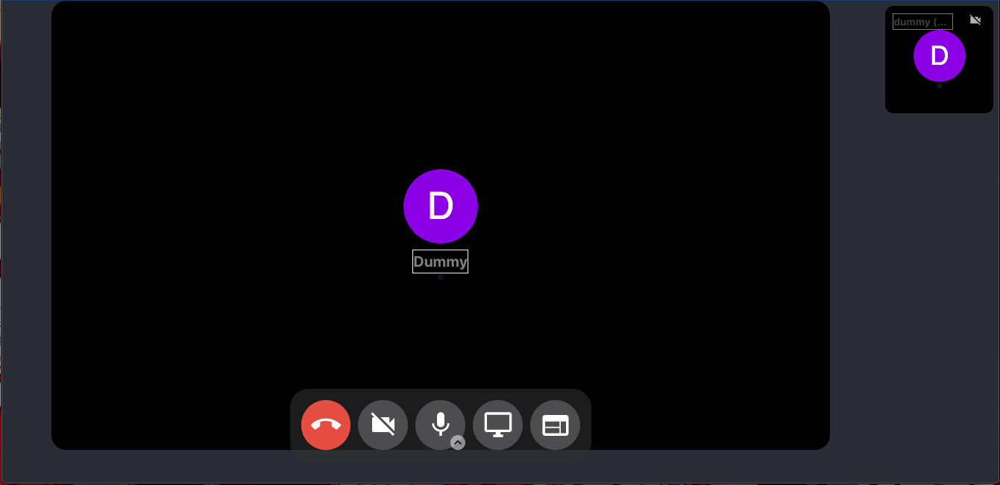
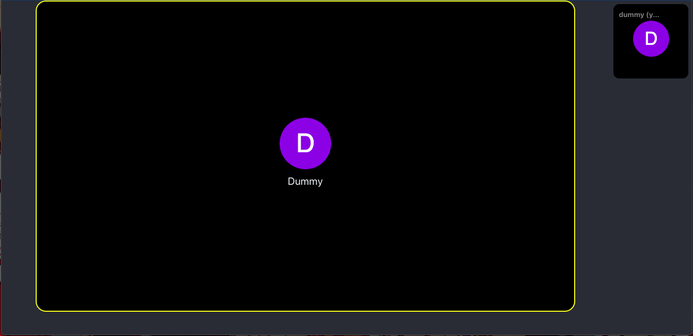
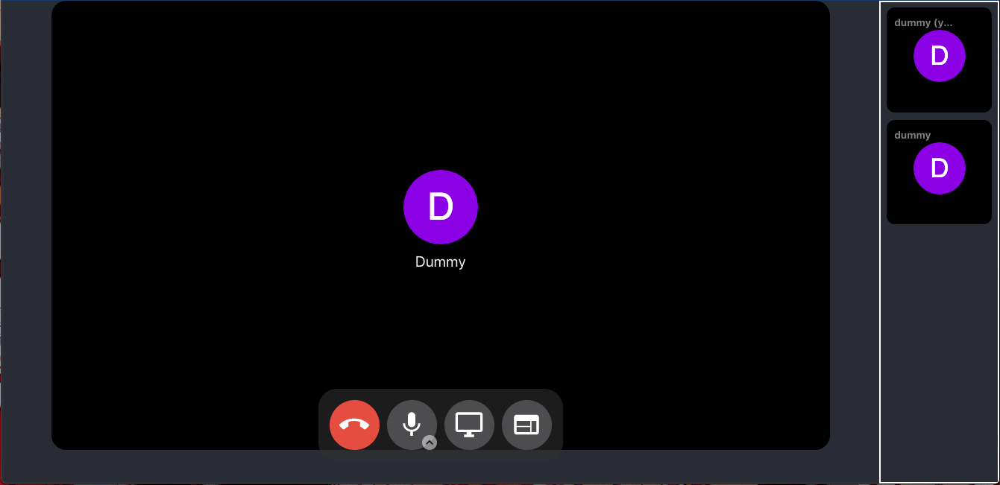
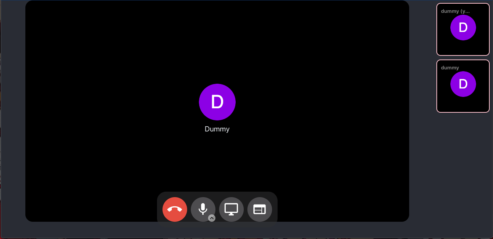
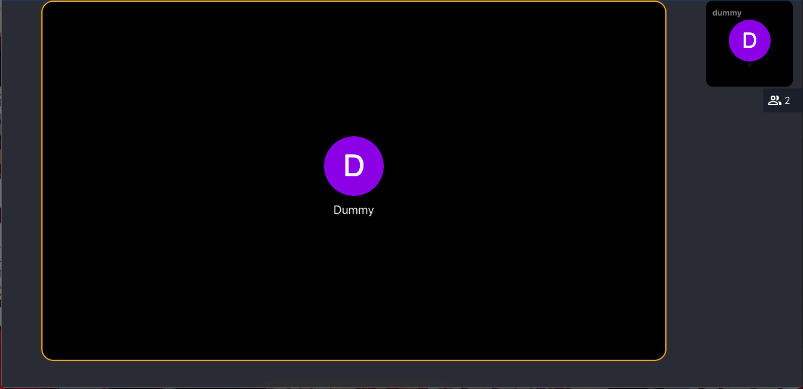
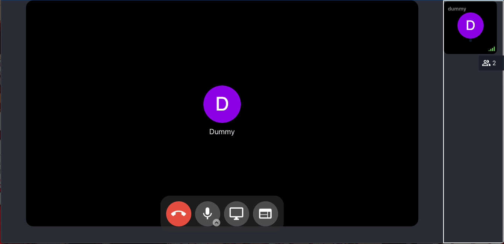
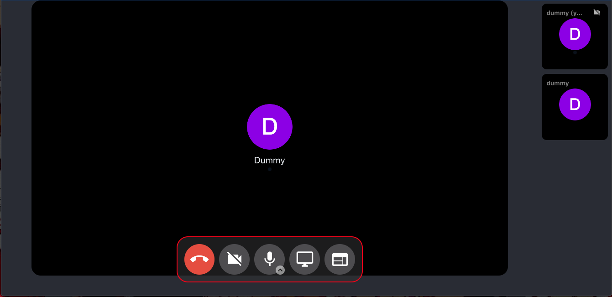
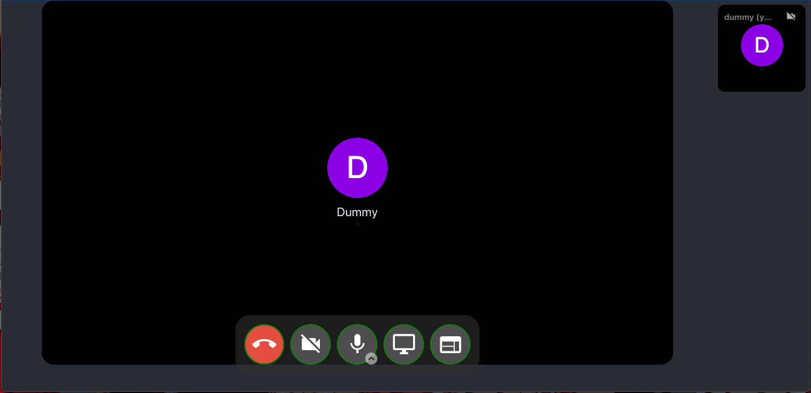
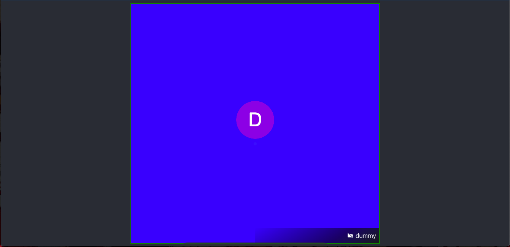

import Tabs from '@theme/Tabs';
import TabItem from '@theme/TabItem';

Custom CSS helps you to customize the call screen of CometChat which comes with default settings.

- You might want to reposition the calling containers and
- Change the names of participants in the call with different fonts and sizes.
- Change the background color of the call screen or
- Change the height and width of the participants' call screen

You now have access to the custom CSS classes which help you change accordingly to suit your need. Please go through the examples below.

### **Example**

Let's add all the classes that we need to pass inside the calling component in a variable CSS.

<Tabs>
<TabItem value="Javascript" label="Javascript">

  ```javascript
let CSS=`
.custom-main-container{
	border: 1px solid #F0F0F0;
}
.custom--tile-main-call-container{
	border: 2px solid #6929CA;
}
.custom-tile-main-video-container{
	border: 2px solid yellow;
}
.custom-spotlight-main-video-container{
	border: 2px solid orange;
}
.custom-tile-list-container{
	border: 2px solid #FFFFFF;
}
.custom-tile-container{
	border: 2px solid pink;
}
.custom-local-spotlight-stream-container{
	border: 2px solid #FFFFFF;
}
.custom-button-bar{
	border: 2px solid red;
}
.custom-button {
	border: 2px solid green;
}
.custom-grid-container{
	background-color: blue;
}
.custom-name{
	color:grey;
	font-weight:bold;
	border: 1px solid #F0F0F0;
}`
  ```
</TabItem>
</Tabs>

```javascript
let CSS=`
.custom-main-container{
	border: 1px solid #F0F0F0;
}
.custom--tile-main-call-container{
	border: 2px solid #6929CA;
}
.custom-tile-main-video-container{
	border: 2px solid yellow;
}
.custom-spotlight-main-video-container{
	border: 2px solid orange;
}
.custom-tile-list-container{
	border: 2px solid #FFFFFF;
}
.custom-tile-container{
	border: 2px solid pink;
}
.custom-local-spotlight-stream-container{
	border: 2px solid #FFFFFF;
}
.custom-button-bar{
	border: 2px solid red;
}
.custom-button {
	border: 2px solid green;
}
.custom-grid-container{
	background-color: blue;
}
.custom-name{
	color:grey;
	font-weight:bold;
	border: 1px solid #F0F0F0;
}`
```


You need to pass the CSS string in CallSettings in `setCustomCSS`.

<Tabs>
<TabItem value="Javascript" label="Javascript">

  ```javascript
var callsettings = new CometChat.CallSettingsBuilder()
.setSessionID(sessionID)
.setIsAudioOnlyCall(false)
.showEndCallButton(true)
.enableDefaultLayout(true)
.showScreenShareButton(true)
.showMuteAudioButton(true)
.showEndCallButton(true)
.showScreenShareButton(true)
.showPauseVideoButton(true)
.setCustomCSS(CSS). //HERE
.build();
  ```
</TabItem>
<TabItem value="Typescript" label="Typescript">

  ```typescript
var callsettings: CometChat.CallSettings = new CometChat.CallSettingsBuilder()
    .setSessionID("SESSION_ID")
    .setIsAudioOnlyCall(false)
    .showEndCallButton(true)
    .enableDefaultLayout(true)
    .showScreenShareButton(true)
    .showMuteAudioButton(true)
    .showEndCallButton(true)
    .showScreenShareButton(true)
    .showPauseVideoButton(true)
    .setCustomCSS("CSS") //HERE
    .build();
  ```
</TabItem>
</Tabs>


| Property | Description | Type | Value | 
| ---- | ---- | ---- | ---- | 
| setCustomCSS | Option to update the custom css for call screen | String | CSS | 


## Common CSS Classes

There are a few common classes used for different modes in the call screen

1. **custom-main-container**

This is the most outer component of the calling component.




<Tabs>
<TabItem value="CSS" label="CSS">

  ```css
//Default value is
 {
  height: 100vh;
  width: 100vw;
}  
  ```
</TabItem>
</Tabs>


2. **custom--tile-main-call-container**

This the Container of the main video and till list or a local stream component.


<Tabs>
<TabItem value="CSS" label="CSS">

  ```css
#Default style
 {
  height: 100%;
  display: flex;
  flex: 1;
  flex-direction: row; //if opened in mobile and in portrait mode its value is column
  justify-content: flex-start;
}
  ```
</TabItem>
</Tabs>


3. **custom-name**

This class is passed in user name text in all components.



## Tile mode

1. **custom-tile-main-video-container**
This is the main video container. It is the div that has the main speaker video, for tile mode.



<Tabs>
<TabItem value="CSS" label="CSS">

  ```css
#Default value 
{
  display: flex;
  flex: 1 1;
  height: 93%;
  margin-left: 5%;
  margin-right: 5%;
  margin-bottom: 5%;
  position: relative;
  justify-content: center;
  background-color: #000;
  border-radius: 20px;
}

#Default CSS for mobile in portrait mode
{
  display: flex;
  width: 90%;
  height: 63%;
  margin-left: 5%;
  margin-right: 5%;
  margin-bottom: 5%;
  margin-top: 5%;
  position: relative;
  justify-content: center;
  background-color: #000;
}
  ```
</TabItem>
</Tabs>

2. **custom-tile-list-container**
This is the div that contains a list of tiles.



<Tabs>
<TabItem value="CSS" label="CSS">

  ```css
#Default value
{
  width: 12%;
  padding-left: 0%;
  display: flex;
  align-items: center;
  flex-direction: column;
  padding-top: 0.5%;
  overflow-y: auto;
}

#Default CSS for mobile in portrait mode
{
  width: 100vw;
  height: 20%;
  padding-left: 1%;
  padding-right: 1%;
  padding-top: 0.5%;
  display: flex;
  align-items: center;
  flex-direction: row;
  overflow-x: auto;
}
  ```
</TabItem>
</Tabs>


3. **custom-tile-container**
The div is used for tile video.



<Tabs>
<TabItem value="CSS" label="CSS">

  ```css
Default value 
{
  width: 90%;
  position: relative;
  aspect-ratio: 1;
  background-color: #000000;
  margin-bottom: 10px;
  border-radius: 0.7rem;
}

Default CSS for mobile
{
  width: 15vh;
  position: relative;
  margin-left: 10px;
}  
  ```
</TabItem>
</Tabs>


## SpotLight Mode

1. **custom-spotlight-main-video-container**
This is the main video container it the div which has the main speaker video, for spotlight mode.



<Tabs>
<TabItem value="CSS" label="CSS">

  ```css
#Default value
{
  width: 12%;
  padding-left: 0%;
  display: flex;
  align-items: center;
  flex-direction: column;
  padding-top: 0.5%;
  overflow-y: auto;
}

#Default CSS for mobile in portrait mode 
{
  width: 100vw;
  height: 20%;
  padding-left: 1%;
  padding-right: 1%;
  padding-top: 0.5%;
  display: flex;
  align-items: center;
  flex-direction: row;
  overflow-x: auto;
} 
  ```
</TabItem>
</Tabs>

2. **custom-local-spotlight-stream-container**
This div contains the local video of a user in spotlight mode.



<Tabs>
<TabItem value="CSS" label="CSS">

  ```css
Default value
{
  width: 12vw;
}
  ```
</TabItem>
</Tabs>


## Bottom Buttons

1. **custom-button-bar**
This is the container of all the buttons in calling.



<Tabs>
<TabItem value="CSS" label="CSS">

  ```css
#Default value 
 {
  position: relative;
  display: inline-block;
  display: flex;
  justify-content: center;
  padding: 10px;
  background-color: rgba(46, 47, 48, 0.6);
  border-radius: 25px;
}
  ```
</TabItem>
</Tabs>


2. **custom-button**
This is the div of every button in the button bar.



<Tabs>
<TabItem value="CSS" label="CSS">

  ```css
#Default value 

 {
  background-color: #4d4c4f;
  width: 5vw;
  height: 5vw;
  border-radius: 50%;
  line-height: 1.33;
  margin: 5px;
  outline: none !important;
  border: none;
  z-index: 5;
}

#Default value for mobile
 {
  width: 12vw;
  height: 12vw;
  border-radius: 50%;
  line-height: 1.33;
  margin: 5px;
  outline: none !important;
  border: none;
  z-index: 5;
}
  ```
</TabItem>
</Tabs>


## Grid Mode

1. **custom-grid-container**
This is the container of the grid video.



<Tabs>
<TabItem value="CSS" label="CSS">

  ```css
#Default value 
 {
  position: relative;
  display: flex;
  height: 100%;
  padding-left: 1px;
  padding-right: 1px;
  margin-left: 0.5%;
  margin-right: 0.5%;
  background-color: #000;
  justify-content: center;
  align-items: center;
}
  ```
</TabItem>
</Tabs>


:::danger Note
 It is recommended to not pass CSS of other classes which are not listed here as it may cause some UI issues. Also resizing of the grid container is not allowed as it may affect the layout of grid mode.
:::