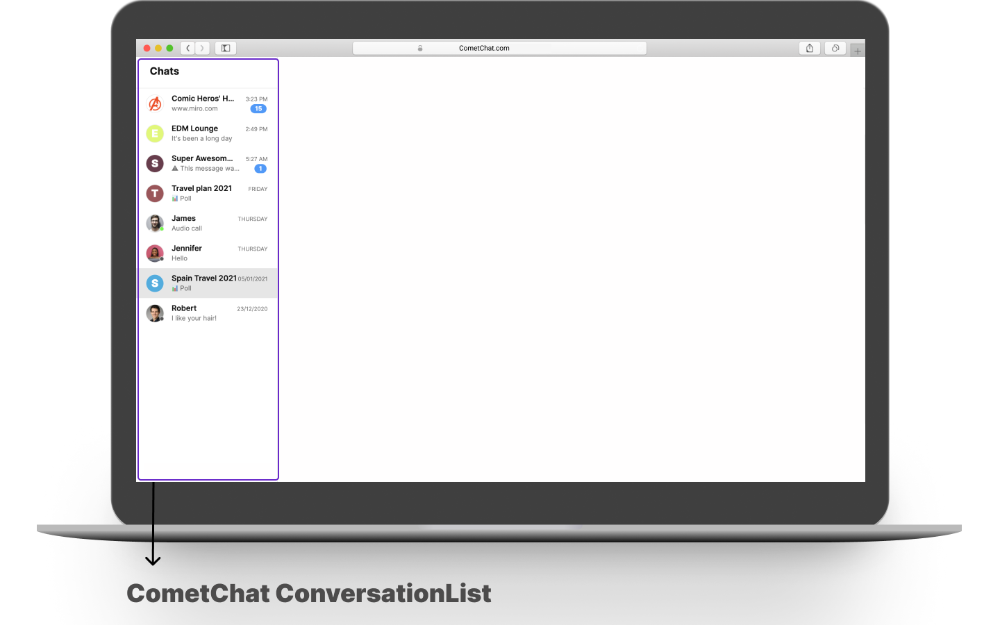

import Tabs from '@theme/Tabs';
import TabItem from '@theme/TabItem';

**UI Components** are building blocks of the UI Kit. **UI Components** are a set of custom classes specially designed to build a rich chat app. There are different UI Components available in the
UI Kit Library.

### CometChatUI

**CometChatUI** is an option to launch a fully functional chat application using the UI Kit. In **CometChatUI**  all the **UI Components** are interlinked and work together to launch a fully functional chat on your website/application.


<Tabs>
<TabItem value="js" label="React">

```javascript

import {CometChatUI} from "./cometchat-pro-react-ui-kit/CometChatWorkspace/src";

class App extends React.Component {
  
  render() {
    
     return (
       <div style={{width: '800px', height:'800px' }}>
        <CometChatUI chatWithGroup="cometchat-guid-1" />
       </div>
    );
  }
  
}
```

</TabItem>
</Tabs>


It takes the following properties:

| Parameter | Description | Type | 
| ---- | ---- | ---- | 
| chatWithUser | The ID of the user you want to chat with | Optional | 
| chatWithGroup | The ID of the group you want to chat with | Optional | 
| friendsOnly | Value could be _true_ or _false_<br /><br />This property when set to true will return only the friends of the logged-in user in the users tab. | Optional | 


:::danger Important

_friendsOnly_ prop is deprecated from version **v2.3.5-1** . Please use **userListMode** variable of UIKitSettings class for displaying only friends in the user list. Please refer to this link for documentation:  [Customize UI Kit](./customize-ui-kit)

:::


### CometChatUserListWithMessages

The `CometChatUserListWithMessages` is a component with a list of users. The component has all the necessary listeners and methods required to display the user's list and shows the set of the messages/chats of the selected user.


<Tabs>
<TabItem value="js" label="React">

```javascript
import {CometChatUserListWithMessages} from "./cometchat-pro-react-ui-kit/CometChatWorkspace/src";

class App extends React.Component {
  
  render() {
    
     return (
       <div style={{width: '800px', height:'800px' }}>
        <CometChatUserListWithMessages chatWithUser="cometchat-uid-5" />
       </div>
    );
  }
  
}
```

</TabItem>
</Tabs>


It takes the following properties:

| Parameter | Description | Type | 
| ---- | ---- | ---- | 
| chatWithUser | The ID of the user you want to chat with | Optional | 
| friendsOnly | Value could be _true_ or _false_<br /><br />This property when set to true will return only the friends of the logged-in user. | Optional | 


:::danger Important

_friendsOnly_ prop is deprecated from version **v2.3.5-1**. Please use **userListMode** variable of UIKitSettings class for displaying only friends in the user list. Please refer to this link for documentation: [Customize UI Kit](./customize-ui-kit)

:::


### CometChatGroupListWithMessages

The `CometChatGroupListWithMessages` is a component with a list of groups. The component has all the necessary listeners and methods required to display the group's list and shows the set of the messages/chats of the selected group.


<Tabs>
<TabItem value="js" label="React">

```javascript
import {CometChatGroupListWithMessages} from "./cometchat-pro-react-ui-kit/CometChatWorkspace/src";

class App extends React.Component {
  
  render() {
    
     return (
       <div style={{width: '800px', height:'800px' }}>
        <CometChatGroupListWithMessages chatWithGroup="cometchat-guid-1" />
       </div>
    );
  }
  
}
```

</TabItem>
</Tabs>


It takes the following properties:

| Parameter | Description | Type | 
| ---- | ---- | ---- | 
| chatWithGroup | The ID of the group you want to chat with | Optional | 


### CometChatConversationListWithMessages

The `CometChatConversationListWithMessages` is a component with a list of recent conversations. The component has all the necessary listeners and methods required to display the recent conversation list and shows the set of the messages/chats of the selected recent conversation


<Tabs>
<TabItem value="js" label="React">

```javascript
import {CometChatConversationListWithMessages} from "./cometchat-pro-react-ui-kit/CometChatWorkspace/src";

class App extends React.Component {
  
  render() {
    
     return (
       <div style={{width: '800px', height:'800px' }}>
        <CometChatConversationListWithMessages  />
       </div>
    );
  }
  
}
```

</TabItem>
</Tabs>


It takes the following properties:

| Parameter | Description | Type | 
| ---- | ---- | ---- | 
| chatWithUser | The ID of the user you want to chat with | Optional | 
| chatWithGroup | The ID of the group you want to chat with | Optional | 


### CometChatMessages

The `CometChatMessages` is a component that displays the list of messages for a particular user or group.

<Tabs>
<TabItem value="js" label="React">

```javascript
import {CometChatMessages} from "./cometchat-pro-react-ui-kit/CometChatWorkspace/src";

class App extends React.Component {
  
  render() {
    
     return (
       <div style={{width: '800px', height:'800px' }}>
        <CometChatMessages chatWithGroup="cometchat-guid-1" />
       </div>
    );
  }
  
}
```

</TabItem>
</Tabs>


It takes the following properties:

| Parameter | Description | Type | 
| ---- | ---- | ---- | 
| chatWithUser | The ID of the user you want to chat with | Required | 
| chatWithGroup | The ID of the group you want to chat with | Optional | 


### CometChatUserList

The `CometChatUserList` is a component that displays the list of users available to chat. You can use this component within your app if you wish to display the list of users.


<Tabs>
<TabItem value="js" label="React">

```javascript
import {CometChatUserList} from "./cometchat-pro-react-ui-kit/CometChatWorkspace/src";

class App extends React.Component {
  
  render() {
    
     return (
       <div style={{width: '800px', height:'800px' }}>
        <CometChatUserList friendsOnly={true} />
       </div>
    );
  }
  
}
```

</TabItem>
</Tabs>


It takes the following props:

| Parameter | Description | Type | 
| ---- | ---- | ---- | 
| friendsOnly | Value could be _true_ or _false_<br /><br />This property when set to true will return only the friends of the logged-in user. | Optional | 


:::danger Important

_friendsOnly_ prop is deprecated from version **v2.3.5-1**. Please use **userListMode** variable of UIKitSettings class for displaying only friends in the user list. Please refer to this link for documentation: [Customize UI Kit](./customize-ui-kit)

:::

### CometChatGroupList

The `CometChatGroupList` is a component that displays the list of groups available. You can use this component within your app if you wish to display the list of groups.


<Tabs>
<TabItem value="js" label="React">

```javascript
import {CometChatGroupList} from "./cometchat-pro-react-ui-kit/CometChatWorkspace/src";

class App extends React.Component {
  
  render() {
    
     return (
       <div style={{width: '800px', height:'800px' }}>
        <CometChatGroupList />
       </div>
    );
  }
  
}
```

</TabItem>
</Tabs>


### CometChatConversationList

You can use the `CometChatConversationList` component to display the list of recent conversations that the logged-in user was a part of.



<Tabs>
<TabItem value="js" label="React">

```javascript
import {CometChatConversationList} from "./cometchat-pro-react-ui-kit/CometChatWorkspace/src";

class App extends React.Component {
  
  render() {
    
     return (
       <div style={{width: '800px', height:'800px' }}>
        <CometChatConversationList />
       </div>
    );
  }
  
}
```

</TabItem>
</Tabs>