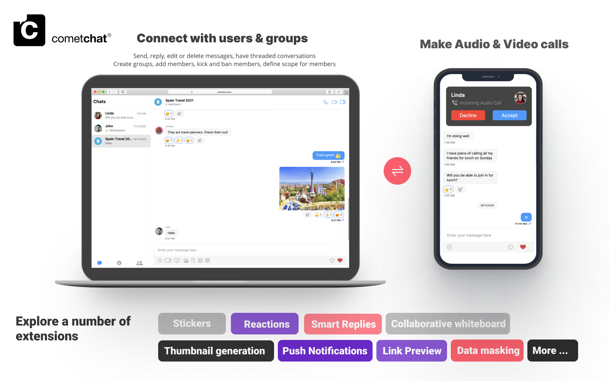

import Tabs from '@theme/Tabs';
import TabItem from '@theme/TabItem';
import FolderStructureImg from "./assets/5p1s5fydgt07yucxkvc52f3eb71ggc3b2fxpxbxrtqjwlu6ucprecaafptqsubcv.png"
import DependenciesImg from "./assets/n4xhanpy3xmvh13e5qh2hk84kojuiotug2silsban3mju3g9rezxm3m3cr8jvn22.png"
import CometChatUIImg from "./assets/1623200307.gif"

Our React Chat UI Kit lets developers easily add text, voice & video to your website. It a fully polished UI and the complete business logic.

Don't forget to check out the [Key Concepts](/ui-kit/react/v3/key-concepts) for your React Chat UI Kit before proceeding.



:::tip What's New in v3

- Seamless scaling to over 1M+ concurrent users <br/>
- Faster connection & response times <br/>
- Higher rate limits <br/>
- Supports up to 100K users in a group <br/>
- Unlimited groups <br/>
- Support for Transient Messages <br/>
- Real-time user & group members count <br/>
- And more! <br/>

:::

CometChat's React UI Kit’s customizable UI components simplify the process of integrating text chat and voice/video calling features to your website or mobile application in a few minutes.

<div style={{display: 'flex', boxShadow: '0 0 4px 0 rgb(0 0 0 / 18%)', borderRadius: '3px'}}>
  <div style={{padding: '24px'}}>
  	<h4 style={{fontWeight: 'bold'}}>**I want to checkout React UI Kit**</h4>
    <p>Follow the steps mentioned in the <code>README.md</code> file.</p>
    <p>Kindly, click on below button to download our React UI Kit.</p>
    <a style={{display: 'inline-block', backgroundColor: '#7c55c9', padding: '8px', textAlign: 'center', textTransform: 'uppercase', border: '1px solid #e3e5e7', borderRadius: '3px', color: 'white', width: '100%', marginBottom: '8px'}} href="https://github.com/cometchat-pro/cometchat-pro-react-ui-kit/archive/master.zip">React UI Kit</a>
		<a style={{display: 'inline-block', backgroundColor: '#7c55c9', padding: '8px', textAlign: 'center', textTransform: 'uppercase', border: '1px solid #e3e5e7', borderRadius: '3px', color: 'white', width: '100%'}} href="https://github.com/cometchat/cometchat-chat-uikit-react/tree/v3" target="_blank">View on Github</a>
  </div>
  <div style={{padding: '24px', borderLeft: '1px solid #e3e5e7'}}>
  	<h4 style={{fontWeight: 'bold'}}>**I want to explore the sample app**</h4>
    <p>Kindly, click on below button to download our React Sample App.</p>
    <a style={{display: 'inline-block', backgroundColor: '#7c55c9', padding: '8px', textAlign: 'center', textTransform: 'uppercase', border: '1px solid #e3e5e7', borderRadius: '3px', color: 'white', width: '100%', marginBottom: '8px'}} href="https://github.com/cometchat-pro/javascript-react-chat-app/archive/master.zip">React Sample App</a>
    <a style={{display: 'inline-block', backgroundColor: '#7c55c9', padding: '8px', textAlign: 'center', textTransform: 'uppercase', border: '1px solid #e3e5e7', borderRadius: '3px', color: 'white', width: '100%'}} href="https://github.com/cometchat/cometchat-chat-sample-app-react/tree/v3" target="_blank">View on Github</a>
  </div>
</div>

---

## Prerequisites

Before you begin, ensure you have met the following requirements:

1. A text editor. (e.g. Visual Studio Code, Notepad++, Sublime Text, Atom, or VIM)
2. [Node](https://nodejs.org/en/)
3. [npm](https://www.npmjs.com/get-npm)
4. [React](https://reactjs.org/)

<Tabs>
<TabItem value="js" label="CLI">

```cli
npm install react@17.0.2
```

</TabItem>
</Tabs>

5. [React DOM](https://reactjs.org/docs/react-dom.html)

<Tabs>
<TabItem value="js" label="CLI">

```cli
npm install react-dom@17.0.2
```

</TabItem>
</Tabs>

6. [React Scripts](https://www.npmjs.com/package/react-scripts)

<Tabs>
<TabItem value="js" label="CLI">

```cli
npm install react-scripts@4.0.3
```

</TabItem>
</Tabs>

## Installing the React Chat UI Kit

:::warning Important

Please follow the steps provided in the [Key Concepts](/ui-kit/react/v3/key-concepts) to create V3 apps before you proceed.

:::

### Setup

1. Register on CometChat

   - To install React UI Kit, you need to first register on the CometChat Dashboard. Click [here](https://app.cometchat.com) to Sign Up.

2. Get your application keys

   - Create a new app.
   - Head over to the QuickStart or API & Auth Keys section and note the App ID, Auth Key, and Region.

3. Add the CometChat dependency

<Tabs>
<TabItem value="js" label="CLI">

```cli
npm install @cometchat-pro/chat@3.0.11 --save
```

</TabItem>
</Tabs>

### Configure CometChat inside your app

- Import CometChat SDK

<Tabs>
<TabItem value="js" label="Javascript">

```Javascript
import { CometChat } from "@cometchat-pro/chat";
```

</TabItem>
</Tabs>

- Initialize CometChat

The init() method initializes the settings required for CometChat.
We suggest calling the init() method on app startup, preferably in the index.js file.

<Tabs>
<TabItem value="js" label="Javascript">

```Javascript
const appID = "APP_ID";
const region = "REGION";
const appSetting = new CometChat.AppSettingsBuilder().subscribePresenceForAllUsers().setRegion(region).build();
CometChat.init(appID, appSetting).then(
  () => {
    console.log("Initialization completed successfully");
    // You can now call login function.
  },
  error => {
    console.log("Initialization failed with error:", error);
    // Check the reason for error and take appropriate action.
  }
);
```

</TabItem>
</Tabs>

:::warning Note

Replace APP_ID and REGION with your CometChat App ID and Region in the above code.

:::

- Create user

This method takes a `User` object and the `Auth Key` as input parameters and returns the created `User` object if the request is successful.

<Tabs>
<TabItem value="js" label="Javascript">

```Javascript
let authKey = "AUTH_KEY";
var uid = "user1";
var name = "Kevin";

var user = new CometChat.User(uid);
user.setName(name);
CometChat.createUser(user, authKey).then(
    user => {
        console.log("user created", user);
    },error => {
        console.log("error", error);
    }
)
```

</TabItem>
</Tabs>

:::warning Note

Replace AUTH_KEY with your CometChat Auth Key in the above code.

:::

- Login your user

This method takes `UID` and `Auth Key` as input parameters and returns the User object containing all the information of the logged-in user.

<Tabs>
<TabItem value="js" label="Javascript">

```Javascript
const authKey = "AUTH_KEY";
const uid = "cometchat-uid-1";

CometChat.login(uid, authKey).then(
  user => {
    console.log("Login Successful:", { user });
  },
  error => {
    console.log("Login failed with exception:", { error });
  }
);
```

</TabItem>
</Tabs>

:::warning Note

Replace AUTH_KEY with your CometChat Auth Key in the above code.

:::

:::info Note

We have set up 5 users for testing having UIDs: cometchat-uid-1, cometchat-uid-2, cometchat-uid-3, cometchat-uid-4, and cometchat-uid-5.

We have used uid cometchat-uid-1 as an example here. You can create a User from CometChat Dashboard as well.

:::

### Add the React UI Kit to your project

- Clone this repository

<Tabs>
<TabItem value="js" label="CLI">

```cli
git clone https://github.com/cometchat-pro/cometchat-pro-react-ui-kit.git
```

</TabItem>
</Tabs>

- Copy the cloned repository to your source folder
<div class="image_wrapper" style={{display: "flex",justifyContent: "center"}}>
  
</div>
- Copy all the dependencies from package.json into your project's package.json and install them

<div class="image_wrapper" style={{display: "flex",justifyContent: "center"}}>
  
</div>

### Launch CometChat

Using the CometChatUI component, you can launch a fully functional chat application. In this component, all the UI Screens and UI Components are interlinked and work together to launch a fully functional chat on your website/application.

<div class="image_wrapper" style={{display: "flex",justifyContent: "center"}}>
  
</div>

### Usage

<Tabs>
<TabItem value="js" label="React">

```React
import { CometChatUI } from "./CometChatWorkspace/src";

class App extends React.Component {

  render() {

    return (
      <div style={{width: '800px', height:'800px' }}>
      	<CometChatUI />
      </div>
	  );
	}
}
```

</TabItem>
</Tabs>

## Check out our React chat sample app

Visit our [React sample app](https://github.com/cometchat/cometchat-chat-sample-app-react/tree/v3) repository to run the sample app yourself.
