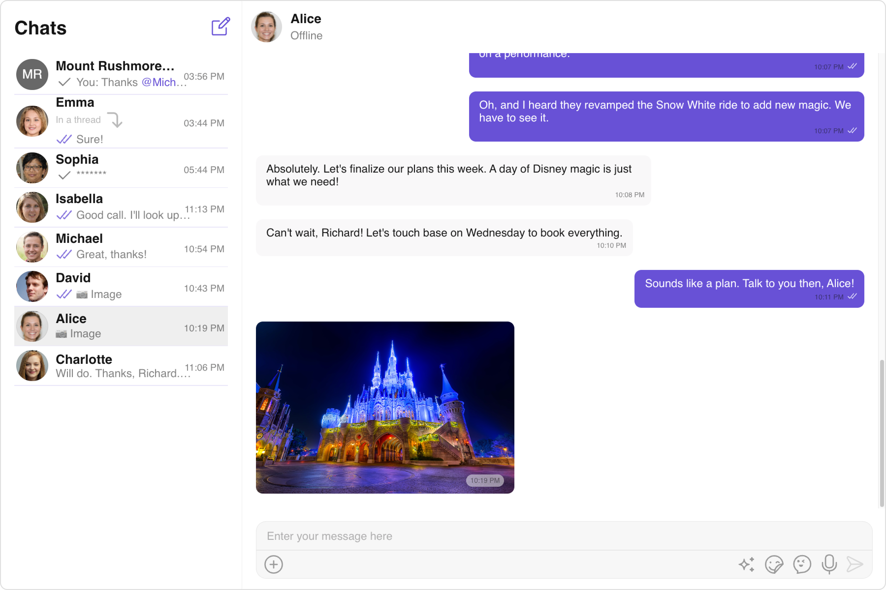

import Tabs from '@theme/Tabs';
import TabItem from '@theme/TabItem';

## Start your first conversation

The CometChat UI Kit for React simplifies the process of integrating in-app chat functionality with essential messaging features. With a collection of prebuilt UI components, it offers seamless theming options, including light and dark themes, various fonts, colors, and extensive customization possibilities.

Supporting both one-to-one and group conversations, the CometChat UI Kit for React empowers developers to initiate chat functionalities effortlessly. Follow the guide below to begin implementing chat features into your React applications using CometChat React UI Kit.



## Prerequisites

Before installing **UI Kit** for React, you need to create a CometChat application on the CometChat Dashboard, which comprises everything required in a chat service including users, groups, calls & messages. You will require the `App ID`, `AuthKey`, and `Region` of your CometChat application when initializing the **UI Kit**.

**i. Register on CometChat**

- You need to register on the **CometChat Dashboard** first. [Click here to sign up](https://app.cometchat.com/login).

**ii. Get Your Application Keys**

- Create a **new app**
- Head over to the **QuickStart** or **API & Auth Keys section** and note the **App ID**, **Auth Key**, and **Region**.

> Each CometChat application can be integrated with a single client app. Within the same application, users can communicate with each other across all platforms, whether they are on mobile devices or on the web.

**iii. IDE Setup**

- You have Node.js installed on your machine.
- You have a code editor like Visual Studio Code or Atom installed.
- You have npm or Yarn installed.

---

### Built With

- [Node](https://nodejs.org/)
- [npm](https://www.npmjs.com/get-npm)
- [React](https://www.npmjs.com/package/react) `npm install react@18.2.0`
- [React DOM](https://www.npmjs.com/package/react-dom) `npm install react-dom@18.0.2`

---

## Getting Started

<span style={{padding: '6px 15px', 'background-color': '#6851D6', color: 'white', 'border-radius': '15px', 'font-size': '0.9em', 'font-weight': 'bold'}}>Step 1</span>

### Create a project

    To get started with React, follow these steps:

    1. Open your code editor.
    2. Create a new project by initializing a new React application using Create React App or any other boilerplate.
    3. Navigate to your project directory and open the project in your code editor.
    4. Begin developing your React application in the "src" directory.
    5. Install additional dependencies as required.

---

<span style={{padding: '6px 15px', 'background-color': '#6851D6', color: 'white', 'border-radius': '15px', 'font-size': '0.9em', 'font-weight': 'bold'}}>Step 2</span>

### Add Dependency

This developer kit is an add-on feature to CometChat Javascript SDK, so installing it will also install the core Chat SDK.

```CLI
npm install @cometchat/chat-uikit-react@4.x
```

:::info

If your npm version is 3 through 6, install the below-mentioned peer dependencies as well.

:::

```CLI
npm install @cometchat/uikit-elements @cometchat/uikit-resources @cometchat/uikit-shared
```

<span style={{padding: '6px 15px', 'background-color': '#6851D6', color: 'white', 'border-radius': '15px', 'font-size': '0.9em', 'font-weight': 'bold'}}>Step 3</span>

### Initialize CometChatUIkit

The [Init](./methods#init) method initialises the settings required for CometChat. Please ensure to call this method before invoking any other methods from CometChat UI Kit or CometChat SDK.

:::info

The Auth Key is an optional property of the `UIKitSettings` Class. It is intended for use primarily during proof-of-concept (POC) development or in the early stages of application development. You can use the [Auth Token](./methods#login-using-auth-token) method to log in securely.

:::

```javascript
import { UIKitSettingsBuilder } from "@cometchat/uikit-shared";
import { CometChatUIKit } from "@cometchat/chat-uikit-react";

const COMETCHAT_CONSTANTS = {
  APP_ID: "APP_ID", //Replace with your App ID
  REGION: "REGION", //Replace with your App Region
  AUTH_KEY: "AUTH_KEY", //Replace with your Auth Key or leave blank if you are authenticating using Auth Token
};

//create the builder
const UIKitSettings = new UIKitSettingsBuilder()
  .setAppId(COMETCHAT_CONSTANTS.APP_ID)
  .setRegion(COMETCHAT_CONSTANTS.REGION)
  .setAuthKey(COMETCHAT_CONSTANTS.AUTH_KEY)
  .subscribePresenceForAllUsers()
  .build();

//Initialize CometChat UI Kit
CometChatUIKit.init(UIKitSettings)
  .then(() => {
    console.log("Initialization completed successfully");
    // You can now call login function.
  })
  .catch(console.log);
```

> Make sure to replace the **APP_ID** with your CometChat appId, **AUTH_KEY** with your CometChat app auth key and **REGION** with your app region in the above code.

---

<span style={{padding: '6px 15px', 'background-color': '#6851D6', color: 'white', 'border-radius': '15px', 'font-size': '0.9em', 'font-weight': 'bold'}}>Step 4</span>

### Login User

For login, you require a `UID`. You can create your own users on the CometChat Dashboard or via API. We have pre-generated test users: `cometchat-uid-1`, `cometchat-uid-2`, `cometchat-uid-3`, `cometchat-uid-4`, `cometchat-uid-5`.

The [Login](./methods#login-using-auth-key) method returns the User object containing all the information of the logged-in user.

:::info

This straightforward authentication method is ideal for proof-of-concept (POC) development or during the early stages of application development. For production environments, however, we strongly recommend using an [Auth Token](./methods#login-using-auth-token) instead of an Auth Key to ensure enhanced security.

:::

<Tabs>
<TabItem value="js" label="Javascript">

```javascript
import { CometChatUIKit } from "@cometchat/chat-uikit-react";

const UID = "UID"; //Replace with your UID

CometChatUIKit.getLoggedinUser().then((user) => {
  if (!user) {
    //Login user
    CometChatUIKit.login(UID)
      .then((user) => {
        console.log("Login Successful:", { user });
        //mount your app
      })
      .catch(console.log);
  } else {
    //mount your app
  }
});
```

</TabItem>

<TabItem value="ts" label="Typescript">

```typescript
import { CometChatUIKit } from "@cometchat/chat-uikit-react";

const UID = "UID"; //Replace with your UID

CometChatUIKit.getLoggedinUser().then((user: CometChat.User) => {
  if (!user) {
    //Login user
    CometChatUIKit.login(UID)
      .then((user: CometChat.User) => {
        console.log("Login Successful:", { user });
        //mount your app
      })
      .catch(console.log);
  } else {
    //mount your app
  }
});
```

</TabItem>
</Tabs>

---

<span style={{padding: '6px 15px', 'background-color': '#6851D6', color: 'white', 'border-radius': '15px', 'font-size': '0.9em', 'font-weight': 'bold'}}>Step 5</span>

### Render Conversation With Message

[ConversationsWithMessages](./conversations-with-messages) is a wrapper component that offers functionality to render both the [Conversations](./conversations) and [Messages](./messages) components. It also enables opening the [Messages](./messages) by tapping on any conversation rendered in the list of conversations.


[ConversationsWithMessages](./conversations-with-messages) can be rendered by adding the following code snippet to the `App.js`` file:

```jsx
import { CometChatConversationsWithMessages } from "@cometchat/chat-uikit-react"; //import the component in your App.js file

export const App = () => {
  return <CometChatConversationsWithMessages />;
};
```

> It will automatically fetch the conversation data upon loading the list. If the conversation list is empty, you can start a new conversation.

<span style={{padding: '6px 15px', 'background-color': '#6851D6', color: 'white', 'border-radius': '15px', 'font-size': '0.9em', 'font-weight': 'bold'}}>Step 6</span>

### Run the project

<Tabs>
<TabItem value="js" label="Javascript">

```bash
npm start
```

</TabItem>

</Tabs>
