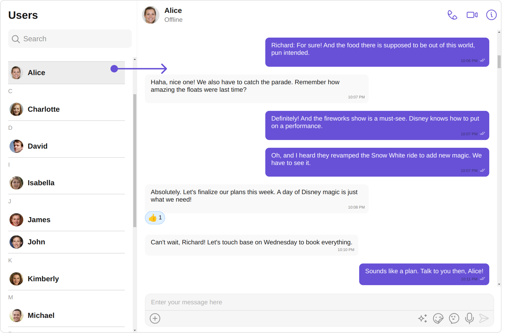
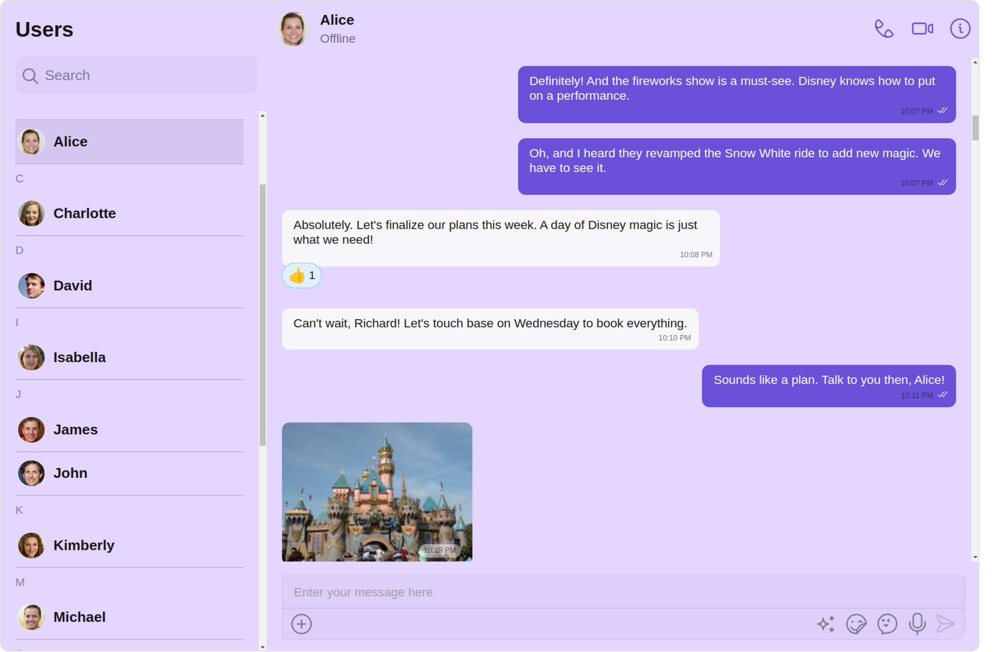
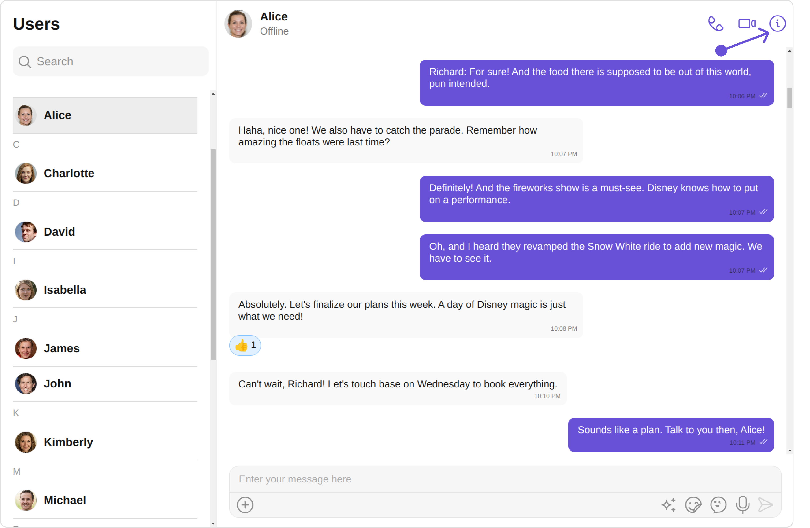
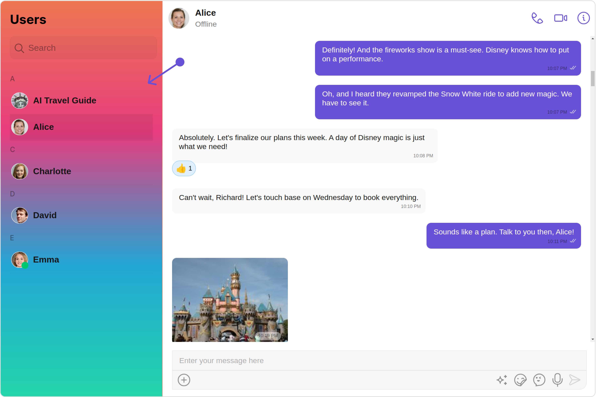
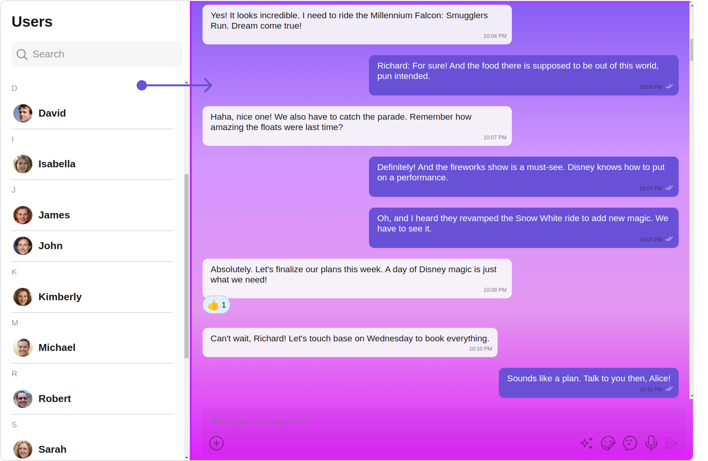

import Tabs from '@theme/Tabs';
import TabItem from '@theme/TabItem';

## Overview

The UsersWithMessages is a [Composite Component](./components-overview#components) encompassing components such as [Users](./users) and [Messages](./messages). Both of these component contributes to the functionality and structure of the overall UsersWithMessages component.


| Components             | Description                                                                                                                  |
| ---------------------- | ---------------------------------------------------------------------------------------------------------------------------- |
| [Users](./users)       | The `Users` component is designed to display a list of `User`. This essentially represents your recent conversation history. |
| [Messages](./messages) | The `Messages` component is designed to manage the messaging interaction for individual `User's` conversations.              |

## Usage

### Integration

<Tabs>
<TabItem value="js" label="UsersWithMessagesDemo.tsx">

```tsx
import { CometChatUsersWithMessages } from "@cometchat/chat-uikit-react";
import React from "react";

const UsersWithMessagesDemo = () => {
  return <CometChatUsersWithMessages />;
};

export default UsersWithMessagesDemo;
```

</TabItem>
<TabItem value="ts" label="App.tsx">

```tsx
import UsersWithMessagesDemo from "./UsersWithMessagesDemo";

export default function App() {
  return (
    <div className="App">
      <UsersWithMessagesDemo />
    </div>
  );
}
```

</TabItem>
</Tabs>

---

### Actions

[Actions](./components-overview#actions) dictate how a component functions. They are divided into two types: Predefined and User-defined. You can override either type, allowing you to tailor the behavior of the component to fit your specific needs.

##### 1. onError

This action doesn't change the behavior of the component but rather listens for any errors that occur in the UserWithMessages component.

<Tabs>
<TabItem value="TypeScript" label="TypeScript">

```tsx title='UsersWithMessagesDemo.tsx'
import { CometChatUsersWithMessages } from "@cometchat/chat-uikit-react";
import React from "react";

const UsersWithMessagesDemo = () => {
  const handleOnError = () => {
    console.log("Your custom on error actions");
  };

  return <CometChatUsersWithMessages onError={handleOnError} />;
};

export default UsersWithMessagesDemo;
```

</TabItem>
<TabItem value="JavaScript" label="JavaScript">

```jsx title='UsersWithMessagesDemo.jsx'
import { CometChatUsersWithMessages } from "@cometchat/chat-uikit-react";
import React from "react";

const UsersWithMessagesDemo = () => {
  const handleOnError = () => {
    console.log("Your custom on error actions");
  };

  return <CometChatUsersWithMessages onError={handleOnError} />;
};

export default UsersWithMessagesDemo;
```

</TabItem>
</Tabs>

The UsersWithMessages component does not have much actions, its components - [Users](./users) and [Messages](./messages) - both have their own set of actions.

The Action of the components can be overridden through the use of the [Configurations](#configurations) object of its components. Here is an example code snippet.

<Tabs>
<TabItem value="TypeScript" label="TypeScript">

```tsx title='UsersWithMessagesDemo.tsx'
import {
  CometChatUsersWithMessages,
  MessageHeaderConfiguration,
  MessagesConfiguration,
  UsersConfiguration,
} from "@cometchat/chat-uikit-react";
import React from "react";

const UsersWithMessagesDemo = () => {
  function handleOnItemClick(user: CometChat.User): void {
    console.log(user, "your custom on item click action");
  }
  function handleOnBack() {
    console.log("your custom on back action");
  }
  return (
    <CometChatUsersWithMessages
      usersConfiguration={
        new UsersConfiguration({
          onItemClick: handleOnItemClick,
        })
      }
      messagesConfiguration={
        new MessagesConfiguration({
          messageHeaderConfiguration: new MessageHeaderConfiguration({
            onBack: handleOnBack,
          }),
        })
      }
    />
  );
};

export default UsersWithMessagesDemo;
```

</TabItem>
<TabItem value="JavaScript" label="JavaScript">

```jsx title='UsersWithMessagesDemo.jsx'
import {
  CometChatUsersWithMessages,
  MessageHeaderConfiguration,
  MessagesConfiguration,
  UsersConfiguration,
} from "@cometchat/chat-uikit-react";
import React from "react";

const UsersWithMessagesDemo = () => {
  function handleOnItemClick(user) {
    console.log(user, "your custom on item click action");
  }

  function handleOnBack() {
    console.log("your custom on back action");
  }

  return (
    <CometChatUsersWithMessages
      usersConfiguration={
        new UsersConfiguration({
          onItemClick: handleOnItemClick,
        })
      }
      messagesConfiguration={
        new MessagesConfiguration({
          messageHeaderConfiguration: new MessageHeaderConfiguration({
            onBack: handleOnBack,
          }),
        })
      }
    />
  );
};

export default UsersWithMessagesDemo;
```

</TabItem>
</Tabs>

The UsersWithMessages component overrides several actions from its components to reach its default behavior. The list of actions overridden by UsersWithMessages includes:

- [OnItemClick](./users#2-onitemclick) : By overriding the `OnItemClick` of the Users Component, UsersWithMessages achieves navigation from [Users](./users) to [Messages](./messages) component.
  

  ### Filters

**Filters** allow you to customize the data displayed in a list within a Component. You can filter the list based on your specific criteria, allowing for a more customized. Filters can be applied using RequestBuilders of Chat SDK.

While the UsersWithMessages component does not have filters, its components do, For more detail on individual filters of its component refer to [Users Filters](./users#filters) and [Messages Filters](./messages#filters).

By utilizing the [Configurations](#configurations) object of its components, you can apply filters.

In the following **example**, we're sorting `Users` by name and setting the limit to 10 using the `usersRequestBuilder`.

<Tabs>
<TabItem value="TypeScript" label="TypeScript">

```tsx title='UsersWithMessagesDemo.tsx'
import { CometChat } from "@cometchat/chat-sdk-javascript";
import {
  CometChatUsersWithMessages,
  UsersConfiguration,
} from "@cometchat/chat-uikit-react";
import React from "react";

const UsersWithMessagesDemo = () => {
  return (
    <CometChatUsersWithMessages
      usersConfiguration={
        new UsersConfiguration({
          onItemClick: handleOnItemClick,
          usersRequestBuilder: new CometChat.UsersRequestBuilder()
            .sortBy("name")
            .setLimit(10),
        })
      }
    />
  );
};

export default UsersWithMessagesDemo;
```

</TabItem>
<TabItem value="JavaScript" label="JavaScript">

```jsx title='UsersWithMessagesDemo.jsx'
import { CometChat } from "@cometchat/chat-sdk-javascript";
import {
  CometChatUsersWithMessages,
  UsersConfiguration,
} from "@cometchat/chat-uikit-react";
import React from "react";

const UsersWithMessagesDemo = () => {
  return (
    <CometChatUsersWithMessages
      usersConfiguration={
        new UsersConfiguration({
          onItemClick: handleOnItemClick,
          usersRequestBuilder: new CometChat.UsersRequestBuilder()
            .sortBy("name")
            .setLimit(10),
        })
      }
    />
  );
};

export default UsersWithMessagesDemo;
```

</TabItem>
</Tabs>

---

### Events

[Events](./components-overview#events) are emitted by a `Component`. By using event you can extend existing functionality. Being global events, they can be applied in Multiple Locations and are capable of being Added or Removed.

The UsersWithMessages does not produce any events but its component does.

---

## Customization

To fit your app's design requirements, you have the ability to customize the appearance of the
UsersWithMessages component. We provide exposed methods that allow you to modify the experience and behavior according to your specific needs.

### Style

Using **Style** you can **customize** the look and feel of the component in your app, These parameters typically control elements such as the **color**, **size**, **shape**, and **fonts** used within the component.

##### 1. UsersWithMessages Style

You can set the `UsersWithMessagesStyle` to the UsersWithMessages Component to customize the styling.



<Tabs>
<TabItem value="TypeScript" label="TypeScript">

```tsx title='UsersWithMessagesDemo.tsx'
import {
  CometChatUsersWithMessages,
  WithMessagesStyle,
} from "@cometchat/chat-uikit-react";
import React from "react";

const UsersWithMessagesDemo = () => {
  const usersWithMessagesStyle = new WithMessagesStyle({
    background: "#e2d6ff",
    messageTextColor: "#000000",
    borderRadius: "12px",
  });
  return (
    <CometChatUsersWithMessages
      usersWithMessagesStyle={usersWithMessagesStyle}
    />
  );
};

export default UsersWithMessagesDemo;
```

</TabItem>
<TabItem value="JavaScript" label="JavaScript">

```jsx title='UsersWithMessagesDemo.jsx'
import {
  CometChatUsersWithMessages,
  WithMessagesStyle,
} from "@cometchat/chat-uikit-react";
import React from "react";

const UsersWithMessagesDemo = () => {
  const usersWithMessagesStyle = new WithMessagesStyle({
    background: "#e2d6ff",
    messageTextColor: "#000000",
    borderRadius: "12px",
  });
  return (
    <CometChatUsersWithMessages
      usersWithMessagesStyle={usersWithMessagesStyle}
    />
  );
};

export default UsersWithMessagesDemo;
```

</TabItem>
</Tabs>

---

You can also customize its component styles. For more details on individual component styles, you can refer [Users Styles](./users#style) and [Messages Styles](./messages#1-messages-style).

Styles can be applied to SubComponents using their respective [configurations](#configurations).

**Example**

<Tabs>
<TabItem value="TypeScript" label="TypeScript">

```tsx title='UsersWithMessagesDemo.tsx'
import {
  CometChatUsersWithMessages,
  UsersStyle,
  MessagesStyle,
  UsersConfiguration,
  MessagesConfiguration,
} from "@cometchat/chat-uikit-react";
import React from "react";

const UsersWithMessagesDemo = () => {
  const usersStyle = new UsersStyle({
    width: "100%",
    height: "100%",
    border: "1px solid #ee7752",
    background: "linear-gradient(#ee7752, #e73c7e, #23a6d5, #23d5ab)",
  });
  const messagesStyle = new MessagesStyle({
    width: "100%",
    height: "100%",
    border: "3px solid #cb1fff",
    background: "linear-gradient(#885df5, #d396ff, #e497f0, #dd20fa)",
  });
  return (
    <CometChatUsersWithMessages
      usersConfiguration={
        new UsersConfiguration({
          usersStyle: usersStyle,
        })
      }
      messagesConfiguration={
        new MessagesConfiguration({
          messagesStyle: messagesStyle,
        })
      }
    />
  );
};

export default UsersWithMessagesDemo;
```

</TabItem>
<TabItem value="JavaScript" label="JavaScript">

```jsx title='UsersWithMessagesDemo.jsx'
import {
  CometChatUsersWithMessages,
  UsersStyle,
  MessagesStyle,
  UsersConfiguration,
  MessagesConfiguration,
} from "@cometchat/chat-uikit-react";
import React from "react";

const UsersWithMessagesDemo = () => {
  const usersStyle = new UsersStyle({
    width: "100%",
    height: "100%",
    border: "1px solid #ee7752",
    background: "linear-gradient(#ee7752, #e73c7e, #23a6d5, #23d5ab)",
  });
  const messagesStyle = new MessagesStyle({
    width: "100%",
    height: "100%",
    border: "3px solid #cb1fff",
    background: "linear-gradient(#885df5, #d396ff, #e497f0, #dd20fa)",
  });
  return (
    <CometChatUsersWithMessages
      usersConfiguration={
        new UsersConfiguration({
          usersStyle: usersStyle,
        })
      }
      messagesConfiguration={
        new MessagesConfiguration({
          messagesStyle: messagesStyle,
        })
      }
    />
  );
};

export default UsersWithMessagesDemo;
```

</TabItem>
</Tabs>

---

### Functionality

These are a set of **small functional customizations** that allow you to **fine-tune** the overall experience of the component. With these, you can **change text**, set **custom icons**, and toggle the **visibility** of UI elements.

you can utilize the `user` method with a [User](/sdk/javascript/user-management) object as input to the UsersWithMessages component. This will automatically direct you to the [Messages](./messages) component for the specified `User`.

##### user

<Tabs>
<TabItem value="TypeScript" label="TypeScript">

```tsx title='UsersWithMessagesDemo.tsx'
import { CometChat } from "@cometchat/chat-sdk-javascript";
import { CometChatUsersWithMessages } from "@cometchat/chat-uikit-react";
import React from "react";

const UsersWithMessagesDemo = () => {
  const [chatUser, setChatUser] = React.useState<CometChat.User>();
  React.useEffect(() => {
    CometChat.getUser("uid").then((user) => {
      setChatUser(user);
    });
  }, []);
  return <CometChatUsersWithMessages user={chatUser} />;
};

export default UsersWithMessagesDemo;
```

</TabItem>
<TabItem value="JavaScript" label="JavaScript">

```jsx title='UsersWithMessagesDemo.jsx'
import { CometChat } from "@cometchat/chat-sdk-javascript";
import { CometChatUsersWithMessages } from "@cometchat/chat-uikit-react";
import React, { useEffect, useState } from "react";

const UsersWithMessagesDemo = () => {
  const [chatUser, setChatUser] = useState(null);

  useEffect(() => {
    CometChat.getUser("uid").then((user) => {
      setChatUser(user);
    });
  }, []);

  return <CometChatUsersWithMessages user={chatUser} />;
};

export default UsersWithMessagesDemo;
```

</TabItem>
</Tabs>

Below is a list of customizations along with corresponding code snippets:

| Property         | Description                                                                                                                                                | Code                                     |
| ---------------- | ---------------------------------------------------------------------------------------------------------------------------------------------------------- | ---------------------------------------- |
| **isMobileView** | A boolean indicating if the component should render in mobile view for optimized display on mobile devices.                                                | `isMobileView: false`                    |
| **user**         | Use the user method with a User object as input for the UsersWithMessages component to navigate directly to the Messages component for the specified User. | `user={chatUser}`                        |
| **messageText**  | It represents the textual content which will be replaced with the messages component when user clicks on a particular user chat.                           | `messageText="Your Custom Message Text"` |

---

##### Components

Nearly all functionality customizations available for a Component are also available for the composite component. Using [Configuration](#configurations), you can modify the properties of its components to suit your needs.

You can find the list of all Functionality customization of individual components in [Users](./users#functionality) and [Messages](./messages#functionality).

**Example**

<Tabs>
<TabItem value="TypeScript" label="TypeScript">

```tsx title='UsersWithMessagesDemo.tsx'
import { CometChat } from "@cometchat/chat-sdk-javascript";
import {
  CometChatUsersWithMessages,
  UsersConfiguration,
  MessagesConfiguration,
} from "@cometchat/chat-uikit-react";
import React from "react";

const UsersWithMessagesDemo = () => {
  return (
    <CometChatUsersWithMessages
      usersConfiguration={
        new UsersConfiguration({
          hideSearch: true,
        })
      }
      messagesConfiguration={
        new MessagesConfiguration({
          disableTyping: true,
          hideMessageHeader: true,
        })
      }
    />
  );
};

export default UsersWithMessagesDemo;
```

</TabItem>
<TabItem value="JavaScript" label="JavaScript">

```jsx title='UsersWithMessagesDemo.jsx'
import { CometChat } from "@cometchat/chat-sdk-javascript";
import {
  CometChatUsersWithMessages,
  UsersConfiguration,
  MessagesConfiguration,
} from "@cometchat/chat-uikit-react";
import React from "react";

const UsersWithMessagesDemo = () => {
  return (
    <CometChatUsersWithMessages
      usersConfiguration={
        new UsersConfiguration({
          hideSearch: true,
        })
      }
      messagesConfiguration={
        new MessagesConfiguration({
          disableTyping: true,
          hideMessageHeader: true,
        })
      }
    />
  );
};

export default UsersWithMessagesDemo;
```

</TabItem>
</Tabs>

---

### Advanced

For advanced-level customization, you can set custom views to the component. This lets you tailor each aspect of the component to fit your exact needs and application aesthetics. You can create and define your own views, layouts, and UI elements and then incorporate those into the component.

By utilizing the [Configuration](#configurations) object of each component, you can apply advanced-level customizations to the UsersWithMessages.

**Example**

<Tabs>
<TabItem value="TypeScript" label="TypeScript">

```tsx title='UsersWithMessagesDemo.tsx'
import { CometChat } from "@cometchat/chat-sdk-javascript";
import {
  CometChatUsersWithMessages,
  UsersConfiguration,
} from "@cometchat/chat-uikit-react";
import React from "react";

const UsersWithMessagesDemo = () => {
  const getErrorStateView = () => {
    return (
      <div style={{ height: "100vh", width: "100vw" }}>
        </img>
      </div>
    );
  };
  return (
    <CometChatUsersWithMessages
      usersConfiguration={
        new UsersConfiguration({
          errorStateView: getErrorStateView(),
        })
      }
    />
  );
};

export default UsersWithMessagesDemo;
```

</TabItem>
<TabItem value="JavaScript" label="JavaScript">

```jsx title='UsersWithMessagesDemo.jsx'
import { CometChat } from "@cometchat/chat-sdk-javascript";
import {
  CometChatUsersWithMessages,
  UsersConfiguration,
} from "@cometchat/chat-uikit-react";
import React from "react";

const UsersWithMessagesDemo = () => {
  const getErrorStateView = () => {
    return (
      <div style={{ height: "100vh", width: "100vw" }}>
        </img>
      </div>
    );
  };
  return (
    <CometChatUsersWithMessages
      usersConfiguration={
        new UsersConfiguration({
          errorStateView: getErrorStateView(),
        })
      }
    />
  );
};

export default UsersWithMessagesDemo;
```

</TabItem>
</Tabs>

---

To find all the details on individual Component advance customization you can refer, [Users Advance](./users#advance)and [Messages Advance](./messages#advanced).

UsersWithMessages uses advanced-level customization of both Users & Messages components to achieve its default behavior.

1. UsersWithMessages utilizes the [onItemClick](./users#2-onitemclick) property of the `Users` subcomponent to navigate the user from [Users](./users) to [Messages](./messages)


2. UsersWithMessages utilizes the [menus](./messages#auxiliarymenu) of the `Messages` subcomponent to navigate from [Messages](./messages) to [Details](./group-details)



:::warning

When you override `onItemClick` and `menus`, the default behavior of UsersWithMessages will also be overridden.

:::

## Configurations

[Configurations](./components-overview#configurations) offer the ability to customize the properties of each component within a Composite Component.

UsersWithMessages has `Users` and `Messages` component. Hence, each of these components will have its individual `Configuration``.

- `Configurations` expose properties that are available in its individual components.

#### Users

You can customize the properties of the Users component by making use of the `usersConfiguration`. You can accomplish this by employing the `usersConfiguration` props as demonstrated below:

<Tabs>

<TabItem value="TypeScript" label="TypeScript">

```tsx
 usersConfiguration={new UsersConfiguration({
  //override properties of users
  })}
```

</TabItem>

<TabItem value="JavaScript" label="JavaScript">

```jsx
 usersConfiguration={new UsersConfiguration({
  //override properties of users
  })}
```

</TabItem>
</Tabs>

All exposed properties of `UsersConfiguration` can be found under [Users](./users#functionality). Properties marked with the <a data-tooltip-id="my-tooltip-html-prop"><span class="material-icons red">report</span></a> symbol are not accessible within the Configuration Object.

**Example**

Let's say you want to change the style of the Users subcomponent and, in addition, you only want to display five users sort by name.

You can modify the style using the `usersStyle` property and filter the list with the `usersRequestBuilder` property.



<Tabs>
<TabItem value="TypeScript" label="TypeScript">

```tsx title='UsersWithMessagesDemo.tsx'
import { CometChat } from "@cometchat/chat-sdk-javascript";
import {
  CometChatUsersWithMessages,
  UsersConfiguration,
  UsersStyle,
} from "@cometchat/chat-uikit-react";
import React from "react";

const UsersWithMessagesDemo = () => {
  const usersStyle = new UsersStyle({
    width: "100%",
    height: "100%",
    border: "1px solid #ee7752",
    background: "linear-gradient(#ee7752, #e73c7e, #23a6d5, #23d5ab)",
  });
  return (
    <CometChatUsersWithMessages
      usersConfiguration={
        new UsersConfiguration({
          usersRequestBuilder: new CometChat.UsersRequestBuilder()
            .sortBy("name")
            .setLimit(5),
          usersStyle: usersStyle,
        })
      }
    />
  );
};

export default UsersWithMessagesDemo;
```

</TabItem>
<TabItem value="JavaScript" label="JavaScript">

```jsx title='UsersWithMessagesDemo.jsx'
import { CometChat } from "@cometchat/chat-sdk-javascript";
import {
  CometChatUsersWithMessages,
  UsersConfiguration,
  UsersStyle,
} from "@cometchat/chat-uikit-react";
import React from "react";

const UsersWithMessagesDemo = () => {
  const usersStyle = new UsersStyle({
    width: "100%",
    height: "100%",
    border: "1px solid #ee7752",
    background: "linear-gradient(#ee7752, #e73c7e, #23a6d5, #23d5ab)",
  });
  return (
    <CometChatUsersWithMessages
      usersConfiguration={
        new UsersConfiguration({
          usersRequestBuilder: new CometChat.UsersRequestBuilder()
            .sortBy("name")
            .setLimit(5),
          usersStyle: usersStyle,
        })
      }
    />
  );
};

export default UsersWithMessagesDemo;
```

</TabItem>
</Tabs>

---

#### Messages

You can customize the properties of the Messages component by making use of the messagesConfiguration. You can accomplish this by employing the `messagesConfiguration` props as demonstrated below:

<Tabs>

<TabItem value="TypeScript" label="TypeScript">

```tsx
  messagesConfiguration={new MessagesConfiguration({
  //override properties of messages
  })}
```

</TabItem>

<TabItem value="JavaScript" label="JavaScript">

```jsx
 messagesConfiguration={new MessagesConfiguration({
  //override properties of messages
  })}
```

</TabItem>
</Tabs>

All exposed properties of `MessagesConfiguration` can be found under [Messages](./messages#configuration). Properties marked with the <a data-tooltip-id="my-tooltip-html-prop"><span class="material-icons red">report</span></a> symbol are not accessible within the Configuration Object.

**Example**

Let's say you want to change the style of the Messages subcomponent and, in addition, you only want to hide message header.

You can modify the style using the `messagesStyle` property and hide the message header with the `hideMessageHeader` property.



<Tabs>
<TabItem value="TypeScript" label="TypeScript">

```tsx title='UsersWithMessagesDemo.tsx'
import { CometChat } from "@cometchat/chat-sdk-javascript";
import {
  CometChatUsersWithMessages,
  MessagesConfiguration,
  MessagesStyle,
} from "@cometchat/chat-uikit-react";
import React from "react";

const UsersWithMessagesDemo = () => {
  const messagesStyle = new MessagesStyle({
    width: "100%",
    height: "100%",
    border: "1px solid #ee7752",
    background: "linear-gradient(#ee7752, #e73c7e, #23a6d5, #23d5ab)",
  });
  return (
    <CometChatUsersWithMessages
      messagesConfiguration={
        new MessagesConfiguration({
          hideMessageHeader: true,
          messagesStyle: messagesStyle,
        })
      }
    />
  );
};

export default UsersWithMessagesDemo;
```

</TabItem>
<TabItem value="JavaScript" label="JavaScript">

```jsx title='UsersWithMessagesDemo.jsx'
import { CometChat } from "@cometchat/chat-sdk-javascript";
import {
  CometChatUsersWithMessages,
  MessagesConfiguration,
  MessagesStyle,
} from "@cometchat/chat-uikit-react";
import React from "react";

const UsersWithMessagesDemo = () => {
  const messagesStyle = new MessagesStyle({
    width: "100%",
    height: "100%",
    border: "1px solid #ee7752",
    background: "linear-gradient(#ee7752, #e73c7e, #23a6d5, #23d5ab)",
    messageTextColor: "yellow",
  });
  return (
    <CometChatUsersWithMessages
      messagesConfiguration={
        new MessagesConfiguration({
          hideMessageHeader: true,
          messagesStyle: messagesStyle,
        })
      }
    />
  );
};

export default UsersWithMessagesDemo;
```

</TabItem>
</Tabs>

---
