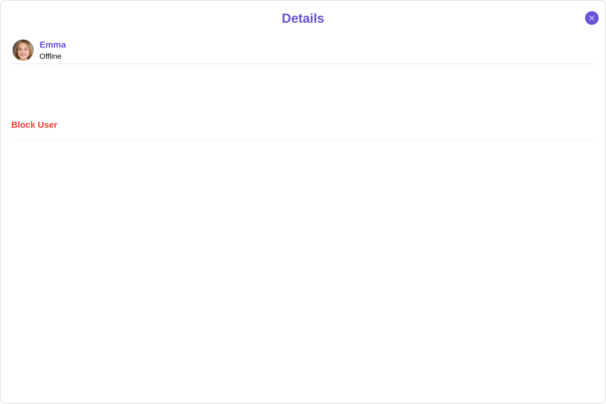
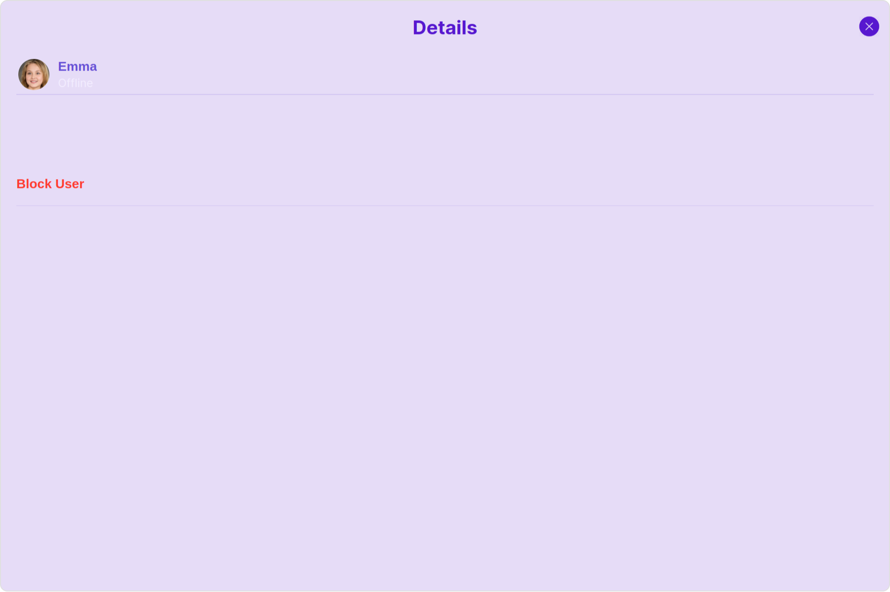
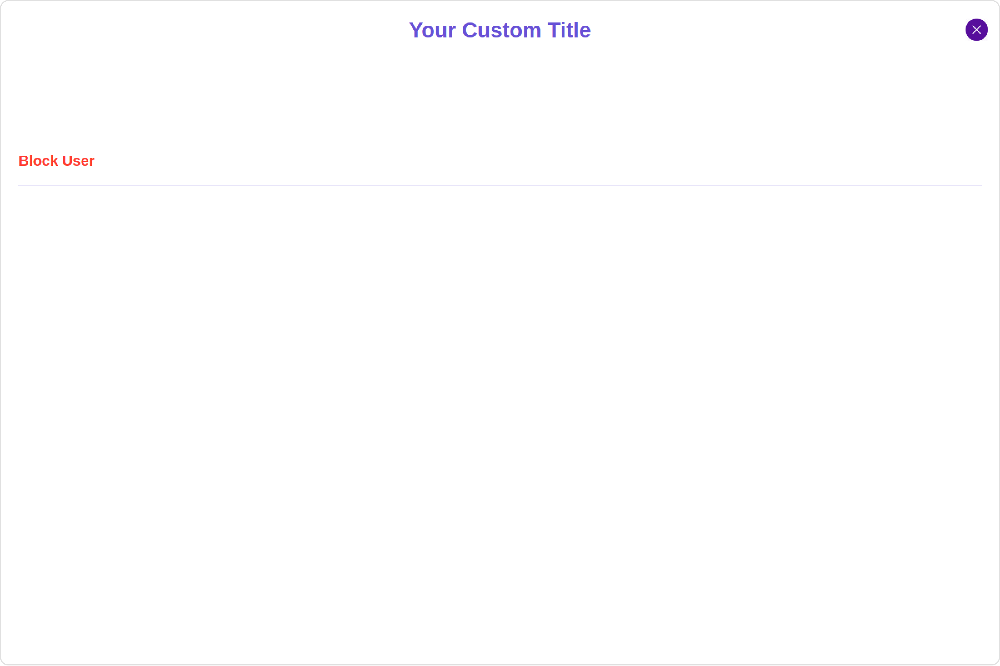
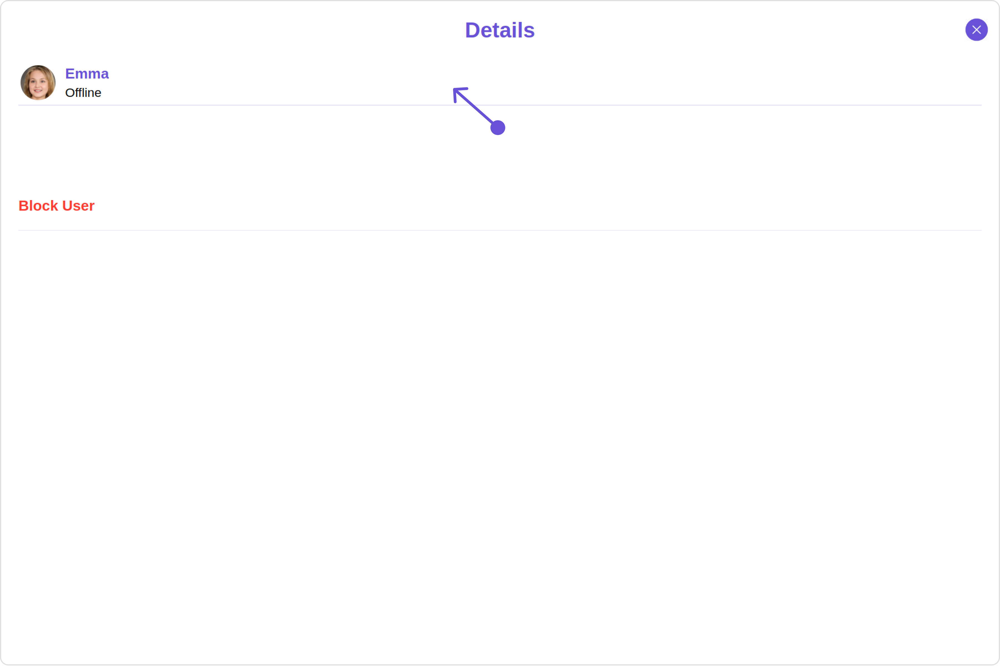
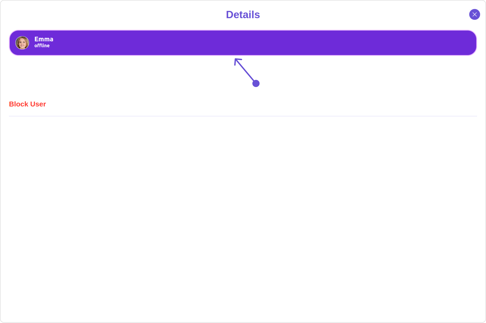
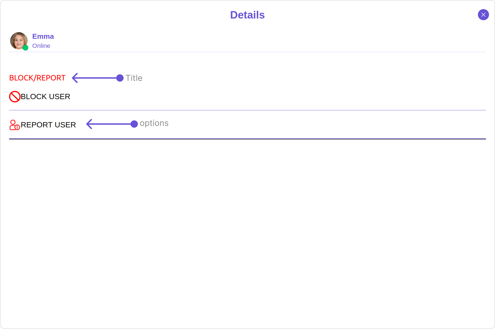

import Tabs from '@theme/Tabs';
import TabItem from '@theme/TabItem';

## Overview

`CometChatDetails` is a [Component](./components-overview#components) that provides additional information and settings related to a specific user.

The details screen includes the following elements and functionalities:

1. User Information: It displays details about the user. This includes his/her profile picture, name, status, and other relevant information.
2. User Actions: The details screen provides actions to block/unblock the user.



---

## Usage

### Integration

The following code snippet illustrates how you can directly incorporate the Users component into your Application.

<Tabs>
<TabItem value="UserDetailsDemo" label="UserDetailsDemo.tsx">

```javascript

import { CometChat } from '@cometchat/chat-sdk-javascript';
import { CometChatDetails } from '@cometchat/chat-uikit-react'
import React from 'react'

const UserDetailsDemo = () => {

    const [chatUser, setChatUser] = React.useState<CometChat.User>()
    React.useEffect(() => {
        CometChat.getUser("uid").then((user) => {
            setChatUser(user);
        })
    }, []);

  return (
    <CometChatDetails
    user={chatUser}
    />
  )
}

export default UserDetailsDemo;

```

</TabItem>
<TabItem value="ts" label="App.tsx">

```javascript
import { UserDetailsDemo } from "./UserDetailsDemo";

export default function App() {
  return (
    <div className="App">
      <UserDetailsDemo />
    </div>
  );
}
```

</TabItem>
</Tabs>

### Actions

[Actions](./components-overview#actions) dictate how a component functions. They are divided into two types: Predefined and User-defined. You can override either type, allowing you to tailor the behavior of the component to fit your specific needs.

##### 1. onClose

The `onClose` event is typically triggered when the close button is clicked and it carries a default action. However, with the following code snippet, you can effortlessly override this default operation.

This action does not come with any predefined behavior. However, you have the flexibility to override this event and tailor it to suit your needs using the following code snippet.

<Tabs>
<TabItem value="TypeScript" label="TypeScript">

```tsx title='UserDetailsDemo.tsx'
import { CometChat } from "@cometchat/chat-sdk-javascript";
import { CometChatDetails } from "@cometchat/chat-uikit-react";
import React from "react";

const UserDetailsDemo = () => {
  const [chatUser, setChatUser] = React.useState<CometChat.User>();
  React.useEffect(() => {
    CometChat.getUser("uid").then((user) => {
      setChatUser(user);
    });
  }, []);
  const getOnClose = () => {
    console.log("your custom on close actions");
  };
  return <CometChatDetails user={chatUser} onClose={getOnClose} />;
};

export default UserDetailsDemo;
```

</TabItem>
<TabItem value="JavaScript" label="JavaScript">

```jsx title='UserDetailsDemo.jsx'
import { CometChatDetails } from "@cometchat/chat-uikit-react";
import React, { useEffect, useState } from "react";

const UserDetailsDemo = () => {
  const [chatUser, setChatUser] = useState(null);
  useEffect(() => {
    CometChat.getUser("uid").then((user) => {
      setChatUser(user);
    });
  }, []);
  const getOnClose = () => {
    console.log("your custom on close actions");
  };
  return <CometChatDetails user={chatUser} onClose={getOnClose} />;
};

export default UserDetailsDemo;
```

</TabItem>
</Tabs>

##### 2. onError

This action doesn't change the behavior of the component but rather listens for any errors that occur in the User component.

<Tabs>
<TabItem value="TypeScript" label="TypeScript">

```tsx title='UserDetailsDemo.tsx'
import { CometChat } from "@cometchat/chat-sdk-javascript";
import { CometChatDetails } from "@cometchat/chat-uikit-react";
import React from "react";

const UserDetailsDemo = () => {
  const [chatUser, setChatUser] = React.useState<CometChat.User>();
  React.useEffect(() => {
    CometChat.getUser("uid").then((user) => {
      setChatUser(user);
    });
  }, []);
  const getOnClose = () => {
    console.log("your custom on close actions");
  };
  return <CometChatDetails user={chatUser} onError={handleOnError} />;
};

export default UserDetailsDemo;
```

</TabItem>
<TabItem value="JavaScript" label="JavaScript">

```jsx title='UserDetailsDemo.jsx'
import { CometChat } from "@cometchat/chat-sdk-javascript";
import { CometChatDetails } from "@cometchat/chat-uikit-react";
import React, { useEffect, useState } from "react";

const UserDetailsDemo = () => {
  const [chatUser, setChatUser] = useState(null);
  useEffect(() => {
    CometChat.getUser("uid").then((user) => {
      setChatUser(user);
    });
  }, []);
  const handleOnError = (error) => {
    console.log("Your custom on error actions");
  };
  return <CometChatDetails user={chatUser} onError={handleOnError} />;
};

export default UserDetailsDemo;
```

</TabItem>
</Tabs>

### Filters

**Filters** allow you to customize the data displayed in a list within a Component. You can filter the list based on your specific criteria, allowing for a more customized. Filters can be applied using RequestBuilders of Chat SDK.

`CometChatDetails` component does not have available filters.

---

### Events

[Events](./components-overview#events) are emitted by a `Component`. By using event you can extend existing functionality. Being global events, they can be applied in Multiple Locations and are capable of being Added or Removed.

To handle events supported by Users you have to add corresponding listeners by using `CometChatUserEvents`

The list of `User Related Events` emitted by the Details component is as follows:

| Event               | Description                                                               |
| ------------------- | ------------------------------------------------------------------------- |
| **ccUserBlocked**   | This event is triggered when the user successfully blocks another user.   |
| **ccUserUnblocked** | This event is triggered when the user successfully unblocks another user. |

<Tabs>

<TabItem value="js" label="Add Listener">

```javascript
import { CometChatUserEvents } from "@cometchat/chat-uikit-react";

const ccUserBlocked = CometChatUserEvents.ccUserBlocked.subscribe(
  (user: CometChat.User) => {
    //your code
  }
);
```

</TabItem>

</Tabs>

---

<Tabs>
<TabItem value="js" label="Remove Listener">

```javascript
import { CometChatUserEvents } from "@cometchat/chat-uikit-react";

ccUserBlocked?.unsubscribe();
```

</TabItem>
</Tabs>

---

## Customization

To fit your app's design requirements, you can customize the appearance of the details component. We provide exposed methods that allow you to modify the experience and behavior according to your specific needs.

### Style

Using Style you can customize the look and feel of the component in your app, These parameters typically control elements such as the color, size, shape, and fonts used within the component.

##### 1. Details Style

You can set the `DetailsStyle` to the User Details Component to customize the styling.



<Tabs>
<TabItem value="TypeScript" label="TypeScript">

```tsx title='UserDetailsDemo.tsx'
import { CometChat } from "@cometchat/chat-sdk-javascript";
import { CometChatDetails, DetailsStyle } from "@cometchat/chat-uikit-react";
import React from "react";

const UserDetailsDemo = () => {
  const [chatUser, setChatUser] = React.useState<CometChat.User>();
  React.useEffect(() => {
    CometChat.getUser("uid").then((user) => {
      setChatUser(user);
    });
  }, []);
  const detailsStyle = new DetailsStyle({
    background: "#e6dcf7",
    titleTextColor: "#5717cf",
    subtitleTextColor: "#f3edff",
  });
  return <CometChatDetails user={chatUser} detailsStyle={detailsStyle} />;
};

export default UserDetailsDemo;
```

</TabItem>
<TabItem value="JavaScript" label="JavaScript">

```jsx title='UserDetailsDemo.jsx'
import { CometChat } from "@cometchat/chat-sdk-javascript";
import { CometChatDetails, DetailsStyle } from "@cometchat/chat-uikit-react";
import React, { useEffect, useState } from "react";

const UserDetailsDemo = () => {
  const [chatUser, setChatUser] = useState(null);
  useEffect(() => {
    CometChat.getUser("uid").then((user) => {
      setChatUser(user);
    });
  }, []);
  const detailsStyle = new DetailsStyle({
    background: "#e6dcf7",
    titleTextColor: "#5717cf",
    subtitleTextColor: "#f3edff",
  });
  return <CometChatDetails user={chatUser} detailsStyle={detailsStyle} />;
};

export default UserDetailsDemo;
```

</TabItem>
</Tabs>

List of properties exposed by DetailsStyle

| Property                | Description                                                                  | Code                            |
| ----------------------- | ---------------------------------------------------------------------------- | ------------------------------- |
| **border**              | Used to set border                                                           | `border?: string,`              |
| **borderRadius**        | Used to set border radius                                                    | `borderRadius?: string;`        |
| **background**          | Used to set background colour                                                | `background?: string;`          |
| **height**              | Used to set height                                                           | `height?: string;`              |
| **width**               | Used to set width                                                            | `width?: string;`               |
| **titleTextFont**       | Used to customise the font of the title in the app bar                       | `titleTextFont?: string;`       |
| **titleTextColor**      | Used to customise the color of the title in the app bar                      | `titleTextColor?: string;`      |
| **onlineStatusColor**   | Sets the color of the status indicator representing the user's online status | `onlineStatusColor?: string;`   |
| **subtitleTextFont**    | Sets all the different properties of font for the subtitle text              | `subtitleTextFont?: string;`    |
| **subtitleTextColor**   | Sets the color of the subtitle text                                          | `subtitleTextColor?: string;`   |
| **closeButtonIconTint** | Sets the color of the close icon of the component                            | `closeButtonIconTint?: string;` |

##### 2. Avatar Style

To apply customized styles to the `Avatar` component in the Details Component, you can use the following code snippet. For further insights on `Avatar` Styles [refer](./avatar#avatar-style)

<Tabs>
<TabItem value="TypeScript" label="TypeScript">

```tsx title='UserDetailsDemo.tsx'
import { CometChat } from "@cometchat/chat-sdk-javascript";
import { CometChatDetails, AvatarStyle } from "@cometchat/chat-uikit-react";
import React from "react";

const UserDetailsDemo = () => {
  const [chatUser, setChatUser] = React.useState<CometChat.User>();
  React.useEffect(() => {
    CometChat.getUser("uid").then((user) => {
      setChatUser(user);
    });
  }, []);
  const avatarStyle = new AvatarStyle({
    backgroundColor: "#cdc2ff",
    border: "2px solid #6745ff",
    borderRadius: "10px",
    outerViewBorderColor: "#ca45ff",
    outerViewBorderRadius: "5px",
    nameTextColor: "#4554ff",
  });
  return <CometChatDetails user={chatUser} avatarStyle={avatarStyle} />;
};

export default UserDetailsDemo;
```

</TabItem>
<TabItem value="JavaScript" label="JavaScript">

```jsx title='UserDetailsDemo.jsx'
import { CometChat } from "@cometchat/chat-sdk-javascript";
import { CometChatDetails, AvatarStyle } from "@cometchat/chat-uikit-react";
import React, { useEffect, useState } from "react";

const UserDetailsDemo = () => {
  const [chatUser, setChatUser] = useState(null);
  useEffect(() => {
    CometChat.getUser("uid").then((user) => {
      setChatUser(user);
    });
  }, []);
  const avatarStyle = new AvatarStyle({
    backgroundColor: "#cdc2ff",
    border: "2px solid #6745ff",
    borderRadius: "10px",
    outerViewBorderColor: "#ca45ff",
    outerViewBorderRadius: "5px",
    nameTextColor: "#4554ff",
  });
  return <CometChatDetails user={chatUser} avatarStyle={avatarStyle} />;
};

export default UserDetailsDemo;
```

</TabItem>
</Tabs>

##### 3. StatusIndicator Style

To apply customized styles to the Status Indicator component in the Details Component, You can use the following code snippet. For further insights on Status Indicator Styles [refer](./status-indicator)

<Tabs>
<TabItem value="TypeScript" label="TypeScript">

```tsx title='UserDetailsDemo.tsx'
import { CometChat } from "@cometchat/chat-sdk-javascript";
import { CometChatDetails } from "@cometchat/chat-uikit-react";
import React from "react";

const UserDetailsDemo = () => {
  const [chatUser, setChatUser] = React.useState<CometChat.User>();
  React.useEffect(() => {
    CometChat.getUser("uid").then((user) => {
      setChatUser(user);
    });
  }, []);
  const statusIndicatorStyle = {
    background: "#db35de",
    height: "10px",
    width: "10px",
  };
  return (
    <CometChatDetails
      user={chatUser}
      statusIndicatorStyle={statusIndicatorStyle}
    />
  );
};

export default UserDetailsDemo;
```

</TabItem>
<TabItem value="JavaScript" label="JavaScript">

```jsx title='UserDetailsDemo.jsx'
import { CometChat } from "@cometchat/chat-sdk-javascript";
import { CometChatDetails } from "@cometchat/chat-uikit-react";
import React, { useEffect, useState } from "react";

const UserDetailsDemo = () => {
  const [chatUser, setChatUser] = useState(null);
  useEffect(() => {
    CometChat.getUser("uid").then((user) => {
      setChatUser(user);
    });
  }, []);
  const statusIndicatorStyle = {
    background: "#db35de",
    height: "10px",
    width: "10px",
  };
  return (
    <CometChatDetails
      user={chatUser}
      statusIndicatorStyle={statusIndicatorStyle}
    />
  );
};

export default UserDetailsDemo;
```

</TabItem>
</Tabs>

##### 4. ListItem Style

To apply customized styles to the `ListItemStyle` component in the `Details` Component, you can use the following code snippet. For further insights on `ListItemStyle` Styles [refer](./list-item)

<Tabs>
<TabItem value="TypeScript" label="TypeScript">

```tsx title='UserDetailsDemo.tsx'
import { CometChat } from "@cometchat/chat-sdk-javascript";
import { CometChatDetails, ListItemStyle } from "@cometchat/chat-uikit-react";
import React from "react";

const UserDetailsDemo = () => {
  const [chatUser, setChatUser] = React.useState<CometChat.User>();
  React.useEffect(() => {
    CometChat.getUser("uid").then((user) => {
      setChatUser(user);
    });
  }, []);
  const listItemStyle = new ListItemStyle({
    background: "#f3edff",
    padding: "5px",
    border: "1px solid #e9b8f5",
    titleColor: "#8830f2",
    borderRadius: "20px",
  });
  return <CometChatDetails user={chatUser} listItemStyle={listItemStyle} />;
};

export default UserDetailsDemo;
```

</TabItem>
<TabItem value="JavaScript" label="JavaScript">

```jsx title='UserDetailsDemo.jsx'
import { CometChat } from "@cometchat/chat-sdk-javascript";
import { CometChatDetails, ListItemStyle } from "@cometchat/chat-uikit-react";
import React, { useEffect, useState } from "react";

const UserDetailsDemo = () => {
  const [chatUser, setChatUser] = useState(null);
  useEffect(() => {
    CometChat.getUser("uid").then((user) => {
      setChatUser(user);
    });
  }, []);
  const listItemStyle = new ListItemStyle({
    background: "#f3edff",
    padding: "5px",
    border: "1px solid #e9b8f5",
    titleColor: "#8830f2",
    borderRadius: "20px",
  });
  return <CometChatDetails user={chatUser} listItemStyle={listItemStyle} />;
};

export default UserDetailsDemo;
```

</TabItem>
</Tabs>

##### 5. Backdrop Style

To apply customized styles to the `Backdrop` component in the `Details` Component, you can use the following code snippet, you can use the following code snippet. For further insights on `Backdrop` Styles [refer](./backdrop)

<Tabs>
<TabItem value="TypeScript" label="TypeScript">

```tsx title='UserDetailsDemo.tsx'
import { CometChat } from "@cometchat/chat-sdk-javascript";
import { CometChatDetails, BackdropStyle } from "@cometchat/chat-uikit-react";
import React from "react";

const UserDetailsDemo = () => {
  const [chatUser, setChatUser] = React.useState<CometChat.User>();
  React.useEffect(() => {
    CometChat.getUser("uid").then((user) => {
      setChatUser(user);
    });
  }, []);
  const backdropStyle = new BackdropStyle({
    width: "100%",
    height: "100%",
    border: "2px solid red",
    background: "blue",
    borderRadius: "20px",
  });
  return <CometChatDetails user={chatUser} backdropStyle={backdropStyle} />;
};

export default UserDetailsDemo;
```

</TabItem>
<TabItem value="JavaScript" label="JavaScript">

```jsx title='UserDetailsDemo.jsx'
import { CometChat } from "@cometchat/chat-sdk-javascript";
import { CometChatDetails, BackdropStyle } from "@cometchat/chat-uikit-react";
import React, { useEffect, useState } from "react";

const UserDetailsDemo = () => {
  const [chatUser, setChatUser] = useState(null);
  useEffect(() => {
    CometChat.getUser("uid").then((user) => {
      setChatUser(user);
    });
  }, []);
  const backdropStyle = new BackdropStyle({
    width: "100%",
    height: "100%",
    border: "2px solid red",
    background: "blue",
    borderRadius: "20px",
  });
  return <CometChatDetails user={chatUser} backdropStyle={backdropStyle} />;
};

export default UserDetailsDemo;
```

</TabItem>
</Tabs>

---

### Functionality

These are a set of small functional customizations that allow you to fine-tune the overall experience of the component. With these, you can change text, set custom icons, and toggle the visibility of UI elements.

<Tabs>
<TabItem value="TypeScript" label="TypeScript">

```tsx title='UserDetailsDemo.tsx'
import { CometChat } from "@cometchat/chat-sdk-javascript";
import { CometChatDetails } from "@cometchat/chat-uikit-react";
import React from "react";

const UserDetailsDemo = () => {
  const [chatUser, setChatUser] = React.useState<CometChat.User>();
  React.useEffect(() => {
    CometChat.getUser("uid").then((user) => {
      setChatUser(user);
    });
  }, []);
  return (
    <CometChatDetails
      user={chatUser}
      title="Your Custom Title"
      closeButtonIconURL="close button icon url"
      hideProfile={true}
    />
  );
};

export default UserDetailsDemo;
```

</TabItem>
<TabItem value="JavaScript" label="JavaScript">

```jsx title='UserDetailsDemo.jsx'
import { CometChat } from "@cometchat/chat-sdk-javascript";
import { CometChatDetails } from "@cometchat/chat-uikit-react";
import React, { useEffect, useState } from "react";

const UserDetailsDemo = () => {
  const [chatUser, setChatUser] = useState(null);
  useEffect(() => {
    CometChat.getUser("uid").then((user) => {
      setChatUser(user);
    });
  }, []);

  return (
    <CometChatDetails
      user={chatUser}
      title="Your Custom Title"
      closeButtonIconURL="close button icon url"
      hideProfile={true}
    />
  );
};

export default UserDetailsDemo;
```

</TabItem>
</Tabs>

Default:


Custom:


Below is a list of customizations along with corresponding code snippets
| Property | Description | Code |
| -------------------------------------------------------------------------------------------------------- | ---------------------------------------------------------------------------------------------------------------------------------- | ----------------------------------------------------------- |
| **title** <a data-tooltip-id="my-tooltip-html-prop"> <span class="material-icons red">report</span> </a> | Used to set the title | `title="Your Custom Title"` |
| **hideProfile** | Used to hide user profile view | ` hideProfile={true}` |
| **closeButtonIconURL** | Used to set the close button Icon | `closeButtonIconURL="your custom close button icon"` |
| **disableUsersPresence** | Used to control visibility of user indicator shown if user is online | `disableUsersPresence: {true}` |
| **data** | Used to pass custom details template | `data?: ({user, group,}: {user?: CometChat.User;group?: CometChat.Group;}) => CometChatDetailsTemplate[];` |
| **user** <a data-tooltip-id="my-tooltip-html-prop"> <span class="material-icons red">report</span> </a> | Used to set the user | `user={chatUser}` |

---

### Advance

For advanced-level customization, you can set custom views to the component. This lets you tailor each aspect of the component to fit your exact needs and application aesthetics. You can create and define your views, layouts, and UI elements and then incorporate those into the component.

---

#### SubtitleView

You can customize the subtitle view for each user item to meet your requirements

```jsx
subtitleView = { getSubtitleView };
```

Default:


Custom:


<Tabs>
<TabItem value="TypeScript" label="TypeScript">

```tsx title='UserDetailsDemo.tsx'
import { CometChat } from "@cometchat/chat-sdk-javascript";
import { CometChatDetails } from "@cometchat/chat-uikit-react";
import React from "react";

const UserDetailsDemo = () => {
  const [chatUser, setChatUser] = React.useState<CometChat.User>();
  React.useEffect(() => {
    CometChat.getUser("uid").then((user) => {
      setChatUser(user);
    });
  }, []);
  const getSubtitleView = (user: CometChat.User | any): JSX.Element => {
    function formatTime(timestamp: number) {
      const date = new Date(timestamp * 1000);
      return date.toLocaleString();
    }
    if (user instanceof CometChat.User) {
      return (
        <div
          style={{
            display: "flex",
            alignItems: "left",
            padding: "2px",
            fontSize: "10px",
          }}
        >
          <div style={{ color: "gray" }}>
            Last Active At: {formatTime(user.getLastActiveAt())}
          </div>
        </div>
      );
    } else {
      return <></>;
    }
  };
  return <CometChatDetails user={chatUser} subtitleView={getSubtitleView} />;
};

export default UserDetailsDemo;
```

</TabItem>
<TabItem value="JavaScript" label="JavaScript">

```jsx title='UserDetailsDemo.jsx'
import { CometChat } from "@cometchat/chat-sdk-javascript";
import { CometChatDetails } from "@cometchat/chat-uikit-react";
import React, { useEffect, useState } from "react";

const UserDetailsDemo = () => {
  const [chatUser, setChatUser] = useState(null);
  useEffect(() => {
    CometChat.getUser("uid").then((user) => {
      setChatUser(user);
    });
  }, []);

  const getSubtitleView = (user) => {
    function formatTime(timestamp) {
      const date = new Date(timestamp * 1000);
      return date.toLocaleString();
    }
    if (user instanceof CometChat.User) {
      return (
        <div
          style={{
            display: "flex",
            alignItems: "left",
            padding: "10px",
            fontSize: "10px",
          }}
        >
          <div style={{ color: "gray" }}>
            Last Active At: {formatTime(user.getLastActiveAt())}
          </div>
        </div>
      );
    } else {
      return <></>;
    }
  };
  return <CometChatDetails user={chatUser} subtitleView={getSubtitleView} />;
};

export default UserDetailsDemo;
```

</TabItem>
</Tabs>

#### CustomProfileView

You can customize the subtitle view for each user item to meet your requirements

```jsx
customProfileView = { getCustomProfileView };
```

Default:



Custom:



<Tabs>
<TabItem value="TypeScript" label="TypeScript">

```tsx title='UserDetailsDemo.tsx'
import { CometChat } from "@cometchat/chat-sdk-javascript";
import { CometChatDetails } from "@cometchat/chat-uikit-react";
import React from "react";

const UserDetailsDemo = () => {
  const [chatUser, setChatUser] = React.useState<CometChat.User>();
  React.useEffect(() => {
    CometChat.getUser("uid").then((user) => {
      setChatUser(user);
    });
  }, []);
  function getCustomProfileView(user?: CometChat.User | any): JSX.Element {
    return (
      <div
        style={{
          display: "flex",
          alignItems: "left",
          padding: "10px",
          border: "2px solid #e9baff",
          borderRadius: "20px",
          background: "#6e2bd9",
        }}
      >
        <cometchat-avatar image={user.getAvatar()} name={user.getName()} />

        <div style={{ display: "flex", paddingLeft: "10px" }}>
          <div
            style={{ fontWeight: "bold", color: "#ffffff", fontSize: "14px" }}
          >
            {user.getName()}
            <div
              style={{ color: "#ffffff", fontSize: "10px", textAlign: "left" }}
            >
              {user.getStatus()}
            </div>
          </div>
        </div>
      </div>
    );
  }
  return (
    <CometChatDetails
      user={chatUser}
      customProfileView={getCustomProfileView}
    />
  );
};

export default UserDetailsDemo;
```

</TabItem>
<TabItem value="JavaScript" label="JavaScript">

```jsx title='UserDetailsDemo.jsx'
import { CometChat } from "@cometchat/chat-sdk-javascript";
import { CometChatDetails } from "@cometchat/chat-uikit-react";
import React, { useEffect, useState } from "react";

const UserDetailsDemo = () => {
  const [chatUser, setChatUser] = useState(null);
  useEffect(() => {
    CometChat.getUser("uid").then((user) => {
      setChatUser(user);
    });
  }, []);

  function getCustomProfileView(user?: CometChat.User | any): JSX.Element {
    return (
      <div
        style={{
          display: "flex",
          alignItems: "left",
          padding: "10px",
          border: "2px solid #e9baff",
          borderRadius: "20px",
          background: "#6e2bd9",
        }}
      >
        <cometchat-avatar image={user.getAvatar()} name={user.getName()} />

        <div style={{ display: "flex", paddingLeft: "10px" }}>
          <div
            style={{ fontWeight: "bold", color: "#ffffff", fontSize: "14px" }}
          >
            {user.getName()}
            <div
              style={{ color: "#ffffff", fontSize: "10px", textAlign: "left" }}
            >
              {user.getStatus()}
            </div>
          </div>
        </div>
      </div>
    );
  }
  return (
    <CometChatDetails
      user={chatUser}
      customProfileView={getCustomProfileView}
    />
  );
};

export default UserDetailsDemo;
```

</TabItem>
</Tabs>

#### DetailsTemplate

The `CometChatDetailsTemplate` offers a structure for organizing information in the CometChat details component. It serves as a blueprint, defining how user-related details are presented. This structure allows for customization and organization within the CometChat interface.

<Tabs>
<TabItem value="TypeScript" label="TypeScript">

```tsx title='UserDetailsDemo.tsx'
import React, { useEffect, useState } from "react";
import { CometChat } from "@cometchat/chat-sdk-javascript";
import {
  CometChatDetails,
  CometChatDetailsOption,
  CometChatDetailsTemplate,
} from "@cometchat/chat-uikit-react";

const UserDetailsDemo = () => {
  const [chatUser, setChatUser] = useState<CometChat.User>();

  useEffect(() => {
    CometChat.getUser("uid").then((user) => {
      setChatUser(user);
    });
  }, []);

  const getTemplate = () => {
    const getOptions = () => {
      const blockOption: CometChatDetailsOption = {
        id: "custom-block",
        title: "BLOCK USER",
        iconURL: "icon",
        iconTint: "red",
        titleFont: "16px sans-serif, Inter",
      };
      const reportOption: CometChatDetailsOption = {
        id: "custom-report",
        title: "REPORT USER",
        iconURL: "icon",
        iconTint: "red",
        titleFont: "16px sans-serif, Inter",
      };
      return [blockOption, reportOption];
    };

    let detailsTemplate: CometChatDetailsTemplate = {
      id: "Block",
      title: "BLOCK/REPORT",
      titleColor: "red",
      sectionSeparatorColor: "grey",
      itemSeparatorColor: "#6851D6",
      hideItemSeparator: false,
      options: getOptions,
    };
    return [detailsTemplate];
  };

  return <CometChatDetails user={chatUser} data={getTemplate()} />;
};

export default UserDetailsDemo;
```

</TabItem>

<TabItem value="JavaScript" label="JavaScript">

```jsx title='UserDetailsDemo.jsx'
import React, { useEffect, useState } from "react";
import { CometChat } from "@cometchat/chat-sdk-javascript";
import {
  CometChatDetails,
  CometChatDetailsOption,
  CometChatDetailsTemplate,
} from "@cometchat/chat-uikit-react";

const UserDetailsDemo = () => {
  const [chatUser, setChatUser] = useState(null);

  useEffect(() => {
    CometChat.getUser("uid").then((user) => {
      setChatUser(user);
    });
  }, []);

  const getTemplate = () => {
    const getOptions = () => {
      const blockOption = {
        id: "custom-block",
        title: "BLOCK USER",
        iconURL: "icon",
        iconTint: "red",
        titleFont: "16px sans-serif, Inter",
      };
      const reportOption = {
        id: "custom-report",
        title: "REPORT USER",
        iconURL: "icon",
        iconTint: "red",
        titleFont: "16px sans-serif, Inter",
      };
      return [blockOption, reportOption];
    };

    let detailsTemplate = {
      id: "Block",
      title: "BLOCK/REPORT",
      titleColor: "red",
      sectionSeparatorColor: "grey",
      itemSeparatorColor: "#6851D6",
      hideItemSeparator: false,
      options: getOptions,
    };
    return [detailsTemplate];
  };

  return <CometChatDetails user={chatUser} data={getTemplate()} />;
};

export default UserDetailsDemo;
```

</TabItem>
</Tabs>



This defines the structure of template data for the details component.

| Name                      | Type                                                                                                                                                                      | Description                                                           |
| ------------------------- | ------------------------------------------------------------------------------------------------------------------------------------------------------------------------- | --------------------------------------------------------------------- |
| **id**                    | String                                                                                                                                                                    | Identifier for the template                                           |
| **title**                 | String                                                                                                                                                                    | Heading text for the template                                         |
| **titleFont**             | String                                                                                                                                                                    | Sets all the different properties of font for the title text          |
| **titleColor**            | String                                                                                                                                                                    | Sets the foreground color of title text                               |
| **itemSeparatorColor**    | String                                                                                                                                                                    | Sets the color of the template's option separator                     |
| **hideItemSeparator**     | Boolean                                                                                                                                                                   | When set to true, hides the separator under each option in a template |
| **sectionSeparatorColor** | String                                                                                                                                                                    | Sets the color of the template separator                              |
| **hideSectionSeparator**  | Boolean                                                                                                                                                                   | When set to true, hides the separator for the template                |
| **options**               | CometChatDetailsTemplate.options?: ((loggedInUser: User &#124; null, group: Group &#124; null, section: string) => CometChatDetailsOption[]) &#124; null &#124; undefined | defines the structure for individual options                          |

#### DetailsOption

The `DetailsOption` defines the structure for individual options within the CometChat details component, facilitating customization and functionality for user interactions.

This defines the structure of each option for a template in the details component.

| Name                | Type                                                                 | Description                                                                             |
| ------------------- | -------------------------------------------------------------------- | --------------------------------------------------------------------------------------- |
| **id**              | String                                                               | Identifier for the template option                                                      |
| **title**           | String                                                               | Heading text for the template option                                                    |
| **tail**            | any                                                                  | User-defined UI component to customise the trailing view for each option in a template. |
| **customView**      | any                                                                  | User-defined UI component to override the default view for the option.                  |
| **onClick**         | ((item: CometChat.User &#124; CometChat.Group) => void) &#124; null; | Function invoked when user clicks on the option.                                        |
| **titleFont**       | String                                                               | Sets all the different properties of font for the title text                            |
| **titleColor**      | String                                                               | Sets the foreground colour of title text                                                |
| **iconURL**         | String                                                               | Image url for the icon to symbolise an option                                           |
| **iconTint**        | String                                                               | Color applied to the icon of the option                                                 |
| **backgroundColor** | String                                                               | Color applied to the background of the option                                           |

import { Tooltip } from 'react-tooltip'
import 'react-tooltip/dist/react-tooltip.css'

<Tooltip
  id="my-tooltip-html-prop"
  html="Not available in DetailsConfiguration"
/>
