import Tabs from '@theme/Tabs';
import TabItem from '@theme/TabItem';

## Overview

The Groups is a [Component](./components-overview#components), showcasing an accessible list of all available groups. It provides an integral search functionality, allowing you to locate any specific groups swiftly and easily. For each group listed, the group name is displayed by default, in conjunction with the group icon when available. Additionally, it provides a useful feature by displaying the number of members in each group as a subtitle, offering valuable context about group size and activity level.

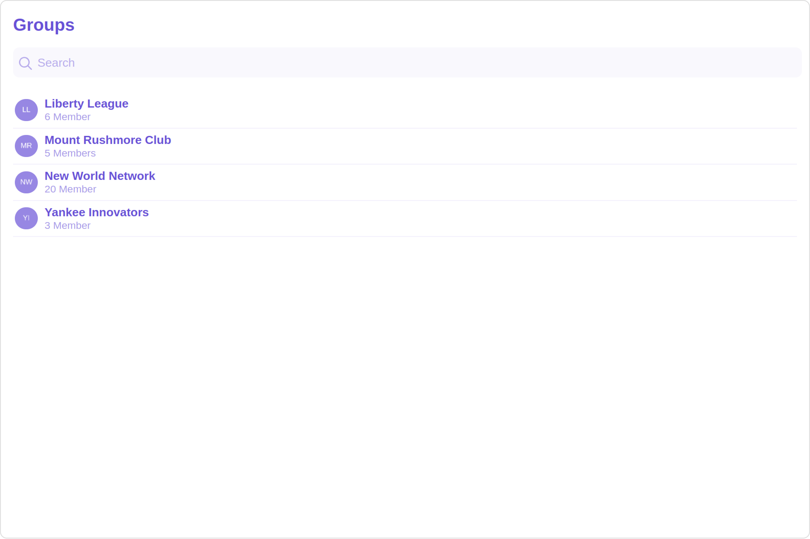

The Groups component is composed of the following BaseComponents:

| Components                       | Description                                                                                                              |
| -------------------------------- | ------------------------------------------------------------------------------------------------------------------------ |
| [CometChatList](./list)          | a reusable container component having title, search box, customisable background and a List View                         |
| [CometChatListItem](./list-item) | a component that renders data obtained from a Group object on a Tile having a title, subtitle, leading and trailing view |

---

## Usage

### Integration

The following code snippet illustrates how you can directly incorporate the Groups component into your Application.

<Tabs>
<TabItem value="GroupsDemo" label="GroupsDemo.tsx">

```tsx
import { CometChatGroups } from "@cometchat/chat-uikit-react";
import React from "react";

const GroupsDemo = () => {
  return <CometChatGroups />;
};

export default GroupsDemo;
```

</TabItem>
<TabItem value="ts" label="App.tsx">

```javascript
import { GroupsDemo } from "./GroupsDemo";

export default function App() {
  return (
    <div className="App">
      <GroupsDemo />
    </div>
  );
}
```

</TabItem>
</Tabs>

---

### Actions

[Actions](./components-overview#actions) dictate how a component functions. They are divided into two types: Predefined and User-defined. You can override either type, allowing you to tailor the behavior of the component to fit your specific needs.

##### 1. onSelect

The `onSelect` action is activated when you select the done icon while in selection mode. This returns the `group` object along with the boolean flag `selected` to indicate if the group was selected or unselected.

This action does not come with any predefined behavior. However, you have the flexibility to override this event and tailor it to suit your needs using the following code snippet.

<Tabs>
<TabItem value="TypeScript" label="TypeScript">

```tsx title='GroupsDemo.tsx'
import { CometChat } from "@cometchat/chat-sdk-javascript";
import { CometChatGroups, SelectionMode } from "@cometchat/chat-uikit-react";
import React from "react";

const GroupsDemo = () => {
  function handleOnSelect(group: CometChat.Group, selected: boolean): void {
    console.log(group);
    //your custom onSelect actions
  }
  return (
    <CometChatGroups
      selectionMode={SelectionMode.multiple}
      onSelect={handleOnSelect}
    />
  );
};

export default GroupsDemo;
```

</TabItem>
<TabItem value="JavaScript" label="JavaScript">

```jsx title='GroupsDemo.jsx'
import { CometChatGroups, SelectionMode } from "@cometchat/chat-uikit-react";
import React from "react";

const GroupsDemo = () => {
  function handleOnSelect(group, selected) {
    console.log(group);
    //your custom onSelect actions
  }
  return (
    <CometChatGroups
      selectionMode={SelectionMode.multiple}
      onSelect={handleOnSelect}
    />
  );
};

export default GroupsDemo;
```

</TabItem>
</Tabs>

##### 2. onItemClick

The `onItemClick` event is activated when you click on the Group List item. This action does not come with any predefined behavior. However, you have the flexibility to override this event and tailor it to suit your needs using the following code snippet.

<Tabs>
<TabItem value="TypeScript" label="TypeScript">

```tsx title='GroupsDemo.tsx'
import { CometChat } from "@cometchat/chat-sdk-javascript";
import { CometChatGroups } from "@cometchat/chat-uikit-react";
import React from "react";

const GroupsDemo = () => {
  function handleOnItemClick(group: CometChat.Group): void {
    console.log(group, "your custom on item click action");
  }
  return <CometChatGroups onItemClick={handleOnItemClick} />;
};

export default GroupsDemo;
```

</TabItem>
<TabItem value="JavaScript" label="JavaScript">

```jsx title='GroupsDemo.jsx'
import { CometChatGroups } from "@cometchat/chat-uikit-react";
import React from "react";

const GroupsDemo = () => {
  function handleOnItemClick(group) {
    console.log(group, "your custom on item click action");
  }
  return <CometChatGroups onItemClick={handleOnItemClick} />;
};

export default GroupsDemo;
```

</TabItem>
</Tabs>

##### 3. onError

This action doesn't change the behavior of the component but rather listens for any errors that occur in the Groups component.

<Tabs>
<TabItem value="TypeScript" label="TypeScript">

```tsx title='GroupsDemo.tsx'
import { CometChat } from "@cometchat/chat-sdk-javascript";
import { CometChatGroups } from "@cometchat/chat-uikit-react";
import React from "react";

const GroupsDemo = () => {
  const handleOnError = (error: CometChat.CometChatException) => {
    console.log("Your custom on error actions");
  };
  return <CometChatGroups onError={handleOnError} />;
};

export default GroupsDemo;
```

</TabItem>
<TabItem value="JavaScript" label="JavaScript">

```jsx title='GroupsDemo.jsx'
import { CometChatGroups } from "@cometchat/chat-uikit-react";
import React from "react";

const GroupsDemo = () => {
  const handleOnError = (error) => {
    console.log("Your custom on error actions");
  };
  return <CometChatGroups onError={handleOnError} />;
};

export default GroupsDemo;
```

</TabItem>
</Tabs>

### Filters

**Filters** allow you to customize the data displayed in a list within a Component. You can filter the list based on your specific criteria, allowing for a more customized. Filters can be applied using RequestBuilders of Chat SDK.

##### 1. GroupsRequestBuilder

The [GroupsRequestBuilder](/sdk/javascript/retrieve-groups) enables you to filter and customize the group list based on available parameters in [GroupsRequestBuilder](/sdk/javascript/retrieve-groups). This feature allows you to create more specific and targeted queries when fetching groups. The following are the parameters available in [GroupsRequestBuilder](/sdk/javascript/retrieve-groups)

| Methods              | Type                | Description                                                                             |
| -------------------- | ------------------- | --------------------------------------------------------------------------------------- |
| **setLimit**         | number              | sets the number groups that can be fetched in a single request, suitable for pagination |
| **setSearchKeyword** | String              | used for fetching groups matching the passed string                                     |
| **joinedOnly**       | boolean             | to fetch only joined groups.                                                            |
| **setTags**          | Array&lt;String&gt; | used for fetching groups containing the passed tags                                     |
| **withTags**         | boolean             | used to fetch tags data along with the list of groups                                   |

**Example**

In the example below, we are applying a filter to the Group List based on only joined groups and setting the limit to two.

<Tabs>
<TabItem value="TypeScript" label="TypeScript">

```tsx title='GroupsDemo.tsx'
import { CometChat } from "@cometchat/chat-sdk-javascript";
import { CometChatGroups } from "@cometchat/chat-uikit-react";
import React from "react";

const GroupsDemo = () => {
  return (
    <CometChatGroups
      groupsRequestBuilder={new CometChat.GroupsRequestBuilder()
        .setLimit(2)
        .joinedOnly(true)}
    />
  );
};

export default GroupsDemo;
```

</TabItem>
<TabItem value="JavaScript" label="JavaScript">

```jsx title='GroupsDemo.jsx'
import { CometChat } from "@cometchat/chat-sdk-javascript";
import { CometChatGroups } from "@cometchat/chat-uikit-react";
import React from "react";

const GroupsDemo = () => {
  return (
    <CometChatGroups
      groupsRequestBuilder={new CometChat.GroupsRequestBuilder()
        .setLimit(2)
        .joinedOnly(true)}
    />
  );
};

export default GroupsDemo;
```

</TabItem>
</Tabs>

##### 2. SearchRequestBuilder

The SearchRequestBuilder uses [GroupsRequestBuilder](/sdk/javascript/retrieve-groups) enables you to filter and customize the search list based on available parameters in GroupsRequestBuilder.
This feature allows you to keep uniformity between the displayed Groups List and searched Group List.

**Example**

<Tabs>
<TabItem value="TypeScript" label="TypeScript">

```tsx title='GroupsDemo.tsx'
import { CometChat } from "@cometchat/chat-sdk-javascript";
import { CometChatGroups } from "@cometchat/chat-uikit-react";
import React from "react";

const GroupsDemo = () => {
  return (
    <CometChatGroups
      searchRequestBuilder={new CometChat.GroupsRequestBuilder()
        .setLimit(2)
        .setSearchKeyword("your keyword")}
    />
  );
};

export default GroupsDemo;
```

</TabItem>
<TabItem value="JavaScript" label="JavaScript">

```jsx title='GroupsDemo.jsx'
import { CometChat } from "@cometchat/chat-sdk-javascript";
import { CometChatGroups } from "@cometchat/chat-uikit-react";
import React from "react";

const GroupsDemo = () => {
  return (
    <CometChatGroups
      searchRequestBuilder={new CometChat.GroupsRequestBuilder()
        .setLimit(2)
        .setSearchKeyword("your keyword")}
    />
  );
};

export default GroupsDemo;
```

</TabItem>
</Tabs>

---

### Events

[Events](./components-overview#events) are emitted by a `Component`. By using event you can extend existing functionality. Being global events, they can be applied in Multiple Locations and are capable of being Added or Removed.

To handle events supported by Groups you have to add corresponding listeners by using `CometChatGroupEvents`

The `Groups` component does not produce any events directly.

---

## Customization

To fit your app's design requirements, you can customize the appearance of the Groups component. We provide exposed methods that allow you to modify the experience and behavior according to your specific needs.

### Style

Using **Style** you can **customize** the look and feel of the component in your app, These parameters typically control elements such as the **color**, **size**, **shape**, and **fonts** used within the component.

##### 1. Groups Style

You can set the `GroupsStyle` to the Groups Component to customize the styling.

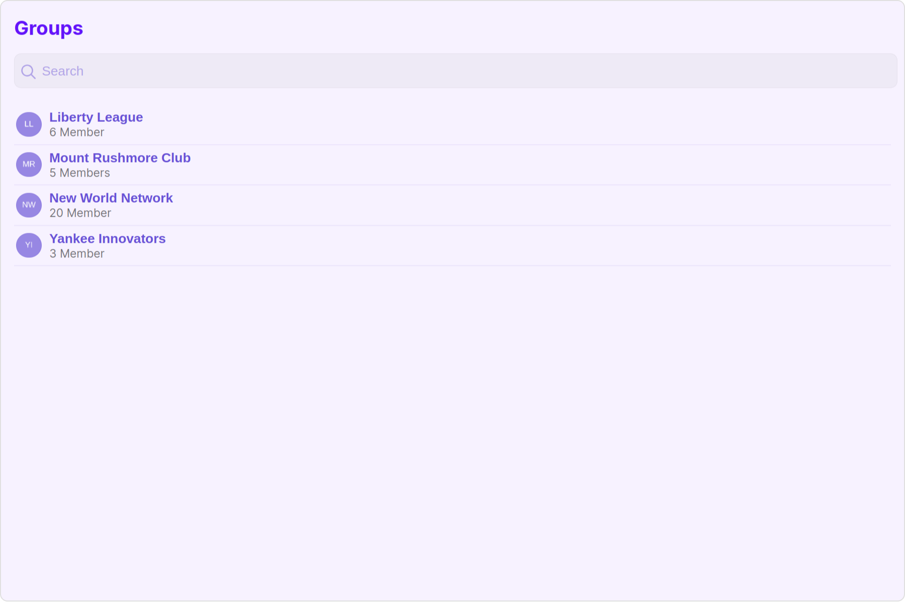

<Tabs>
<TabItem value="TypeScript" label="TypeScript">

```tsx title='GroupsDemo.tsx'
import { CometChatGroups, GroupsStyle } from "@cometchat/chat-uikit-react";
import React from "react";

const GroupsDemo = () => {
  const groupsStyle = new GroupsStyle({
    background: "#f7f2ff",
    titleTextColor: "#6414fa",
    searchTextColor: "#940be3",
    separatorColor: "#ffffff",
  });
  return <CometChatGroups groupsStyle={groupsStyle} />;
};

export default GroupsDemo;
```

</TabItem>
<TabItem value="JavaScript" label="JavaScript">

```jsx title='GroupsDemo.jsx'
import { CometChatGroups, GroupsStyle } from "@cometchat/chat-uikit-react";
import React from "react";

const GroupsDemo = () => {
  const groupsStyle = new GroupsStyle({
    background: "#f7f2ff",
    titleTextColor: "#6414fa",
    searchTextColor: "#940be3",
    separatorColor: "#ffffff",
  });
  return <CometChatGroups groupsStyle={groupsStyle} />;
};

export default GroupsDemo;
```

</TabItem>
</Tabs>

List of properties exposed by GroupsStyle

| Property                        | Description                                                                                                       | Code                                    |
| ------------------------------- | ----------------------------------------------------------------------------------------------------------------- | --------------------------------------- |
| **border**                      | Used to set border                                                                                                | `border?: string,`                      |
| **borderRadius**                | Used to set border radius                                                                                         | `borderRadius?: string;`                |
| **background**                  | Used to set background colour                                                                                     | `background?: string;`                  |
| **height**                      | Used to set height                                                                                                | `height?: string;`                      |
| **width**                       | Used to set width                                                                                                 | `width?: string;`                       |
| **titleTextFont**               | Used to customise the font of the title in the app bar                                                            | `titleTextFont?: string;`               |
| **titleTextColor**              | Used to customise the color of the title in the app bar                                                           | `titleTextColor?: string;`              |
| **emptyStateTextFont**          | Used to set the font style of the response text shown when fetchig the list of groups has returned an empty list  | `emptyStateTextFont?: string;`          |
| **emptyStateTextColor**         | Used to set the color of the response text shown when fetchig the list of groups has returned an empty list       | `emptyStateTextColor?: string;`         |
| **errorStateTextFont**          | Used to set the font style of the response text shown in case some error occurs while fetching the list of groups | `errorStateTextFont?: string;`          |
| **errorStateTextColor**         | Used to set the font style of the response text shown in case some error occurs while fetching the list of groups | `errorStateTextColor?: string;`         |
| **loadingIconTint**             | Used to set the color of the icon shown while the list of groups is being fetched                                 | `loadingIconTint?: string;`             |
| **separatorColor**              | Used to set the color of the divider separating the group member items                                            | `separatorColor?: string;`              |
| **boxShadow**                   | Sets shadow effects around the element                                                                            | `boxShadow?: string;`                   |
| **privateGroupIconBackground**  | Sets background color of private group Icon                                                                       | `privateGroupIconBackground?: string;`  |
| **passwordGroupIconBackground** | Sets background color of protected group Icon                                                                     | `passwordGroupIconBackground?: string;` |
| **searchIconTint**              | Used to set the color of the search icon in the search box                                                        | `searchIconTint?: string;`              |
| **searchBorder**                | Used to set the border of the search box                                                                          | `searchBorder?: string;`                |
| **searchBorderRadius**          | Used to set the border radius of the search box                                                                   | `searchBorderRadius?: string;`          |
| **searchBackground**            | Used to set the background color of the search box                                                                | `searchBackground?: string;`            |
| **searchPlaceholderTextFont**   | Used to set the font of the placeholder text in the search box                                                    | `searchPlaceholderTextFont?: string;`   |
| **searchPlaceholderTextColor**  | Used to set the color of the placeholder text in the search box                                                   | `searchPlaceholderTextColor?: string;`  |
| **searchTextFont**              | Used to set the font of the text in the search box                                                                | `searchTextFont?: string;`              |
| **searchTextColor**             | Used to set the color of the text in the search box                                                               | `searchTextColor?: string;`             |
| **subTitleTextFont**            | Used to customise the font of the subtitle text.                                                                  | `subTitleTextFont?: string;`            |
| **subTitleTextColor**           | Used to customise the color of the subtitle text.                                                                 | `subTitleTextColor?: string;`           |

##### 2. Avatar Style

To apply customized styles to the `Avatar` component in the Groups Component, you can use the following code snippet. For further insights on `Avatar` Styles [refer](./avatar#avatar-style)

<Tabs>
<TabItem value="TypeScript" label="TypeScript">

```tsx title='GroupsDemo.tsx'
import { CometChatGroups, AvatarStyle } from "@cometchat/chat-uikit-react";
import React from "react";

const GroupsDemo = () => {
  const avatarStyle = new AvatarStyle({
    backgroundColor: "#cdc2ff",
    border: "2px solid #6745ff",
    borderRadius: "10px",
    outerViewBorderColor: "#ca45ff",
    outerViewBorderRadius: "5px",
    nameTextColor: "#4554ff",
  });
  return <CometChatGroups avatarStyle={avatarStyle} />;
};

export default GroupsDemo;
```

</TabItem>
<TabItem value="JavaScript" label="JavaScript">

```jsx title='GroupsDemo.jsx'
import { CometChatGroups, AvatarStyle } from "@cometchat/chat-uikit-react";
import React from "react";

const GroupsDemo = () => {
  const avatarStyle = new AvatarStyle({
    backgroundColor: "#cdc2ff",
    border: "2px solid #6745ff",
    borderRadius: "10px",
    outerViewBorderColor: "#ca45ff",
    outerViewBorderRadius: "5px",
    nameTextColor: "#4554ff",
  });
  return <CometChatGroups avatarStyle={avatarStyle} />;
};

export default GroupsDemo;
```

</TabItem>
</Tabs>

##### 3. StatusIndicator Style

To apply customized styles to the Status Indicator component in the Groups Component, You can use the following code snippet. For further insights on Status Indicator Styles [refer](./status-indicator)

<Tabs>
<TabItem value="TypeScript" label="TypeScript">

```tsx title='GroupsDemo.tsx'
import { CometChatGroups } from "@cometchat/chat-uikit-react";
import React from "react";

const GroupsDemo = () => {
  const statusIndicatorStyle = {
    background: "#db35de",
    height: "10px",
    width: "10px",
  };
  return <CometChatGroups statusIndicatorStyle={statusIndicatorStyle} />;
};

export default GroupsDemo;
```

</TabItem>
<TabItem value="JavaScript" label="JavaScript">

```jsx title='GroupsDemo.jsx'
import { CometChatGroups } from "@cometchat/chat-uikit-react";
import React from "react";

const GroupsDemo = () => {
  const statusIndicatorStyle = {
    background: "#db35de",
    height: "10px",
    width: "10px",
  };
  return <CometChatGroups statusIndicatorStyle={statusIndicatorStyle} />;
};

export default GroupsDemo;
```

</TabItem>
</Tabs>

##### 4. ListItem Style

To apply customized styles to the `ListItemStyle` component in the `Groups` Component, you can use the following code snippet. For further insights on `ListItemStyle` Styles [refer](./list-item)

<Tabs>
<TabItem value="TypeScript" label="TypeScript">

```tsx title='GroupsDemo.tsx'
import { CometChatGroups, ListItemStyle } from "@cometchat/chat-uikit-react";
import React from "react";

const GroupsDemo = () => {
  const listItemStyle = new ListItemStyle({
    width: "100%",
    height: "100%",
    border: "2px solid red",
  });
  return <CometChatGroups listItemStyle={listItemStyle} />;
};

export default GroupsDemo;
```

</TabItem>
<TabItem value="JavaScript" label="JavaScript">

```jsx title='GroupsDemo.jsx'
import { CometChatGroups, ListItemStyle } from "@cometchat/chat-uikit-react";
import React from "react";

const GroupsDemo = () => {
  const listItemStyle = new ListItemStyle({
    width: "100%",
    height: "100%",
    border: "2px solid red",
  });
  return <CometChatGroups listItemStyle={listItemStyle} />;
};

export default GroupsDemo;
```

</TabItem>
</Tabs>

---

### Functionality

These are a set of small functional customizations that allow you to fine-tune the overall experience of the component. With these, you can change text, set custom icons, and toggle the visibility of UI elements.

<Tabs>
<TabItem value="TypeScript" label="TypeScript">

```tsx title='GroupsDemo.tsx'
import { CometChatGroups, TitleAlignment } from "@cometchat/chat-uikit-react";
import React from "react";

const GroupsDemo = () => {
  return (
    <CometChatGroups
      title="Your Custom Title"
      titleAlignment={TitleAlignment.center}
      hideSearch={true}
    />
  );
};

export default GroupsDemo;
```

</TabItem>
<TabItem value="JavaScript" label="JavaScript">

```jsx title='GroupsDemo.jsx'
import { CometChatGroups, TitleAlignment } from "@cometchat/chat-uikit-react";
import React from "react";

const GroupsDemo = () => {
  return (
    <CometChatGroups
      title="Your Custom Title"
      titleAlignment={TitleAlignment.center}
      hideSearch={true}
    />
  );
};

export default GroupsDemo;
```

</TabItem>
</Tabs>

Default:
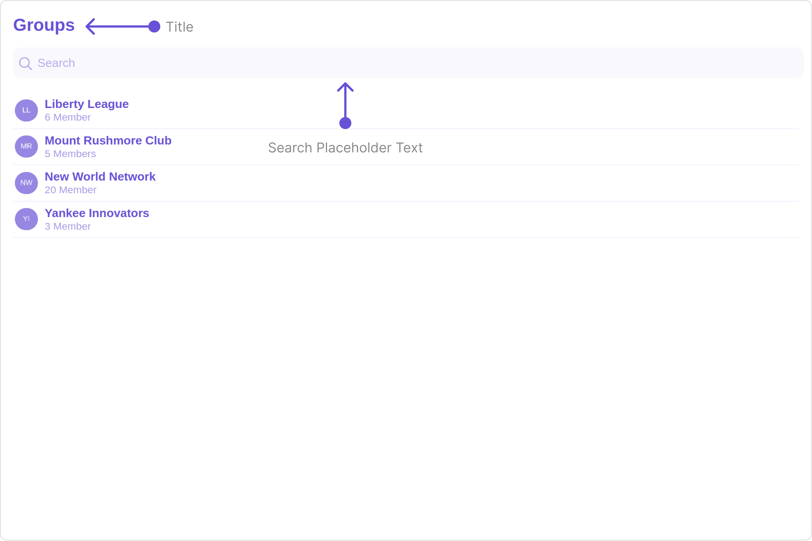

Custom:
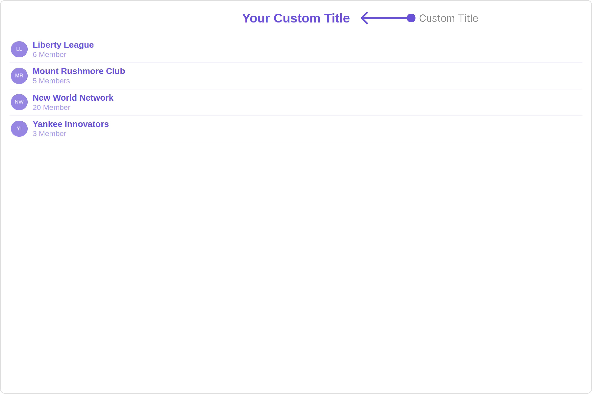

Below is a list of customizations along with corresponding code snippets:
| Property | Description | Code |
| -------------------------------------------------------------------------------------------------------- | ---------------------------------------------------------------------------------------------------------------------------------- | ----------------------------------------------------------- |
| **title** <a data-tooltip-id="my-tooltip-html-prop"> <span class="material-icons red">report</span> </a> | Used to set title in the app heading | `title="Your Custom Title"` |
| **searchPlaceholderText** <a data-tooltip-id="my-tooltip-html-prop"> <span class="material-icons red">report</span> </a>| Used to set search placeholder text | `searchPlaceholderText="Your Custom search placeholder text"` |
| **errorStateText** <a data-tooltip-id="my-tooltip-html-prop"> <span class="material-icons red">report</span> </a>| Used to set a custom text response when some error occurs on fetching the list of groups | `errorStateText="your custom error state text"` |
| **emptyStateText** <a data-tooltip-id="my-tooltip-html-prop"> <span class="material-icons red">report</span> </a> | Used to set a custom text response when fetching the groups has returned an empty list | `emptyStateText="your custom empty state text"` |
| **searchIconURL** | Used to set search Icon in the search field | `searchIconURL="Your Custom search icon"` |
| **loadingIconURL** | Used to set loading Icon | `loadingIconURL="your custom loading icon url"` |
| **privateGroupIcon** | Used to set the private group Icon | `privateGroupIcon='Custom Private Group Icon'` |
| **passwordGroupIcon** | Used to set the protected group Icon | `passwordGroupIcon='Custom protected Group Icon'` |
| **hideSearch** | Used to toggle visibility for search box | `hideSearch={true}"` |
| **hideError** | Used to hide error on fetching groups | `hideError={true}` |
| **hideSeparator** | Used to hide the divider separating the group items | `hideSeparator={true}` |
| **activeGroup** <a data-tooltip-id="my-tooltip-html-prop"> <span class="material-icons red">report</span> </a> | Used to set the active group | `activeGroup={chatGroup}` |
| **titleAlignment** | Alignment of the heading text for the component | `titleAlignment={TitleAlignment.center}` |
| **selectionMode** | set the number of groups that can be selected, SelectionMode can be single, multiple or none. | `selectionMode={SelectionMode.multiple}` |

---

### Advance

For advanced-level customization, you can set custom views to the component. This lets you tailor each aspect of the component to fit your exact needs and application aesthetics. You can create and define your views, layouts, and UI elements and then incorporate those into the component.

---

#### ListItemView

With this property, you can assign a custom ListItem to the Groups Component.

```jsx
listItemView = { getListItemView };
```

**Example**

Default:
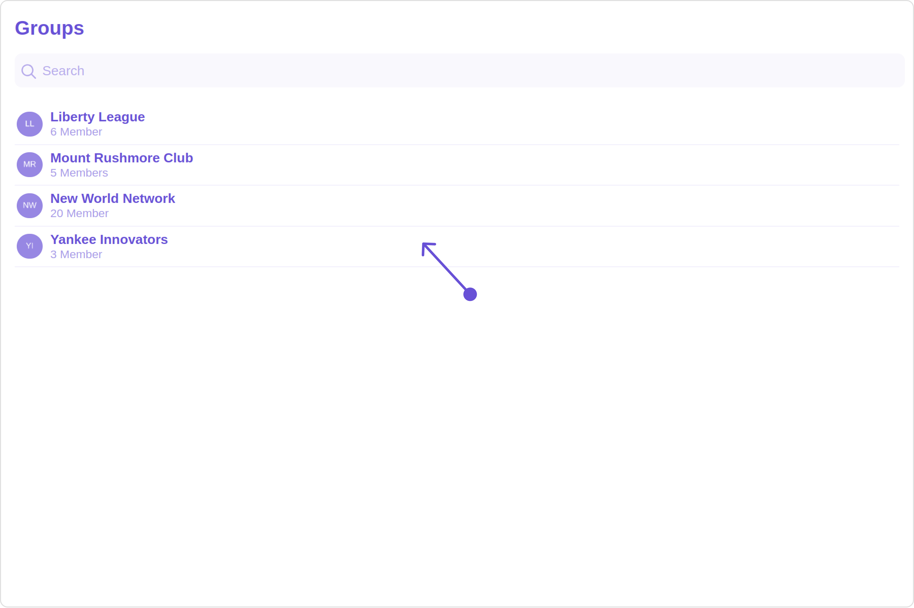

Custom:
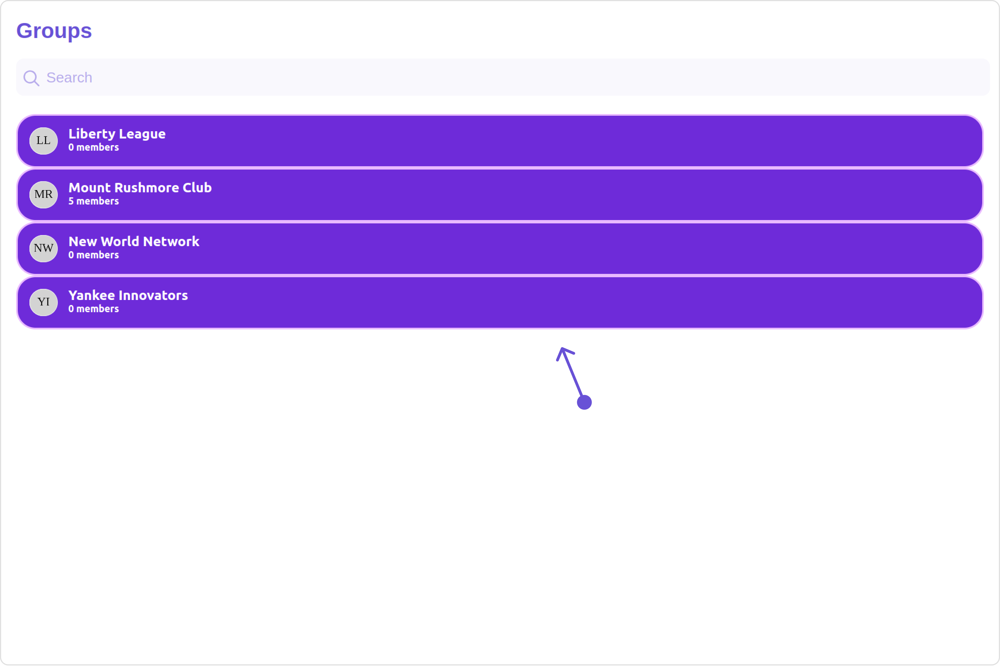

<Tabs>
<TabItem value="TypeScript" label="TypeScript">

```tsx title='GroupsDemo.tsx'
import { CometChat } from "@cometchat/chat-sdk-javascript";
import { CometChatGroups } from "@cometchat/chat-uikit-react";
import React from "react";

const GroupsDemo = () => {
  const getListItemView = (group: CometChat.Group) => {
    return (
      <div
        style={{
          display: "flex",
          alignItems: "left",
          padding: "10px",
          border: "2px solid #e9baff",
          borderRadius: "20px",
          background: "#6e2bd9",
        }}
      >
        <cometchat-avatar image={group.getIcon()} name={group.getName()} />

        <div style={{ display: "flex", paddingLeft: "10px" }}>
          <div
            style={{ fontWeight: "bold", color: "#ffffff", fontSize: "14px" }}
          >
            {group.getName()}
            <div
              style={{ color: "#ffffff", fontSize: "10px", textAlign: "left" }}
            >
              {group.getMembersCount()} members
            </div>
          </div>
        </div>
      </div>
    );
  };
  return <CometChatGroups listItemView={getListItemView} />;
};

export default GroupsDemo;
```

</TabItem>
<TabItem value="JavaScript" label="JavaScript">

```jsx title='GroupsDemo.jsx'
import { CometChatGroups } from "@cometchat/chat-uikit-react";
import React from "react";

const GroupsDemo = () => {
  const getListItemView = (group) => {
    return (
      <div
        style={{
          display: "flex",
          alignItems: "left",
          padding: "10px",
          border: "2px solid #e9baff",
          borderRadius: "20px",
          background: "#6e2bd9",
        }}
      >
        <cometchat-avatar image={group.getIcon()} name={group.getName()} />

        <div style={{ display: "flex", paddingLeft: "10px" }}>
          <div
            style={{ fontWeight: "bold", color: "#ffffff", fontSize: "14px" }}
          >
            {group.getName()}
            <div
              style={{ color: "#ffffff", fontSize: "10px", textAlign: "left" }}
            >
              {group.getMembersCount()} members
            </div>
          </div>
        </div>
      </div>
    );
  };
  return <CometChatGroups listItemView={getListItemView} />;
};

export default GroupsDemo;
```

</TabItem>
</Tabs>

---

#### SubtitleView

You can customize the subtitle view for each group item to meet your requirements

```jsx
subtitleView = { getSubtitleView };
```

Default:


Custom:
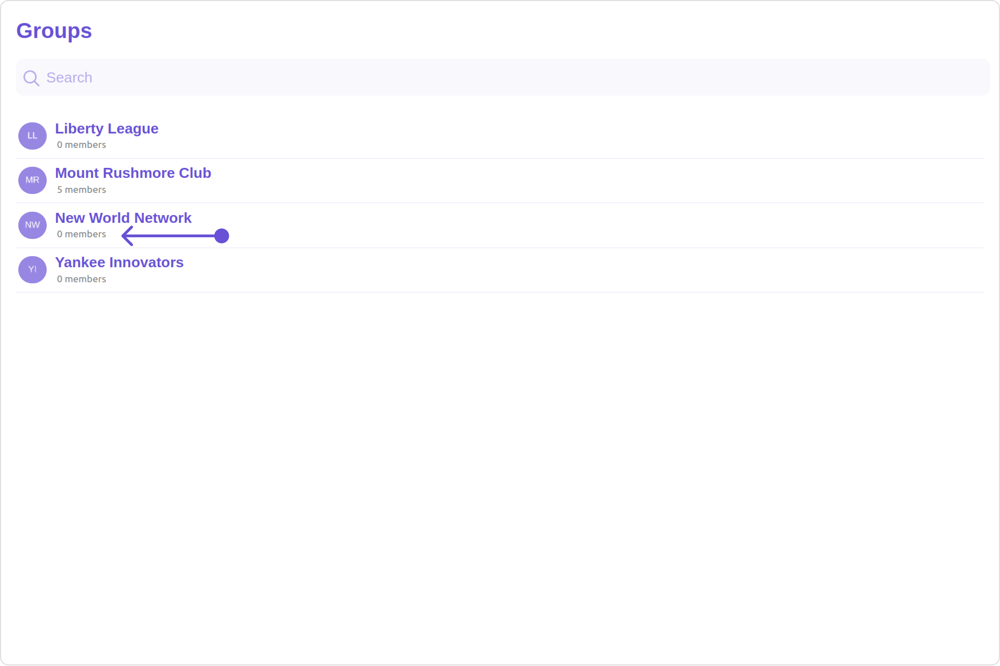

<Tabs>
<TabItem value="TypeScript" label="TypeScript">

```tsx title='GroupsDemo.tsx'
import { CometChat } from "@cometchat/chat-sdk-javascript";
import { CometChatGroups } from "@cometchat/chat-uikit-react";
import React from "react";

const GroupsDemo = () => {
  const getSubtitleView = (group: CometChat.Group): JSX.Element => {
    if (group instanceof CometChat.Group) {
      return (
        <div
          style={{
            display: "flex",
            alignItems: "left",
            padding: "2px",
            fontSize: "10px",
          }}
        >
          <div style={{ color: "gray" }}>{group.getMembersCount()} members</div>
        </div>
      );
    } else {
      return <></>;
    }
  };
  return <CometChatGroups subtitleView={getSubtitleView} />;
};

export default GroupsDemo;
```

</TabItem>
<TabItem value="JavaScript" label="JavaScript">

```jsx title='GroupsDemo.jsx'
import { CometChat } from "@cometchat/chat-sdk-javascript";
import { CometChatGroups } from "@cometchat/chat-uikit-react";
import React from "react";

const GroupsDemo = () => {
  const getSubtitleView = (group) => {
    if (group instanceof CometChat.Group) {
      return (
        <div
          style={{
            display: "flex",
            alignItems: "left",
            padding: "2px",
            fontSize: "10px",
          }}
        >
          <div style={{ color: "gray" }}>{group.getMembersCount()} members</div>
        </div>
      );
    } else {
      return <></>;
    }
  };
  return <CometChatGroups subtitleView={getSubtitleView} />;
};

export default GroupsDemo;
```

</TabItem>
</Tabs>

---

#### LoadingStateView

You can set a custom loader view using `loadingStateView` to match the loading view of your app.

```jsx
loadingStateView={getLoadingStateView()}
```

Default:
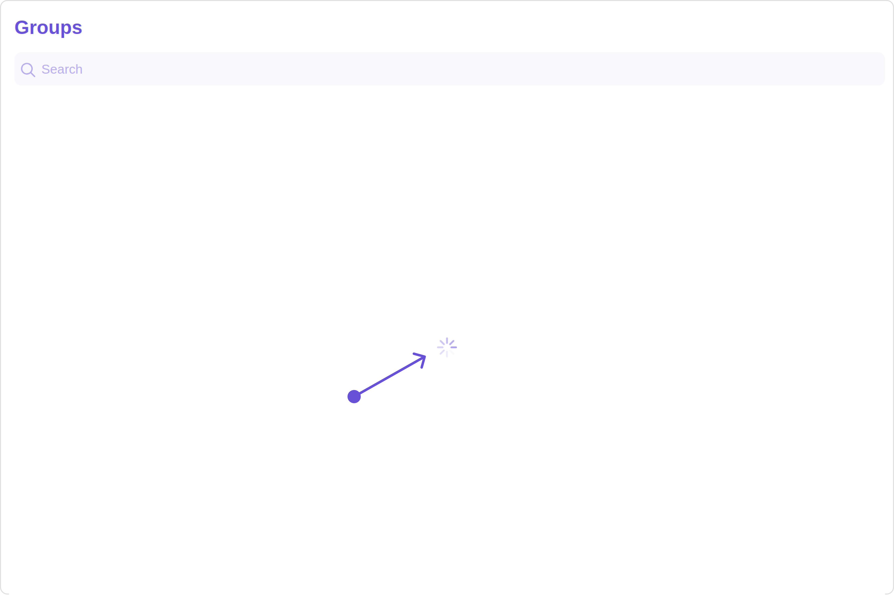

Custom:
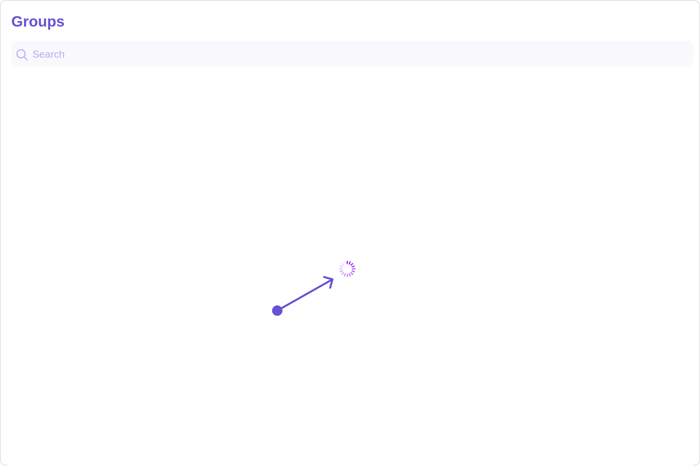

<Tabs>
<TabItem value="TypeScript" label="TypeScript">

```tsx title='GroupsDemo.tsx'
import { CometChatGroups, LoaderStyle } from "@cometchat/chat-uikit-react";
import React from "react";

const GroupsDemo = () => {
  const getLoadingStateView = () => {
    const getLoaderStyle = new LoaderStyle({
      iconTint: "#890aff",
      height: "100vh",
      width: "100vw",
    });

    return (
      <cometchat-loader
        iconURL="icon"
        loaderStyle={JSON.stringify(getLoaderStyle)}
      ></cometchat-loader>
    );
  };
  return <CometChatGroups loadingStateView={getLoadingStateView()} />;
};

export default GroupsDemo;
```

</TabItem>
<TabItem value="JavaScript" label="JavaScript">

```jsx title='GroupsDemo.jsx'
import { CometChatGroups, LoaderStyle } from "@cometchat/chat-uikit-react";
import React from "react";

const GroupsDemo = () => {
  const getLoadingStateView = () => {
    const getLoaderStyle = new LoaderStyle({
      iconTint: "#890aff",
      height: "100vh",
      width: "100vw",
    });

    return (
      <cometchat-loader
        iconURL="icon"
        loaderStyle={JSON.stringify(getLoaderStyle)}
      ></cometchat-loader>
    );
  };
  return <CometChatGroups loadingStateView={getLoadingStateView()} />;
};

export default GroupsDemo;
```

</TabItem>
</Tabs>

---

#### EmptyStateView

You can set a custom `EmptyStateView` using `emptyStateView` to match the empty view of your app.

```jsx
emptyStateView={getEmptyStateView()}
```

Default:
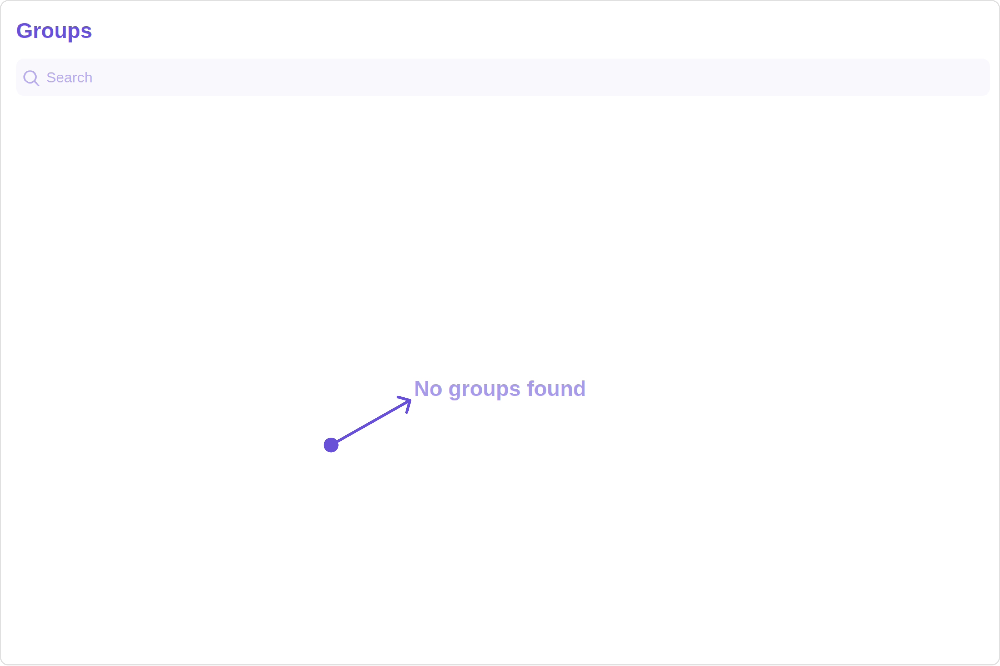

Custom:


<Tabs>
<TabItem value="TypeScript" label="TypeScript">

```tsx title='GroupsDemo.tsx'

import { CometChatGroups } from '@cometchat/chat-uikit-react'
import React from 'react'

const GroupsDemo = () => {

  cconst getEmptyStateView = () => {
        return(
          <div style={{color:'#d6cfff', fontSize:'30px', font:'bold'}}>
            Your Custom Empty State
          </div>
        );
    };
  return (
    <CometChatGroups
    emptyStateView={getEmptyStateView()}
    />
  )
}

export default GroupsDemo;

```

</TabItem>
<TabItem value="JavaScript" label="JavaScript">

```jsx title='GroupsDemo.jsx'
import { CometChatGroups } from "@cometchat/chat-uikit-react";
import React from "react";

const GroupsDemo = () => {
  const getEmptyStateView = () => {
    return (
      <div style={{ color: "#d6cfff", fontSize: "30px", font: "bold" }}>
        Your Custom Empty State
      </div>
    );
  };
  return <CometChatGroups emptyStateView={getEmptyStateView()} />;
};

export default GroupsDemo;
```

</TabItem>
</Tabs>

---

#### ErrorStateView

You can set a custom `ErrorStateView` using `errorStateView` to match the error view of your app.

```jsx
errorStateView={getErrorStateView()}
```

Default:
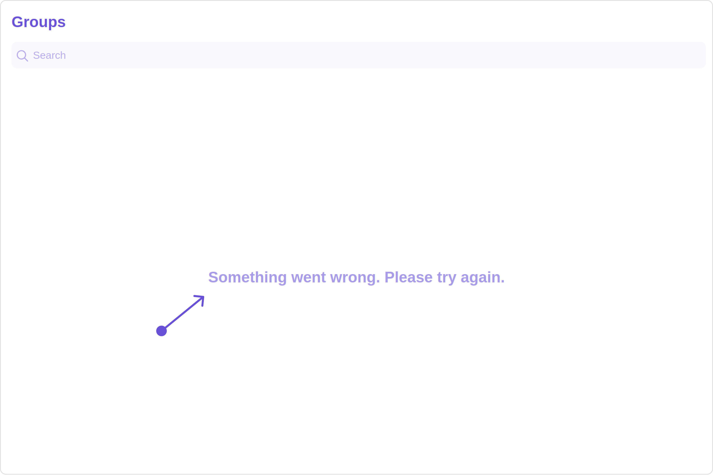

Custom:
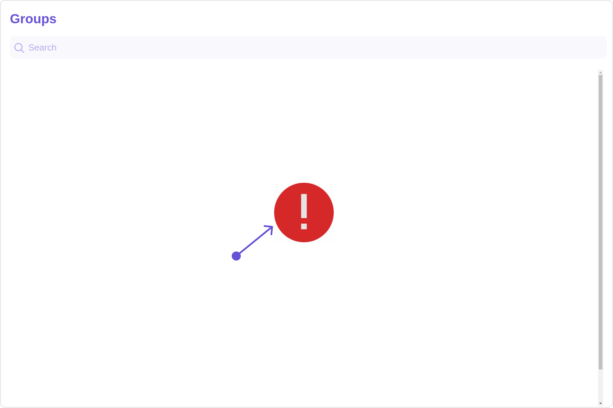

<Tabs>
<TabItem value="TypeScript" label="TypeScript">

```tsx title='GroupsDemo.tsx'
import { CometChatGroups } from "@cometchat/chat-uikit-react";
import React from "react";

const GroupsDemo = () => {
  const getErrorStateView = () => {
    return (
      <div style={{ height: "100vh", width: "100vw" }}>
        </img>
      </div>
    );
  };
  return <CometChatGroups errorStateView={getErrorStateView()} />;
};

export default GroupsDemo;
```

</TabItem>
<TabItem value="JavaScript" label="JavaScript">

```jsx title='GroupsDemo.jsx'
import { CometChatGroups } from "@cometchat/chat-uikit-react";
import React from "react";

const GroupsDemo = () => {
  const getErrorStateView = () => {
    return (
      <div style={{ height: "100vh", width: "100vw" }}>
        </img>
      </div>
    );
  };
  return <CometChatGroups errorStateView={getErrorStateView()} />;
};

export default GroupsDemo;
```

</TabItem>
</Tabs>

---

#### Menus

You can set the Custom Menu view to add more options to the Groups component.

```jsx
menus={getMenus()}
```

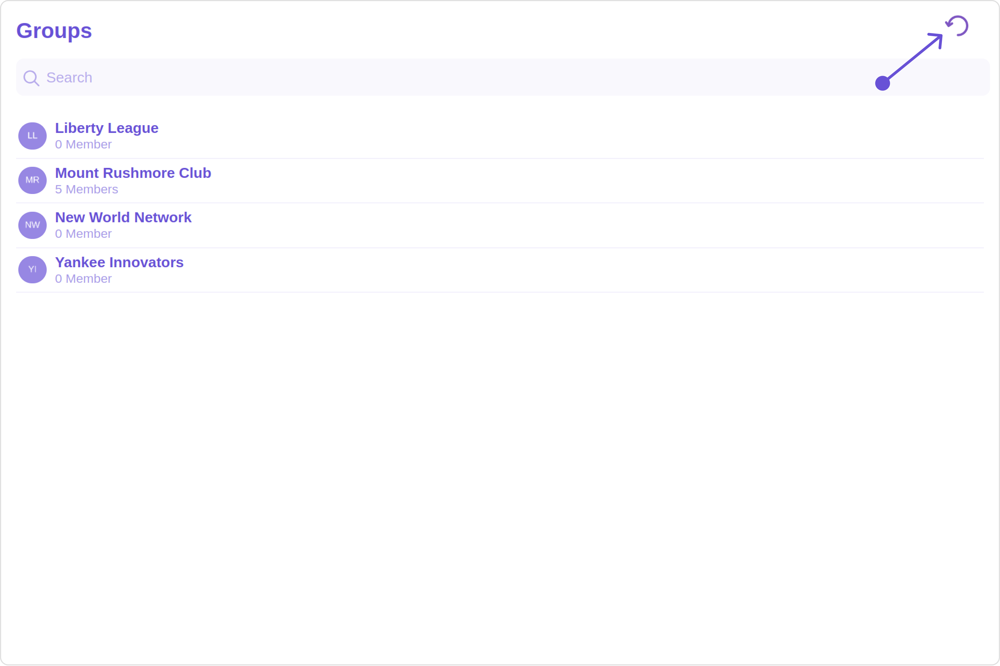

<Tabs>
<TabItem value="TypeScript" label="TypeScript">

```tsx title='GroupsDemo.tsx'
import { CometChatGroups } from "@cometchat/chat-uikit-react";
import React from "react";

const GroupsDemo = () => {
  const getMenus = () => {
    const handleReload = () => {
      window.location.reload();
    };
    const getButtonStyle = () => {
      return {
        height: "20px",
        width: "20px",
        border: "none",
        borderRadius: "0",
        background: "transparent",
        buttonIconTint: "#7E57C2",
      };
    };
    return (
      <div style={{ marginRight: "20px" }}>
        <cometchat-button
          iconURL="icon"
          buttonStyle={JSON.stringify(getButtonStyle())}
          onClick={handleReload}
        >
          {" "}
        </cometchat-button>
      </div>
    );
  };
  return <CometChatGroups menus={getMenus()} />;
};

export default GroupsDemo;
```

</TabItem>
<TabItem value="JavaScript" label="JavaScript">

```jsx title='GroupsDemo.jsx'
import { CometChatGroups } from "@cometchat/chat-uikit-react";
import React from "react";

const GroupsDemo = () => {
  const getMenus = () => {
    const handleReload = () => {
      window.location.reload();
    };
    const getButtonStyle = () => {
      return {
        height: "20px",
        width: "20px",
        border: "none",
        borderRadius: "0",
        background: "transparent",
        buttonIconTint: "#7E57C2",
      };
    };
    return (
      <div style={{ marginRight: "20px" }}>
        <cometchat-button
          iconURL="icon"
          buttonStyle={JSON.stringify(getButtonStyle())}
          onClick={handleReload}
        >
          {" "}
        </cometchat-button>
      </div>
    );
  };
  return <CometChatGroups menus={getMenus()} />;
};

export default GroupsDemo;
```

</TabItem>
</Tabs>

---

#### Options

You can set the Custom options to the Groups component.

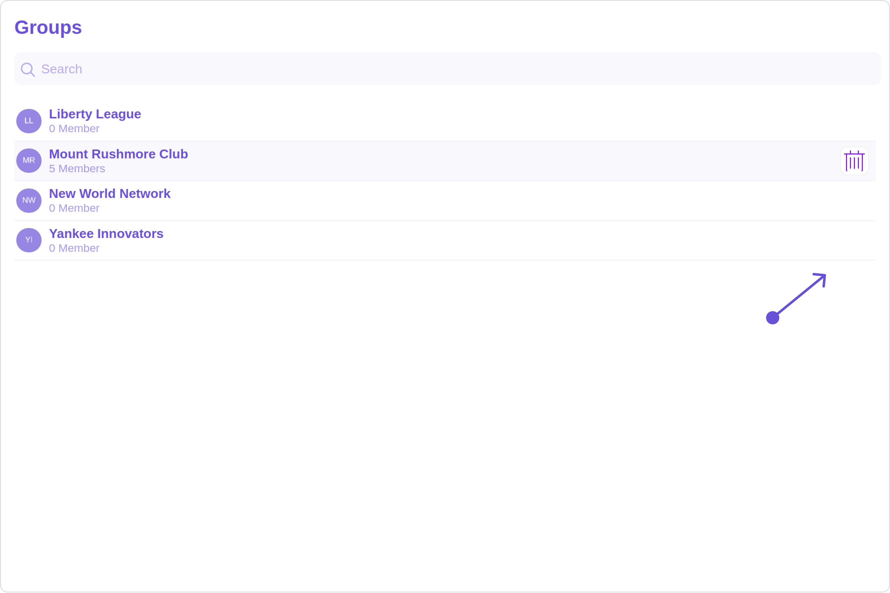

<Tabs>
<TabItem value="TypeScript" label="TypeScript">

```tsx title='GroupsDemo.tsx'
import { CometChatGroups, CometChatOption } from "@cometchat/chat-uikit-react";
import React from "react";

const GroupsDemo = () => {
  return (
    <CometChatGroups
      options={(group: any) => {
        const customOptions = [
          new CometChatOption({
            id: "1",
            title: "Title",
            iconURL: "icon",
            backgroundColor: "transparent",
            onClick: () => {
              console.log("Custom option clicked for group:", group);
            },
            iconTint: "#890aff",
            titleColor: "blue",
          }),
        ];
        return customOptions;
      }}
    />
  );
};

export default GroupsDemo;
```

</TabItem>
<TabItem value="JavaScript" label="JavaScript">

```jsx title='GroupsDemo.jsx'
import { CometChatGroups, CometChatOption } from "@cometchat/chat-uikit-react";
import React from "react";

const GroupsDemo = () => {
  return (
    <CometChatGroups
      options={(group) => {
        const customOptions = [
          new CometChatOption({
            id: "1",
            title: "Title",
            iconURL: "icon",
            backgroundColor: "transparent",
            onClick: () => {
              console.log("Custom option clicked for group:", group);
            },
            iconTint: "#890aff",
            titleColor: "blue",
          }),
        ];
        return customOptions;
      }}
    />
  );
};

export default GroupsDemo;
```

</TabItem>
</Tabs>

import { Tooltip } from 'react-tooltip'
import 'react-tooltip/dist/react-tooltip.css'

<Tooltip
  id="my-tooltip-html-prop"
  html="Not available in GroupsConfiguration"
/>
