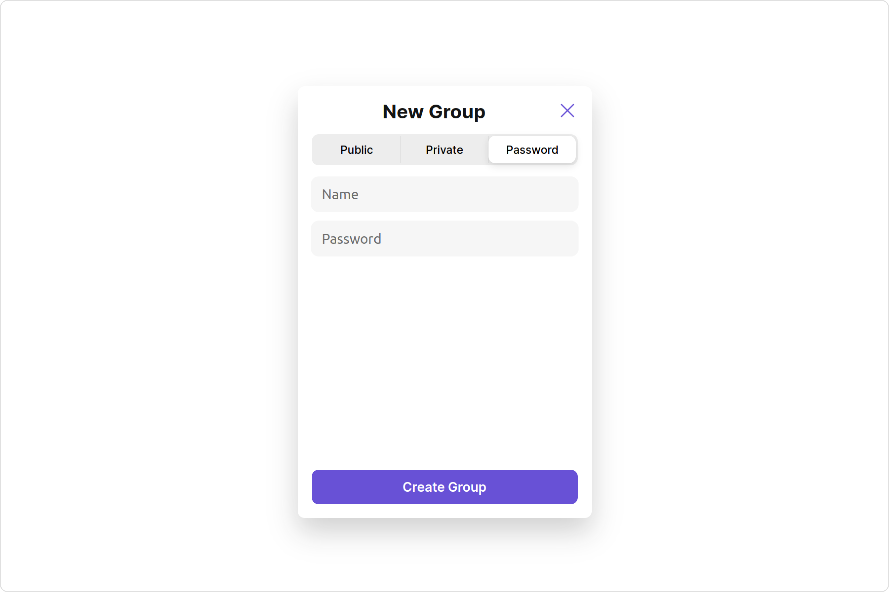
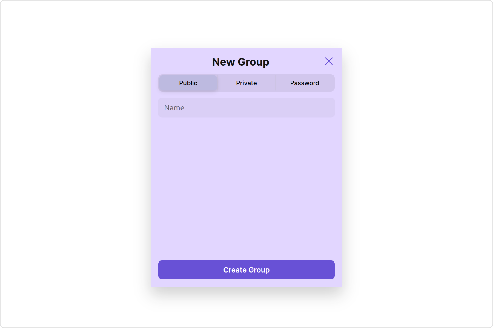
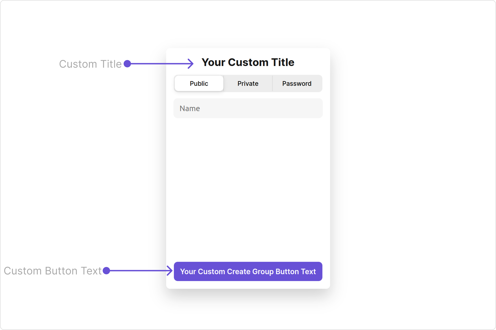

import Tabs from '@theme/Tabs';
import TabItem from '@theme/TabItem';

## Overview

`CometChatCreateGroup` is a [Component](./components-overview#components) enabling users to create various types of groups, including public, private, and password-protected ones. This functionality enables users to curate their group settings according to their preferences and needs.



The Create Groups component is composed of the following BaseComponents:

| Components                 | Description                                                                                         |
| -------------------------- | --------------------------------------------------------------------------------------------------- |
| cometchat-button           | This component represents a button with optional icon and text.                                     |
| [cometchat-label](./label) | This component provides descriptive information about the associated UI element.                    |
| [cometchat-input](./input) | This component allows users to enter or provide data or information within a web form or interface. |

---

## Usage

### Integration

The following code snippet illustrates how you can directly incorporate the Create Groups component into your Application.

<Tabs>
<TabItem value="CreateGroupDemo" label="CreateGroupDemo.tsx">

```tsx
import { CometChatCreateGroup } from "@cometchat/chat-uikit-react";
import React from "react";
import { createComponent } from "@lit-labs/react";

const CreateGroupDemo = () => {
  const CreateGroup = createComponent({
    tagName: "cometchat-create-group",
    elementClass: CometChatCreateGroup,
    react: React,
  });

  return <CreateGroup />;
};

export default CreateGroupDemo;
```

</TabItem>
<TabItem value="ts" label="App.tsx">

```tsx
import { CreateGroupDemo } from "./CreateGroupDemo";

export default function App() {
  return (
    <div className="App">
      <CreateGroupDemo />
    </div>
  );
}
```

</TabItem>
</Tabs>

---

### Actions

[Actions](./components-overview#actions) dictate how a component functions. They are divided into two types: Predefined and User-defined. You can override either type, allowing you to tailor the behavior of the component to fit your specific needs.

##### 1. createClick

The `createClick` action is activated when you click the create Group button. This returns the created groups.
You can override this action using the following code snippet.

<Tabs>
<TabItem value="TypeScript" label="TypeScript">

```tsx title='CreateGroupDemo.tsx'
import { CometChatCreateGroup } from "@cometchat/chat-uikit-react";
import React from "react";
import { createComponent } from "@lit-labs/react";

const CreateGroupDemo = () => {
  const CreateGroup = createComponent({
    tagName: "cometchat-create-group",
    elementClass: CometChatCreateGroup,
    react: React,
  });

  function handleClick(group: CometChat.Group): void {
    console.log("custom on create click actions");
  }

  return <CreateGroup createClick={handleClick} />;
};

export default CreateGroupDemo;
```

</TabItem>
<TabItem value="JavaScript" label="JavaScript">

```jsx title='CreateGroupDemo.jsx'
import { CometChatCreateGroup } from "@cometchat/chat-uikit-react";
import React from "react";
import { createComponent } from "@lit-labs/react";

const CreateGroupDemo = () => {
  const CreateGroup = createComponent({
    tagName: "cometchat-create-group",
    elementClass: CometChatCreateGroup,
    react: React,
  });

  function handleClick(group) {
    console.log("custom on create click actions");
  }

  return <CreateGroup createClick={handleClick} />;
};

export default CreateGroupDemo;
```

</TabItem>
</Tabs>

##### 2. closeCallback

The `closeCallback` action is activated when you click the close button. You can override this action using the following code snippet.

<Tabs>
<TabItem value="TypeScript" label="TypeScript">

```tsx title='CreateGroupDemo.tsx'
import { CometChatCreateGroup } from "@cometchat/chat-uikit-react";
import React from "react";
import { createComponent } from "@lit-labs/react";

const CreateGroupDemo = () => {
  const CreateGroup = createComponent({
    tagName: "cometchat-create-group",
    elementClass: CometChatCreateGroup,
    react: React,
  });

  const handleCloseCallBack = () => {
    console.log("CLOSE");
  };

  return <CreateGroup closeCallback={handleCloseCallBack} />;
};

export default CreateGroupDemo;
```

</TabItem>
<TabItem value="JavaScript" label="JavaScript">

```jsx title='CreateGroupDemo.jsx'
import { CometChatCreateGroup } from "@cometchat/chat-uikit-react";
import React from "react";
import { createComponent } from "@lit-labs/react";

const CreateGroupDemo = () => {
  const CreateGroup = createComponent({
    tagName: "cometchat-create-group",
    elementClass: CometChatCreateGroup,
    react: React,
  });

  const handleCloseCallBack = () => {
    console.log("CLOSE");
  };

  return <CreateGroup closeCallback={handleCloseCallBack} />;
};

export default CreateGroupDemo;
```

</TabItem>
</Tabs>

##### 3. errorCallback

This action doesn't change the behavior of the component but rather listens for any errors that occur in the Groups component.

<Tabs>
<TabItem value="TypeScript" label="TypeScript">

```tsx title='CreateGroupDemo.tsx'
import { CometChatCreateGroup } from "@cometchat/chat-uikit-react";
import React from "react";
import { createComponent } from "@lit-labs/react";

const CreateGroupDemo = () => {
  const CreateGroup = createComponent({
    tagName: "cometchat-create-group",
    elementClass: CometChatCreateGroup,
    react: React,
  });

  const handleOnError = () => {
    console.log("error");
  };

  return <CreateGroup errorCallback={handleOnError} />;
};

export default CreateGroupDemo;
```

</TabItem>
<TabItem value="JavaScript" label="JavaScript">

```jsx title='CreateGroupDemo.jsx'
import { CometChatCreateGroup } from "@cometchat/chat-uikit-react";
import React from "react";
import { createComponent } from "@lit-labs/react";

const CreateGroupDemo = () => {
  const CreateGroup = createComponent({
    tagName: "cometchat-create-group",
    elementClass: CometChatCreateGroup,
    react: React,
  });

  const handleOnError = () => {
    console.log("error");
  };

  return <CreateGroup errorCallback={handleOnError} />;
};

export default CreateGroupDemo;
```

</TabItem>
</Tabs>

---

### Filters

**Filters** allow you to customize the data displayed in a list within a `Component`. You can filter the list based on your specific criteria, allowing for a more customized. Filters can be applied using `RequestBuilders` of Chat SDK.

The `CreateGroup` component does not have any exposed filters.

### Events

[Events](./components-overview#events) are emitted by a `Component`. By using event you can extend existing functionality. Being global events, they can be applied in Multiple Locations and are capable of being Added or Removed.

Events emitted by the Create Group component is as follows.

| Event              | Description                                         |
| ------------------ | --------------------------------------------------- |
| **ccGroupCreated** | Triggers when the user creates a group successfully |

<Tabs>

<TabItem value="js" label="Add Listener">

```javascript
const ccGroupCreated = CometChatGroupEvents.ccGroupCreated.subscribe(
  (group: CometChat.Group) => {
    //Your Code
  }
);
```

</TabItem>

</Tabs>

---

<Tabs>

<TabItem value="js" label="Remove Listener">

```javascript
ccGroupCreated?.unsubscribe();
```

</TabItem>

</Tabs>

---

## Customization

To fit your app's design requirements, you can customize the appearance of the Create Groups component. We provide exposed methods that allow you to modify the experience and behavior according to your specific needs.

### Style

Using **Style** you can **customize** the look and feel of the component in your app, These parameters typically control elements such as the **color**, **size**, **shape**, and **fonts** used within the component.

##### 1. CreateGroup Style

You can set the `CreateGroupStyle` to the `Create Group` Component to customize the styling.



<Tabs>
<TabItem value="TypeScript" label="TypeScript">

```tsx title='CreateGroupDemo.tsx'
import {
  CometChatCreateGroup,
  CreateGroupStyle,
} from "@cometchat/chat-uikit-react";
import React from "react";
import { createComponent } from "@lit-labs/react";

const CreateGroupDemo = () => {
  const CreateGroup = createComponent({
    tagName: "cometchat-create-group",
    elementClass: CometChatCreateGroup,
    react: React,
  });

  const createGroupStyle = new CreateGroupStyle({
    background: "#e2d6ff",
    activeGroupTypeBackground: "#bdbae0",
    activeGroupTypeTextColor: "#000000",
    height: "500px",
    width: "500px",
  });

  return <CreateGroup createGroupStyle={createGroupStyle} />;
};

export default CreateGroupDemo;
```

</TabItem>
<TabItem value="JavaScript" label="JavaScript">

```jsx title='CreateGroupDemo.jsx'
import {
  CometChatCreateGroup,
  CreateGroupStyle,
} from "@cometchat/chat-uikit-react";
import React from "react";
import { createComponent } from "@lit-labs/react";

const CreateGroupDemo = () => {
  const CreateGroup = createComponent({
    tagName: "cometchat-create-group",
    elementClass: CometChatCreateGroup,
    react: React,
  });

  const createGroupStyle = new CreateGroupStyle({
    background: "#e2d6ff",
    activeGroupTypeBackground: "#bdbae0",
    activeGroupTypeTextColor: "#000000",
    height: "500px",
    width: "500px",
  });

  return <CreateGroup createGroupStyle={createGroupStyle} />;
};

export default CreateGroupDemo;
```

</TabItem>
</Tabs>

List of properties exposed by CreateGroupStyle

| Property                              | Description                                                          | Code                                          |
| ------------------------------------- | -------------------------------------------------------------------- | --------------------------------------------- |
| **border**                            | Used to set border                                                   | `border?: string,`                            |
| **borderRadius**                      | Used to set border radius                                            | `borderRadius?: string;`                      |
| **background**                        | Used to set background colour                                        | `background?: string;`                        |
| **height**                            | Used to set height                                                   | `height?: string;`                            |
| **width**                             | Used to set width                                                    | `width?: string;`                             |
| **boxShadow**                         | Sets shadow effects around the element                               | `boxShadow?: string;`                         |
| **groupTypeTextFont**                 | Sets the font style of the text indicating group types               | `groupTypeTextFont?: string;`                 |
| **groupTypeBorder**                   | Sets the border style for group type indicators                      | `groupTypeBorder?: string;`                   |
| **groupTypeBorderRadius**             | Sets the border radius for group type indicators                     | `groupTypeBorderRadius?: string;`             |
| **groupTypeTextColor**                | Sets the color of the text indicating group types                    | `groupTypeTextColor?: string;`                |
| **groupTypeTextBackground**           | Sets the background color for text indicating group types            | `groupTypeTextBackground?: string;`           |
| **groupTypeBackground**               | Sets the background color for group type indicators                  | `groupTypeBackground?: string;`               |
| **groupTypeBoxShadow**                | Sets shadow effects around the group type indicators                 | `groupTypeBoxShadow?: string;`                |
| **activeGroupTypeTextFont**           | Sets the font style of the text indicating active group types        | `activeGroupTypeTextFont?: string;`           |
| **activeGroupTypeTextColor**          | Sets the color of the text indicating active group types             | `activeGroupTypeTextColor?: string;`          |
| **activeGroupTypeBackground**         | Sets the background color for active group type indicators           | `activeGroupTypeBackground?: string;`         |
| **activeGroupTypeBoxShadow**          | Sets shadow effects around the active group type indicators          | `activeGroupTypeBoxShadow?: string;`          |
| **activeGroupTypeBorderRadius**       | Sets the border radius for active group type indicators              | `activeGroupTypeBorderRadius?: string;`       |
| **activeGroupTypeBorder**             | Sets the border style for active group type indicators               | `activeGroupTypeBorder?: string;`             |
| **groupTypeTextBoxShadow**            | Sets shadow effects around the group type indicators container       | `groupTypeTextBoxShadow?: string;`            |
| **groupTypeTextBorderRadius**         | Sets the border radius for the container of group type indicators    | `groupTypeTextBorderRadius?: string;`         |
| **closeIconTint**                     | Sets the color of the close icon                                     | `closeIconTint?: string;`                     |
| **titleTextFont**                     | Sets the font style for the title text in the app bar                | `titleTextFont?: string;`                     |
| **titleTextColor**                    | Sets the color for the title text in the app bar                     | `titleTextColor?: string;`                    |
| **errorTextFont**                     | Sets the font style for error messages                               | `errorTextFont?: string;`                     |
| **errorTextBackground**               | Sets the background color for error messages                         | `errorTextBackground?: string;`               |
| **errorTextBorderRadius**             | Sets the border radius for error messages                            | `errorTextBorderRadius?: string;`             |
| **errorTextBorder**                   | Sets the border style for error messages                             | `errorTextBorder?: string;`                   |
| **errorTextColor**                    | Sets the color for error messages                                    | `errorTextColor?: string;`                    |
| **nameInputPlaceholderTextFont**      | Sets the font style for placeholder text in the name input field     | `nameInputPlaceholderTextFont?: string;`      |
| **nameInputPlaceholderTextColor**     | Sets the color for placeholder text in the name input field          | `nameInputPlaceholderTextColor?: string;`     |
| **nameInputBackground**               | Sets the background color for the name input field                   | `nameInputBackground?: string;`               |
| **nameInputTextFont**                 | Sets the font style for text in the name input field                 | `nameInputTextFont?: string;`                 |
| **nameInputTextColor**                | Sets the color for text in the name input field                      | `nameInputTextColor?: string;`                |
| **nameInputBorder**                   | Sets the border style for the name input field                       | `nameInputBorder?: string;`                   |
| **nameInputBorderRadius**             | Sets the border radius for the name input field                      | `nameInputBorderRadius?: string;`             |
| **nameInputBoxShadow**                | Sets shadow effects around the name input field                      | `nameInputBoxShadow?: string;`                |
| **passwordInputPlaceholderTextFont**  | Sets the font style for placeholder text in the password input field | `passwordInputPlaceholderTextFont?: string;`  |
| **passwordInputPlaceholderTextColor** | Sets the color for placeholder text in the password input field      | `passwordInputPlaceholderTextColor?: string;` |
| **passwordInputBackground**           | Sets the background color for the password input field               | `passwordInputBackground?: string;`           |
| **passwordInputBorder**               | Sets the border style for the password input field                   | `passwordInputBorder?: string;`               |
| **passwordInputBorderRadius**         | Sets the border radius for the password input field                  | `passwordInputBorderRadius?: string;`         |
| **passwordInputBoxShadow**            | Sets shadow effects around the password input field                  | `passwordInputBoxShadow?: string;`            |
| **passwordInputTextFont**             | Sets the font style for text in the password input field             | `passwordInputTextFont?: string;`             |
| **passwordInputTextColor**            | Sets the color for text in the password input field                  | `passwordInputTextColor?: string;`            |
| **createGroupButtonTextFont**         | Sets the font style for text on the create group button              | `createGroupButtonTextFont?: string;`         |
| **createGroupButtonTextColor**        | Sets the color for text on the create group button                   | `createGroupButtonTextColor?: string;`        |
| **createGroupButtonBackground**       | Sets the background color for the create group button                | `createGroupButtonBackground?: string;`       |
| **createGroupButtonBorderRadius**     | Sets the border radius for the create group button                   | `createGroupButtonBorderRadius?: string;`     |
| **createGroupButtonBorder**           | Sets the border style for the create group button                    | `createGroupButtonBorder?: string;`           |

---

### Functionality

These are a set of small functional customizations that allow you to fine-tune the overall experience of the component. With these, you can change text, set custom icons, and toggle the visibility of UI elements.

<Tabs>
<TabItem value="TypeScript" label="TypeScript">

```tsx title='CreateGroupDemo.tsx'
import { CometChatCreateGroup } from "@cometchat/chat-uikit-react";
import React from "react";
import { createComponent } from "@lit-labs/react";

const CreateGroupDemo = () => {
  const CreateGroup = createComponent({
    tagName: "cometchat-create-group",
    elementClass: CometChatCreateGroup,
    react: React,
  });

  return (
    <CreateGroup
      title="Your Custom Title"
      createGroupButtonText="Your Custom Create Group Button Text"
      hideCloseButton={true}
    />
  );
};

export default CreateGroupDemo;
```

</TabItem>
<TabItem value="JavaScript" label="JavaScript">

```jsx title='CreateGroupDemo.jsx'
import { CometChatCreateGroup } from "@cometchat/chat-uikit-react";
import React from "react";
import { createComponent } from "@lit-labs/react";

const CreateGroupDemo = () => {
  const CreateGroup = createComponent({
    tagName: "cometchat-create-group",
    elementClass: CometChatCreateGroup,
    react: React,
  });

  return (
    <CreateGroup
      title="Your Custom Title"
      createGroupButtonText="Your Custom Create Group Button Text"
      hideCloseButton={true}
    />
  );
};

export default CreateGroupDemo;
```

</TabItem>
</Tabs>

Default:


Custom:


| Property                         | Description                                      | Code                                                                         |
| -------------------------------- | ------------------------------------------------ | ---------------------------------------------------------------------------- |
| **title**                        | Custom title for the component                   | `title='Your Custom Title'`                                                  |
| **createGroupButtonText**        | Custom text for the create group button          | `createGroupButtonText='Your Custom Create Group Button Text'`               |
| **nameInputPlaceholderText**     | Custom placeholder text for name input field     | `nameInputPlaceholderText='Your Custom Name InputPlaceholder Text'`          |
| **passwordInputPlaceholderText** | Custom placeholder text for password input field | `passwordInputPlaceholderText='Your Custom Password Input Placeholder Text'` |
| **errorStateText**               | Custom error state text                          | `errorStateText='Your Custom Error State Text'`                              |
| **closeButtonIconURL**           | URL for a custom close button icon               | `closeButtonIconURL='Custom Close Icon'`                                     |
| **hideCloseButton**              | Whether to hide the close button                 | `hideCloseButton={true}`                                                     |

---

### Advance

For advanced-level customization, you can set custom views to the component. This lets you tailor each aspect of the component to fit your exact needs and application aesthetics. You can create and define your views, layouts, and UI elements and then incorporate those into the component.

the `Create Group` component does not offer any advanced functionalities beyond this level of customization.

---

import { Tooltip } from 'react-tooltip'
import 'react-tooltip/dist/react-tooltip.css'

<Tooltip
  id="my-tooltip-html-prop"
  html="Not available in CreateGroupConfiguration"
/>
