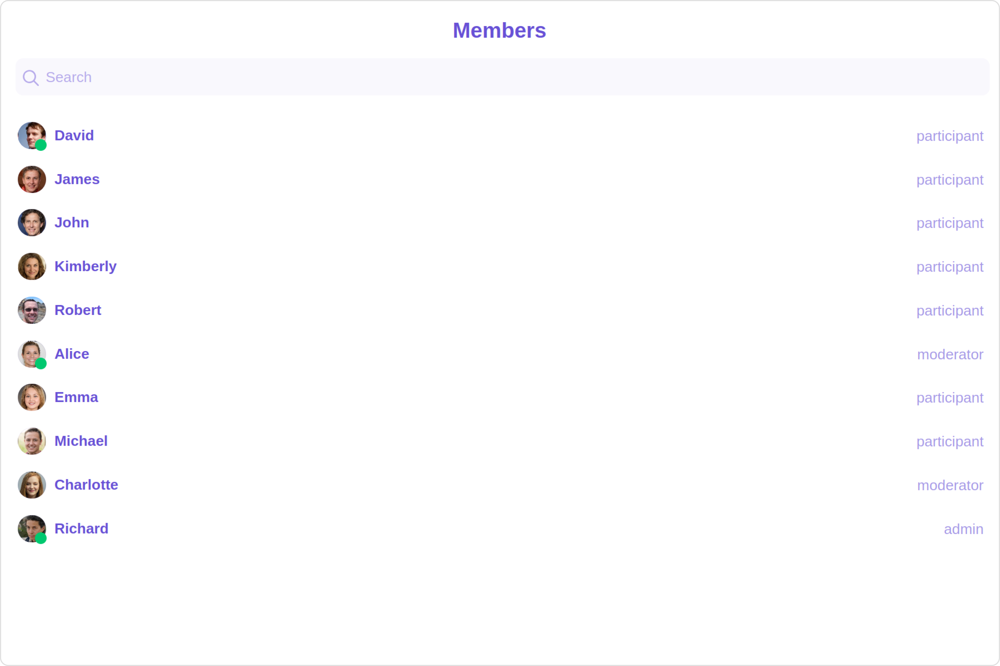
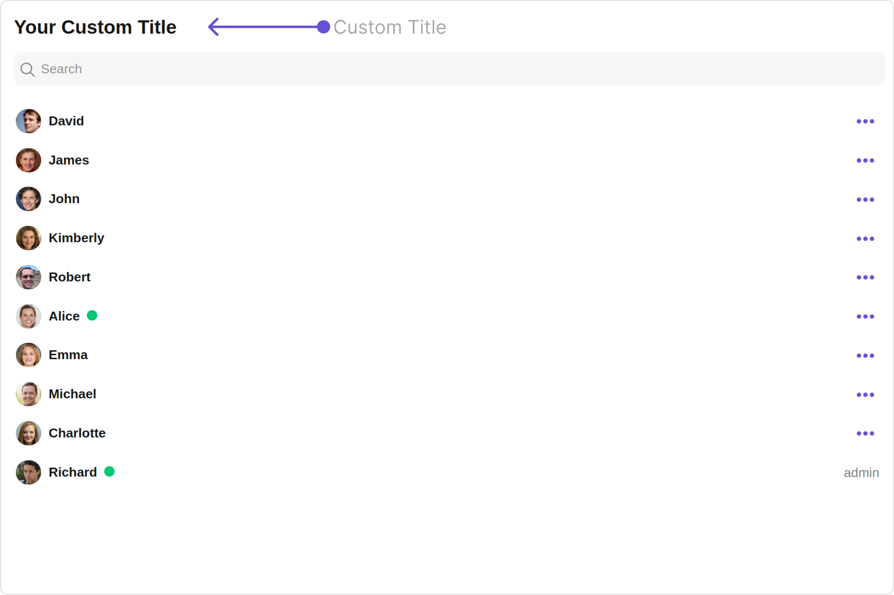
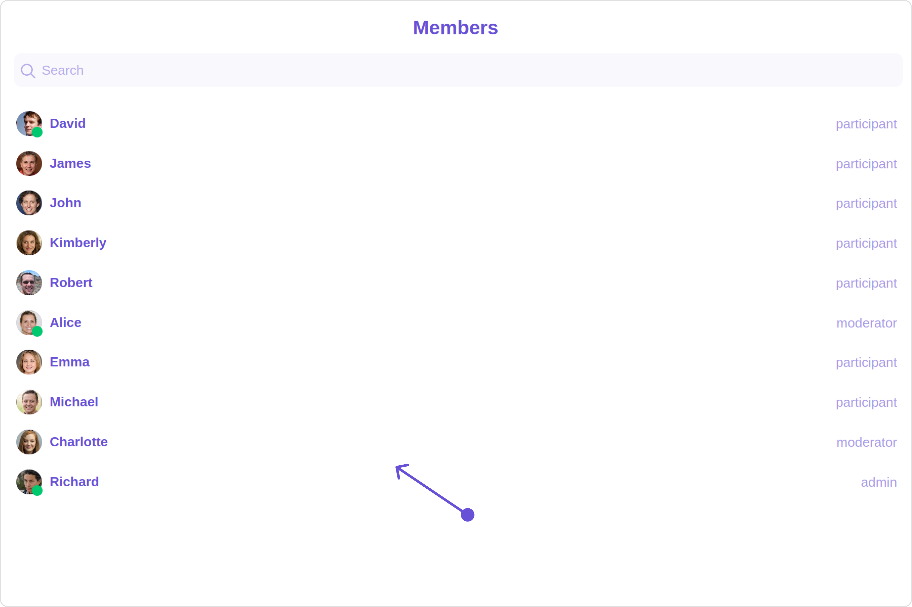
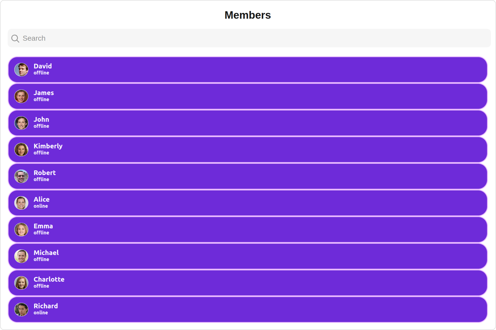
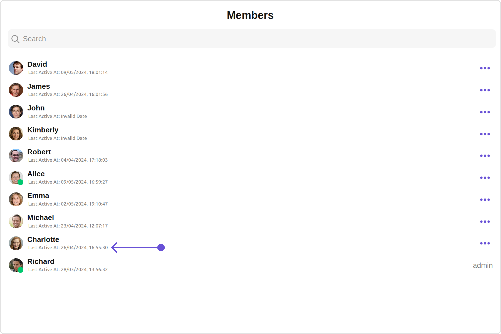
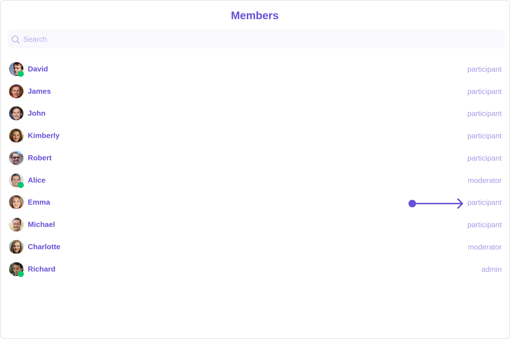
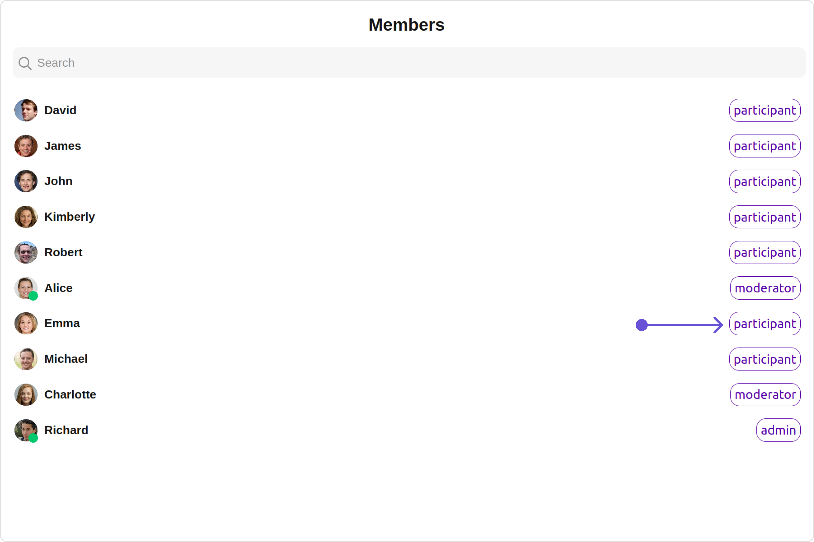
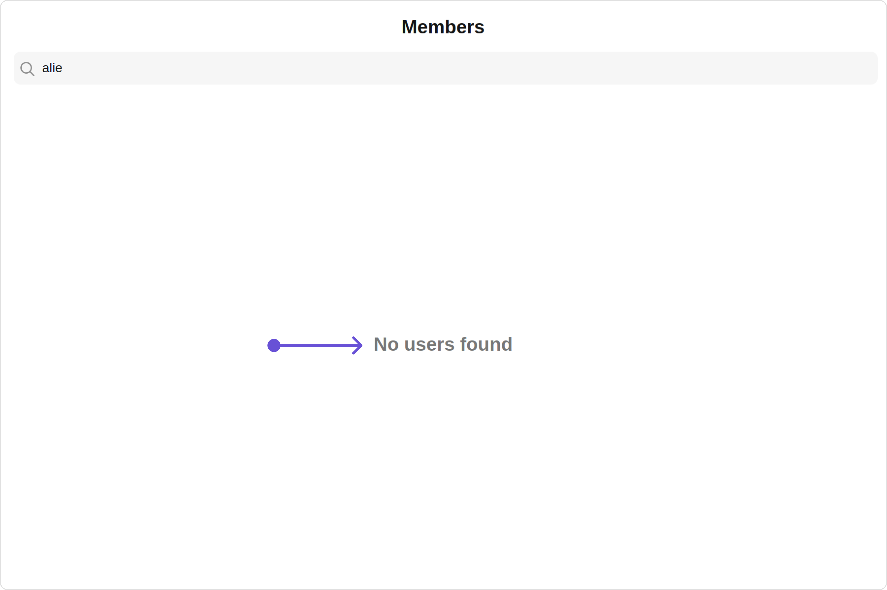
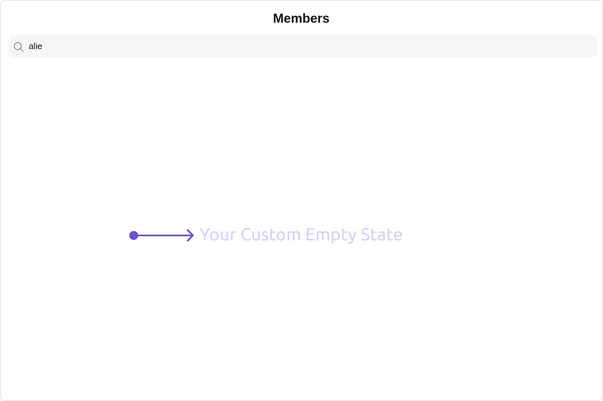
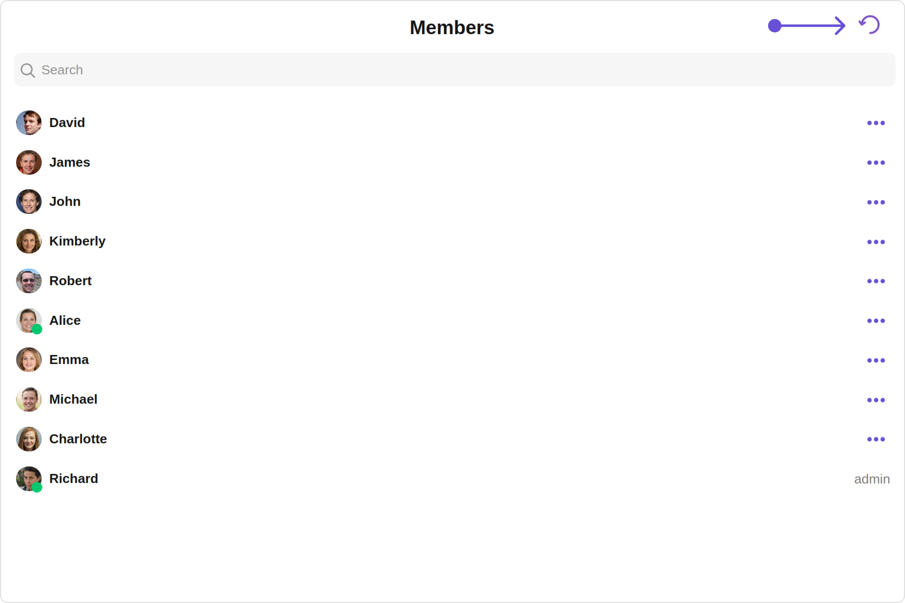

import Tabs from '@theme/Tabs';
import TabItem from '@theme/TabItem';

## Overview

`CometChatGroupMembers` is a [Component](./components-overview#components) that displays all users added or invited to a group, granting them access to group discussions, shared content, and collaborative features. Group members can communicate in real-time via messaging, voice and video calls, and other activities. They can interact, share files, and join calls based on group permissions set by the administrator or owner.



---

## Usage

### Integration

The following code snippet illustrates how you can directly incorporate the Group Members component into your Application.

<Tabs>
<TabItem value="GroupMembersDemo" label="GroupMembersDemo.tsx">

```javascript

import { CometChat } from '@cometchat/chat-sdk-javascript';
import { CometChatGroupMembers } from '@cometchat/chat-uikit-react'
import React from 'react'

const GroupMembersDemo = () => {

    const [chatGroup, setChatGroup] = React.useState<CometChat.Group>();

    React.useEffect(() => {
        CometChat.getGroup("uid").then((group) => {
            setChatGroup(group);
        })
    }, []);
    return (
        <>
            {
                chatGroup &&
                <CometChatGroupMembers
                    group={chatGroup}
                />
            }
        </>
    )
}

export default GroupMembersDemo;

```

</TabItem>
<TabItem value="ts" label="App.tsx">

```javascript
import { GroupMembersDemo } from "./GroupMembersDemo";

export default function App() {
  return (
    <div className="App">
      <GroupMembersDemo />
    </div>
  );
}
```

</TabItem>
</Tabs>

---

### Actions

[Actions](./components-overview#actions) dictate how a component functions. They are divided into two types: Predefined and User-defined. You can override either type, allowing you to tailor the behavior of the component to fit your specific needs.

##### 1. onSelect

The `onSelect` action is activated when you select the done icon while in selection mode. This returns a list of all the group members that you have selected.

This action does not come with any predefined behavior. However, you have the flexibility to override this event and tailor it to suit your needs using the following code snippet.

<Tabs>
<TabItem value="TypeScript" label="TypeScript">

```tsx title='GroupMembersDemo.tsx'
import { CometChat } from "@cometchat/chat-sdk-javascript";
import {
  CometChatGroupMembers,
  SelectionMode,
} from "@cometchat/chat-uikit-react";
import React from "react";

const GroupMembersDemo = () => {
  const [chatGroup, setChatGroup] = React.useState<CometChat.Group>();

  React.useEffect(() => {
    CometChat.getGroup("uid").then((group) => {
      setChatGroup(group);
    });
  }, []);
  function handleOnSelect(
    groupMembers: CometChat.GroupMember,
    selected: boolean
  ): void {
    console.log(groupMembers);
    //your custom onSelect actions
  }
  return (
    <>
      {chatGroup && (
        <CometChatGroupMembers
          group={chatGroup}
          selectionMode={SelectionMode.multiple}
          onSelect={handleOnSelect}
        />
      )}
    </>
  );
};

export default GroupMembersDemo;
```

</TabItem>
<TabItem value="JavaScript" label="JavaScript">

```jsx title='GroupMembersDemo.jsx'
import { CometChat } from "@cometchat/chat-sdk-javascript";
import {
  CometChatGroupMembers,
  SelectionMode,
} from "@cometchat/chat-uikit-react";
import React, { useEffect, useState } from "react";

const GroupMembersDemo = () => {
  const [chatGroup, setChatGroup] = useState(null);

  useEffect(() => {
    CometChat.getGroup("uid").then((group) => {
      setChatGroup(group);
    });
  }, []);

  function handleOnSelect(groupMembers, selected) {
    console.log(groupMembers);
    // Your custom onSelect actions
  }

  return (
    <>
      {chatGroup && (
        <CometChatGroupMembers
          group={chatGroup}
          selectionMode={SelectionMode.multiple}
          onSelect={handleOnSelect}
        />
      )}
    </>
  );
};

export default GroupMembersDemo;
```

</TabItem>
</Tabs>

##### 2. onItemClick

The `onItemClick` event is activated when you click on the Group Members List item. This action does not come with any predefined behavior. However, you have the flexibility to override this event and tailor it to suit your needs using the following code snippet.

<Tabs>
<TabItem value="TypeScript" label="TypeScript">

```tsx title='GroupMembersDemo.tsx'
import { CometChat } from "@cometchat/chat-sdk-javascript";
import { CometChatGroupMembers } from "@cometchat/chat-uikit-react";
import React from "react";

const GroupMembersDemo = () => {
  const [chatGroup, setChatGroup] = React.useState<CometChat.Group>();

  React.useEffect(() => {
    CometChat.getGroup("uid").then((group) => {
      setChatGroup(group);
    });
  }, []);
  function handleOnItemClick(groupMembers: CometChat.GroupMember): void {
    console.log(groupMembers, "your custom on item click action");
  }
  return (
    <>
      {chatGroup && (
        <CometChatGroupMembers
          group={chatGroup}
          onItemClick={handleOnItemClick}
        />
      )}
    </>
  );
};

export default GroupMembersDemo;
```

</TabItem>
<TabItem value="JavaScript" label="JavaScript">

```jsx title='GroupMembersDemo.jsx'
import { CometChat } from "@cometchat/chat-sdk-javascript";
import { CometChatGroupMembers } from "@cometchat/chat-uikit-react";
import React, { useEffect, useState } from "react";

const GroupMembersDemo = () => {
  const [chatGroup, setChatGroup] = useState(null);

  useEffect(() => {
    CometChat.getGroup("uid").then((group) => {
      setChatGroup(group);
    });
  }, []);

  function handleOnItemClick(groupMembers) {
    console.log(groupMembers, "your custom on item click action");
  }

  return (
    <>
      {chatGroup && (
        <CometChatGroupMembers
          group={chatGroup}
          onItemClick={handleOnItemClick}
        />
      )}
    </>
  );
};

export default GroupMembersDemo;
```

</TabItem>
</Tabs>

##### 3. onBack

`OnBack` is triggered when you click on the back button of the Group Members component. You can override this action using the following code snippet.

<Tabs>
<TabItem value="TypeScript" label="TypeScript">

```tsx title='GroupMembersDemo.tsx'
import { CometChat } from "@cometchat/chat-sdk-javascript";
import { CometChatGroupMembers } from "@cometchat/chat-uikit-react";
import React from "react";

const GroupMembersDemo = () => {
  const [chatGroup, setChatGroup] = React.useState<CometChat.Group>();

  React.useEffect(() => {
    CometChat.getGroup("uid").then((group) => {
      setChatGroup(group);
    });
  }, []);
  function handleOnBack() {
    console.log("your custom on back action");
  }
  return (
    <>
      {chatGroup && (
        <CometChatGroupMembers group={chatGroup} onBack={handleOnBack} />
      )}
    </>
  );
};

export default GroupMembersDemo;
```

</TabItem>
<TabItem value="JavaScript" label="JavaScript">

```jsx title='GroupMembersDemo.jsx'
import { CometChat } from "@cometchat/chat-sdk-javascript";
import { CometChatGroupMembers } from "@cometchat/chat-uikit-react";
import React, { useEffect, useState } from "react";

const GroupMembersDemo = () => {
  const [chatGroup, setChatGroup] = useState(null);

  useEffect(() => {
    CometChat.getGroup("uid").then((group) => {
      setChatGroup(group);
    });
  }, []);

  function handleOnBack() {
    console.log("your custom on back action");
  }

  return (
    <>
      {chatGroup && (
        <CometChatGroupMembers group={chatGroup} onBack={handleOnBack} />
      )}
    </>
  );
};

export default GroupMembersDemo;
```

</TabItem>
</Tabs>

##### 4. onClose

`onClose` is triggered when you click on the close button of the Group Members component. You can override this action using the following code snippet.

<Tabs>
<TabItem value="TypeScript" label="TypeScript">

```tsx title='GroupMembersDemo.tsx'
import { CometChat } from "@cometchat/chat-sdk-javascript";
import { CometChatGroupMembers } from "@cometchat/chat-uikit-react";
import React from "react";

const GroupMembersDemo = () => {
  const [chatGroup, setChatGroup] = React.useState<CometChat.Group>();

  React.useEffect(() => {
    CometChat.getGroup("uid").then((group) => {
      setChatGroup(group);
    });
  }, []);
  function handleOnClose(): void {
    console.log("Your custom on close actions");
  }
  return (
    <>
      {chatGroup && (
        <CometChatGroupMembers group={chatGroup} onClose={handleOnClose} />
      )}
    </>
  );
};

export default GroupMembersDemo;
```

</TabItem>
<TabItem value="JavaScript" label="JavaScript">

```jsx title='GroupMembersDemo.jsx'
import { CometChat } from "@cometchat/chat-sdk-javascript";
import { CometChatGroupMembers } from "@cometchat/chat-uikit-react";
import React, { useEffect, useState } from "react";

const GroupMembersDemo = () => {
  const [chatGroup, setChatGroup] = useState(null);

  useEffect(() => {
    CometChat.getGroup("uid").then((group) => {
      setChatGroup(group);
    });
  }, []);

  function handleOnClose() {
    console.log("Your custom on close actions");
  }

  return (
    <>
      {chatGroup && (
        <CometChatGroupMembers group={chatGroup} onClose={handleOnClose} />
      )}
    </>
  );
};

export default GroupMembersDemo;
```

</TabItem>
</Tabs>

##### 5. onEmpty

This action allows you to specify a callback function to be executed when a certain condition, typically the absence of data or content, is met within the component or element.

<Tabs>
<TabItem value="TypeScript" label="TypeScript">

```tsx title='GroupMembersDemo.tsx'
import { CometChat } from "@cometchat/chat-sdk-javascript";
import { CometChatGroupMembers } from "@cometchat/chat-uikit-react";
import React from "react";

const GroupMembersDemo = () => {
  const [chatGroup, setChatGroup] = React.useState<CometChat.Group>();

  React.useEffect(() => {
    CometChat.getGroup("uid").then((group) => {
      setChatGroup(group);
    });
  }, []);
  function handleOnEmpty(): void {
    console.log("your custom on empty actions");
  }
  return (
    <>
      {chatGroup && (
        <CometChatGroupMembers group={chatGroup} onEmpty={handleOnEmpty} />
      )}
    </>
  );
};

export default GroupMembersDemo;
```

</TabItem>
<TabItem value="JavaScript" label="JavaScript">

```jsx title='GroupMembersDemo.jsx'
import { CometChat } from "@cometchat/chat-sdk-javascript";
import { CometChatGroupMembers } from "@cometchat/chat-uikit-react";
import React, { useEffect, useState } from "react";

const GroupMembersDemo = () => {
  const [chatGroup, setChatGroup] = useState(null);

  useEffect(() => {
    CometChat.getGroup("uid").then((group) => {
      setChatGroup(group);
    });
  }, []);

  function handleOnEmpty() {
    console.log("your custom on empty actions");
  }

  return (
    <>
      {chatGroup && (
        <CometChatGroupMembers group={chatGroup} onEmpty={handleOnEmpty} />
      )}
    </>
  );
};

export default GroupMembersDemo;
```

</TabItem>
</Tabs>

##### 6. onError

This action doesn't change the behavior of the component but rather listens for any errors that occur in the Group Members component.

<Tabs>
<TabItem value="TypeScript" label="TypeScript">

```tsx title='GroupMembersDemo.tsx'
import { CometChat } from "@cometchat/chat-sdk-javascript";
import { CometChatGroupMembers } from "@cometchat/chat-uikit-react";
import React from "react";

const GroupMembersDemo = () => {
  const [chatGroup, setChatGroup] = React.useState<CometChat.Group>();

  React.useEffect(() => {
    CometChat.getGroup("uid").then((group) => {
      setChatGroup(group);
    });
  }, []);
  function handleOnError(error: CometChat.CometChatException): void {
    //Your Custom on error actions
  }
  return (
    <>
      {chatGroup && (
        <CometChatGroupMembers group={chatGroup} onEmpty={handleOnEmpty} />
      )}
    </>
  );
};

export default GroupMembersDemo;
```

</TabItem>
<TabItem value="JavaScript" label="JavaScript">

```jsx title='GroupMembersDemo.jsx'
import { CometChat } from "@cometchat/chat-sdk-javascript";
import { CometChatGroupMembers } from "@cometchat/chat-uikit-react";
import React, { useEffect, useState } from "react";

const GroupMembersDemo = () => {
  const [chatGroup, setChatGroup] = useState(null);

  useEffect(() => {
    CometChat.getGroup("uid").then((group) => {
      setChatGroup(group);
    });
  }, []);
  function handleOnError(error) {
    //Your Custom on error actions
  }

  return (
    <>
      {chatGroup && (
        <CometChatGroupMembers group={chatGroup} onEmpty={handleOnEmpty} />
      )}
    </>
  );
};

export default GroupMembersDemo;
```

</TabItem>
</Tabs>

---

### Filters

**Filters** allow you to customize the data displayed in a list within a Component. You can filter the list based on your specific criteria, allowing for a more customized. Filters can be applied using RequestBuilders of Chat SDK.

##### 1. GroupMembersRequestBuilder

The [GroupMembersRequestBuilder](/sdk/javascript/retrieve-group-members) enables you to filter and customize the group members list based on available parameters in GroupMembersRequestBuilder. This feature allows you to create more specific and targeted queries when fetching groups. The following are the parameters available in [GroupMembersRequestBuilder](/sdk/javascript/retrieve-group-members)

| Methods              | Type                | Description                                                                                       |
| -------------------- | ------------------- | ------------------------------------------------------------------------------------------------- |
| **setLimit**         | number              | sets the number of group members that can be fetched in a single request, suitable for pagination |
| **setSearchKeyword** | String              | used for fetching group members matching the passed string                                        |
| **setScopes**        | Array&lt;String&gt; | used for fetching group members based on multiple scopes                                          |

**Example**

In the example below, we are applying a filter to the Group Members by setting the limit to two and setting the scope to show only admin and moderator.

<Tabs>
<TabItem value="TypeScript" label="TypeScript">

```tsx title='GroupMembersDemo.tsx'
import { CometChat } from "@cometchat/chat-sdk-javascript";
import { CometChatGroupMembers } from "@cometchat/chat-uikit-react";
import React from "react";

const GroupMembersDemo = () => {
  const [chatGroup, setChatGroup] = React.useState<CometChat.Group>();

  React.useEffect(() => {
    CometChat.getGroup("uid").then((group) => {
      setChatGroup(group);
    });
  }, []);
  return (
    <>
      {chatGroup && (
        <CometChatGroupMembers
          group={chatGroup}
          groupMemberRequestBuilder={new CometChat.GroupMembersRequestBuilder(
            "guid"
          )
            .setLimit(2)
            .setScopes(["admin", "moderator"])}
        />
      )}
    </>
  );
};

export default GroupMembersDemo;
```

</TabItem>
<TabItem value="JavaScript" label="JavaScript">

```jsx title='GroupMembersDemo.jsx'
import { CometChat } from "@cometchat/chat-sdk-javascript";
import { CometChatGroupMembers } from "@cometchat/chat-uikit-react";
import React, { useEffect, useState } from "react";

const GroupMembersDemo = () => {
  const [chatGroup, setChatGroup] = useState(null);

  useEffect(() => {
    CometChat.getGroup("uid").then((group) => {
      setChatGroup(group);
    });
  }, []);
  return (
    <>
      {chatGroup && (
        <CometChatGroupMembers
          group={chatGroup}
          groupMemberRequestBuilder={new CometChat.GroupMembersRequestBuilder(
            "uid"
          )
            .setLimit(2)
            .setScopes(["admin", "moderator"])}
        />
      )}
    </>
  );
};

export default GroupMembersDemo;
```

</TabItem>
</Tabs>

##### 2. SearchRequestBuilder

The SearchRequestBuilder uses [GroupMembersRequestBuilder](/sdk/javascript/retrieve-group-members) enables you to filter and customize the search list based on available parameters in GroupMembersRequestBuilder.
This feature allows you to keep uniformity between the displayed Group Members List and searched Group Members List.

**Example**

<Tabs>
<TabItem value="TypeScript" label="TypeScript">

```tsx title='GroupMembersDemo.tsx'
import { CometChat } from "@cometchat/chat-sdk-javascript";
import { CometChatGroupMembers } from "@cometchat/chat-uikit-react";
import React from "react";

const GroupMembersDemo = () => {
  const [chatGroup, setChatGroup] = React.useState<CometChat.Group>();

  React.useEffect(() => {
    CometChat.getGroup("guid").then((group) => {
      setChatGroup(group);
    });
  }, []);
  return (
    <>
      {chatGroup && (
        <CometChatGroupMembers
          group={chatGroup}
          searchRequestBuilder={new CometChat.GroupMembersRequestBuilder("guid")
            .setLimit(2)
            .setSearchKeyword("**")}
        />
      )}
    </>
  );
};

export default GroupMembersDemo;
```

</TabItem>
<TabItem value="JavaScript" label="JavaScript">

```jsx title='GroupMembersDemo.jsx'
import { CometChat } from "@cometchat/chat-sdk-javascript";
import { CometChatGroupMembers } from "@cometchat/chat-uikit-react";
import React, { useEffect, useState } from "react";

const GroupMembersDemo = () => {
  const [chatGroup, setChatGroup] = useState(null);

  useEffect(() => {
    CometChat.getGroup("guid").then((group) => {
      setChatGroup(group);
    });
  }, []);
  return (
    <>
      {chatGroup && (
        <CometChatGroupMembers
          group={chatGroup}
          searchRequestBuilder={new CometChat.GroupMembersRequestBuilder(
            "guid"
          ).setLimit(2)}
        />
      )}
    </>
  );
};

export default GroupMembersDemo;
```

</TabItem>
</Tabs>

---

### Events

[Events](./components-overview#events) are emitted by a `Component`. By using event you can extend existing functionality. Being global events, they can be applied in Multiple Locations and are capable of being Added or Removed.

Events emitted by the Group Members component is as follows.

| Event                         | Description                                                       |
| ----------------------------- | ----------------------------------------------------------------- |
| **ccGroupMemberBanned**       | Triggers when the group member banned from the group successfully |
| **ccGroupMemberKicked**       | Triggers when the group member kicked from the group successfully |
| **ccGroupMemberScopeChanged** | Triggers when the group member scope is changed in the group      |

<Tabs>

<TabItem value="js" label="Add Listener">

```javascript
const ccGroupMemberBanned = CometChatGroupEvents.ccGroupMemberBanned.subscribe(
  (item: IGroupMemberKickedBanned) => {
    //Your Code
  }
);

const ccGroupMemberKicked = CometChatGroupEvents.ccGroupMemberKicked.subscribe(
  (item: IGroupMemberKickedBanned) => {
    //Your Code
  }
);

const ccGroupMemberScopeChanged =
  CometChatGroupEvents.ccGroupMemberScopeChanged.subscribe(
    (item: IGroupMemberScopeChanged) => {
      //Your Code
    }
  );
```

</TabItem>

</Tabs>

---

<Tabs>

<TabItem value="js" label="Remove Listener">

```javascript
ccGroupMemberBanned?.unsubscribe();

ccGroupMemberKicked?.unsubscribe();

ccGroupMemberScopeChanged?.unsubscribe();
```

</TabItem>

</Tabs>

---

## Customization

To fit your app's design requirements, you can customize the appearance of the Group Members component. We provide exposed methods that allow you to modify the experience and behavior according to your specific needs.

### Style

Using **Style** you can **customize** the look and feel of the component in your app, These parameters typically control elements such as the **color**, **size**, **shape**, and **fonts** used within the component.

##### 1. GroupMembers Style

You can set the `GroupMembersStyle` to the Group Members Component to customize the styling.


<Tabs>
<TabItem value="TypeScript" label="TypeScript">

```tsx title='GroupMembersDemo.tsx'
import { CometChat } from "@cometchat/chat-sdk-javascript";
import {
  CometChatGroupMembers,
  GroupMembersStyle,
} from "@cometchat/chat-uikit-react";
import React from "react";

const GroupMembersDemo = () => {
  const [chatGroup, setChatGroup] = React.useState<CometChat.Group>();

  React.useEffect(() => {
    CometChat.getGroup("uid").then((group) => {
      setChatGroup(group);
    });
  }, []);
  const groupMembersStyle = new GroupMembersStyle({
    background: "#b17efc",
    searchPlaceholderTextColor: "#ffffff",
    titleTextColor: "#000000",
    searchBackground: "#5718b5",
  });
  return (
    <>
      {chatGroup && (
        <CometChatGroupMembers
          group={chatGroup}
          groupMembersStyle={groupMembersStyle}
        />
      )}
    </>
  );
};

export default GroupMembersDemo;
```

</TabItem>
<TabItem value="JavaScript" label="JavaScript">

```jsx title='GroupMembersDemo.jsx'
import { CometChat } from "@cometchat/chat-sdk-javascript";
import {
  CometChatGroupMembers,
  GroupMembersStyle,
} from "@cometchat/chat-uikit-react";
import React, { useEffect, useState } from "react";

const GroupMembersDemo = () => {
  const [chatGroup, setChatGroup] = useState(null);

  useEffect(() => {
    CometChat.getGroup("uid").then((group) => {
      setChatGroup(group);
    });
  }, []);
  const groupMembersStyle = new GroupMembersStyle({
    background: "#b17efc",
    searchPlaceholderTextColor: "#ffffff",
    titleTextColor: "#000000",
    searchBackground: "#5718b5",
  });
  return (
    <>
      {chatGroup && (
        <CometChatGroupMembers
          group={chatGroup}
          groupMembersStyle={groupMembersStyle}
        />
      )}
    </>
  );
};

export default GroupMembersDemo;
```

</TabItem>
</Tabs>

List of properties exposed by GroupMembersStyle:

| Property                        | Description                          | Code                                    |
| ------------------------------- | ------------------------------------ | --------------------------------------- |
| **border**                      | Used to set border                   | `border?: string,`                      |
| **borderRadius**                | Used to set border radius            | `borderRadius?: string;`                |
| **background**                  | Used to set background colour        | `background?: string;`                  |
| **height**                      | Used to set height                   | `height?: string;`                      |
| **width**                       | Used to set width                    | `width?: string;`                       |
| **titleTextFont**               | Used to set title text font          | `titleTextFont?: string,`               |
| **titleTextColor**              | Used to set title text color         | `titleTextColor?: string;`              |
| **searchPlaceholderTextFont**   | Used to set search placeholder font  | `searchPlaceholderTextFont?: string;`   |
| **searchPlaceholderTextColor**  | Used to set search placeholder color | `searchPlaceholderTextColor?: string;`  |
| **searchTextFont**              | Used to set search text font         | `searchTextFont?: string;`              |
| **searchTextColor**             | Used to set search text color        | `searchTextColor?: string;`             |
| **emptyStateTextFont**          | Used to set empty state text font    | `emptyStateTextFont?: string;`          |
| **emptyStateTextColor**         | Used to set empty state text color   | `emptyStateTextColor?: string;`         |
| **errorStateTextFont**          | Used to set error state text font    | `errorStateTextFont?: string;`          |
| **errorStateTextColor**         | Used to set error state text color   | `errorStateTextColor?: string;`         |
| **loadingIconTint**             | Used to set loading icon tint        | `loadingIconTint?: string;`             |
| **searchIconTint**              | Used to set search icon tint         | `searchIconTint?: string;`              |
| **searchBorder**                | Used to set search border            | `searchBorder?: string;`                |
| **searchBorderRadius**          | Used to set search border radius     | `searchBorderRadius?: string;`          |
| **searchBackground**            | Used to set search background color  | `searchBackground?: string;`            |
| **onlineStatusColor**           | Used to set online status color      | `onlineStatusColor?: string;`           |
| **separatorColor**              | Used to set separator color          | `separatorColor?: string;`              |
| **boxShadow**                   | Used to set box shadow               | `boxShadow?: string;`                   |
| **backButtonIconTint**          | Used to set back button icon tint    | `backButtonIconTint?: string;`          |
| **closeButtonIconTint**         | Used to set close button icon tint   | `closeButtonIconTint?: string;`         |
| **privateGroupIconBackground**  | Used to set private group icon bg    | `privateGroupIconBackground?: string;`  |
| **passwordGroupIconBackground** | Used to set password group icon bg   | `passwordGroupIconBackground?: string;` |
| **padding**                     | Used to set padding                  | `padding?: string;`                     |

##### 2. GroupScope Style

You can set the `GroupScope` to the Group Members Component to customize the styling.


<Tabs>
<TabItem value="TypeScript" label="TypeScript">

```tsx title='GroupMembersDemo.tsx'
import { CometChat } from "@cometchat/chat-sdk-javascript";
import {
  CometChatGroupMembers,
  ChangeScopeStyle,
} from "@cometchat/chat-uikit-react";
import React from "react";

const GroupMembersDemo = () => {
  const [chatGroup, setChatGroup] = React.useState<CometChat.Group>();

  React.useEffect(() => {
    CometChat.getGroup("uid").then((group) => {
      setChatGroup(group);
    });
  }, []);
  const groupScopeStyle = new ChangeScopeStyle({
    activeTextBackground: "#b17efc",
    activeTextColor: "#000000",
    arrowIconTint: "b17efc",
    buttonTextColor: "#ffffff",
  });
  return (
    <>
      {chatGroup && (
        <CometChatGroupMembers
          group={chatGroup}
          groupScopeStyle={groupScopeStyle}
        />
      )}
    </>
  );
};

export default GroupMembersDemo;
```

</TabItem>
<TabItem value="JavaScript" label="JavaScript">

```jsx title='GroupMembersDemo.jsx'
import { CometChat } from "@cometchat/chat-sdk-javascript";
import {
  CometChatGroupMembers,
  ChangeScopeStyle,
} from "@cometchat/chat-uikit-react";
import React, { useEffect, useState } from "react";

const GroupMembersDemo = () => {
  const [chatGroup, setChatGroup] = useState(null);

  useEffect(() => {
    CometChat.getGroup("uid").then((group) => {
      setChatGroup(group);
    });
  }, []);
  const groupScopeStyle = new ChangeScopeStyle({
    activeTextBackground: "#b17efc",
    activeTextColor: "#000000",
    arrowIconTint: "b17efc",
    buttonTextColor: "#ffffff",
  });
  return (
    <>
      {chatGroup && (
        <CometChatGroupMembers
          group={chatGroup}
          groupScopeStyle={groupScopeStyle}
        />
      )}
    </>
  );
};

export default GroupMembersDemo;
```

</TabItem>
</Tabs>

List of properties exposed by ChangeScopeStyle:

| Property                 | Description                         | Code                             |
| ------------------------ | ----------------------------------- | -------------------------------- |
| **border**               | Used to set border                  | `border?: string,`               |
| **borderRadius**         | Used to set border radius           | `borderRadius?: string;`         |
| **background**           | Used to set background colour       | `background?: string;`           |
| **height**               | Used to set height                  | `height?: string;`               |
| **width**                | Used to set width                   | `width?: string;`                |
| **titleTextFont**        | Used to set title text font         | `titleTextFont?: string,`        |
| **titleTextColor**       | Used to set title text color        | `titleTextColor?: string;`       |
| **activeTextFont**       | Used to set active text font        | `activeTextFont?: string;`       |
| **activeTextColor**      | Used to set active text color       | `activeTextColor?: string;`      |
| **activeTextBackground** | Used to set active text background  | `activeTextBackground?: string;` |
| **arrowIconTint**        | Used to set arrow icon tint         | `arrowIconTint?: string;`        |
| **textFont**             | Used to set text font               | `textFont?: string;`             |
| **textColor**            | Used to set text color              | `textColor?: string;`            |
| **optionBackground**     | Used to set option background color | `optionBackground?: string;`     |
| **optionBorder**         | Used to set option border           | `optionBorder?: string;`         |
| **optionBorderRadius**   | Used to set option border radius    | `optionBorderRadius?: string;`   |
| **hoverTextFont**        | Used to set hover text font         | `hoverTextFont?: string;`        |
| **hoverTextColor**       | Used to set hover text color        | `hoverTextColor?: string;`       |
| **hoverTextBackground**  | Used to set hover text background   | `hoverTextBackground?: string;`  |
| **buttonTextFont**       | Used to set button text font        | `buttonTextFont?: string;`       |
| **buttonTextColor**      | Used to set button text color       | `buttonTextColor?: string;`      |
| **buttonBackground**     | Used to set button background color | `buttonBackground?: string;`     |
| **closeIconTint**        | Used to set close icon tint         | `closeIconTint?: string;`        |

##### 3. Avatar Style

To apply customized styles to the `Avatar` component in the Group Members Component, you can use the following code snippet. For further insights on `Avatar` Styles [refer](./avatar#avatar-style)

<Tabs>
<TabItem value="TypeScript" label="TypeScript">

```tsx title='GroupMembersDemo.tsx'
import { CometChat } from "@cometchat/chat-sdk-javascript";
import {
  CometChatGroupMembers,
  AvatarStyle,
} from "@cometchat/chat-uikit-react";
import React from "react";

const GroupMembersDemo = () => {
  const [chatGroup, setChatGroup] = React.useState<CometChat.Group>();

  React.useEffect(() => {
    CometChat.getGroup("uid").then((group) => {
      setChatGroup(group);
    });
  }, []);
  const avatarStyle = new AvatarStyle({
    backgroundColor: "#cdc2ff",
    border: "2px solid #6745ff",
    borderRadius: "10px",
    outerViewBorderColor: "#ca45ff",
    outerViewBorderRadius: "5px",
    nameTextColor: "#4554ff",
  });
  return (
    <>
      {chatGroup && (
        <CometChatGroupMembers group={chatGroup} avatarStyle={avatarStyle} />
      )}
    </>
  );
};

export default GroupMembersDemo;
```

</TabItem>
<TabItem value="JavaScript" label="JavaScript">

```jsx title='GroupMembersDemo.jsx'
import { CometChat } from "@cometchat/chat-sdk-javascript";
import {
  CometChatGroupMembers,
  AvatarStyle,
} from "@cometchat/chat-uikit-react";
import React, { useEffect, useState } from "react";

const GroupMembersDemo = () => {
  const [chatGroup, setChatGroup] = useState(null);

  useEffect(() => {
    CometChat.getGroup("uid").then((group) => {
      setChatGroup(group);
    });
  }, []);
  const avatarStyle = new AvatarStyle({
    backgroundColor: "#cdc2ff",
    border: "2px solid #6745ff",
    borderRadius: "10px",
    outerViewBorderColor: "#ca45ff",
    outerViewBorderRadius: "5px",
    nameTextColor: "#4554ff",
  });
  return (
    <>
      {chatGroup && (
        <CometChatGroupMembers group={chatGroup} avatarStyle={avatarStyle} />
      )}
    </>
  );
};

export default GroupMembersDemo;
```

</TabItem>
</Tabs>

##### 4. ListItem Style

To apply customized styles to the `ListItemStyle` component in the `Group Members` Component, you can use the following code snippet. For further insights on `ListItemStyle` Styles [refer](./list-item)

<Tabs>
<TabItem value="TypeScript" label="TypeScript">

```tsx title='GroupMembersDemo.tsx'
import { CometChat } from "@cometchat/chat-sdk-javascript";
import {
  CometChatGroupMembers,
  ListItemStyle,
} from "@cometchat/chat-uikit-react";
import React from "react";

const GroupMembersDemo = () => {
  const [chatGroup, setChatGroup] = React.useState<CometChat.Group>();

  React.useEffect(() => {
    CometChat.getGroup("uid").then((group) => {
      setChatGroup(group);
    });
  }, []);
  const listItemStyle = new ListItemStyle({
    width: "100%",
    height: "100%",
    border: "2px solid red",
  });
  return (
    <>
      {chatGroup && (
        <CometChatGroupMembers
          group={chatGroup}
          listItemStyle={listItemStyle}
        />
      )}
    </>
  );
};

export default GroupMembersDemo;
```

</TabItem>
<TabItem value="JavaScript" label="JavaScript">

```jsx title='GroupMembersDemo.jsx'
import { CometChat } from "@cometchat/chat-sdk-javascript";
import {
  CometChatGroupMembers,
  ListItemStyle,
} from "@cometchat/chat-uikit-react";
import React, { useEffect, useState } from "react";

const GroupMembersDemo = () => {
  const [chatGroup, setChatGroup] = useState(null);

  useEffect(() => {
    CometChat.getGroup("uid").then((group) => {
      setChatGroup(group);
    });
  }, []);
  const listItemStyle = new ListItemStyle({
    width: "100%",
    height: "100%",
    border: "2px solid red",
  });
  return (
    <>
      {chatGroup && (
        <CometChatGroupMembers
          group={chatGroup}
          listItemStyle={listItemStyle}
        />
      )}
    </>
  );
};

export default GroupMembersDemo;
```

</TabItem>
</Tabs>

##### 5. StatusIndicator Style

To apply customized styles to the Status Indicator component in the Group Members Component, You can use the following code snippet. For further insights on Status Indicator Styles [refer](./status-indicator)

<Tabs>
<TabItem value="TypeScript" label="TypeScript">

```tsx title='GroupMembersDemo.tsx'
import { CometChat } from "@cometchat/chat-sdk-javascript";
import { CometChatGroupMembers } from "@cometchat/chat-uikit-react";
import React from "react";

const GroupMembersDemo = () => {
  const [chatGroup, setChatGroup] = React.useState<CometChat.Group>();

  React.useEffect(() => {
    CometChat.getGroup("uid").then((group) => {
      setChatGroup(group);
    });
  }, []);
  const statusIndicatorStyle = {
    background: "#db35de",
    height: "10px",
    width: "10px",
  };
  return (
    <>
      {chatGroup && (
        <CometChatGroupMembers
          group={chatGroup}
          statusIndicatorStyle={statusIndicatorStyle}
        />
      )}
    </>
  );
};

export default GroupMembersDemo;
```

</TabItem>
<TabItem value="JavaScript" label="JavaScript">

```jsx title='GroupMembersDemo.jsx'
import { CometChat } from "@cometchat/chat-sdk-javascript";
import { CometChatGroupMembers } from "@cometchat/chat-uikit-react";
import React, { useEffect, useState } from "react";

const GroupMembersDemo = () => {
  const [chatGroup, setChatGroup] = useState(null);

  useEffect(() => {
    CometChat.getGroup("uid").then((group) => {
      setChatGroup(group);
    });
  }, []);
  const statusIndicatorStyle = {
    background: "#db35de",
    height: "10px",
    width: "10px",
  };
  return (
    <>
      {chatGroup && (
        <CometChatGroupMembers
          group={chatGroup}
          statusIndicatorStyle={statusIndicatorStyle}
        />
      )}
    </>
  );
};

export default GroupMembersDemo;
```

</TabItem>
</Tabs>

---

### Functionality

These are a set of small functional customizations that allow you to fine-tune the overall experience of the component. With these, you can change text, set custom icons, and toggle the visibility of UI elements.

<Tabs>
<TabItem value="TypeScript" label="TypeScript">

```tsx title='GroupMembersDemo.tsx'
import { CometChat } from "@cometchat/chat-sdk-javascript";
import { CometChatGroupMembers } from "@cometchat/chat-uikit-react";
import React from "react";

const GroupMembersDemo = () => {
  const [chatGroup, setChatGroup] = React.useState<CometChat.Group>();

  React.useEffect(() => {
    CometChat.getGroup("uid").then((group) => {
      setChatGroup(group);
    });
  }, []);
  return (
    <>
      {chatGroup && (
        <CometChatGroupMembers
          group={chatGroup}
          titleAlignment={TitleAlignment.left}
          title="Your Custom Title"
          userPresencePlacement={UserPresencePlacement.right}
        />
      )}
    </>
  );
};

export default GroupMembersDemo;
```

</TabItem>
<TabItem value="JavaScript" label="JavaScript">

```jsx title='GroupMembersDemo.jsx'
import { CometChat } from "@cometchat/chat-sdk-javascript";
import { CometChatGroupMembers } from "@cometchat/chat-uikit-react";
import React, { useEffect, useState } from "react";

const GroupMembersDemo = () => {
  const [chatGroup, setChatGroup] = useState(null);

  useEffect(() => {
    CometChat.getGroup("uid").then((group) => {
      setChatGroup(group);
    });
  }, []);
  return (
    <>
      {chatGroup && (
        <CometChatGroupMembers
          group={chatGroup}
          titleAlignment={TitleAlignment.left}
          title="Your Custom Title"
          userPresencePlacement={UserPresencePlacement.right}
        />
      )}
    </>
  );
};

export default GroupMembersDemo;
```

</TabItem>
</Tabs>

Default:


Custom:


Below is a list of customizations along with corresponding code snippets

| Property                                                                                                                 | Description                                                                                                                                                                                                 | Code                                                  |
| ------------------------------------------------------------------------------------------------------------------------ | ----------------------------------------------------------------------------------------------------------------------------------------------------------------------------------------------------------- | ----------------------------------------------------- |
| **title** <a data-tooltip-id="my-tooltip-html-prop"> <span class="material-icons red">report</span> </a>                 | Used to set title in the app heading                                                                                                                                                                        | `title="Your Custom Title"`                           |
| **errorStateText** <a data-tooltip-id="my-tooltip-html-prop"> <span class="material-icons red">report</span> </a>        | Used to set a custom text response when some error occurs on fetching the list of group members                                                                                                             | `errorStateText="your custom error state text"`       |
| **emptyStateText** <a data-tooltip-id="my-tooltip-html-prop"> <span class="material-icons red">report</span> </a>        | Used to set a custom text response when fetching the group members has returned an empty list                                                                                                               | `emptyStateText="your custom empty state text"`       |
| **searchIconURL**                                                                                                        | Used to set search Icon in the search field                                                                                                                                                                 | `searchIconURL="Your Custom search icon"`             |
| **loadingIconURL**                                                                                                       | Used to set loading Icon                                                                                                                                                                                    | `loadingIconURL="your custom loading icon url"`       |
| **closeButtonIconURL**                                                                                                   | Used to set close button Icon                                                                                                                                                                               | `closeButtonIconURL="your custom close icon url"`     |
| **dropDownIconURL**                                                                                                      | Used to set the dropdown Icon                                                                                                                                                                               | `dropDownIconURL='Your Custom Dropdown Icon'`         |
| **backButtonIconURL**                                                                                                    | Used to set the back button Icon                                                                                                                                                                            | `backButtonIconURL='Your Custom back Icon'`           |
| **hideError**                                                                                                            | Used to hide error on fetching groups                                                                                                                                                                       | `hideError={true}`                                    |
| **hideSearch**                                                                                                           | Used to toggle visibility for search box                                                                                                                                                                    | `hideSearch={true}"`                                  |
| **hideSeparator**                                                                                                        | Used to hide the divider separating the user items                                                                                                                                                          | `hideSeparator={true}`                                |
| **disableLoadingState** <a data-tooltip-id="my-tooltip-html-prop"> <span class="material-icons red">report</span> </a>   | disable the loading state                                                                                                                                                                                   | `disableLoadingState={true}`                          |
| **disableUsersPresence**                                                                                                 | Used to toggle functionality to show user's presence                                                                                                                                                        | `disableUsersPresence={true}`                         |
| **showBackButton**                                                                                                       | Hides / shows the back button as per the boolean value                                                                                                                                                      | `showBackButton={true}`                               |
| **selectionMode**                                                                                                        | set the number of group members that can be selected, SelectionMode can be single, multiple or none.                                                                                                        | `selectionMode={SelectionMode.multiple}`              |
| **titleAlignment**                                                                                                       | Alignment of the heading text for the component                                                                                                                                                             | `titleAlignment={TitleAlignment.center}`              |
| **userPresencePlacement** <a data-tooltip-id="my-tooltip-html-prop"> <span class="material-icons red">report</span> </a> | determines the position where the user presence indicator is displayed relative to the user's avatar or name, with `right` or `bottom` indicating it's displayed to the right or bottom of the user's list. | `userPresencePlacement={UserPresencePlacement.right}` |
| **group** <a data-tooltip-id="my-tooltip-html-prop"> <span class="material-icons red">report</span> </a>                 | Used to pass group object of which group members will be shown                                                                                                                                              | `group={chatGroup}`                                   |
| **searchKeyword** <a data-tooltip-id="my-tooltip-html-prop"> <span class="material-icons red">report</span> </a>         | Used to set the search keyword                                                                                                                                                                              | `searchKeyword='alice'`                               |
| **searchPlaceholder** <a data-tooltip-id="my-tooltip-html-prop"> <span class="material-icons red">report</span> </a>     | Used to set custom search placeholder text                                                                                                                                                                  | `searchPlaceholder='Custom Search PlaceHolder'`       |

---

### Advance

For advanced-level customization, you can set custom views to the component. This lets you tailor each aspect of the component to fit your exact needs and application aesthetics. You can create and define your views, layouts, and UI elements and then incorporate those into the component.

---

#### ListItemView

With this property, you can assign a custom ListItem to the Group Members Component.

```jsx
listItemView = { getListItemView };
```

**Example**

Default:


Custom:


<Tabs>
<TabItem value="TypeScript" label="TypeScript">

```tsx title='GroupMembersDemo.tsx'
import { CometChat } from "@cometchat/chat-sdk-javascript";
import { CometChatGroupMembers } from "@cometchat/chat-uikit-react";
import React from "react";

const GroupMembersDemo = () => {
  const [chatGroup, setChatGroup] = React.useState<CometChat.Group>();

  React.useEffect(() => {
    CometChat.getGroup("uid").then((group) => {
      setChatGroup(group);
    });
  }, []);

  const getListItemView = (groupMembers: CometChat.GroupMember) => {
    return (
      <div
        style={{
          display: "flex",
          alignItems: "left",
          padding: "10px",
          border: "2px solid #e9baff",
          borderRadius: "20px",
          background: "#6e2bd9",
        }}
      >
        <cometchat-avatar
          image={groupMembers.getAvatar()}
          name={groupMembers.getName()}
        />

        <div style={{ display: "flex", paddingLeft: "10px" }}>
          <div
            style={{ fontWeight: "bold", color: "#ffffff", fontSize: "14px" }}
          >
            {groupMembers.getName()}
            <div
              style={{ color: "#ffffff", fontSize: "10px", textAlign: "left" }}
            >
              {groupMembers.getStatus()}{" "}
            </div>
          </div>
        </div>
      </div>
    );
  };

  return (
    <>
      {chatGroup && (
        <CometChatGroupMembers
          group={chatGroup}
          listItemView={getListItemView}
        />
      )}
    </>
  );
};

export default GroupMembersDemo;
```

</TabItem>
<TabItem value="JavaScript" label="JavaScript">

```jsx title='GroupMembersDemo.jsx'
import { CometChat } from "@cometchat/chat-sdk-javascript";
import { CometChatGroupMembers } from "@cometchat/chat-uikit-react";
import React, { useEffect, useState } from "react";

const GroupMembersDemo = () => {
  const [chatGroup, setChatGroup] = useState(null);

  useEffect(() => {
    CometChat.getGroup("uid").then((group) => {
      setChatGroup(group);
    });
  }, []);

  const getListItemView = (groupMembers) => {
    return (
      <div
        style={{
          display: "flex",
          alignItems: "left",
          padding: "10px",
          border: "2px solid #e9baff",
          borderRadius: "20px",
          background: "#6e2bd9",
        }}
      >
        <cometchat-avatar
          image={groupMembers.getAvatar()}
          name={groupMembers.getName()}
        />

        <div style={{ display: "flex", paddingLeft: "10px" }}>
          <div
            style={{ fontWeight: "bold", color: "#ffffff", fontSize: "14px" }}
          >
            {groupMembers.getName()}
            <div
              style={{ color: "#ffffff", fontSize: "10px", textAlign: "left" }}
            >
              {groupMembers.getStatus()}{" "}
            </div>
          </div>
        </div>
      </div>
    );
  };
  return (
    <>
      {chatGroup && (
        <CometChatGroupMembers
          group={chatGroup}
          listItemView={getListItemView}
        />
      )}
    </>
  );
};

export default GroupMembersDemo;
```

</TabItem>
</Tabs>

---

#### SubtitleView

You can customize the subtitle view for each group members to meet your requirements

```jsx
subtitleView = { getSubtitleView };
```

Default:


Custom:


<Tabs>
<TabItem value="TypeScript" label="TypeScript">

```tsx title='GroupMembersDemo.tsx'
import { CometChat } from "@cometchat/chat-sdk-javascript";
import { CometChatGroupMembers } from "@cometchat/chat-uikit-react";
import React from "react";

const GroupMembersDemo = () => {
  const [chatGroup, setChatGroup] = React.useState<CometChat.Group>();

  React.useEffect(() => {
    CometChat.getGroup("uid").then((group) => {
      setChatGroup(group);
    });
  }, []);

  const getSubtitleView = (
    groupMembers: CometChat.GroupMember
  ): JSX.Element => {
    function formatTime(timestamp: number) {
      const date = new Date(timestamp * 1000);
      return date.toLocaleString();
    }
    if (groupMembers instanceof CometChat.GroupMember) {
      return (
        <div
          style={{
            display: "flex",
            alignItems: "left",
            padding: "2px",
            fontSize: "10px",
          }}
        >
          <div style={{ color: "gray" }}>
            Last Active At: {formatTime(groupMembers.getLastActiveAt())}
          </div>
        </div>
      );
    } else {
      return <></>;
    }
  };

  return (
    <>
      {chatGroup && (
        <CometChatGroupMembers
          group={chatGroup}
          subtitleView={getSubtitleView}
        />
      )}
    </>
  );
};

export default GroupMembersDemo;
```

</TabItem>
<TabItem value="JavaScript" label="JavaScript">

```jsx title='GroupMembersDemo.jsx'
import { CometChat } from "@cometchat/chat-sdk-javascript";
import { CometChatGroupMembers } from "@cometchat/chat-uikit-react";
import React, { useEffect, useState } from "react";

const GroupMembersDemo = () => {
  const [chatGroup, setChatGroup] = useState(null);

  useEffect(() => {
    CometChat.getGroup("uid").then((group) => {
      setChatGroup(group);
    });
  }, []);

  const getSubtitleView = (groupMembers) => {
    function formatTime(timestamp) {
      const date = new Date(timestamp * 1000);
      return date.toLocaleString();
    }
    if (groupMembers instanceof CometChat.GroupMember) {
      return (
        <div
          style={{
            display: "flex",
            alignItems: "left",
            padding: "2px",
            fontSize: "10px",
          }}
        >
          <div style={{ color: "gray" }}>
            Last Active At: {formatTime(groupMembers.getLastActiveAt())}
          </div>
        </div>
      );
    } else {
      return <></>;
    }
  };
  return (
    <>
      {chatGroup && (
        <CometChatGroupMembers
          group={chatGroup}
          subtitleView={getSubtitleView}
        />
      )}
    </>
  );
};

export default GroupMembersDemo;
```

</TabItem>
</Tabs>

---

#### TailView

You can customize the tail view for each group members to meet your requirements

```jsx
tailView = { getTailView };
```

Default:


Custom:


<Tabs>
<TabItem value="TypeScript" label="TypeScript">

```tsx title='GroupMembersDemo.tsx'
import { CometChat } from "@cometchat/chat-sdk-javascript";
import { CometChatGroupMembers } from "@cometchat/chat-uikit-react";
import React from "react";

const GroupMembersDemo = () => {
  const [chatGroup, setChatGroup] = React.useState<CometChat.Group>();

  React.useEffect(() => {
    CometChat.getGroup("uid").then((group) => {
      setChatGroup(group);
    });
  }, []);

  function getTailView(groupMember: CometChat.GroupMember): JSX.Element {
    return (
      <div
        style={{
          color: "#5a00a8",
          border: "1px solid #5a00a8",
          borderRadius: "12px",
          padding: "5px",
        }}
      >
        {groupMember.getScope()}
      </div>
    );
  }

  return (
    <>
      {chatGroup && (
        <CometChatGroupMembers group={chatGroup} tailView={getTailView} />
      )}
    </>
  );
};

export default GroupMembersDemo;
```

</TabItem>
<TabItem value="JavaScript" label="JavaScript">

```jsx title='GroupMembersDemo.jsx'
import { CometChat } from "@cometchat/chat-sdk-javascript";
import { CometChatGroupMembers } from "@cometchat/chat-uikit-react";
import React, { useEffect, useState } from "react";

const GroupMembersDemo = () => {
  const [chatGroup, setChatGroup] = useState(null);

  useEffect(() => {
    CometChat.getGroup("uid").then((group) => {
      setChatGroup(group);
    });
  }, []);

  function getTailView(groupMember) {
    return (
      <div
        style={{
          color: "#5a00a8",
          border: "1px solid #5a00a8",
          borderRadius: "12px",
          padding: "5px",
        }}
      >
        {groupMember.getScope()}
      </div>
    );
  }
  return (
    <>
      {chatGroup && (
        <CometChatGroupMembers group={chatGroup} tailView={getTailView} />
      )}
    </>
  );
};

export default GroupMembersDemo;
```

</TabItem>
</Tabs>

---

#### EmptyStateView

You can set a custom `EmptyStateView` using `emptyStateView` to match the empty view of your app.

```jsx
emptyStateView={getEmptyStateView()}
```

Default:


Custom:


<Tabs>
<TabItem value="TypeScript" label="TypeScript">

```tsx title='GroupMembersDemo.tsx'
import { CometChat } from "@cometchat/chat-sdk-javascript";
import { CometChatGroupMembers } from "@cometchat/chat-uikit-react";
import React from "react";

const GroupMembersDemo = () => {
  const [chatGroup, setChatGroup] = React.useState<CometChat.Group>();

  React.useEffect(() => {
    CometChat.getGroup("uid").then((group) => {
      setChatGroup(group);
    });
  }, []);

  const getEmptyStateView = () => {
    return (
      <div style={{ color: "#d6cfff", fontSize: "30px", font: "bold" }}>
        Your Custom Empty State
      </div>
    );
  };

  return (
    <>
      {chatGroup && (
        <CometChatGroupMembers
          group={chatGroup}
          emptyStateView={getEmptyStateView()}
        />
      )}
    </>
  );
};

export default GroupMembersDemo;
```

</TabItem>
<TabItem value="JavaScript" label="JavaScript">

```jsx title='GroupMembersDemo.jsx'
import { CometChat } from "@cometchat/chat-sdk-javascript";
import { CometChatGroupMembers } from "@cometchat/chat-uikit-react";
import React, { useEffect, useState } from "react";

const GroupMembersDemo = () => {
  const [chatGroup, setChatGroup] = useState(null);

  useEffect(() => {
    CometChat.getGroup("uid").then((group) => {
      setChatGroup(group);
    });
  }, []);

  const getEmptyStateView = () => {
    return (
      <div style={{ color: "#d6cfff", fontSize: "30px", font: "bold" }}>
        Your Custom Empty State
      </div>
    );
  };
  return (
    <>
      {chatGroup && (
        <CometChatGroupMembers
          group={chatGroup}
          emptyStateView={getEmptyStateView()}
        />
      )}
    </>
  );
};

export default GroupMembersDemo;
```

</TabItem>
</Tabs>

---

#### ErrorStateView

You can set a custom `ErrorStateView` using `errorStateView` to match the error view of your app.

```jsx
errorSateView={getErrorStateView()}
```

Default:


Custom:


<Tabs>
<TabItem value="TypeScript" label="TypeScript">

```tsx title='GroupMembersDemo.tsx'
import { CometChat } from "@cometchat/chat-sdk-javascript";
import { CometChatGroupMembers } from "@cometchat/chat-uikit-react";
import React from "react";

const GroupMembersDemo = () => {
  const [chatGroup, setChatGroup] = React.useState<CometChat.Group>();

  React.useEffect(() => {
    CometChat.getGroup("uid").then((group) => {
      setChatGroup(group);
    });
  }, []);

  const getErrorStateView = () => {
    return (
      <div style={{ height: "100vh", width: "100vw" }}>
        </img>
      </div>
    );
  };

  return (
    <>
      {chatGroup && (
        <CometChatGroupMembers
          group={chatGroup}
          errorSateView={getErrorStateView()}
        />
      )}
    </>
  );
};

export default GroupMembersDemo;
```

</TabItem>
<TabItem value="JavaScript" label="JavaScript">

```jsx title='GroupMembersDemo.jsx'
import { CometChat } from "@cometchat/chat-sdk-javascript";
import { CometChatGroupMembers } from "@cometchat/chat-uikit-react";
import React, { useEffect, useState } from "react";

const GroupMembersDemo = () => {
  const [chatGroup, setChatGroup] = useState(null);

  useEffect(() => {
    CometChat.getGroup("uid").then((group) => {
      setChatGroup(group);
    });
  }, []);

  const getErrorStateView = () => {
    return (
      <div style={{ height: "100vh", width: "100vw" }}>
        </img>
      </div>
    );
  };
  return (
    <>
      {chatGroup && (
        <CometChatGroupMembers
          group={chatGroup}
          errorSateView={getErrorStateView()}
        />
      )}
    </>
  );
};

export default GroupMembersDemo;
```

</TabItem>
</Tabs>

---

#### Menus

You can set the Custom Menu view to add more options to the Group Members component.

```jsx
menus={getMenus()}
```



<Tabs>
<TabItem value="TypeScript" label="TypeScript">

```tsx title='GroupMembersDemo.tsx'
import { CometChat } from "@cometchat/chat-sdk-javascript";
import { CometChatGroupMembers } from "@cometchat/chat-uikit-react";
import React from "react";

const GroupMembersDemo = () => {
  const [chatGroup, setChatGroup] = React.useState<CometChat.Group>();

  React.useEffect(() => {
    CometChat.getGroup("uid").then((group) => {
      setChatGroup(group);
    });
  }, []);

  const getMenus = () => {
    const handleReload = () => {
      window.location.reload();
    };
    const getButtonStyle = () => {
      return {
        height: "20px",
        width: "20px",
        border: "none",
        borderRadius: "0",
        background: "transparent",
        buttonIconTint: "#7E57C2",
      };
    };
    return (
      <div style={{ marginRight: "20px" }}>
        <cometchat-button
          iconURL="Icon"
          buttonStyle={JSON.stringify(getButtonStyle())}
          onClick={handleReload}
        >
          {" "}
        </cometchat-button>
      </div>
    );
  };

  return (
    <>
      {chatGroup && (
        <CometChatGroupMembers group={chatGroup} menus={getMenus()} />
      )}
    </>
  );
};

export default GroupMembersDemo;
```

</TabItem>
<TabItem value="JavaScript" label="JavaScript">

```jsx title='GroupMembersDemo.jsx'
import { CometChat } from "@cometchat/chat-sdk-javascript";
import { CometChatGroupMembers } from "@cometchat/chat-uikit-react";
import React, { useEffect, useState } from "react";

const GroupMembersDemo = () => {
  const [chatGroup, setChatGroup] = useState(null);

  useEffect(() => {
    CometChat.getGroup("uid").then((group) => {
      setChatGroup(group);
    });
  }, []);

  const getMenus = () => {
    const handleReload = () => {
      window.location.reload();
    };
    const getButtonStyle = () => {
      return {
        height: "20px",
        width: "20px",
        border: "none",
        borderRadius: "0",
        background: "transparent",
        buttonIconTint: "#7E57C2",
      };
    };
    return (
      <div style={{ marginRight: "20px" }}>
        <cometchat-button
          iconURL="Icon"
          buttonStyle={JSON.stringify(getButtonStyle())}
          onClick={handleReload}
        >
          {" "}
        </cometchat-button>
      </div>
    );
  };
  return (
    <>
      {chatGroup && (
        <CometChatGroupMembers group={chatGroup} menus={getMenus()} />
      )}
    </>
  );
};

export default GroupMembersDemo;
```

</TabItem>
</Tabs>

---

#### Options

You can set the Custom options to the Group Members component.


<Tabs>
<TabItem value="TypeScript" label="TypeScript">

```tsx title='GroupMembersDemo.tsx'
import { CometChat } from "@cometchat/chat-sdk-javascript";
import {
  CometChatGroupMembers,
  CometChatOption,
} from "@cometchat/chat-uikit-react";
import React from "react";

const GroupMembersDemo = () => {
  const [chatGroup, setChatGroup] = React.useState<CometChat.Group>();

  React.useEffect(() => {
    CometChat.getGroup("uid").then((group) => {
      setChatGroup(group);
    });
  }, []);

  return (
    <>
      {chatGroup && (
        <CometChatGroupMembers
          group={chatGroup}
          options={(
            group: CometChat.Group,
            groupMember: CometChat.GroupMember
          ) => {
            const customOptions = [
              new CometChatOption({
                id: "1",
                title: "Title",
                iconURL: "Icon",
                backgroundColor: "transparent",
                onClick: () => {
                  console.log(
                    "Custom option clicked for group members:",
                    groupMember
                  );
                },
                iconTint: "#6851D6",
                titleColor: "#000000",
              }),
            ];
            return customOptions;
          }}
        />
      )}
    </>
  );
};

export default GroupMembersDemo;
```

</TabItem>
<TabItem value="JavaScript" label="JavaScript">

```jsx title='GroupMembersDemo.jsx'
import { CometChat } from "@cometchat/chat-sdk-javascript";
import {
  CometChatGroupMembers,
  CometChatOption,
} from "@cometchat/chat-uikit-react";
import React, { useEffect, useState } from "react";

const GroupMembersDemo = () => {
  const [chatGroup, setChatGroup] = useState(null);

  useEffect(() => {
    CometChat.getGroup("uid").then((group) => {
      setChatGroup(group);
    });
  }, []);

  return (
    <>
      {chatGroup && (
        <CometChatGroupMembers
          group={chatGroup}
          options={(group, groupMember) => {
            const customOptions = [
              new CometChatOption({
                id: "1",
                title: "Title",
                iconURL: "icon",
                backgroundColor: "transparent",
                onClick: () => {
                  console.log(
                    "Custom option clicked for group members:",
                    groupMember
                  );
                },
                iconTint: "#6851D6",
                titleColor: "#000000",
              }),
            ];
            return customOptions;
          }}
        />
      )}
    </>
  );
};

export default GroupMembersDemo;
```

</TabItem>
</Tabs>

---

import { Tooltip } from 'react-tooltip'
import 'react-tooltip/dist/react-tooltip.css'

<Tooltip
  id="my-tooltip-html-prop"
  html="Not available in GroupMembersConfiguration"
/>
