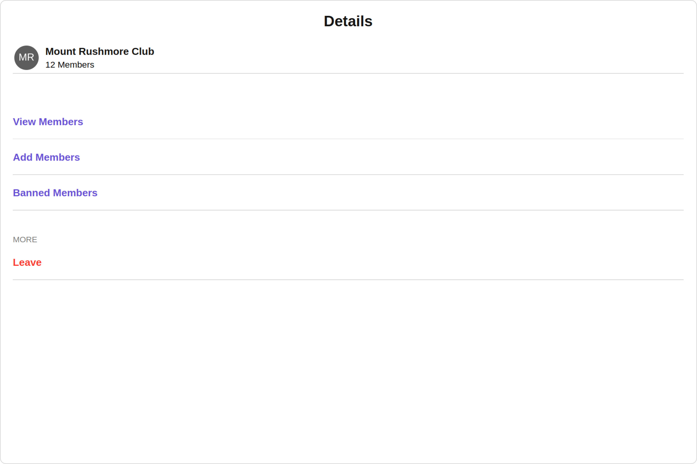
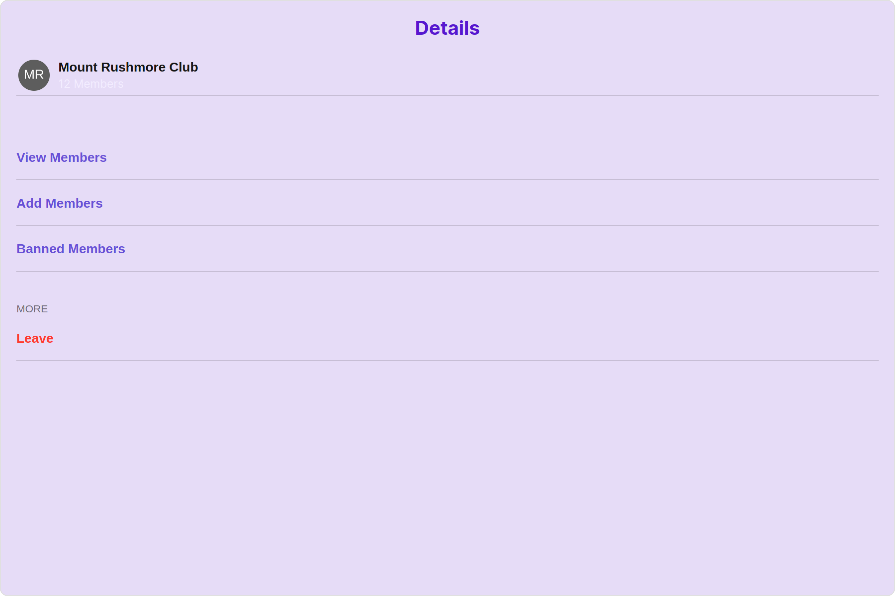
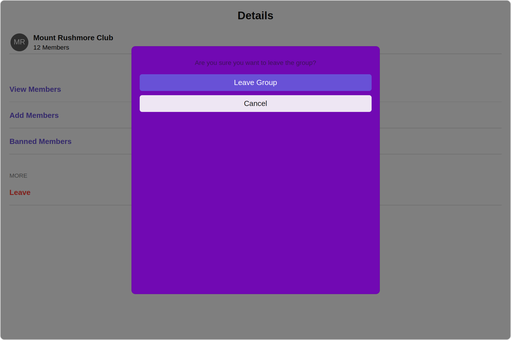
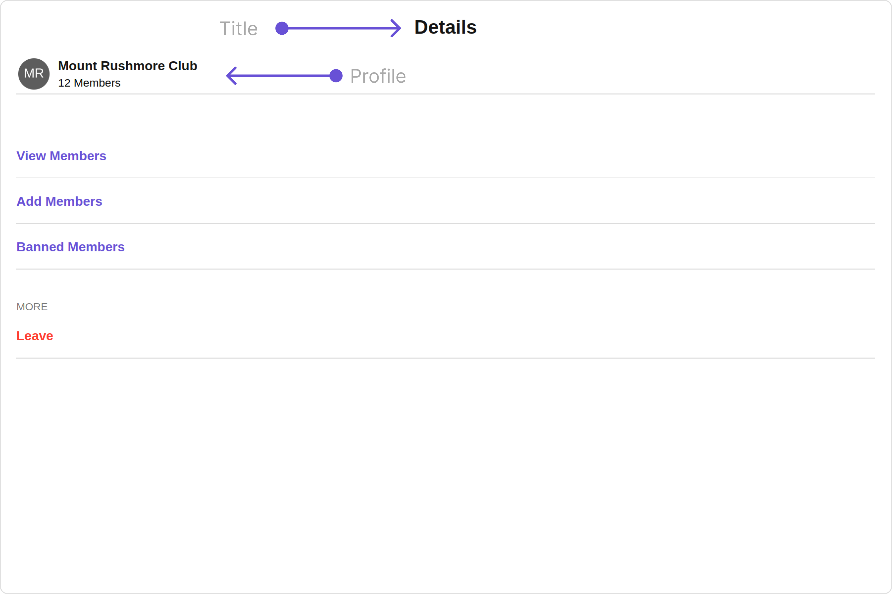
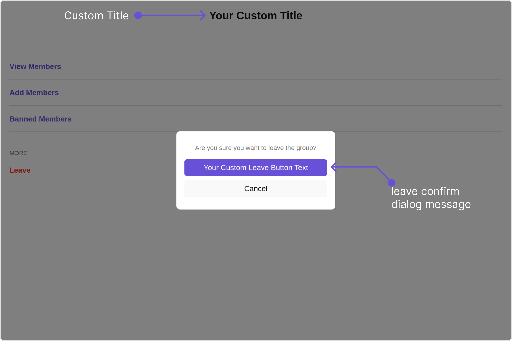
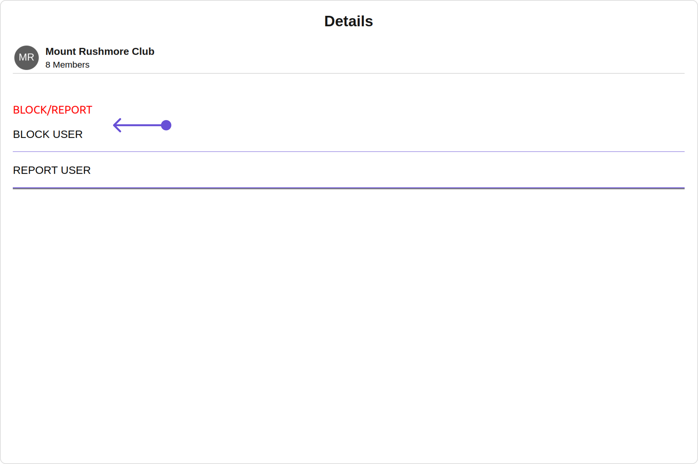
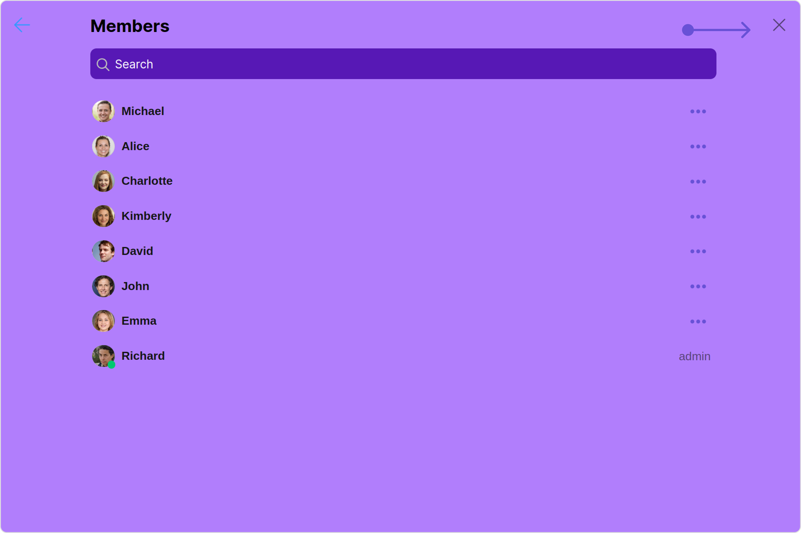
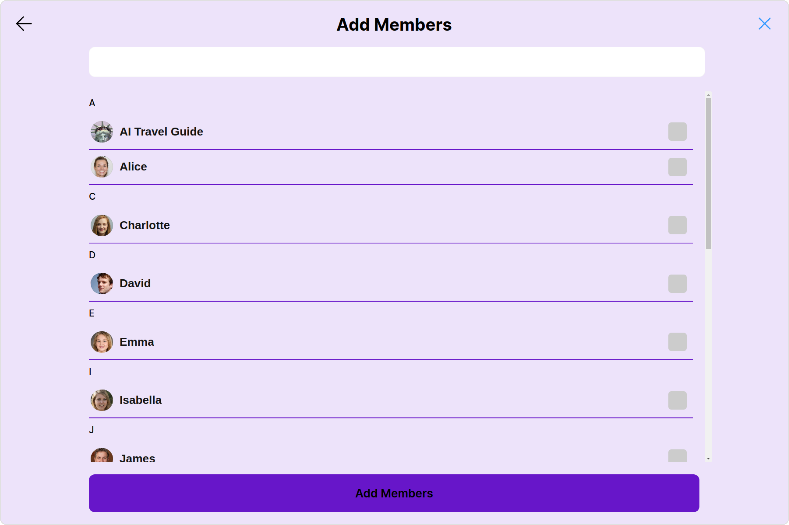
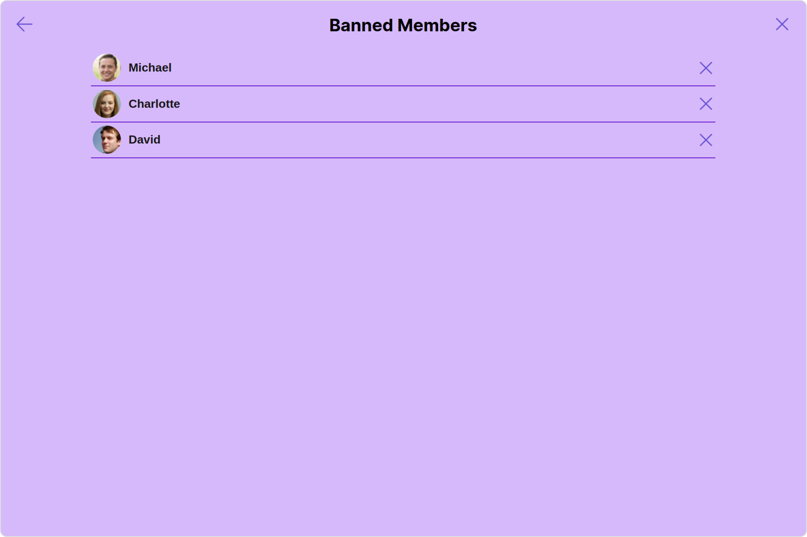

import Tabs from '@theme/Tabs';
import TabItem from '@theme/TabItem';

## Overview

`CometChatDetails` is a [Component](./components-overview#components) that provides additional information and settings related to a specific group.

The details screen includes the following elements and functionalities:

1. Group Information: It displays details about the user. This includes his/her profile picture, name, status, and other relevant information.
2. Group Chat Features: It provides additional functionalities for managing the group. This includes options to add or remove participants, assign roles or permissions, and view group-related information.
3. Group Actions: This offers actions related to the group, such as leaving the group, or deleting the group.



---

## Usage

### Integration

The following code snippet illustrates how you can directly incorporate the Details component into your Application.

<Tabs>
<TabItem value="GroupDetailsDemo" label="GroupDetailsDemo.tsx">

```javascript

import { CometChat } from '@cometchat/chat-sdk-javascript';
import { CometChatDetails } from '@cometchat/chat-uikit-react'
import React from 'react'

const GroupDetailsDemo = () => {

    const [chatGroup, setChatGroup] = React.useState<CometChat.Group | undefined>()

    React.useEffect(() => {
        CometChat.getGroup("guid").then((group) => {
            setChatGroup(group);
        })
    }, []);
  return (
    <CometChatDetails
    group={chatGroup}
    />
  )
}

export default GroupDetailsDemo;

```

</TabItem>
<TabItem value="ts" label="App.tsx">

```javascript
import { GroupDetailsDemo } from "./GroupDetailsDemo";

export default function App() {
  return (
    <div className="App">
      <GroupDetailsDemo />
    </div>
  );
}
```

</TabItem>
</Tabs>

---

### Actions

[Actions](./components-overview#actions) dictate how a component functions. They are divided into two types: Predefined and User-defined. You can override either type, allowing you to tailor the behavior of the component to fit your specific needs.

##### 1. onClose

The `onClose` event is typically triggered when the close button is clicked and it carries a default action. However, with the following code snippet, you can effortlessly override this default operation.

This action does not come with any predefined behavior. However, you have the flexibility to override this event and tailor it to suit your needs using the following code snippet.

<Tabs>
<TabItem value="TypeScript" label="TypeScript">

```tsx title='GroupDetailsDemo.tsx'
import { CometChat } from "@cometchat/chat-sdk-javascript";
import { CometChatDetails } from "@cometchat/chat-uikit-react";
import React from "react";

const GroupDetailsDemo = () => {
  const [chatGroup, setChatGroup] = React.useState<CometChat.Group>();

  React.useEffect(() => {
    CometChat.getGroup("guid").then((group) => {
      setChatGroup(group);
    });
  }, []);
  function handleOnClose(): void {
    console.log("Your custom on close actions");
  }
  return (
    <>
      {chatGroup && (
        <CometChatDetails group={chatGroup} onClose={handleOnClose} />
      )}
    </>
  );
};

export default GroupDetailsDemo;
```

</TabItem>
<TabItem value="JavaScript" label="JavaScript">

```jsx title='GroupDetailsDemo.jsx'
import { CometChat } from "@cometchat/chat-sdk-javascript";
import { CometChatDetails } from "@cometchat/chat-uikit-react";
import React, { useEffect, useState } from "react";

const GroupDetailsDemo = () => {
  const [chatGroup, setChatGroup] = useState(null);

  useEffect(() => {
    CometChat.getGroup("guid").then((group) => {
      setChatGroup(group);
    });
  }, []);

  function handleOnClose() {
    console.log("Your custom on close actions");
  }

  return (
    <>
      {chatGroup && (
        <CometChatDetails group={chatGroup} onClose={handleOnClose} />
      )}
    </>
  );
};

export default GroupDetailsDemo;
```

</TabItem>
</Tabs>

##### 2. onError

This action doesn't change the behavior of the component but rather listens for any errors that occur in the Group Details component.

<Tabs>
<TabItem value="TypeScript" label="TypeScript">

```tsx title='GroupDetailsDemo.tsx'
import { CometChat } from "@cometchat/chat-sdk-javascript";
import { CometChatDetails } from "@cometchat/chat-uikit-react";
import React from "react";

const GroupDetailsDemo = () => {
  const [chatGroup, setChatGroup] = React.useState<CometChat.Group>();

  React.useEffect(() => {
    CometChat.getGroup("guid").then((group) => {
      setChatGroup(group);
    });
  }, []);
  function handleOnError(error: CometChat.CometChatException): void {
    //Your custom on error actions
  }
  return (
    <>
      {chatGroup && (
        <CometChatDetails group={chatGroup} onError={handleOnError} />
      )}
    </>
  );
};

export default GroupDetailsDemo;
```

</TabItem>
<TabItem value="JavaScript" label="JavaScript">

```jsx title='GroupDetailsDemo.jsx'
import { CometChat } from "@cometchat/chat-sdk-javascript";
import { CometChatDetails } from "@cometchat/chat-uikit-react";
import React, { useEffect, useState } from "react";

const GroupDetailsDemo = () => {
  const [chatGroup, setChatGroup] = useState(null);

  useEffect(() => {
    CometChat.getGroup("guid").then((group) => {
      setChatGroup(group);
    });
  }, []);

  function handleOnError(error) {
    console.log("Your custom on close actions");
    //Your custom on error actions
  }

  return (
    <>
      {chatGroup && (
        <CometChatDetails group={chatGroup} onError={handleOnError} />
      )}
    </>
  );
};

export default GroupDetailsDemo;
```

</TabItem>
</Tabs>

---

### Filters

**Filters** allow you to customize the data displayed in a list within a Component. You can filter the list based on your specific criteria, allowing for a more customized. Filters can be applied using RequestBuilders of Chat SDK.

`CometChatDetails` component does not have available filters.

---

### Events

[Events](./components-overview#events) are emitted by a `Component`. By using event you can extend existing functionality. Being global events, they can be applied in Multiple Locations and are capable of being Added or Removed.

To handle events supported by Groups you have to add corresponding listeners by using `CometChatGroupEvents`

The list of `Group Related Events` emitted by the Details component is as follows:

| Event              | Description                                                                   |
| ------------------ | ----------------------------------------------------------------------------- |
| **ccGroupLeft**    | This event is triggered when the group member leaves the group successfully.  |
| **ccGroupDeleted** | This event is triggered when the group member deletes the group successfully. |

<Tabs>

<TabItem value="js" label="Add Listener">

```javascript
const ccGroupLeft = CometChatGroupEvents.ccGroupLeft.subscribe(
  (item: IGroupLeft) => {
    //Your Code
  }
);

const ccGroupDeleted = CometChatGroupEvents.ccGroupDeleted.subscribe(
  (group: CometChat.Group) => {
    //Your Code
  }
);
```

</TabItem>

</Tabs>

---

<Tabs>

<TabItem value="js" label="Remove Listener">

```javascript
ccGroupLeft?.unsubscribe();

ccGroupDeleted?.unsubscribe();
```

</TabItem>

</Tabs>

---

## Customization

To fit your app's design requirements, you can customize the appearance of the Details component. We provide exposed methods that allow you to modify the experience and behavior according to your specific needs.

### Style

Using **Style** you can **customize** the look and feel of the component in your app, These parameters typically control elements such as the **color**, **size**, **shape**, and **fonts** used within the component.

##### 1. Details Style

You can set the `DetailsStyle` to the Details Component to customize the styling.



<Tabs>
<TabItem value="TypeScript" label="TypeScript">

```tsx title='GroupDetailsDemo.tsx'
import { CometChat } from "@cometchat/chat-sdk-javascript";
import { CometChatDetails, DetailsStyle } from "@cometchat/chat-uikit-react";
import React from "react";

const GroupDetailsDemo = () => {
  const [chatGroup, setChatGroup] = React.useState<CometChat.Group>();

  React.useEffect(() => {
    CometChat.getGroup("guid").then((group) => {
      setChatGroup(group);
    });
  }, []);
  const detailsStyle = new DetailsStyle({
    background: "#e6dcf7",
    titleTextColor: "#5717cf",
    subtitleTextColor: "#f3edff",
    closeButtonIconTint: "#5717cf",
    passwordGroupIconBackground: "#a73fe8",
    privateGroupIconBackground: "#a73fe8",
  });
  return (
    <>
      {chatGroup && (
        <CometChatDetails group={chatGroup} detailsStyle={detailsStyle} />
      )}
    </>
  );
};

export default GroupDetailsDemo;
```

</TabItem>
<TabItem value="JavaScript" label="JavaScript">

```jsx title='GroupDetailsDemo.jsx'
import { CometChat } from "@cometchat/chat-sdk-javascript";
import { CometChatDetails, DetailsStyle } from "@cometchat/chat-uikit-react";
import React, { useEffect, useState } from "react";

const GroupDetailsDemo = () => {
  const [chatGroup, setChatGroup] = useState(null);

  useEffect(() => {
    CometChat.getGroup("guid").then((group) => {
      setChatGroup(group);
    });
  }, []);

  const detailsStyle = new DetailsStyle({
    background: "#e6dcf7",
    titleTextColor: "#5717cf",
    subtitleTextColor: "#f3edff",
    closeButtonIconTint: "#5717cf",
    passwordGroupIconBackground: "#a73fe8",
    privateGroupIconBackground: "#a73fe8",
  });

  return (
    <>
      {chatGroup && (
        <CometChatDetails group={chatGroup} detailsStyle={detailsStyle} />
      )}
    </>
  );
};

export default GroupDetailsDemo;
```

</TabItem>
</Tabs>

List of properties exposed by DetailsStyle

| Property                        | Description                                                                  | Code                                    |
| ------------------------------- | ---------------------------------------------------------------------------- | --------------------------------------- |
| **border**                      | Used to set border                                                           | `border?: string,`                      |
| **borderRadius**                | Used to set border radius                                                    | `borderRadius?: string;`                |
| **background**                  | Used to set background colour                                                | `background?: string;`                  |
| **height**                      | Used to set height                                                           | `height?: string;`                      |
| **width**                       | Used to set width                                                            | `width?: string;`                       |
| **titleTextFont**               | Used to customise the font of the title in the app bar                       | `titleTextFont?: string;`               |
| **titleTextColor**              | Used to customise the color of the title in the app bar                      | `titleTextColor?: string;`              |
| **onlineStatusColor**           | Sets the color of the status indicator representing the user's online status | `onlineStatusColor?: string;`           |
| **subtitleTextFont**            | Sets all the different properties of font for the subtitle text              | `subtitleTextFont?: string;`            |
| **subtitleTextColor**           | Sets the color of the subtitle text                                          | `subtitleTextColor?: string;`           |
| **closeButtonIconTint**         | Sets the color of the close icon of the component                            | `closeButtonIconTint?: string;`         |
| **privateGroupIconBackground**  | Used to set private group icon background                                    | `privateGroupIconBackground?: string,`  |
| **passwordGroupIconBackground** | Used to set password group icon background                                   | `passwordGroupIconBackground?: string;` |
| **padding**                     | Used to set padding                                                          | `padding?:string;`                      |

##### 2. LeaveDialog Style

You can set the `leaveDialogStyle` to the Details Component to customize the styling.



<Tabs>
<TabItem value="TypeScript" label="TypeScript">

```tsx title='GroupDetailsDemo.tsx'
import { CometChat } from "@cometchat/chat-sdk-javascript";
import { CometChatDetails } from "@cometchat/chat-uikit-react";
import React from "react";

const GroupDetailsDemo = () => {
  const [chatGroup, setChatGroup] = React.useState<CometChat.Group>();

  React.useEffect(() => {
    CometChat.getGroup("guid").then((group) => {
      setChatGroup(group);
    });
  }, []);
  const leaveDialogStyle = {
    background: "#7109b3",
    height: "500px",
    width: "500px",
  };
  return (
    <>
      {chatGroup && (
        <CometChatDetails
          group={chatGroup}
          leaveDialogStyle={leaveDialogStyle}
        />
      )}
    </>
  );
};

export default GroupDetailsDemo;
```

</TabItem>
<TabItem value="JavaScript" label="JavaScript">

```jsx title='GroupDetailsDemo.jsx'
import { CometChat } from "@cometchat/chat-sdk-javascript";
import { CometChatDetails } from "@cometchat/chat-uikit-react";
import React, { useEffect, useState } from "react";

const GroupDetailsDemo = () => {
  const [chatGroup, setChatGroup] = useState(null);

  useEffect(() => {
    CometChat.getGroup("guid").then((group) => {
      setChatGroup(group);
    });
  }, []);

  const leaveDialogStyle = {
    background: "#7109b3",
    height: "500px",
    width: "500px",
  };

  return (
    <>
      {chatGroup && (
        <CometChatDetails
          group={chatGroup}
          leaveDialogStyle={leaveDialogStyle}
        />
      )}
    </>
  );
};

export default GroupDetailsDemo;
```

</TabItem>
</Tabs>

##### 3. DeleteDialog Style

You can set the `deleteDialogStyle` to the Details Component to customize the styling.

<Tabs>
<TabItem value="TypeScript" label="TypeScript">

```tsx title='GroupDetailsDemo.tsx'
import { CometChat } from "@cometchat/chat-sdk-javascript";
import { CometChatDetails } from "@cometchat/chat-uikit-react";
import React from "react";

const GroupDetailsDemo = () => {
  const [chatGroup, setChatGroup] = React.useState<CometChat.Group>();

  React.useEffect(() => {
    CometChat.getGroup("guid").then((group) => {
      setChatGroup(group);
    });
  }, []);
  const deleteDialogStyle = {
    background: "#7109b3",
    height: "500px",
    width: "500px",
  };
  return (
    <>
      {chatGroup && (
        <CometChatDetails
          group={chatGroup}
          deleteDialogStyle={deleteDialogStyle}
        />
      )}
    </>
  );
};

export default GroupDetailsDemo;
```

</TabItem>
<TabItem value="JavaScript" label="JavaScript">

```jsx title='GroupDetailsDemo.jsx'
import { CometChat } from "@cometchat/chat-sdk-javascript";
import { CometChatDetails } from "@cometchat/chat-uikit-react";
import React, { useEffect, useState } from "react";

const GroupDetailsDemo = () => {
  const [chatGroup, setChatGroup] = useState(null);

  useEffect(() => {
    CometChat.getGroup("guid").then((group) => {
      setChatGroup(group);
    });
  }, []);

  const deleteDialogStyle = {
    background: "#7109b3",
    height: "500px",
    width: "500px",
  };

  return (
    <>
      {chatGroup && (
        <CometChatDetails
          group={chatGroup}
          deleteDialogStyle={deleteDialogStyle}
        />
      )}
    </>
  );
};

export default GroupDetailsDemo;
```

</TabItem>
</Tabs>

##### 4. Avatar Style

To apply customized styles to the `Avatar` component in the Details Component, you can use the following code snippet. For further insights on `Avatar` Styles [refer](./avatar#avatar-style)

<Tabs>
<TabItem value="TypeScript" label="TypeScript">

```tsx title='GroupDetailsDemo.tsx'
import { CometChat } from "@cometchat/chat-sdk-javascript";
import { CometChatDetails, AvatarStyle } from "@cometchat/chat-uikit-react";
import React from "react";

const GroupDetailsDemo = () => {
  const [chatGroup, setChatGroup] = React.useState<CometChat.Group>();

  React.useEffect(() => {
    CometChat.getGroup("uid").then((group) => {
      setChatGroup(group);
    });
  }, []);
  const avatarStyle = new AvatarStyle({
    backgroundColor: "#cdc2ff",
    border: "2px solid #6745ff",
    borderRadius: "10px",
    outerViewBorderColor: "#ca45ff",
    outerViewBorderRadius: "5px",
    nameTextColor: "#4554ff",
  });
  return (
    <>
      {chatGroup && (
        <CometChatDetails group={chatGroup} avatarStyle={avatarStyle} />
      )}
    </>
  );
};

export default GroupDetailsDemo;
```

</TabItem>
<TabItem value="JavaScript" label="JavaScript">

```jsx title='GroupDetailsDemo.jsx'
import { CometChat } from "@cometchat/chat-sdk-javascript";
import { CometChatDetails, AvatarStyle } from "@cometchat/chat-uikit-react";
import React, { useEffect, useState } from "react";

const GroupDetailsDemo = () => {
  const [chatGroup, setChatGroup] = useState(null);

  useEffect(() => {
    CometChat.getGroup("uid").then((group) => {
      setChatGroup(group);
    });
  }, []);
  const avatarStyle = new AvatarStyle({
    backgroundColor: "#cdc2ff",
    border: "2px solid #6745ff",
    borderRadius: "10px",
    outerViewBorderColor: "#ca45ff",
    outerViewBorderRadius: "5px",
    nameTextColor: "#4554ff",
  });
  return (
    <>
      {chatGroup && (
        <CometChatDetails group={chatGroup} avatarStyle={avatarStyle} />
      )}
    </>
  );
};

export default GroupDetailsDemo;
```

</TabItem>
</Tabs>

##### 5. LisItem Style

To apply customized styles to the `ListItemStyle` component in the `Details` Component, you can use the following code snippet. For further insights on `ListItemStyle` Styles [refer](./list-item)

<Tabs>
<TabItem value="TypeScript" label="TypeScript">

```tsx title='GroupDetailsDemo.tsx'
import { CometChat } from "@cometchat/chat-sdk-javascript";
import { CometChatDetails, ListItemStyle } from "@cometchat/chat-uikit-react";
import React from "react";

const GroupDetailsDemo = () => {
  const [chatGroup, setChatGroup] = React.useState<CometChat.Group>();

  React.useEffect(() => {
    CometChat.getGroup("uid").then((group) => {
      setChatGroup(group);
    });
  }, []);
  const listItemStyle = new ListItemStyle({
    width: "100%",
    height: "100%",
    border: "2px solid red",
  });
  return (
    <>
      {chatGroup && (
        <CometChatDetails group={chatGroup} listItemStyle={listItemStyle} />
      )}
    </>
  );
};

export default GroupDetailsDemo;
```

</TabItem>
<TabItem value="JavaScript" label="JavaScript">

```jsx title='GroupDetailsDemo.jsx'
import { CometChat } from "@cometchat/chat-sdk-javascript";
import { CometChatDetails, ListItemStyle } from "@cometchat/chat-uikit-react";
import React, { useEffect, useState } from "react";

const GroupDetailsDemo = () => {
  const [chatGroup, setChatGroup] = useState(null);

  useEffect(() => {
    CometChat.getGroup("uid").then((group) => {
      setChatGroup(group);
    });
  }, []);
  const listItemStyle = new ListItemStyle({
    width: "100%",
    height: "100%",
    border: "2px solid red",
  });
  return (
    <>
      {chatGroup && (
        <CometChatDetails group={chatGroup} listItemStyle={listItemStyle} />
      )}
    </>
  );
};

export default GroupDetailsDemo;
```

</TabItem>
</Tabs>

##### 6. StatusIndicator Style

To apply customized styles to the Status Indicator in the Details Component, You can use the following code snippet. For further insights on Status Indicator Styles [refer](./status-indicator)

<Tabs>
<TabItem value="TypeScript" label="TypeScript">

```tsx title='GroupDetailsDemo.tsx'
import { CometChat } from "@cometchat/chat-sdk-javascript";
import { CometChatDetails } from "@cometchat/chat-uikit-react";
import React from "react";

const GroupDetailsDemo = () => {
  const [chatGroup, setChatGroup] = React.useState<CometChat.Group>();

  React.useEffect(() => {
    CometChat.getGroup("uid").then((group) => {
      setChatGroup(group);
    });
  }, []);
  const statusIndicatorStyle = {
    background: "#db35de",
    height: "10px",
    width: "10px",
  };
  return (
    <>
      {chatGroup && (
        <CometChatDetails
          group={chatGroup}
          statusIndicatorStyle={statusIndicatorStyle}
        />
      )}
    </>
  );
};

export default GroupDetailsDemo;
```

</TabItem>
<TabItem value="JavaScript" label="JavaScript">

```jsx title='GroupDetailsDemo.jsx'
import { CometChat } from "@cometchat/chat-sdk-javascript";
import { CometChatDetails } from "@cometchat/chat-uikit-react";
import React, { useEffect, useState } from "react";

const GroupDetailsDemo = () => {
  const [chatGroup, setChatGroup] = useState(null);

  useEffect(() => {
    CometChat.getGroup("uid").then((group) => {
      setChatGroup(group);
    });
  }, []);
  const statusIndicatorStyle = {
    background: "#db35de",
    height: "10px",
    width: "10px",
  };
  return (
    <>
      {chatGroup && (
        <CometChatDetails
          group={chatGroup}
          statusIndicatorStyle={statusIndicatorStyle}
        />
      )}
    </>
  );
};

export default GroupDetailsDemo;
```

</TabItem>
</Tabs>

##### 6. Backdrop Style

To apply customized styles to the `Backdrop` component in the `Details` Component, you can use the following code snippet, you can use the following code snippet. For further insights on `Backdrop` Styles [refer](./backdrop)

<Tabs>
<TabItem value="TypeScript" label="TypeScript">

```tsx title='GroupDetailsDemo.tsx'
import { CometChat } from "@cometchat/chat-sdk-javascript";
import { CometChatDetails, BackdropStyle } from "@cometchat/chat-uikit-react";
import React from "react";

const GroupDetailsDemo = () => {
  const [chatGroup, setChatGroup] = React.useState<CometChat.Group>();

  React.useEffect(() => {
    CometChat.getGroup("uid").then((group) => {
      setChatGroup(group);
    });
  }, []);
  const backdropStyle = new BackdropStyle({
    width: "100%",
    height: "100%",
    border: "2px solid red",
    background: "blue",
    borderRadius: "20px",
  });
  return (
    <>
      {chatGroup && (
        <CometChatDetails group={chatGroup} backdropStyle={backdropStyle} />
      )}
    </>
  );
};

export default GroupDetailsDemo;
```

</TabItem>
<TabItem value="JavaScript" label="JavaScript">

```jsx title='GroupDetailsDemo.jsx'
import { CometChat } from "@cometchat/chat-sdk-javascript";
import { CometChatDetails, BackdropStyle } from "@cometchat/chat-uikit-react";
import React, { useEffect, useState } from "react";

const GroupDetailsDemo = () => {
  const [chatGroup, setChatGroup] = useState(null);

  useEffect(() => {
    CometChat.getGroup("uid").then((group) => {
      setChatGroup(group);
    });
  }, []);
  const backdropStyle = new BackdropStyle({
    width: "100%",
    height: "100%",
    border: "2px solid red",
    background: "blue",
    borderRadius: "20px",
  });
  return (
    <>
      {chatGroup && (
        <CometChatDetails group={chatGroup} backdropStyle={backdropStyle} />
      )}
    </>
  );
};

export default GroupDetailsDemo;
```

</TabItem>
</Tabs>

---

### Functionality

These are a set of small functional customizations that allow you to fine-tune the overall experience of the component. With these, you can change text, set custom icons, and toggle the visibility of UI elements.

<Tabs>
<TabItem value="TypeScript" label="TypeScript">

```tsx title='GroupDetailsDemo.tsx'
import { CometChat } from "@cometchat/chat-sdk-javascript";
import { CometChatDetails } from "@cometchat/chat-uikit-react";
import React from "react";

const GroupDetailsDemo = () => {
  const [chatGroup, setChatGroup] = React.useState<CometChat.Group>();

  React.useEffect(() => {
    CometChat.getGroup("uid").then((group) => {
      setChatGroup(group);
    });
  }, []);
  return (
    <>
      {chatGroup && (
        <CometChatDetails
          group={chatGroup}
          title="Your Custom Title"
          leaveConfirmDialogMessage="YOUR CUSTOM LEAVE CONFIRM DIALOG MESSAGE"
          hideProfile={true}
        />
      )}
    </>
  );
};

export default GroupDetailsDemo;
```

</TabItem>
<TabItem value="JavaScript" label="JavaScript">

```jsx title='GroupDetailsDemo.jsx'
import { CometChat } from "@cometchat/chat-sdk-javascript";
import { CometChatDetails } from "@cometchat/chat-uikit-react";
import React, { useEffect, useState } from "react";

const GroupDetailsDemo = () => {
  const [chatGroup, setChatGroup] = useState(null);

  useEffect(() => {
    CometChat.getGroup("uid").then((group) => {
      setChatGroup(group);
    });
  }, []);
  return (
    <>
      {chatGroup && (
        <CometChatDetails
          group={chatGroup}
          title="Your Custom Title"
          leaveConfirmDialogMessage="YOUR CUSTOM LEAVE CONFIRM DIALOG MESSAGE"
          hideProfile={true}
        />
      )}
    </>
  );
};

export default GroupDetailsDemo;
```

</TabItem>
</Tabs>

Default:


Custom:


Below is a list of customizations along with corresponding code snippets

| Property                                                                                                                        | Description                                                  | Code                                                                                                       |
| ------------------------------------------------------------------------------------------------------------------------------- | ------------------------------------------------------------ | ---------------------------------------------------------------------------------------------------------- |
| **title** <a data-tooltip-id="my-tooltip-html-prop"> <span class="material-icons red">report</span> </a>                        | Used to set title in the app heading                         | `title="Your Custom Title"`                                                                                |
| **leaveButtonText** <a data-tooltip-id="my-tooltip-html-prop"> <span class="material-icons red">report</span> </a>              | Used to set custom leave button text                         | `leaveButtonText='Your Custom Leave Button Text'`                                                          |
| **cancelButtonText** <a data-tooltip-id="my-tooltip-html-prop"> <span class="material-icons red">report</span> </a>             | Used to set custom cancel button text                        | `cancelButtonText='Your Custom Cancel Button Text'`                                                        |
| **deleteButtonText** <a data-tooltip-id="my-tooltip-html-prop"> <span class="material-icons red">report</span> </a>             | Used to set delete cancel button text                        | `deleteButtonText='Your Custom delete Button Text'`                                                        |
| **transferButtonText** <a data-tooltip-id="my-tooltip-html-prop"> <span class="material-icons red">report</span> </a>           | Used to set transfer cancel button text                      | `transferButtonText='Your Custom transfer Button Text'`                                                    |
| **closeButtonIconURL**                                                                                                          | Used to set close button Icon                                | `closeButtonIconURL="your custom close icon url"`                                                          |
| **hideProfile**                                                                                                                 | Used to hide profile                                         | `hideProfile={true}`                                                                                       |
| **disableUsersPresence**                                                                                                        | Used to toggle functionality to show user's presence         | `disableUsersPresence={true}`                                                                              |
| **group** <a data-tooltip-id="my-tooltip-html-prop"> <span class="material-icons red">report</span> </a>                        | Used to pass group object of which group details to be shown | `group={chatGroup}`                                                                                        |
| **user** <a data-tooltip-id="my-tooltip-html-prop"> <span class="material-icons red">report</span> </a>                         | Used to pass user object of logged in user for the group     | `user={chatUser}`                                                                                          |
| **data**                                                                                                                        | Used to pass custom details template                         | `data?: ({user, group,}: {user?: CometChat.User;group?: CometChat.Group;}) => CometChatDetailsTemplate[];` |
| **leaveConfirmDialogMessage** <a data-tooltip-id="my-tooltip-html-prop"> <span class="material-icons red">report</span> </a>    | Custom message for leave confirm dialog                      | `leaveConfirmDialogMessage='YOUR CUSTOM LEAVE CONFIRM DIALOG MESSAGE'`                                     |
| **transferConfirmDialogMessage** <a data-tooltip-id="my-tooltip-html-prop"> <span class="material-icons red">report</span> </a> | Custom message for transfer confirm dialog                   | `transferConfirmDialogMessage='YOUR CUSTOM TRANSFER CONFIRM DIALOG MESSAGE'`                               |
| **deleteConfirmDialogMessage** <a data-tooltip-id="my-tooltip-html-prop"> <span class="material-icons red">report</span> </a>   | Custom message for delete confirm dialog                     | `deleteConfirmDialogMessage='YOUR CUSTOM DELETE CONFIRM DIALOG MESSAGE'`                                   |

---

### Advance

For advanced-level customization, you can set custom views to the component. This lets you tailor each aspect of the component to fit your exact needs and application aesthetics. You can create and define your views, layouts, and UI elements and then incorporate those into the component.

---

#### SubtitleView

You can customize the subtitle view for each group to meet your requirements

```jsx
subtitleView = { getSubtitleView };
```

Default:

<Tabs>
<TabItem value="TypeScript" label="TypeScript">

```tsx title='GroupDetailsDemo.tsx'
import { CometChat } from "@cometchat/chat-sdk-javascript";
import { CometChatDetails } from "@cometchat/chat-uikit-react";
import React from "react";

const GroupDetailsDemo = () => {
  const [chatGroup, setChatGroup] = React.useState<CometChat.Group>();

  React.useEffect(() => {
    CometChat.getGroup("uid").then((group) => {
      setChatGroup(group);
    });
  }, []);
  const getSubtitleView = (group: CometChat.Group | any): JSX.Element => {
    if (group instanceof CometChat.Group) {
      return (
        <div
          style={{
            display: "flex",
            alignItems: "left",
            padding: "2px",
            fontSize: "10px",
          }}
        >
          <div style={{ color: "gray" }}>{group.getMembersCount()} members</div>
        </div>
      );
    } else {
      return <></>;
    }
  };
  return <CometChatDetails group={chatGroup} subtitleView={getSubtitleView} />;
};

export default GroupDetailsDemo;
```

</TabItem>
<TabItem value="JavaScript" label="JavaScript">

```jsx title='GroupDetailsDemo.jsx'
import { CometChat } from "@cometchat/chat-sdk-javascript";
import { CometChatDetails } from "@cometchat/chat-uikit-react";
import React, { useEffect, useState } from "react";

const GroupDetailsDemo = () => {
  const [chatGroup, setChatGroup] = useState(null);

  useEffect(() => {
    CometChat.getGroup("uid").then((group) => {
      setChatGroup(group);
    });
  }, []);

  const getSubtitleView = (group) => {
    if (group instanceof CometChat.Group) {
      return (
        <div
          style={{
            display: "flex",
            alignItems: "left",
            padding: "2px",
            fontSize: "10px",
          }}
        >
          <div style={{ color: "gray" }}>{group.getMembersCount()} members</div>
        </div>
      );
    } else {
      return <></>;
    }
  };
  return <CometChatDetails group={chatGroup} subtitleView={getSubtitleView} />;
};

export default GroupDetailsDemo;
```

</TabItem>
</Tabs>

#### CustomProfileView

You can customize the subtitle view for each user item to meet your requirements

```jsx
customProfileView = { getCustomProfileView };
```

<Tabs>
<TabItem value="TypeScript" label="TypeScript">

```tsx title='GroupDetailsDemo.tsx'
import { CometChat } from "@cometchat/chat-sdk-javascript";
import { CometChatDetails } from "@cometchat/chat-uikit-react";
import React from "react";

const GroupDetailsDemo = () => {
  const [chatGroup, setChatGroup] = React.useState<CometChat.Group>();

  React.useEffect(() => {
    CometChat.getGroup("uid").then((group) => {
      setChatGroup(group);
    });
  }, []);
  function getCustomProfileView(group: CometChat.Group | any): JSX.Element {
    return (
      <div
        style={{
          display: "flex",
          alignItems: "left",
          padding: "10px",
          border: "2px solid #e9baff",
          borderRadius: "20px",
          background: "#6e2bd9",
        }}
      >
        <cometchat-avatar image={group?.getIcon()} name={group?.getName()} />

        <div style={{ display: "flex", paddingLeft: "10px" }}>
          <div
            style={{ fontWeight: "bold", color: "#ffffff", fontSize: "14px" }}
          >
            {group?.getName()}
            <div
              style={{ color: "#ffffff", fontSize: "10px", textAlign: "left" }}
            >
              {group?.getMembersCount()} members
            </div>
          </div>
        </div>
      </div>
    );
  }
  return (
    <CometChatDetails
      group={chatGroup}
      customProfileView={getCustomProfileView}
    />
  );
};

export default GroupDetailsDemo;
```

</TabItem>
<TabItem value="JavaScript" label="JavaScript">

```jsx title='GroupDetailsDemo.jsx'
import { CometChat } from "@cometchat/chat-sdk-javascript";
import { CometChatDetails } from "@cometchat/chat-uikit-react";
import React, { useEffect, useState } from "react";

const GroupDetailsDemo = () => {
  const [chatGroup, setChatGroup] = useState(null);

  useEffect(() => {
    CometChat.getGroup("uid").then((group) => {
      setChatGroup(group);
    });
  }, []);

  function getCustomProfileView(group) {
    return (
      <div
        style={{
          display: "flex",
          alignItems: "left",
          padding: "10px",
          border: "2px solid #e9baff",
          borderRadius: "20px",
          background: "#6e2bd9",
        }}
      >
        <cometchat-avatar image={group?.getIcon()} name={group?.getName()} />

        <div style={{ display: "flex", paddingLeft: "10px" }}>
          <div
            style={{ fontWeight: "bold", color: "#ffffff", fontSize: "14px" }}
          >
            {group?.getName()}
            <div
              style={{ color: "#ffffff", fontSize: "10px", textAlign: "left" }}
            >
              {group?.getMembersCount()} members{" "}
            </div>
          </div>
        </div>
      </div>
    );
  }
  return (
    <CometChatDetails
      group={chatGroup}
      customProfileView={getCustomProfileView}
    />
  );
};

export default GroupDetailsDemo;
```

</TabItem>
</Tabs>

#### DetailsTemplate

The `CometChatDetailsTemplate` offers a structure for organizing information in the CometChat details component. It serves as a blueprint, defining how group-related details are presented. This structure allows for customization and organization within the CometChat interface.

<Tabs>
<TabItem value="TypeScript" label="TypeScript">

```tsx title='GroupDetailsDemo.tsx'
import React, { useEffect, useState } from "react";
import { CometChat } from "@cometchat/chat-sdk-javascript";
import {
  CometChatDetails,
  CometChatDetailsOption,
  CometChatDetailsTemplate,
} from "@cometchat/chat-uikit-react";

const GroupDetailsDemo = () => {
  const [chatGroup, setChatGroup] = React.useState<CometChat.Group>();

  React.useEffect(() => {
    CometChat.getGroup("uid").then((group) => {
      setChatGroup(group);
    });
  }, []);

  const getTemplate = () => {
    const getOptions = () => {
      const blockOption: CometChatDetailsOption = {
        id: "custom-block",
        title: "BLOCK USER",
        iconURL: "icon",
        iconTint: "red",
        titleFont: "16px sans-serif, Inter",
      };
      const reportOption: CometChatDetailsOption = {
        id: "custom-report",
        title: "REPORT USER",
        iconURL: "icon",
        iconTint: "red",
        titleFont: "16px sans-serif, Inter",
      };
      return [blockOption, reportOption];
    };

    let detailsTemplate: CometChatDetailsTemplate = {
      id: "Block",
      title: "BLOCK/REPORT",
      titleColor: "red",
      sectionSeparatorColor: "grey",
      itemSeparatorColor: "#6851D6",
      hideItemSeparator: false,
      options: getOptions,
    };
    return [detailsTemplate];
  };

  return <CometChatDetails group={chatGroup} data={getTemplate()} />;
};

export default GroupDetailsDemo;
```

</TabItem>

<TabItem value="JavaScript" label="JavaScript">

```jsx title='GroupDetailsDemo.jsx'
import React, { useEffect, useState } from "react";
import { CometChat } from "@cometchat/chat-sdk-javascript";
import {
  CometChatDetails,
  CometChatDetailsOption,
  CometChatDetailsTemplate,
} from "@cometchat/chat-uikit-react";

const GroupDetailsDemo = () => {
  const [chatGroup, setChatGroup] = useState(null);

  useEffect(() => {
    CometChat.getGroup("uid").then((group) => {
      setChatGroup(group);
    });
  }, []);

  const getTemplate = () => {
    const getOptions = () => {
      const blockOption = {
        id: "custom-block",
        title: "BLOCK USER",
        iconURL: "icon",
        iconTint: "red",
        titleFont: "16px sans-serif, Inter",
      };
      const reportOption = {
        id: "custom-report",
        title: "REPORT USER",
        iconURL: "icon",
        iconTint: "red",
        titleFont: "16px sans-serif, Inter",
      };
      return [blockOption, reportOption];
    };

    let detailsTemplate = {
      id: "Block",
      title: "BLOCK/REPORT",
      titleColor: "red",
      sectionSeparatorColor: "grey",
      itemSeparatorColor: "#6851D6",
      hideItemSeparator: false,
      options: getOptions,
    };
    return [detailsTemplate];
  };

  return <CometChatDetails group={chatGroup} data={getTemplate()} />;
};

export default GroupDetailsDemo;
```

</TabItem>
</Tabs>



This defines the structure of template data for the details component.

| Name                      | Type                                                                                                                                                                      | Description                                                           |
| ------------------------- | ------------------------------------------------------------------------------------------------------------------------------------------------------------------------- | --------------------------------------------------------------------- |
| **id**                    | String                                                                                                                                                                    | Identifier for the template                                           |
| **title**                 | String                                                                                                                                                                    | Heading text for the template                                         |
| **titleFont**             | String                                                                                                                                                                    | Sets all the different properties of font for the title text          |
| **titleColor**            | String                                                                                                                                                                    | Sets the foreground color of title text                               |
| **itemSeparatorColor**    | String                                                                                                                                                                    | Sets the color of the template's option separator                     |
| **hideItemSeparator**     | Boolean                                                                                                                                                                   | When set to true, hides the separator under each option in a template |
| **sectionSeparatorColor** | String                                                                                                                                                                    | Sets the color of the template separator                              |
| **hideSectionSeparator**  | Boolean                                                                                                                                                                   | When set to true, hides the separator for the template                |
| **options**               | CometChatDetailsTemplate.options?: ((loggedInUser: User &#124; null, group: Group &#124; null, section: string) => CometChatDetailsOption[]) &#124; null &#124; undefined | defines the structure for individual options                          |

#### DetailsOption

The `DetailsOption` defines the structure for individual options within the CometChat details component, facilitating customization and functionality for user interactions.

This defines the structure of each option for a template in the details component.

| Name                | Type                                                                 | Description                                                                             |
| ------------------- | -------------------------------------------------------------------- | --------------------------------------------------------------------------------------- |
| **id**              | String                                                               | Identifier for the template option                                                      |
| **title**           | String                                                               | Heading text for the template option                                                    |
| **tail**            | any                                                                  | User-defined UI component to customise the trailing view for each option in a template. |
| **customView**      | any                                                                  | User-defined UI component to override the default view for the option.                  |
| **onClick**         | ((item: CometChat.User &#124; CometChat.Group) => void) &#124; null; | Function invoked when user clicks on the option.                                        |
| **titleFont**       | String                                                               | Sets all the different properties of font for the title text                            |
| **titleColor**      | String                                                               | Sets the foreground colour of title text                                                |
| **iconURL**         | String                                                               | Image url for the icon to symbolise an option                                           |
| **iconTint**        | String                                                               | Color applied to the icon of the option                                                 |
| **backgroundColor** | String                                                               | Color applied to the background of the option                                           |

## Configurations

[Configurations](./components-overview#configurations) offer the ability to customize the properties of each component within a Composite Component.

CometChatDetails has `Add Members`, `Banned Members`, `Transfer Ownership` and `Group Members` component. Hence, each of these components will have its individual `Configuration``.

- `Configurations` expose properties that are available in its individual components.

#### Group Members

You can customize the properties of the Group Members component by making use of the `groupMembersConfiguration`. You can accomplish this by employing the `groupMembersConfiguration` props as demonstrated below:

<Tabs>

<TabItem value="TypeScript" label="TypeScript">

```tsx
 groupMembersConfiguration={new GroupMembersConfiguration({
  //override properties of group members
  })}
```

</TabItem>

<TabItem value="JavaScript" label="JavaScript">

```jsx
 groupMembersConfiguration={new GroupMembersConfiguration({
  //override properties of group members
  })}
```

</TabItem>
</Tabs>

All exposed properties of `GroupMembersConfiguration` can be found under [Group Members](./group-members#functionality). Properties marked with the <a data-tooltip-id="my-tooltip-html-prop"><span class="material-icons red">report</span></a> symbol are not accessible within the Configuration Object.

**Example**

Let's say you want to change the style of the Group Member subcomponent and, in addition, you only want to hide separator and left allign the title.

You can modify the style using the `groupMembersStyle` property, hide the separator using `hideSeparator` property and allign the title using `titleAlignment` property.



<Tabs>
<TabItem value="TypeScript" label="TypeScript">

```tsx title='GroupDetailsDemo.tsx'
import { CometChat } from "@cometchat/chat-sdk-javascript";
import {
  CometChatDetails,
  GroupMembersConfiguration,
  TitleAlignment,
  GroupMembersStyle,
} from "@cometchat/chat-uikit-react";
import React from "react";

const GroupDetailsDemo = () => {
  const [chatGroup, setChatGroup] = React.useState<CometChat.Group>();

  React.useEffect(() => {
    CometChat.getGroup("uid").then((group) => {
      setChatGroup(group);
    });
  }, []);
  const groupMembersStyle = new GroupMembersStyle({
    background: "#b17efc",
    searchPlaceholderTextColor: "#ffffff",
    titleTextColor: "#000000",
    searchBackground: "#5718b5",
  });
  return (
    <>
      {chatGroup && (
        <CometChatDetails
          group={chatGroup}
          groupMembersConfiguration={
            new GroupMembersConfiguration({
              //properties of group members
              hideSeparator: true,
              titleAlignment: TitleAlignment.left,
              groupMembersStyle: groupMembersStyle,
            })
          }
        />
      )}
    </>
  );
};

export default GroupDetailsDemo;
```

</TabItem>
<TabItem value="JavaScript" label="JavaScript">

```jsx title='GroupDetailsDemo.jsx'
import { CometChat } from "@cometchat/chat-sdk-javascript";
import {
  CometChatDetails,
  GroupMembersConfiguration,
  TitleAlignment,
  GroupMembersStyle,
} from "@cometchat/chat-uikit-react";
import React, { useEffect, useState } from "react";

const GroupDetailsDemo = () => {
  const [chatGroup, setChatGroup] = useState(null);

  useEffect(() => {
    CometChat.getGroup("uid").then((group) => {
      setChatGroup(group);
    });
  }, []);
  const groupMembersStyle = new GroupMembersStyle({
    background: "#b17efc",
    searchPlaceholderTextColor: "#ffffff",
    titleTextColor: "#000000",
    searchBackground: "#5718b5",
  });
  return (
    <>
      {chatGroup && (
        <CometChatDetails
          group={chatGroup}
          groupMembersConfiguration={
            new GroupMembersConfiguration({
              //properties of group members
              hideSeparator: true,
              titleAlignment: TitleAlignment.left,
              groupMembersStyle: groupMembersStyle,
            })
          }
        />
      )}
    </>
  );
};

export default GroupDetailsDemo;
```

</TabItem>
</Tabs>

#### Add Members

You can customize the properties of the Add Members component by making use of the `AddMembersConfiguration`. You can accomplish this by employing the `addMembersConfiguration` props as demonstrated below:

<Tabs>

<TabItem value="TypeScript" label="TypeScript">

```tsx
 addMembersConfiguration={new AddMembersConfiguration({
  //override properties of add members
  })}
```

</TabItem>

<TabItem value="JavaScript" label="JavaScript">

```jsx
 addMembersConfiguration={new AddMembersConfiguration({
  //override properties of add members
  })}
```

</TabItem>
</Tabs>

All exposed properties of `AddMembersConfiguration` can be found under [Add Members](./group-add-members#functionality). Properties marked with the <a data-tooltip-id="my-tooltip-html-prop"><span class="material-icons red">report</span></a> symbol are not accessible within the Configuration Object.

**Example**

Let's say you want to change the style of the Add Members subcomponent and, in addition, you only want to show section header.

You can modify the style using the `addMembersStyle` property and show the section header using `showSectionHeader` property.



<Tabs>
<TabItem value="TypeScript" label="TypeScript">

```tsx title='GroupDetailsDemo.tsx'
import { CometChat } from "@cometchat/chat-sdk-javascript";
import {
  CometChatDetails,
  AddMembersConfiguration,
  AddMembersStyle,
} from "@cometchat/chat-uikit-react";
import React from "react";

const GroupDetailsDemo = () => {
  const [chatGroup, setChatGroup] = React.useState<CometChat.Group>();

  React.useEffect(() => {
    CometChat.getGroup("uid").then((group) => {
      setChatGroup(group);
    });
  }, []);
  const addMembersStyle = new AddMembersStyle({
    addMembersButtonBackground: "#6716c9",
    addMembersButtonTextColor: "#ffffff",
    background: "#d6b9fa",
    searchBackground: "#6716c9",
    searchPlaceholderTextColor: "#ffffff",
    titleTextColor: "#ffffff",
    searchIconTint: "#ffffff",
    separatorColor: "#6716c9",
    sectionHeaderTextColor: "#ffffff",
    backButtonIconTint: "#000000",
  });
  return (
    <>
      {chatGroup && (
        <CometChatDetails
          group={chatGroup}
          addMembersConfiguration={
            new AddMembersConfiguration({
              //properties of add member component
              showSectionHeader: true,
              addMembersStyle: addMembersStyle,
            })
          }
        />
      )}
    </>
  );
};

export default GroupDetailsDemo;
```

</TabItem>
<TabItem value="JavaScript" label="JavaScript">

```jsx title='GroupDetailsDemo.jsx'
import { CometChat } from "@cometchat/chat-sdk-javascript";
import {
  CometChatDetails,
  AddMembersConfiguration,
  AddMembersStyle,
} from "@cometchat/chat-uikit-react";
import React, { useEffect, useState } from "react";

const GroupDetailsDemo = () => {
  const [chatGroup, setChatGroup] = useState(null);

  useEffect(() => {
    CometChat.getGroup("uid").then((group) => {
      setChatGroup(group);
    });
  }, []);
  const addMembersStyle = new AddMembersStyle({
    addMembersButtonBackground: "#6716c9",
    addMembersButtonTextColor: "#ffffff",
    background: "#d6b9fa",
    searchBackground: "#6716c9",
    searchPlaceholderTextColor: "#ffffff",
    titleTextColor: "#ffffff",
    searchIconTint: "#ffffff",
    separatorColor: "#6716c9",
    sectionHeaderTextColor: "#ffffff",
    backButtonIconTint: "#000000",
  });
  return (
    <>
      {chatGroup && (
        <CometChatDetails
          group={chatGroup}
          addMembersConfiguration={
            new AddMembersConfiguration({
              //properties of add member component
              showSectionHeader: true,
              addMembersStyle: addMembersStyle,
            })
          }
        />
      )}
    </>
  );
};

export default GroupDetailsDemo;
```

</TabItem>
</Tabs>

#### Banned Members

You can customize the properties of the Banned Members component by making use of the `BannedMembersConfiguration`. You can accomplish this by employing the `bannedMembersConfiguration` props as demonstrated below:

<Tabs>

<TabItem value="TypeScript" label="TypeScript">

```tsx
 bannedMembersConfiguration={new BannedMembersConfiguration({
  //override properties of banned members
  })}
```

</TabItem>

<TabItem value="JavaScript" label="JavaScript">

```jsx
 bannedMembersConfiguration={new BannedMembersConfiguration({
  //override properties of banned members
  })}
```

</TabItem>
</Tabs>

All exposed properties of `BannedMembersConfiguration` can be found under [Banned Members](./group-banned-members#functionality). Properties marked with the <a data-tooltip-id="my-tooltip-html-prop"><span class="material-icons red">report</span></a> symbol are not accessible within the Configuration Object.

**Example**

Let's say you want to change the style of the Banned Members subcomponent and, in addition, you only want to hide the search bar.

You can modify the style using the `bannedMembersStyle` property and hide the search bar using `hideSearch` property.



<Tabs>
<TabItem value="TypeScript" label="TypeScript">

```tsx title='GroupDetailsDemo.tsx'
import { CometChat } from "@cometchat/chat-sdk-javascript";
import {
  CometChatDetails,
  BannedMembersConfiguration,
  BannedMembersStyle,
} from "@cometchat/chat-uikit-react";
import React from "react";

const GroupDetailsDemo = () => {
  const [chatGroup, setChatGroup] = React.useState<CometChat.Group>();

  React.useEffect(() => {
    CometChat.getGroup("uid").then((group) => {
      setChatGroup(group);
    });
  }, []);
  const bannedMembersStyle = new BannedMembersStyle({
    background: "#d6b9fa",
    titleTextColor: "#ffffff",
    separatorColor: "#6d1fcf",
    onlineStatusColor: "#b1f029",
  });
  return (
    <>
      {chatGroup && (
        <CometChatDetails
          group={chatGroup}
          bannedMembersConfiguration={
            new BannedMembersConfiguration({
              //properties of banned members
              hideSearch: true,
              bannedMembersStyle: bannedMembersStyle,
            })
          }
        />
      )}
    </>
  );
};

export default GroupDetailsDemo;
```

</TabItem>
<TabItem value="JavaScript" label="JavaScript">

```jsx title='GroupDetailsDemo.jsx'
import { CometChat } from "@cometchat/chat-sdk-javascript";
import {
  CometChatDetails,
  BannedMembersConfiguration,
  BannedMembersStyle,
} from "@cometchat/chat-uikit-react";
import React, { useEffect, useState } from "react";

const GroupDetailsDemo = () => {
  const [chatGroup, setChatGroup] = useState(null);

  useEffect(() => {
    CometChat.getGroup("uid").then((group) => {
      setChatGroup(group);
    });
  }, []);
  const bannedMembersStyle = new BannedMembersStyle({
    background: "#d6b9fa",
    titleTextColor: "#ffffff",
    separatorColor: "#6d1fcf",
    onlineStatusColor: "#b1f029",
  });
  return (
    <>
      {chatGroup && (
        <CometChatDetails
          group={chatGroup}
          bannedMembersConfiguration={
            new BannedMembersConfiguration({
              //properties of banned members
              hideSearch: true,
              bannedMembersStyle: bannedMembersStyle,
            })
          }
        />
      )}
    </>
  );
};

export default GroupDetailsDemo;
```

</TabItem>
</Tabs>

#### Transfer Ownership

You can customize the properties of the Transfer Ownership component by making use of the `TransferOwnershipConfiguration`. You can accomplish this by employing the `transferOwnershipConfiguration` props as demonstrated below:

<Tabs>

<TabItem value="TypeScript" label="TypeScript">

```tsx
 transferOwnershipConfiguration={new TransferOwnershipConfiguration({
  //override properties of Transfer Ownership
  })}
```

</TabItem>

<TabItem value="JavaScript" label="JavaScript">

```jsx
 transferOwnershipConfiguration={new TransferOwnershipConfiguration({
  //override properties of Transfer Ownership
  })}
```

</TabItem>
</Tabs>

All exposed properties of `TransferOwnershipConfiguration` can be found under [Transfer Ownership](./group-transfer-ownership#functionality). Properties marked with the <a data-tooltip-id="my-tooltip-html-prop"><span class="material-icons red">report</span></a> symbol are not accessible within the Configuration Object.

**Example**

Let's say you want to change the style of the Transfer Ownership subcomponent and, in addition, you only want to disable the users presence.

You can modify the style using the `transferOwnershipStyle` property and disable the users presence using `disableUsersPresence` property.

<Tabs>
<TabItem value="TypeScript" label="TypeScript">

```tsx title='GroupDetailsDemo.tsx'
import { CometChat } from "@cometchat/chat-sdk-javascript";
import {
  CometChatDetails,
  TransferOwnershipConfiguration,
  transferOwnershipStyle,
} from "@cometchat/chat-uikit-react";
import React from "react";

const GroupDetailsDemo = () => {
  const [chatGroup, setChatGroup] = React.useState<CometChat.Group>();

  React.useEffect(() => {
    CometChat.getGroup("uid").then((group) => {
      setChatGroup(group);
    });
  }, []);
  const transferOwnershipStyle = new TransferOwnershipStyle({
    background: "#e9c4ff",
    MemberScopeTextColor: "#ffffff",
    transferButtonTextColor: "#ffffff",
    MemberScopeTextFont: "#ffffff",
    cancelButtonTextColor: "#ffffff",
  });
  return (
    <>
      {chatGroup && (
        <CometChatDetails
          group={chatGroup}
          transferOwnershipConfiguration={
            new TransferOwnershipConfiguration({
              //properties of transfer ownership
              transferOwnershipStyle: transferOwnershipStyle,
              disableUsersPresence: true,
            })
          }
        />
      )}
    </>
  );
};

export default GroupDetailsDemo;
```

</TabItem>
<TabItem value="JavaScript" label="JavaScript">

```jsx title='GroupDetailsDemo.jsx'
import { CometChat } from "@cometchat/chat-sdk-javascript";
import {
  CometChatDetails,
  TransferOwnershipConfiguration,
  transferOwnershipStyle,
} from "@cometchat/chat-uikit-react";
import React, { useEffect, useState } from "react";

const GroupDetailsDemo = () => {
  const [chatGroup, setChatGroup] = useState(null);

  useEffect(() => {
    CometChat.getGroup("uid").then((group) => {
      setChatGroup(group);
    });
  }, []);
  const transferOwnershipStyle = new TransferOwnershipStyle({
    background: "#e9c4ff",
    MemberScopeTextColor: "#ffffff",
    transferButtonTextColor: "#ffffff",
    MemberScopeTextFont: "#ffffff",
    cancelButtonTextColor: "#ffffff",
  });
  return (
    <>
      {chatGroup && (
        <CometChatDetails
          group={chatGroup}
          transferOwnershipConfiguration={
            new TransferOwnershipConfiguration({
              //properties of transfer ownership
              transferOwnershipStyle: transferOwnershipStyle,
              disableUsersPresence: true,
            })
          }
        />
      )}
    </>
  );
};

export default GroupDetailsDemo;
```

</TabItem>
</Tabs>

import { Tooltip } from 'react-tooltip'
import 'react-tooltip/dist/react-tooltip.css'

<Tooltip
  id="my-tooltip-html-prop"
  html="Not available in DetailsConfiguration"
/>
