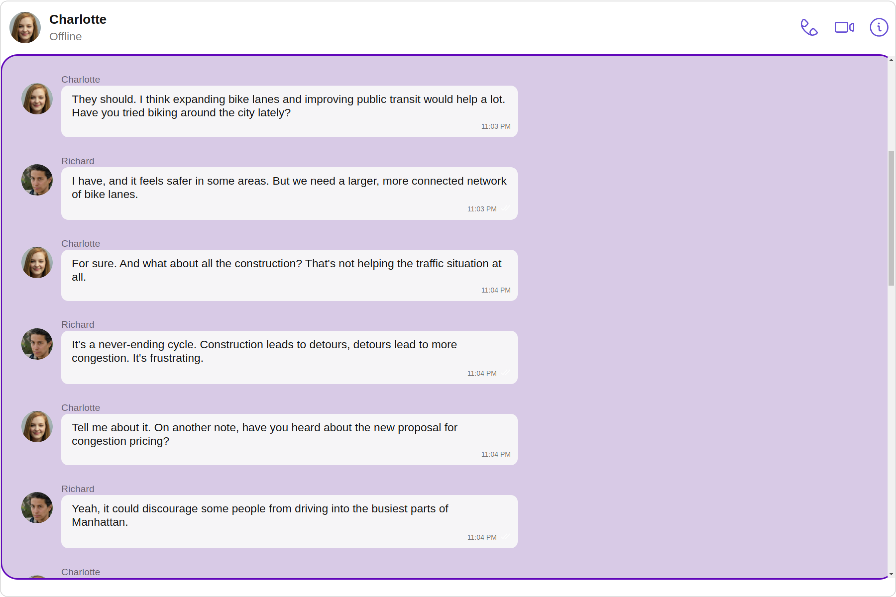

import Tabs from '@theme/Tabs';
import TabItem from '@theme/TabItem';

## Overview

The Messages is a [Composite Component](./components-overview#composite-components) that manages messages for users and groups.


The Messages component is composed of three individual components, [MessageHeader](./message-header), [MessageList](./message-list), and [MessageComposer](./message-composer). In addition, the Messages component also navigates to the [Details](./group-details) and [ThreadedMessages](./threaded-messages) components.

| Components                                          | Description                                                                                                                                                                                              |
| --------------------------------------------------- | -------------------------------------------------------------------------------------------------------------------------------------------------------------------------------------------------------- |
| [MessageHeader](./message-header)       | `CometChatMessageHeader` displays the `User` or `Group` information using CometChat SDK's `User` or `Group object.` It also shows the typing indicator when the user starts typing in `MessageComposer`. |
| [MessageList](./message-list)           | `CometChatMessageList` is one of the core UI components. It displays a list of messages and handles real-time operations.                                                                                |
| [MessageComposer](./message-composer)               | `CometChatMessageComposer` is an independent and critical component that allows users to compose and send various types of messages includes text, image, video and custom messages.                     |
| [Details](./group-details)              | `CometChatDetails` is a component that displays all the available options available for `Users` & `Groups`                                                                                               |
| [ThreadedMessages](./threaded-messages) | `CometChatThreadedMessages` is a component that displays all replies made to a particular message in a conversation.                                                                                     |

## Usage

### Integration

The following code snippet illustrates how you can directly incorporate the Messages component.

<Tabs>
<TabItem value="js" label="MessagesDemo.tsx">

```jsx
import React from "react";
import { CometChat } from "@cometchat/chat-sdk-javascript";
import { CometChatMessages } from "@cometchat/chat-uikit-react";

function MessagesDemo() {

    const [chatUser, setChatUser] = React.useState<CometChat.User>();
    React.useEffect(() => {
        CometChat.getUser("uid").then((user) => {
            setChatUser(user);
        })
    }, [])

  return (
    <>
      {chatUser &&
        <CometChatMessages
            user={chatUser}
        />
      }
    </>
  );
}

export default MessagesDemo;
```

</TabItem>
<TabItem value="ts" label="App.tsx">

```jsx
import { MessagesDemo } from "./MessagesDemo";

export default function App() {
  return (
    <div className="App">
      <div>
        <MessagesDemo />
      </div>
    </div>
  );
}
```

</TabItem>
</Tabs>

---

### Actions

[Actions](./components-overview#actions) dictate how a component functions. They are divided into two types: Predefined and User-defined. You can override either type, allowing you to tailor the behavior of the component to fit your specific needs.

The Messages component does not have its actions. However, since it's a [Composite Component](./components-overview#composite-components), you can use the actions of its components by utilizing the [Configurations](#configuration) object of each component.

**Example**

In this example, we are employing the [onThreadRepliesClick](./message-list#1-onthreadrepliesclick) action from the MessageList Component through the MessageListConfiguration object.

<Tabs>
<TabItem value="ts" label="TypeScript">

```typescript title='MessagesDemo.tsx'
import React, { useEffect, useState } from "react";
import { CometChat } from "@cometchat/chat-sdk-javascript";
import {
  CometChatMessages,
  MessageListConfiguration,
} from "@cometchat/chat-uikit-react";

function MessagesDemo() {
  const [chatUser, setChatUser] = useState<CometChat.User | null>(null);

  useEffect(() => {
    CometChat.getUser("uid").then((user) => {
      setChatUser(user);
    });
  }, []);

  const getOnThreadRepliesClick = () => {
    // your custom actions
  };

  return (
    <>
      {chatUser && (
        <CometChatMessages
          user={chatUser}
          messageListConfiguration={
            new MessageListConfiguration({
              onThreadRepliesClick: { getOnThreadRepliesClick },
            })
          }
        />
      )}
    </>
  );
}

export default MessagesDemo;
```

</TabItem>

<TabItem value="js" label="JavaScript">

```javascript title='MessagesDemo.jsx'
import React, { useEffect, useState } from "react";
import { CometChat } from "@cometchat/chat-sdk-javascript";
import {
  CometChatMessages,
  MessageListConfiguration,
} from "@cometchat/chat-uikit-react";

function MessagesDemo() {
  const [chatUser, setChatUser] = useState(null);

  useEffect(() => {
    CometChat.getUser("uid").then((user) => {
      setChatUser(user);
    });
  }, []);

  const getOnThreadRepliesClick = () => {
    // your custom actions
  };

  return (
    <>
      {chatUser && (
        <CometChatMessages
          user={chatUser}
          messageListConfiguration={
            new MessageListConfiguration({
              onThreadRepliesClick: { getOnThreadRepliesClick },
            })
          }
        />
      )}
    </>
  );
}

export default MessagesDemo;
```

</TabItem>
</Tabs>

---

On thread replies click:


Thread Screen:


> The Messages Component overrides the [onThreadRepliesClick](./message-list#1-onthreadrepliesclick) action to navigate to the [ThreadedMessages](./threaded-messages) component. If you override `onThreadRepliesClick`, it will also override the default behavior of the Messages Component.

### Filters

**Filters** allow you to customize the data displayed in a list within a Component. You can filter the list based on your specific criteria, allowing for a more customized. Filters can be applied using RequestBuilders of Chat SDK.

The Messages component does not have its filters. But as it is a [Composite Component](./components-overview#composite-components), you can use the filters of its components by using the [Configurations](#configuration) object of each component. For more details on the filters of its components, please refer to [MessageList Filters](./message-list#filters).

**Example**

In this example, we're applying the MessageList Component filter to the Messages Component using `MessageListConfiguration`.

<Tabs>
<TabItem value="ts" label="TypeScript">

```tsx title='MessagesDemo.tsx'
import React from "react";
import { CometChat } from "@cometchat/chat-sdk-javascript";
import {
  CometChatMessages,
  MessageListConfiguration,
} from "@cometchat/chat-uikit-react";

function MessagesDemo() {
  const [chatUser, setChatUser] = React.useState<CometChat.User>();
  React.useEffect(() => {
    CometChat.getUser("uid").then((user) => {
      setChatUser(user);
    });
  }, []);

  return (
    <>
      {chatUser && (
        <CometChatMessages
          user={chatUser}
          messageListConfiguration={
            new MessageListConfiguration({
              messagesRequestBuilder: new CometChat.MessagesRequestBuilder()
                .setSearchKeyword("Your Search Keyword")
                .setLimit(10),
            })
          }
        />
      )}
    </>
  );
}

export default MessagesDemo;
```

</TabItem>

<TabItem value="js" label="JavaScript">

```jsx title='MessagesDemo.jsx'
import React, { useState, useEffect } from "react";
import { CometChat } from "@cometchat/chat-sdk-javascript";
import {
  CometChatMessages,
  MessageListConfiguration,
} from "@cometchat/chat-uikit-react";

function MessagesDemo() {
  const [chatUser, setChatUser] = useState(null);

  useEffect(() => {
    CometChat.getUser("uid").then((user) => {
      setChatUser(user);
    });
  }, []);

  return (
    <>
      {chatUser && (
        <CometChatMessages
          user={chatUser}
          messageListConfiguration={
            new MessageListConfiguration({
              messagesRequestBuilder: new CometChat.MessagesRequestBuilder()
                .setSearchKeyword("Your Search Keyword")
                .setLimit(10),
            })
          }
        />
      )}
    </>
  );
}

export default MessagesDemo;
```

</TabItem>
</Tabs>

---

### Events

[Events](./components-overview#events) are emitted by a `Component`. By using event you can extend existing functionality. Being global events, they can be applied in Multiple Locations and are capable of being Added or Removed.

The `Messages` component does not produce any events directly.

## Customization

To fit your app's design requirements, you can customize the appearance of the Messages component. We provide exposed methods that allow you to modify the experience and behavior according to your specific needs.

### Style

Using Style you can customize the look and feel of the component in your app, These parameters typically control elements such as the color, size, shape, and fonts used within the component.

##### 1. Messages Style

You can customize the appearance of the Messages Component by applying the MessagesStyle to it using the following code snippet.

<Tabs>
<TabItem value="ts" label="TypeScript">

```typescript title='MessagesDemo.tsx'
import React, { useEffect, useState } from "react";
import { CometChat } from "@cometchat/chat-sdk-javascript";
import { CometChatMessages, MessagesStyle } from "@cometchat/chat-uikit-react";

function MessagesDemo() {
  const [chatUser, setChatUser] = useState<CometChat.User | null>(null);

  useEffect(() => {
    CometChat.getUser("uid").then((user) => {
      setChatUser(user);
    });
  }, []);

  const messagesStyle = new MessagesStyle({
    background: "transparent",
    border: "1px solid black",
    borderRadius: "20px",
    height: "100vh",
  });

  return (
    <>
      {chatUser && (
        <CometChatMessages user={chatUser} messagesStyle={messagesStyle} />
      )}
    </>
  );
}

export default MessagesDemo;
```

</TabItem>

<TabItem value="js" label="JavaScript">

```javascript title='MessagesDemo.jsx'
import React, { useEffect, useState } from "react";
import { CometChat } from "@cometchat/chat-sdk-javascript";
import { CometChatMessages, MessagesStyle } from "@cometchat/chat-uikit-react";

function MessagesDemo() {
  const [chatUser, setChatUser] = useState(null);

  useEffect(() => {
    CometChat.getUser("uid").then((user) => {
      setChatUser(user);
    });
  }, []);

  const messagesStyle = new MessagesStyle({
    background: "transparent",
    border: "1px solid black",
    borderRadius: "20px",
    height: "100vh",
  });

  return (
    <>
      {chatUser && (
        <CometChatMessages user={chatUser} messagesStyle={messagesStyle} />
      )}
    </>
  );
}

export default MessagesDemo;
```

</TabItem>
</Tabs>

List of properties exposed by MessagesStyle

| Property         | Description                                                                                            | Code                    |
| ---------------- | ------------------------------------------------------------------------------------------------------ | ----------------------- |
| **background**   | Sets all background style properties at once, such as color, image, origin and size, or repeat method. | `background:"sting",`   |
| **border**       | Sets the border of the component                                                                       | `border:"string"`       |
| **borderRadius** | Sets the border radius of the component                                                                | `borderRadius:"string"` |
| **height**       | Sets the height of the component                                                                       | `height:"string"`       |
| **width**        | Sets the width of the component                                                                        | `width:"string"`        |

##### 2. Component's Styles

Being a [Composite component](./components-overview#composite-components), the Messages Component allows you to customize the styles of its components using their respective Configuration objects.

For a list of all available properties, refer to each component's styling documentation: [MesssageHeader Styles](./message-header#1-messageheader-style), [MessageList Styles](./message-list#style), [MessageComposer Styles](./message-composer#style), [Details Styles](./group-details#style), [ThreadMessages Styles](./threaded-messages#style).

**Example**

In this example, we are creating `MessageListStyle` and `MessageComposerStyle` and then applying them to the Messages Component using `MessageListConfiguration` and `MessageComposerConfiguration`.

<Tabs>
<TabItem value="ts" label="TypeScript">

```tsx title='MessagesDemo.tsx'
import React from "react";
import { CometChat } from "@cometchat/chat-sdk-javascript";
import {
  CometChatMessages,
  MessageComposerConfiguration,
  MessageComposerStyle,
  MessageListConfiguration,
  MessageListStyle,
} from "@cometchat/chat-uikit-react";

const messageListStyle = new MessageListStyle({
  background: "transparent",
  border: "1px solid black",
  borderRadius: "20px",
  height: "100%",
  width: "100%",
  loadingIconTint: "red",
  nameTextColor: "pink",
  threadReplyTextColor: "green",
});
const messageComposerStyle = new MessageComposerStyle({
  AIIconTint: "#ec03fc",
  attachIcontint: "#ec03fc",
  background: "#fffcff",
  border: "2px solid #b30fff",
  borderRadius: "20px",
  inputBackground: "#e2d5e8",
  textColor: "#ff299b",
  sendIconTint: "#ff0088",
});

function MessagesDemo() {
  const [chatUser, setChatUser] = React.useState<CometChat.User>();
  React.useEffect(() => {
    CometChat.getUser("uid").then((user) => {
      setChatUser(user);
    });
  }, []);
  return (
    <>
      {chatUser && (
        <CometChatMessages
          user={chatUser!}
          messageComposerConfiguration={
            new MessageComposerConfiguration({
              messageComposerStyle: messageComposerStyle,
            })
          }
          messageListConfiguration={
            new MessageListConfiguration({
              messageListStyle: messageListStyle,
            })
          }
        />
      )}
    </>
  );
}
export default MessagesDemo;
```

</TabItem>

<TabItem value="js" label="JavaScript">

```jsx title='MessagesDemo.jsx'
import React, { useState, useEffect } from "react";
import { CometChat } from "@cometchat/chat-sdk-javascript";
import {
  CometChatMessages,
  MessageComposerConfiguration,
  MessageComposerStyle,
  MessageListConfiguration,
  MessageListStyle,
} from "@cometchat/chat-uikit-react";

const messageListStyle = new MessageListStyle({
  background: "transparent",
  border: "1px solid black",
  borderRadius: "20px",
  height: "100%",
  width: "100%",
  loadingIconTint: "red",
  nameTextColor: "pink",
  threadReplyTextColor: "green",
});

const messageComposerStyle = new MessageComposerStyle({
  AIIconTint: "#ec03fc",
  attachIcontint: "#ec03fc",
  background: "#fffcff",
  border: "2px solid #b30fff",
  borderRadius: "20px",
  inputBackground: "#e2d5e8",
  textColor: "#ff299b",
  sendIconTint: "#ff0088",
});

function MessagesDemo() {
  const [chatUser, setChatUser] = useState(null);

  useEffect(() => {
    CometChat.getUser("uid").then((user) => {
      setChatUser(user);
    });
  }, []);

  return (
    <>
      {chatUser && (
        <CometChatMessages
          user={chatUser}
          messageComposerConfiguration={
            new MessageComposerConfiguration({
              messageComposerStyle: messageComposerStyle,
            })
          }
          messageListConfiguration={
            new MessageListConfiguration({
              messageListStyle: messageListStyle,
            })
          }
        />
      )}
    </>
  );
}

export default MessagesDemo;
```

</TabItem>
</Tabs>

---

### Functionality

These are a set of small functional customizations that allow you to fine-tune the overall experience of the component. With these, you can change text, set custom icons, and toggle the visibility of UI elements.

<Tabs>
<TabItem value="ts" label="TypeScript">

```tsx
<CometChatMessages user={chatUser!} hideDetails={true} disableTyping={true} />
```

</TabItem>
<TabItem value="js" label="JavaScript">

```jsx
 <CometChatMessages
  user={chatUser!}
  hideDetails={true}
  disableTyping={true}
/>
```

</TabItem>
</Tabs>

Below is a list of customizations along with corresponding code snippets
| Property | Description | Code |
| -------------------------------------------------------------------------------------------------------- | ---------------------------------------------------------------------------------------------------------------------------------- | ----------------------------------------------------------- |
| **User** <a data-tooltip-id="my-tooltip-html-prop"> <span class="material-icons red">report</span> </a> | Used to pass user object of which header specific details will be shown | `user={chatUser!}` |
| **Group** <a data-tooltip-id="my-tooltip-html-prop"> <span class="material-icons red">report</span> </a> | Used to pass group object of which header specific details will be shown | `group={chatGroup!}` |
| **Hide MessageComposer** | Used to toggle visibility for CometChatMessageComposer, default false | `hideMessageComposer={true}` |
| **Hide MessageHeader** | Used to toggle visibility for CometChatMessageHeader, default false | `hideMessageHeader={true}` |
| **Disable Typing** | Used to toggle functionality for showing typing indicator and also enable/disable sending message delivery/read receipts | `disableTyping={true}` |
| **Disable SoundForMessages** | Used to toggle sound for messages | `disableSoundForMessages={true}` |
| **CustomSoundForIncomingMessages** | Used to set custom sound asset's path for incoming messages | `customSoundForIncomingMessages="your custom sound for incoming call"` |
| **CustomSoundForOutgoingMessages** | Used to set custom sound asset's path for outgoing messages | `customSoundForOutgoingMessages="your custom sound for outgoing call"` |
| **Hide Details** | Used to toggle visibility for details icon in CometChatMessageHeader | `hideDetails={true}` |

### Advanced

For advanced-level customization, you can set custom views to the component. This lets you tailor each aspect of the component to fit your exact needs and application aesthetics. You can create and define your views, layouts, and UI elements and then incorporate those into the component.

---

#### MessageHeaderView

You can set your custom message header view using the `messageHeaderView` property. But keep in mind, by using this you will override the default message header functionality.

```javascript
  messageHeaderView={CustomHeader()}
```

**Example**

**Default**


**Custom**


<Tabs>
<TabItem value="MessagesDemo" label="MessagesDemo.tsx">

```jsx
  <CometChatMessages
  user={chatUser!}
  messageHeaderView={CustomHeader()}
  />
```

</TabItem>
<TabItem value="CustomHeader" label="CustomHeader.tsx">

```jsx
import React, { useEffect, useState } from "react";
import {
  CometChatUIEvents,
  IActiveChatChanged,
} from "@cometchat/chat-uikit-react";

export const CustomHeader = () => {
  const [data, setData] = useState < any > null;
  useEffect(() => {
    CometChatUIEvents.ccActiveChatChanged.subscribe(
      (data: IActiveChatChanged) => {
        console.log("my data", data);
        setData(data);
      }
    );
  }, []);

  return (
    <div style={{ display: "flex", marginBottom: "10px" }}>
      <cometchat-avatar
        image={data?.user?.getAvatar() ?? data?.group?.getIcon()}
        name={data?.user ? data?.user?.getAvatar() : data?.group?.getName()}
      ></cometchat-avatar>
      <p style={{ marginLeft: "20px", marginTop: "8px" }}>
        {data?.user ? data?.user?.getName() : data?.group?.getName()}
      </p>
    </div>
  );
};
```

</TabItem>
</Tabs>

---

#### MessageListView

You can set your custom message list view using the `messageListView` property. But keep in mind, by using this you will override the default message ListView functionality.

```jsx
messageListView = { CustomListItem };
```

**Example**

**Default**


**Custom**



<Tabs>
<TabItem value="MessagesDemo" label="TypeScript">

```typescript title='MessagesDemo.tsx'
import React from "react";
import { CometChat } from "@cometchat/chat-sdk-javascript";
import {
  CometChatMessageList,
  CometChatMessages,
  MessageListAlignment,
  MessageListStyle,
} from "@cometchat/chat-uikit-react";

function MessagesDemo() {
  const [chatUser, setChatUser] = React.useState<CometChat.User>();
  React.useEffect(() => {
    CometChat.getUser("UID").then((user) => {
      setChatUser(user);
    });
  }, []);

  const messageListStyle = new MessageListStyle({
    background: "#fdf2ff",
    border: "1px solid #d608ff",
    borderRadius: "20px",
    loadingIconTint: "red",
    nameTextColor: "pink",
    threadReplyTextColor: "green",
  });
  const CustomListItem = React.useMemo(
    () => (
      <div style={{ height: "500px" }}>
        <CometChatMessageList
          user={chatUser!}
          messageListStyle={messageListStyle}
          alignment={MessageListAlignment.left}
        />
      </div>
    ),
    []
  );

  return (
    <>
      {chatUser && (
        <CometChatMessages user={chatUser!} messageListView={CustomListItem} />
      )}
    </>
  );
}

export default MessagesDemo;
```

</TabItem>

<TabItem value="MessagesDemo.jsx" label="JavaScript">

```javascript title='MessagesDemo.jsx'
import React, { useState, useEffect, useMemo } from "react";
import { CometChat } from "@cometchat/chat-sdk-javascript";
import {
  CometChatMessageList,
  CometChatMessages,
  MessageListAlignment,
  MessageListStyle,
} from "@cometchat/chat-uikit-react";

function MessagesDemo() {
  const [chatUser, setChatUser] = useState(null);

  useEffect(() => {
    CometChat.getUser("UID").then((user) => {
      setChatUser(user);
    });
  }, []);

  const messageListStyle = useMemo(
    () =>
      new MessageListStyle({
        background: "#fdf2ff",
        border: "1px solid #d608ff",
        borderRadius: "20px",
        loadingIconTint: "red",
        nameTextColor: "pink",
        threadReplyTextColor: "green",
      }),
    []
  );

  const CustomListItem = useMemo(
    () => (
      <div style={{ height: "500px" }}>
        <CometChatMessageList
          user={chatUser}
          messageListStyle={messageListStyle}
          alignment={MessageListAlignment.left}
        />
      </div>
    ),
    [chatUser, messageListStyle]
  );

  return (
    <>
      {chatUser && (
        <CometChatMessages user={chatUser} messageListView={CustomListItem} />
      )}
    </>
  );
}

export default MessagesDemo;
```

</TabItem>
</Tabs>

---

#### MessageComposerView

You can set your custom Message Composer view using the `messageComposerView` property. But keep in mind, by using this you will override the default message composer functionality.

**Example**

```
messageComposerView={CustomComposerView}
```

**Default**


**Custom**


<Tabs>
<TabItem value="TypeScript" label="TypeScript">

```typescript title='MessagesDemo.tsx'
import React from "react";
import { CometChat } from "@cometchat/chat-sdk-javascript";
import {
  CometChatMessageComposer,
  CometChatMessages,
  AuxiliaryButtonAlignment,
  MessageComposerStyle,
} from "@cometchat/chat-uikit-react";

function MessagesDemo() {
  const [chatUser, setChatUser] = React.useState<CometChat.User>();
  React.useEffect(() => {
    CometChat.getUser("UID").then((user) => {
      setChatUser(user);
    });
  }, []);

  const messageComposerStyle = new MessageComposerStyle({
    AIIconTint: "#ec03fc",
    attachIcontint: "#ec03fc",
    background: "#fffcff",
    border: "2px solid #b30fff",
    borderRadius: "20px",
    inputBackground: "#e2d5e8",
    textColor: "#ff299b",
    sendIconTint: "#ff0088",
  });
  const CustomComposerView = React.useMemo(
    () => (
      <div>
        <CometChatMessageComposer
          messageComposerStyle={messageComposerStyle}
          auxiliaryButtonAlignment={AuxiliaryButtonAlignment.left}
          text="Enter your text here"
        />
      </div>
    ),
    []
  );

  return (
    <>
      {chatUser && (
        <CometChatMessages
          user={chatUser!}
          messageComposerView={CustomComposerView}
        />
      )}
    </>
  );
}

export default MessagesDemo;
```

</TabItem>

<TabItem value="JavaScript" label="JavaScript">

```javascript title='MessagesDemo.jsx'
import React, { useState, useEffect, useMemo } from "react";
import { CometChat } from "@cometchat/chat-sdk-javascript";
import {
  CometChatMessageComposer,
  CometChatMessages,
  AuxiliaryButtonAlignment,
  MessageComposerStyle,
} from "@cometchat/chat-uikit-react";

function MessagesDemo() {
  const [chatUser, setChatUser] = useState(null);

  useEffect(() => {
    CometChat.getUser("UID").then((user) => {
      setChatUser(user);
    });
  }, []);

  const messageComposerStyle = useMemo(
    () =>
      new MessageComposerStyle({
        AIIconTint: "#ec03fc",
        attachIcontint: "#ec03fc",
        background: "#fffcff",
        border: "2px solid #b30fff",
        borderRadius: "20px",
        inputBackground: "#e2d5e8",
        textColor: "#ff299b",
        sendIconTint: "#ff0088",
      }),
    []
  );

  const CustomComposerView = useMemo(
    () => (
      <div>
        <CometChatMessageComposer
          messageComposerStyle={messageComposerStyle}
          auxiliaryButtonAlignment={AuxiliaryButtonAlignment.left}
          text="Enter your text here"
        />
      </div>
    ),
    [messageComposerStyle]
  );

  return (
    <>
      {chatUser && (
        <CometChatMessages
          user={chatUser}
          messageComposerView={CustomComposerView}
        />
      )}
    </>
  );
}

export default MessagesDemo;
```

</TabItem>
</Tabs>

---

#### AuxiliaryMenu

You can set a custom header menu option by using the `auxiliaryMenu` property.

```
auxiliaryMenu={CustomAuxilaryMenu()}
```

**Example**

**Default**


**Custom**


<Tabs>
<TabItem value="TypeScript" label="TypeScript">

```typescript title='MessagesDemo.tsx'
import React from "react";
import { CometChat } from "@cometchat/chat-sdk-javascript";
import { CometChatMessages, IconStyle } from "@cometchat/chat-uikit-react";

function MessagesDemo() {
  const [chatUser, setChatUser] = React.useState<CometChat.User>();
  React.useEffect(() => {
    CometChat.getUser("UID").then((user) => {
      setChatUser(user);
    });
  }, []);

  const CustomAuxilaryMenu = () => {
    const iconStyle = new IconStyle({
      iconTint: "#d400ff",
    });
    return <cometchat-icon URL={Icon} iconStyle={JSON.stringify(iconStyle)} />;
  };
  return (
    <>
      {chatUser && (
        <CometChatMessages
          user={chatUser!}
          auxiliaryMenu={CustomAuxilaryMenu()}
        />
      )}
    </>
  );
}

export default MessagesDemo;
```

</TabItem>
<TabItem value="JavaScript" label="JavaScript">

```javascript title='MessagesDemo.jsx'

import React from "react";
import { CometChat } from "@cometchat/chat-sdk-javascript";
import { CometChatMessages, IconStyle } from "@cometchat/chat-uikit-react";

function MessagesDemo() {

    const [chatUser, setChatUser] = React.useState<CometChat.User>()
    React.useEffect(() => {
        CometChat.getUser("UID").then((user) => {
            setChatUser(user);
        })
    }, [])

    const CustomAuxilaryMenu = () =>{
              const iconStyle = new IconStyle({
                iconTint:"#d400ff"
              })
              return (
                <cometchat-icon URL={Icon} iconStyle={JSON.stringify(iconStyle)}/>
              )
            }
  return (
    <>
      {chatUser &&
        <CometChatMessages
            user={chatUser!}
            auxiliaryMenu={CustomAuxilaryMenu()}
        />
      }
    </>
  );
}

export default MessagesDemo;

```

</TabItem>
</Tabs>

---

## Configuration

Configurations offer the ability to customize the properties of each individual component within a Composite Component.

The Messages Component is a Composite Component and it has a specific set of configuration for each of its components.

### MessageHeader

If you want to customize the properties of the [MessageHeader](./message-header) Component inside Messages Component, you need use the `MessageHeaderConfiguration` object.

<Tabs>
<TabItem value="TypeScript" label="TypeScript">

```jsx
<CometChatMessages
  messageHeaderConfiguration={
    new MessageHeaderConfiguration({
      //properties of message header
    })
  }
/>
```

</TabItem>
<TabItem value="JavaScript" label="JavaScript">

```jsx
<CometChatMessages
  messageHeaderConfiguration={
    new MessageHeaderConfiguration({
      //properties of message header
    })
  }
/>
```

</TabItem>
</Tabs>

The `MessageHeaderConfiguration` provides access to all the [Action](./message-header#actions), [Filters](./message-header#filters), [Styles](./message-header#style), [Functionality](./message-header#functionality), and [Advanced](./message-header#advanced) properties of the [MessageHeader](./message-header) component.

> Please note that the properties marked with the <a><span class="material-icons red">report</span></a> symbol are not accessible within the Configuration Object.

**Example**


In this example, we will style the Avatar and MessageHeader of the [MessageHeader](./message-header) component using `MessageHeaderConfiguration`.

<Tabs>
<TabItem value="TypeScript" label="TypeScript">

```typescript title='MessagesDemo.tsx'
import React from "react";
import {
  AvatarStyle,
  CometChatMessages,
  MessageHeaderConfiguration,
  MessageHeaderStyle,
} from "@cometchat/chat-uikit-react";

const avatarStyle = new AvatarStyle({
  backgroundColor: "#cdc2ff",
  border: "2px solid #6745ff",
  borderRadius: "10px",
  outerViewBorderColor: "#ca45ff",
  outerViewBorderRadius: "5px",
  nameTextColor: "#4554ff",
});
const messageHeaderStyle = new MessageHeaderStyle({
  background: "#f2f3ff",
  border: "2px solid #a117eb",
  borderRadius: "20px",
  subtitleTextColor: "#2d55a6",
});

function MessagesDemo() {
  return (
    <>
      {chatUser && (
        <CometChatMessages
          messageHeaderConfiguration={
            new MessageHeaderConfiguration({
              avatarStyle: avatarStyle,
              messageHeaderStyle: messageHeaderStyle,
            })
          }
        />
      )}
    </>
  );
}
export default MessagesDemo;
```

</TabItem>

<TabItem value="JavaScript" label="JavaScript">

```javascript title='MessagesDemo.jsx'
import React from "react";
import {
  AvatarStyle,
  CometChatMessages,
  MessageHeaderConfiguration,
  MessageHeaderStyle,
} from "@cometchat/chat-uikit-react";

const avatarStyle = new AvatarStyle({
  backgroundColor: "#cdc2ff",
  border: "2px solid #6745ff",
  borderRadius: "10px",
  outerViewBorderColor: "#ca45ff",
  outerViewBorderRadius: "5px",
  nameTextColor: "#4554ff",
});

const messageHeaderStyle = new MessageHeaderStyle({
  background: "#f2f3ff",
  border: "2px solid #a117eb",
  borderRadius: "20px",
  subtitleTextColor: "#2d55a6",
});

function MessagesDemo() {
  return (
    <>
      <CometChatMessages
        messageHeaderConfiguration={
          new MessageHeaderConfiguration({
            avatarStyle: avatarStyle,
            messageHeaderStyle: messageHeaderStyle,
          })
        }
      />
    </>
  );
}

export default MessagesDemo;
```

</TabItem>
</Tabs>

### MessageList

If you want to customize the properties of the [MessageList](./message-list) Component inside Messages Component, you need use the `MessageListConfiguration` object.

<Tabs>
<TabItem value="TypeScript" label="TypeScript">

```typescript
<CometChatMessages
  messageListConfiguration={
    new MessageListConfiguration({
      //properties of messages list
    })
  }
/>
```

</TabItem>
<TabItem value="JavaScript" label="JavaScript">

```javascript
<CometChatMessages
  messageListConfiguration={
    new MessageListConfiguration({
      //properties of messages list
    })
  }
/>
```

</TabItem>
</Tabs>

The `MessageListConfiguration` provides access to all the [Action](./message-list#actions), [Filters](./message-list#filters), [Styles](./message-list#style), [Functionality](./message-list#functionality), and [Advanced](./message-list#functionality) properties of the [MessageList](./message-list) component.

> Please note that the properties marked with the <a><span class="material-icons red">report</span></a> symbol are not accessible within the Configuration Object.

**Example**

In this example, we will be changing the list alignment and modifying the message list styles in the [MessageList](./message-list) component using `MessageListConfiguration`.

<Tabs>
<TabItem value="TypeScript" label="TypeScript">

```typescript title='MessagesDemo.tsx'
import React, { useMemo } from "react";
import { CometChat } from "@cometchat/chat-sdk-javascript";
import { CometChatMessages MessageListAlignment, MessageListConfiguration, MessageListStyle } from "@cometchat/chat-uikit-react";

function MessagesDemo() {
    const [chatUser, setChatUser] = React.useState<CometChat.User>()
    React.useEffect(() => {
        CometChat.getUser("uid").then((user) => {
            setChatUser(user);
        })
    }, [])

const messageListStyle = new MessageListStyle({
        background:"#d8cae6",
        border:"2px solid #6107ba",
        borderRadius:"20px",
        loadingIconTint:"red",
        nameTextColor:"pink",
        threadReplyTextColor:"green"
      })
return (
<>
  {chatUser &&
  <CometChatMessages
    user={chatUser!}
    messageListConfiguration={new MessageListConfiguration({
      messageListStyle={messageListStyle},
      alignment:MessageListAlignment.left
    })}
  />
  }
</>
);
};
export default MessagesDemo;
```

</TabItem>

<TabItem value="JavaScript" label="JavaScript">

```javascript title='MessagesDemo.jsx'
import React, { useState, useEffect, useMemo } from "react";
import { CometChat } from "@cometchat/chat-sdk-javascript";
import {
  CometChatMessages,
  MessageListAlignment,
  MessageListConfiguration,
  MessageListStyle,
} from "@cometchat/chat-uikit-react";

function MessagesDemo() {
  const [chatUser, setChatUser] = useState(null);

  useEffect(() => {
    CometChat.getUser("uid").then((user) => {
      setChatUser(user);
    });
  }, []);

  const messageListStyle = useMemo(
    () =>
      new MessageListStyle({
        background: "#d8cae6",
        border: "2px solid #6107ba",
        borderRadius: "20px",
        loadingIconTint: "red",
        nameTextColor: "pink",
        threadReplyTextColor: "green",
      }),
    []
  );

  return (
    <>
      {chatUser && (
        <CometChatMessages
          user={chatUser}
          messageListConfiguration={
            new MessageListConfiguration({
              messageListStyle: messageListStyle,
              alignment: MessageListAlignment.left,
            })
          }
        />
      )}
    </>
  );
}

export default MessagesDemo;
```

</TabItem>
</Tabs>

### MessageComposer

If you want to customize the properties of the [MessageComposer](./message-composer) Component inside Messages Component, you need use the `MessageComposerConfiguration` object.

<Tabs>
<TabItem value="TypeScript" label="TypeScript">

```TypeScript
 <CometChatMessages
    messageComposerConfiguration={new MessageComposerConfiguration({
      // properties of message composer
    })}
 />
```

</TabItem>
<TabItem value="JavaScript" label="JavaScript">

```JavaScript
 <CometChatMessages
    messageComposerConfiguration={new MessageComposerConfiguration({
      // properties of message composer
    })}
 />
```

</TabItem>
</Tabs>

The `MessageComposerConfiguration` provides access to all the [Action](./message-composer#actions), [Filters](./message-composer#filters), [Styles](./message-composer#style), [Functionality](./message-composer#functionality), and [Advanced](./message-composer#advanced) properties of the [MessageComposer](./message-composer) component.

> Please note that the properties marked with the <a><span class="material-icons red">report</span></a> symbol are not accessible within the Configuration Object.

**Example**


In this example, we'll be adding styling to the message composer and custom text to the [MessageComposer](./message-composer) component using `MessageComposerConfiguration`.

<Tabs>
<TabItem value="TypeScript" label="TypeScript">

```TypeScript title='MessagesDemo.tsx'

import React from "react";
import {CometChatMessages,MessageComposerConfiguration, MessageComposerStyle} from "@cometchat/chat-uikit-react";

const messageComposerStyle = new MessageComposerStyle({
  AIIconTint:"#ec03fc",
  attachIcontint:"#ec03fc",
  background:"#fffcff",
  border:"2px solid #b30fff",
  borderRadius:"20px",
  inputBackground:"#e2d5e8",
  textColor:"#ff299b",
  sendIconTint:"#ff0088",
})

function MessagesDemo() {
  return (
    messageComposerConfiguration={new MessageComposerConfiguration({
      text:"Type Your Custom Text Message",
      messageComposerStyle: messageComposerStyle,
    })}
  );
}
export default MessagesDemo;

```

</TabItem>
<TabItem value="JavaScript" label="JavaScript">

```JavaScript title='MessagesDemo.jsx'

import React from "react";
import {CometChatMessages,MessageComposerConfiguration, MessageComposerStyle} from "@cometchat/chat-uikit-react";

const messageComposerStyle = new MessageComposerStyle({
  AIIconTint:"#ec03fc",
  attachIcontint:"#ec03fc",
  background:"#fffcff",
  border:"2px solid #b30fff",
  borderRadius:"20px",
  inputBackground:"#e2d5e8",
  textColor:"#ff299b",
  sendIconTint:"#ff0088",
})

function MessagesDemo() {
  return (
    messageComposerConfiguration={new MessageComposerConfiguration({
      text:"Type Your Custom Text Message",
      messageComposerStyle: messageComposerStyle,
    })}
  );
}
export default MessagesDemo;

```

</TabItem>
</Tabs>

### ThreadedMessages

If you want to customize the properties of the [ThreadedMessages](./threaded-messages) Component inside Messages Component, you need use the `ThreadedMessagesConfiguration` object.

<Tabs>
<TabItem value="TypeScript" label="TypeScript">

```TypeScript
 <CometChatMessages
    threadedMessagesConfiguration={new ThreadedMessagesConfiguration({
      //properties of the threaded messages
    })}
 />
```

</TabItem>
<TabItem value="JavaScript" label="JavaScript">

```JavaScript
 <CometChatMessages
    threadedMessagesConfiguration={new ThreadedMessagesConfiguration({
      //properties of the threaded messages
    })}
 />
```

</TabItem>
</Tabs>

The `ThreadedMessagesConfiguration` provides access to all the [Action](./threaded-messages#actions), [Filters](./threaded-messages#filters), [Styles](./threaded-messages#style), [Functionality](./threaded-messages#functionality), and [Advanced](./threaded-messages#advanced) properties of the [ThreadedMessages](./threaded-messages) component.

> Please note that the properties marked with the <a><span class="material-icons red">report</span></a> symbol are not accessible within the Configuration Object.

**Example**


In this example, we are adding a custom close icon to the Threaded Message component and also adding custom properties to the [MessageList](#messagelist) using `MessageListConfiguration`. We then apply these changes to the [ThreadedMessages](./message-composer) component using `ThreadedMessagesConfiguration`.

<Tabs>
<TabItem value="TypeScript" label="TypeScript">

```TypeScript title='MessagesDemo.tsx'

import React from "react";
import {CometChatMessages, MessageListAlignment, MessageListConfiguration, MessageListStyle, ThreadedMessagesConfiguration } from "@cometchat/chat-uikit-react";

function MessagesDemo() {
    const messageListStyle = new MessageListStyle({
        background:"#fdf2ff",
        border:"1px solid #d608ff",
        borderRadius:"20px",
        loadingIconTint:"red",
        nameTextColor:"pink",
        threadReplyTextColor:"green"
      })
return (
    <>
      {chatUser &&
        <CometChatMessages
            threadedMessagesConfiguration={new ThreadedMessagesConfiguration({
                //properties of the threaded messages
               closeIconURL:Icon,
               messageListConfiguration:new MessageListConfiguration({
                messageListStyle: messageListStyle,
                alignment:MessageListAlignment.left
               })
            })}
        />
      }
    </>
  );
}
export default MessagesDemo;
```

</TabItem>

<TabItem value="JavaScript" label="JavaScript">

```JavaScript title='MessagesDemo.jsx'
import React, { useState, useEffect } from "react";
import { CometChatMessages, MessageListAlignment, MessageListConfiguration, MessageListStyle, ThreadedMessagesConfiguration } from "@cometchat/chat-uikit-react";

function MessagesDemo() {
  const [chatUser, setChatUser] = useState(null);

  useEffect(() => {
    // Fetch or set chat user here
    // For example:
    // setChatUser(someUser);
  }, []);

  const messageListStyle = new MessageListStyle({
    background: "#fdf2ff",
    border: "1px solid #d608ff",
    borderRadius: "20px",
    loadingIconTint: "red",
    nameTextColor: "pink",
    threadReplyTextColor: "green"
  });

  // Assuming Icon is defined somewhere
  const Icon = "...";

  return (
    <>
      {chatUser && (
        <CometChatMessages
          threadedMessagesConfiguration={new ThreadedMessagesConfiguration({
            closeIconURL: Icon,
            messageListConfiguration: new MessageListConfiguration({
              messageListStyle: messageListStyle,
              alignment: MessageListAlignment.left
            })
          })}
        />
      )}
    </>
  );
}

export default MessagesDemo;

```

</TabItem>
</Tabs>

import { Tooltip } from 'react-tooltip'
import 'react-tooltip/dist/react-tooltip.css'

<Tooltip
  id="my-tooltip-html-prop"
  html="Not available in MessageConfiguration"
/>
