import Tabs from '@theme/Tabs';
import TabItem from '@theme/TabItem';

## Overview

`MessageList` is a [Composite Component](./components-overview#composite-components) that displays a list of messages and effectively manages real-time operations. It includes various types of messages such as Text Messages, Media Messages, Stickers, and more.

`MessageList` is primarily a list of the base component [MessageBubble](./message-bubble). The MessageBubble Component is utilized to create different types of chat bubbles depending on the message type.

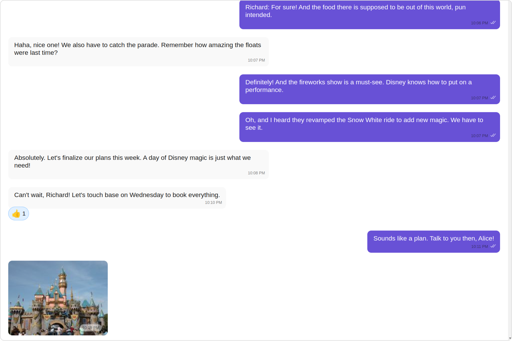

---

## Usage

### Integration

The following code snippet illustrates how you can directly incorporate the MessageList component into your Application.

<Tabs>
<TabItem value="MessageListDemo" label="MessageListDemo.tsx">

```jsx
import React from "react";
import { CometChat } from "@cometchat/chat-sdk-javascript";
import { CometChatMessageList } from "@cometchat/chat-uikit-react";

  export function MessageListDemo() {
    const [chatUser, setChatUser] = React.useState<CometChat.User>()
    React.useEffect(() => {
        CometChat.getUser("uid").then((user) => {
            setChatUser(user);
        })
    }, [])

    return chatUser ? (
      <div>
        <CometChatMessageList
          user={chatUser}
        />
      </div>
    ) : null;
  }
```

</TabItem>
<TabItem value="ts" label="App.tsx">

```jsx
import { MessageListDemo } from "./MessageListDemo";

export default function App() {
  return (
    <div className="App">
      <div>
        <MessageListDemo />
      </div>
    </div>
  );
}
```

</TabItem>
</Tabs>

:::warning

To fetch messages for a specific entity, you need to supplement it with `User` or `Group` Object.

:::

---

### Actions

[Actions](./components-overview#actions) dictate how a component functions. They are divided into two types: Predefined and User-defined. You can override either type, allowing you to tailor the behavior of the component to fit your specific needs.

##### 1. onThreadRepliesClick

`onThreadRepliesClick` is triggered when you click on the threaded message bubble.
The `onThreadRepliesClick` action doesn't have a predefined behavior. You can override this action using the following code snippet.

<Tabs>
<TabItem value="TypeScript" label="TypeScript">

```TypeScript title='MessageListDemo.tsx'
import React from "react";
import { CometChat } from "@cometchat/chat-sdk-javascript";
import { CometChatMessageList } from "@cometchat/chat-uikit-react";

  export function MessageListDemo() {
    const [chatUser, setChatUser] = React.useState<CometChat.User>()
    React.useEffect(() => {
        CometChat.getUser("uid").then((user) => {
            setChatUser(user);
        })
    }, [])

    const getOnThreadRepliesClick = () => {
      //your custom actions
     }

    return chatUser ? (
      <div>
        <CometChatMessageList
          user={chatUser}
          onThreadRepliesClick={getOnThreadRepliesClick}
        />
      </div>
    ) : null;
  }
```

</TabItem>

<TabItem value="JavaScript" label="JavaScript">

```JavaScript title='MessageListDemo.jsx'

import React, { useState, useEffect } from "react";
import { CometChat } from "@cometchat/chat-sdk-javascript";
import { CometChatMessageList } from "@cometchat/chat-uikit-react";

export function MessageListDemo() {
  const [chatUser, setChatUser] = useState(null);

  useEffect(() => {
    CometChat.getUser("uid").then((user) => {
      setChatUser(user);
    });
  }, []);

  const getOnThreadRepliesClick = () => {
    //your custom actions
  };

  return chatUser ? (
    <div>
      <CometChatMessageList
        user={chatUser}
        onThreadRepliesClick={getOnThreadRepliesClick}
      />
    </div>
  ) : null;
}

```

</TabItem>
</Tabs>

##### 2. onError

This action doesn't change the behavior of the component but rather listens for any errors that occur in the MessageList component.

<Tabs>
<TabItem value="TypeScript" label="TypeScript">

```TypeScript title='MessageListDemo.tsx'

import React from "react";
import { CometChat } from "@cometchat/chat-sdk-javascript";
import { CometChatMessageList } from "@cometchat/chat-uikit-react";

  export function MessageListDemo() {
    const [chatUser, setChatUser] = React.useState<CometChat.User>()
    React.useEffect(() => {
        CometChat.getUser("uid").then((user) => {
            setChatUser(user);
        })
    }, [])

   function handleError(error: CometChat.CometChatException) {
      throw new Error("your custom error action");
    }

    return chatUser ? (
      <div>
        <CometChatMessageList
          user={chatUser}
          onError={handleError}
        />
      </div>
    ) : null;
  }
```

</TabItem>

<TabItem value="JavaScript" label="JavaScript">

```JavaScript title='MessageListDemo.jsx'

import React, { useState, useEffect } from "react";
import { CometChat } from "@cometchat/chat-sdk-javascript";
import { CometChatMessageList } from "@cometchat/chat-uikit-react";

export function MessageListDemo() {
  const [chatUser, setChatUser] = useState(null);

  useEffect(() => {
    CometChat.getUser("uid").then((user) => {
      setChatUser(user);
    });
  }, []);

  const handleError = (error) => {
    throw new Error("your custom error action");
  };

  return chatUser ? (
    <div>
      <CometChatMessageList
        user={chatUser}
        onError={handleError}
      />
    </div>
  ) : null;
}

```

</TabItem>
</Tabs>

### Filters

You can adjust the `MessagesRequestBuilder` in the MessageList Component to customize your message list. Numerous options are available to alter the builder to meet your specific needs. For additional details on `MessagesRequestBuilder`, please visit [MessagesRequestBuilder](/sdk/javascript/additional-message-filtering).

In the example below, we are applying a filter to the messages based on a search substring and for a specific user. This means that only messages that contain the search term and are associated with the specified user will be displayed

<Tabs>
<TabItem value="TypeScript" label="TypeScript">

```TypeScript title='MessageListDemo.tsx'

import React from "react";
import { CometChat } from "@cometchat/chat-sdk-javascript";
import { CometChatMessageList } from "@cometchat/chat-uikit-react";

  export function MessageListDemo() {
    const [chatUser, setChatUser] = React.useState<CometChat.User>()
    React.useEffect(() => {
        CometChat.getUser("uid").then((user) => {
            setChatUser(user);
        })
    }, [])

    return chatUser ? (
      <div>
        <CometChatMessageList
          user={chatUser}
          messagesRequestBuilder={new CometChat.MessagesRequestBuilder().setLimit(5)}
        />
      </div>
    ) : null;
  }

```

</TabItem>
<TabItem value="JavaScript" label="JavaScript">

```JavaScript title='MessageListDemo.jsx'

import React, { useState, useEffect } from "react";
import { CometChat } from "@cometchat/chat-sdk-javascript";
import { CometChatMessageList } from "@cometchat/chat-uikit-react";

export function MessageListDemo() {
  const [chatUser, setChatUser] = useState(null);

  useEffect(() => {
    CometChat.getUser("uid").then((user) => {
      setChatUser(user);
    });
  }, []);

  return chatUser ? (
    <div>
      <CometChatMessageList
        user={chatUser}
        messagesRequestBuilder={new CometChat.MessagesRequestBuilder().setLimit(5)}
      />
    </div>
  ) : null;
}


```

</TabItem>
</Tabs>

:::info

The following parameters in messageRequestBuilder will always be altered inside the message list

1. UID
2. GUID
   :::

### Events

[Events](./components-overview#events) are emitted by a `Component`. By using event you can extend existing functionality. Being global events, they can be applied in Multiple Locations and are capable of being Added or Removed.

The list of events emitted by the Message List component is as follows.

| Event                   | Description                                                                                                                                     |
| ----------------------- | ----------------------------------------------------------------------------------------------------------------------------------------------- |
| **ccOpenChat**          | this event alerts the listeners if the logged-in user has opened a user or a group chat                                                         |
| **ccMessageEdited**     | Triggers whenever a loggedIn user edits any message from the list of messages .it will have three states such as: inProgress, success and error |
| **ccMessageDeleted**    | Triggers whenever a loggedIn user deletes any message from the list of messages                                                                 |
| **ccActiveChatChanged** | This event is triggered when the user navigates to a particular chat window.                                                                    |
| **ccMessageRead**       | Triggers whenever a loggedIn user reads any message.                                                                                            |
| **ccLiveReaction**      | Triggers whenever a loggedIn clicks on live reaction                                                                                            |

Adding `CometChatMessageEvents` Listener's

<Tabs>
<TabItem value="TypeScript" label="TypeScript">

```TypeScript
import {CometChatMessageEvents} from "@cometchat/chat-uikit-react";

const ccOpenChat = CometChatMessageEvents.ccOpenChat.subscribe(
 () => {
        // Your Code
  }
);

const ccMessageEdited = CometChatMessageEvents.ccMessageEdited.subscribe(
  () => {
        // Your Code
  }
);

const ccMessageDeleted = CometChatMessageEvents.ccMessageDeleted.subscribe(
  () => {
        // Your Code
  }
);

const ccActiveChatChanged = CometChatMessageEvents.ccActiveChatChanged.subscribe(
  () => {
        // Your Code
  }
);

const ccMessageRead = CometChatMessageEvents.ccMessageRead.subscribe(
  () => {
        // Your Code
  }
);

const ccLiveReaction = CometChatMessageEvents.ccLiveReaction.subscribe(
  () => {
        // Your Code
  }
);
```

</TabItem>
<TabItem value="js" label="JavaScript">

```javascript
import { CometChatMessageEvents } from "@cometchat/chat-uikit-react";

const ccOpenChat = CometChatMessageEvents.ccOpenChat.subscribe(() => {
  // Your Code
});

const ccMessageEdited = CometChatMessageEvents.ccMessageEdited.subscribe(() => {
  // Your Code
});

const ccMessageDeleted = CometChatMessageEvents.ccMessageDeleted.subscribe(
  () => {
    // Your Code
  }
);

const ccActiveChatChanged =
  CometChatMessageEvents.ccActiveChatChanged.subscribe(() => {
    // Your Code
  });

const ccMessageRead = CometChatMessageEvents.ccMessageRead.subscribe(() => {
  // Your Code
});

const ccLiveReaction = CometChatMessageEvents.ccLiveReaction.subscribe(() => {
  // Your Code
});
```

</TabItem>
</Tabs>

---

Removing `CometChatMessageEvents` Listener's

<Tabs>
<TabItem value="TypeScript" label="TypeScript">

```TypeScript
ccMessageEdited?.unsubscribe();
ccActiveChatChanged?.unsubscribe();
```

</TabItem>
<TabItem value="js" label="JavaScript">

```JavaScript
ccMessageEdited?.unsubscribe();
ccActiveChatChanged?.unsubscribe();
```

</TabItem>
</Tabs>

---

## Customization

To fit your app's design requirements, you can customize the appearance of the Message List component. We provide exposed properties that allow you to modify the experience and behavior according to your specific needs.

### Style

Using Style you can customize the look and feel of the component in your app, These parameters typically control elements such as the color, size, shape, and fonts used within the component.

##### 1. MessageList Style

You can set the MessageListStyle to the MessageList Component Component to customize the styling.

<Tabs>
<TabItem value="TypeScript" label="TypeScript">

```TypeScript title='MessageListDemo.tsx'

import React from "react";
import { CometChat } from "@cometchat/chat-sdk-javascript";
import { CometChatMessageList, MessageListStyle } from "@cometchat/chat-uikit-react";

  export function MessageListDemo() {
    const [chatUser, setChatUser] = React.useState<CometChat.User>()
    React.useEffect(() => {
        CometChat.getUser("uid").then((user) => {
            setChatUser(user);
        })
    }, [])

    const messageListStyle = new MessageListStyle({
      background:"transparent",
      border:"1px solid black",
      borderRadius:"20px",
      height:"100%",
      width:"100%",
      loadingIconTint:"red",
      nameTextColor:"pink",
      threadReplyTextColor:"green"
    });

    return chatUser ? (
      <div>
        <CometChatMessageList
          user={chatUser}
          messageListStyle={messageListStyle}
        />
      </div>
    ) : null;
  }

```

</TabItem>
<TabItem value="JavaScript" label="JavaScript">

```JavaScript title='MessageListDemo.jsx'

import React, { useState, useEffect } from "react";
import { CometChat } from "@cometchat/chat-sdk-javascript";
import { CometChatMessageList, MessageListStyle } from "@cometchat/chat-uikit-react";

export function MessageListDemo() {
  const [chatUser, setChatUser] = useState(null);

  useEffect(() => {
    CometChat.getUser("uid").then((user) => {
      setChatUser(user);
    });
  }, []);

  const messageListStyle = new MessageListStyle({
    background: "transparent",
    border: "1px solid black",
    borderRadius: "20px",
    height: "100%",
    width: "100%",
    loadingIconTint: "red",
    nameTextColor: "pink",
    threadReplyTextColor: "green"
  });

  return chatUser ? (
    <div>
      <CometChatMessageList
        user={chatUser}
        messageListStyle={messageListStyle}
      />
    </div>
  ) : null;
}


```

</TabItem>
</Tabs>

List of properties exposed by MessageListStyle

| Property                        | Description                                                      | Code                                    |
| ------------------------------- | ---------------------------------------------------------------- | --------------------------------------- |
| **border**                      | Used to set border                                               | `border?: string,`                      |
| **borderRadius**                | Used to set border radius                                        | `borderRadius?: string;`                |
| **background**                  | Used to set background colour                                    | `background?: string;`                  |
| **height**                      | Used to set height                                               | `height?: string;`                      |
| **width**                       | Used to set width                                                | `width?: string;`                       |
| **loadingIconTint**             | used to set loading icon tint                                    | `loadingIconTint?: string;`             |
| **emptyStateTextFont**          | used to set empty state text font                                | `emptyStateTextFont?: string;`          |
| **errorStateTextFont**          | used to set error state text font                                | `errorStateTextFont?: string;`          |
| **emptyStateTextColor**         | used to set empty state text color                               | `emptyStateTextColor?: string;`         |
| **errorStateTextColor**         | used to set error state text color                               | `errorStateTextColor?: string;`         |
| **nameTextColor**               | used to set sender/receiver name text color on a message bubble. | `nameTextColor?: string;`               |
| **nameTextFont**                | used to set sender/receiver name text font on a message bubble   | `nameTextFont?: string;`                |
| **TimestampTextColor**          | used to set time stamp text color                                | `TimestampTextColor?: string;`          |
| **TimestampTextFont**           | used to set time stamp text font                                 | `TimestampTextFont?: string;`           |
| **threadReplyTextColor**        | used to set thread reply text color                              | `threadReplyTextColor?: string;`        |
| **threadReplyTextFont**         | used to set thread reply text font                               | `threadReplyTextFont?: string;`         |
| **threadReplyIconTint**         | used to set thread reply icon tint                               | `threadReplyIconTint?: string;`         |
| **threadReplyUnreadTextColor**  | used to set thread reply unread text color                       | `threadReplyUnreadTextColor?: string;`  |
| **threadReplyUnreadTextFont**   | used to set thread reply unread text font                        | `threadReplyUnreadTextFont?: string;`   |
| **threadReplyUnreadBackground** | used to set thread reply unread background                       | `threadReplyUnreadBackground?: string;` |

##### 2. Avatar Style

To apply customized styles to the `Avatar` component in the `Message List` Component, you can use the following code snippet. For further insights on `Avatar` Styles [refer](./avatar#avatar-style)

<Tabs>
<TabItem value="TypeScript" label="TypeScript">

```TypeScript title='MessageListDemo.tsx'
import React from "react";
import { CometChat } from "@cometchat/chat-sdk-javascript";
import { CometChatMessageList, AvatarStyle } from "@cometchat/chat-uikit-react";

  export function MessageListDemo() {
    const [chatUser, setChatUser] = React.useState<CometChat.User>()
    React.useEffect(() => {
        CometChat.getUser("uid").then((user) => {
            setChatUser(user);
        })
    }, [])

  const avatarStyle = new AvatarStyle({
    backgroundColor:"#cdc2ff",
    border:"2px solid #6745ff",
    borderRadius:"10px",
    outerViewBorderColor:"#ca45ff",
    outerViewBorderRadius:"5px",
    nameTextColor:"#4554ff"
  })

    return chatUser ? (
      <div>
        <CometChatMessageList
          user={chatUser}
          avatarStyle={avatarStyle}
        />
      </div>
    ) : null;
  }
```

</TabItem>

<TabItem value="JavaScript" label="JavaScript">

```JavaScript title='MessageListDemo.jsx'

import React, { useState, useEffect } from "react";
import { CometChat } from "@cometchat/chat-sdk-javascript";
import { CometChatMessageList, AvatarStyle } from "@cometchat/chat-uikit-react";

export function MessageListDemo() {
  const [chatUser, setChatUser] = useState(null);

  useEffect(() => {
    CometChat.getUser("uid").then((user) => {
      setChatUser(user);
    });
  }, []);

  const avatarStyle = new AvatarStyle({
    backgroundColor: "#cdc2ff",
    border: "2px solid #6745ff",
    borderRadius: "10px",
    outerViewBorderColor: "#ca45ff",
    outerViewBorderRadius: "5px",
    nameTextColor: "#4554ff"
  });

  return chatUser ? (
    <div>
      <CometChatMessageList
        user={chatUser}
        avatarStyle={avatarStyle}
      />
    </div>
  ) : null;
}

```

</TabItem>
</Tabs>

##### 3. DateSeparator Style

To apply customized styles to the `DateSeparator` in the `Message list` Component, you can use the following code snippet.

<Tabs>
<TabItem value="TypeScript" label="TypeScript">

```TypeScript title='MessageListDemo.tsx'
import React from "react";
import { CometChat } from "@cometchat/chat-sdk-javascript";
import { CometChatMessageList, DateStyle } from "@cometchat/chat-uikit-react";

  export function MessageListDemo() {
    const [chatUser, setChatUser] = React.useState<CometChat.User>()
    React.useEffect(() => {
        CometChat.getUser("uid").then((user) => {
            setChatUser(user);
        })
    }, [])

  const dateSeparatorStyle = new DateStyle({
    backgroundColor: "#cdc2ff",
    border: "2px solid #6745ff",
    borderRadius: "15px",
  });

    return chatUser ? (
      <div>
        <CometChatMessageList
          user={chatUser}
           dateSeparatorStyle={dateSeparatorStyle}
        />
      </div>
    ) : null;
  }
```

</TabItem>

<TabItem value="JavaScript" label="JavaScript">

```JavaScript title='MessageListDemo.jsx'

import React, { useState, useEffect } from "react";
import { CometChat } from "@cometchat/chat-sdk-javascript";
import { CometChatMessageList, DateStyle } from "@cometchat/chat-uikit-react";

export function MessageListDemo() {
  const [chatUser, setChatUser] = useState(null);

  useEffect(() => {
    CometChat.getUser("uid").then((user) => {
      setChatUser(user);
    });
  }, []);

  const dateSeparatorStyle = new DateStyle({
    backgroundColor: "#cdc2ff",
    border: "2px solid #6745ff",
    borderRadius: "15px",
  });

  return chatUser ? (
    <div>
      <CometChatMessageList
        user={chatUser}
        dateSeparatorStyle={dateSeparatorStyle}
      />
    </div>
  ) : null;
}

```

</TabItem>
</Tabs>

##### 4. EmojiKeyboard Style

To apply customized styles to the `EmojiKeyBoard` in the `Message list` Component, you can use the following code snippet.

<Tabs>
<TabItem value="TypeScript" label="TypeScript">

```TypeScript title='MessageListDemo.tsx'
import React from "react";
import { CometChat } from "@cometchat/chat-sdk-javascript";
import { CometChatMessageList, EmojiKeyboardStyle } from "@cometchat/chat-uikit-react";

  export function MessageListDemo() {
    const [chatUser, setChatUser] = React.useState<CometChat.User>()
    React.useEffect(() => {
        CometChat.getUser("uid").then((user) => {
            setChatUser(user);
        })
    }, [])

  const emojiKeyboardStyle = new EmojiKeyboardStyle({
    background:'red',
    border:'2px solid green',
    borderRadius:'15px',
    activeIconTint:'yellow',
    textColor:'#8830f2'
  });

    return chatUser ? (
      <div>
        <CometChatMessageList
          user={chatUser}
          emojiKeyboardStyle={emojiKeyboardStyle}
        />
      </div>
    ) : null;
  }
```

</TabItem>

<TabItem value="JavaScript" label="JavaScript">

```JavaScript title='MessageListDemo.jsx'

import React, { useState, useEffect } from "react";
import { CometChat } from "@cometchat/chat-sdk-javascript";
import { CometChatMessageList, EmojiKeyboardStyle } from "@cometchat/chat-uikit-react";

export function MessageListDemo() {
  const [chatUser, setChatUser] = useState(null);

  useEffect(() => {
    CometChat.getUser("uid").then((user) => {
      setChatUser(user);
    });
  }, []);

  const emojiKeyboardStyle = new EmojiKeyboardStyle({
    background:'red',
    border:'2px solid green',
    borderRadius:'15px',
    activeIconTint:'yellow',
    textColor:'#8830f2'
  });

  return chatUser ? (
    <div>
      <CometChatMessageList
        user={chatUser}
        emojiKeyboardStyle={emojiKeyboardStyle}
      />
    </div>
  ) : null;
}

```

</TabItem>
</Tabs>

---

### Functionality

These are a set of small functional customizations that allow you to fine-tune the overall experience of the component. With these, you can change text, set custom icons, and toggle the visibility of UI elements.

<Tabs>
<TabItem value="TypeScript" label="TypeScript">

```TypeScript title='MessageListDemo.tsx'
import React from "react";
import { CometChat } from "@cometchat/chat-sdk-javascript";
import { CometChatMessageList } from "@cometchat/chat-uikit-react";

  export function MessageListDemo() {
    const [chatUser, setChatUser] = React.useState<CometChat.User>()
    React.useEffect(() => {
        CometChat.getUser("uid").then((user) => {
            setChatUser(user);
        })
    }, [])

    return chatUser ? (
      <div>
        <CometChatMessageList
          user={chatUser}
          hideError={true}
          hideReceipt={true}
        />
      </div>
    ) : null;
  }
```

</TabItem>
<TabItem value="JavaScript" label="JavaScript">

```JavaScript title='MessageListDemo.jsx'

import React, { useState, useEffect } from "react";
import { CometChat } from "@cometchat/chat-sdk-javascript";
import { CometChatMessageList } from "@cometchat/chat-uikit-react";

export function MessageListDemo() {
  const [chatUser, setChatUser] = useState(null);

  useEffect(() => {
    CometChat.getUser("uid").then((user) => {
      setChatUser(user);
    });
  }, []);

  return chatUser ? (
    <div>
      <CometChatMessageList
        user={chatUser}
        hideError={true}
        hideReceipt={true}
      />
    </div>
  ) : null;
}

```

</TabItem>
</Tabs>

---

Below is a list of customizations along with corresponding code snippets

| Property                                                                                                                   | Description                                                                                                                                                                                                                                     | Code                                                      |
| -------------------------------------------------------------------------------------------------------------------------- | ----------------------------------------------------------------------------------------------------------------------------------------------------------------------------------------------------------------------------------------------- | --------------------------------------------------------- |
| **user** <a data-tooltip-id="my-tooltip-html-prop"> <span class="material-icons red">report</span> </a>                    | Used to pass user object of which header specific details will be shown                                                                                                                                                                         | `user={chatUser}`                                         |
| **group** <a data-tooltip-id="my-tooltip-html-prop"> <span class="material-icons red">report</span> </a>                   | Used to pass group object of which header specific details will be shown                                                                                                                                                                        | `group={chatGroup}`                                       |
| **alignment**                                                                                                              | used to set the alignmet of messages in CometChatMessageList. It can be either **left** or **standard**                                                                                                                                         | `{MessageListAlignment.left}`                             |
| **emptyStateText**                                                                                                         | used to set text which will be visible when no messages are available                                                                                                                                                                           | `emptyStateText="Your Custom Empty State text"`           |
| **errorStateText**                                                                                                         | used to set text which will be visible when error in messages retrieval                                                                                                                                                                         | `errorStateText="Your Custom Error State text"`           |
| **hideError**                                                                                                              | used to toggle visibility of error in MessageList                                                                                                                                                                                               | `hideError={true}`                                        |
| **disableSoundForMessages** <a data-tooltip-id="my-tooltip-html-prop"> <span class="material-icons red">report</span> </a> | used to enable/disable sound for incoming/outgoing messages , default false                                                                                                                                                                     | `disableSoundForMessages={true}`                          |
| **customSoundForMessages** <a data-tooltip-id="my-tooltip-html-prop"> <span class="material-icons red">report</span> </a>  | used to set custom sound for outgoing message                                                                                                                                                                                                   | `customSoundForMessages="your custom sound for messages"` |
| **readIcon**                                                                                                               | used to set custom read icon visible at read receipt                                                                                                                                                                                            | `readIcon="your custom read icon"`                        |
| **deliveredIcon**                                                                                                          | used to set custom delivered icon visible at read receipt                                                                                                                                                                                       | `deliveredIcon="your custom delivered icon"`              |
| **sentIcon**                                                                                                               | used to set custom sent icon visible at read receipt                                                                                                                                                                                            | `sentIcon="your custom sent icon "`                       |
| **waitIcon**                                                                                                               | used to set custom wait icon visible at read receipt                                                                                                                                                                                            | `waitIcon="your custom wait icon"`                        |
| **showAvatar**                                                                                                             | used to toggle visibility for avatar                                                                                                                                                                                                            | `showAvatar={true}`                                       |
| **hideDateSeparator**                                                                                                      | used to toggle visibility of date separator                                                                                                                                                                                                     | `hideDateSeparator={true}`                                |
| **timestampAlignment**                                                                                                     | used to set receipt's time stamp alignment .It can be either **top** or **bottom**                                                                                                                                                              | `timestampAlignment={TimestampAlignment.top}`             |
| **newMessageIndicatorText** <a data-tooltip-id="my-tooltip-html-prop"> <span class="material-icons red">report</span> </a> | used to set new message indicator text                                                                                                                                                                                                          | `newMessageIndicatorText="Custom Indicator text"`         |
| **scrollToBottomOnNewMessage**                                                                                             | should scroll to bottom on new message? , by default false                                                                                                                                                                                      | `scrollToBottomOnNewMessages={true}`                      |
| **hideReceipt**                                                                                                            | Used to control the visibility of read receipts without affecting the functionality of marking messages as read and delivered.                                                                                                                  | `hideReceipt={true}`                                      |
| **Disable Mentions**                                                                                                       | Sets whether mentions in text should be disabled. Processes the text formatters If there are text formatters available and the disableMentions flag is set to true, it removes any formatters that are instances of CometChatMentionsFormatter. | `disableMentions={true}`                                  |
| **Disable Reactions**                                                                                                      | Sets A boolean value indicating whether to disable reactions.Pass `true` to disable reactions, `false` to enable them.                                                                                                                          | `disableReactions={true}`                                 |

---

### Advance

For advanced-level customization, you can set custom views to the component. This lets you tailor each aspect of the component to fit your exact needs and application aesthetics. You can create and define your views, layouts, and UI elements and then incorporate those into the component.

#### Templates

[CometChatMessageTemplate](./message-template) is a pre-defined structure for creating message views that can be used as a starting point or blueprint for creating message views often known as message bubbles. For more information, you can refer to [CometChatMessageTemplate](./message-template).

You can set message Templates to MessageList by using the following code snippet

<Tabs>
<TabItem value="TypeScript" label="TypeScript">

```TypeScript title='MessageListDemo.tsx'
import React from "react";
import { CometChat } from "@cometchat/chat-sdk-javascript";
import { CometChatMessageList, CometChatTheme, ChatConfigurator, CometChatActionsIcon } from "@cometchat/chat-uikit-react";

export function MessageListDemo() {
  const [chatUser, setChatUser] = React.useState<CometChat.User>()
  React.useEffect(() => {
    CometChat.getUser("uid").then((user) => {
      setChatUser(user);
    })
  }, [])

  const getCustomOptions = (
    loggedInUser: CometChat.User,
    message: CometChat.BaseMessage,
    theme: CometChatTheme,
    group?: CometChat.Group
  ) => {
    const defaultOptions: any =
      ChatConfigurator.getDataSource().getMessageOptions(
        loggedInUser,
        message,
        theme,
        group
      );
    const myView: any = new CometChatActionsIcon({
      id: "custom id",
      title: "your custom title for options",
      iconURL: "your custom icon url for options",
      iconTint: "#7316f5",
      onClick: () => console.log("custom action"),
    });
    defaultOptions.push(myView);
    return defaultOptions;
  };

  const getTemplates = () => {
    let templates = ChatConfigurator.getDataSource().getAllMessageTemplates();
    templates.map((data) => {
      data.options = (
        loggedInUser: CometChat.User,
        message: CometChat.BaseMessage,
        theme: CometChatTheme,
        group?: CometChat.Group
      ) => getCustomOptions(loggedInUser, message, theme, group);
    });
    return templates;
  };

  return chatUser ? (
    <div>
      <CometChatMessageList
        user={chatUser}
        templates={getTemplates()}
      />
    </div>
  ) : null;
}
```

</TabItem>

<TabItem value="JavaScript" label="JavaScript">

```JavaScript title='MessageListDemo.jsx'

import React, { useState, useEffect } from "react";
import { CometChat } from "@cometchat/chat-sdk-javascript";
import {
  CometChatMessageList,
  ChatConfigurator,
  CometChatActionsIcon,
} from "@cometchat/chat-uikit-react";

export function MessageListDemo() {
  const [chatUser, setChatUser] = useState(null);

  useEffect(() => {
    CometChat.getUser("uid").then((user) => {
      setChatUser(user);
    });
  }, []);

  const getCustomOptions = (loggedInUser, message, theme, group) => {
    const defaultOptions = ChatConfigurator.getDataSource().getMessageOptions(
      loggedInUser,
      message,
      theme,
      group
    );
    const myView = new CometChatActionsIcon({
      id: "custom id",
      title: "your custom title for options",
      iconURL: "your custom icon url for options",
      iconTint: "#7316f5",
      onClick: () => console.log("custom action"),
    });
    defaultOptions.push(myView);
    return defaultOptions;
  };

  const getTemplates = () => {
    let templates = ChatConfigurator.getDataSource().getAllMessageTemplates();
    templates.map((data) => {
      data.options = (loggedInUser, message, theme, group) =>
        getCustomOptions(loggedInUser, message, theme, group);
    });
    return templates;
  };

  return chatUser ? (
    <div>
      <CometChatMessageList user={chatUser} templates={getTemplates()} />
    </div>
  ) : null;
}

```

</TabItem>
</Tabs>

#### DateSeparatorPattern

You can customize the date pattern of the message list separator using the `DateSeparatorPattern` prop. Choose from predefined options like time, DayDate, DayDateTime, or DateTime.

```
DateSeparatorPattern={DatePatterns.DateTime}
```

**Example**

**Default**


**Custom**

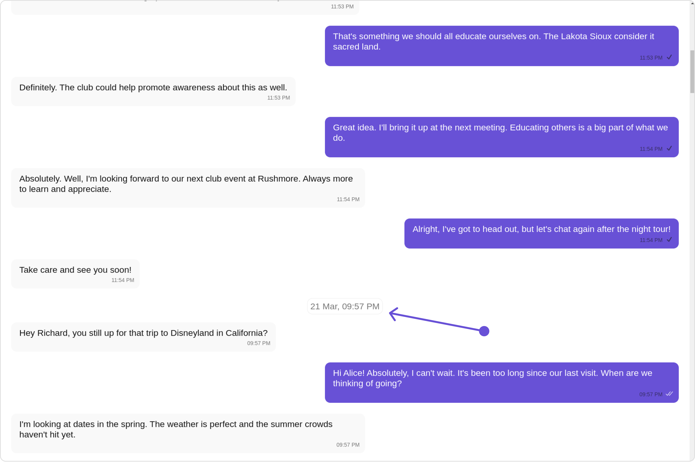

<Tabs>
<TabItem value="TypeScript" label="TypeScript">

```TypeScript title='MessageListDemo.tsx'
import React from "react";
import { CometChat } from "@cometchat/chat-sdk-javascript";
import { CometChatMessageList, DatePatterns } from "@cometchat/chat-uikit-react";

  export function MessageListDemo() {
    const [chatUser, setChatUser] = React.useState<CometChat.User>()
    React.useEffect(() => {
        CometChat.getUser("uid").then((user) => {
            setChatUser(user);
        })
    }, [])

    return chatUser ? (
      <div>
        <CometChatMessageList
          user={chatUser}
          DateSeparatorPattern={DatePatterns.DateTime}
        />
      </div>
    ) : null;
  }
```

</TabItem>

<TabItem value="JavaScript" label="JavaScript">

```JavaScript title='MessageListDemo.jsx'

import React, { useState, useEffect } from "react";
import { CometChat } from "@cometchat/chat-sdk-javascript";
import { CometChatMessageList, DatePatterns } from "@cometchat/chat-uikit-react";

export function MessageListDemo() {
  const [chatUser, setChatUser] = useState(null);

  useEffect(() => {
    CometChat.getUser("uid").then((user) => {
      setChatUser(user);
    });
  }, []);

  return chatUser ? (
    <div>
      <CometChatMessageList
        user={chatUser}
        DateSeparatorPattern={DatePatterns.DateTime}
      />
    </div>
  ) : null;
}

```

</TabItem>
</Tabs>

#### DatePattern

You can modify the date pattern to your requirement using **DatePattern**. Choose from predefined options like time, DayDate, DayDateTime, or DateTime.

DatePatterns describes a specific format or arrangement used to represent dates in a human-readable form.


| Name | Description |
| --- | --- |
| time | Date format displayed in the format hh:mm a |
| DayDate | Date format displayed in the following format. <ol><li>If timestamp < 24hrs display “Today”</li><li>If timestamp < 48hrs display “Yesterday”</li><li>If timestamp &lt; 7days display “EEE” i.e , SUNDAY </li><li>else display “d MMM, yyyy”</li></ol> |
| DayDateTime | Date format displayed in the following format. <ol><li>If timestamp < 24hrs display “hh:mm a”</li><li>If timestamp < 48hrs display “Yesterday”</li><li>If timestamp < 7days display “EEE” i.e SUNDAY</li><li>else display “dd MM yyyy”</li></ol> |


```
datePattern={DatePatterns.DateTime}
```

<Tabs>
<TabItem value="TypeScript" label="TypeScript">

```TypeScript title='MessageListDemo.tsx'

import React from "react";
import { CometChat } from "@cometchat/chat-sdk-javascript";
import { CometChatMessageList, DatePatterns } from "@cometchat/chat-uikit-react";

  export function MessageListDemo() {
    const [chatUser, setChatUser] = React.useState<CometChat.User>()
    React.useEffect(() => {
        CometChat.getUser("uid").then((user) => {
            setChatUser(user);
        })
    }, [])

    return chatUser ? (
      <div>
        <CometChatMessageList
          user={chatUser}
          datePattern={DatePatterns.DateTime}
        />
      </div>
    ) : null;
  }
```

</TabItem>

<TabItem value="JavaScript" label="JavaScript">

```JavaScript title='MessageListDemo.jsx'

import React, { useState, useEffect } from "react";
import { CometChat } from "@cometchat/chat-sdk-javascript";
import { CometChatMessageList, DatePatterns } from "@cometchat/chat-uikit-react";

export function MessageListDemo() {
  const [chatUser, setChatUser] = useState(null);

  useEffect(() => {
    CometChat.getUser("uid").then((user) => {
      setChatUser(user);
    });
  }, []);

  return chatUser ? (
    <div>
      <CometChatMessageList
        user={chatUser}
        datePattern={DatePatterns.DateTime}
      />
    </div>
  ) : null;
}

```

</TabItem>
</Tabs>

---

#### Headerview

You can set custom headerView to the Message List component using the following method.

```
headerView={getHeaderView()}
```

**Example**

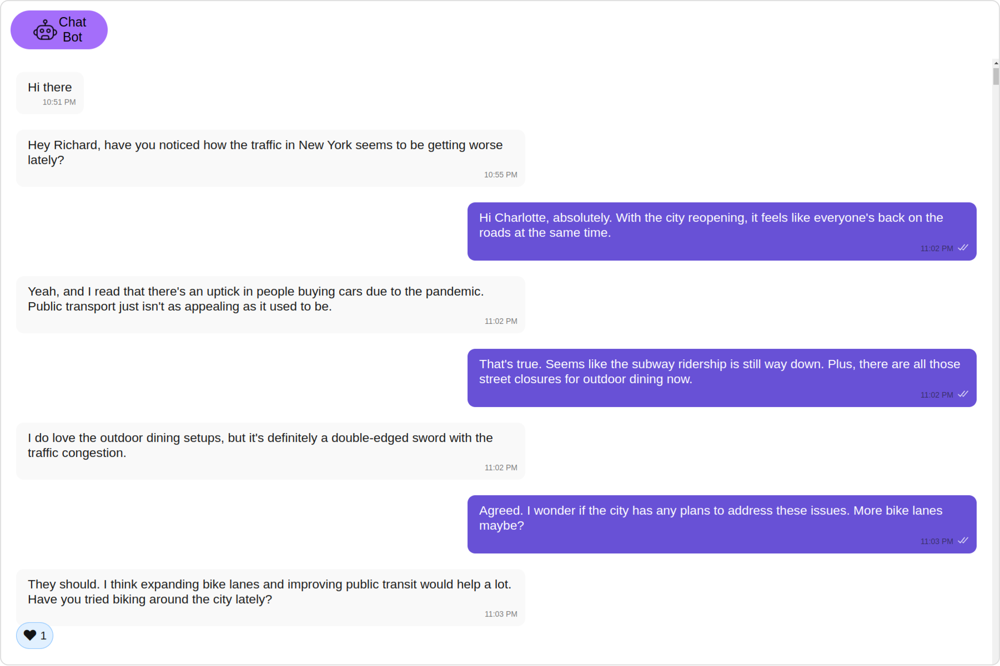

<Tabs>
<TabItem value="TypeScript" label="TypeScript">

```TypeScript title='MessageListDemo.tsx'

import React from "react";
import { CometChat } from "@cometchat/chat-sdk-javascript";
import { CometChatMessageList } from "@cometchat/chat-uikit-react";

  export function MessageListDemo() {
    const [chatUser, setChatUser] = React.useState<CometChat.User>()
    React.useEffect(() => {
        CometChat.getUser("uid").then((user) => {
            setChatUser(user);
        })
    }, [])

  const getHeaderView = () => {
    return (
      <div style={{ height: '40px', width: '100px', background: '#a46efa', borderRadius: '20px', display: 'flex', justifyContent: 'center', alignItems: 'center', margin: '10px' }}>
        <button style={{ height: '40px', width: '40px', background: '#a46efa', border: 'none', display: 'flex', justifyContent: 'center', alignItems: 'center', cursor: "pointer" }}>
          
          <span>Chat Bot</span>
        </button>
      </div>
    )
  }

    return chatUser ? (
      <div>
        <CometChatMessageList
          user={chatUser}
          headerView={getHeaderView()}
        />
      </div>
    ) : null;
  }
```

</TabItem>

<TabItem value="JavaScript" label="JavaScript">

```JavaScript title='MessageListDemo.jsx'

import React, { useState, useEffect } from "react";
import { CometChat } from "@cometchat/chat-sdk-javascript";
import { CometChatMessageList } from "@cometchat/chat-uikit-react";

export function MessageListDemo() {
  const [chatUser, setChatUser] = useState(null);

  useEffect(() => {
    CometChat.getUser("uid").then((user) => {
      setChatUser(user);
    });
  }, []);

  const getHeaderView = () => {
    return (
      <div style={{ height: '40px', width: '100px', background: '#a46efa', borderRadius: '20px', display: 'flex', justifyContent: 'center', alignItems: 'center', margin: '10px' }}>
        <button style={{ height: '40px', width: '40px', background: '#a46efa', border: 'none', display: 'flex', justifyContent: 'center', alignItems: 'center', cursor: "pointer" }}>
          
          <span>Chat Bot</span>
        </button>
      </div>
    )
  }

  return chatUser ? (
    <div>
      <CometChatMessageList
        user={chatUser}
        headerView={getHeaderView()}
      />
    </div>
  ) : null;
}

```

</TabItem>
</Tabs>

---

#### FooterView

You can set custom footerview to the Message List component using the following method.

```
footerview={getFooterView()}
```

**Example**

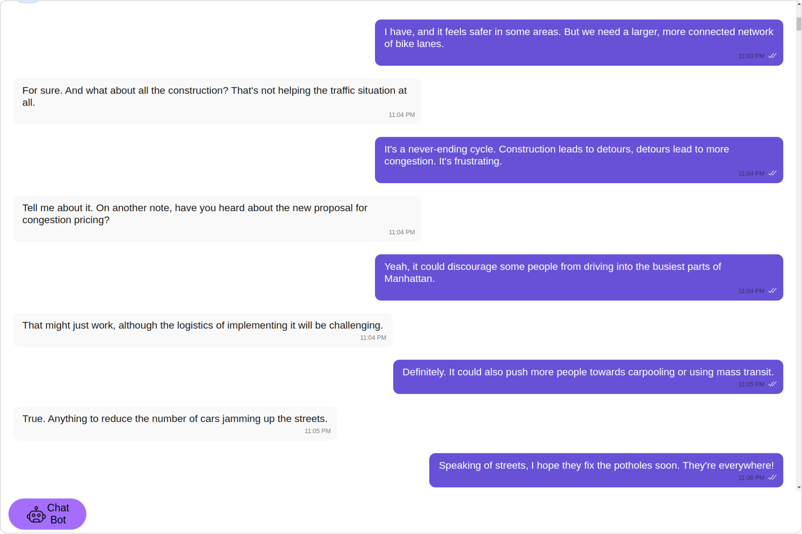

<Tabs>
<TabItem value="TypeScript" label="TypeScript">

```TypeScript title='MessageListDemo.tsx'

import React from "react";
import { CometChat } from "@cometchat/chat-sdk-javascript";
import { CometChatMessageList } from "@cometchat/chat-uikit-react";

  export function MessageListDemo() {
    const [chatUser, setChatUser] = React.useState<CometChat.User>()
    React.useEffect(() => {
        CometChat.getUser("uid").then((user) => {
            setChatUser(user);
        })
    }, [])

  const getFooterView = () => {
    return (
      <div style={{ height: '40px', width: '100px', background: '#a46efa', borderRadius: '20px', display: 'flex', justifyContent: 'center', alignItems: 'center', margin: '10px' }}>
        <button style={{ height: '40px', width: '40px', background: '#a46efa', border: 'none', display: 'flex', justifyContent: 'center', alignItems: 'center', cursor: "pointer" }}>
          
          <span>Chat Bot</span>
        </button>
      </div>
    )
  }

    return chatUser ? (
      <div>
        <CometChatMessageList
          user={chatUser}
          footerview={getFooterView()}
        />
      </div>
    ) : null;
  }
```

</TabItem>

<TabItem value="JavaScript" label="JavaScript">

```JavaScript title='MessageListDemo.jsx'

import React, { useState, useEffect } from "react";
import { CometChat } from "@cometchat/chat-sdk-javascript";
import { CometChatMessageList } from "@cometchat/chat-uikit-react";

export function MessageListDemo() {
  const [chatUser, setChatUser] = useState(null);

  useEffect(() => {
    CometChat.getUser("uid").then((user) => {
      setChatUser(user);
    });
  }, []);

  const getFooterView = () => {
    return (
      <div style={{ height: '40px', width: '100px', background: '#a46efa', borderRadius: '20px', display: 'flex', justifyContent: 'center', alignItems: 'center', margin: '10px' }}>
        <button style={{ height: '40px', width: '40px', background: '#a46efa', border: 'none', display: 'flex', justifyContent: 'center', alignItems: 'center', cursor: "pointer" }}>
          
          <span>Chat Bot</span>
        </button>
      </div>
    )
  }

  return chatUser ? (
    <div>
      <CometChatMessageList
        user={chatUser}
        footerview={getFooterView()}
      />
    </div>
  ) : null;
}

```

</TabItem>
</Tabs>

---

#### ErrorStateView

You can set a custom `errorStateView` to match the error view of your app.

```
 errorStateView={getErrorStateView()}
```

**Example**

**Default**

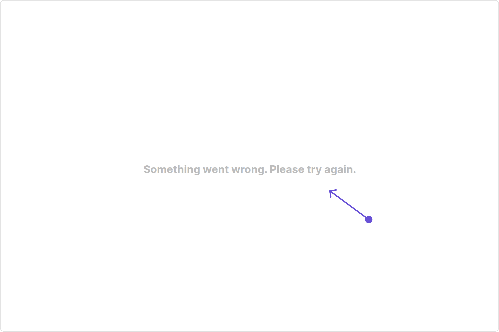

**Custom**

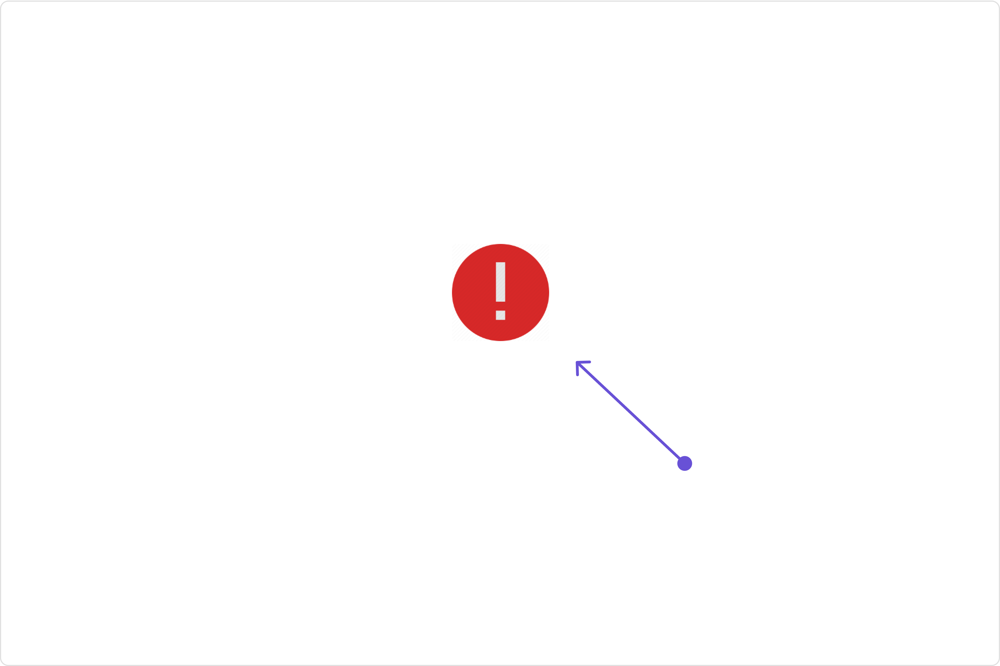

<Tabs>
<TabItem value="TypeScript" label="TypeScript">

```TypeScript title='MessageListDemo.tsx'

import React from "react";
import { CometChat } from "@cometchat/chat-sdk-javascript";
import { CometChatMessageList } from "@cometchat/chat-uikit-react";

  export function MessageListDemo() {
    const [chatUser, setChatUser] = React.useState<CometChat.User>()
    React.useEffect(() => {
        CometChat.getUser("uid").then((user) => {
            setChatUser(user);
        })
    }, [])
    const getErrorStateView = () => {
      return(
        <div style={{height:"100vh", width:"100vw"}}>
          </img>
        </div>
      );
    };

    return chatUser ? (
      <div>
        <CometChatMessageList
          user={chatUser}
          errorStateView={getErrorStateView()}
        />
      </div>
    ) : null;
  }
```

</TabItem>

<TabItem value="JavaScript" label="JavaScript">

```JavaScript title='MessageListDemo.jsx'

import React, { useState, useEffect } from "react";
import { CometChat } from "@cometchat/chat-sdk-javascript";
import { CometChatMessageList } from "@cometchat/chat-uikit-react";

export function MessageListDemo() {
  const [chatUser, setChatUser] = useState(null);

  useEffect(() => {
    CometChat.getUser("uid").then((user) => {
      setChatUser(user);
    });
  }, []);

  const getErrorStateView = () => {
    return (
      <div style={{ height: "100vh", width: "100vw" }}>
        </img>
      </div>
    );
  };

  return chatUser ? (
    <div>
      <CometChatMessageList
        user={chatUser}
        errorStateView={getErrorStateView()}
      />
    </div>
  ) : null;
}

```

</TabItem>
</Tabs>

---

#### EmptyStateView

The `emptyStateView` method provides the ability to set a custom empty state view in your app. An empty state view is displayed when there are no messages for a particular user.

```
 emptyStateView={getEmptyStateView()}
```

**Example**

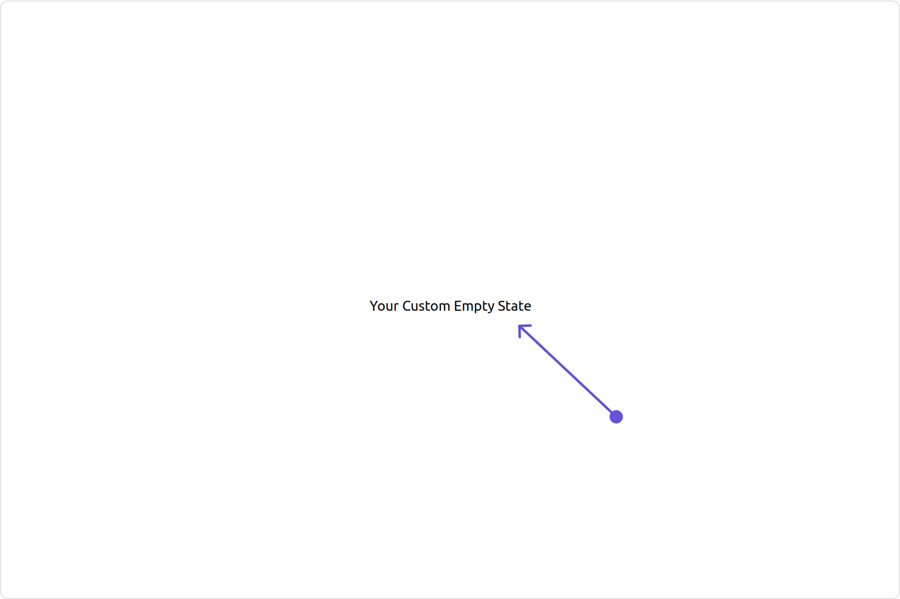

<Tabs>
<TabItem value="TypeScript" label="TypeScript">

```TypeScript title='MessageListDemo.tsx'
import React from "react";
import { CometChat } from "@cometchat/chat-sdk-javascript";
import { CometChatMessageList } from "@cometchat/chat-uikit-react";

  export function MessageListDemo() {
    const [chatUser, setChatUser] = React.useState<CometChat.User>()
    React.useEffect(() => {
        CometChat.getUser("uid").then((user) => {
            setChatUser(user);
        })
    }, [])
    const getEmptyStateView = () => {

    return(
      <div>
        Your Custom Empty State
      </div>
    );
  };

    return chatUser ? (
      <div>
        <CometChatMessageList
          user={chatUser}
          emptyStateView={getEmptyStateView()}
        />
      </div>
    ) : null;
  }
```

</TabItem>

<TabItem value="JavaScript" label="JavaScript">

```JavaScript title='MessageListDemo.jsx'

import React, { useState, useEffect } from "react";
import { CometChat } from "@cometchat/chat-sdk-javascript";
import { CometChatMessageList } from "@cometchat/chat-uikit-react";

export function MessageListDemo() {
  const [chatUser, setChatUser] = useState(null);

  useEffect(() => {
    CometChat.getUser("uid").then((user) => {
      setChatUser(user);
    });
  }, []);

  const getEmptyStateView = () => {
    return (
      <div>
        Your Custom Empty State
      </div>
    );
  };

  return chatUser ? (
    <div>
      <CometChatMessageList
        user={chatUser}
        emptyStateView={getEmptyStateView()}
      />
    </div>
  ) : null;
}

```

</TabItem>
</Tabs>

---

#### LoadingStateView

The `loadingStateView` property allows you to set a custom loading view in your app. This feature enables you to maintain a consistent look and feel throughout your application,

```
loadingStateView={getLoadingStateView()}
```

**Example**

**Default**

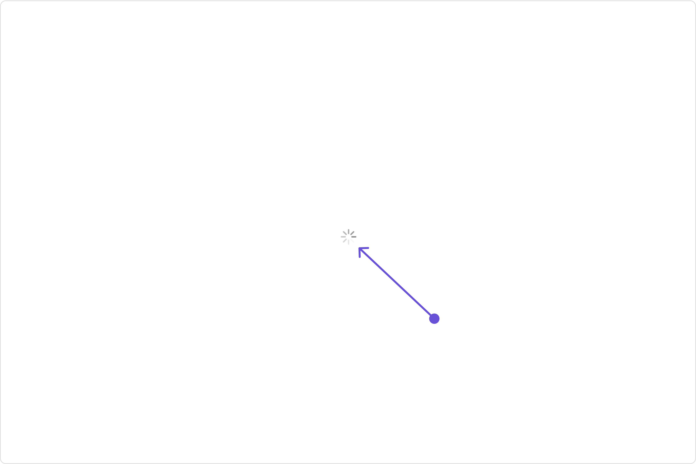

**Custom**

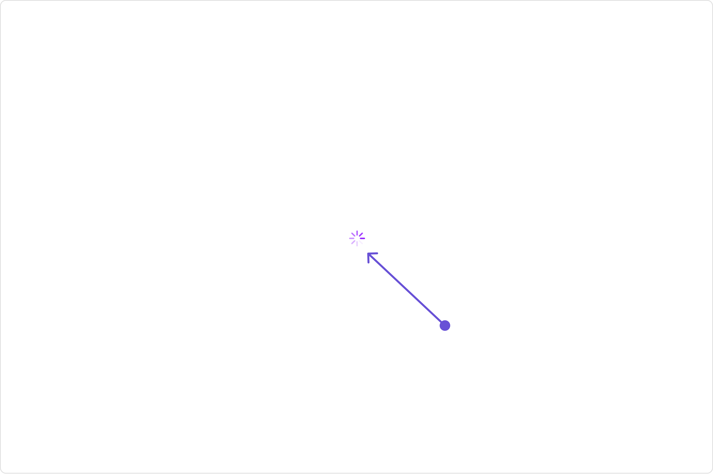

<Tabs>
<TabItem value="TypeScript" label="TypeScript">

```TypeScript title='MessageListDemo.tsx'

import React from "react";
import { CometChat } from "@cometchat/chat-sdk-javascript";
import { CometChatMessageList, LoaderStyle } from "@cometchat/chat-uikit-react";

  export function MessageListDemo() {
    const [chatUser, setChatUser] = React.useState<CometChat.User>()
    React.useEffect(() => {
        CometChat.getUser("uid").then((user) => {
            setChatUser(user);
        })
    }, [])
  const getLoadingStateView = () => {
    const getLoaderStyle = new LoaderStyle({
      iconTint: "#890aff",
      background:"transparent",
      height: "100vh",
      width: "100vw",
      border: "none",
      borderRadius: "0",
    });
    return(
      <cometchat-loader
      iconURL="your custom icon url"
      loaderStyle={JSON.stringify(getLoaderStyle)}
      ></cometchat-loader>
    );
  };


    return chatUser ? (
      <div>
        <CometChatMessageList
          user={chatUser}
          loadingStateView={getLoadingStateView()}
        />
      </div>
    ) : null;
  }
```

</TabItem>

<TabItem value="JavaScript" label="JavaScript">

```JavaScript title='MessageListDemo.jsx'

import React, { useState, useEffect } from "react";
import { CometChat } from "@cometchat/chat-sdk-javascript";
import { CometChatMessageList, LoaderStyle } from "@cometchat/chat-uikit-react";

export function MessageListDemo() {
  const [chatUser, setChatUser] = useState(null);

  useEffect(() => {
    CometChat.getUser("uid").then((user) => {
      setChatUser(user);
    });
  }, []);

  const getLoadingStateView = () => {
    const loaderStyle = new LoaderStyle({
      iconTint: "#890aff",
      background: "transparent",
      height: "100vh",
      width: "100vw",
      border: "none",
      borderRadius: "0",
    });

    return (
      <cometchat-loader
        iconURL="your custom icon url"
        loaderStyle={JSON.stringify(loaderStyle)}
      ></cometchat-loader>
    );
  };

  return chatUser ? (
    <div>
      <CometChatMessageList
        user={chatUser}
        loadingStateView={getLoadingStateView()}
      />
    </div>
  ) : null;
}

```

</TabItem>
</Tabs>

---

#### TextFormatters

Assigns the list of text formatters. If the provided list is not null, it sets the list. Otherwise, it assigns the default text formatters retrieved from the data source. To configure the existing Mentions look and feel check out [CometChatMentionsFormatter](./mentions-formatter-guide)

<Tabs>
<TabItem value="ShortCutFormatter" label="ShortCutFormatter.ts">

```typescript
import { CometChatTextFormatter } from "@cometchat/chat-uikit-react";
import DialogHelper from "./Dialog";
import { CometChat } from "@cometchat/chat-sdk-javascript";

class ShortcutFormatter extends CometChatTextFormatter {
  private shortcuts: { [key: string]: string } = {};
  private dialogIsOpen: boolean = false;
  private dialogHelper = new DialogHelper();
  private currentShortcut: string | null = null; // Track the currently open shortcut

  constructor() {
    super();
    this.setTrackingCharacter("!");
    CometChat.callExtension("message-shortcuts", "GET", "v1/fetch", undefined)
      .then((data: any) => {
        if (data && data.shortcuts) {
          this.shortcuts = data.shortcuts;
        }
      })
      .catch((error) => console.log("error fetching shortcuts", error));
  }

  onKeyDown(event: KeyboardEvent) {
    const caretPosition =
      this.currentCaretPosition instanceof Selection
        ? this.currentCaretPosition.anchorOffset
        : 0;
    const textBeforeCaret = this.getTextBeforeCaret(caretPosition);

    const match = textBeforeCaret.match(/!([a-zA-Z]+)$/);
    if (match) {
      const shortcut = match[0];
      const replacement = this.shortcuts[shortcut];
      if (replacement) {
        // Close the currently open dialog, if any
        if (this.dialogIsOpen && this.currentShortcut !== shortcut) {
          this.closeDialog();
        }
        this.openDialog(replacement, shortcut);
      }
    }
  }

  getCaretPosition() {
    if (!this.currentCaretPosition?.rangeCount) return { x: 0, y: 0 };
    const range = this.currentCaretPosition?.getRangeAt(0);
    const rect = range.getBoundingClientRect();
    return {
      x: rect.left,
      y: rect.top,
    };
  }

  openDialog(buttonText: string, shortcut: string) {
    this.dialogHelper.createDialog(
      () => this.handleButtonClick(buttonText),
      buttonText
    );
    this.dialogIsOpen = true;
    this.currentShortcut = shortcut;
  }

  closeDialog() {
    this.dialogHelper.closeDialog(); // Use DialogHelper to close the dialog
    this.dialogIsOpen = false;
    this.currentShortcut = null;
  }

  handleButtonClick = (buttonText: string) => {
    if (this.currentCaretPosition && this.currentRange) {
      // Inserting the replacement text corresponding to the shortcut
      const shortcut = Object.keys(this.shortcuts).find(
        (key) => this.shortcuts[key] === buttonText
      );
      if (shortcut) {
        const replacement = this.shortcuts[shortcut];
        this.addAtCaretPosition(
          replacement,
          this.currentCaretPosition,
          this.currentRange
        );
      }
    }
    if (this.dialogIsOpen) {
      this.closeDialog();
    }
  };

  getFormattedText(text: string): string {
    return text;
  }

  private getTextBeforeCaret(caretPosition: number): string {
    if (
      this.currentRange &&
      this.currentRange.startContainer &&
      typeof this.currentRange.startContainer.textContent === "string"
    ) {
      const textContent = this.currentRange.startContainer.textContent;
      if (textContent.length >= caretPosition) {
        return textContent.substring(0, caretPosition);
      }
    }
    return "";
  }
}

export default ShortcutFormatter;
```

</TabItem>
<TabItem value="Dialog" label="Dialog.tsx">

```typescript
import React from "react";
import ReactDOM from "react-dom";

interface DialogProps {
  onClick: () => void;
  buttonText: string;
}

const Dialog: React.FC<DialogProps> = ({ onClick, buttonText }) => {
  console.log("buttonText", buttonText);

  return (
    <div
      style={{
        position: "fixed",
        left: "300px",
        top: "664px",
        width: "800px",
        height: "45px",
      }}
    >
      <button
        style={{
          width: "800px",
          height: "100%",
          cursor: "pointer",
          backgroundColor: "#f2e6ff",
          border: "2px solid #9b42f5",
          borderRadius: "12px",
          textAlign: "left",
          paddingLeft: "20px",
          font: "600 15px sans-serif, Inter",
        }}
        onClick={onClick}
      >
        {buttonText}
      </button>
    </div>
  );
};

export default class DialogHelper {
  private dialogContainer: HTMLDivElement | null = null;

  createDialog(onClick: () => void, buttonText: string) {
    this.dialogContainer = document.createElement("div");
    document.body.appendChild(this.dialogContainer);

    ReactDOM.render(
      <Dialog onClick={onClick} buttonText={buttonText} />,
      this.dialogContainer
    );
  }

  closeDialog() {
    if (this.dialogContainer) {
      ReactDOM.unmountComponentAtNode(this.dialogContainer);
      this.dialogContainer.remove();
      this.dialogContainer = null;
    }
  }
}
```

</TabItem>
<TabItem value="MessageListDemo" label="MessageListDemo.tsx">

```tsx
import React from "react";
import { CometChat } from "@cometchat/chat-sdk-javascript";
import { CometChatMessageList } from "@cometchat/chat-uikit-react";
import ShortcutFormatter from "./ShortCutFormatter";

export function MessageListDemo() {
  const [chatUser, setChatUser] = React.useState<CometChat.User>();
  React.useEffect(() => {
    CometChat.getUser("uid").then((user) => {
      setChatUser(user);
    });
  }, []);

  return chatUser ? (
    <div>
      <CometChatMessageList
        user={chatUser}
        textFormatters={[new ShortcutFormatter()]}
      />
    </div>
  ) : null;
}
```

</TabItem>
</Tabs>

---

## Configuration

[Configurations](./components-overview#configurations) offer the ability to customize the properties of each component within a Composite Component.

### MessageInformation

From the MessageList, you can navigate to the [MesssageInformation](./message-information) component as shown in the image.
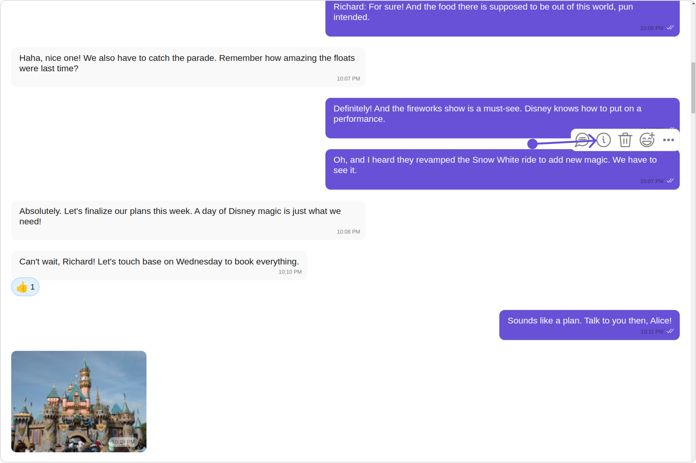

If you wish to modify the properties of the [MesssageInformation](./message-information) Component, you can use the `MessageInformationConfiguration` object.
<Tabs>
<TabItem value="TypeScript" label="TypeScript">

```TypeScript title='MessageListDemo.tsx'
import React from "react";
import { CometChat } from "@cometchat/chat-sdk-javascript";
import { CometChatMessageList, MessageInformationStyle } from "@cometchat/chat-uikit-react";

  export function MessageListDemo() {
    const [chatUser, setChatUser] = React.useState<CometChat.User>()
    React.useEffect(() => {
        CometChat.getUser("uid").then((user) => {
            setChatUser(user);
        })
    }, [])
  const messageInformationStyle = new MessageInformationStyle({
    background:"#f7f2fa",
    border:"2px solid #d895fc",
    borderRadius:"20px",
    captionTextColor:"#8629e3",
    titleTextColor:"#908deb",
  })

    return chatUser ? (
      <div>
        <CometChatMessageList
          user={chatUser}
          messageInformationConfiguration={new MessageInformationConfiguration({
          messageInformationStyle: messageInformationStyle
          })}
        />
      </div>
    ) : null;
  }
```

</TabItem>

<TabItem value="JavaScript" label="JavaScript">

```JavaScript title='MessageListDemo.jsx'
import React, { useState, useEffect } from "react";
import { CometChat } from "@cometchat/chat-sdk-javascript";
import { CometChatMessageList, MessageInformationStyle, MessageInformationConfiguration } from "@cometchat/chat-uikit-react";

export function MessageListDemo() {
  const [chatUser, setChatUser] = useState(null);

  useEffect(() => {
    CometChat.getUser("uid").then((user) => {
      setChatUser(user);
    });
  }, []);

  const messageInformationStyle = new MessageInformationStyle({
    background: "#f7f2fa",
    border: "2px solid #d895fc",
    borderRadius: "20px",
    captionTextColor: "#8629e3",
    titleTextColor: "#908deb",
  });

  return chatUser ? (
    <div>
      <CometChatMessageList
        user={chatUser}
        messageInformationConfiguration={new MessageInformationConfiguration({
          messageInformationStyle: messageInformationStyle,
        })}
      />
    </div>
  ) : null;
}

```

</TabItem>
</Tabs>

The `MessageInformationConfiguration` indeed provides access to all the [Action](./message-information#actions), [Filters](./message-information#filters), [Styles](./message-information#style), [Functionality](./message-information#functionality), and [Advanced](./message-information#functionality) properties of the [MesssageInformation](./message-information) component.

Please note that the properties marked with the <a><span class="material-icons red">report</span></a> symbol are not accessible within the Configuration Object.

**Example**

**Default**

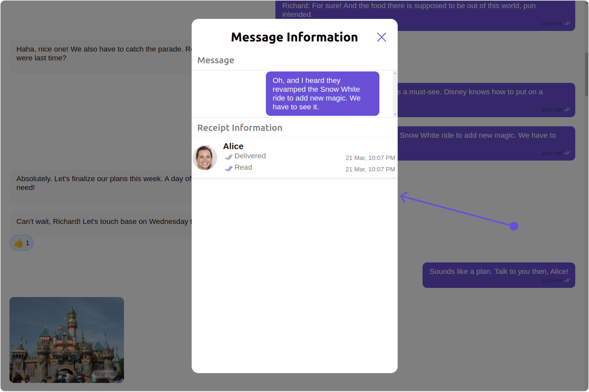

**Custom**

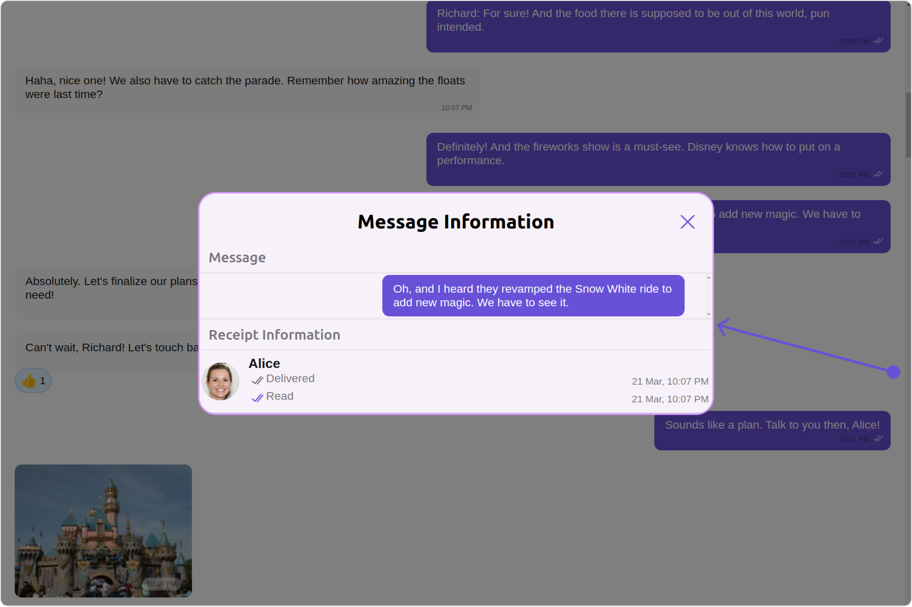

In the above example, we are styling a few properties of the [MesssageInformation](./message-information) component using `MessageInformationConfiguration`.

### Reaction

If you wish to modify the properties of the [Reaction](./reaction) Component, you can use the `reactionsConfiguration` object.


<Tabs>
<TabItem value="TypeScript" label="TypeScript">

```TypeScript title='MessageListDemo.tsx'
import React from "react";
import { CometChat } from "@cometchat/chat-sdk-javascript";
import { CometChatMessageList, ReactionsStyle, ReactionsConfiguration } from "@cometchat/chat-uikit-react";

  export function MessageListDemo() {
    const [chatUser, setChatUser] = React.useState<CometChat.User>()
    React.useEffect(() => {
        CometChat.getUser("uid").then((user) => {
            setChatUser(user);
        })
    }, [])
  const reactionsStyle = new ReactionsStyle({
    border:'2px solid #8742f5',
    activeReactionBackground:'#b88cff',
    background:'#7b34ed',
    baseReactionBackground:'#ebe3ff',
    borderRadius:'20px'
  })

    return chatUser ? (
      <div>
        <CometChatMessageList
          user={chatUser}
          reactionsConfiguration={new ReactionsConfiguration({
          reactionsStyle: reactionsStyle
          //properties of reactions
        })}
        />
      </div>
    ) : null;
  }
```

</TabItem>

<TabItem value="JavaScript" label="JavaScript">

```JavaScript title='MessageListDemo.jsx'
import React, { useState, useEffect } from "react";
import { CometChat } from "@cometchat/chat-sdk-javascript";
import { CometChatMessageList, ReactionsStyle, ReactionsConfiguration } from "@cometchat/chat-uikit-react";

export function MessageListDemo() {
  const [chatUser, setChatUser] = useState(null);

  useEffect(() => {
    CometChat.getUser("uid").then((user) => {
      setChatUser(user);
    });
  }, []);

  const reactionsStyle = new ReactionsStyle({
    border:'2px solid #8742f5',
    activeReactionBackground:'#b88cff',
    background:'#7b34ed',
    baseReactionBackground:'#ebe3ff',
    borderRadius:'20px'
  })

  return chatUser ? (
    <div>
      <CometChatMessageList
        user={chatUser}
        reactionsConfiguration={new ReactionsConfiguration({
          reactionsStyle: reactionsStyle
          //properties of reactions
        })}
      />
    </div>
  ) : null;
}

```

</TabItem>
</Tabs>

import { Tooltip } from 'react-tooltip'
import 'react-tooltip/dist/react-tooltip.css'

<Tooltip
  id="my-tooltip-html-prop"
  html="Not available in MessageListConfiguration"
/>
