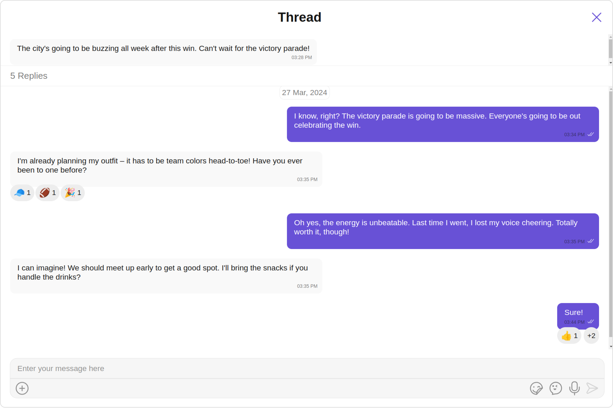
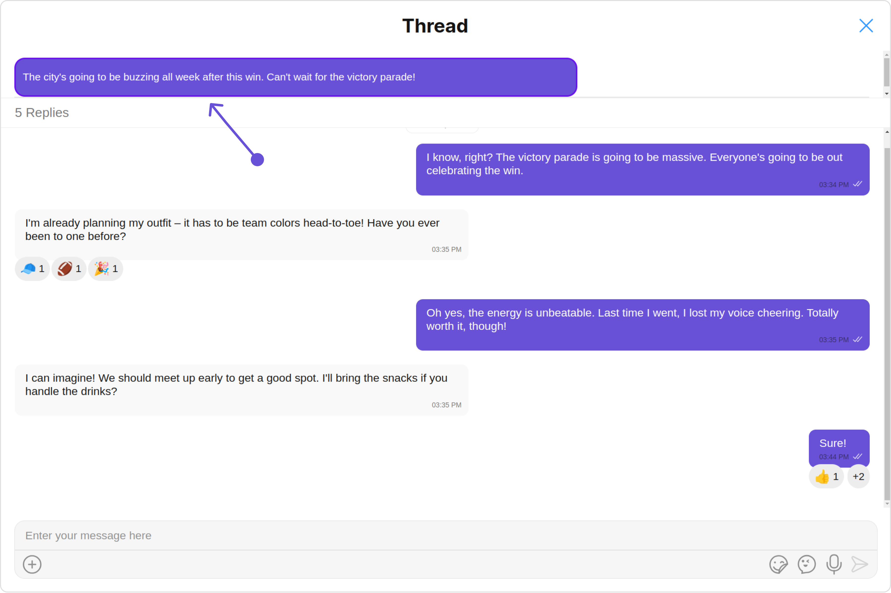
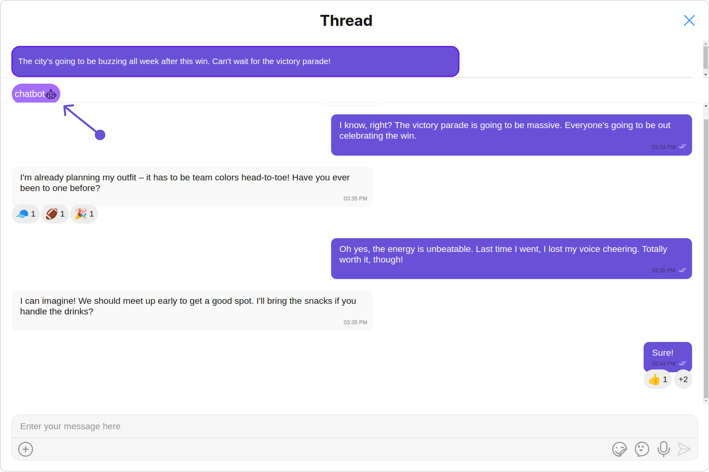
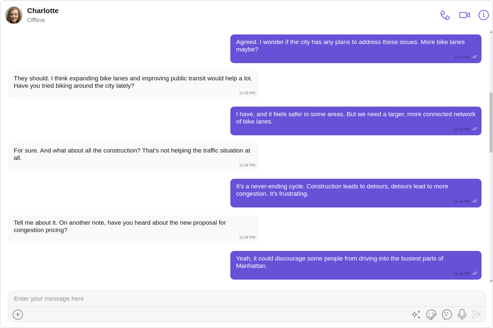
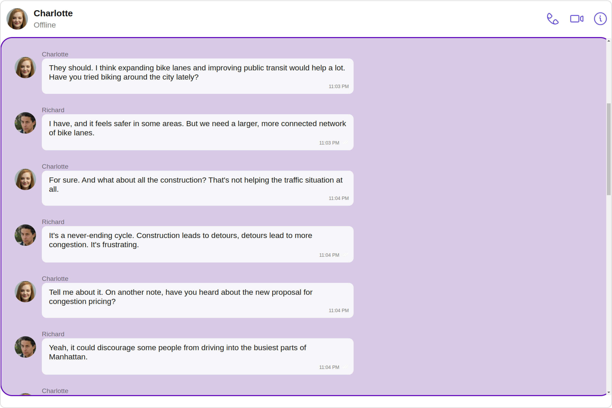
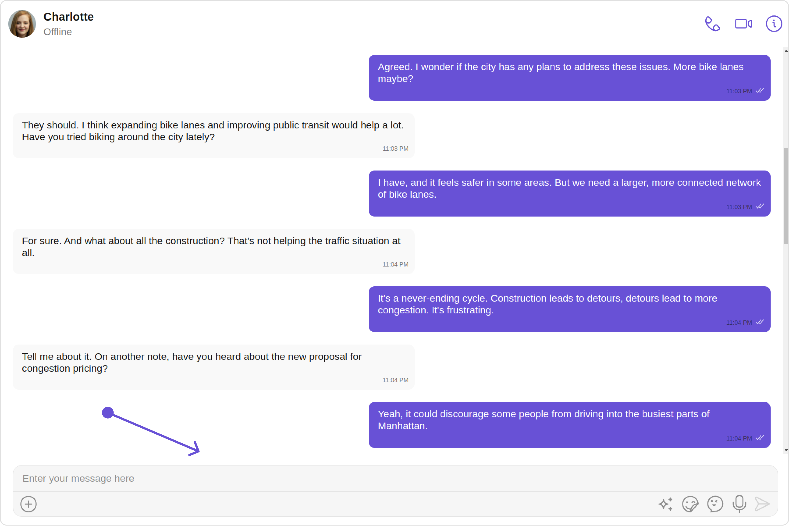
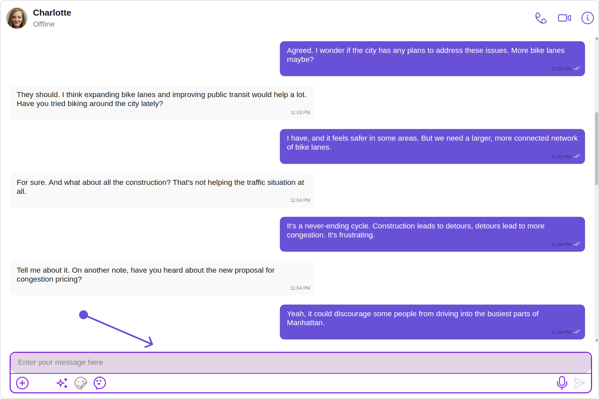
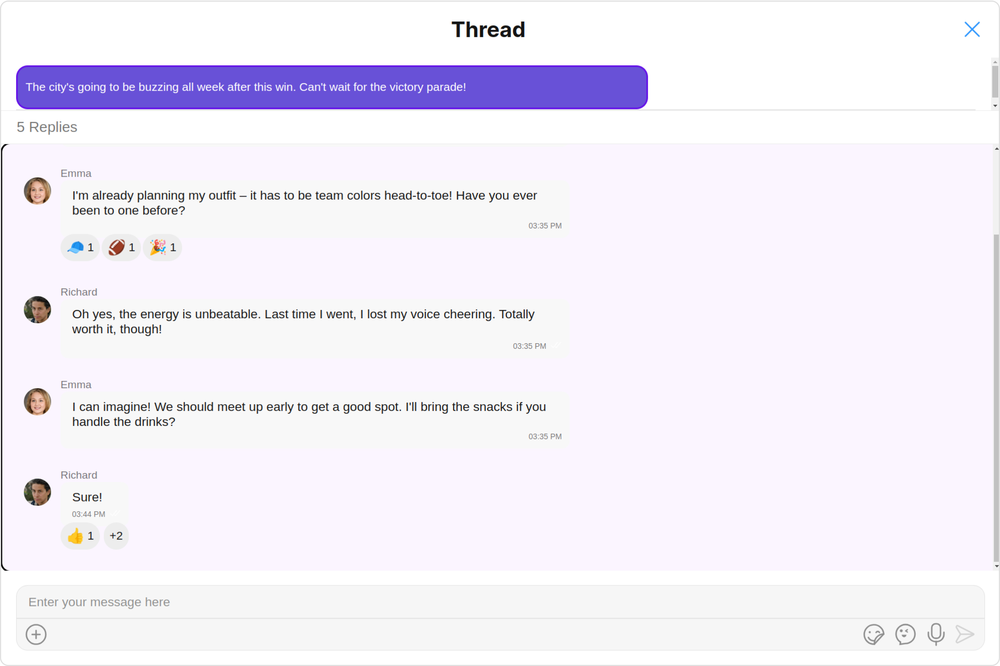
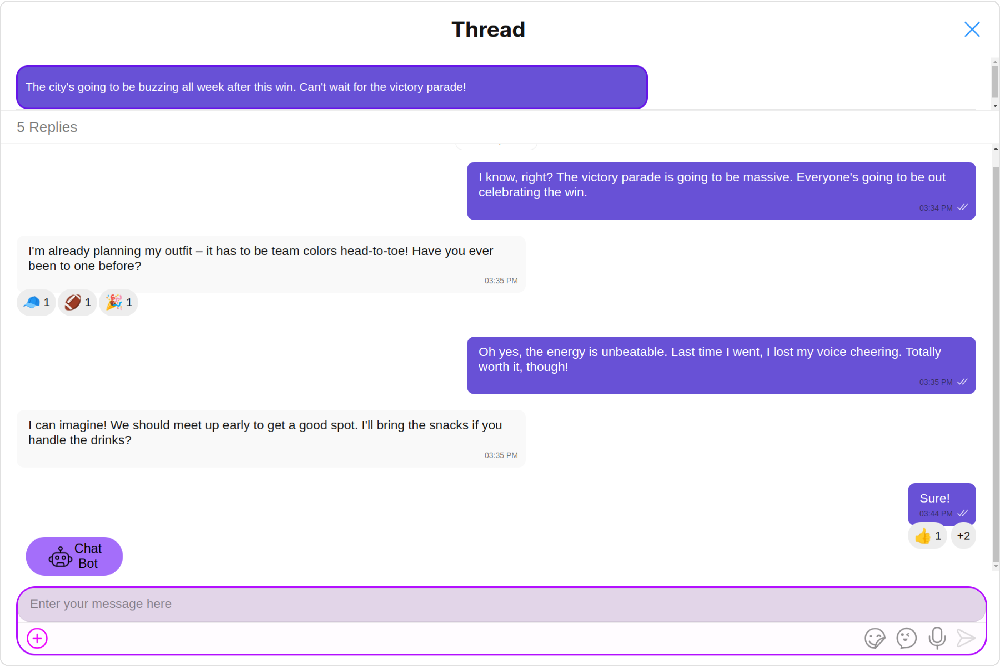

import Tabs from '@theme/Tabs';
import TabItem from '@theme/TabItem';

## Overview

ThreadedMessages is a [Composite Component](./components-overview#composite-components) that displays all replies made to a particular message in a conversation. By default, the parent message will be displayed at the top, the message composer will be at the bottom and between them a message list will contain all replies.



ThreadedMessages is composed of the following components:

| Component                             | Description                                                                                                        |
| ------------------------------------- | ------------------------------------------------------------------------------------------------------------------ |
| [MessageList](./message-list)         | CometChatMessageList is a component that displays a list of Messages                                               |
| [MessageComposer](./message-composer) | CometChatMessageComposer is a component that helps in writing and editing of messages and also sending attachments |

## Usage

### Integration

The following code snippet illustrates how you can directly incorporate the ThreadedMessages component into your Application.

<Tabs>
<TabItem value="ThreadedMessagesDemo" label="ThreadedMessagesDemo.tsx">

```jsx
import React from "react";
import { CometChatThreadedMessages, ThreadedMessagesStyle } from "@cometchat/chat-uikit-react";
import {CometChat} from "@cometchat/chat-sdk-javascript";

const bubbleView = () => {
  return <div>your custom bubble view</div>;
};

export function ThreadedMessagesDemo() {
  const [parentMessage, setParentMessage] = React.useState<CometChat.BaseMessage>();
  const [chatWithUser, setChatWithUser] = React.useState<CometChat.User>()

  React.useEffect(() => {
    CometChat.getUser("uid").then((user) => {
        setChatWithUser(user);
    })
    CometChat.getMessageDetails("parent Id").then((message)=>{
        setParentMessage(message)
    })
}, []);

  const threadedMessagesStyle = new ThreadedMessagesStyle({
    titleColor: "#6615e8",
    background: "#ebdeff",
    width: "100%",
    height: "600px",
    border: "2px solid #9e19e0"
  });

  const getTitle = () => {
    return `Thread ${chatWithUser?.getName()}`;
  };

  return chatWithUser && parentMessage ? (
    <CometChatThreadedMessages
      parentMessage={parentMessage}
      bubbleView={bubbleView}
      title={getTitle()}
      threadedMessagesStyle={threadedMessagesStyle}
    />
  ) : null;
}
```

</TabItem>
<TabItem value="ts" label="App.tsx">

```jsx
import { ThreadedMessagesDemo } from "./ThreadedMessagesDemo";

export default function App() {
  return (
    <div className="App">
      <div>
        <ThreadedMessagesDemo />
      </div>
    </div>
  );
}
```

</TabItem>
</Tabs>

---

### Actions

[Actions](./components-overview#actions) dictate how a component functions. They are divided into two types: Predefined and User-defined. You can override either type, allowing you to tailor the behavior of the component to fit your specific needs.

**Example**

In this example, we are overriding the `onClose` of the ThreadedMesssage Component.

<Tabs>
<TabItem value="ThreadedMessagesDemo" label="ThreadedMessagesDemo.tsx">

```jsx
import React from "react";
import { CometChatThreadedMessages, ThreadedMessagesStyle , MessageListConfiguration } from "@cometchat/chat-uikit-react";
import {CometChat} from "@cometchat/chat-sdk-javascript";

const bubbleView = () => {
  return <div>your custom bubble view</div>;
};

export function ThreadedMessagesDemo() {
  const [parentMessage, setParentMessage] = React.useState<CometChat.BaseMessage>();
  const [chatWithUser, setChatWithUser] = React.useState<CometChat.User>()

  React.useEffect(() => {
    CometChat.getUser("uid").then((user) => {
        setChatWithUser(user);
    })
    CometChat.getMessageDetails("parent Id").then((message)=>{
        setParentMessage(message)
    })
}, []);

  const getonClose = () => {
    console.log("your custom on close action");
   }

  return chatWithUser && parentMessage ? (
    <CometChatThreadedMessages
      parentMessage={parentMessage}
      bubbleView={bubbleView}
      onClose:getonClose
    />
  ) : null;
}
```

</TabItem>
</Tabs>

---

### Filters

**Filters** allow you to customize the data displayed in a list within a Component. You can filter the list based on your specific criteria, allowing for a more customized. Filters can be applied using RequestBuilders of Chat SDK.

ThreadedMessages does not have its own Filters. However, you can filter the messages list in ThreadedMessages Component using [MessageListConfiguration](#messagelist).

**Example**

In this example, we are filtering messages based on the ParentMessageID and searching for messages that contain the keyword "hi".

<Tabs>
<TabItem value="ThreadedMessagesDemo" label="ThreadedMessagesDemo.tsx">

```jsx
import React from "react";
import { CometChatThreadedMessages, ThreadedMessagesStyle , MessageListConfiguration } from "@cometchat/chat-uikit-react";
import {CometChat} from "@cometchat/chat-sdk-javascript";

const bubbleView = () => {
  return <div>your custom bubble view</div>;
};

export function ThreadedMessagesDemo() {
  const [parentMessage, setParentMessage] = React.useState<CometChat.BaseMessage>();
  const [chatWithUser, setChatWithUser] = React.useState<CometChat.User>()

  React.useEffect(() => {
    CometChat.getUser("uid").then((user) => {
        setChatWithUser(user);
    })
    CometChat.getMessageDetails("parent Id").then((message)=>{
        setParentMessage(message)
    })
}, []);

  return chatWithUser && parentMessage ? (
    <CometChatThreadedMessages
      parentMessage={parentMessage}
      bubbleView={bubbleView}
      messageListConfiguration={new MessageListConfiguration({
        messagesRequestBuilder: new CometChat.MessagesRequestBuilder().setParentMessageId(546).setSearchKeyword("hi").setLimit(1)
      })}
    />
  ) : null;
}
```

</TabItem>
</Tabs>

---

### Events

[Events](./components-overview#events) are emitted by a `Component`. By using event you can extend existing functionality. Being global events, they can be applied in Multiple Locations and are capable of being Added or Removed.

The ThreadedMessages Component does not emit any events of its own.

---

## Customization

To fit your app's design requirements, you can customize the appearance of the conversation component. We provide exposed methods that allow you to modify the experience and behavior according to your specific needs.

---

### Style

Using Style you can customize the look and feel of the component in your app, These parameters typically control elements such as the color, size, shape, and fonts used within the component.

##### 1. threadedMessagesStyle

To modify the styling, you can apply the ThreadedMessageStyle to the ThreadedMessage Component using the `threadedMessagesStyle` property.

<Tabs>
<TabItem value="ThreadedMessagesDemo" label="ThreadedMessagesDemo.tsx">

```jsx
import React from "react";
import { CometChatThreadedMessages, ThreadedMessagesStyle } from "@cometchat/chat-uikit-react";
import {CometChat} from "@cometchat/chat-sdk-javascript";

const bubbleView = () => {
  return <div>your custom bubble view</div>;
};

export function ThreadedMessagesDemo() {
  const [parentMessage, setParentMessage] = React.useState<CometChat.BaseMessage>();
  const [chatWithUser, setChatWithUser] = React.useState<CometChat.User>()

  React.useEffect(() => {
    CometChat.getUser("uid").then((user) => {
        setChatWithUser(user);
    })
    CometChat.getMessageDetails("parent Id").then((message)=>{
        setParentMessage(message)
    })
}, []);
  const threadedMessagesStyle = new ThreadedMessagesStyle({
    background: "#ebdeff",
    width: "100%",
    height: "600px",
    border: "2px solid #9e19e0"
  });

  return chatWithUser && parentMessage ? (
    <CometChatThreadedMessages
      parentMessage={parentMessage}
      bubbleView={bubbleView}
      threadedMessagesStyle={threadedMessagesStyle}
    />
  ) : null;
}
```

</TabItem>
</Tabs>

The following properties are exposed by `ThreadedMessagesStyle`:

| Methods           | Description                                             | Type                      |
| ----------------- | ------------------------------------------------------- | ------------------------- |
| **border**        | Used to set border                                      | `border?: string,`        |
| **borderRadius**  | Used to set border radius                               | `borderRadius?: string;`  |
| **background**    | Used to set background colour                           | `background?: string;`    |
| **height**        | Used to set height                                      | `height?: string;`        |
| **width**         | Used to set width                                       | `width?: string;`         |
| **titleFont**     | used to customise the font of the title in the app bar  | `titleFont?: string; `    |
| **titleColor**    | used to customise the color of the title in the app bar | `titleColor?: string;`    |
| **closeIconTint** | used to set the color of the close icon in the app bar  | `closeIconTint?: string;` |

---

### Functionality

These are a set of small functional customizations that allow you to fine-tune the overall experience of the component. With these, you can change text, set custom icons, and toggle the visibility of UI elements.

<Tabs>
<TabItem value="ThreadedMessagesDemo" label="ThreadedMessagesDemo.tsx">

```jsx
import React from "react";
import { CometChatThreadedMessages } from "@cometchat/chat-uikit-react";
import {CometChat} from "@cometchat/chat-sdk-javascript";

const bubbleView = () => {
  return <div>your custom bubble view</div>;
};

export function ThreadedMessagesDemo() {
  const [parentMessage, setParentMessage] = React.useState<CometChat.BaseMessage>();
  const [chatWithUser, setChatWithUser] = React.useState<CometChat.User>()

  React.useEffect(() => {
    CometChat.getUser("uid").then((user) => {
        setChatWithUser(user);
    })
    CometChat.getMessageDetails("parent Id").then((message)=>{
        setParentMessage(message)
    })
  }, []);
  const getTitle = () => {
    return `Thread of ${chatWithUser?.getName()}`;
  };

  return chatWithUser && parentMessage ? (
    <CometChatThreadedMessages
      parentMessage={parentMessage}
      bubbleView={bubbleView}
      title={getTitle()}
      closeIconURL="your custom close icon url"
    />
  ) : null;
}
```

</TabItem>
</Tabs>

Below is a list of customizations along with corresponding code snippets

| Property                                                                                                         | Description                                                           | Code                                        |
| ---------------------------------------------------------------------------------------------------------------- | --------------------------------------------------------------------- | ------------------------------------------- |
| **parentMessage** <a data-tooltip-id="my-tooltip-html-prop"> <span class="material-icons red">report</span> </a> | Used to to set the message for which the replies need to be fetched   | `parentMessage={parentMessage}`             |
| **Hide MessageComposer**                                                                                         | Used to toggle visibility for CometChatMessageComposer, default false | `hideMessageComposer={true}`                |
| **title**                                                                                                        | Used to set title in the app bar                                      | `title={getTitle()}`                        |
| **closeIconURL**                                                                                                 | Used to set the icon to exit the widget                               | `closeIconURL="your custom close icon url"` |

---

### Advanced

For advanced-level customization, you can set custom views to the component. This lets you tailor each aspect of the component to fit your exact needs and application aesthetics. You can create and define your views, layouts, and UI elements and then incorporate those into the component.

#### BubbleView

By using `bubbleView`, You can set parent message bubble view inside ThreadedMessage Component.

**Example**

**Default**


**Custom**



In this example, we will set parent message bubble view using `bubbleView` and apply custom styles on it.

<Tabs>
<TabItem value="ThreadedMessagesDemo" label="ThreadedMessagesDemo.tsx">

```jsx
import React from "react";
import { CometChatThreadedMessages, ListItemStyle } from "@cometchat/chat-uikit-react";
import {CometChat} from "@cometchat/chat-sdk-javascript";

const bubbleView = () => {
    const listItemStyle = new ListItemStyle({
        width: "150px",
        height: "100%",
        border: "2px solid #6615e8",
        borderRadius:"12px",
        titleColor:"#ffffff",
        background:"rgb(104, 81, 214)"
      });
    return(
        <cometchat-list-item title ={(parentMessage as CometChat.TextMessage).getText()} listItemStyle={JSON.stringify(listItemStyle)} />
    )
  };

export function ThreadedMessagesDemo() {
  const [parentMessage, setParentMessage] = React.useState<CometChat.BaseMessage>();
  const [chatWithUser, setChatWithUser] = React.useState<CometChat.User>()

  React.useEffect(() => {
    CometChat.getUser("uid").then((user) => {
        setChatWithUser(user);
    })
    CometChat.getMessageDetails("parent Id").then((message)=>{
        setParentMessage(message)
    })
  }, []);

  return chatWithUser && parentMessage ? (
    <CometChatThreadedMessages
      parentMessage={parentMessage}
      bubbleView={bubbleView}
    />
  ) : null;
}
```

</TabItem>
</Tabs>

#### MessageActionView

By utilizing the `messageActionView` method, you can assign custom actions to the parent message bubble view inside the ThreadedMessage Component.

**Example**

In this example, we are setting mock Chat Bot button as message action view in ThreadedMessages Component.

<Tabs>
<TabItem value="ThreadedMessagesDemo" label="ThreadedMessagesDemo.tsx">

```jsx
import React from "react";
import { CometChatThreadedMessages, ListItemStyle } from "@cometchat/chat-uikit-react";
import {CometChat} from "@cometchat/chat-sdk-javascript";

 const messageActionView = () =>{
    return (
        <div style={{ height: '30px', width: '70px', background: '#a46efa', borderRadius: '20px', display: 'flex', justifyContent: 'center', alignItems: 'center'}}>
            <button style={{ height: '20px', width: '50px', background: '#a46efa', border: 'none', display: 'flex', justifyContent: 'center', alignItems: 'center', cursor:"pointer",color:'#ffffff'  }}>
                chatbot
                
            </button>
        </div>
    )
  }

  const bubbleView = () => {
    const listItemStyle = new ListItemStyle({
        width: "150px",
        height: "100%",
        border: "2px solid #6615e8",
        borderRadius:"12px",
        titleColor:"#ffffff",
        background:"rgb(104, 81, 214)"
      });
    return(
        <cometchat-list-item title ={(parentMessage as CometChat.TextMessage).getText()} listItemStyle={JSON.stringify(listItemStyle)} />
    )
  };

export function ThreadedMessagesDemo() {
  const [parentMessage, setParentMessage] = React.useState<CometChat.BaseMessage>();
  const [chatWithUser, setChatWithUser] = React.useState<CometChat.User>()

  React.useEffect(() => {
    CometChat.getUser("uid").then((user) => {
        setChatWithUser(user);
    })
    CometChat.getMessageDetails("parent Id").then((message)=>{
        setParentMessage(message)
    })
  }, []);

  return chatWithUser && parentMessage ? (
    <CometChatThreadedMessages
      parentMessage={parentMessage}
      bubbleView={bubbleView}
      messageActionView={messageActionView()}
    />
  ) : null;
}
```

</TabItem>
</Tabs>

---

#### MessageListView

You can set your custom message list view using the `messageListView` property. But keep in mind, by using this you will override the default message ListView functionality.

```jsx
messageListView = { CustomListItem };
```

**Example**

**Default**



**Custom**



<Tabs>
<TabItem value="ThreadedMessagesDemo" label="TypeScript">

```typescript title='ThreadedMessagesDemo.tsx'
import React from "react";
import { CometChat } from "@cometchat/chat-sdk-javascript";
import {
  CometChatMessageList,
  CometChatThreadedMessages,
  MessageListAlignment,
  MessageListStyle,
} from "@cometchat/chat-uikit-react";

function ThreadedMessagesDemo() {
  const [parentMessage, setParentMessage] =
    React.useState<CometChat.BaseMessage>();
  const [chatWithUser, setChatWithUser] = React.useState<CometChat.User>();

  React.useEffect(() => {
    CometChat.getUser("uid").then((user) => {
      setChatWithUser(user);
    });
    CometChat.getMessageDetails("parent Id").then((message) => {
      setParentMessage(message);
    });
  }, []);

  const messageListStyle = new MessageListStyle({
    background: "#fdf2ff",
    border: "1px solid #d608ff",
    borderRadius: "20px",
    loadingIconTint: "red",
    nameTextColor: "pink",
    threadReplyTextColor: "green",
  });
  const CustomListItem = React.useMemo(
    (
      user?: CometChat.User,
      group?: CometChat.Group,
      parentMessage?: CometChat.BaseMessage
    ) => (
      <div style={{ height: "500px" }}>
        <CometChatMessageList
          user={chatUser!}
          messageListStyle={messageListStyle}
          alignment={MessageListAlignment.left}
        />
      </div>
    ),
    []
  );

  return (
    <>
      <CometChatThreadedMessages
        parentMessage={parentMessage}
        messageListView={CustomListItem}
      />
    </>
  );
}

export default ThreadedMessagesDemo;
```

</TabItem>

<TabItem value="ThreadedMessagesDemo.jsx" label="JavaScript">

```javascript title='ThreadedMessagesDemo.jsx'
import React, { useState, useEffect, useMemo } from "react";
import { CometChat } from "@cometchat/chat-sdk-javascript";
import {
  CometChatMessageList,
  CometChatThreadedMessages,
  MessageListAlignment,
  MessageListStyle,
} from "@cometchat/chat-uikit-react";

function ThreadedMessagesDemo() {
  const [parentMessage, setParentMessage] = React.useState<CometChat.BaseMessage>();
  const [chatWithUser, setChatWithUser] = React.useState<CometChat.User>()

  React.useEffect(() => {
    CometChat.getUser("uid").then((user) => {
        setChatWithUser(user);
    })
    CometChat.getMessageDetails("parent Id").then((message)=>{
        setParentMessage(message)
    })
}, []);

  const messageListStyle = useMemo(
    () =>
      new MessageListStyle({
        background: "#fdf2ff",
        border: "1px solid #d608ff",
        borderRadius: "20px",
        loadingIconTint: "red",
        nameTextColor: "pink",
        threadReplyTextColor: "green",
      }),
    []
  );

  const CustomListItem = useMemo(
    () => (
      <div style={{ height: "500px" }}>
        <CometChatMessageList
          user={chatUser}
          messageListStyle={messageListStyle}
          alignment={MessageListAlignment.left}
        />
      </div>
    ),
    [chatUser, messageListStyle]
  );

  return (
    <>
      <CometChatThreadedMessages
        parentMessage={parentMessage}
        messageListView={CustomListItem}
      />
    </>
  );
}

export default ThreadedMessagesDemo;
```

</TabItem>
</Tabs>

---

#### MessageComposerView

You can set your custom Message Composer view using the `messageComposerView` property. But keep in mind, by using this you will override the default message composer functionality.

**Example**

```
messageComposerView={CustomComposerView}
```

**Default**



**Custom**



<Tabs>
<TabItem value="TypeScript" label="TypeScript">

```typescript title='ThreadedMessagesDemo.tsx'
import React from "react";
import { CometChat } from "@cometchat/chat-sdk-javascript";
import {
  CometChatMessageComposer,
  CometChatThreadedMessages,
  AuxiliaryButtonAlignment,
  MessageComposerStyle,
} from "@cometchat/chat-uikit-react";

function ThreadedMessagesDemo() {
  const [parentMessage, setParentMessage] =
    React.useState<CometChat.BaseMessage>();
  const [chatWithUser, setChatWithUser] = React.useState<CometChat.User>();

  React.useEffect(() => {
    CometChat.getUser("uid").then((user) => {
      setChatWithUser(user);
    });
    CometChat.getMessageDetails("parent Id").then((message) => {
      setParentMessage(message);
    });
  }, []);

  const messageComposerStyle = new MessageComposerStyle({
    AIIconTint: "#ec03fc",
    attachIcontint: "#ec03fc",
    background: "#fffcff",
    border: "2px solid #b30fff",
    borderRadius: "20px",
    inputBackground: "#e2d5e8",
    textColor: "#ff299b",
    sendIconTint: "#ff0088",
  });
  const CustomComposerView = React.useMemo(
    (
      user?: CometChat.User,
      group?: CometChat.Group,
      parentMessage?: CometChat.BaseMessage
    ) => (
      <div>
        <CometChatMessageComposer
          messageComposerStyle={messageComposerStyle}
          auxiliaryButtonAlignment={AuxiliaryButtonAlignment.left}
          text="Enter your text here"
        />
      </div>
    ),
    []
  );

  return (
    <>
      <CometChatThreadedMessages
        parentMessage={parentMessage}
        messageComposerView={CustomComposerView}
      />
    </>
  );
}

export default ThreadedMessagesDemo;
```

</TabItem>

<TabItem value="JavaScript" label="JavaScript">

```javascript title='ThreadedMessagesDemo.jsx'
import React, { useState, useEffect, useMemo } from "react";
import { CometChat } from "@cometchat/chat-sdk-javascript";
import {
  CometChatMessageComposer,
  CometChatThreadedMessages,
  AuxiliaryButtonAlignment,
  MessageComposerStyle,
} from "@cometchat/chat-uikit-react";

function ThreadedMessagesDemo() {
  const [parentMessage, setParentMessage] = React.useState<CometChat.BaseMessage>();
  const [chatWithUser, setChatWithUser] = React.useState<CometChat.User>()

  React.useEffect(() => {
    CometChat.getUser("uid").then((user) => {
        setChatWithUser(user);
    })
    CometChat.getMessageDetails("parent Id").then((message)=>{
        setParentMessage(message)
    })
}, []);

  const messageComposerStyle = useMemo(
    () =>
      new MessageComposerStyle({
        AIIconTint: "#ec03fc",
        attachIcontint: "#ec03fc",
        background: "#fffcff",
        border: "2px solid #b30fff",
        borderRadius: "20px",
        inputBackground: "#e2d5e8",
        textColor: "#ff299b",
        sendIconTint: "#ff0088",
      }),
    []
  );

  const CustomComposerView = useMemo(
    () => (
      <div>
        <CometChatMessageComposer
          messageComposerStyle={messageComposerStyle}
          auxiliaryButtonAlignment={AuxiliaryButtonAlignment.left}
          text="Enter your text here"
        />
      </div>
    ),
    [messageComposerStyle]
  );

  return (
    <>
      {chatUser && (
        <CometChatThreadedMessages
          parentMessage={parentMessage}
          messageComposerView={CustomComposerView}
        />
      )}
    </>
  );
}

export default ThreadedMessagesDemo;
```

</TabItem>
</Tabs>

---

## Configuration

Configurations offer the ability to customize the properties of each individual component within a Composite Component.

The ThreadedMessages is a Composite Component, and it has a distinct set of configurations for each of its components as follows.

### MessageList

If you want to customize the properties of the [MessageList](./message-list) Component inside ThreadedMessages Component, you need use the `MessageListConfiguration` object.

<Tabs>
<TabItem value="ThreadedMessagesDemo" label="ThreadedMessagesDemo.tsx">

```jsx
import React from "react";
import { CometChatThreadedMessages, MessageListConfiguration } from "@cometchat/chat-uikit-react";
import {CometChat} from "@cometchat/chat-sdk-javascript";

export function ThreadedMessagesDemo() {
  const [parentMessage, setParentMessage] = React.useState<CometChat.BaseMessage>();
  const [chatWithUser, setChatWithUser] = React.useState<CometChat.User>()

  React.useEffect(() => {
    CometChat.getUser("uid").then((user) => {
        setChatWithUser(user);
    })
    CometChat.getMessageDetails("parent Id").then((message)=>{
        setParentMessage(message)
    })
  }, []);

  return chatWithUser && parentMessage ? (
    <CometChatThreadedMessages
      parentMessage={parentMessage}
      messageListConfiguration={new MessageListConfiguration({
        //properties of message list
      })}
    />
  ) : null;
}
```

</TabItem>
</Tabs>

The `MessageListConfiguration` provides access to all the [Action](./message-list#actions), [Filters](./message-list#filters), [Styles](./message-list#style), [Functionality](./message-list#functionality), and [Advanced](./message-list#advance) properties of the [MessageList](./message-list) component.

> Please note that the properties marked with the <a><span class="material-icons red">report</span></a> symbol are not accessible within the Configuration Object.

**Example**


In this example, we will be changing the list alignment and modifying the message list styles in the [MessageList](./message-list) component using `MessageListConfiguration`.

<Tabs>
<TabItem value="ThreadedMessagesDemo" label="ThreadedMessagesDemo.tsx">

```jsx
import React from "react";
import { CometChatThreadedMessages, MessageListConfiguration, MessageListStyle, MessageListAlignment } from "@cometchat/chat-uikit-react";
import {CometChat} from "@cometchat/chat-sdk-javascript";

export function ThreadedMessagesDemo() {
  const [parentMessage, setParentMessage] = React.useState<CometChat.BaseMessage>();
  const [chatWithUser, setChatWithUser] = React.useState<CometChat.User>()

  React.useEffect(() => {
    CometChat.getUser("uid").then((user) => {
        setChatWithUser(user);
    })
    CometChat.getMessageDetails("parent Id").then((message)=>{
        setParentMessage(message)
    })
  }, []);
  const messageListStyle = new MessageListStyle({
    background:"transparent",
    border:"1px solid black",
    borderRadius:"20px",
    height:"100%",
    width:"100%",
    loadingIconTint:"red",
    nameTextColor:"pink",
    threadReplyTextColor:"green",
})
  return chatWithUser && parentMessage ? (
    <CometChatThreadedMessages
      parentMessage={parentMessage}
      messageListConfiguration={new MessageListConfiguration({
        alignment: MessageListAlignment.left,
        messageListStyle:messageListStyle
      })}
    />
  ) : null;
}
```

</TabItem>
</Tabs>

---

### MessageComposer

If you want to customize the properties of the [MessageComposer](./message-composer) Component inside ThreadedMessages Component, you need use the `MessageComposerConfiguration` object.

<Tabs>
<TabItem value="ThreadedMessagesDemo" label="ThreadedMessagesDemo.tsx">

```jsx
import React from "react";
import { CometChatThreadedMessages, MessageComposerConfiguration } from "@cometchat/chat-uikit-react";
import {CometChat} from "@cometchat/chat-sdk-javascript";

export function ThreadedMessagesDemo() {
  const [parentMessage, setParentMessage] = React.useState<CometChat.BaseMessage>();
  const [chatWithUser, setChatWithUser] = React.useState<CometChat.User>()

  React.useEffect(() => {
    CometChat.getUser("uid").then((user) => {
        setChatWithUser(user);
    })
    CometChat.getMessageDetails("parent Id").then((message)=>{
        setParentMessage(message)
    })
  }, []);

  return chatWithUser && parentMessage ? (
    <CometChatThreadedMessages
      parentMessage={parentMessage}
      messageComposerConfiguration={new MessageComposerConfiguration({
        //properties of message composer
      })}
    />
  ) : null;
}
```

</TabItem>
</Tabs>

The `MessageComposerConfiguration` provides access to all the [Action](./message-composer#actions), [Filters](./message-composer#filters), [Styles](./message-composer#style), [Functionality](./message-composer#functionality), and [Advanced](./message-composer#advanced) properties of the [MessageComposer](./message-composer) component.

> Please note that the properties marked with the <a><span class="material-icons red">report</span></a> symbol are not accessible within the Configuration Object.

**Example**

In this example, we'll be adding a custom header view and customizing some properties of the [MessageComposer](./message-composer) component using `MessageComposerConfiguration`.

<Tabs>
<TabItem value="ThreadedMessagesDemo" label="ThreadedMessagesDemo.tsx">

```jsx
import React from "react";
import { CometChatThreadedMessages, MessageComposerConfiguration, MessageComposerStyle } from "@cometchat/chat-uikit-react";
import {CometChat} from "@cometchat/chat-sdk-javascript";

export function ThreadedMessagesDemo() {
  const [parentMessage, setParentMessage] = React.useState<CometChat.BaseMessage>();
  const [chatWithUser, setChatWithUser] = React.useState<CometChat.User>()

  React.useEffect(() => {
    CometChat.getUser("uid").then((user) => {
        setChatWithUser(user);
    })
    CometChat.getMessageDetails("parent Id").then((message)=>{
        setParentMessage(message)
    })
  }, []);
  const messageComposerStyle = new MessageComposerStyle({
  AIIconTint: "#ff006f",
  attachIcontint:"#ec03fc",
  background:"#fffcff",
  border:"2px solid #b30fff",
  borderRadius:"20px",
  inputBackground:"#e2d5e8",
  textColor:"#ff299b",
  sendIconTint:"#ff0088",
  })
  const getHeaderView = () => {
    return (
        <div style={{ height: '40px', width: '100px', background: '#a46efa', borderRadius: '20px', display: 'flex', justifyContent: 'center', alignItems: 'center',  margin:'10px'}}>
            <button style={{ height: '40px', width: '40px', background: '#a46efa', border: 'none', display: 'flex', justifyContent: 'center', alignItems: 'center', cursor:"pointer"  }}>
                
                <span>Chat Bot</span>
            </button>
        </div>
    )
  }

  return chatWithUser && parentMessage ? (
    <CometChatThreadedMessages
      parentMessage={parentMessage}
      messageComposerConfiguration={new MessageComposerConfiguration({
        headerView:getHeaderView()
        messageComposerStyle:messageComposerStyle
      })}
    />
  ) : null;
}
```

</TabItem>
</Tabs>

import { Tooltip } from 'react-tooltip'
import 'react-tooltip/dist/react-tooltip.css'

<Tooltip
  id="my-tooltip-html-prop"
  html="Not available in ThreadedMessagesConfiguration"
/>
