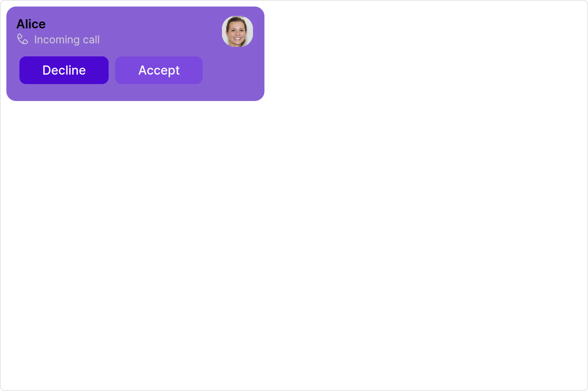
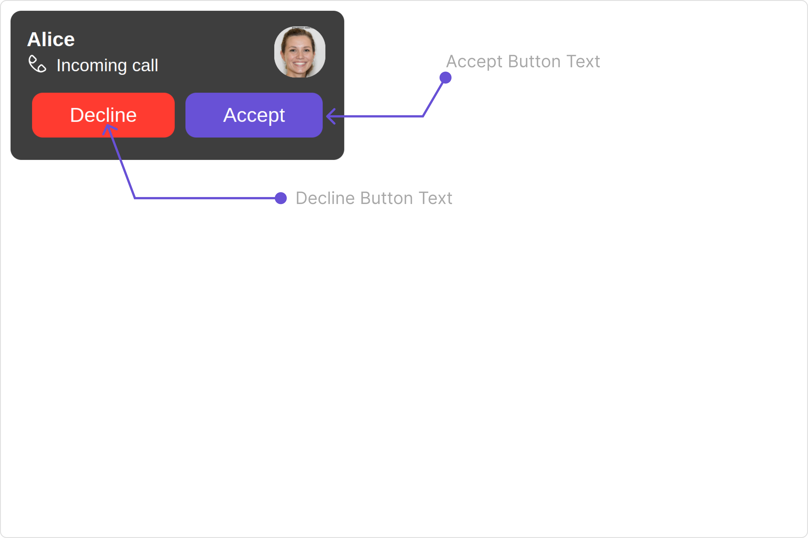
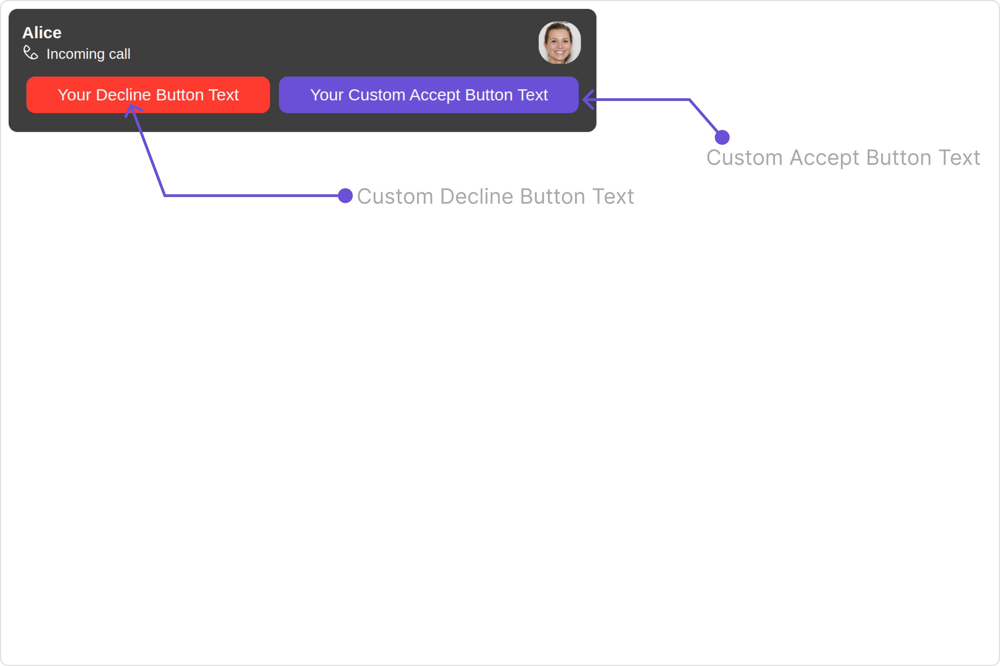
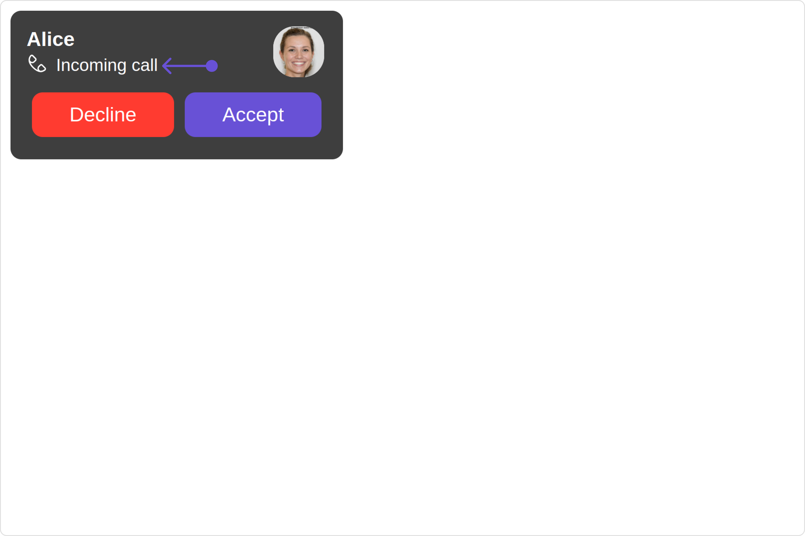
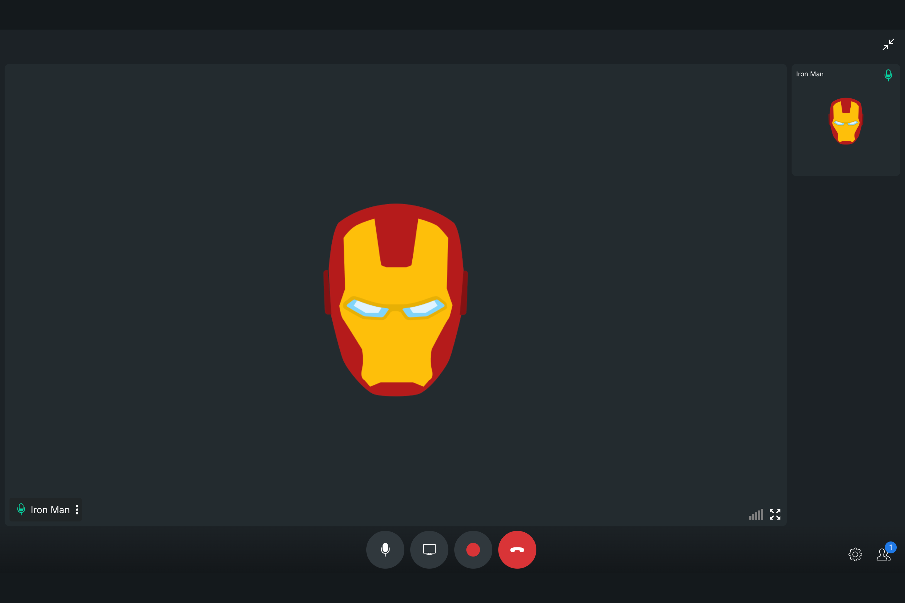

import Tabs from '@theme/Tabs';
import TabItem from '@theme/TabItem';

## Overview

The `Incoming call` is a [Component](./components-overview#components) that serves as a visual representation when the user receives an incoming call, such as a voice call or video call, providing options to answer or decline the call.


The `Incoming Call` is comprised of the following base components:

| Components                         | Description                                                                                                                                    |
| ---------------------------------- | ---------------------------------------------------------------------------------------------------------------------------------------------- |
| [cometchat-list-item](./list-item) | This component’s view consists of avatar, status indicator , title, and subtitle. The fields are then mapped with the SDK’s user, group class. |
| [cometchat-icon](./icon)           | This component displays an icon. It currently supports only svg icons                                                                          |
| [cometchat-label](./label)         | This component provides descriptive information about the associated UI element.                                                               |
| cometchat-button                   | This component represents a button with optional icon and text.                                                                                |
| [cometchat-avatar](./avatar)       | This component component displays an image or user's avatar with fallback to the first two letters of the username                             |

## Usage

### Integration

<Tabs>
<TabItem value="IncomingCallsDemo" label="IncomingCallsDemo.tsx">

```tsx
import { CometChatIncomingCall } from "@cometchat/chat-uikit-react";
import React from "react";

const IncomingCallsDemo = () => {
  return <CometChatIncomingCall />;
};

export default IncomingCallsDemo;
```

</TabItem>

<TabItem value="ts" label="App.tsx">

```jsx
import { IncomingCallsDemo } from "./IncomingCallsDemo";

export default function App() {
  return (
    <div className="App">
      <div>
        <IncomingCallsDemo />
      </div>
    </div>
  );
}
```

</TabItem>
</Tabs>

### Actions

[Actions](./components-overview#actions) dictate how a component functions. They are divided into two types: Predefined and User-defined. You can override either type, allowing you to tailor the behavior of the component to fit your specific needs.

##### 1. onAccept

`onAccept` is triggered when you click the accept button of the `Incoming Call` component. You can override this action using the following code snippet.

<Tabs>
<TabItem value="TypeScript" label="TypeScript">

```tsx title='IncomingCallsDemo.tsx'
import { CometChatIncomingCall } from "@cometchat/chat-uikit-react";
import React from "react";

const IncomingCallsDemo = () => {
  const handleOnAccept = () => {
    console.log("custom on accept action");
  };

  return <CometChatIncomingCall onAccept={handleOnAccept} />;
};

export default IncomingCallsDemo;
```

</TabItem>
<TabItem value="JavaScript" label="JavaScript">

```jsx title='IncomingCallsDemo.jsx'
import { CometChatIncomingCall } from "@cometchat/chat-uikit-react";
import React from "react";

const IncomingCallsDemo = () => {
  const handleOnAccept = () => {
    console.log("custom on accept action");
  };

  return <CometChatIncomingCall onAccept={handleOnAccept} />;
};

export default IncomingCallsDemo;
```

</TabItem>
</Tabs>

##### 2. onDecline

`onDecline` is triggered when you click the Decline button of the `Incoming Call` component. You can override this action using the following code snippet.

<Tabs>
<TabItem value="TypeScript" label="TypeScript">

```tsx title='IncomingCallsDemo.tsx'
import { CometChatIncomingCall } from "@cometchat/chat-uikit-react";
import React from "react";

const IncomingCallsDemo = () => {
  const handleOnDecline = () => {
    console.log("your custom on decline action");
  };

  return <CometChatIncomingCall onDecline={handleOnDecline} />;
};

export default IncomingCallsDemo;
```

</TabItem>
<TabItem value="JavaScript" label="JavaScript">

```jsx title='IncomingCallsDemo.jsx'
import { CometChatIncomingCall } from "@cometchat/chat-uikit-react";
import React from "react";

const IncomingCallsDemo = () => {
  const handleOnDecline = () => {
    console.log("your custom on decline action");
  };

  return <CometChatIncomingCall onDecline={handleOnDecline} />;
};

export default IncomingCallsDemo;
```

</TabItem>
</Tabs>

##### 3. onError

This action doesn't change the behavior of the component but rather listens for any errors that occur in the Incoming Call component.

<Tabs>
<TabItem value="TypeScript" label="TypeScript">

```tsx title='IncomingCallsDemo.tsx'
import { CometChatIncomingCall } from "@cometchat/chat-uikit-react";
import React from "react";

const IncomingCallsDemo = () => {
  const handleOnError = () => {
    console.log("your custom on error action");
  };

  return <CometChatIncomingCall onError={handleOnError} />;
};

export default IncomingCallsDemo;
```

</TabItem>
<TabItem value="JavaScript" label="JavaScript">

```jsx title='IncomingCallsDemo.jsx'
import { CometChatIncomingCall } from "@cometchat/chat-uikit-react";
import React from "react";

const IncomingCallsDemo = () => {
  const handleOnError = () => {
    console.log("your custom on error action");
  };

  return <CometChatIncomingCall onError={handleOnError} />;
};

export default IncomingCallsDemo;
```

</TabItem>
</Tabs>

---

### Filters

**Filters** allow you to customize the data displayed in a list within a `Component`. You can filter the list based on your specific criteria, allowing for a more customized. Filters can be applied using `RequestBuilders` of Chat SDK.

The `Incoming Call` component does not have any exposed filters.

### Events

[Events](./components-overview#events) are emitted by a `Component`. By using event you can extend existing functionality. Being global events, they can be applied in Multiple Locations and are capable of being Added or Removed.

The list of events emitted by the Incoming Call component is as follows.

| Event              | Description                                                                  |
| ------------------ | ---------------------------------------------------------------------------- |
| **ccCallRejected** | This event is triggered when the initiated call is rejected by the receiver. |
| **ccCallAccepted** | This event is triggered when the initiated call is accepted by the receiver. |
| **ccCallEnded**    | This event is triggered when the initiated call successfully ends.           |

<Tabs>

<TabItem value="js" label="Add Listener">

```javascript
const ccCallRejected = CometChatCallEvents.ccCallRejected.subscribe(
  (call: CometChat.Call) => {
    //Your Code
  }
);

const ccCallAccepted = CometChatCallEvents.ccCallAccepted.subscribe(
  (call: CometChat.Call) => {
    //Your Code
  }
);

const ccCallEnded = CometChatCallEvents.ccCallEnded.subscribe(
  (call: CometChat.Call) => {
    //Your Code
  }
);
```

</TabItem>

</Tabs>

---

<Tabs>

<TabItem value="js" label="Remove Listener">

```javascript
ccCallRejected?.unsubscribe();

ccCallAccepted?.unsubscribe();

ccCallEnded?.unsubscribe();
```

</TabItem>

</Tabs>

---

## Customization

To fit your app's design requirements, you can customize the appearance of the Incoming Call component. We provide exposed methods that allow you to modify the experience and behavior according to your specific needs.

### Style

Using Style you can customize the look and feel of the component in your app, These parameters typically control elements such as the color, size, shape, and fonts used within the component.

##### 1. IncomingCall Style

To customize the appearance, you can assign a `IncomingCallStyle` object to the `Incoming Call` component.



**Example**

In this example, we are employing the `IncomingCallStyle`.

<Tabs>
<TabItem value="TypeScript" label="TypeScript">

```tsx title='IncomingCallsDemo.tsx'
import {
  CometChatIncomingCall,
  IncomingCallStyle,
} from "@cometchat/chat-uikit-react";
import React from "react";

const IncomingCallsDemo = () => {
  const incomingCallStyle = new IncomingCallStyle({
    acceptButtonBackground: "#7b49de",
    acceptButtonTextColor: "#ffffff",
    background: "#8761d4",
    declineButtonBackground: "#4b08d1",
  });

  return <CometChatIncomingCall incomingCallStyle={incomingCallStyle} />;
};

export default IncomingCallsDemo;
```

</TabItem>
<TabItem value="JavaScript" label="JavaScript">

```jsx title='IncomingCallsDemo.jsx'
import {
  CometChatIncomingCall,
  IncomingCallStyle,
} from "@cometchat/chat-uikit-react";
import React from "react";

const IncomingCallsDemo = () => {
  const incomingCallStyle = new IncomingCallStyle({
    acceptButtonBackground: "#7b49de",
    acceptButtonTextColor: "#ffffff",
    background: "#8761d4",
    declineButtonBackground: "#4b08d1",
  });

  return <CometChatIncomingCall incomingCallStyle={incomingCallStyle} />;
};

export default IncomingCallsDemo;
```

</TabItem>
</Tabs>

The following properties are exposed by IncomingCallStyle:

| Property                      | Description                                 | Code                                  |
| ----------------------------- | ------------------------------------------- | ------------------------------------- |
| **border**                    | Used to set border                          | `border?: string,`                    |
| **borderRadius**              | Used to set border radius                   | `borderRadius?: string;`              |
| **background**                | Used to set background colour               | `background?: string;`                |
| **height**                    | Used to set height                          | `height?: string;`                    |
| **width**                     | Used to set width                           | `width?: string;`                     |
| **titleTextFont**             | Used to set title text font                 | `titleTextFont?: string,`             |
| **titleTextColor**            | Used to set title text color                | `titleTextColor?: string;`            |
| **subtitleTextFont**          | Used to set subtitle text font              | `subtitleTextFont?: string;`          |
| **subtitleTextColor**         | Used to set subtitle text color             | `subtitleTextColor?: string;`         |
| **acceptButtonTextFont**      | Used to set accept button text font         | `acceptButtonTextFont?: string;`      |
| **acceptButtonTextColor**     | Used to set accept button text color        | `acceptButtonTextColor?: string;`     |
| **acceptButtonBackground**    | Used to set accept button background color  | `acceptButtonBackground?: string;`    |
| **acceptButtonBorderRadius**  | Used to set accept button border radius     | `acceptButtonBorderRadius?: string;`  |
| **acceptButtonBorder**        | Used to set accept button border            | `acceptButtonBorder?: string;`        |
| **declineButtonTextFont**     | Used to set decline button text font        | `declineButtonTextFont?: string;`     |
| **declineButtonTextColor**    | Used to set decline button text color       | `declineButtonTextColor?: string;`    |
| **declineButtonBackground**   | Used to set decline button background color | `declineButtonBackground?: string;`   |
| **declineButtonBorderRadius** | Used to set decline button border radius    | `declineButtonBorderRadius?: string;` |
| **declineButtonBorder**       | Used to set decline button border           | `declineButtonBorder?: string;`       |

##### 2. Avatar Style

If you want to apply customized styles to the `Avatar` component within the `Incoming Call` Component, you can use the following code snippet. For more information you can refer [Avatar Styles](./avatar#avatar-style).

<Tabs>
<TabItem value="TypeScript" label="TypeScript">

```tsx title='IncomingCallsDemo.tsx'
import {
  CometChatIncomingCall,
  AvatarStyle,
} from "@cometchat/chat-uikit-react";
import React from "react";

const IncomingCallsDemo = () => {
  const avatarStyle = new AvatarStyle({
    backgroundColor: "#cdc2ff",
    border: "2px solid #6745ff",
    borderRadius: "10px",
    outerViewBorderColor: "#ca45ff",
    outerViewBorderRadius: "5px",
    nameTextColor: "#4554ff",
  });

  return <CometChatIncomingCall avatarStyle={avatarStyle} />;
};

export default IncomingCallsDemo;
```

</TabItem>
<TabItem value="JavaScript" label="JavaScript">

```jsx title='IncomingCallsDemo.jsx'
import {
  CometChatIncomingCall,
  AvatarStyle,
} from "@cometchat/chat-uikit-react";
import React from "react";

const IncomingCallsDemo = () => {
  const avatarStyle = new AvatarStyle({
    backgroundColor: "#cdc2ff",
    border: "2px solid #6745ff",
    borderRadius: "10px",
    outerViewBorderColor: "#ca45ff",
    outerViewBorderRadius: "5px",
    nameTextColor: "#4554ff",
  });

  return <CometChatIncomingCall avatarStyle={avatarStyle} />;
};

export default IncomingCallsDemo;
```

</TabItem>
</Tabs>

##### 3. ListItem Style

If you want to apply customized styles to the `ListItemStyle` component within the `Incoming Call` Component, you can use the following code snippet. For more information, you can refer [ListItem Styles](./list-item#listitemstyle).

<Tabs>
<TabItem value="TypeScript" label="TypeScript">

```tsx title='IncomingCallsDemo.tsx'
import {
  CometChatIncomingCall,
  ListItemStyle,
} from "@cometchat/chat-uikit-react";
import React from "react";

const IncomingCallsDemo = () => {
  const listItemStyle = new ListItemStyle({
    width: "100%",
    height: "100%",
    border: "2px solid #cdc2ff",
  });

  return <CometChatIncomingCall listItemStyle={listItemStyle} />;
};

export default IncomingCallsDemo;
```

</TabItem>
<TabItem value="JavaScript" label="JavaScript">

```jsx title='IncomingCallsDemo.jsx'
import {
  CometChatIncomingCall,
  ListItemStyle,
} from "@cometchat/chat-uikit-react";
import React from "react";

const IncomingCallsDemo = () => {
  const listItemStyle = new ListItemStyle({
    width: "100%",
    height: "100%",
    border: "2px solid #cdc2ff",
  });

  return <CometChatIncomingCall listItemStyle={listItemStyle} />;
};

export default IncomingCallsDemo;
```

</TabItem>
</Tabs>

---

### Functionality

These are a set of small functional customizations that allow you to fine-tune the overall experience of the component. With these, you can change text, set custom icons, and toggle the visibility of UI elements.

Here is a code snippet demonstrating how you can customize the functionality of the `Incoming Call` component.

<Tabs>
<TabItem value="TypeScript" label="TypeScript">

```tsx title='IncomingCallsDemo.tsx'
import { CometChatIncomingCall } from "@cometchat/chat-uikit-react";
import React from "react";

const IncomingCallsDemo = () => {
  return (
    <CometChatIncomingCall
      acceptButtonText="Your Custom Accept Button Text"
      declineButtonText="Your Decline Button Text"
      disableSoundForCalls={true}
    />
  );
};

export default IncomingCallsDemo;
```

</TabItem>
<TabItem value="JavaScript" label="JavaScript">

```jsx title='IncomingCallsDemo.jsx'
import { CometChatIncomingCall } from "@cometchat/chat-uikit-react";
import React from "react";

const IncomingCallsDemo = () => {
  return (
    <CometChatIncomingCall
      acceptButtonText="Your Custom Accept Button Text"
      declineButtonText="Your Decline Button Text"
      disableSoundForCalls={true}
    />
  );
};

export default IncomingCallsDemo;
```

</TabItem>
</Tabs>

Default:



Custom:


Below is a list of customizations along with corresponding code snippets

| Property                 | Description                                                                       | Code                                                |
| ------------------------ | --------------------------------------------------------------------------------- | --------------------------------------------------- |
| **acceptButtonText**     | Used to set custom accept button text                                             | `acceptButtonText='Your Custom Accept Button Text'` |
| **declineButtonText**    | Used to set custom decline button text                                            | `declineButtonText='Your Decline Button Text'`      |
| **customSoundForCalls**  | Used to set custom sound for incoming calls                                       | `customSoundForCalls='Your Custom Sound For Calls'` |
| **disableSoundForCalls** | Used to disable/enable the sound of incoming calls, by default it is set to false | `disableSoundForCalls={true}`                       |
| **call**                 | CometChat call object consumed by the component to launch itself                  | `call={callObject}`                                 |

---

### Advanced

For advanced-level customization, you can set custom views to the component. This lets you tailor each aspect of the component to fit your exact needs and application aesthetics. You can create and define your views, layouts, and UI elements and then incorporate those into the component.

---

#### SubtitleView

By using the `subtitleView` property, you can modify the SubtitleView to meet your specific needs.

```javascript
subtitleView = { getSubtitleView };
```

**Example**

Default:



Custom:


<Tabs>
<TabItem value="TypeScript" label="TypeScript">

```tsx title='IncomingCallsDemo.tsx'
import { CometChat } from "@cometchat/chat-sdk-javascript";
import { CometChatIncomingCall } from "@cometchat/chat-uikit-react";
import React from "react";

const IncomingCallsDemo = () => {
  const getSubtitleView = (user: CometChat.User): JSX.Element => {
    function formatTime(timestamp: number) {
      const date = new Date(timestamp * 1000);
      return date.toLocaleString();
    }
    if (user instanceof CometChat.User) {
      return (
        <div
          style={{
            display: "flex",
            alignItems: "left",
            padding: "2px",
            fontSize: "10px",
          }}
        >
          <div style={{ color: "gray" }}>
            Last Active At: {formatTime(user.getLastActiveAt())}
          </div>
        </div>
      );
    } else {
      return <></>;
    }
  };

  return <CometChatIncomingCall subtitleView={getSubtitleView} />;
};

export default IncomingCallsDemo;
```

</TabItem>
<TabItem value="JavaScript" label="JavaScript">

```jsx title='IncomingCallsDemo.jsx'
import { CometChat } from "@cometchat/chat-sdk-javascript";
import { CometChatIncomingCall } from "@cometchat/chat-uikit-react";
import React from "react";

const IncomingCallsDemo = () => {
  const getSubtitleView = (user) => {
    function formatTime(timestamp) {
      const date = new Date(timestamp * 1000);
      return date.toLocaleString();
    }
    if (user instanceof CometChat.User) {
      return (
        <div
          style={{
            display: "flex",
            alignItems: "left",
            padding: "2px",
            fontSize: "10px",
          }}
        >
          <div style={{ color: "gray" }}>
            Last Active At: {formatTime(user.getLastActiveAt())}
          </div>
        </div>
      );
    } else {
      return <></>;
    }
  };

  return <CometChatIncomingCall subtitleView={getSubtitleView} />;
};

export default IncomingCallsDemo;
```

</TabItem>
</Tabs>

---

## Configuration

Configurations offer the ability to customize the properties of each individual component within a Composite Component.

The Incoming Call Component is a Composite Component and it has a specific set of configuration for each of its components.

### OngoingCall

If you want to customize the properties of the [OngoingCall](./ongoing-call) Component inside Incoming Call Component, you need use the `CallScreenConfiguration` object.

The `OngoingCallConfiguration` provides access to all the [Action](./ongoing-call#actions), [Filters](./ongoing-call#filters), [Styles](./ongoing-call#style), [Functionality](./ongoing-call#functionality), and [Advanced](./ongoing-call#advanced) properties of the [OngoingCall](./ongoing-call) component.

> Please note that the properties marked with the <a><span class="material-icons red">report</span></a> symbol are not accessible within the Configuration Object.

**Example**


In this example, we will show how you can display the call recording button in the [OngoingCall](./ongoing-call) component using `ongoingCallConfiguration`.

<Tabs>
<TabItem value="TypeScript" label="TypeScript">

```tsx title='IncomingCallsDemo.tsx'
import { CometChat } from "@cometchat/chat-sdk-javascript";
import {
  CometChatIncomingCall,
  CallScreenConfiguration,
} from "@cometchat/chat-uikit-react";
import React from "react";

const IncomingCallsDemo = () => {
  function customSettingBuilderForIncoming(call: any) {
    const builder = new CometChatUIKitCalls.CallSettingsBuilder();
    if (call?.getType() == CometChatUIKitConstants.MessageTypes.audio) {
      builder
        .enableDefaultLayout(true)
        .setIsAudioOnlyCall(true)
        .showRecordingButton(true);
    } else if (call?.getType() == CometChatUIKitConstants.MessageTypes.video) {
      builder
        .enableDefaultLayout(true)
        .setIsAudioOnlyCall(false)
        .showRecordingButton(true);
    }
    return builder;
  }
  return (
    <CometChatIncomingCall
      ongoingCallConfiguration={
        new CallScreenConfiguration({
          callSettingsBuilder: customSettingBuilderForIncoming,
        })
      }
    />
  );
};

export default IncomingCallsDemo;
```

</TabItem>
<TabItem value="JavaScript" label="JavaScript">

```jsx title='IncomingCallsDemo.jsx'
import { CometChat } from "@cometchat/chat-sdk-javascript";
import {
  CometChatIncomingCall,
  CallScreenConfiguration,
} from "@cometchat/chat-uikit-react";
import React from "react";

const IncomingCallsDemo = () => {
  function customSettingBuilderForIncoming(call) {
    const builder = new CometChatUIKitCalls.CallSettingsBuilder();
    if (call?.getType() == CometChatUIKitConstants.MessageTypes.audio) {
      builder
        .enableDefaultLayout(true)
        .setIsAudioOnlyCall(true)
        .showRecordingButton(true);
    } else if (call?.getType() == CometChatUIKitConstants.MessageTypes.video) {
      builder
        .enableDefaultLayout(true)
        .setIsAudioOnlyCall(false)
        .showRecordingButton(true);
    }
    return builder;
  }
  return (
    <CometChatIncomingCall
      ongoingCallConfiguration={
        new CallScreenConfiguration({
          callSettingsBuilder: customSettingBuilderForIncoming,
        })
      }
    />
  );
};

export default IncomingCallsDemo;
```

</TabItem>
</Tabs>

---
