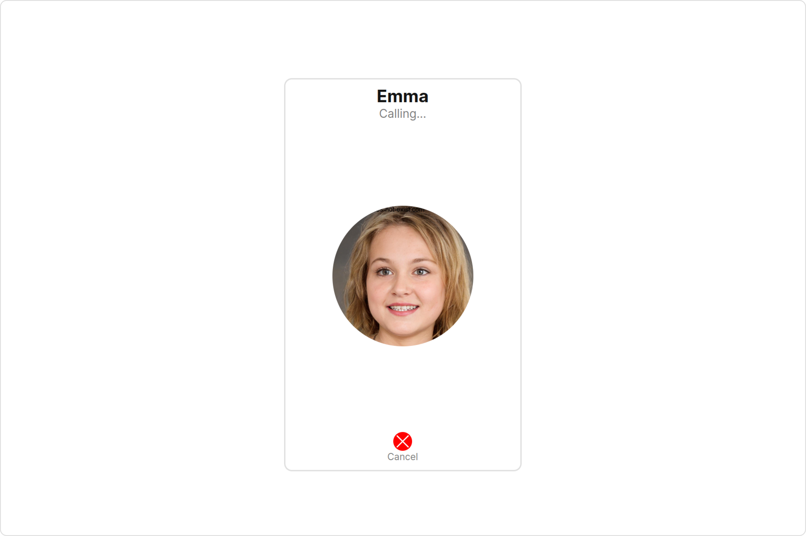
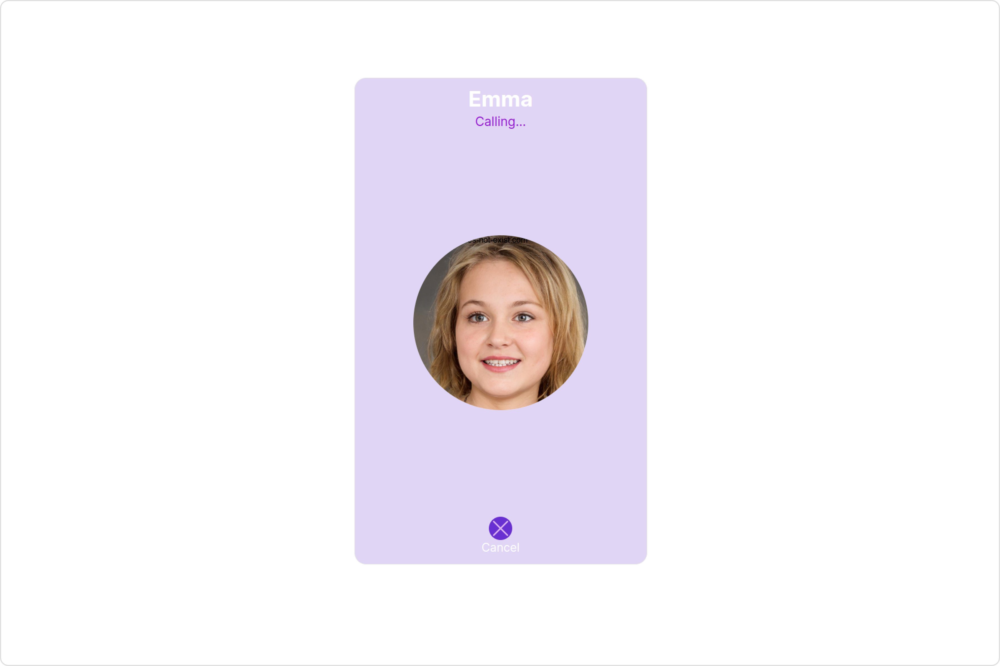
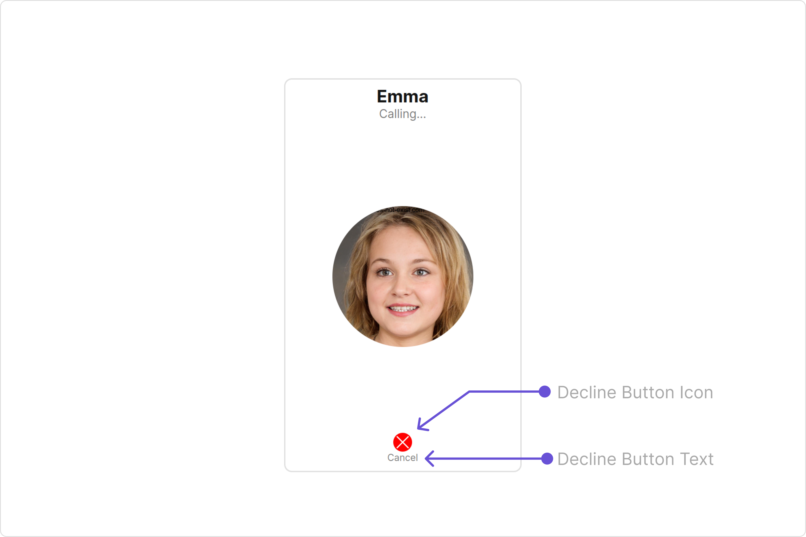
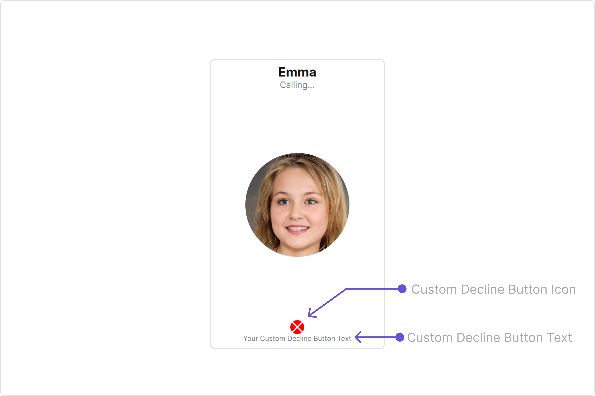

import Tabs from '@theme/Tabs';
import TabItem from '@theme/TabItem';

## Overview

The outgoing call component is a visual representation of a user-initiated call, whether it's a voice or video call. It serves as an interface for managing outgoing calls, providing users with essential options to control the call experience. This component typically includes information about the call recipient, call controls for canceling the call, and feedback on the call status, such as indicating when the call is in progress.



The `Outgoing Call` is comprised of the following components:

| Components                 | Description                                                                                                                              |
| -------------------------- | ---------------------------------------------------------------------------------------------------------------------------------------- |
| cometchat-card             | this component displays structured content, often used for user profiles, chat messages, or group information in CometChat applications. |
| [cometchat-label](./label) | This component provides descriptive information about the associated UI element.                                                         |
| cometchat-icon-button      | The CometChat IconButton component allows for the easy integration of customizable icon buttons                                          |

## Usage

### Integration

<Tabs>
<TabItem value="OutgoingCallDemo" label="OutgoingCallDemo.tsx">

```tsx
import { CometChat } from "@cometchat/chat-sdk-javascript";
import {
  CometChatOutgoingCall,
  CometChatUIKitConstants,
} from "@cometchat/chat-uikit-react";
import React from "react";

const OutgoingCallDemo = () => {
  const [call, setCall] = React.useState<CometChat.Call>();

  React.useEffect(() => {
    const uid = "uid";

    const callObject = new CometChat.Call(
      uid,
      CometChatUIKitConstants.MessageTypes.audio,
      CometChatUIKitConstants.MessageReceiverType.user
    );
    CometChat.initiateCall(callObject)
      .then((c) => {
        setCall(c);
      })
      .catch(console.log);
  }, []);

  return call ? <CometChatOutgoingCall call={call} /> : null;
};

export default OutgoingCallDemo;
```

</TabItem>

<TabItem value="ts" label="App.tsx">

```jsx
import { OutgoingCallDemo } from "./OutgoingCallDemo";

export default function App() {
  return (
    <div className="App">
      <div>
        <OutgoingCallDemo />
      </div>
    </div>
  );
}
```

</TabItem>
</Tabs>

### Actions

[Actions](./components-overview#actions) dictate how a component functions. They are divided into two types: Predefined and User-defined. You can override either type, allowing you to tailor the behavior of the component to fit your specific needs.

##### 1. onCloseClicked

The `onCloseClicked` event gets activated when the close button is clicked. It does not have a default behavior. However, you can override its behavior using the following code snippet.

<Tabs>
<TabItem value="TypeScript" label="TypeScript">

```tsx title='OutgoingCallDemo.tsx'
import { CometChat } from "@cometchat/chat-sdk-javascript";
import {
  CometChatOutgoingCall,
  CometChatUIKitConstants,
} from "@cometchat/chat-uikit-react";
import React from "react";

const OutgoingCallDemo = () => {
  const [call, setCall] = React.useState<CometChat.Call>();

  React.useEffect(() => {
    const uid = "uid";

    const callObject = new CometChat.Call(
      uid,
      CometChatUIKitConstants.MessageTypes.audio,
      CometChatUIKitConstants.MessageReceiverType.user
    );
    CometChat.initiateCall(callObject)
      .then((c) => {
        setCall(c);
      })
      .catch(console.log);
  }, []);

  const cancelCall = () => {
    //your custom close click actions
    CometChat.endCall(call!.getSessionId()).then(() => {
      setCall(undefined);
    });
  };
  return call ? (
    <CometChatOutgoingCall call={call} onCloseClicked={cancelCall} />
  ) : null;
};

export default OutgoingCallDemo;
```

</TabItem>
<TabItem value="JavaScript" label="JavaScript">

```jsx title='OutgoingCallDemo.jsx'

import React, { useState, useEffect } from 'react';
import { CometChat } from '@cometchat/chat-sdk-javascript';
import { CometChatOutgoingCall, CometChatUIKitConstants } from '@cometchat/chat-uikit-react';

const OutgoingCallDemo = () => {
    const [call, setCall] = useState(null);

    useEffect(() => {
        const uid = "uid";

        const callObject = new CometChat.Call(
            uid,
            CometChatUIKitConstants.MessageTypes.audio,
            CometChatUIKitConstants.MessageReceiverType.user
        );

        CometChat.initiateCall(callObject)
            .then((c) => {
                setCall(c);
            })
            .catch(console.log);
    }, []);

    const cancelCall = () =>{
        //your custom close click actions
        CometChat.endCall(call!.getSessionId())
        .then(() => {
           setCall(undefined);
        })
    };
    return (
        call && (
          <CometChatOutgoingCall call={call} onCloseClicked={cancelCall} />
        )
    );
};

export default OutgoingCallDemo;

```

</TabItem>
</Tabs>

##### 2. onError

This action doesn't change the behavior of the component but rather listens for any errors that occur in the Outgoing Call component.

<Tabs>
<TabItem value="TypeScript" label="TypeScript">

```tsx title='OutgoingCallDemo.tsx'
import { CometChat } from "@cometchat/chat-sdk-javascript";
import {
  CometChatOutgoingCall,
  CometChatUIKitConstants,
} from "@cometchat/chat-uikit-react";
import React from "react";

const OutgoingCallDemo = () => {
  const [call, setCall] = React.useState<CometChat.Call>();

  React.useEffect(() => {
    const uid = "uid";

    const callObject = new CometChat.Call(
      uid,
      CometChatUIKitConstants.MessageTypes.audio,
      CometChatUIKitConstants.MessageReceiverType.user
    );
    CometChat.initiateCall(callObject)
      .then((c) => {
        setCall(c);
      })
      .catch(console.log);
  }, []);

  function handleOnError() {
    //Your Custom Error Actions
  }

  return call ? (
    <CometChatOutgoingCall call={call} onError={handleOnError} />
  ) : null;
};

export default OutgoingCallDemo;
```

</TabItem>
<TabItem value="JavaScript" label="JavaScript">

```jsx title='OutgoingCallDemo.jsx'
import React, { useState, useEffect } from "react";
import { CometChat } from "@cometchat/chat-sdk-javascript";
import {
  CometChatOutgoingCall,
  CometChatUIKitConstants,
} from "@cometchat/chat-uikit-react";

const OutgoingCallDemo = () => {
  const [call, setCall] = useState(null);

  useEffect(() => {
    const uid = "uid";

    const callObject = new CometChat.Call(
      uid,
      CometChatUIKitConstants.MessageTypes.audio,
      CometChatUIKitConstants.MessageReceiverType.user
    );

    CometChat.initiateCall(callObject)
      .then((c) => {
        setCall(c);
      })
      .catch(console.log);
  }, []);

  function handleOnError() {
    //Your Custom Error Actions
  }
  return call && <CometChatOutgoingCall call={call} onError={handleOnError} />;
};

export default OutgoingCallDemo;
```

</TabItem>
</Tabs>

---

### Filters

**Filters** allow you to customize the data displayed in a list within a `Component`. You can filter the list based on your specific criteria, allowing for a more customized. Filters can be applied using `RequestBuilders` of Chat SDK.

The `Outgoing Call` component does not have any exposed filters.

---

### Events

[Events](./components-overview#events) are emitted by a `Component`. By using event you can extend existing functionality. Being global events, they can be applied in Multiple Locations and are capable of being Added or Removed.

The `Outgoing Call` component does not have any exposed filters.

---

## Customization

To fit your app's design requirements, you can customize the appearance of the Outgoing Call component. We provide exposed methods that allow you to modify the experience and behavior according to your specific needs.

### Style

Using Style you can customize the look and feel of the component in your app, These parameters typically control elements such as the color, size, shape, and fonts used within the component.

##### 1. OutgoingCall Style

To customize the appearance, you can assign a `OutgoingCallStyle` object to the `Outgoing Call` component.



**Example**

In this example, we are employing the `outgoingCallStyle`.

<Tabs>
<TabItem value="TypeScript" label="TypeScript">

```tsx title='OutgoingCallDemo.tsx'
import { CometChat } from "@cometchat/chat-sdk-javascript";
import {
  CometChatOutgoingCall,
  CometChatUIKitConstants,
  OutgoingCallStyle,
} from "@cometchat/chat-uikit-react";
import React from "react";

const OutgoingCallDemo = () => {
  const [call, setCall] = React.useState<CometChat.Call>();

  React.useEffect(() => {
    const uid = "uid";

    const callObject = new CometChat.Call(
      uid,
      CometChatUIKitConstants.MessageTypes.audio,
      CometChatUIKitConstants.MessageReceiverType.user
    );
    CometChat.initiateCall(callObject)
      .then((c) => {
        setCall(c);
      })
      .catch(console.log);
  }, []);

  const outgoingCallStyle = new OutgoingCallStyle({
    background: "#e0d5f5",
    declineButtonIconBackground: "#6830d1",
    height: "500px",
    width: "300px",
    declineButtonTextColor: "#ffffff",
    titleTextColor: "#ffffff",
    subtitleTextColor: "#9213d6",
    declineButtonIconTint: "#dbb1f2",
    border: "1px solid #e6e6e6",
    borderRadius: "12px",
  });

  return call ? (
    <CometChatOutgoingCall call={call} outgoingCallStyle={outgoingCallStyle} />
  ) : null;
};

export default OutgoingCallDemo;
```

</TabItem>
<TabItem value="JavaScript" label="JavaScript">

```jsx title='OutgoingCallDemo.jsx'
import React, { useState, useEffect } from "react";
import { CometChat } from "@cometchat/chat-sdk-javascript";
import {
  CometChatOutgoingCall,
  CometChatUIKitConstants,
  OutgoingCallStyle,
} from "@cometchat/chat-uikit-react";

const OutgoingCallDemo = () => {
  const [call, setCall] = useState(null);

  useEffect(() => {
    const uid = "uid";

    const callObject = new CometChat.Call(
      uid,
      CometChatUIKitConstants.MessageTypes.audio,
      CometChatUIKitConstants.MessageReceiverType.user
    );

    CometChat.initiateCall(callObject)
      .then((c) => {
        setCall(c);
      })
      .catch(console.log);
  }, []);

  const outgoingCallStyle = new OutgoingCallStyle({
    background: "#e0d5f5",
    declineButtonIconBackground: "#6830d1",
    height: "500px",
    width: "300px",
    declineButtonTextColor: "#ffffff",
    titleTextColor: "#ffffff",
    subtitleTextColor: "#9213d6",
    declineButtonIconTint: "#dbb1f2",
    border: "1px solid #e6e6e6",
    borderRadius: "12px",
  });
  return (
    call && (
      <CometChatOutgoingCall
        call={call}
        outgoingCallStyle={outgoingCallStyle}
      />
    )
  );
};

export default OutgoingCallDemo;
```

</TabItem>
</Tabs>

The following properties are exposed by OutgoingCallStyle:

| Property                        | Description                                      | Code                                    |
| ------------------------------- | ------------------------------------------------ | --------------------------------------- |
| **border**                      | Used to set border                               | `border?: string,`                      |
| **borderRadius**                | Used to set border radius                        | `borderRadius?: string;`                |
| **background**                  | Used to set background colour                    | `background?: string;`                  |
| **height**                      | Used to set height                               | `height?: string;`                      |
| **width**                       | Used to set width                                | `width?: string;`                       |
| **titleTextFont**               | Used to set title text font                      | `titleTextFont?: string,`               |
| **titleTextColor**              | Used to set title text color                     | `titleTextColor?: string;`              |
| **subtitleTextFont**            | Used to set subtitle text font                   | `subtitleTextFont?: string;`            |
| **subtitleTextColor**           | Used to set subtitle text color                  | `subtitleTextColor?: string;`           |
| **declineButtonTextFont**       | Used to set decline button text font             | `declineButtonTextFont?: string;`       |
| **declineButtonTextColor**      | Used to set decline button text color            | `declineButtonTextColor?: string;`      |
| **declineButtonIconTint**       | Used to set decline button icon tint             | `declineButtonIconTint?: string;`       |
| **declineButtonIconBackground** | Used to set decline button icon background color | `declineButtonIconBackground?: string;` |

---

##### 2. Avatar Style

If you want to apply customized styles to the `Avatar` component within the `Outgoing Call` Component, you can use the following code snippet. For more information you can refer [Avatar Styles](./avatar#avatar-style).

<Tabs>
<TabItem value="TypeScript" label="TypeScript">

```tsx title='OutgoingCallDemo.tsx'
import { CometChat } from "@cometchat/chat-sdk-javascript";
import {
  CometChatOutgoingCall,
  CometChatUIKitConstants,
  AvatarStyle,
} from "@cometchat/chat-uikit-react";
import React from "react";

const OutgoingCallDemo = () => {
  const [call, setCall] = React.useState<CometChat.Call>();

  React.useEffect(() => {
    const uid = "uid";

    const callObject = new CometChat.Call(
      uid,
      CometChatUIKitConstants.MessageTypes.audio,
      CometChatUIKitConstants.MessageReceiverType.user
    );
    CometChat.initiateCall(callObject)
      .then((c) => {
        setCall(c);
      })
      .catch(console.log);
  }, []);

  const avatarStyle = new AvatarStyle({
    backgroundColor: "#cdc2ff",
    border: "2px solid #6745ff",
    borderRadius: "10px",
    outerViewBorderColor: "#ca45ff",
    outerViewBorderRadius: "5px",
    nameTextColor: "#4554ff",
  });

  return call ? (
    <CometChatOutgoingCall call={call} avatarStyle={avatarStyle} />
  ) : null;
};

export default OutgoingCallDemo;
```

</TabItem>
<TabItem value="JavaScript" label="JavaScript">

```jsx title='OutgoingCallDemo.jsx'
import React, { useState, useEffect } from "react";
import { CometChat } from "@cometchat/chat-sdk-javascript";
import {
  CometChatOutgoingCall,
  CometChatUIKitConstants,
  AvatarStyle,
} from "@cometchat/chat-uikit-react";

const OutgoingCallDemo = () => {
  const [call, setCall] = useState(null);

  useEffect(() => {
    const uid = "uid";

    const callObject = new CometChat.Call(
      uid,
      CometChatUIKitConstants.MessageTypes.audio,
      CometChatUIKitConstants.MessageReceiverType.user
    );

    CometChat.initiateCall(callObject)
      .then((c) => {
        setCall(c);
      })
      .catch(console.log);
  }, []);

  const avatarStyle = new AvatarStyle({
    backgroundColor: "#cdc2ff",
    border: "2px solid #6745ff",
    borderRadius: "10px",
    outerViewBorderColor: "#ca45ff",
    outerViewBorderRadius: "5px",
    nameTextColor: "#4554ff",
  });

  return (
    call && <CometChatOutgoingCall call={call} avatarStyle={avatarStyle} />
  );
};

export default OutgoingCallDemo;
```

</TabItem>
</Tabs>

---

### Functionality

These are a set of small functional customizations that allow you to fine-tune the overall experience of the component. With these, you can change text, set custom icons, and toggle the visibility of UI elements.

Here is a code snippet demonstrating how you can customize the functionality of the `Outgoing Call` component.

<Tabs>
<TabItem value="TypeScript" label="TypeScript">

```tsx title='OutgoingCallDemo.tsx'
import { CometChat } from "@cometchat/chat-sdk-javascript";
import {
  CometChatOutgoingCall,
  CometChatUIKitConstants,
} from "@cometchat/chat-uikit-react";
import React from "react";

const OutgoingCallDemo = () => {
  const [call, setCall] = React.useState<CometChat.Call>();

  React.useEffect(() => {
    const uid = "uid";

    const callObject = new CometChat.Call(
      uid,
      CometChatUIKitConstants.MessageTypes.audio,
      CometChatUIKitConstants.MessageReceiverType.user
    );
    CometChat.initiateCall(callObject)
      .then((c) => {
        setCall(c);
      })
      .catch(console.log);
  }, []);

  return call ? (
    <CometChatOutgoingCall
      call={call}
      declineButtonText="Your Custom Decline Button Text"
      disableSoundForCalls={false}
      declineButtonIconURL="Your Custom Decline Button Icon URL"
    />
  ) : null;
};

export default OutgoingCallDemo;
```

</TabItem>
<TabItem value="JavaScript" label="JavaScript">

```jsx title='OutgoingCallDemo.jsx'
import React, { useState, useEffect } from "react";
import { CometChat } from "@cometchat/chat-sdk-javascript";
import {
  CometChatOutgoingCall,
  CometChatUIKitConstants,
} from "@cometchat/chat-uikit-react";

const OutgoingCallDemo = () => {
  const [call, setCall] = useState(null);

  useEffect(() => {
    const uid = "uid";

    const callObject = new CometChat.Call(
      uid,
      CometChatUIKitConstants.MessageTypes.audio,
      CometChatUIKitConstants.MessageReceiverType.user
    );

    CometChat.initiateCall(callObject)
      .then((c) => {
        setCall(c);
      })
      .catch(console.log);
  }, []);

  return (
    call && (
      <CometChatOutgoingCall
        call={call}
        declineButtonText="Your Custom Decline Button Text"
        disableSoundForCalls={false}
        declineButtonIconURL="Your Custom Decline Button Icon URL"
      />
    )
  );
};

export default OutgoingCallDemo;
```

</TabItem>
</Tabs>

Default:


Custom:


Below is a list of customizations along with corresponding code snippets

| Property                 | Description                                                                       | Code                                                         |
| ------------------------ | --------------------------------------------------------------------------------- | ------------------------------------------------------------ |
| **declineButtonText**    | Used to set custom decline button text                                            | `declineButtonText='Your Custom Decline Button Text'`        |
| **declineButtonIconURL** | Used to set custom decline button icon URL                                        | `declineButtonIconURL='Your Custom Decline Button Icon URL'` |
| **customSoundForCalls**  | Used to set custom sound for calls                                                | `customSoundForCalls='Your Custom Sound For Calls'`          |
| **disableSoundForCalls** | Used to disable/enable the sound of Outgoing calls, by default it is set to false | `disableSoundForCalls={false}`                               |
| **call** <a data-tooltip-id="my-tooltip-html-prop"> <span class="material-icons red">report</span> </a>| Sets the call object for CometChatOutgoingCall| `call={call}`|

---

### Advanced

For advanced-level customization, you can set custom views to the component. This lets you tailor each aspect of the component to fit your exact needs and application aesthetics. You can create and define your views, layouts, and UI elements and then incorporate those into the component.

---

#### CustomView

By using the `customView` property, you can modify the CustomView to meet your specific needs.

```javascript
customView={getCustomView()}
```

**Example**

<Tabs>
<TabItem value="TypeScript" label="TypeScript">

```tsx title='OutgoingCallDemo.tsx'
import { CometChat } from "@cometchat/chat-sdk-javascript";
import {
  CometChatOutgoingCall,
  CometChatUIKitConstants,
} from "@cometchat/chat-uikit-react";
import React from "react";

const OutgoingCallDemo = () => {
  const [call, setCall] = React.useState<CometChat.Call>();

  React.useEffect(() => {
    const uid = "uid";

    const callObject = new CometChat.Call(
      uid,
      CometChatUIKitConstants.MessageTypes.audio,
      CometChatUIKitConstants.MessageReceiverType.user
    );
    CometChat.initiateCall(callObject)
      .then((c) => {
        setCall(c);
      })
      .catch(console.log);
  }, []);
  const getCustomView = () => {
    return <div> Your Custom View</div>;
  };
  return call ? (
    <CometChatOutgoingCall call={call} customView={getCustomView()} />
  ) : null;
};

export default OutgoingCallDemo;
```

</TabItem>
<TabItem value="JavaScript" label="JavaScript">

```jsx title='OutgoingCallDemo.jsx'
import React, { useState, useEffect } from "react";
import { CometChat } from "@cometchat/chat-sdk-javascript";
import {
  CometChatOutgoingCall,
  CometChatUIKitConstants,
} from "@cometchat/chat-uikit-react";

const OutgoingCallDemo = () => {
  const [call, setCall] = useState(null);

  useEffect(() => {
    const uid = "uid";

    const callObject = new CometChat.Call(
      uid,
      CometChatUIKitConstants.MessageTypes.audio,
      CometChatUIKitConstants.MessageReceiverType.user
    );

    CometChat.initiateCall(callObject)
      .then((c) => {
        setCall(c);
      })
      .catch(console.log);
  }, []);
  const getCustomView = () => {
    return <div> Your Custom View</div>;
  };
  return (
    call && <CometChatOutgoingCall call={call} customView={getCustomView()} />
  );
};

export default OutgoingCallDemo;
```

</TabItem>
</Tabs>

---

import { Tooltip } from 'react-tooltip'
import 'react-tooltip/dist/react-tooltip.css'

<Tooltip
  id="my-tooltip-html-prop"
  html="Not available in OutgoingCallConfiguration"
/>