import Tabs from '@theme/Tabs';
import TabItem from '@theme/TabItem';

## Overview

`CometChatCallLogs` is a [Component](./components-overview#components) that shows the list of Call Log available . By default, names are shown for all listed users, along with their avatar if available.

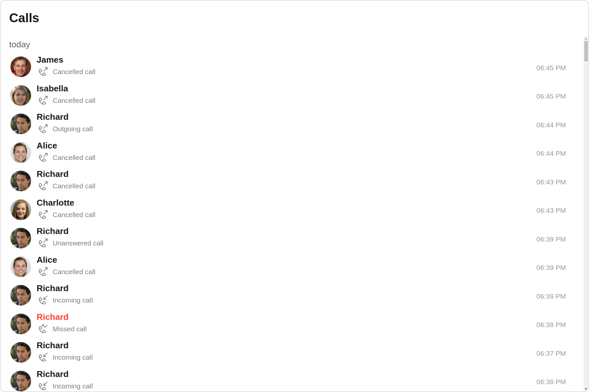

The `Call Logs` is comprised of the following components:

| Components                       | Description                                                                                                                 |
| -------------------------------- | --------------------------------------------------------------------------------------------------------------------------- |
| CometChatList                    | a reusable container component having title, search box, customisable background and a List View                            |
| [cometchat-backdrop](./backdrop) | This element represents the background against which other elements are presented.                                          |
| [CometChatListItem](./list-item) | a component that renders data obtained from a Group object on a Tile having a title, subtitle, leading and trailing view    |
| [cometchat-date](./date)         | This Component used to show the date and time. You can also customize the appearance of this widget by modifying its logic. |
| cometchat-button                 | This component represents a button with optional icon and text.                                                             |

## Usage

### Integration

<Tabs>
<TabItem value="CallLogDemo" label="CallLogDemo.tsx">

```tsx
import { CometChatCallLogs } from "@cometchat/chat-uikit-react";
import React from "react";

const CallLogDemo = () => {
  return <CometChatCallLogs />;
};

export default CallLogDemo;
```

</TabItem>

<TabItem value="ts" label="App.tsx">

```jsx
import { CallLogDemo } from "./CallLogDemo";

export default function App() {
  return (
    <div className="App">
      <div>
        <CallLogDemo />
      </div>
    </div>
  );
}
```

</TabItem>
</Tabs>

### Actions

[Actions](./components-overview#actions) dictate how a component functions. They are divided into two types: Predefined and User-defined. You can override either type, allowing you to tailor the behavior of the component to fit your specific needs.

##### 1. onItemClick

`OnItemClick` is triggered when you click on a ListItem of the Call Logs component. By default it initiate a call to the participant associated with the respective ListItem. You can override this action using the following code snippet.

<Tabs>
<TabItem value="TypeScript" label="TypeScript">

```tsx title='CallLogDemo.tsx'
import { CometChatCallLogs } from "@cometchat/chat-uikit-react";
import React from "react";

const CallLogDemo = () => {
  const handleOnItemClick = () => {
    console.log("custom on item click");
  };
  return <CometChatCallLogs onItemClick={handleOnItemClick} />;
};

export default CallLogDemo;
```

</TabItem>
<TabItem value="JavaScript" label="JavaScript">

```jsx title='CallLogDemo.jsx'
import { CometChatCallLogs } from "@cometchat/chat-uikit-react";
import React from "react";

const CallLogDemo = () => {
  const handleOnItemClick = () => {
    console.log("custom on item click");
  };
  return <CometChatCallLogs onItemClick={handleOnItemClick} />;
};

export default CallLogDemo;
```

</TabItem>
</Tabs>

##### 2. onInfoClick

`onInfoClick` is triggered when you click the Info button Icon of the `Call Logs` component. It does not have a default behavior. However, you can override its behavior using the following code snippet.

<Tabs>
<TabItem value="TypeScript" label="TypeScript">

```tsx title='CallLogDemo.tsx'
import { CometChatCallLogs } from "@cometchat/chat-uikit-react";
import React from "react";

const CallLogDemo = () => {
  const handleOnInfoClick = () => {
    console.log("custom on info click");
  };
  return <CometChatCallLogs onInfoClick={handleOnInfoClick} />;
};

export default CallLogDemo;
```

</TabItem>
<TabItem value="JavaScript" label="JavaScript">

```jsx title='CallLogDemo.jsx'
import { CometChatCallLogs } from "@cometchat/chat-uikit-react";
import React from "react";

const CallLogDemo = () => {
  const handleOnInfoClick = () => {
    console.log("custom on info click");
  };
  return <CometChatCallLogs onInfoClick={handleOnInfoClick} />;
};

export default CallLogDemo;
```

</TabItem>
</Tabs>

##### 3. onError

This action doesn't change the behavior of the component but rather listens for any errors that occur in the Call Logs component.

<Tabs>
<TabItem value="TypeScript" label="TypeScript">

```tsx title='CallLogDemo.tsx'
import { CometChatCallLogs } from "@cometchat/chat-uikit-react";
import React from "react";

const CallLogDemo = () => {
  const handleOnError = () => {
    console.log("your custom on error actions");
  };
  return <CometChatCallLogs onError={handleOnError} />;
};

export default CallLogDemo;
```

</TabItem>
<TabItem value="JavaScript" label="JavaScript">

```jsx title='CallLogDemo.jsx'
import { CometChatCallLogs } from "@cometchat/chat-uikit-react";
import React from "react";

const CallLogDemo = () => {
  const handleOnError = () => {
    console.log("your custom on error actions");
  };
  return <CometChatCallLogs onError={handleOnError} />;
};

export default CallLogDemo;
```

</TabItem>
</Tabs>

---

### Filters

**Filters** allow you to customize the data displayed in a list within a `Component`. You can filter the list based on your specific criteria, allowing for a more customized. Filters can be applied using `RequestBuilders` of Chat SDK.

##### 1. CallLogRequestBuilder

The [CallLogRequestBuilder](/sdk/javascript/call-logs) enables you to filter and customize the Call Log based on available parameters in [CallLogRequestBuilder](/sdk/javascript/call-logs). This feature allows you to create more specific and targeted queries when fetching the call logs. The following are the parameters available in [CallLogRequestBuilder](/sdk/javascript/call-logs)

| Methods              | Type       | Description                                                  |
| -------------------- | ---------- | ------------------------------------------------------------ |
| **setLimit**         | number     | Specifies the number of call logs to fetch.                  |
| **setCallType**      | String     | Sets the type of calls to fetch (call or meet).              |
| **setCallStatus**    | callStatus | Sets the status of calls to fetch (initiated, ongoing, etc.) |
| **setHasRecording**  | boolean    | Sets whether to fetch calls that have recordings.            |
| **setCallCategory**  | string     | Sets the category of calls to fetch (call or meet).          |
| **setCallDirection** | string     | Sets the direction of calls to fetch (incoming or outgoing)  |
| **setUid**           | string     | Sets the UID of the user whose call logs to fetch.           |
| **setGuid**          | string     | Sets the GUID of the user whose call logs to fetch.          |
| **setAuthToken**     | string     | Sets the Auth token of the logged-in user.                   |

**Example**

In the example below, we're filtering Call Logs to show only canceled calls and setting the limit to five.

<Tabs>
<TabItem value="TypeScript" label="TypeScript">

```tsx title='CallLogDemo.tsx'
import { CallLogRequestBuilder } from "@cometchat/calls-sdk-javascript";
import { CometChatCallLogs } from "@cometchat/chat-uikit-react";
import React from "react";

const CallLogDemo = () => {
  return (
    <CometChatCallLogs
      callLogRequestBuilder={new CallLogRequestBuilder()
        .setAuthToken("authtoken")
        .setLimit(5)
        .setCallStatus("cancelled")}
    />
  );
};

export default CallLogDemo;
```

</TabItem>
<TabItem value="JavaScript" label="JavaScript">

```jsx title='CallLogDemo.jsx'
import { CallLogRequestBuilder } from "@cometchat/calls-sdk-javascript";
import { CometChatCallLogs } from "@cometchat/chat-uikit-react";
import React from "react";

const CallLogDemo = () => {
  return (
    <CometChatCallLogs
      callLogRequestBuilder={new CallLogRequestBuilder()
        .setAuthToken("authtoken")
        .setLimit(5)
        .setCallStatus("cancelled")}
    />
  );
};

export default CallLogDemo;
```

</TabItem>
</Tabs>

---

### Events

[Events](./components-overview#events) are emitted by a `Component`. By using event you can extend existing functionality. Being global events, they can be applied in Multiple Locations and are capable of being Added or Removed.

The list of events emitted by the `Call Logs` component is as follows.

| Event             | Description                                                                                               |
| ----------------- | --------------------------------------------------------------------------------------------------------- |
| **ccMessageSent** | This event is triggered when the sent message is in transit and also when it is received by the receiver. |

---

<Tabs>

<TabItem value="js" label="Add Listener">

```javascript
const ccMessageSent = CometChatMessageEvents.ccMessageSent.subscribe(() => {
  //Your Code
});
```

</TabItem>

</Tabs>

---

<Tabs>

<TabItem value="js" label="Remove Listener">

```javascript
ccMessageSent?.unsubscribe();
```

</TabItem>

</Tabs>

---

## Customization

To fit your app's design requirements, you can customize the appearance of the Call Logs component. We provide exposed methods that allow you to modify the experience and behavior according to your specific needs.

### Style

Using Style you can customize the look and feel of the component in your app, These parameters typically control elements such as the color, size, shape, and fonts used within the component.

##### 1. CallLogs Style

To customize the appearance, you can assign a `CallLogsStyle` object to the `Call Logs` component.

**Example**

In this example, we are employing the `callLogsStyle`.

<Tabs>
<TabItem value="TypeScript" label="TypeScript">

```tsx title='CallLogDemo.tsx'
import { CometChatCallLogs, CallLogsStyle } from "@cometchat/chat-uikit-react";
import React from "react";

const CallLogDemo = () => {
  const callLogsStyle = new CallLogsStyle({
    background: "#dac6f5",
    titleColor: "#000000",
    dateTextColor: "#dac6f5",
  });
  return <CometChatCallLogs callLogsStyle={callLogsStyle} />;
};

export default CallLogDemo;
```

</TabItem>
<TabItem value="JavaScript" label="JavaScript">

```jsx title='CallLogDemo.jsx'
import { CometChatCallLogs, CallLogsStyle } from "@cometchat/chat-uikit-react";
import React from "react";

const CallLogDemo = () => {
  const callLogsStyle = new CallLogsStyle({
    background: "#dac6f5",
    titleColor: "#000000",
    dateTextColor: "#dac6f5",
  });
  return <CometChatCallLogs callLogsStyle={callLogsStyle} />;
};

export default CallLogDemo;
```

</TabItem>
</Tabs>

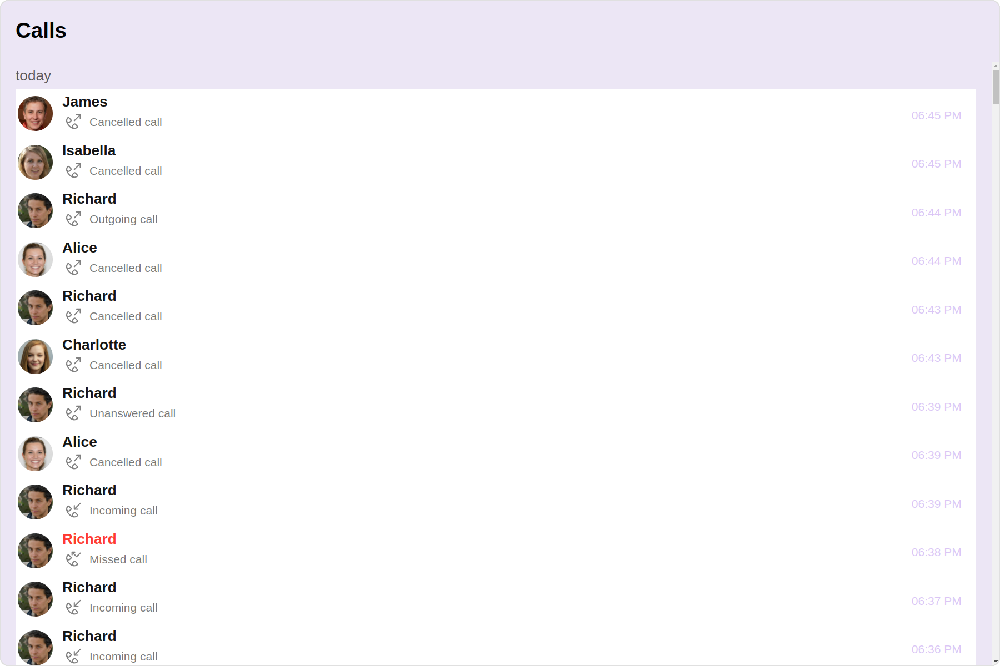

---

The following properties are exposed by `CallLogsStyle`:

| Property                   | Description                           | Code                               |
| -------------------------- | ------------------------------------- | ---------------------------------- |
| **border**                 | Used to set border                    | `border?: string,`                 |
| **borderRadius**           | Used to set border radius             | `borderRadius?: string;`           |
| **background**             | Used to set background colour         | `background?: string;`             |
| **height**                 | Used to set height                    | `height?: string;`                 |
| **width**                  | Used to set width                     | `width?: string;`                  |
| **titleFont**              | Used to set title font                | `titleFont?: string,`              |
| **titleColor**             | Used to set title color               | `titleColor?: string;`             |
| **emptyStateTextColor**    | Used to set empty state text color    | `emptyStateTextColor?: string;`    |
| **emptyStateTextFont**     | Used to set empty state text font     | `emptyStateTextFont?: string;`     |
| **errorStateTextColor**    | Used to set error state text color    | `errorStateTextColor?: string;`    |
| **errorStateTextFont**     | Used to set error state text font     | `errorStateTextFont?: string;`     |
| **loadingIconTint**        | Used to set loading icon tint         | `loadingIconTint?: string;`        |
| **infoIconTint**           | Used to set info icon tint            | `infoIconTint?: string;`           |
| **missedCallIconTint**     | Used to set missed call icon tint     | `missedCallIconTint?: string;`     |
| **outgoingCallIconTint**   | Used to set outgoing call icon tint   | `outgoingCallIconTint?: string;`   |
| **incomingCallIconTint**   | Used to set incoming call icon tint   | `incomingCallIconTint?: string;`   |
| **callStatusTextFont**     | Used to set call status text font     | `callStatusTextFont?: string;`     |
| **callStatusTextColor**    | Used to set call status text color    | `callStatusTextColor?: string;`    |
| **dateTextFont**           | Used to set date text font            | `dateTextFont?: string;`           |
| **dateTextColor**          | Used to set date text color           | `dateTextColor?: string;`          |
| **dateSeparatorTextFont**  | Used to set date separator text font  | `dateSeparatorTextFont?: string;`  |
| **dateSeparatorTextColor** | Used to set date separator text color | `dateSeparatorTextColor?: string;` |

##### 2. Avatar Style

If you want to apply customized styles to the `Avatar` component within the `Call Logs` Component, you can use the following code snippet. For more information you can refer [Avatar Styles](./avatar#avatar-style).

<Tabs>
<TabItem value="TypeScript" label="TypeScript">

```tsx title='CallLogDemo.tsx'
import { CometChatCallLogs, AvatarStyle } from "@cometchat/chat-uikit-react";
import React from "react";

const CallLogDemo = () => {
  const avatarStyle = new AvatarStyle({
    backgroundColor: "#cdc2ff",
    border: "2px solid #6745ff",
    borderRadius: "10px",
    outerViewBorderColor: "#ca45ff",
    outerViewBorderRadius: "5px",
    nameTextColor: "#4554ff",
  });
  return <CometChatCallLogs avatarStyle={avatarStyle} />;
};

export default CallLogDemo;
```

</TabItem>
<TabItem value="JavaScript" label="JavaScript">

```jsx title='CallLogDemo.jsx'
import { CometChatCallLogs, AvatarStyle } from "@cometchat/chat-uikit-react";
import React from "react";

const CallLogDemo = () => {
  const avatarStyle = new AvatarStyle({
    backgroundColor: "#cdc2ff",
    border: "2px solid #6745ff",
    borderRadius: "10px",
    outerViewBorderColor: "#ca45ff",
    outerViewBorderRadius: "5px",
    nameTextColor: "#4554ff",
  });
  return <CometChatCallLogs avatarStyle={avatarStyle} />;
};

export default CallLogDemo;
```

</TabItem>
</Tabs>

##### 3. ListItem Style

If you want to apply customized styles to the `ListItemStyle` component within the `Call Logs` Component, you can use the following code snippet. For more information, you can refer [ListItem Styles](./list-item#listitemstyle).

<Tabs>
<TabItem value="TypeScript" label="TypeScript">

```tsx title='CallLogDemo.tsx'
import { CometChatCallLogs, ListItemStyle } from "@cometchat/chat-uikit-react";
import React from "react";

const CallLogDemo = () => {
  const listItemStyle = new ListItemStyle({
    width: "100%",
    height: "100%",
    border: "2px solid #cdc2ff",
  });
  return <CometChatCallLogs listItemStyle={listItemStyle} />;
};

export default CallLogDemo;
```

</TabItem>
<TabItem value="JavaScript" label="JavaScript">

```jsx title='CallLogDemo.jsx'
import { CometChatCallLogs, ListItemStyle } from "@cometchat/chat-uikit-react";
import React from "react";

const CallLogDemo = () => {
  const listItemStyle = new ListItemStyle({
    width: "100%",
    height: "100%",
    border: "2px solid #cdc2ff",
  });
  return <CometChatCallLogs listItemStyle={listItemStyle} />;
};

export default CallLogDemo;
```

</TabItem>
</Tabs>

---

### Functionality

These are a set of small functional customizations that allow you to fine-tune the overall experience of the component. With these, you can change text, set custom icons, and toggle the visibility of UI elements.

Here is a code snippet demonstrating how you can customize the functionality of the `Call Logs` component.

<Tabs>
<TabItem value="TypeScript" label="TypeScript">

```tsx title='CallLogDemo.tsx'
import { CometChatCallLogs } from "@cometchat/chat-uikit-react";
import React from "react";

const CallLogDemo = () => {
  return (
    <CometChatCallLogs
      title="Your Custom Title"
      datePattern={DatePatterns.DayDateTime}
      hideSeparator={false}
    />
  );
};

export default CallLogDemo;
```

</TabItem>
<TabItem value="JavaScript" label="JavaScript">

```jsx title='CallLogDemo.jsx'
import { CometChatCallLogs } from "@cometchat/chat-uikit-react";
import React from "react";

const CallLogDemo = () => {
  return (
    <CometChatCallLogs
      title="Your Custom Title"
      datePattern={DatePatterns.DayDateTime}
      hideSeparator={false}
    />
  );
};

export default CallLogDemo;
```

</TabItem>
</Tabs>

Default:

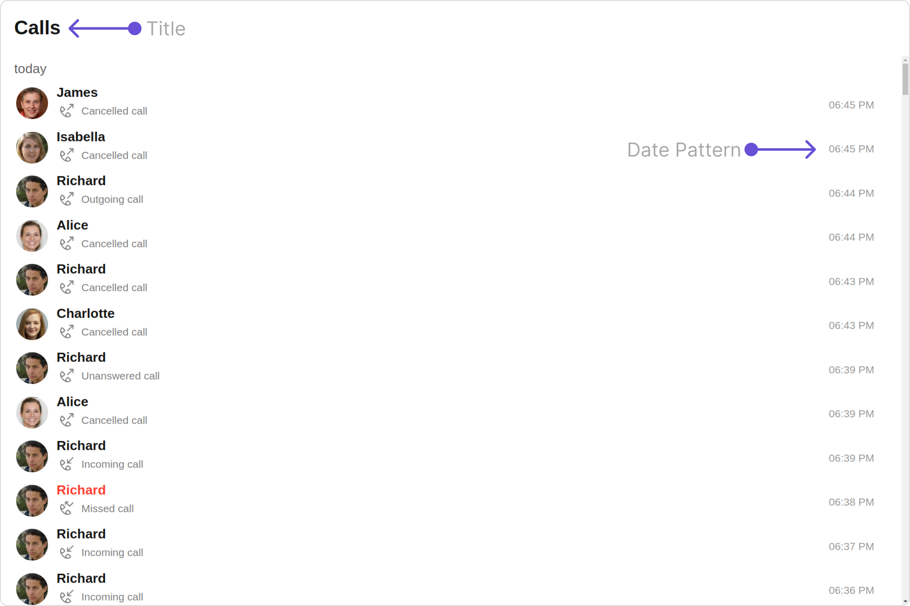

Custom:

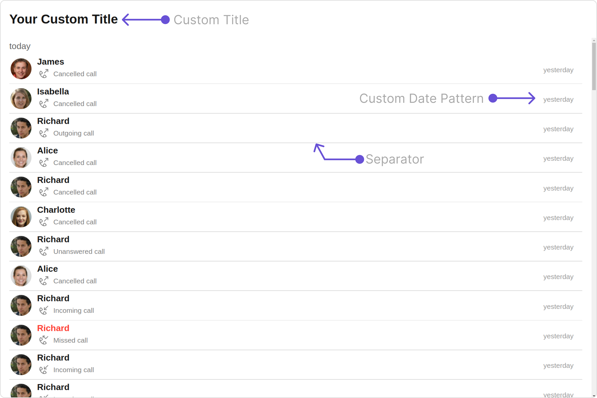

Below is a list of customizations along with corresponding code snippets

| Property                     | Description                                        | Code                                                         |
| ---------------------------- | -------------------------------------------------- | ------------------------------------------------------------ |
| **title**                    | Used to set custom title                           | `title='Your Custom Title'`                                  |
| **emptyStateText**           | Used to set custom empty state text                | `emptyStateText='Your Custom Empty State Text'`              |
| **errorStateText**           | Used to set custom error state text                | `errorStateText='Your Custom Error State Text'`              |
| **titleAlignment**           | Used to set custom title alignment                 | `titleAlignment={TitleAlignment.center}`                     |
| **datePattern**              | Used to set custom date pattern                    | `datePattern={DatePatterns.DayDateTime}`                     |
| **dateSeparatorPattern**     | Used to set custom date separator pattern          | `dateSeparatorPattern={DatePatterns.DayDateTime}`            |
| **infoIconUrl**              | Used to set custom info icon                       | `infoIconUrl='Custom Info Icon URL'`                         |
| **incomingAudioCallIconUrl** | Used to set custom incoming audio call icon        | `incomingAudioCallIconUrl='Custom Incoming Audio Call Icon'` |
| **missedAudioCallIconUrl**   | Used to set custom missed audio call icon          | `missedAudioCallIconUrl='Custom Missed Audio Call Icon'`     |
| **missedVideoCallIconUrl**   | Used to set custom missed video call icon          | `missedVideoCallIconUrl='Custom Missed Video Call Icon'`     |
| **incomingVideoCallIconUrl** | Used to set custom incoming video call icon        | `incomingVideoCallIconUrl='Custom Incoming Video Call Icon'` |
| **outgoingAudioCallIconUrl** | Used to set custom outgoing audio call icon        | `outgoingAudioCallIconUrl='Custom Outgoing Audio Call Icon'` |
| **outgoingVideoCallIconUrl** | Used to set custom outgoing video call icon        | `outgoingVideoCallIconUrl='Custom Outgoing Video Call Icon'` |
| **loadingIconURL**           | Used to set custom loading icon                    | `loadingIconURL='Custom Loading Icon'`                       |
| **hideSeparator**            | Option to hide separator                           | `hideSeparator={false}`                                      |
| **activeCall**               | Used to set active Call that is currently selected | `activeCall={call}`                                          |

---

### Advanced

For advanced-level customization, you can set custom views to the component. This lets you tailor each aspect of the component to fit your exact needs and application aesthetics. You can create and define your views, layouts, and UI elements and then incorporate those into the component.

---

#### ListItemView

With this property, you can assign a custom ListItem to the Call Logs Component.

```jsx
listItemView = { getListItemView };
```

**Example**

Default:
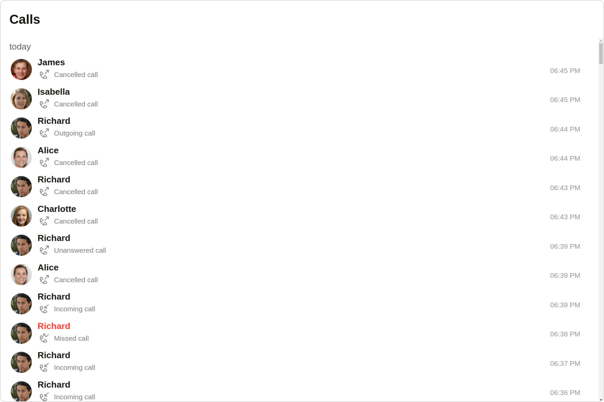

Custom:
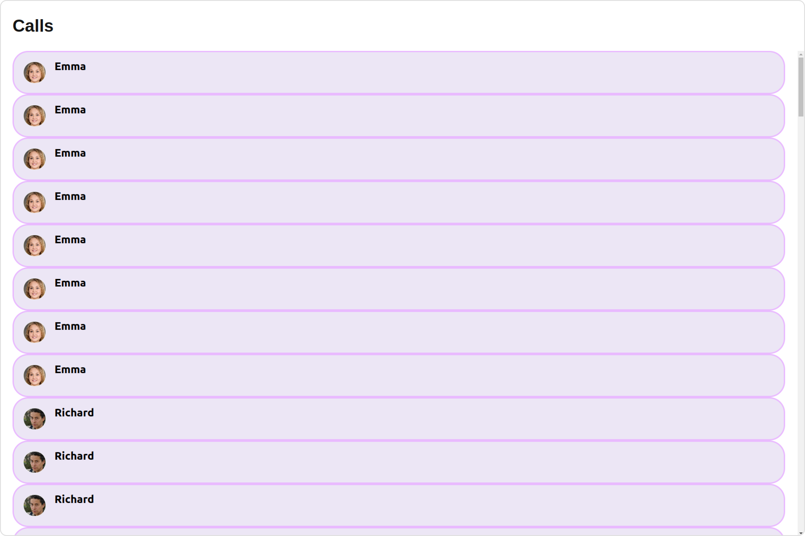

<Tabs>
<TabItem value="TypeScript" label="TypeScript">

```tsx title='CallLogDemo.tsx'
import { CallLog } from "@cometchat/calls-sdk-javascript";
import { CometChatCallLogs } from "@cometchat/chat-uikit-react";
import React from "react";

const CallLogDemo = () => {
  const getListItemView = (call: CallLog) => {
    if (call.getInitiator()) {
      return (
        <div
          style={{
            display: "flex",
            alignItems: "left",
            padding: "10px",
            border: "2px solid #e9baff",
            borderRadius: "20px",
            background: "#6e2bd9",
          }}
        >
          <cometchat-avatar
            image={call.getInitiator().getAvatar()}
            name={call.getInitiator().getName()}
          />
          <div style={{ display: "flex", paddingLeft: "10px" }}>
            <div
              style={{ fontWeight: "bold", color: "#ffffff", fontSize: "14px" }}
            >
              {call.getInitiator().getName()}
            </div>
          </div>
        </div>
      );
    } else {
      return <div>{call.getReceiver().getName()}</div>;
    }
  };

  return <CometChatCallLogs listItemView={getListItemView} />;
};

export default CallLogDemo;
```

</TabItem>
<TabItem value="JavaScript" label="JavaScript">

```jsx title='CallLogDemo.jsx'
import { CometChatCallLogs } from "@cometchat/chat-uikit-react";
import React from "react";

const CallLogDemo = () => {
  const getListItemView = (call) => {
    if (call.getInitiator()) {
      return (
        <div
          style={{
            display: "flex",
            alignItems: "left",
            padding: "10px",
            border: "2px solid #e9baff",
            borderRadius: "20px",
            background: "#6e2bd9",
          }}
        >
          <cometchat-avatar
            image={call.getInitiator().getAvatar()}
            name={call.getInitiator().getName()}
          />
          <div style={{ display: "flex", paddingLeft: "10px" }}>
            <div
              style={{ fontWeight: "bold", color: "#ffffff", fontSize: "14px" }}
            >
              {call.getInitiator().getName()}
            </div>
          </div>
        </div>
      );
    } else {
      return <div>{call.getReceiver().getName()}</div>;
    }
  };
  return <CometChatCallLogs listItemView={getListItemView} />;
};

export default CallLogDemo;
```

</TabItem>
</Tabs>

---

#### SubtitleView

You can customize the subtitle view for each call logs item to meet your requirements

```jsx
subtitleView = { getSubtitleView };
```

Default:
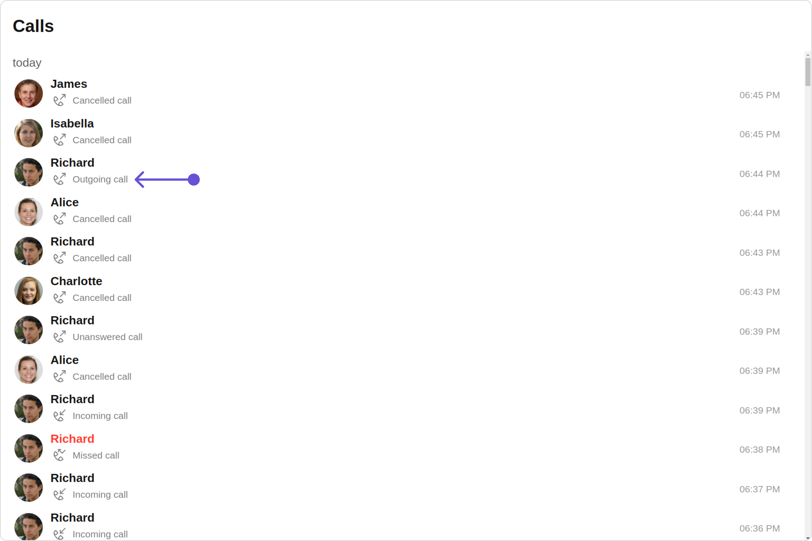

Custom:
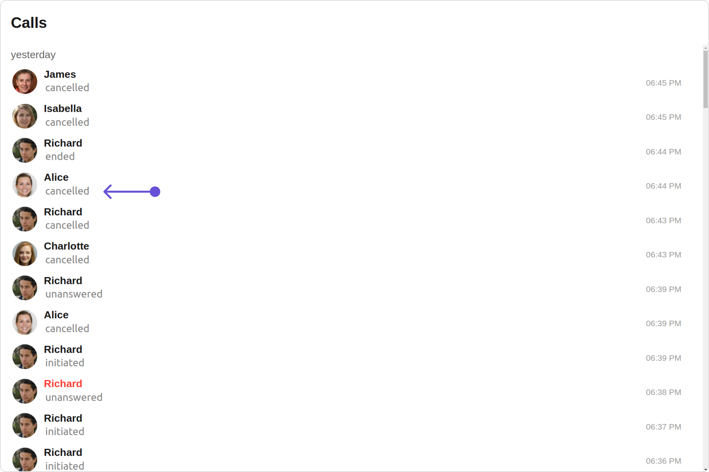

<Tabs>
<TabItem value="TypeScript" label="TypeScript">

```tsx title='CallLogDemo.tsx'
import { CallLog } from "@cometchat/calls-sdk-javascript";
import { CometChatCallLogs } from "@cometchat/chat-uikit-react";
import React from "react";

const CallLogDemo = () => {
  const getSubtitleView = (call: CallLog): JSX.Element => {
    return (
      <div
        style={{
          display: "flex",
          alignItems: "left",
          padding: "2px",
          fontSize: "10px",
        }}
      >
        <div style={{ color: "gray", fontSize: "15px" }}>
          {call.getStatus()}
        </div>
      </div>
    );
  };

  return <CometChatCallLogs subtitleView={getSubtitleView} />;
};

export default CallLogDemo;
```

</TabItem>
<TabItem value="JavaScript" label="JavaScript">

```jsx title='CallLogDemo.jsx'
import { CometChatCallLogs } from "@cometchat/chat-uikit-react";
import React from "react";

const CallLogDemo = () => {
  const getSubtitleView = (call) => {
    return (
      <div
        style={{
          display: "flex",
          alignItems: "left",
          padding: "2px",
          fontSize: "10px",
        }}
      >
        <div style={{ color: "gray", fontSize: "15px" }}>
          {call.getStatus()}
        </div>
      </div>
    );
  };

  return <CometChatCallLogs subtitleView={getSubtitleView} />;
};

export default CallLogDemo;
```

</TabItem>
</Tabs>

---

#### TailView

You can customize the tail view for each call logs item to meet your requirements

```jsx
tailView = { getTailView };
```

Default:
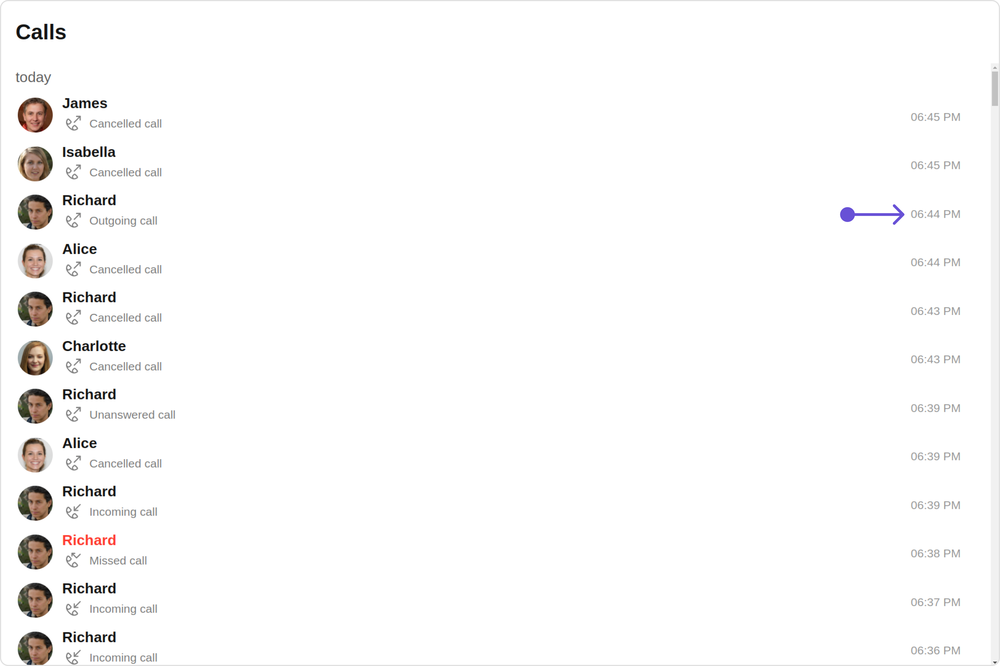

Custom:
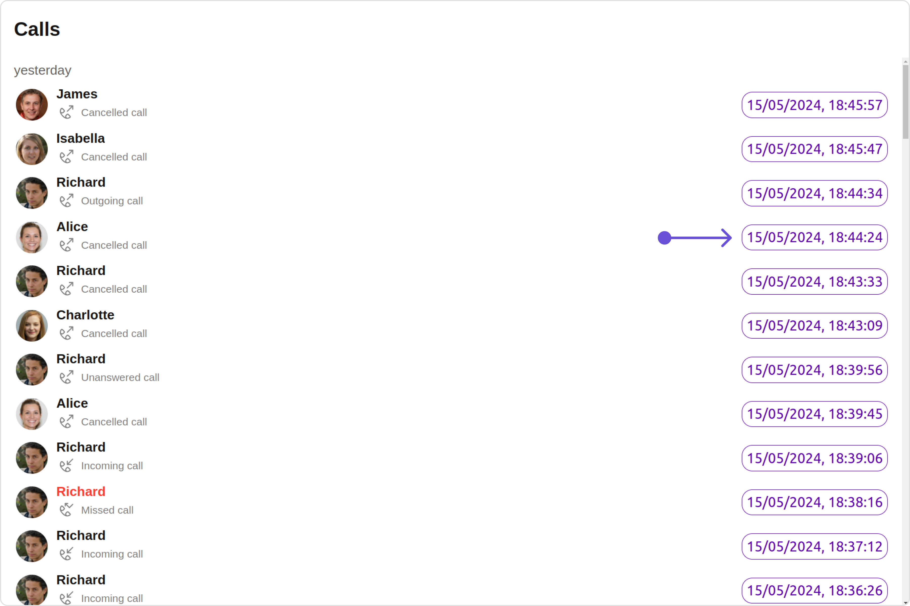

<Tabs>
<TabItem value="TypeScript" label="TypeScript">

```tsx title='CallLogDemo.tsx'
import { CallLog } from "@cometchat/calls-sdk-javascript";
import { CometChatCallLogs } from "@cometchat/chat-uikit-react";
import React from "react";

const CallLogDemo = () => {
  function getTailView(call: CallLog): JSX.Element {
    function formatTime(timestamp: number) {
      const date = new Date(timestamp * 1000);
      return date.toLocaleString();
    }
    return (
      <div
        style={{
          color: "#5a00a8",
          border: "1px solid #5a00a8",
          borderRadius: "12px",
          padding: "5px",
        }}
      >
        {formatTime(call.getInitiatedAt())}
      </div>
    );
  }

  return <CometChatCallLogs tailView={getTailView} />;
};

export default CallLogDemo;
```

</TabItem>
<TabItem value="JavaScript" label="JavaScript">

```jsx title='CallLogDemo.jsx'
import { CometChatCallLogs } from "@cometchat/chat-uikit-react";
import React from "react";

const CallLogDemo = () => {
  function getTailView(call) {
    function formatTime(timestamp) {
      const date = new Date(timestamp * 1000);
      return date.toLocaleString();
    }
    return (
      <div
        style={{
          color: "#5a00a8",
          border: "1px solid #5a00a8",
          borderRadius: "12px",
          padding: "5px",
        }}
      >
        {formatTime(call.getInitiatedAt())}
      </div>
    );
  }

  return <CometChatCallLogs tailView={getTailView} />;
};

export default CallLogDemo;
```

</TabItem>
</Tabs>

---

#### LoadingStateView

You can set a custom loader view using `loadingStateView` to match the loading view of your app.

```jsx
loadingStateView={getLoadingStateView()}
```

Default:
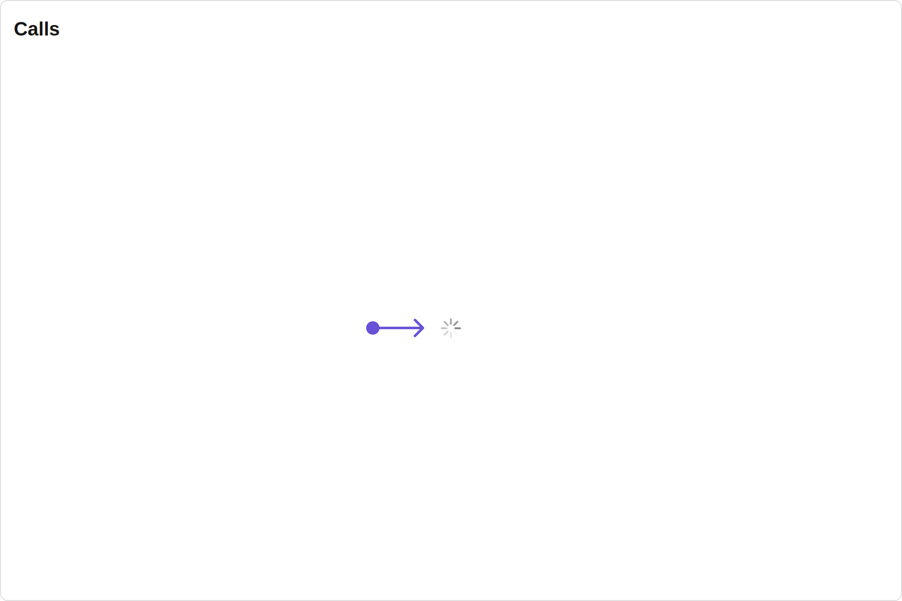

Custom:
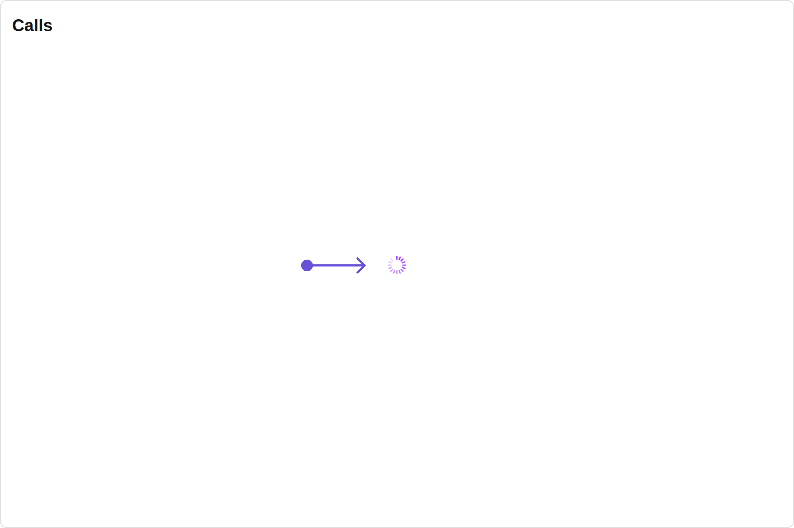

<Tabs>
<TabItem value="TypeScript" label="TypeScript">

```tsx title='CallLogDemo.tsx'
import { CallLog } from "@cometchat/calls-sdk-javascript";
import { CometChatCallLogs, LoaderStyle } from "@cometchat/chat-uikit-react";
import React from "react";

const CallLogDemo = () => {
  const getLoadingStateView = () => {
    const getLoaderStyle = new LoaderStyle({
      iconTint: "#890aff",
      background: "red",
      height: "100vh",
      width: "100vw",
      border: "none",
      borderRadius: "0",
    });

    return (
      <div style={{ background: "red", position: "absolute", top: "0" }}>
        <cometchat-loader
          iconURL="icon"
          loaderStyle={JSON.stringify(getLoaderStyle)}
        ></cometchat-loader>
      </div>
    );
  };

  return <CometChatCallLogs loadingStateView={getLoadingStateView()} />;
};

export default CallLogDemo;
```

</TabItem>
<TabItem value="JavaScript" label="JavaScript">

```jsx title='CallLogDemo.jsx'
import { CometChatCallLogs, LoaderStyle } from "@cometchat/chat-uikit-react";
import React from "react";

const CallLogDemo = () => {
  const getLoadingStateView = () => {
    const getLoaderStyle = new LoaderStyle({
      iconTint: "#890aff",
      background: "red",
      height: "100vh",
      width: "100vw",
      border: "none",
      borderRadius: "0",
    });

    return (
      <div style={{ background: "red", position: "absolute", top: "0" }}>
        <cometchat-loader
          iconURL="icon"
          loaderStyle={JSON.stringify(getLoaderStyle)}
        ></cometchat-loader>
      </div>
    );
  };

  return <CometChatCallLogs loadingStateView={getLoadingStateView()} />;
};

export default CallLogDemo;
```

</TabItem>
</Tabs>

---

#### EmptyStateView

You can set a custom `EmptyStateView` using `emptyStateView` to match the empty view of your app.

```jsx
emptyStateView={getEmptyStateView()}
```

Default:
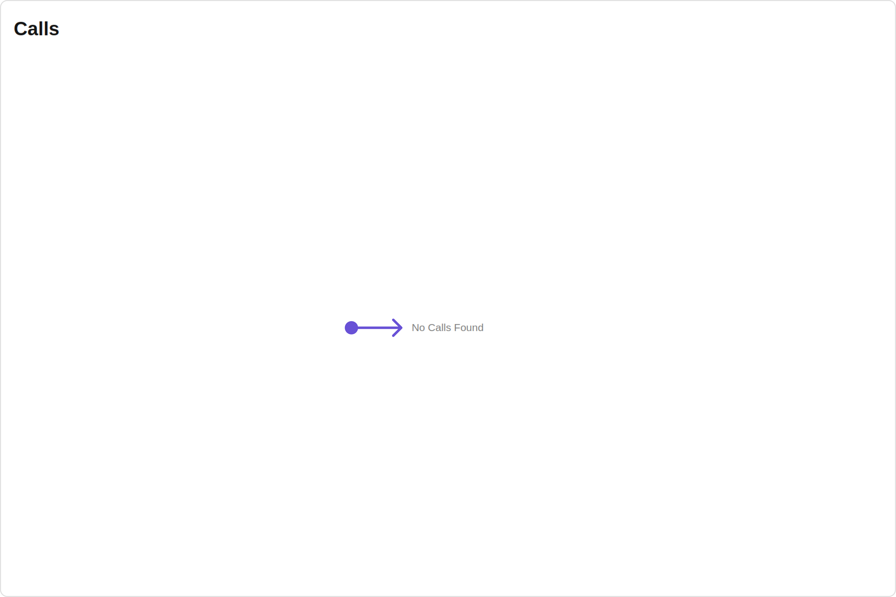

Custom:
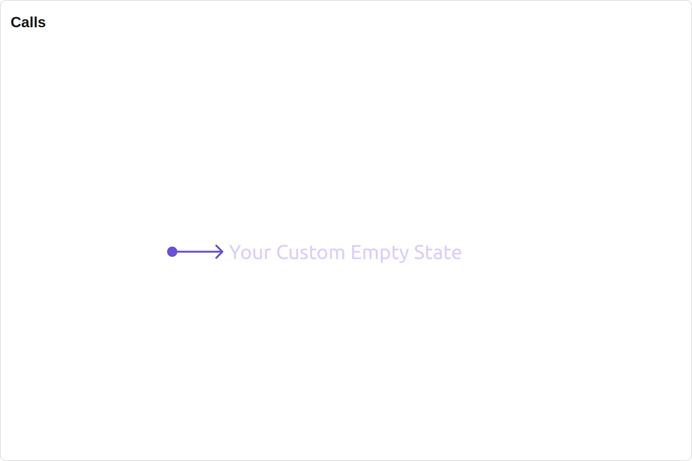

<Tabs>
<TabItem value="TypeScript" label="TypeScript">

```tsx title='CallLogDemo.tsx'
import { CometChatCallLogs } from "@cometchat/chat-uikit-react";
import React from "react";

const CallLogDemo = () => {
  const getEmptyStateView = () => {
    return (
      <div style={{ color: "#d6cfff", fontSize: "30px", font: "bold" }}>
        Your Custom Empty State
      </div>
    );
  };

  return <CometChatCallLogs emptyStateView={getEmptyStateView()} />;
};

export default CallLogDemo;
```

</TabItem>
<TabItem value="JavaScript" label="JavaScript">

```jsx title='CallLogDemo.jsx'
import { CometChatCallLogs } from "@cometchat/chat-uikit-react";
import React from "react";

const CallLogDemo = () => {
  const getEmptyStateView = () => {
    return (
      <div style={{ color: "#d6cfff", fontSize: "30px", font: "bold" }}>
        Your Custom Empty State
      </div>
    );
  };

  return <CometChatCallLogs emptyStateView={getEmptyStateView()} />;
};

export default CallLogDemo;
```

</TabItem>
</Tabs>

---

#### ErrorStateView

You can set a custom `ErrorStateView` using `errorStateView` to match the error view of your app.

```jsx
errorStateView={getErrorStateView()}
```

<Tabs>
<TabItem value="TypeScript" label="TypeScript">

```tsx title='CallLogDemo.tsx'
import { CometChatCallLogs } from "@cometchat/chat-uikit-react";
import React from "react";

const CallLogDemo = () => {
  const getErrorStateView = () => {
    return (
      <div style={{ height: "100vh", width: "100vw" }}>
        </img>
      </div>
    );
  };

  return <CometChatCallLogs errorStateView={getErrorStateView()} />;
};

export default CallLogDemo;
```

</TabItem>
<TabItem value="JavaScript" label="JavaScript">

```jsx title='CallLogDemo.jsx'
import { CometChatCallLogs } from "@cometchat/chat-uikit-react";
import React from "react";

const CallLogDemo = () => {
  const getErrorStateView = () => {
    return (
      <div style={{ height: "100vh", width: "100vw" }}>
        </img>
      </div>
    );
  };

  return <CometChatCallLogs errorStateView={getErrorStateView} />;
};

export default CallLogDemo;
```

</TabItem>
</Tabs>

## Configurations

[Configurations](./components-overview#configurations) offer the ability to customize the properties of each component within a Composite Component.

CometChatCallLogs has `OutGoing Call` component. Hence, each of these components will have its individual `Configuration``.

- `Configurations` expose properties that are available in its individual components.

#### OutGoing Call

You can customize the properties of the OutGoing Call component by making use of the `OutgoingCallConfiguration`. You can accomplish this by employing the `outgoingCallConfiguration` props as demonstrated below:

<Tabs>

<TabItem value="TypeScript" label="TypeScript">

```tsx
outgoingCallConfiguration={new OutgoingCallConfiguration({
  //override properties of out going call
})}
```

</TabItem>

<TabItem value="JavaScript" label="JavaScript">

```jsx
outgoingCallConfiguration={new OutgoingCallConfiguration({
  //override properties of out going call
})}
```

</TabItem>
</Tabs>

All exposed properties of `OutgoingCallConfiguration` can be found under [OutGoing Call](./outgoing-call#functionality). Properties marked with the <a data-tooltip-id="my-tooltip-html-prop"><span class="material-icons red">report</span></a> symbol are not accessible within the Configuration Object.

**Example**

Let's say you want to change the style of the OutGoing Call subcomponent and, in addition, you want to change the decline button icon.

You can modify the style using the `outgoingCallStyle` property and set custom decline button icon using `declineButtonIconURL` property.

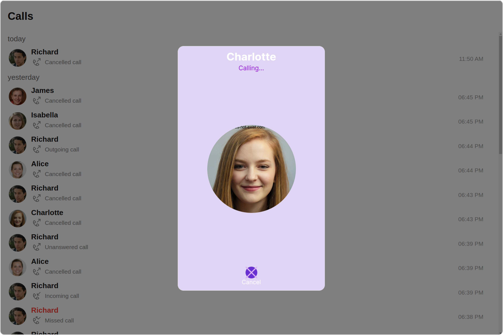

<Tabs>
<TabItem value="TypeScript" label="TypeScript">

```tsx title='CallLogDemo.tsx'
import {
  CometChatCallLogs,
  OutgoingCallConfiguration,
  OutgoingCallStyle,
} from "@cometchat/chat-uikit-react";
import React from "react";

const CallLogDemo = () => {
  const outgoingCallStyle = new OutgoingCallStyle({
    background: "#e0d5f5",
    declineButtonIconBackground: "#6830d1",
    height: "500px",
    width: "300px",
    declineButtonTextColor: "#ffffff",
    titleTextColor: "#ffffff",
    subtitleTextColor: "#9213d6",
    declineButtonIconTint: "#dbb1f2",
    border: "1px solid #e6e6e6",
    borderRadius: "12px",
  });
  return (
    <CometChatCallLogs
      outgoingCallConfiguration={
        new OutgoingCallConfiguration({
          //override properties of out going call
          outgoingCallStyle: outgoingCallStyle,
          declineButtonIconURL: "custom decline button icon",
        })
      }
    />
  );
};

export default CallLogDemo;
```

</TabItem>
<TabItem value="JavaScript" label="JavaScript">

```jsx title='CallLogDemo.jsx'
import {
  CometChatCallLogs,
  OutgoingCallConfiguration,
  OutgoingCallStyle,
} from "@cometchat/chat-uikit-react";
import React from "react";

const CallLogDemo = () => {
  const outgoingCallStyle = new OutgoingCallStyle({
    background: "#e0d5f5",
    declineButtonIconBackground: "#6830d1",
    height: "500px",
    width: "300px",
    declineButtonTextColor: "#ffffff",
    titleTextColor: "#ffffff",
    subtitleTextColor: "#9213d6",
    declineButtonIconTint: "#dbb1f2",
    border: "1px solid #e6e6e6",
    borderRadius: "12px",
  });
  return (
    <CometChatCallLogs
      outgoingCallConfiguration={
        new OutgoingCallConfiguration({
          //override properties of out going call
          outgoingCallStyle: outgoingCallStyle,
          declineButtonIconURL: "custom decline button icon",
        })
      }
    />
  );
};

export default CallLogDemo;
```

</TabItem>
</Tabs>

---
