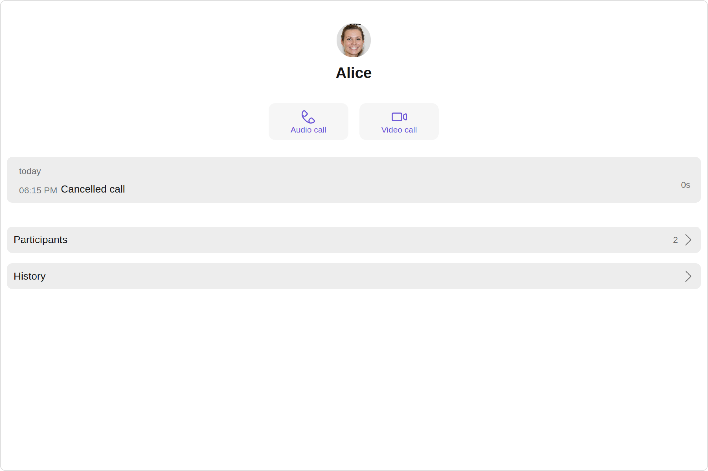
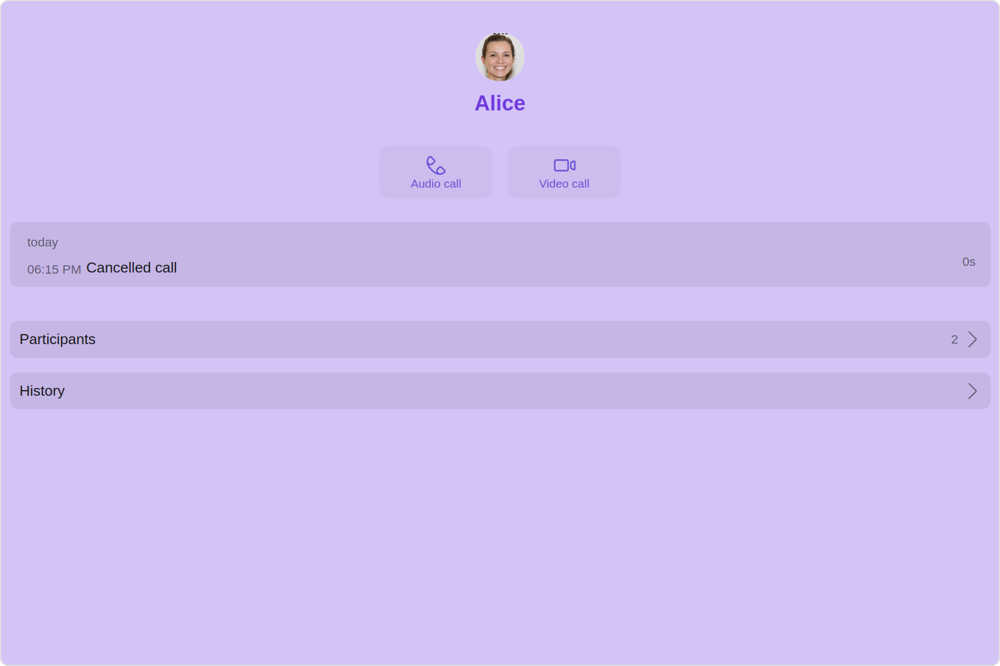
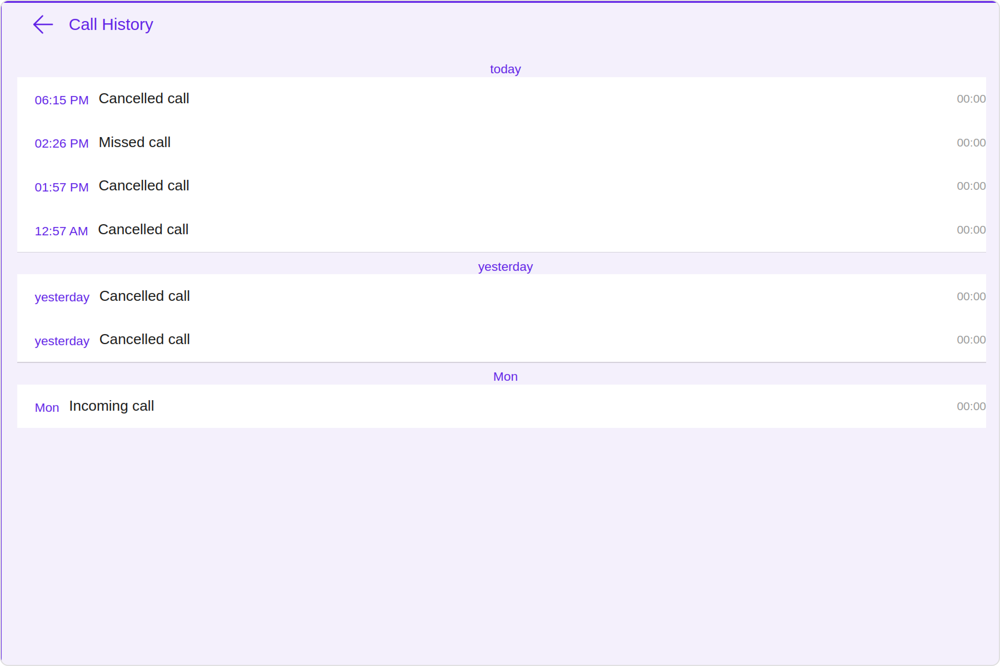
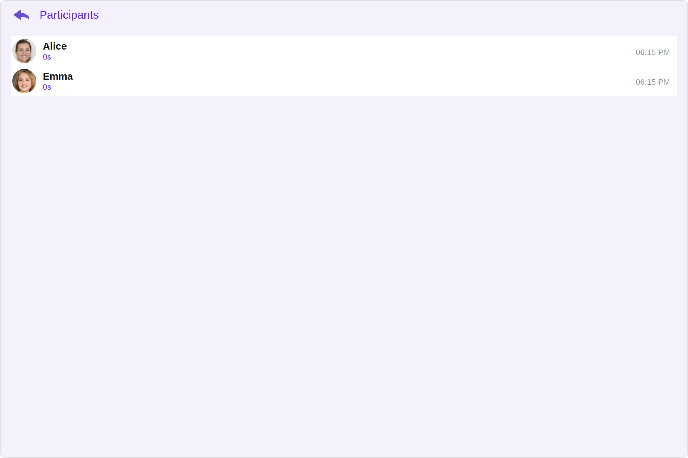

import Tabs from '@theme/Tabs';
import TabItem from '@theme/TabItem';

## Overview

The `Call Log Details` is a [Composite Component](./components-overview#composite-components) that displays all the information related to a call. This component displays information like user/group information, participants of the call, recordings of the call (if available) & history of all the previous calls. Also, it has buttons to start a new call.



| Components                                       | Description                                                                                                                                                                                                                            |
| ------------------------------------------------ | -------------------------------------------------------------------------------------------------------------------------------------------------------------------------------------------------------------------------------------- |
| [Call Log History](./call-log-history)           | The `Call Log History` component shows a paginated list of all the calls between the logged-in user & another user or group. This allows the user to see all the calls with a specific user/group they have initiated/received/missed. |
| [Call Log Recordings](./call-log-recording)      | The `Call Log Recordings` component shows a paginated list of recordings of a particular call.                                                                                                                                         |
| [Call Log participants](./call-log-participants) | The `Call Log Participants` component shows a separate view that displays comprehensive information about Call.                                                                                                                        |

## Usage

### Integration

<Tabs>
<TabItem value="js" label="CallLogDetailsDemo.tsx">

```tsx
import {
  CallLog,
  CallLogRequestBuilder,
} from "@cometchat/calls-sdk-javascript";
import {
  CometChatCallLogDetails,
  CometChatUIKit,
} from "@cometchat/chat-uikit-react";
import React from "react";

const CallLogDetailsDemo = () => {
  const [callLog, setCallLog] = React.useState<CallLog>();

  React.useEffect(() => {
    //code
    CometChatUIKit.login("uid")
      .then(async (user: CometChat.User) => {
        const callLogRequest = new CallLogRequestBuilder()
          .setLimit(1)
          .setCallStatus("cancelled")
          .setAuthToken(user!.getAuthToken())
          .build();

        callLogRequest
          .fetchNext()
          .then((callLogs: CallLog[]) => {
            setCallLog(callLogs[0]);
          })
          .catch(() => {
            //handle error
          });
      })
      .catch((error: any) => {
        //handle error
      });
  }, []);

  return <>{callLog && <CometChatCallLogDetails call={callLog} />}</>;
};

export default CallLogDetailsDemo;
```

</TabItem>
<TabItem value="ts" label="App.tsx">

```tsx
import CallLogDetailsDemo from "./CallLogDetailsDemo";

export default function App() {
  return (
    <div className="App">
      <CallLogDetailsDemo />
    </div>
  );
}
```

</TabItem>
</Tabs>

### Actions

[Actions](./components-overview#actions) dictate how a component functions. They are divided into two types: Predefined and User-defined. You can override either type, allowing you to tailor the behavior of the component to fit your specific needs.

##### 1. onBackClick

`onBackClick` is triggered when you click on the back button of the Call Log Details component. You can override this action using the following code snippet.

<Tabs>
<TabItem value="TypeScript" label="TypeScript">

```tsx title='CallLogDetailsDemo.tsx'
import {
  CallLog,
  CallLogRequestBuilder,
} from "@cometchat/calls-sdk-javascript";
import {
  CometChatCallLogDetails,
  CometChatUIKit,
} from "@cometchat/chat-uikit-react";
import React from "react";

const CallLogDetailsDemo = () => {
  const [callLog, setCallLog] = React.useState<CallLog>();

  React.useEffect(() => {
    //code
    CometChatUIKit.login("uid")
      .then(async (user: CometChat.User) => {
        const callLogRequest = new CallLogRequestBuilder()
          .setLimit(1)
          .setCallStatus("cancelled")
          .setAuthToken(user!.getAuthToken())
          .build();

        callLogRequest
          .fetchNext()
          .then((callLogs: CallLog[]) => {
            setCallLog(callLogs[0]);
          })
          .catch(() => {
            //handle error
          });
      })
      .catch((error: any) => {
        //handle error
      });
  }, []);

  function getOnBackClick(): void {
    //Your Custom on back click Actions
  }

  return (
    <>
      {callLog && (
        <CometChatCallLogDetails call={callLog} onBackClick={getOnBackClick} />
      )}
    </>
  );
};

export default CallLogDetailsDemo;
```

</TabItem>
<TabItem value="JavaScript" label="JavaScript">

```jsx title='CallLogDetailsDemo.jsx'
import {
  CallLog,
  CallLogRequestBuilder,
} from "@cometchat/calls-sdk-javascript";
import {
  CometChatCallLogDetails,
  CometChatUIKit,
} from "@cometchat/chat-uikit-react";
import React, { useState, useEffect } from "react";

const CallLogDetailsDemo = () => {
  const [callLog, setCallLog] = useState();

  useEffect(() => {
    CometChatUIKit.login("uid")
      .then(async (user) => {
        const callLogRequest = new CallLogRequestBuilder()
          .setLimit(1)
          .setCallStatus("cancelled")
          .setAuthToken(user.getAuthToken())
          .build();

        callLogRequest
          .fetchNext()
          .then((callLogs) => {
            setCallLog(callLogs[0]);
          })
          .catch(() => {
            // handle error
          });
      })
      .catch((error) => {
        // handle error
      });
  }, []);

  function getOnBackClick() {
    // Your Custom on back click Actions
  }

  return (
    <>
      {callLog && (
        <CometChatCallLogDetails call={callLog} onBackClick={getOnBackClick} />
      )}
    </>
  );
};

export default CallLogDetailsDemo;
```

</TabItem>
</Tabs>

---

### Filters

**Filters** allow you to customize the data displayed in a list within a `Component`. You can filter the list based on your specific criteria, allowing for a more customized. Filters can be applied using `RequestBuilders` of Chat SDK.

The `Call Log Details` component does not have any exposed filters.

---

### Events

[Events](./components-overview#events) are emitted by a `Component`. By using event you can extend existing functionality. Being global events, they can be applied in Multiple Locations and are capable of being Added or Removed.

The `CallLogDetails` does not produce any events.

---

## Customization

To fit your app's design requirements, you have the ability to customize the appearance of the
`CallLogDetails` component. We provide exposed methods that allow you to modify the experience and behavior according to your specific needs.

### Style

Using **Style** you can **customize** the look and feel of the component in your app, These parameters typically control elements such as the **color**, **size**, **shape**, and **fonts** used within the component.

##### 1. CallLogDetails Style

You can set the `callLogDetailsStyle` to the Call Log Details Component to customize the styling.



<Tabs>
<TabItem value="TypeScript" label="TypeScript">

```tsx title='CallLogDetailsDemo.tsx'
import {
  CallLog,
  CallLogRequestBuilder,
} from "@cometchat/calls-sdk-javascript";
import {
  CometChatCallLogDetails,
  CometChatUIKit,
  CallLogDetailsStyle,
} from "@cometchat/chat-uikit-react";
import React from "react";

const CallLogDetailsDemo = () => {
  const [callLog, setCallLog] = React.useState<CallLog>();

  React.useEffect(() => {
    //code
    CometChatUIKit.login("uid")
      .then(async (user: CometChat.User) => {
        const callLogRequest = new CallLogRequestBuilder()
          .setLimit(1)
          .setCallStatus("cancelled")
          .setAuthToken(user!.getAuthToken())
          .build();

        callLogRequest
          .fetchNext()
          .then((callLogs: CallLog[]) => {
            setCallLog(callLogs[0]);
          })
          .catch(() => {
            //handle error
          });
      })
      .catch((error: any) => {
        //handle error
      });
  }, []);

  const callLogDetailsStyle = new CallLogDetailsStyle({
    background: "#d4c3f7",
    nameTextColor: "#6f3ae0",
    titleColor: "#6f3ae0",
  });

  return (
    <>
      {callLog && (
        <CometChatCallLogDetails
          call={callLog}
          callLogDetailsStyle={callLogDetailsStyle}
        />
      )}
    </>
  );
};

export default CallLogDetailsDemo;
```

</TabItem>
<TabItem value="JavaScript" label="JavaScript">

```jsx title='CallLogDetailsDemo.jsx'
import {
  CallLog,
  CallLogRequestBuilder,
} from "@cometchat/calls-sdk-javascript";
import {
  CometChatCallLogDetails,
  CometChatUIKit,
  CallLogDetailsStyle,
} from "@cometchat/chat-uikit-react";
import React, { useState, useEffect } from "react";

const CallLogDetailsDemo = () => {
  const [callLog, setCallLog] = useState();

  useEffect(() => {
    CometChatUIKit.login("uid")
      .then(async (user) => {
        const callLogRequest = new CallLogRequestBuilder()
          .setLimit(1)
          .setCallStatus("cancelled")
          .setAuthToken(user.getAuthToken())
          .build();

        callLogRequest
          .fetchNext()
          .then((callLogs) => {
            setCallLog(callLogs[0]);
          })
          .catch(() => {
            // handle error
          });
      })
      .catch((error) => {
        // handle error
      });
  }, []);

  const callLogDetailsStyle = new CallLogDetailsStyle({
    background: "#d4c3f7",
    nameTextColor: "#6f3ae0",
    titleColor: "#6f3ae0",
  });

  return (
    <>
      {callLog && (
        <CometChatCallLogDetails
          call={callLog}
          callLogDetailsStyle={callLogDetailsStyle}
        />
      )}
    </>
  );
};

export default CallLogDetailsDemo;
```

</TabItem>
</Tabs>

---

The following properties are exposed by `CallLogDetailsStyle`:

| Property          | Description                        | Code                      |
| ----------------- | ---------------------------------- | ------------------------- |
| **border**        | Used to set border                 | `border?: string,`        |
| **borderRadius**  | Used to set border radius          | `borderRadius?: string;`  |
| **background**    | Used to set background colour      | `background?: string;`    |
| **height**        | Used to set height                 | `height?: string;`        |
| **width**         | Used to set width                  | `width?: string;`         |
| **titleFont**     | Used to set title font             | `titleFont?: string,`     |
| **titleColor**    | Used to set title color            | `titleColor?: string;`    |
| **nameTextFont**  | Used to set name text font         | `nameTextFont?: string,`  |
| **nameTextColor** | Used to set name text color        | `nameTextColor?: string;` |
| **backIconTint**  | Used to set color of the back icon | `backIconTint?: string;`  |

##### 2. Avatar Style

If you want to apply customized styles to the `Avatar` component within the `Call Log Details` Component, you can use the following code snippet. For more information you can refer [Avatar Styles](./avatar#avatar-style).

<Tabs>
<TabItem value="TypeScript" label="TypeScript">

```tsx title='CallLogDetailsDemo.tsx'
import {
  CallLog,
  CallLogRequestBuilder,
} from "@cometchat/calls-sdk-javascript";
import {
  CometChatCallLogDetails,
  CometChatUIKit,
  AvatarStyle,
} from "@cometchat/chat-uikit-react";
import React from "react";

const CallLogDetailsDemo = () => {
  const [callLog, setCallLog] = React.useState<CallLog>();

  React.useEffect(() => {
    //code
    CometChatUIKit.login("uid")
      .then(async (user: CometChat.User) => {
        const callLogRequest = new CallLogRequestBuilder()
          .setLimit(1)
          .setCallStatus("cancelled")
          .setAuthToken(user!.getAuthToken())
          .build();

        callLogRequest
          .fetchNext()
          .then((callLogs: CallLog[]) => {
            setCallLog(callLogs[0]);
          })
          .catch(() => {
            //handle error
          });
      })
      .catch((error: any) => {
        //handle error
      });
  }, []);

  const avatarStyle = new AvatarStyle({
    backgroundColor: "#cdc2ff",
    border: "2px solid #6745ff",
    borderRadius: "10px",
    outerViewBorderColor: "#ca45ff",
    outerViewBorderRadius: "5px",
    nameTextColor: "#4554ff",
  });

  return (
    <>
      {callLog && (
        <CometChatCallLogDetails call={callLog} avatarStyle={avatarStyle} />
      )}
    </>
  );
};

export default CallLogDetailsDemo;
```

</TabItem>
<TabItem value="JavaScript" label="JavaScript">

```jsx title='CallLogDetailsDemo.jsx'
import {
  CallLog,
  CallLogRequestBuilder,
} from "@cometchat/calls-sdk-javascript";
import {
  CometChatCallLogDetails,
  CometChatUIKit,
  AvatarStyle,
} from "@cometchat/chat-uikit-react";
import React, { useState, useEffect } from "react";

const CallLogDetailsDemo = () => {
  const [callLog, setCallLog] = useState();

  useEffect(() => {
    CometChatUIKit.login("uid")
      .then(async (user) => {
        const callLogRequest = new CallLogRequestBuilder()
          .setLimit(1)
          .setCallStatus("cancelled")
          .setAuthToken(user.getAuthToken())
          .build();

        callLogRequest
          .fetchNext()
          .then((callLogs) => {
            setCallLog(callLogs[0]);
          })
          .catch(() => {
            // handle error
          });
      })
      .catch((error) => {
        // handle error
      });
  }, []);

  const avatarStyle = new AvatarStyle({
    backgroundColor: "#cdc2ff",
    border: "2px solid #6745ff",
    borderRadius: "10px",
    outerViewBorderColor: "#ca45ff",
    outerViewBorderRadius: "5px",
    nameTextColor: "#4554ff",
  });

  return (
    <>
      {callLog && (
        <CometChatCallLogDetails call={callLog} avatarStyle={avatarStyle} />
      )}
    </>
  );
};

export default CallLogDetailsDemo;
```

</TabItem>
</Tabs>

---

### Functionality

These are a set of small functional customizations that allow you to fine-tune the overall experience of the component. With these, you can change text, set custom icons, and toggle the visibility of UI elements.

Here is a code snippet demonstrating how you can customize the functionality of the `Call Log Details` component.

<Tabs>
<TabItem value="TypeScript" label="TypeScript">

```tsx title='CallLogDetailsDemo.tsx'
import {
  CallLog,
  CallLogRequestBuilder,
} from "@cometchat/calls-sdk-javascript";
import {
  CometChatCallLogDetails,
  CometChatUIKit,
} from "@cometchat/chat-uikit-react";
import React from "react";

const CallLogDetailsDemo = () => {
  const [callLog, setCallLog] = React.useState<CallLog>();

  React.useEffect(() => {
    //code
    CometChatUIKit.login("uid")
      .then(async (user: CometChat.User) => {
        const callLogRequest = new CallLogRequestBuilder()
          .setLimit(1)
          .setCallStatus("cancelled")
          .setAuthToken(user!.getAuthToken())
          .build();

        callLogRequest
          .fetchNext()
          .then((callLogs: CallLog[]) => {
            setCallLog(callLogs[0]);
          })
          .catch(() => {
            //handle error
          });
      })
      .catch((error: any) => {
        //handle error
      });
  }, []);

  return (
    <>
      {callLog && (
        <CometChatCallLogDetails
          call={callLog}
          title="Your Custom Title"
          backIconUrl="custom back icon url"
        />
      )}
    </>
  );
};

export default CallLogDetailsDemo;
```

</TabItem>
<TabItem value="JavaScript" label="JavaScript">

```jsx title='CallLogDetailsDemo.jsx'
import {
  CallLog,
  CallLogRequestBuilder,
} from "@cometchat/calls-sdk-javascript";
import {
  CometChatCallLogDetails,
  CometChatUIKit,
} from "@cometchat/chat-uikit-react";
import React, { useState, useEffect } from "react";

const CallLogDetailsDemo = () => {
  const [callLog, setCallLog] = useState();

  useEffect(() => {
    CometChatUIKit.login("uid")
      .then(async (user) => {
        const callLogRequest = new CallLogRequestBuilder()
          .setLimit(1)
          .setCallStatus("cancelled")
          .setAuthToken(user.getAuthToken())
          .build();

        callLogRequest
          .fetchNext()
          .then((callLogs) => {
            setCallLog(callLogs[0]);
          })
          .catch(() => {
            // handle error
          });
      })
      .catch((error) => {
        // handle error
      });
  }, []);

  return (
    <>
      {callLog && (
        <CometChatCallLogDetails
          call={callLog}
          title="Your Custom Title"
          backIconUrl="custom back icon url"
        />
      )}
    </>
  );
};

export default CallLogDetailsDemo;
```

</TabItem>
</Tabs>

Below is a list of customizations along with corresponding code snippets

| **Property**    | **Description**                                                               | **type**                                                                                                    |
| --------------- | ----------------------------------------------------------------------------- | ----------------------------------------------------------------------------------------------------------- |
| **title**       | Used to set custom title                                                      | `title?: string,`                                                                                           |
| **backIconUrl** | Used to set custom back icon URL                                              | `backIconUrl?: string;`                                                                                     |
| **call**        | Call data object                                                              | `call: CallLog;`                                                                                            |
| **data**        | Override the list of templates which is used for displaying relevant options. | `data?: (callLog: any, loggedInUser: CometChat.User, theme: CometChatTheme) => CometChatDetailsTemplate[];` |

---

### Advanced

For advanced-level customization, you can set custom views to the component. This lets you tailor each aspect of the component to fit your exact needs and application aesthetics. You can create and define your views, layouts, and UI elements and then incorporate those into the component.

#### DetailsTemplate

The `CometChatDetailsTemplate` offers a structure for organizing information in the Call Log Details component. It serves as a blueprint, defining how call log related details are presented. This structure allows for customization and organization within the CometChat interface.

<Tabs>
<TabItem value="TypeScript" label="TypeScript">

```tsx title='CallLogDetailsDemo.tsx'
import {
  CallLog,
  CallLogRequestBuilder,
} from "@cometchat/calls-sdk-javascript";
import {
  CometChatCallLogDetails,
  CometChatUIKit,
  CometChatDetailsOption,
  CometChatDetailsTemplate,
  CometChatTheme,
} from "@cometchat/chat-uikit-react";
import React from "react";

const CallLogDetailsDemo = () => {
  const [callLog, setCallLog] = React.useState<CallLog>();

  React.useEffect(() => {
    //code
    CometChatUIKit.login("uid")
      .then(async (user: CometChat.User) => {
        const callLogRequest = new CallLogRequestBuilder()
          .setLimit(1)
          .setCallStatus("cancelled")
          .setAuthToken(user!.getAuthToken())
          .build();

        callLogRequest
          .fetchNext()
          .then((callLogs: CallLog[]) => {
            setCallLog(callLogs[0]);
          })
          .catch(() => {
            //handle error
          });
      })
      .catch((error: any) => {
        //handle error
      });
  }, []);

  function getOptions(
    loggedInUser: CometChat.User | null,
    group: CometChat.Group | null,
    section: string
  ): CometChatDetailsOption[] {
    const voiceCallOption: CometChatDetailsOption = {
      id: "your id",
      title: "custom title",
      iconTint: "red",
      titleFont: "16px sans-serif, Inter",
      iconURL: backIcon,
    };
    const videoCallOption: CometChatDetailsOption = {
      id: "your id",
      title: "custom title",
      iconTint: "red",
      titleFont: "16px sans-serif, Inter",
    };
    return [voiceCallOption, videoCallOption];
  }

  function getCustomTemplate(
    callLog: any,
    loggedInUser: CometChat.User,
    theme: CometChatTheme
  ): CometChatDetailsTemplate[] {
    let detailsTemplate: CometChatDetailsTemplate = {
      id: "custom id",
      title: "Call User",
      titleColor: theme.palette.getPrimary(),
      sectionSeparatorColor: "grey",
      itemSeparatorColor: "#6851D6",
      options: getOptions,
      hideItemSeparator: false,
      hideSectionSeparator: false,
    };
    return [detailsTemplate];
  }
  return (
    <>
      {callLog && (
        <CometChatCallLogDetails call={callLog} data={getCustomTemplate} />
      )}
    </>
  );
};

export default CallLogDetailsDemo;
```

</TabItem>
<TabItem value="JavaScript" label="JavaScript">

```jsx title='CallLogDetailsDemo.jsx'
import {
  CallLog,
  CallLogRequestBuilder,
} from "@cometchat/calls-sdk-javascript";
import {
  CometChatCallLogDetails,
  CometChatUIKit,
  CometChatDetailsOption,
  CometChatDetailsTemplate,
} from "@cometchat/chat-uikit-react";
import React, { useState, useEffect } from "react";

const CallLogDetailsDemo = () => {
  const [callLog, setCallLog] = useState();

  useEffect(() => {
    CometChatUIKit.login("uid")
      .then(async (user) => {
        const callLogRequest = new CallLogRequestBuilder()
          .setLimit(1)
          .setCallStatus("cancelled")
          .setAuthToken(user.getAuthToken())
          .build();

        callLogRequest
          .fetchNext()
          .then((callLogs) => {
            setCallLog(callLogs[0]);
          })
          .catch(() => {
            // handle error
          });
      })
      .catch((error) => {
        // handle error
      });
  }, []);

  function getOptions(loggedInUser, group, section) {
    const voiceCallOption: CometChatDetailsOption = {
      id: loggedInUser?.getUid(),
      title: loggedInUser?.getName(),
      iconTint: "red",
      titleFont: "16px sans-serif, Inter",
      iconURL: backIcon,
    };
    const videoCallOption: CometChatDetailsOption = {
      id: loggedInUser?.getUid(),
      title: loggedInUser?.getName(),
      iconTint: "red",
      titleFont: "16px sans-serif, Inter",
    };
    return [voiceCallOption, videoCallOption];
  }

  function getCustomTemplate(callLog: any, loggedInUser, theme) {
    let detailsTemplate: CometChatDetailsTemplate = {
      id: callLog.getAuthToken,
      title: "Call User",
      titleColor: theme.palette.getPrimary(),
      sectionSeparatorColor: "grey",
      itemSeparatorColor: "#6851D6",
      options: getOptions,
      hideItemSeparator: false,
      hideSectionSeparator: false,
    };
    return [detailsTemplate];
  }

  return (
    <>
      {callLog && (
        <CometChatCallLogDetails call={callLog} data={getCustomTemplate} />
      )}
    </>
  );
};

export default CallLogDetailsDemo;
```

</TabItem>
</Tabs>

This defines the structure of template data for the call log details component.

| Name                      | Type                                                                                                                                                                      | Description                                                           |
| ------------------------- | ------------------------------------------------------------------------------------------------------------------------------------------------------------------------- | --------------------------------------------------------------------- |
| **id**                    | String                                                                                                                                                                    | Identifier for the template                                           |
| **title**                 | String                                                                                                                                                                    | Heading text for the template                                         |
| **titleFont**             | String                                                                                                                                                                    | Sets all the different properties of font for the title text          |
| **titleColor**            | String                                                                                                                                                                    | Sets the foreground color of title text                               |
| **itemSeparatorColor**    | String                                                                                                                                                                    | Sets the color of the template's option separator                     |
| **hideItemSeparator**     | Boolean                                                                                                                                                                   | When set to true, hides the separator under each option in a template |
| **sectionSeparatorColor** | String                                                                                                                                                                    | Sets the color of the template separator                              |
| **hideSectionSeparator**  | Boolean                                                                                                                                                                   | When set to true, hides the separator for the template                |
| **options**               | CometChatDetailsTemplate.options?: ((loggedInUser: User &#124; null, group: Group &#124; null, section: string) => CometChatDetailsOption[]) &#124; null &#124; undefined | defines the structure for individual options                          |

#### DetailsOption

The `DetailsOption` defines the structure for individual options within the CometChat Call Log Details component, facilitating customization and functionality for user interactions.

This defines the structure of each option for a template in the details component.

| Name                | Type                                                                 | Description                                                                             |
| ------------------- | -------------------------------------------------------------------- | --------------------------------------------------------------------------------------- |
| **id**              | String                                                               | Identifier for the template option                                                      |
| **title**           | String                                                               | Heading text for the template option                                                    |
| **tail**            | any                                                                  | User-defined UI component to customise the trailing view for each option in a template. |
| **customView**      | any                                                                  | User-defined UI component to override the default view for the option.                  |
| **onClick**         | ((item: CometChat.User &#124; CometChat.Group) => void) &#124; null; | Function invoked when user clicks on the option.                                        |
| **titleFont**       | String                                                               | Sets all the different properties of font for the title text                            |
| **titleColor**      | String                                                               | Sets the foreground colour of title text                                                |
| **iconURL**         | String                                                               | Image url for the icon to symbolise an option                                           |
| **iconTint**        | String                                                               | Color applied to the icon of the option                                                 |
| **backgroundColor** | String                                                               | Color applied to the background of the option                                           |

---

## Configurations

[Configurations](./components-overview#configurations) offer the ability to customize the properties of each component within a Composite Component.

CallLogDetails has `Call Log History`, `Call Log Recordings` and `Call Log Participants` component. Hence, each of these components will have its individual `Configuration`.

- `Configurations` expose properties that are available in its individual components.

#### Call Log History

You can customize the properties of the Call Log History component by making use of the `callLogHistoryConfiguration`. You can accomplish this by employing the `callLogHistoryConfiguration` props as demonstrated below:

<Tabs>

<TabItem value="TypeScript" label="TypeScript">

```tsx
callLogHistoryConfiguration={new CallLogHistoryConfiguration({
    //override properties of call log history
})}
```

</TabItem>

<TabItem value="JavaScript" label="JavaScript">

```jsx
callLogHistoryConfiguration={new CallLogHistoryConfiguration({
    //override properties of call log history
})}
```

</TabItem>
</Tabs>

All exposed properties of `CallLogHistoryConfiguration` can be found under [Call Log History](./call-log-history#functionality). Properties marked with the <a data-tooltip-id="my-tooltip-html-prop"><span class="material-icons red">report</span></a> symbol are not accessible within the Configuration Object.

**Example**

Let's say you want to change the style of the Call Log History subcomponent and, in addition, you only want to change the date pattern to show day date and time.

You can modify the style using the `callLogHistoryStyle` property, change the date pattern using `datePattern` property.



<Tabs>
<TabItem value="TypeScript" label="TypeScript">

```tsx title='CallLogDetailsDemo.tsx'
import {
  CallLog,
  CallLogRequestBuilder,
} from "@cometchat/calls-sdk-javascript";
import {
  CometChatCallLogDetails,
  CometChatUIKit,
  CallLogHistoryStyle,
  DatePatterns,
  CallLogHistoryConfiguration,
} from "@cometchat/chat-uikit-react";
import React from "react";

const CallLogDetailsDemo = () => {
  const [callLog, setCallLog] = React.useState<CallLog>();

  React.useEffect(() => {
    //code
    CometChatUIKit.login("uid")
      .then(async (user: CometChat.User) => {
        const callLogRequest = new CallLogRequestBuilder()
          .setLimit(1)
          .setCallStatus("cancelled")
          .setAuthToken(user!.getAuthToken())
          .build();

        callLogRequest
          .fetchNext()
          .then((callLogs: CallLog[]) => {
            setCallLog(callLogs[0]);
          })
          .catch(() => {
            //handle error
          });
      })
      .catch((error: any) => {
        //handle error
      });
  }, []);

  const callLogHistoryStyle = new CallLogHistoryStyle({
    background: "#f4f0fc",
    backIconTint: "#5f20e6",
    titleColor: "#5f20e6",
    dateTextColor: "#5f20e6",
    dateSeparatorTextColor: "#5f20e6",
    border: "2px solid #5f20e6",
  });
  return (
    <>
      {callLog && (
        <CometChatCallLogDetails
          call={callLog}
          callLogHistoryConfiguration={
            new CallLogHistoryConfiguration({
              //override properties of call log history
              callLogHistoryStyle: callLogHistoryStyle,
              datePattern: DatePatterns.DayDateTime,
            })
          }
        />
      )}
    </>
  );
};

export default CallLogDetailsDemo;
```

</TabItem>
<TabItem value="JavaScript" label="JavaScript">

```jsx title='CallLogDetailsDemo.jsx'
import {
  CallLog,
  CallLogRequestBuilder,
} from "@cometchat/calls-sdk-javascript";
import {
  CometChatCallLogDetails,
  CometChatUIKit,
  CallLogHistoryStyle,
  DatePatterns,
  CallLogHistoryConfiguration,
} from "@cometchat/chat-uikit-react";
import React, { useState, useEffect } from "react";

const CallLogDetailsDemo = () => {
  const [callLog, setCallLog] = useState();

  useEffect(() => {
    CometChatUIKit.login("uid")
      .then(async (user) => {
        const callLogRequest = new CallLogRequestBuilder()
          .setLimit(1)
          .setCallStatus("cancelled")
          .setAuthToken(user.getAuthToken())
          .build();

        callLogRequest
          .fetchNext()
          .then((callLogs) => {
            setCallLog(callLogs[0]);
          })
          .catch(() => {
            // handle error
          });
      })
      .catch((error) => {
        // handle error
      });
  }, []);

  const callLogHistoryStyle = new CallLogHistoryStyle({
    background: "#f4f0fc",
    backIconTint: "#5f20e6",
    titleColor: "#5f20e6",
    dateTextColor: "#5f20e6",
    dateSeparatorTextColor: "#5f20e6",
    border: "2px solid #5f20e6",
  });

  return (
    <>
      {callLog && (
        <CometChatCallLogDetails
          call={callLog}
          callLogHistoryConfiguration={
            new CallLogHistoryConfiguration({
              //override properties of call log history
              callLogHistoryStyle: callLogHistoryStyle,
              datePattern: DatePatterns.DayDateTime,
            })
          }
        />
      )}
    </>
  );
};

export default CallLogDetailsDemo;
```

</TabItem>
</Tabs>

#### Call Log Recordings

You can customize the properties of the Call Log Recordings component by making use of the `callLogRecordingsConfiguration`. You can accomplish this by employing the `callLogRecordingsConfiguration` props as demonstrated below:

<Tabs>

<TabItem value="TypeScript" label="TypeScript">

```tsx
callLogRecordingsConfiguration={new CallLogRecordingsConfiguration({
    //override properties of call log recordings
})}
```

</TabItem>

<TabItem value="JavaScript" label="JavaScript">

```jsx
callLogRecordingsConfiguration={new CallLogRecordingsConfiguration({
    //override properties of call log recordings
})}
```

</TabItem>
</Tabs>

All exposed properties of `CallLogRecordingsConfiguration` can be found under [Call Log Recordings](./call-log-recording#functionality). Properties marked with the <a data-tooltip-id="my-tooltip-html-prop"><span class="material-icons red">report</span></a> symbol are not accessible within the Configuration Object.

**Example**

Let's say you want to change the style of the Call Log Recordings subcomponent and, in addition, you only want to hide the download button.

You can modify the style using the `callLogRecordingsStyle` property, and hide the download button using `hideDownloadButton` property.

<Tabs>
<TabItem value="TypeScript" label="TypeScript">

```tsx title='CallLogDetailsDemo.tsx'
import {
  CallLog,
  CallLogRequestBuilder,
} from "@cometchat/calls-sdk-javascript";
import {
  CometChatCallLogDetails,
  CometChatUIKit,
  CallLogRecordingsStyle,
  CallLogRecordingsConfiguration,
} from "@cometchat/chat-uikit-react";
import React from "react";

const CallLogDetailsDemo = () => {
  const [callLog, setCallLog] = React.useState<CallLog>();

  React.useEffect(() => {
    //code
    CometChatUIKit.login("uid")
      .then(async (user: CometChat.User) => {
        const callLogRequest = new CallLogRequestBuilder()
          .setLimit(1)
          .setCallStatus("cancelled")
          .setAuthToken(user!.getAuthToken())
          .build();

        callLogRequest
          .fetchNext()
          .then((callLogs: CallLog[]) => {
            setCallLog(callLogs[0]);
          })
          .catch(() => {
            //handle error
          });
      })
      .catch((error: any) => {
        //handle error
      });
  }, []);

  const callLogRecordingsStyle = new CallLogRecordingsStyle({
    background: "#f4f0fc",
    backIconTint: "#5f20e6",
    titleColor: "#5f20e6",
    dateTextColor: "#5f20e6",
    border: "2px solid #5f20e6",
  });
  return (
    <>
      {callLog && (
        <CometChatCallLogDetails
          call={callLog}
          callLogRecordingsConfiguration={
            new CallLogRecordingsConfiguration({
              //override properties of call log recordings
              callLogRecordingsStyle: callLogRecordingsStyle,
              hideDownloadButton: true,
            })
          }
        />
      )}
    </>
  );
};

export default CallLogDetailsDemo;
```

</TabItem>
<TabItem value="JavaScript" label="JavaScript">

```jsx title='CallLogDetailsDemo.jsx'
import {
  CallLog,
  CallLogRequestBuilder,
} from "@cometchat/calls-sdk-javascript";
import {
  CometChatCallLogDetails,
  CometChatUIKit,
  CallLogRecordingsStyle,
  CallLogRecordingsConfiguration,
} from "@cometchat/chat-uikit-react";
import React, { useState, useEffect } from "react";

const CallLogDetailsDemo = () => {
  const [callLog, setCallLog] = useState();

  useEffect(() => {
    CometChatUIKit.login("uid")
      .then(async (user) => {
        const callLogRequest = new CallLogRequestBuilder()
          .setLimit(1)
          .setCallStatus("cancelled")
          .setAuthToken(user.getAuthToken())
          .build();

        callLogRequest
          .fetchNext()
          .then((callLogs) => {
            setCallLog(callLogs[0]);
          })
          .catch(() => {
            // handle error
          });
      })
      .catch((error) => {
        // handle error
      });
  }, []);

  const callLogRecordingsStyle = new CallLogRecordingsStyle({
    background: "#f4f0fc",
    backIconTint: "#5f20e6",
    titleColor: "#5f20e6",
    dateTextColor: "#5f20e6",
    border: "2px solid #5f20e6",
  });

  return (
    <>
      {callLog && (
        <CometChatCallLogDetails
          call={callLog}
          callLogRecordingsConfiguration={
            new CallLogRecordingsConfiguration({
              //override properties of call log recordings
              callLogRecordingsStyle: callLogRecordingsStyle,
              hideDownloadButton: true,
            })
          }
        />
      )}
    </>
  );
};

export default CallLogDetailsDemo;
```

</TabItem>
</Tabs>

#### Call Log Participants

You can customize the properties of the Call Log Participants component by making use of the `callLogParticipantsConfiguration`. You can accomplish this by employing the `callLogParticipantsConfiguration` props as demonstrated below:

<Tabs>

<TabItem value="TypeScript" label="TypeScript">

```tsx
callLogParticipantsConfiguration={new CallLogParticipantsConfiguration({
    //properties of call log participants
})}
```

</TabItem>

<TabItem value="JavaScript" label="JavaScript">

```jsx
callLogParticipantsConfiguration={new CallLogParticipantsConfiguration({
    //properties of call log participants
})}
```

</TabItem>
</Tabs>

All exposed properties of `CallLogParticipantsConfiguration` can be found under [Call Log Participants](./call-log-participants#functionality). Properties marked with the <a data-tooltip-id="my-tooltip-html-prop"><span class="material-icons red">report</span></a> symbol are not accessible within the Configuration Object.

**Example**

Let's say you want to change the style of the Call Log Participants subcomponent and, in addition, you only want to change the back icon.

You can modify the style using the `callLogParticipantsStyle` property, and change the back icon using `backIconUrl` property.



<Tabs>
<TabItem value="TypeScript" label="TypeScript">

```tsx title='CallLogDetailsDemo.tsx'
import {
  CallLog,
  CallLogRequestBuilder,
} from "@cometchat/calls-sdk-javascript";
import {
  CometChatCallLogDetails,
  CometChatUIKit,
  CallLogParticipantsStyle,
  CallLogParticipantsConfiguration,
} from "@cometchat/chat-uikit-react";
import React from "react";

const CallLogDetailsDemo = () => {
  const [callLog, setCallLog] = React.useState<CallLog>();

  React.useEffect(() => {
    //code
    CometChatUIKit.login("uid")
      .then(async (user: CometChat.User) => {
        const callLogRequest = new CallLogRequestBuilder()
          .setLimit(1)
          .setCallStatus("cancelled")
          .setAuthToken(user!.getAuthToken())
          .build();

        callLogRequest
          .fetchNext()
          .then((callLogs: CallLog[]) => {
            setCallLog(callLogs[0]);
          })
          .catch(() => {
            //handle error
          });
      })
      .catch((error: any) => {
        //handle error
      });
  }, []);

  const callLogParticipantsStyle = new CallLogParticipantsStyle({
    background: "#f4f0fc",
    callStatusColor: "#5f20e6",
    titleColor: "#5f20e6",
  });
  return (
    <>
      {callLog && (
        <CometChatCallLogDetails
          call={callLog}
          callLogParticipantsConfiguration={
            new CallLogParticipantsConfiguration({
              //properties of call log participants
              callLogParticipantsStyle: callLogParticipantsStyle,
              backIconUrl: "custom back icon",
            })
          }
        />
      )}
    </>
  );
};

export default CallLogDetailsDemo;
```

</TabItem>
<TabItem value="JavaScript" label="JavaScript">

```jsx title='CallLogDetailsDemo.jsx'
import {
  CallLog,
  CallLogRequestBuilder,
} from "@cometchat/calls-sdk-javascript";
import {
  CometChatCallLogDetails,
  CometChatUIKit,
  CallLogParticipantsStyle,
  CallLogParticipantsConfiguration,
} from "@cometchat/chat-uikit-react";
import React, { useState, useEffect } from "react";

const CallLogDetailsDemo = () => {
  const [callLog, setCallLog] = useState();

  useEffect(() => {
    CometChatUIKit.login("uid")
      .then(async (user) => {
        const callLogRequest = new CallLogRequestBuilder()
          .setLimit(1)
          .setCallStatus("cancelled")
          .setAuthToken(user.getAuthToken())
          .build();

        callLogRequest
          .fetchNext()
          .then((callLogs) => {
            setCallLog(callLogs[0]);
          })
          .catch(() => {
            // handle error
          });
      })
      .catch((error) => {
        // handle error
      });
  }, []);

  const callLogParticipantsStyle = new CallLogParticipantsStyle({
    background: "#f4f0fc",
    callStatusColor: "#5f20e6",
    titleColor: "#5f20e6",
  });

  return (
    <>
      {callLog && (
        <CometChatCallLogDetails
          call={callLog}
          callLogParticipantsConfiguration={
            new CallLogParticipantsConfiguration({
              //properties of call log participants
              callLogParticipantsStyle: callLogParticipantsStyle,
              backIconUrl: "custom back icon",
            })
          }
        />
      )}
    </>
  );
};

export default CallLogDetailsDemo;
```

</TabItem>
</Tabs>
