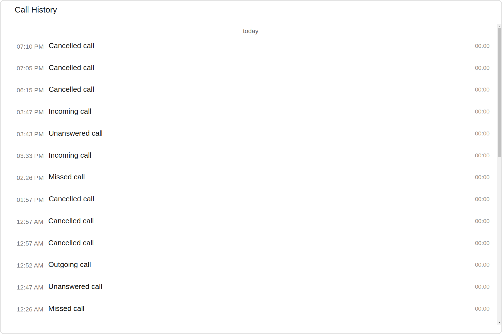
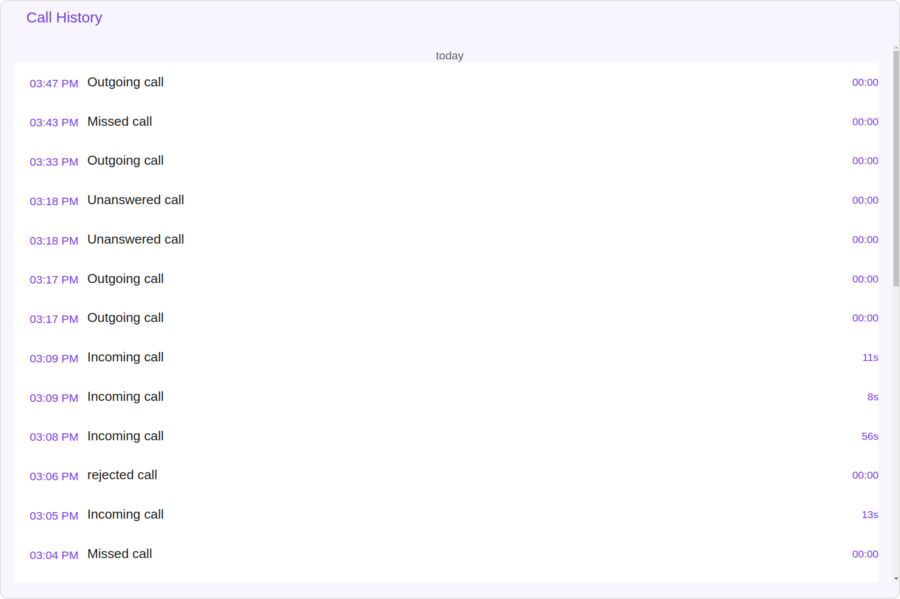
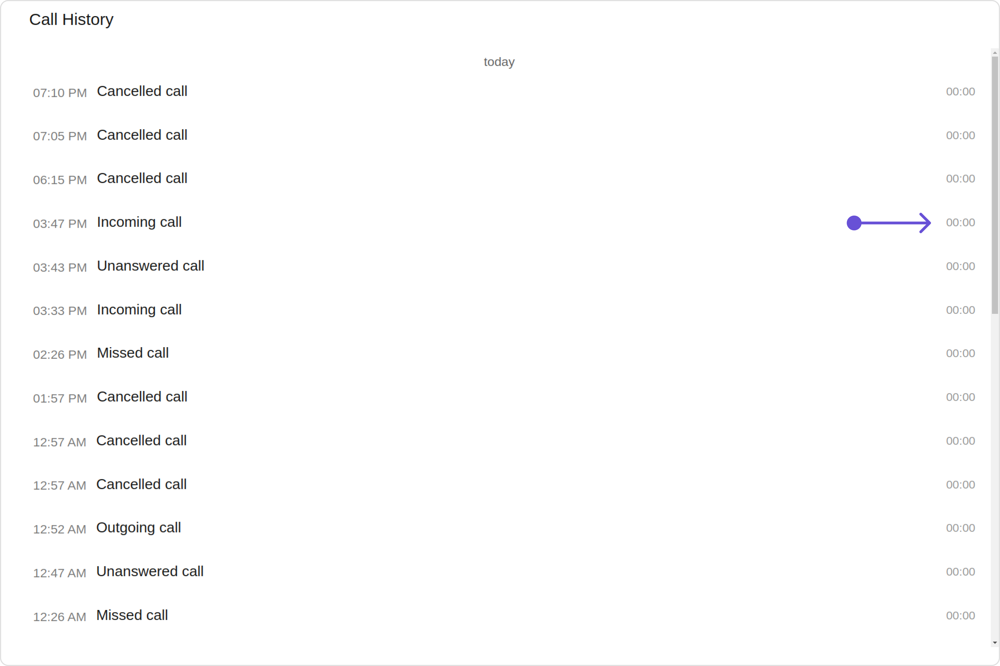
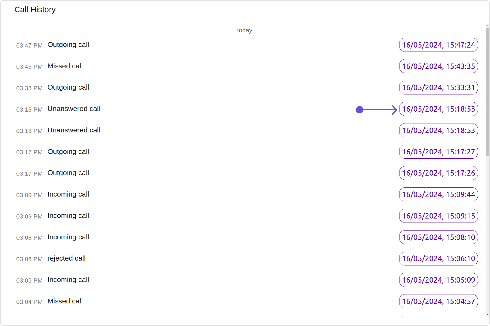
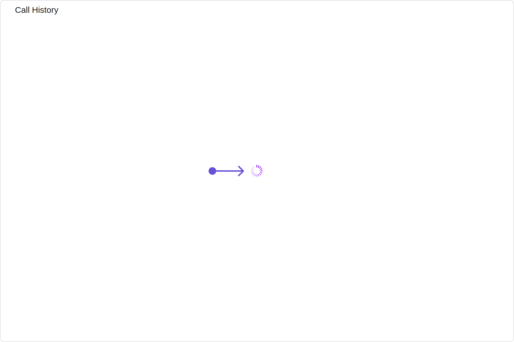
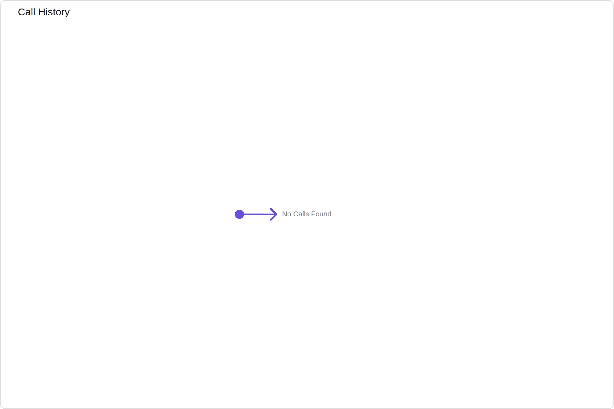
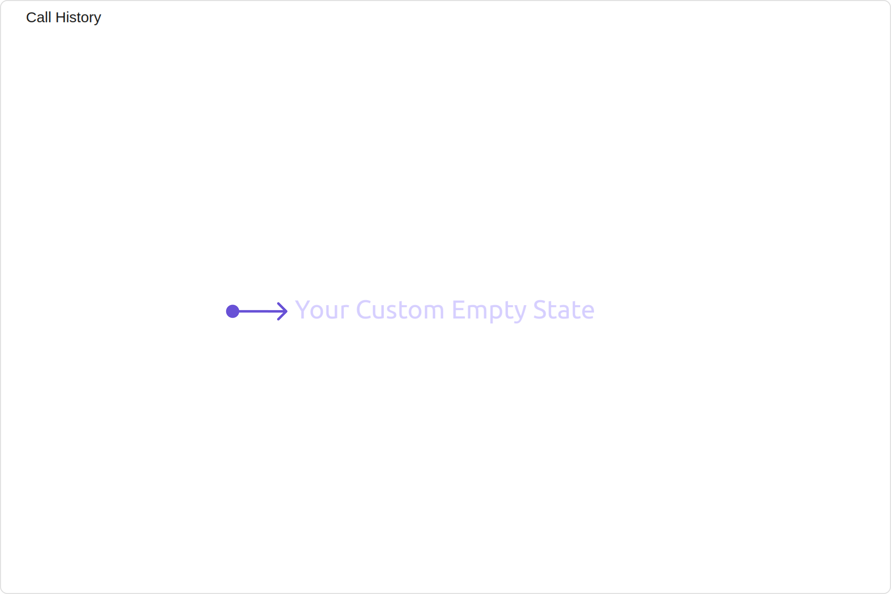

import Tabs from '@theme/Tabs';
import TabItem from '@theme/TabItem';

## Overview

`CometChatCallLogHistory` is a [Component](./components-overview#components) that shows a paginated list of all the calls between the logged-in user & another user or group. This allows the user to see all the calls with a specific user/group they have initiated/received/missed.



The `Call Log History` is comprised of the following components:

| Components                       | Description                                                                                                                                         |
| -------------------------------- | --------------------------------------------------------------------------------------------------------------------------------------------------- |
| CometChatList                    | a reusable container component having title, search box, customisable background and a List View                                                    |
| [CometChatListItem](./list-item) | a component that renders data obtained from a Group object on a Tile having a title, subtitle, leading and trailing view                            |
| cometchat-divider                | This component is a visual element used to separate content or sections within a CometChat interface, enhancing readability and visual organization |
| [cometchat-date](./date)         | This Component used to show the date and time. You can also customize the appearance of this widget by modifying its logic.                         |
| cometchat-button                 | This component represents a button with optional icon and text.                                                                                     |

## Usage

### Integration

<Tabs>
<TabItem value="CallLogHistoryDemo" label="CallLogHistoryDemo.tsx">

```tsx
import { CometChatCallLogHistory } from "@cometchat/chat-uikit-react";
import React from "react";

const CallLogHistoryDemo = () => {
  return <CometChatCallLogHistory />;
};

export default CallLogHistoryDemo;
```

</TabItem>

<TabItem value="ts" label="App.tsx">

```jsx
import { CallLogHistoryDemo } from "./CallLogHistoryDemo";

export default function App() {
  return (
    <div className="App">
      <div>
        <CallLogHistoryDemo />
      </div>
    </div>
  );
}
```

</TabItem>
</Tabs>

### Actions

[Actions](./components-overview#actions) dictate how a component functions. They are divided into two types: Predefined and User-defined. You can override either type, allowing you to tailor the behavior of the component to fit your specific needs.

##### 1. onBackClick

`onBackClick` is triggered when you click the Back button Icon of the `Call Log History` component. It does not have a default behavior. However, you can override its behavior using the following code snippet.

<Tabs>
<TabItem value="TypeScript" label="TypeScript">

```tsx title='CallLogHistoryDemo.tsx'
import { CometChatCallLogHistory } from "@cometchat/chat-uikit-react";
import React from "react";

const CallLogHistoryDemo = () => {
  const handleOnBackClick = () => {
    //your custom on back click action
  };
  return <CometChatCallLogHistory onBackClick={handleOnBackClick} />;
};

export default CallLogHistoryDemo;
```

</TabItem>
<TabItem value="JavaScript" label="JavaScript">

```jsx title='CallLogHistoryDemo.jsx'
import { CometChatCallLogHistory } from "@cometchat/chat-uikit-react";
import React from "react";

const CallLogHistoryDemo = () => {
  const handleOnBackClick = () => {
    //your custom on back click action
  };
  return <CometChatCallLogHistory onBackClick={handleOnBackClick} />;
};

export default CallLogHistoryDemo;
```

</TabItem>
</Tabs>

##### 1. onItemClick

`onItemClick` is triggered when you click on a ListItem of the of the `Call Log History` component. It does not have a default behavior. However, you can override its behavior using the following code snippet.

<Tabs>
<TabItem value="TypeScript" label="TypeScript">

```tsx title='CallLogHistoryDemo.tsx'
import { CometChatCallLogHistory } from "@cometchat/chat-uikit-react";
import React from "react";

const CallLogHistoryDemo = () => {
  const handleOnItemClick = () => {
    //your custom on item click action
  };
  return <CometChatCallLogHistory onItemClick={handleOnItemClick} />;
};

export default CallLogHistoryDemo;
```

</TabItem>
<TabItem value="JavaScript" label="JavaScript">

```jsx title='CallLogHistoryDemo.jsx'
import { CometChatCallLogHistory } from "@cometchat/chat-uikit-react";
import React from "react";

const CallLogHistoryDemo = () => {
  const handleOnItemClick = () => {
    //your custom on item click action
  };
  return <CometChatCallLogHistory onItemClick={handleOnItemClick} />;
};

export default CallLogHistoryDemo;
```

</TabItem>
</Tabs>

##### 3. onError

This action doesn't change the behavior of the component but rather listens for any errors that occur in the `Call Log History` component.

<Tabs>
<TabItem value="TypeScript" label="TypeScript">

```tsx title='CallLogHistoryDemo.tsx'
import { CometChatCallLogHistory } from "@cometchat/chat-uikit-react";
import React from "react";

const CallLogHistoryDemo = () => {
  const handleOnError = () => {
    //your custom on error action
  };
  return <CometChatCallLogHistory onError={handleOnError} />;
};

export default CallLogHistoryDemo;
```

</TabItem>
<TabItem value="JavaScript" label="JavaScript">

```jsx title='CallLogHistoryDemo.jsx'
import { CometChatCallLogHistory } from "@cometchat/chat-uikit-react";
import React from "react";

const CallLogHistoryDemo = () => {
  const handleOnError = () => {
    //your custom on error action
  };
  return <CometChatCallLogHistory onError={handleOnError} />;
};

export default CallLogHistoryDemo;
```

</TabItem>
</Tabs>

---

### Filters

**Filters** allow you to customize the data displayed in a list within a `Component`. You can filter the list based on your specific criteria, allowing for a more customized. Filters can be applied using `RequestBuilders` of Chat SDK.

##### 1. CallLogRequestBuilder

The [CallLogRequestBuilder](/sdk/javascript/call-logs) enables you to filter and customize the Call Log History based on available parameters in [CallLogRequestBuilder](/sdk/javascript/call-logs). This feature allows you to create more specific and targeted queries when fetching the call logs. The following are the parameters available in [CallLogRequestBuilder](/sdk/javascript/call-logs)

| Methods              | Type       | Description                                                  |
| -------------------- | ---------- | ------------------------------------------------------------ |
| **setLimit**         | number     | Specifies the number of call logs to fetch.                  |
| **setCallType**      | String     | Sets the type of calls to fetch (call or meet).              |
| **setCallStatus**    | callStatus | Sets the status of calls to fetch (initiated, ongoing, etc.) |
| **setHasRecording**  | boolean    | Sets whether to fetch calls that have recordings.            |
| **setCallCategory**  | string     | Sets the category of calls to fetch (call or meet).          |
| **setCallDirection** | string     | Sets the direction of calls to fetch (incoming or outgoing)  |
| **setUid**           | string     | Sets the UID of the user whose call logs to fetch.           |
| **setGuid**          | string     | Sets the GUID of the user whose call logs to fetch.          |
| **setAuthToken**     | string     | Sets the Auth token of the logged-in user.                   |

**Example**

In the example below, we're filtering Call Log History to show only canceled calls and setting the limit to five.

<Tabs>
<TabItem value="TypeScript" label="TypeScript">

```tsx title='CallLogHistoryDemo.tsx'
import { CallLogRequestBuilder } from "@cometchat/calls-sdk-javascript";
import { CometChatCallLogHistory } from "@cometchat/chat-uikit-react";
import React from "react";

const CallLogHistoryDemo = () => {
  return (
    <CometChatCallLogHistory
      callLogRequestBuilder={new CallLogRequestBuilder()
        .setLimit(5)
        .setAuthToken("auth-token")
        .setCallStatus("cancelled")
        .build()}
    />
  );
};

export default CallLogHistoryDemo;
```

</TabItem>
<TabItem value="JavaScript" label="JavaScript">

```jsx title='CallLogHistoryDemo.jsx'
import { CallLogRequestBuilder } from "@cometchat/calls-sdk-javascript";
import { CometChatCallLogHistory } from "@cometchat/chat-uikit-react";
import React from "react";

const CallLogHistoryDemo = () => {
  return (
    <CometChatCallLogHistory
      callLogRequestBuilder={new CallLogRequestBuilder()
        .setLimit(5)
        .setAuthToken("auth-token")
        .setCallStatus("cancelled")
        .build()}
    />
  );
};

export default CallLogHistoryDemo;
```

</TabItem>
</Tabs>

---

### Events

[Events](./components-overview#events) are emitted by a `Component`. By using event you can extend existing functionality. Being global events, they can be applied in Multiple Locations and are capable of being Added or Removed.

The `CallLogHistory` does not produce any events.

---

## Customization

To fit your app's design requirements, you have the ability to customize the appearance of the
`CallLogHistory` component. We provide exposed methods that allow you to modify the experience and behavior according to your specific needs.

### Style

Using **Style** you can **customize** the look and feel of the component in your app, These parameters typically control elements such as the **color**, **size**, **shape**, and **fonts** used within the component.

##### 1. CallLogHistory Style

To customize the appearance, you can assign a `CallLogHistoryStyle` object to the `Call Log History` component.

**Example**

In this example, we are employing the `callLogHistoryStyle`.

<Tabs>
<TabItem value="TypeScript" label="TypeScript">

```tsx title='CallLogHistoryDemo.tsx'
import {
  CometChatCallLogHistory,
  CallLogHistoryStyle,
} from "@cometchat/chat-uikit-react";
import React from "react";

const CallLogHistoryDemo = () => {
  const callLogHistoryStyle = new CallLogHistoryStyle({
    background: "#f8f5ff",
    titleColor: "#6f3ae0",
    callDurationTextColor: "#6f34ed",
    dateTextColor: "#6f34ed",
    dividerColor: "#6f34ed",
  });
  return <CometChatCallLogHistory callLogHistoryStyle={callLogHistoryStyle} />;
};

export default CallLogHistoryDemo;
```

</TabItem>
<TabItem value="JavaScript" label="JavaScript">

```jsx title='CallLogHistoryDemo.jsx'
import {
  CometChatCallLogHistory,
  CallLogHistoryStyle,
} from "@cometchat/chat-uikit-react";
import React from "react";

const CallLogHistoryDemo = () => {
  const callLogHistoryStyle = new CallLogHistoryStyle({
    background: "#f8f5ff",
    titleColor: "#6f3ae0",
    callDurationTextColor: "#6f34ed",
    dateTextColor: "#6f34ed",
    dividerColor: "#6f34ed",
  });
  return <CometChatCallLogHistory callLogHistoryStyle={callLogHistoryStyle} />;
};

export default CallLogHistoryDemo;
```

</TabItem>
</Tabs>



---

The following properties are exposed by `CallLogHistoryStyle`:

| Property                   | Description                           | Code                               |
| -------------------------- | ------------------------------------- | ---------------------------------- |
| **border**                 | Used to set border                    | `border?: string,`                 |
| **borderRadius**           | Used to set border radius             | `borderRadius?: string;`           |
| **background**             | Used to set background colour         | `background?: string;`             |
| **height**                 | Used to set height                    | `height?: string;`                 |
| **width**                  | Used to set width                     | `width?: string;`                  |
| **titleFont**              | Used to set title font                | `titleFont?: string,`              |
| **titleColor**             | Used to set title color               | `titleColor?: string;`             |
| **emptyStateTextColor**    | Used to set empty state text color    | `emptyStateTextColor?: string;`    |
| **emptyStateTextFont**     | Used to set empty state text font     | `emptyStateTextFont?: string;`     |
| **errorStateTextColor**    | Used to set error state text color    | `errorStateTextColor?: string;`    |
| **errorStateTextFont**     | Used to set error state text font     | `errorStateTextFont?: string;`     |
| **loadingIconTint**        | Used to set loading icon tint         | `loadingIconTint?: string;`        |
| **backIconTint**           | Used to set back icon tint            | `backIconTint?: string;`           |
| **dateTextFont**           | Used to set date text font            | `dateTextFont?: string;`           |
| **dateTextColor**          | Used to set date text color           | `dateTextColor?: string;`          |
| **dateSeparatorTextFont**  | Used to set date separator text font  | `dateSeparatorTextFont?: string;`  |
| **dateSeparatorTextColor** | Used to set date separator text color | `dateSeparatorTextColor?: string;` |
| **callDurationTextFont**   | Used to set call duration text font   | `callDurationTextFont?: string;`   |
| **callDurationTextColor**  | Used to set call duration text color  | `callDurationTextColor?: string;`  |
| **callStatusTextFont**     | Used to set call status text font     | `callStatusTextFont?: string;`     |
| **callStatusTextColor**    | Used to set call status text color    | `callStatusTextColor?: string;`    |
| **dividerColor**           | Used to set divider color             | `dividerColor?: string;`           |

##### 2. ListItem Style

If you want to apply customized styles to the `ListItemStyle` component within the `Call Log History` Component, you can use the following code snippet. For more information, you can refer [ListItem Styles](./list-item#listitemstyle).

<Tabs>
<TabItem value="TypeScript" label="TypeScript">

```tsx title='CallLogHistoryDemo.tsx'
import {
  CometChatCallLogHistory,
  ListItemStyle,
} from "@cometchat/chat-uikit-react";
import React from "react";

const CallLogHistoryDemo = () => {
  const listItemStyle = new ListItemStyle({
    background: "#f8f5ff",
    activeBackground: "#6f34ed",
    titleColor: "#6f34ed",
  });
  return <CometChatCallLogHistory listItemStyle={listItemStyle} />;
};

export default CallLogHistoryDemo;
```

</TabItem>
<TabItem value="JavaScript" label="JavaScript">

```jsx title='CallLogHistoryDemo.jsx'
import {
  CometChatCallLogHistory,
  ListItemStyle,
} from "@cometchat/chat-uikit-react";
import React from "react";

const CallLogHistoryDemo = () => {
  const listItemStyle = new ListItemStyle({
    background: "#f8f5ff",
    activeBackground: "#6f34ed",
    titleColor: "#6f34ed",
  });
  return <CometChatCallLogHistory listItemStyle={listItemStyle} />;
};

export default CallLogHistoryDemo;
```

</TabItem>
</Tabs>

---

### Functionality

These are a set of small functional customizations that allow you to fine-tune the overall experience of the component. With these, you can change text, set custom icons, and toggle the visibility of UI elements.

Here is a code snippet demonstrating how you can customize the functionality of the `Call Log History` component.

<Tabs>
<TabItem value="TypeScript" label="TypeScript">

```tsx title='CallLogHistoryDemo.tsx'
import {
  CometChatCallLogHistory,
  DatePatterns,
} from "@cometchat/chat-uikit-react";
import React from "react";

const CallLogHistoryDemo = () => {
  return (
    <CometChatCallLogHistory
      title="Your Custom Title"
      datePattern={DatePatterns.DateTime}
    />
  );
};

export default CallLogHistoryDemo;
```

</TabItem>
<TabItem value="JavaScript" label="JavaScript">

```jsx title='CallLogHistoryDemo.jsx'
import {
  CometChatCallLogHistory,
  DatePatterns,
} from "@cometchat/chat-uikit-react";
import React from "react";

const CallLogHistoryDemo = () => {
  return (
    <CometChatCallLogHistory
      title="Your Custom Title"
      datePattern={DatePatterns.DateTime}
    />
  );
};

export default CallLogHistoryDemo;
```

</TabItem>
</Tabs>

Default:


Custom:


Below is a list of customizations along with corresponding code snippets

| Property                 | Description                               | Code                                              |
| ------------------------ | ----------------------------------------- | ------------------------------------------------- |
| **title**                | Used to set custom title                  | `title='Your Custom Title'`                       |
| **emptyStateText**       | Used to set custom empty state text       | `emptyStateText='Your Custom Empty State Text'`   |
| **errorStateText**       | Used to set custom error state text       | `errorStateText='Your Custom Error State Text'`   |
| **datePattern**          | Used to set custom date pattern           | `datePattern={DatePatterns.DayDateTime}`          |
| **dateSeparatorPattern** | Used to set custom date separator pattern | `dateSeparatorPattern={DatePatterns.DayDateTime}` |
| **backIconUrl**          | Used to set custom back icon URL          | `backIconUrl?: string;`                           |
| **loadingIconURL**       | Used to set custom loading icon URL       | `loadingIconURL?: string;`                        |
| **callGroup**            | Used to set group object                  | `callGroup={chatGroup}`                           |
| **callUser**             | Used to set group object                  | `callUser={chatUser}`                             |

---

### Advanced

For advanced-level customization, you can set custom views to the component. This lets you tailor each aspect of the component to fit your exact needs and application aesthetics. You can create and define your views, layouts, and UI elements and then incorporate those into the component.

---

#### TailView

You can customize the tail view for each call log history item to meet your requirements

```jsx
tailView = { getTailView };
```

Default:


Custom:


<Tabs>
<TabItem value="TypeScript" label="TypeScript">

```tsx title='CallLogHistoryDemo.tsx'
import { CallLog } from "@cometchat/calls-sdk-javascript";
import { CometChatCallLogHistory } from "@cometchat/chat-uikit-react";
import React from "react";

const CallLogHistoryDemo = () => {
  function getTailView(call: CallLog): JSX.Element {
    function formatTime(timestamp: number) {
      const date = new Date(timestamp * 1000);
      return date.toLocaleString();
    }
    return (
      <div
        style={{
          color: "#5a00a8",
          border: "1px solid #5a00a8",
          borderRadius: "12px",
          padding: "5px",
        }}
      >
        {formatTime(call.getInitiatedAt())}
      </div>
    );
  }

  return <CometChatCallLogHistory tailView={getTailView} />;
};

export default CallLogHistoryDemo;
```

</TabItem>
<TabItem value="JavaScript" label="JavaScript">

```jsx title='CallLogHistoryDemo.jsx'
import { CometChatCallLogHistory } from "@cometchat/chat-uikit-react";
import React from "react";

const CallLogHistoryDemo = () => {
  function getTailView(call) {
    function formatTime(timestamp) {
      const date = new Date(timestamp * 1000);
      return date.toLocaleString();
    }
    return (
      <div
        style={{
          color: "#5a00a8",
          border: "1px solid #5a00a8",
          borderRadius: "12px",
          padding: "5px",
        }}
      >
        {formatTime(call.getInitiatedAt())}
      </div>
    );
  }

  return <CometChatCallLogHistory tailView={getTailView} />;
};

export default CallLogHistoryDemo;
```

</TabItem>
</Tabs>

---

#### SubtitleView

You can customize the subtitle view for each call log History item to meet your requirements

```jsx
subtitleView = { getSubtitleView };
```

Default:


Custom:


<Tabs>
<TabItem value="TypeScript" label="TypeScript">

```tsx title='CallLogHistoryDemo.tsx'
import { CallLog } from "@cometchat/calls-sdk-javascript";
import { CometChatCallLogHistory } from "@cometchat/chat-uikit-react";
import React from "react";

const CallLogHistoryDemo = () => {
  const getSubtitleView = (call: CallLog): JSX.Element => {
    return (
      <div
        style={{
          display: "flex",
          alignItems: "left",
          padding: "2px",
          fontSize: "10px",
        }}
      >
        <div style={{ color: "gray", fontSize: "15px" }}>
          {call.getStatus()}
        </div>
      </div>
    );
  };

  return <CometChatCallLogHistory subtitleView={getSubtitleView} />;
};

export default CallLogHistoryDemo;
```

</TabItem>
<TabItem value="JavaScript" label="JavaScript">

```jsx title='CallLogHistoryDemo.jsx'
import { CometChatCallLogHistory } from "@cometchat/chat-uikit-react";
import React from "react";

const CallLogHistoryDemo = () => {
  const getSubtitleView = (call) => {
    return (
      <div
        style={{
          display: "flex",
          alignItems: "left",
          padding: "2px",
          fontSize: "10px",
        }}
      >
        <div style={{ color: "gray", fontSize: "15px" }}>
          {call.getStatus()}
        </div>
      </div>
    );
  };

  return <CometChatCallLogHistory subtitleView={getSubtitleView} />;
};

export default CallLogHistoryDemo;
```

</TabItem>
</Tabs>

---

#### LoadingStateView

You can set a custom loader view using `loadingStateView` to match the loading view of your app.

```jsx
loadingStateView={getLoadingStateView()}
```

Default:


Custom:


<Tabs>
<TabItem value="TypeScript" label="TypeScript">

```tsx title='CallLogHistoryDemo.tsx'
import { CallLog } from "@cometchat/calls-sdk-javascript";
import {
  CometChatCallLogHistory,
  LoaderStyle,
} from "@cometchat/chat-uikit-react";
import React from "react";

const CallLogHistoryDemo = () => {
  const getLoadingStateView = () => {
    const getLoaderStyle = new LoaderStyle({
      iconTint: "#890aff",
      background: "transparent",
      height: "100vh",
      width: "100vw",
      border: "none",
      borderRadius: "0",
    });

    return (
      <div style={{ position: "absolute", top: "0" }}>
        <cometchat-loader
          iconURL="icon"
          loaderStyle={JSON.stringify(getLoaderStyle)}
        ></cometchat-loader>
      </div>
    );
  };

  return <CometChatCallLogHistory loadingStateView={getLoadingStateView()} />;
};

export default CallLogHistoryDemo;
```

</TabItem>
<TabItem value="JavaScript" label="JavaScript">

```jsx title='CallLogHistoryDemo.jsx'
import {
  CometChatCallLogHistory,
  LoaderStyle,
} from "@cometchat/chat-uikit-react";
import React from "react";

const CallLogHistoryDemo = () => {
  const getLoadingStateView = () => {
    const getLoaderStyle = new LoaderStyle({
      iconTint: "#890aff",
      background: "transparent",
      height: "100vh",
      width: "100vw",
      border: "none",
      borderRadius: "0",
    });

    return (
      <div style={{ position: "absolute", top: "0" }}>
        <cometchat-loader
          iconURL="icon"
          loaderStyle={JSON.stringify(getLoaderStyle)}
        ></cometchat-loader>
      </div>
    );
  };

  return <CometChatCallLogHistory loadingStateView={getLoadingStateView()} />;
};

export default CallLogHistoryDemo;
```

</TabItem>
</Tabs>

---

#### EmptyStateView

You can set a custom `EmptyStateView` using `emptyStateView` to match the empty view of your app.

```jsx
emptyStateView={getEmptyStateView()}
```

Default:


Custom:


<Tabs>
<TabItem value="TypeScript" label="TypeScript">

```tsx title='CallLogHistoryDemo.tsx'
import { CallLog } from "@cometchat/calls-sdk-javascript";
import { CometChatCallLogHistory } from "@cometchat/chat-uikit-react";
import React from "react";

const CallLogHistoryDemo = () => {
  const getEmptyStateView = () => {
    return (
      <div style={{ color: "#d6cfff", fontSize: "30px", font: "bold" }}>
        Your Custom Empty State
      </div>
    );
  };

  return <CometChatCallLogHistory emptyStateView={getEmptyStateView()} />;
};

export default CallLogHistoryDemo;
```

</TabItem>
<TabItem value="JavaScript" label="JavaScript">

```jsx title='CallLogHistoryDemo.jsx'
import { CometChatCallLogHistory } from "@cometchat/chat-uikit-react";
import React from "react";

const CallLogHistoryDemo = () => {
  const getEmptyStateView = () => {
    return (
      <div style={{ color: "#d6cfff", fontSize: "30px", font: "bold" }}>
        Your Custom Empty State
      </div>
    );
  };

  return <CometChatCallLogHistory emptyStateView={getEmptyStateView()} />;
};

export default CallLogHistoryDemo;
```

</TabItem>
</Tabs>

#### ErrorStateView

You can set a custom `ErrorStateView` using `errorStateView` to match the error view of your app.

```jsx
errorStateView={getErrorStateView()}
```

<Tabs>
<TabItem value="TypeScript" label="TypeScript">

```tsx title='CallLogHistoryDemo.tsx'
import { CallLog } from "@cometchat/calls-sdk-javascript";
import { CometChatCallLogHistory } from "@cometchat/chat-uikit-react";
import React from "react";

const CallLogHistoryDemo = () => {
  const getErrorStateView = () => {
    return (
      <div style={{ height: "100vh", width: "100vw" }}>
        </img>
      </div>
    );
  };

  return <CometChatCallLogHistory errorStateView={getErrorStateView()} />;
};

export default CallLogHistoryDemo;
```

</TabItem>
<TabItem value="JavaScript" label="JavaScript">

```jsx title='CallLogHistoryDemo.jsx'
import { CometChatCallLogHistory } from "@cometchat/chat-uikit-react";
import React from "react";

const CallLogHistoryDemo = () => {
  const getErrorStateView = () => {
    return (
      <div style={{ height: "100vh", width: "100vw" }}>
        </img>
      </div>
    );
  };

  return <CometChatCallLogHistory errorStateView={getErrorStateView()} />;
};

export default CallLogHistoryDemo;
```

</TabItem>
</Tabs>

---
