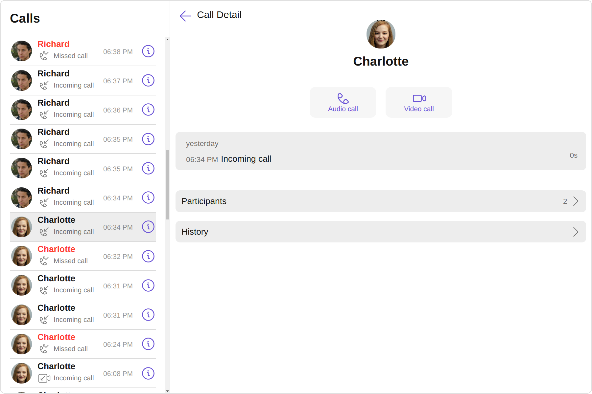
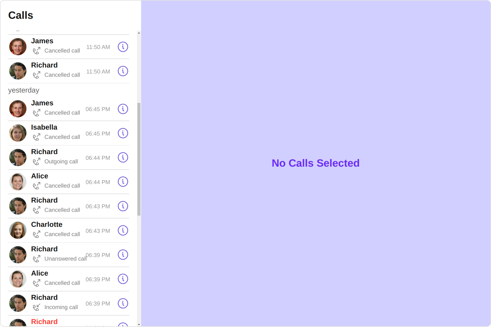
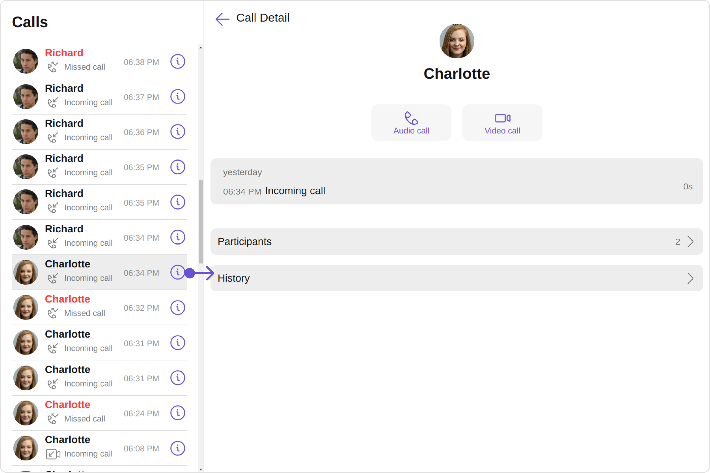
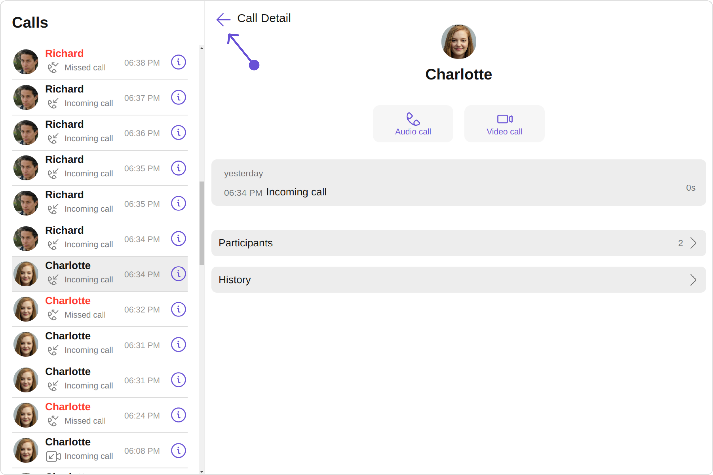
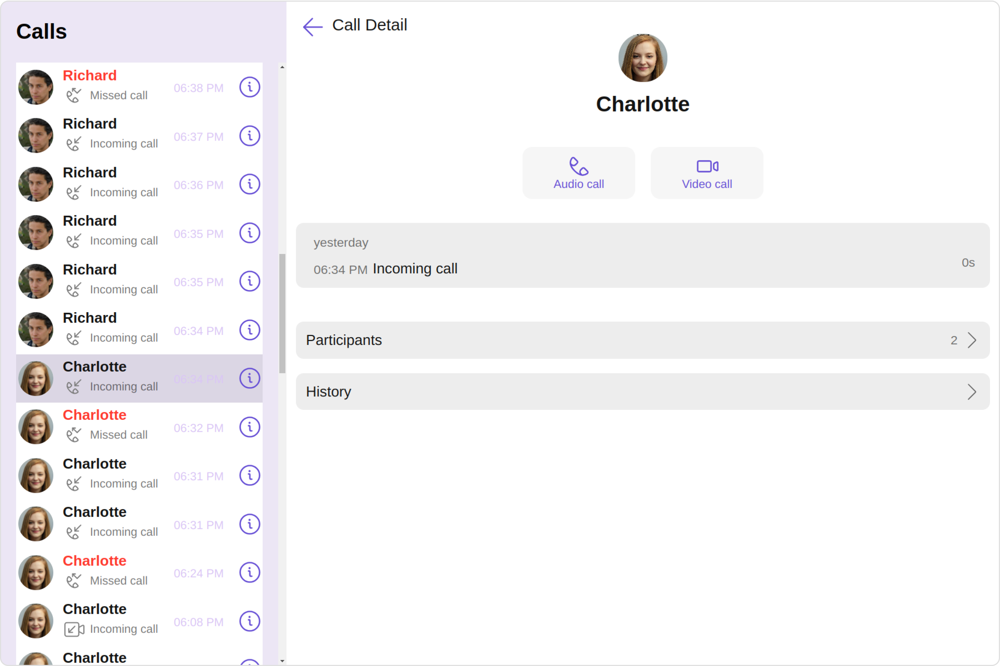
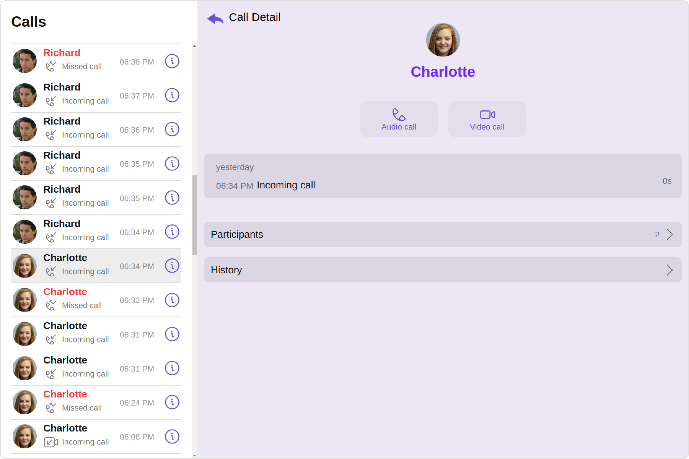

import Tabs from '@theme/Tabs';
import TabItem from '@theme/TabItem';

## Overview

The `CometChatCallLogsWithDetails` is a [Composite Component](./components-overview#composite-components) encompassing components such as [Call Logs](./call-logs) and [Call Log Details](./call-log-details). Both of these component contributes to the functionality and structure of the overall `CallLogsWithDetails` component.



| Components                             | Description                                                                                                                                                                                                                                                           |
| -------------------------------------- | --------------------------------------------------------------------------------------------------------------------------------------------------------------------------------------------------------------------------------------------------------------------- |
| [Call Logs](./call-logs)               | The `Call Logs` component is designed to show the list of Call Log available . By default, names are shown for all listed users, along with their avatar if available.                                                                                                |
| [Call Log Details](./call-log-details) | The `Call Log Details` component is designed to displays all the information related to a call. This component displays information like user/group information, participants of the call, recordings of the call (if available) & history of all the previous calls. |

## Usage

### Integration

<Tabs>
<TabItem value="js" label="CallLogsWithDetailsDemo.tsx">

```tsx
import { CometChatCallLogsWithDetails } from "@cometchat/chat-uikit-react";
import React from "react";

const CallLogsWithDetailsDemo = () => {
  return <CometChatCallLogsWithDetails />;
};

export default CallLogsWithDetailsDemo;
```

</TabItem>
<TabItem value="ts" label="App.tsx">

```tsx
import CallLogsWithDetailsDemo from "./CallLogsWithDetailsDemo";

export default function App() {
  return (
    <div className="App">
      <CallLogsWithDetailsDemo />
    </div>
  );
}
```

</TabItem>
</Tabs>

---

### Actions

[Actions](./components-overview#actions) dictate how a component functions. They are divided into two types: Predefined and User-defined. You can override either type, allowing you to tailor the behavior of the component to fit your specific needs.

While the CallLogsWithDetails component does not have its actions, its components - Call Logs, and Call Log Details - each have their own set of actions.

The Action of the components can be overridden through the use of the Configurations object of its components. Here is an example code snippet.

<Tabs>
<TabItem value="TypeScript" label="TypeScript">

```tsx title='CallLogsWithDetailsDemo.tsx'
import {
  CallLogDetailsConfiguration,
  CallLogsConfiguration,
  CometChatCallLogsWithDetails,
} from "@cometchat/chat-uikit-react";
import React from "react";

const CallLogsWithDetailsDemo = () => {
  function getOnInfoClick(item: any): void {
    //Your Custom  on info click Actions
  }

  function getOnBackClick(): void {
    //Your Custom on back click Actions
  }

  return (
    <CometChatCallLogsWithDetails
      callLogsConfiguration={
        new CallLogsConfiguration({
          onInfoClick: getOnInfoClick,
        })
      }
      callLogDetailsConfiguration={
        new CallLogDetailsConfiguration({
          onBackClick: getOnBackClick,
        })
      }
    />
  );
};

export default CallLogsWithDetailsDemo;
```

</TabItem>
<TabItem value="JavaScript" label="JavaScript">

```jsx title='CallLogsWithDetailsDemo.jsx'
import {
  CallLogDetailsConfiguration,
  CallLogsConfiguration,
  CometChatCallLogsWithDetails,
} from "@cometchat/chat-uikit-react";
import React from "react";

const CallLogsWithDetailsDemo = () => {
  function getOnInfoClick(item) {
    // Your Custom on info click Actions
  }

  function getOnBackClick() {
    // Your Custom on back click Actions
  }

  return (
    <CometChatCallLogsWithDetails
      callLogsConfiguration={
        new CallLogsConfiguration({
          onInfoClick: getOnInfoClick,
        })
      }
      callLogDetailsConfiguration={
        new CallLogDetailsConfiguration({
          onBackClick: getOnBackClick,
        })
      }
    />
  );
};

export default CallLogsWithDetailsDemo;
```

</TabItem>
</Tabs>

The `CometChatCallLogsWithDetails` component overrides several actions from its components to reach its default behavior. The list of actions overridden by GroupsWithMessages includes:

- [onInfoClick](./call-logs/#2-oninfoclick) : By overriding the `onInfoClick` of the Call Logs Component, CallLogsWithDetails achieves navigation from [Call Logs](./call-logs) to [Call Log Details](./call-log-details) component.


---

### Filters

**Filters** allow you to customize the data displayed in a list within a Component. You can filter the list based on your specific criteria, allowing for a more customized. Filters can be applied using RequestBuilders of Chat SDK.

While the CallLogsWithDetails component does not have filters, its components do, For more detail on individual filters of its component refer to [Call Logs](./call-logs) and [Call Log Details](./call-log-details).

By utilizing the [Configurations](#configurations) object of its components, you can apply filters.

In the following **example**, we are applying a filter to the Call Logs by setting the status to show only 'missed' calls and setting the limit to 5 using the `callLogRequestBuilder`.

<Tabs>
<TabItem value="TypeScript" label="TypeScript">

```tsx title='CallLogsWithDetailsDemo.tsx'
import { CallLogRequestBuilder } from "@cometchat/calls-sdk-javascript";
import {
  CallLogsConfiguration,
  CometChatCallLogsWithDetails,
} from "@cometchat/chat-uikit-react";
import React from "react";

const CallLogsWithDetailsDemo = () => {
  return (
    <CometChatCallLogsWithDetails
      callLogsConfiguration={
        new CallLogsConfiguration({
          callLogRequestBuilder: new CallLogRequestBuilder()
            .setAuthToken("auth-token")
            .setLimit(5)
            .setCallStatus("missed"),
        })
      }
    />
  );
};

export default CallLogsWithDetailsDemo;
```

</TabItem>
<TabItem value="JavaScript" label="JavaScript">

```jsx title='CallLogsWithDetailsDemo.jsx'
import { CallLogRequestBuilder } from "@cometchat/calls-sdk-javascript";
import {
  CallLogsConfiguration,
  CometChatCallLogsWithDetails,
} from "@cometchat/chat-uikit-react";
import React from "react";

const CallLogsWithDetailsDemo = () => {
  return (
    <CometChatCallLogsWithDetails
      callLogsConfiguration={
        new CallLogsConfiguration({
          callLogRequestBuilder: new CallLogRequestBuilder()
            .setAuthToken("auth-token")
            .setLimit(5)
            .setCallStatus("missed"),
        })
      }
    />
  );
};

export default CallLogsWithDetailsDemo;
```

</TabItem>
</Tabs>

---

### Events

[Events](./components-overview#events) are emitted by a `Component`. By using event you can extend existing functionality. Being global events, they can be applied in Multiple Locations and are capable of being Added or Removed.

The CallLogsWithDetails does not produce any events.

---

## Customization

To fit your app's design requirements, you have the ability to customize the appearance of the
CallLogsWithDetails component. We provide exposed methods that allow you to modify the experience and behavior according to your specific needs.

### Style

Using **Style** you can **customize** the look and feel of the component in your app, These parameters typically control elements such as the **color**, **size**, **shape**, and **fonts** used within the component.

##### 1. WithDetailsStyle

You can set the `withDetailsStyle` to the CallLogsWithDetails Component to customize the styling.



<Tabs>
<TabItem value="TypeScript" label="TypeScript">

```tsx title='CallLogsWithDetailsDemo.tsx'
import {
  CometChatCallLogsWithDetails,
  WithDetailsStyle,
} from "@cometchat/chat-uikit-react";
import React from "react";

const CallLogsWithDetailsDemo = () => {
  const withDetailsStyle = new WithDetailsStyle({
    background: "#d1cfff",
    messageTextColor: "#6b2af7",
    border: "1px solid #E0E0E0",
  });
  return <CometChatCallLogsWithDetails withDetailsStyle={withDetailsStyle} />;
};

export default CallLogsWithDetailsDemo;
```

</TabItem>
<TabItem value="JavaScript" label="JavaScript">

```jsx title='CallLogsWithDetailsDemo.jsx'
import {
  CometChatCallLogsWithDetails,
  WithDetailsStyle,
} from "@cometchat/chat-uikit-react";
import React from "react";

const CallLogsWithDetailsDemo = () => {
  const withDetailsStyle = new WithDetailsStyle({
    background: "#d1cfff",
    messageTextColor: "#6b2af7",
    border: "1px solid #E0E0E0",
  });

  return <CometChatCallLogsWithDetails withDetailsStyle={withDetailsStyle} />;
};

export default CallLogsWithDetailsDemo;
```

</TabItem>
</Tabs>

---

You can also customize its component styles. For more details on individual component styles, you can refer [Call Logs Styles](./call-logs#1-calllogs-style) and [Call Log Details Styles](./call-log-details#1-calllogdetails-style).

Styles can be applied to SubComponents using their respective [configurations](#configurations).

**Example**

<Tabs>
<TabItem value="TypeScript" label="TypeScript">

```tsx title='CallLogsWithDetailsDemo.tsx'
import {
  CometChatCallLogsWithDetails,
  CallLogDetailsStyle,
  CallLogsStyle,
  CallLogsConfiguration,
  CallLogDetailsConfiguration,
} from "@cometchat/chat-uikit-react";
import React from "react";

const CallLogsWithDetailsDemo = () => {
  const callLogsStyle = new CallLogsStyle({
    background: "#ece6f5",
    titleColor: "#000000",
    dateTextColor: "#dac6f5",
  });

  const callLogDetailsStyle = new CallLogDetailsStyle({
    background: "#ece6f5",
    titleColor: "#000000",
    nameTextColor: "#6b2af7",
  });

  return (
    <CometChatCallLogsWithDetails
      callLogsConfiguration={
        new CallLogsConfiguration({
          callLogsStyle: callLogsStyle,
        })
      }
      callLogDetailsConfiguration={
        new CallLogDetailsConfiguration({
          callLogDetailsStyle: callLogDetailsStyle,
        })
      }
    />
  );
};

export default CallLogsWithDetailsDemo;
```

</TabItem>
<TabItem value="JavaScript" label="JavaScript">

```jsx title='CallLogsWithDetailsDemo.jsx'
import {
  CometChatCallLogsWithDetails,
  CallLogDetailsStyle,
  CallLogsStyle,
  CallLogsConfiguration,
  CallLogDetailsConfiguration,
} from "@cometchat/chat-uikit-react";
import React from "react";

const CallLogsWithDetailsDemo = () => {
  const callLogsStyle = new CallLogsStyle({
    background: "#ece6f5",
    titleColor: "#000000",
    dateTextColor: "#dac6f5",
  });

  const callLogDetailsStyle = new CallLogDetailsStyle({
    background: "#ece6f5",
    titleColor: "#000000",
    nameTextColor: "#6b2af7",
  });

  return (
    <CometChatCallLogsWithDetails
      callLogsConfiguration={
        new CallLogsConfiguration({
          callLogsStyle: callLogsStyle,
        })
      }
      callLogDetailsConfiguration={
        new CallLogDetailsConfiguration({
          callLogDetailsStyle: callLogDetailsStyle,
        })
      }
    />
  );
};

export default CallLogsWithDetailsDemo;
```

</TabItem>
</Tabs>

---

### Functionality

These are a set of **small functional customizations** that allow you to **fine-tune** the overall experience of the component. With these, you can **change text**, set **custom icons**, and toggle the **visibility** of UI elements.

<Tabs>
<TabItem value="TypeScript" label="TypeScript">

```tsx title='CallLogsWithDetailsDemo.tsx'
import { CometChatCallLogsWithDetails } from "@cometchat/chat-uikit-react";
import React from "react";

const CallLogsWithDetailsDemo = () => {
  return (
    <CometChatCallLogsWithDetails
      isMobileView={false}
      messageText="Your Custom Message Text"
    />
  );
};

export default CallLogsWithDetailsDemo;
```

</TabItem>
<TabItem value="JavaScript" label="JavaScript">

```jsx title='CallLogsWithDetailsDemo.jsx'
import { CometChatCallLogsWithDetails } from "@cometchat/chat-uikit-react";
import React from "react";

const CallLogsWithDetailsDemo = () => {
  return (
    <CometChatCallLogsWithDetails
      isMobileView={false}
      messageText="Your Custom Message Text"
    />
  );
};

export default CallLogsWithDetailsDemo;
```

</TabItem>
</Tabs>

Below is a list of customizations along with corresponding code snippets:

| Property         | Description                                                                                                                                          | Code                                     |
| ---------------- | ---------------------------------------------------------------------------------------------------------------------------------------------------- | ---------------------------------------- |
| **isMobileView** | A boolean indicating if the component should render in mobile view for optimized display on mobile devices.                                          | `isMobileView: false`                    |
| **messageText**  | It represents the textual content which will be replaced with the Call Log Details component when user clicks on a particular info button call logs. | `messageText="Your Custom Message Text"` |

---

##### Components

Nearly all functionality customizations available for a Component are also available for the composite component. Using [Configuration](#configurations), you can modify the properties of its components to suit your needs.

You can find the list of all Functionality customization of individual components in [Call Logs ](./call-logs#functionality) and [Call Log Details Styles](./call-log-details#functionality).

**Example**

<Tabs>
<TabItem value="TypeScript" label="TypeScript">

```tsx title='CallLogsWithDetailsDemo.tsx'
import {
  CometChatCallLogsWithDetails,
  CallLogDetailsConfiguration,
  CallLogsConfiguration,
} from "@cometchat/chat-uikit-react";
import React from "react";

const CallLogsWithDetailsDemo = () => {
  return (
    <CometChatCallLogsWithDetails
      callLogsConfiguration={
        new CallLogsConfiguration({
          hideSeparator: true,
          infoIconUrl: "custom info icon",
        })
      }
      callLogDetailsConfiguration={
        new CallLogDetailsConfiguration({
          backIconUrl: "custom back icon",
        })
      }
    />
  );
};

export default CallLogsWithDetailsDemo;
```

</TabItem>
<TabItem value="JavaScript" label="JavaScript">

```jsx title='CallLogsWithDetailsDemo.jsx'
import {
  CometChatCallLogsWithDetails,
  CallLogDetailsConfiguration,
  CallLogsConfiguration,
} from "@cometchat/chat-uikit-react";
import React from "react";

const CallLogsWithDetailsDemo = () => {
  return (
    <CometChatCallLogsWithDetails
      callLogsConfiguration={
        new CallLogsConfiguration({
          hideSeparator: true,
          infoIconUrl: "custom info icon",
        })
      }
      callLogDetailsConfiguration={
        new CallLogDetailsConfiguration({
          backIconUrl: "custom back icon",
        })
      }
    />
  );
};

export default CallLogsWithDetailsDemo;
```

</TabItem>
</Tabs>

---

### Advanced

For advanced-level customization, you can set custom views to the component. This lets you tailor each aspect of the component to fit your exact needs and application aesthetics. You can create and define your own views, layouts, and UI elements and then incorporate those into the component.

By utilizing the [Configuration](#configurations) object of each component, you can apply advanced-level customizations to the GroupsWithMessages.

**Example**

<Tabs>
<TabItem value="TypeScript" label="TypeScript">

```tsx title='CallLogsWithDetailsDemo.tsx'
import { CallLog } from "@cometchat/calls-sdk-javascript";
import {
  CometChatCallLogsWithDetails,
  CallLogDetailsConfiguration,
  CallLogsConfiguration,
} from "@cometchat/chat-uikit-react";
import React from "react";

const CallLogsWithDetailsDemo = () => {
  const getSubtitleView = (call: CallLog): JSX.Element => {
    return (
      <div
        style={{
          display: "flex",
          alignItems: "left",
          padding: "2px",
          fontSize: "10px",
        }}
      >
        <div style={{ color: "gray", fontSize: "15px" }}>
          {call.getStatus()}
        </div>
      </div>
    );
  };

  return (
    <CometChatCallLogsWithDetails
      callLogsConfiguration={
        new CallLogsConfiguration({
          subtitleView: getSubtitleView,
        })
      }
    />
  );
};

export default CallLogsWithDetailsDemo;
```

</TabItem>
<TabItem value="JavaScript" label="JavaScript">

```jsx title='CallLogsWithDetailsDemo.jsx'
import {
  CometChatCallLogsWithDetails,
  CallLogsConfiguration,
} from "@cometchat/chat-uikit-react";
import React from "react";

const CallLogsWithDetailsDemo = () => {
  const getSubtitleView = (call) => {
    return (
      <div
        style={{
          display: "flex",
          alignItems: "left",
          padding: "2px",
          fontSize: "10px",
        }}
      >
        <div style={{ color: "gray", fontSize: "15px" }}>
          {call.getStatus()}
        </div>
      </div>
    );
  };

  return (
    <CometChatCallLogsWithDetails
      callLogsConfiguration={
        new CallLogsConfiguration({
          subtitleView: getSubtitleView,
        })
      }
    />
  );
};

export default CallLogsWithDetailsDemo;
```

</TabItem>
</Tabs>

---

To find all the details on individual Component advance customization you can refer, [Call Logs Advance](./call-logs#advanced) and [Call Log Details Advance](./call-log-details#advanced).

CallLogsWithDetails uses advanced-level customization of both Call Logs & Call Log Details components to achieve its default behavior.

1. CallLogsWithDetails utilizes the [onInfoClick](./call-logs/#2-oninfoclick) property of the `Call Logs` subcomponent to navigate the Call Log Details from [Call Logs](./call-logs) to [Call Log Details](./call-log-details).



2. CallLogsWithDetails utilizes the [onBack](./call-log-details#1-onbackclick) action of the `Call Log Details` subcomponent to close the [Call Log Details](./call-log-details) Component



:::warning

When you override `onItemClick` and `onBack`, the default behavior of CallLogsWithDetails will also be overridden.

:::

## Configurations

[Configurations](./components-overview#configurations) offer the ability to customize the properties of each component within a Composite Component.

CallLogsWithDetails has `Call Logs` and `Call Log Details` component. Hence, each of these components will have its individual `Configuration`.

- `Configurations` expose properties that are available in its individual components.

#### Call Logs

You can customize the properties of the Groups component by making use of the `callLogsConfiguration`. You can accomplish this by employing the `callLogsConfiguration` props as demonstrated below:

<Tabs>

<TabItem value="TypeScript" label="TypeScript">

```tsx
 callLogsConfiguration={new CallLogsConfiguration({
  //Override the properties of call logs
  })}
```

</TabItem>

<TabItem value="JavaScript" label="JavaScript">

```jsx
 callLogsConfiguration={new CallLogsConfiguration({
  //Override the properties of call logs
  })}
```

</TabItem>
</Tabs>

All exposed properties of `CallLogsConfiguration` can be found under [Call Logs](./call-logs). Properties marked with the <a data-tooltip-id="my-tooltip-html-prop"><span class="material-icons red">report</span></a> symbol are not accessible within the Configuration Object.

**Example**

Let's say you want to change the style of the Call Logs subcomponent and, in addition, you only want to hide the separator of the Call Logs.

You can modify the style using the `callLogsStyle` property and hide the separator using `hideSeparator` property.



<Tabs>
<TabItem value="TypeScript" label="TypeScript">

```tsx title='CallLogsWithDetailsDemo.tsx'
import {
  CometChatCallLogsWithDetails,
  CallLogsStyle,
  CallLogsConfiguration,
} from "@cometchat/chat-uikit-react";
import React from "react";

const CallLogsWithDetailsDemo = () => {
  const callLogsStyle = new CallLogsStyle({
    background: "#ece6f5",
    titleColor: "#000000",
    dateTextColor: "#dac6f5",
  });
  return (
    <CometChatCallLogsWithDetails
      callLogsConfiguration={
        new CallLogsConfiguration({
          hideSeparator: true,
          callLogsStyle: callLogsStyle,
        })
      }
    />
  );
};

export default CallLogsWithDetailsDemo;
```

</TabItem>
<TabItem value="JavaScript" label="JavaScript">

```jsx title='CallLogsWithDetailsDemo.jsx'
import {
  CometChatCallLogsWithDetails,
  CallLogsStyle,
  CallLogsConfiguration,
} from "@cometchat/chat-uikit-react";
import React from "react";

const CallLogsWithDetailsDemo = () => {
  const callLogsStyle = new CallLogsStyle({
    background: "#ece6f5",
    titleColor: "#000000",
    dateTextColor: "#dac6f5",
  });
  return (
    <CometChatCallLogsWithDetails
      callLogsConfiguration={
        new CallLogsConfiguration({
          hideSeparator: true,
          callLogsStyle: callLogsStyle,
        })
      }
    />
  );
};

export default CallLogsWithDetailsDemo;
```

</TabItem>
</Tabs>

---

#### Call Log Details

You can customize the properties of the Call Log Details component by making use of the `callLogDetailsConfiguration`. You can accomplish this by employing the `callLogDetailsConfiguration` props as demonstrated below:

<Tabs>

<TabItem value="TypeScript" label="TypeScript">

```tsx
  callLogDetailsConfiguration={new CallLogDetailsConfiguration({
    //Override the properties of call log details
  })}
```

</TabItem>

<TabItem value="JavaScript" label="JavaScript">

```jsx
  callLogDetailsConfiguration={new CallLogDetailsConfiguration({
    //Override the properties of call log details
  })}
```

</TabItem>
</Tabs>

All exposed properties of `CallLogDetailsConfiguration` can be found under [Call Log Details](./call-log-details#functionality). Properties marked with the <a data-tooltip-id="my-tooltip-html-prop"><span class="material-icons red">report</span></a> symbol are not accessible within the Configuration Object.

**Example**

Let's say you want to change the style of the Call Log Details subcomponent and, in addition, you only want to change the Back Icon.

You can modify the style using the `callLogDetailsStyle` property and change the back icon using `` property.



<Tabs>
<TabItem value="TypeScript" label="TypeScript">

```tsx title='CallLogsWithDetailsDemo.tsx'
import {
  CometChatCallLogsWithDetails,
  CallLogDetailsConfiguration,
  CallLogDetailsStyle,
} from "@cometchat/chat-uikit-react";
import React from "react";

const CallLogsWithDetailsDemo = () => {
  const callLogDetailsStyle = new CallLogDetailsStyle({
    background: "#ece6f5",
    titleColor: "#000000",
    nameTextColor: "#6b2af7",
  });

  return (
    <CometChatCallLogsWithDetails
      callLogDetailsConfiguration={
        new CallLogDetailsConfiguration({
          callLogDetailsStyle: callLogDetailsStyle,
          backIconUrl: "custom back icon",
        })
      }
    />
  );
};

export default CallLogsWithDetailsDemo;
```

</TabItem>
<TabItem value="JavaScript" label="JavaScript">

```jsx title='CallLogsWithDetailsDemo.jsx'
import {
  CometChatCallLogsWithDetails,
  CallLogDetailsConfiguration,
  CallLogDetailsStyle,
} from "@cometchat/chat-uikit-react";
import React from "react";

const CallLogsWithDetailsDemo = () => {
  const callLogDetailsStyle = new CallLogDetailsStyle({
    background: "#ece6f5",
    titleColor: "#000000",
    nameTextColor: "#6b2af7",
  });

  return (
    <CometChatCallLogsWithDetails
      callLogDetailsConfiguration={
        new CallLogDetailsConfiguration({
          callLogDetailsStyle: callLogDetailsStyle,
          backIconUrl: "custom back icon",
        })
      }
    />
  );
};

export default CallLogsWithDetailsDemo;
```

</TabItem>
</Tabs>
