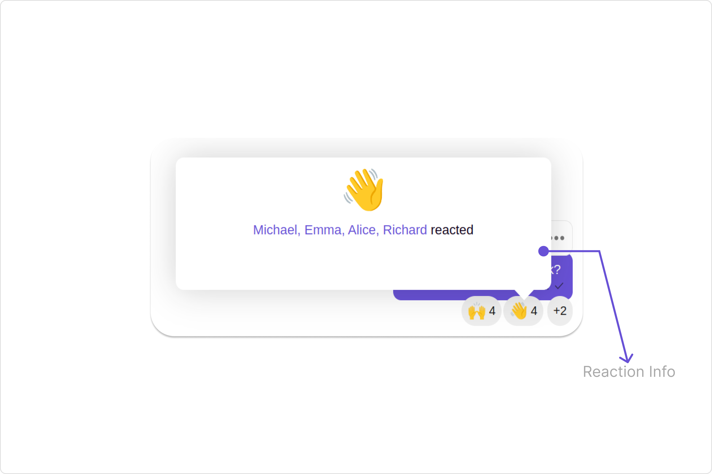
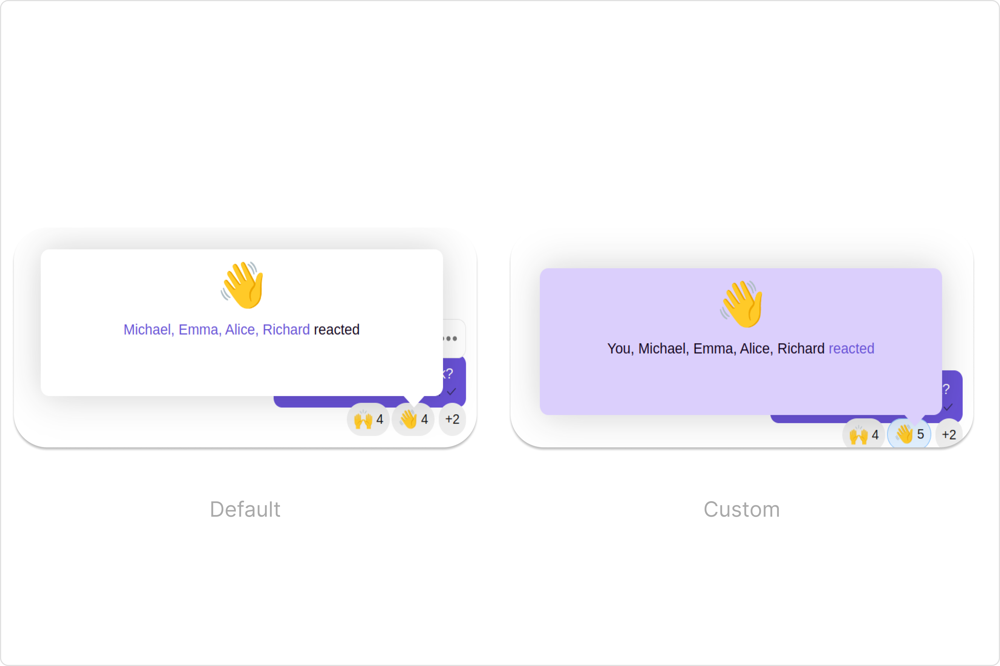
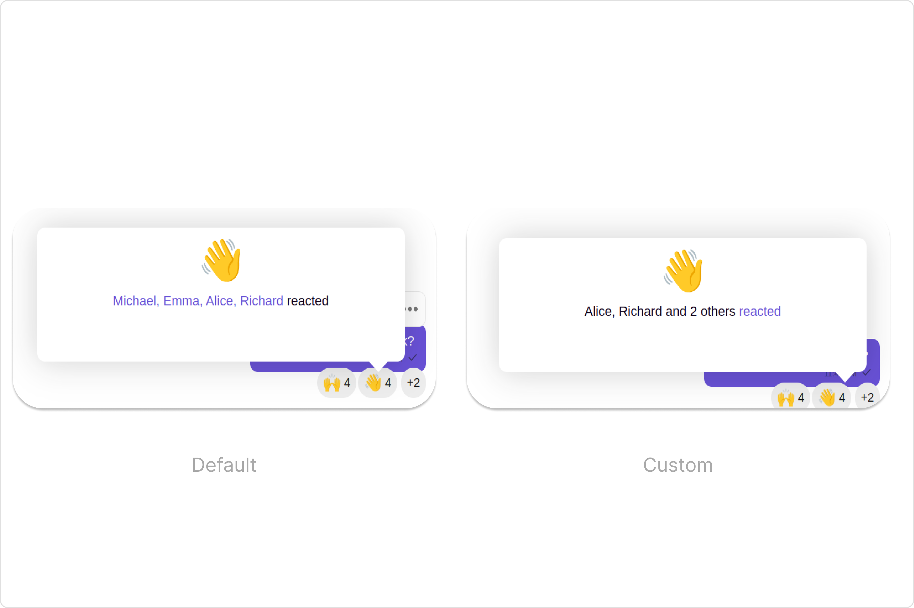

import Tabs from '@theme/Tabs';
import TabItem from '@theme/TabItem';

## Overview

The `Reaction Info` component provides a visual representation of a tooltip details about emoji reactions on a message, helping users easily see which emojis were reacted by whom.



## Usage

### Integration

The following code snippet illustrates how you can directly incorporate the Reactions Info component into your app.

<Tabs>
<TabItem value="ReactionInfoDemo" label="ReactionInfoDemo.tsx">

```jsx
import { CometChat } from '@cometchat/chat-sdk-javascript';
import { CometChatReactionInfo, ReactionInfoStyle } from '@cometchat/chat-uikit-react'
import React from 'react'
import { createComponent } from "@lit-labs/react";

const ReactionInfoDemo = () => {
    const [message, setmessage] = React.useState<CometChat.BaseMessage | undefined>();

    React.useEffect(() => {
        CometChat.getMessageDetails(message-id).then((message) => {
            setmessage(message);
        })
    }, []);

    const ReactionInfo = createComponent({
        tagName: "cometchat-reaction-info",
        elementClass: CometChatReactionInfo,
        react: React,
      });

    const reactionInfoStyle = new ReactionInfoStyle({
        background:'#631aeb',
        borderRadius:'20px',
        width:'200px',
    })
    return (
        <>
            {
                message &&
                <div style={{marginTop:'500px', marginLeft:'300px'}}>
                    <ReactionInfo
                    messageObject={message}
                    reaction={"\ud83c\udfc8"}
                    reactionInfoStyle={reactionInfoStyle}
                    />
                </div>
            }
        </>
    )
}

export default ReactionInfoDemo;
```

</TabItem>
<TabItem value="ts" label="App.tsx">

```jsx
import { ReactionInfoDemo } from "./ReactionInfoDemo";

export default function App() {
  return (
    <div className="App">
      <div>
        <ReactionInfoDemo />
      </div>
    </div>
  );
}
```

</TabItem>
</Tabs>

### Actions

[Actions](./components-overview#actions) dictate how a component functions. They are divided into two types: Predefined and User-defined. You can override either type, allowing you to tailor the behavior of the component to fit your specific needs.

The `Reactions Info` component does not have any exposed actions.

### Filters

**Filters** allow you to customize the data displayed in a list within a `Component`. You can filter the list based on your specific criteria, allowing for a more customized. Filters can be applied using `RequestBuilders` of Chat SDK.

You can adjust the `ReactionsRequestBuilder` in the Reaction Info Component to customize your Reaction info. Numerous options are available to alter the builder to meet your specific needs. For additional details on `ReactionsRequestBuilder`, please visit [ReactionsRequestBuilder](/sdk/javascript/reactions).

In the example below, we demonstrate the application of a filter to the `reactions info`. This filter allows you to specify a limit on the number of users displayed who have reacted with the same emoji.



<Tabs>
<TabItem value="ReactionInfoDemo" label="ReactionInfoDemo.tsx">

```jsx
import { CometChat } from '@cometchat/chat-sdk-javascript';
import { CometChatReactionInfo } from '@cometchat/chat-uikit-react'
import React from 'react'
import { createComponent } from "@lit-labs/react";

const ReactionInfoDemo = () => {
    const [message, setmessage] = React.useState<CometChat.BaseMessage | undefined>();

    React.useEffect(() => {
        CometChat.getMessageDetails(message-id).then((message) => {
            setmessage(message);
        })
    }, []);

    const ReactionInfo = createComponent({
        tagName: "cometchat-reaction-info",
        elementClass: CometChatReactionInfo,
        react: React,
      });
    return (
        <>
            {
                message &&
                <div style={{marginTop:'500px', marginLeft:'300px'}}>
                    <ReactionInfo
                    messageObject={message}
                    reaction={"\ud83c\udfc8"}
                    reactionsRequestBuilder={new CometChat.ReactionsRequestBuilder().setLimit(2)}
                    />
                </div>
            }
        </>
    )
}

export default ReactionInfoDemo;
```

</TabItem>
</Tabs>

### Events

[Events](./components-overview#events) are emitted by a `Component`. By using event you can extend existing functionality. Being global events, they can be applied in Multiple Locations and are capable of being Added or Removed.

The `Reactions Info` component does not produce any events.

## Customization

To fit your app's design requirements, you can customize the appearance of the Reaction Info component. We provide exposed methods that allow you to modify the experience and behavior according to your specific needs.

### Style

Using Style you can customize the look and feel of the component in your app, These parameters typically control elements such as the color, size, shape, and fonts used within the component.

##### 1. reactionInfoStyle

To customize the appearance, you can assign a `reactionInfoStyle` object to the `Reactions Info` component.

**Example**

In this example, we are employing the `reactionInfoStyle`.

<Tabs>
<TabItem value="ReactionInfoDemo" label="ReactionInfoDemo.tsx">

```jsx
import { CometChat } from '@cometchat/chat-sdk-javascript';
import { CometChatReactionInfo, ReactionInfoStyle } from '@cometchat/chat-uikit-react'
import React from 'react'
import { createComponent } from "@lit-labs/react";

const ReactionInfoDemo = () => {
    const [message, setmessage] = React.useState<CometChat.BaseMessage | undefined>();

    React.useEffect(() => {
        CometChat.getMessageDetails(message-id).then((message) => {
            setmessage(message);
        })
    }, []);

    const ReactionInfo = createComponent({
        tagName: "cometchat-reaction-info",
        elementClass: CometChatReactionInfo,
        react: React,
      });

    const reactionInfoStyle = new ReactionInfoStyle({
        background:'#631aeb',
        borderRadius:'20px',
        width:'200px',
        reactedTextFont:'red',
        namesColor:'#ffe600'
    });
    return (
        <>
            {
                message &&
                <div style={{marginTop:'500px', marginLeft:'300px'}}>
                    <ReactionInfo
                    messageObject={message}
                    reaction={"\ud83c\udfc8"}
                    reactionInfoStyle={reactionInfoStyle}
                    />
                </div>
            }
        </>
    )
}

export default ReactionInfoDemo;
```

</TabItem>
</Tabs>



List of properties exposed by ReactionsInfoStyle

| Property             | Description                                         | Code                         |
| -------------------- | --------------------------------------------------- | ---------------------------- |
| **border**           | Used to set border                                  | `border?: string,`           |
| **borderRadius**     | Used to set border radius                           | `borderRadius?: string;`     |
| **background**       | Used to set background colour                       | `background?: string;`       |
| **height**           | Used to set height                                  | `height?: string;`           |
| **width**            | Used to set width                                   | `width?: string;`            |
| **reactionFontSize** | used to set the font of the reaction                | `reactionFontSize?: string;` |
| **namesFont**        | used to set the font of the names of reacted users  | `namesFont?: string;`        |
| **namesColor**       | used to set the color of the names of reacted users | `namesColor?: string;`       |
| **loadingIconTint**  | used to set the loading icon color                  | `loadingIconTint?: string;`  |
| **errorIconTint**    | used to set the error icon color                    | `errorIconTint?: string;`    |
| **reactedTextFont**  | used to set the reacted text font                   | `reactedTextFont?: string;`  |
| **reactedTextColor** | used to set the reacted text color                  | `reactedTextColor?: string;` |

---

### Functionality

These are a set of small functional customizations that allow you to fine-tune the overall experience of the component. With these, you can change text, set custom icons, and toggle the visibility of UI elements.

<Tabs>
<TabItem value="ReactionInfoDemo" label="ReactionInfoDemo.tsx">

```jsx
import { CometChat } from '@cometchat/chat-sdk-javascript';
import { CometChatReactionInfo } from '@cometchat/chat-uikit-react'
import React from 'react'
import { createComponent } from "@lit-labs/react";

const ReactionInfoDemo = () => {
    const [message, setmessage] = React.useState<CometChat.BaseMessage | undefined>();

    React.useEffect(() => {
        CometChat.getMessageDetails(message-id).then((message) => {
            setmessage(message);
        })
    }, []);

    const ReactionInfo = createComponent({
        tagName: "cometchat-reaction-info",
        elementClass: CometChatReactionInfo,
        react: React,
      });

    return (
        <>
            {
                message &&
                <div style={{marginTop:'500px', marginLeft:'300px'}}>
                    <ReactionInfo
                    messageObject={message}
                    reaction={"\ud83c\udfc8"}
                    loadingIconURL="your custom loading icon url"
                    errorIconURL="your custom error icon url"
                    />
                </div>
            }
        </>
    )
}

export default ReactionInfoDemo;
```

</TabItem>
</Tabs>

---

Below is a customizations list along with corresponding code snippets

| Property           | Description                         | Code                                            |
| ------------------ | ----------------------------------- | ----------------------------------------------- |
| **loadingIconURL** | used to set the custom loading icon | `loadingIconURL="your custom loading icon url"` |
| **errorIconURL**   | used to set the error icon          | `errorIconURL="your custom error icon url"`     |
