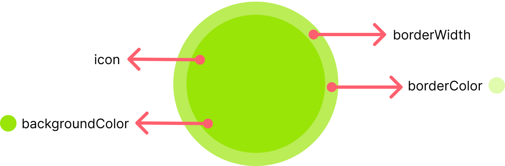

import Tabs from '@theme/Tabs';
import TabItem from '@theme/TabItem';

`CometChatStatusIndicator` is a customized component which indicates whether user is online or offline. You can customize the `borderColor`, `borderSize`, and `backgroundColor` of this component.




### Properties

| Name | Type | Description | 
| ---- | ---- | ---- | 
| backgroundColor | string | Background color of the indicator | 
| backgroundImage | string | Background image of the indicator | 
| statusIndicatorStyle | Object | Styling properties of the element. | 


### Usage

<Tabs>
<TabItem value="js" label="Javascript">

```javascript
import '@cometchat/uikit-elements'; //import the web elements package.

//styling properties 
const statusIndicatorStyle = {width: "28px",height: "28px", border: "1px solid transparent", borderRadius: "50px" };

//use the element
<cometchat-status-indicator backgroundColor="#00C86F" statusIndicatorStyle={statusIndicatorStyle}></cometchat-status-indicator>
```

</TabItem>
</Tabs>