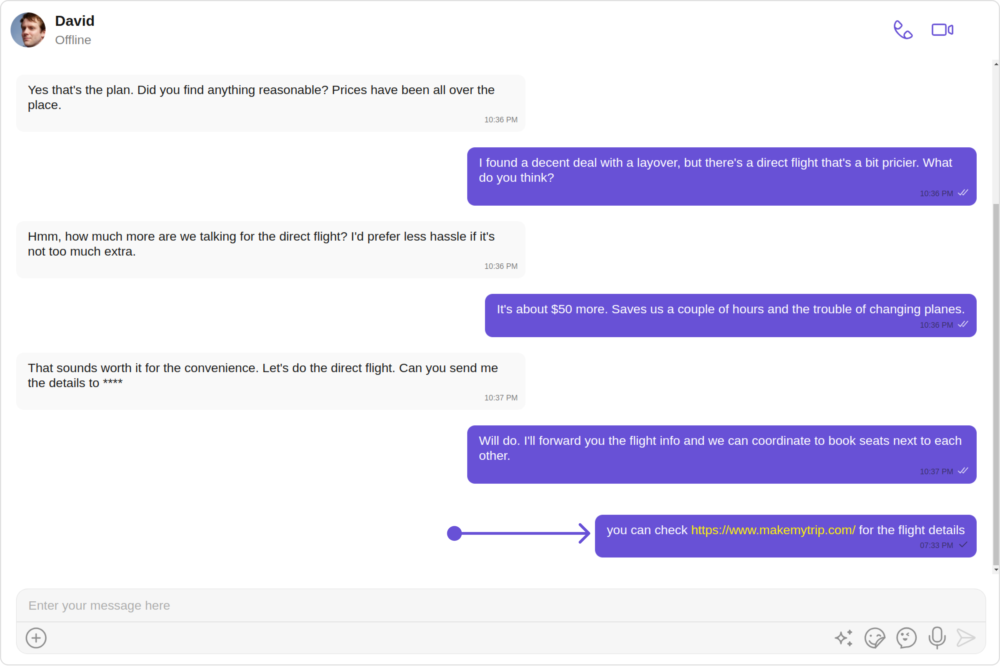

import Tabs from '@theme/Tabs';
import TabItem from '@theme/TabItem';

## Overview

`CometChatUrlsFormatter` is a specialized subclass of `CometChatTextFormatter` designed to automatically detect URLs in text messages and convert them into clickable links, allowing users to navigate to the web addresses effortlessly within your CometChat application.



## Usage

`CometChatUrlsFormatter` utilizes regular expressions to identify URLs and applies styles to make them visually distinct as clickable links. Here's an example of how to extend the `CometChatTextFormatter` to create a URL text formatter:

<Tabs>
<TabItem value="urltextformatter" label="TypeScript">

```javascript
import { CometChatTextFormatter } from "path-to-cometchat-text-formatter";

export class CometChatUrlsFormatter extends CometChatTextFormatter {
  constructor(regexPatterns) {
    super();
    this.setRegexPatterns(regexPatterns);
  }

  onRegexMatch(inputText) {
    // Override with URL matching and formatting logic
    return this.formatUrls(inputText);
  }

  registerEventListeners(element, classList) {
    // Override to handle click events for opening URLs
    if (classList.contains("clickable-url")) {
      element.addEventListener("click", this.onUrlClick);
    }
    return element;
  }

  // Define additional methods as needed...
}

// Example usage:
const urlFormatter = new CometChatUrlsFormatter([/(https?:\/\/[^\s]+)/g]);

const formattedMessage = urlFormatter.getFormattedText(
  "Visit https://www.cometchat.com for more info."
);
console.log(formattedMessage); // Outputs message with clickable link
```

</TabItem>
</Tabs>

## Customize

When implementing the CometChatUrlsFormatter, you can customize the appearance of links and the behavior when clicked:

- Modify the onRegexMatch method to wrap detected URLs in a span element with custom classes for styling.
- In registerEventListeners, define the onUrlClick method to handle opening URLs, tracking analytics, or other custom behavior upon click.

#### Style

Apply CSS to style your clickable links, for example:

```css
.clickable-url {
  color: #1a0dab;
  text-decoration: underline;
  cursor: pointer;
}
```

#### Handling Click Events

Implement the onUrlClick method within your formatter class to define custom logic for when a link is clicked:

```javascript
onUrlClick(event) {
  const url = event.target.dataset.url;
  window.open(url, '_blank');
}
```
