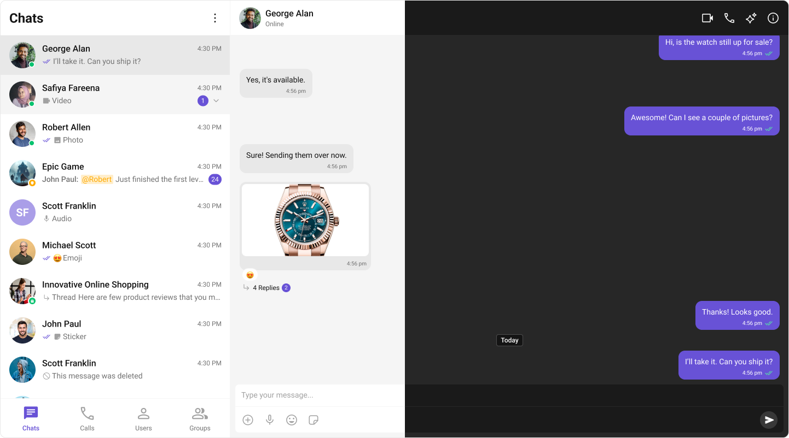
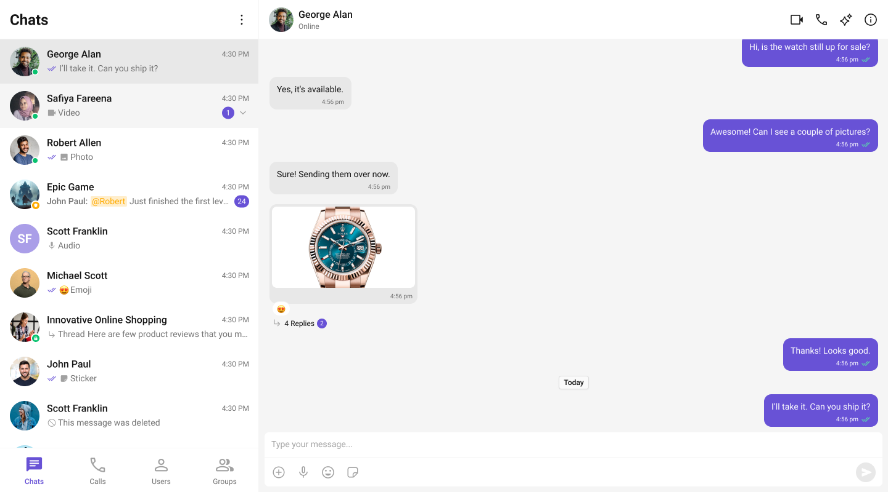

## Introduction

The **CometChat v5 React UI Kit** streamlines the integration of in-app chat functionality into your applications. Packed with prebuilt, modular UI components, it supports essential messaging features for both one-to-one and group conversations. With built-in theming options, including light and dark modes, customizable fonts, colors, and extensive configuration possibilities, developers can create chat experiences tailored to their application’s needs.



## Integration

In **v4**, integration was straightforward due to the availability of composite components like `CometChatConversationsWithMessages`. This single component provided end-to-end functionality, including listing conversations, handling conversation clicks, loading messages (message header, list, composer), displaying user or group details, and supporting threaded messages. Developers could achieve all these features with minimal setup. However, customization posed significant challenges. Customizing the UI or adding custom views required a deep understanding of the internal flow of the composite component. Additionally, configurations were a mix of custom view props, behavioural props, and style props, which often led to confusion. Styling deeply nested components also proved cumbersome, limiting the developer’s ability to make meaningful changes.


With **v5**, composite components have been replaced with smaller, modular components, such as `Conversations`, `Message Header`, `Message List`, and `Message Composer`. This modular approach makes integration more flexible and easier to understand. Each component has a well-defined purpose, allowing developers to use them in ways that suit their specific requirements. The need for complex configurations has been eliminated, as developers can now customize behavior and styling directly via props or CSS. Styling has been significantly simplified, with every component carefully assigned thoughtful CSS class names, enabling developers to customize styles globally or at the component level effortlessly.

To support the transition from v4 to v5, CometChat has built a [sample app](https://github.com/cometchat/cometchat-uikit-react/tree/v5/sample-app) that replicates the functionality of v4’s composite components. This sample app serves as a reference for developers looking to build additional features such as user/group details, call log details, threaded messages, and advanced messaging capabilities. By following this approach, developers can take full advantage of v5’s modular design while implementing complex functionality in an organized manner.



:::info

Learn how to build a complete messaging UI using the **v5 UI Kit** by following the step-by-step guide [here](../../../docs//ui-kits/react/02-Getting%20Started/01-react-integration.md#building-a-messaging-ui-with-conversations).

:::

## Components

The **v4** UI Kit provided composite components like `CometChatConversationsWithMessages`, which offered end-to-end functionality. These components integrated features such as conversation lists, message views (header, list, composer), user/group details, and threaded messages into a single unit. However, customization of deeply nested components through configuration was challenging and resulted in a suboptimal developer experience.

<table>
  <thead>
    <tr>
      <th colspan="3">Components in v4 UI Kit:</th>
    </tr>
  </thead>
  <tbody>
    <tr>
      <td>CometChatConversationsWithMessages</td>
      <td>CometChatUsersWithMessages</td>
      <td>CometChatGroupsWithMessages</td>
    </tr>
    <tr>
      <td>CometChatMessages</td>
      <td>CometChatMessageHeader</td>
      <td>CometChatMessageList</td>
    </tr>
    <tr>
      <td>CometChatMessageComposer</td>
      <td>CometChatThreadedMessages</td>
      <td>CometChatConversations</td>
    </tr>
    <tr>
      <td>CometChatUsers</td>
      <td>CometChatGroups</td>
      <td>CometChatContacts</td>
    </tr>
    <tr>
      <td>CometChatDetails</td>
      <td>CometChatGroupMembers</td>
      <td>CometChatAddMembers</td>
    </tr>
    <tr>
      <td>CometChatBannedMembers</td>
      <td>CometChatTransferOwnership</td>
      <td>CometChatMessageInformation</td>
    </tr>
    <tr>
      <td>CometChatIncomingCall</td>
      <td>CometChatOngoingCall</td>
      <td>CometChatOutgoingCall</td>
    </tr>
    <tr>
      <td>CometChatCallButtons</td>
      <td>CometChatCallLogs</td>
      <td>CometChatCallLogDetails</td>
    </tr>
    <tr>
      <td>CometChatCallLogHistory</td>
      <td>CometChatCallLogRecordings</td>
      <td>CometChatCallLogParticipants</td>
    </tr>
    <tr>
      <td>CometChatCallLogsWithDetails</td>
      <td>CometChatUserMemberWrapper</td>
      <td></td>
    </tr>
  </tbody>
</table>

In **v5**, the composite approach is replaced with smaller, modular components like `Conversations`, `Message Header`, `Message List`, and `Message Composer`. Developers now need to stitch these components together to build the desired functionality. This change allows for greater flexibility and easier customization via props, significantly improving the developer experience while maintaining functionality.

<table>
  <thead>
    <tr>
      <th colspan="3">Components in v5 UI Kit:</th>
    </tr>
  </thead>
  <tbody>
    <tr>
      <td>CometChatConversations</td>
      <td>CometChatUsers</td>
      <td>CometChatGroups</td>
    </tr>
    <tr>
      <td>CometChatGroupMembers</td>
      <td>CometChatMessageHeader</td>
      <td>CometChatMessageList</td>
    </tr>
    <tr>
      <td>CometChatMessageComposer</td>
      <td>CometChatThreadedMessagePreview</td>
      <td>CometChatIncomingCall</td>
    </tr>
    <tr>
      <td>CometChatOutgoingCall</td>
      <td>CometChatCallButtons</td>
      <td>CometChatCallLogs</td>
    </tr>
  </tbody>
</table>

## Theming

In **v4**, theming was managed using the CometChatTheme class, which included two key properties: Typography and Palette. The Palette property provided methods like `setAccent50()`, `setPrimary()`, and `setMode()` for configuring colors and themes. The theming system relied heavily on React’s Context API, utilizing CometChatThemeProvider and CometChatThemeContext to retrieve and update theme settings. While Context is a core concept in React, it wasn’t the most intuitive or efficient approach for theming.

The reliance on Context for theming introduced several challenges. Customizing themes often required developers to consume the theme from the context and then explicitly update values programmatically, which added unnecessary complexity. For example, switching between light and dark modes required interacting with the theme’s context and invoking specific methods like `setMode()`. This process was less straightforward compared to the traditional approach of using CSS class names or data attributes to define themes dynamically. Furthermore, this method wasn’t as idiomatic to modern frontend development practices, where CSS-based theming provides simplicity, flexibility, and better alignment with browser capabilities.

```tsx title="App.tsx"
import "./App.css";
import React, { useContext } from "react";
import { CometChatThemeContext } from "@cometchat/chat-uikit-react";

function App() {
  let { theme } = useContext(CometChatThemeContext);
  theme.palette.setMode("light");
  theme.palette.setPrimary({ light: "#6851D6", dark: "#6851D6" });
  theme.palette.setAccent({ light: "#6851D6", dark: "#6851D6" });

  return (
    <div className="App">
      <>
        <CometChatThemeContext.Provider value={{ theme }}>
          {/* Add view logic here. */}
        </CometChatThemeContext.Provider>
      </>
    </div>
  );
}

export default App;
```

In **v5**, theming has been completely revamped. The older theming class and context-based system have been replaced with modern CSS variables. This means every design token, such as colors, spacing, and typography, is now represented as a CSS variable. Changing the primary color, for instance, is as simple as updating a CSS variable no need to interact with complex theming logic. The use of CSS variables makes styling declarative and lightweight, enhancing both performance and developer experience.

To ensure consistency and scalability, the new theming system adheres to the **BEM** (Block Element Modifier) methodology for class naming. The new theming approach enables developers to style components either globally or at a component-specific level with precision. For example, applying a unique style to a particular element within a component or globally is now straightforward. This move to CSS variables and thoughtful class naming marks a significant improvement in theming flexibility and simplicity. By embracing native browser capabilities and modern CSS practices, developers now have a more powerful and intuitive toolset to customize and manage themes effectively.

```css title="App.css"
@import url("../node_modules/@cometchat/chat-uikit-react/dist/styles/css-variables.css");

.cometchat {
  --cometchat-primary-color: #f76808;
  --cometchat-neutral-color-300: #ffffff;
  --cometchat-background-color-03: #feede1;
}

@media (prefers-color-scheme: dark) {
  .cometchat {
    --cometchat-primary-color: #f76808;
    --cometchat-neutral-color-300: #311502;
    --cometchat-background-color-03: #451d02;
  }
}
```

```tsx title="App.tsx"
import { useEffect, useState } from "react";

const App = (props: { theme?: string }) => {
  const [theme, setTheme] = useState<string>(props.theme!);

  useEffect(() => {
    const handleThemeChange = (e: MediaQueryListEvent) => {
      setTheme(e.matches ? "dark" : "light");
    };
    const mediaQuery = window.matchMedia("(prefers-color-scheme: dark)");
    setTheme(mediaQuery.matches ? "dark" : "light");
    mediaQuery.addEventListener("change", handleThemeChange);
    return () => {
      mediaQuery.removeEventListener("change", handleThemeChange);
    };
  }, []);

  return (
    <div className="cometchat-root" data-theme={theme}>
      {/* Add view logic here. */}
    </div>
  );
};

export default App;
```

:::info
For detailed guidance on theming and customizing colors in the CometChat React UI Kit, refer to the following resources:

- **Theming Documentation:** [Guide to Theming](../../../docs//ui-kits/react/04-Theming/01-Introduction.md)
- **Color Customization:** [Customizing Colors](../../../docs//ui-kits/react/04-Theming/02-Color-resources.md)
  :::

## Properties

In **v5**, the approach to props has been significantly refined to improve clarity and ease of use. All style-related props, previously used to customize components, have been replaced by a more efficient and native theming system based on CSS variables. This change ensures a seamless and flexible styling process without the need for verbose or redundant configuration within the component props.
Configuration props, which were prominent in v4, have also been eliminated. With v5’s modular design, components are no longer nested, making such configurations unnecessary. Developers now have direct control over each component, reducing complexity and increasing flexibility in how components are used and styled.

Custom view props have undergone a comprehensive overhaul to ensure consistency across all components. For example, components that are represented as list items or general items now share a uniform set of customizable props, enabling a standardized approach to customization. These props include `itemView`, `leadingView`, `trailingView`, `subtitleView` & `titleView`. This consistent naming convention makes it easier for developers to understand and apply customizations across various components, streamlining the development process.

For a comprehensive overview of newly added, renamed, and removed properties, refer to the [Property Changes](property-changes) Documentation.

## Shared Dependencies

In **v4**, the React UI Kit relied on three shared packages: resources, elements, and shared, designed to provide common functionality and resources across the 3 Web UI Kits. While these shared packages promoted code reuse, they came with significant drawbacks.

One major issue was the reliance on web components in the elements and shared packages. Styling web components via CSS was inherently restrictive, often requiring additional effort to achieve desired results. Furthermore, passing boolean values to web components from React was non-trivial due to the differences in how attributes and properties are handled between React and native web components. This, coupled with limited code suggestion support in development environments, negatively impacted the developer experience and productivity.

Although there was a workaround for these issues using the lit-labs package to create a React wrapper around web components, it added complexity to the workflow. This workaround was primarily an internal solution, but customers who attempted to use web components directly faced similar challenges and had to implement this additional step themselves.

In **v5**, these challenges have been addressed with a complete shift to pure React components. The dependency on shared web components has been removed entirely, enabling seamless integration with React’s ecosystem. Pure React components eliminate limitations around styling, allowing developers to leverage modern CSS techniques without restrictions. They also provide native React behavior, such as straightforward boolean prop handling and full code suggestion support, significantly enhancing the development experience.

This architectural redesign simplifies the UI Kit, aligns it with React best practices, and makes it more intuitive and extensible for developers. By resolving the limitations of v4, the v5 UI Kit offers a more streamlined, flexible, and productive environment for building modern applications.
