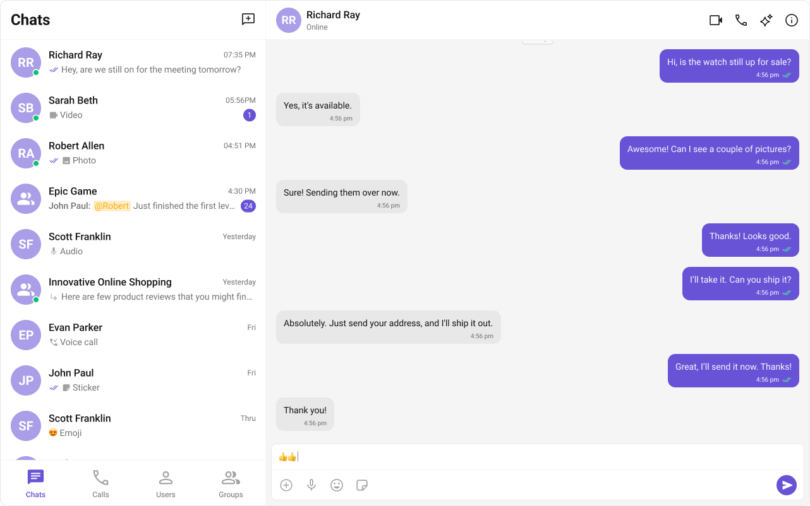

import QuickLinks from "../shared/QuickLinks";
import SampleAppIcon from "../assets/react-sample-app-icon.png";
import UIKitIcon from "../assets/react-ui-kit-icon.png";
import FigmaIcon from "../assets/react-figma-icon.png";

With CometChat's **UI Kit** for React, you can effortlessly build a chat app equipped with all the essential messaging features, along with customizable options tailored to your application requirements. This **UI Kit** comprises of prebuilt UI components organized into smaller modules and components, each configurable to meet your specific needs.

## 

##### **Before Getting Started**

Before you begin, it's essential to grasp the fundamental concepts and features offered by CometChat's APIs, SDK, and UI Kit. You can find detailed information in [Key Concepts](/fundamentals/key-concepts) documentation.

The React UI Kit offers pre-built components for easy integration into React applications, built on top of the [JavaScript Chat SDK](/sdk/javascript/overview) Installing it also includes the core SDK functionalities.

To begin, please follow the [Getting Started](./integration) guide.

<QuickLinks links={[
  {
    icon: SampleAppIcon,
    title: "React Sample App",
    description: "Ready-to-use app examples to kickstart your project.",
    link: "https://github.com/cometchat/cometchat-uikit-react/tree/v5/sample-app",
  },
  {
    icon: UIKitIcon,
    title: "UI Kit Source Code",
    description: "Access the complete source code on GitHub.",
    link: "https://github.com/cometchat/cometchat-uikit-react/tree/v5",
  },
  {
    icon: FigmaIcon,
    title: "Figma File",
    description: "Design resources for UI customization and prototyping.",
    link: "https://www.figma.com/community/file/1442863561340379957/cometchat-ui-kit-for-web",
  },
]} />