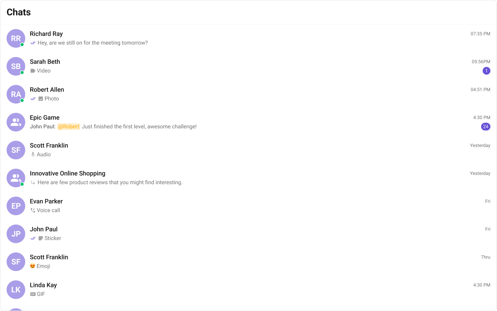
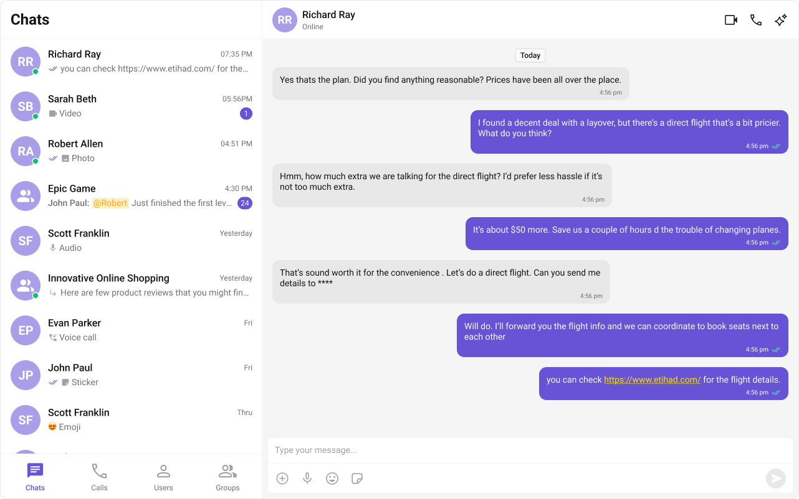

import Tabs from '@theme/Tabs';
import TabItem from '@theme/TabItem';

## Start your first conversation

The CometChat UI Kit for React simplifies the process of integrating in-app chat functionality with essential messaging features. With a collection of prebuilt UI components, it offers seamless theming options, including light and dark themes, various fonts, colors, and extensive customization possibilities.

Supporting both one-to-one and group conversations, the CometChat UI Kit for React empowers developers to initiate chat functionalities effortlessly. Follow the guide below to begin implementing chat features into your React applications using CometChat React UI Kit.


---

## Prerequisites

Before installing **UI Kit** for React, you need to create a CometChat application on the CometChat Dashboard, which comprises everything required in a chat service including users, groups, calls & messages. You will require the `App ID`, `AuthKey`, and `Region` of your CometChat application when initializing the **UI Kit**.

**i. Register on CometChat**

- You need to register on the **CometChat Dashboard** first. [Click here to sign up](https://app.cometchat.com/login).

**ii. Get Your Application Keys**

- Create a **new app**
- Head over to the **QuickStart** or **API & Auth Keys section** and note the **App ID**, **Auth Key**, and **Region**.

> Each CometChat application can be integrated with a single client app. Within the same application, users can communicate with each other across all platforms, whether they are on mobile devices or on the web.

**iii. IDE Setup**

- You have Node.js installed on your machine.
- You have a code editor like Visual Studio Code or Atom installed.
- You have npm or Yarn installed.

---

### Built With

- [Node](https://nodejs.org/)
- [npm](https://www.npmjs.com/get-npm)
- [React](https://www.npmjs.com/package/react) `npm install react@18.2.0`
- [React DOM](https://www.npmjs.com/package/react-dom) `npm install react-dom@18.0.2`

---

## Getting Started

<span style={{padding: '6px 15px', 'background-color': '#6851D6', color: 'white', 'border-radius': '15px', 'font-size': '0.9em', 'font-weight': 'bold'}}>Step 1</span>

### Create a project

To get started with React, follow these steps:

1. Open your code editor.
2. Create a new project by initializing a new React application using Create React App or any other boilerplate.
3. Navigate to your project directory and open the project in your code editor.
4. Begin developing your React application in the "src" directory.
5. Install additional dependencies as required.

---

<span style={{padding: '6px 15px', 'background-color': '#6851D6', color: 'white', 'border-radius': '15px', 'font-size': '0.9em', 'font-weight': 'bold'}}>Step 2</span>

### Add Dependency

This developer kit is an add-on feature to CometChat Javascript SDK, so installing it will also install the core Chat SDK.

```CLI
npm install @cometchat/chat-uikit-react@5.x
```

---

<span style={{padding: '6px 15px', 'background-color': '#6851D6', color: 'white', 'border-radius': '15px', 'font-size': '0.9em', 'font-weight': 'bold'}}>Step 3</span>

### Initialize CometChat UI Kit

The [Init](methods#init) method initialises the settings required for CometChat. Please ensure to call this method before invoking any other methods from CometChat UI Kit or CometChat SDK.

:::info

The Auth Key is an optional property of the `UIKitSettings` Class. It is intended for use primarily during proof-of-concept (POC) development or in the early stages of application development. You can use the [Auth Token](methods#login-using-auth-token) method to log in securely.

:::

<Tabs>
<TabItem value="ts" label="Typescript">

```typescript
import { CometChatUIKit, UIKitSettingsBuilder } from "@cometchat/chat-uikit-react";

const COMETCHAT_CONSTANTS = {
  APP_ID: "APP_ID", //Replace with your App ID
  REGION: "REGION", //Replace with your App Region
  AUTH_KEY: "AUTH_KEY", //Replace with your Auth Key or leave blank if you are authenticating using Auth Token
};

//create the builder
const UIKitSettings = new UIKitSettingsBuilder()
  .setAppId(COMETCHAT_CONSTANTS.APP_ID)
  .setRegion(COMETCHAT_CONSTANTS.REGION)
  .setAuthKey(COMETCHAT_CONSTANTS.AUTH_KEY)
  .subscribePresenceForAllUsers()
  .build();

//Initialize CometChat UI Kit
CometChatUIKit.init(UIKitSettings)!
  .then(() => {
    console.log("Initialization completed successfully");
    // You can now call login function.
  })
  .catch(console.log);
```

</TabItem>


<TabItem value="js" label="Javascript">

```javascript
import { CometChatUIKit, UIKitSettingsBuilder } from "@cometchat/chat-uikit-react";

const COMETCHAT_CONSTANTS = {
  APP_ID: "APP_ID", //Replace with your App ID
  REGION: "REGION", //Replace with your App Region
  AUTH_KEY: "AUTH_KEY", //Replace with your Auth Key or leave blank if you are authenticating using Auth Token
};

//create the builder
const UIKitSettings = new UIKitSettingsBuilder()
  .setAppId(COMETCHAT_CONSTANTS.APP_ID)
  .setRegion(COMETCHAT_CONSTANTS.REGION)
  .setAuthKey(COMETCHAT_CONSTANTS.AUTH_KEY)
  .subscribePresenceForAllUsers()
  .build();

//Initialize CometChat UI Kit
CometChatUIKit.init(UIKitSettings)
  .then(() => {
    console.log("Initialization completed successfully");
    // You can now call login function.
  })
  .catch(console.log);
```

</TabItem>
</Tabs>

> Make sure to replace the **APP_ID** with your CometChat appId, **AUTH_KEY** with your CometChat app auth key and **REGION** with your app region in the above code.

---

<span style={{padding: '6px 15px', 'background-color': '#6851D6', color: 'white', 'border-radius': '15px', 'font-size': '0.9em', 'font-weight': 'bold'}}>Step 4</span>

### Login User

For login, you require a `UID`. You can create your own users on the CometChat Dashboard or via API. We have pre-generated test users: `cometchat-uid-1`, `cometchat-uid-2`, `cometchat-uid-3`, `cometchat-uid-4`, `cometchat-uid-5`.

The Login method returns the User object containing all the information of the logged-in user.

:::info

This straightforward authentication method is ideal for proof-of-concept (POC) development or during the early stages of application development. For production environments, however, we strongly recommend using an [Auth Token](methods#login-using-auth-token) instead of an Auth Key to ensure enhanced security.

:::

<Tabs>
<TabItem value="ts" label="Typescript">

```typescript
import { CometChatUIKit } from "@cometchat/chat-uikit-react";

const UID = "UID"; //Replace with your UID

CometChatUIKit.getLoggedinUser().then((user: CometChat.User | null) => {
  if (!user) {
    //Login user
    CometChatUIKit.login(UID)
      .then((user: CometChat.User) => {
        console.log("Login Successful:", { user });
        //mount your app
      })
      .catch(console.log);
  } else {
    //mount your app
  }
});
```

</TabItem>
<TabItem value="js" label="Javascript">

```javascript
import { CometChatUIKit } from "@cometchat/chat-uikit-react";

const UID = "UID"; //Replace with your UID

CometChatUIKit.getLoggedinUser().then((user) => {
  if (!user) {
    //Login user
    CometChatUIKit.login(UID)
      .then((user) => {
        console.log("Login Successful:", { user });
        //mount your app
      })
      .catch(console.log);
  } else {
    //mount your app
  }
});
```

</TabItem>
</Tabs>

---

<span style={{padding: '6px 15px', 'background-color': '#6851D6', color: 'white', 'border-radius': '15px', 'font-size': '0.9em', 'font-weight': 'bold'}}>Step 5</span>

### Render Conversations

1. [Conversations](conversations) can be rendered by adding the following code snippet to the `App.js` file:

```jsx title="App.js"
import { CometChatConversations } from "@cometchat/chat-uikit-react"; //import the component in your App.js file

export const App = () => {
  return <CometChatConversations />;
};
```

2. Update your `App.scss` file located in the `/src` folder to import CometChat UI Kit's CSS file.

```css title="App.scss"
@import url('../node_modules/@cometchat/chat-uikit-react/dist/styles/css-variables.css');
```
---

<span style={{padding: '6px 15px', 'background-color': '#6851D6', color: 'white', 'border-radius': '15px', 'font-size': '0.9em', 'font-weight': 'bold'}}>Step 6</span>

### Run the project

```bash
npm start
```

---

🎉 You can now see conversations component like below,



## Building a Messaging UI with Conversations



**Step 1:** Let's create a `Tabs` component which will render the different tabs and on change we can render different components. Create a folder `CometChatTabs` in `src` folder. And add the below code,

<Tabs>
<TabItem value="tsx" label="CometChatTabs.tsx">

```tsx
import { React, useState } from "react";
import { localize } from "@cometchat/chat-uikit-react";
import "./CometChatTabs.css";

export const CometChatTabs = (props: {
    onTabClicked?: (tabItem: { name: string; icon?: string; }) => void;
    activeTab?: string;
}) => {

    const {
        onTabClicked = () => { },
        activeTab
    } = props;

    const [hoverTab, setHoverTab] = useState("");

    const tabItems = [
        {
            "name": localize("CHATS"),
            "icon": "ICON_URL"  //Icon URL here
        },
        {
            "name": localize("CALLS"),
            "icon": "ICON_URL"  //Icon URL here
        },
        {
            "name": localize("USERS"),
            "icon": "ICON_URL"  //Icon URL here
        },
        {
            "name": localize("GROUPS"),
            "icon": "ICON_URL" //Icon URL here
        }
    ]

    return (
        <div className="cometchat-tab-component">
            {
                tabItems.map((tabItem) => (
                    <div
                        key={tabItem.name}
                        className="cometchat-tab-component__tab"
                        onClick={() => onTabClicked(tabItem)}
                    >
                        <div
                            className={(activeTab === tabItem.name.toLowerCase() || hoverTab === tabItem.name.toLowerCase()) ? "cometchat-tab-component__tab-text cometchat-tab-component__tab-text-active" : "cometchat-tab-component__tab-text"}
                            onMouseEnter={() => setHoverTab(tabItem.name.toLowerCase())}
                            onMouseLeave={() => setHoverTab("")}
                        >
                            {tabItem.name}
                        </div>
                    </div>
                ))
            }
        </div>
    )

}
```

</TabItem>
<TabItem value="css" label="CometChatTabs.css">

```css
.cometchat-tab-component {
  display: flex;
  width: 100%;
  padding: 0px 8px;
  align-items: flex-start;
  gap: 8px;
  border-top: 1px solid var(--cometchat-border-color-light, #F5F5F5);
  border-right: 1px solid var(--cometchat-border-color-light, #F5F5F5);
  background: var(--cometchat-background-color-01, #FFF);
}

.cometchat-tab-component__tab {
  display: flex;
  padding: 12px 0px 10px 0px;
  flex-direction: column;
  justify-content: center;
  align-items: center;
  gap: 4px;
  flex: 1 0 0;
  min-height: 48px;
}

.cometchat-tab-component__tab-icon {
  display: flex;
  width: 32px;
  height: 32px;
  justify-content: center;
  align-items: center;
  background: var(--cometchat-icon-color-secondary, #A1A1A1);
  -webkit-mask-size: contain;
  cursor: pointer;
}

.cometchat-tab-component__tab-text {
  color: var(--cometchat-text-color-secondary, #727272);
  text-align: center;
  font: var(--cometchat-font-caption1-medium, 500 12px Roboto);
  cursor: pointer;
}

.cometchat-tab-component__tab-icon-active {
  background: var(--cometchat-icon-color-highlight);
}

.cometchat-tab-component__tab-text-active {
  color: var(--cometchat-text-color-highlight);
}
```

</TabItem>
</Tabs>

**Step 2:** Let's create the `Sidebar` component which will render the different components(Conversations, Users, Groups, Calls). Create a folder `CometChatSelector` in the `src` folder. And add the below code,

<Tabs>
<TabItem value="tsx" label="CometChatSelector.tsx">

```tsx
import { React, useEffect, useState } from "react";
import { Call, Conversation, Group, User, CometChat } from "@cometchat/chat-sdk-javascript";
import { CometChatCallLogs, CometChatConversations, CometChatGroups, CometChatUIKit, CometChatUIKitLoginListener, CometChatUsers } from "@cometchat/chat-uikit-react";
import { CometChatTabs } from "../CometChatTabs/CometChatTabs.tsx";
import "./CometChatSelector.css";

interface SelectorProps {
    onSelectorItemClicked?: (input: User | Group | Conversation | Call, type: string) => void;
    onHide?: () => void;
    onNewChatClicked?: () => void;
}

export const CometChatSelector = (props: SelectorProps) => {
    const {
        onSelectorItemClicked = () => { },
    } = props;

    const [loggedInUser, setLoggedInUser] = useState<CometChat.User | null>();
    const [activeItem, setActiveItem] = useState<CometChat.Conversation | CometChat.User | CometChat.Group | CometChat.Call | undefined>();
    const [activeTab, setActiveTab] = useState<string>("chats");

    useEffect(() => {
        let loggedInUsers = CometChatUIKitLoginListener.getLoggedInUser();
        setLoggedInUser(loggedInUsers)
    }, [CometChatUIKitLoginListener?.getLoggedInUser()])

    const logOut = () => {
        CometChatUIKit.logout().then(() => {
            setLoggedInUser(null)
        }).catch((error) => {
            console.log("error", error)
        })
    }

    return (
        <>
            {loggedInUser && <>
                {activeTab == "chats" ? (
                    <CometChatConversations
                        activeConversation={activeItem instanceof CometChat.Conversation ? activeItem : undefined}
                        onItemClick={(e) => {
                            setActiveItem(e);
                            onSelectorItemClicked(e, "updateSelectedItem");
                        }}
                    />
                ) : activeTab == "calls" ? (
                    <CometChatCallLogs
                        activeCall={activeItem instanceof CometChat.Call ? activeItem : undefined}
                        onItemClick={(e: Call) => {
                            setActiveItem(e);
                            onSelectorItemClicked(e, "updateSelectedItemCall");
                        }}
                    />
                ) : activeTab == "users" ? (
                    <CometChatUsers
                        activeUser={activeItem instanceof CometChat.User ? activeItem : undefined}
                        onItemClick={(e) => {
                            setActiveItem(e);
                            onSelectorItemClicked(e, "updateSelectedItemUser");
                        }}
                    />
                ) : activeTab == "groups" ? (
                    <CometChatGroups
                        activeGroup={activeItem instanceof CometChat.Group ? activeItem : undefined}
                        onItemClick={(e) => {
                            setActiveItem(e);
                            onSelectorItemClicked(e, "updateSelectedItemGroup");
                        }}
                    />
                ) : null}
            </>}
            <CometChatTabs activeTab={activeTab} onTabClicked={(item) => {
                setActiveTab(item.name.toLowerCase())
            }} />
        </>
    );
}
```

</TabItem>
<TabItem value="css" label="CometChatSelector.css">

```css
.selector-wrapper .cometchat-conversations .cometchat-list__header-menu .cometchat-button__icon {
  background: var(--cometchat-icon-color-primary);
}

.cometchat-conversations .cometchat-list__header-menu .cometchat-button__icon:hover {
  background: var(--cometchat-icon-color-highlight);
}

.cometchat-list__header-search-bar {
  border-right: none;
}

.cometchat .cometchat-menu-list__sub-menu-list-item {
  text-align: left;
}

.cometchat .cometchat-conversations .cometchat-menu-list__sub-menu-list {
  width: 212px;
  top: 40px !important;
  left: 172px !important;
}

#logged-in-user {
  border-bottom: 2px solid var(--cometchat-border-color-default, #E8E8E8);
}

#logged-in-user .cometchat-menu-list__sub-menu-item-title,
#logged-in-user .cometchat-menu-list__sub-menu-list-item {
  cursor: default;
}

.cometchat-menu-list__sub-menu-list-item-icon-log-out {
  background-color: var(--cometchat-error-color, #F44649);
}

.cometchat-menu-list__sub-menu-item-title-log-out {
  color: var(--cometchat-error-color, #F44649)
}

.chat-menu .cometchat .cometchat-menu-list__sub-menu-item-title {
  cursor: pointer;
}

.chat-menu .cometchat .cometchat-menu-list__sub-menu {
  box-shadow: none;
}

.chat-menu .cometchat .cometchat-menu-list__sub-menu-icon {
  background-color: var(--cometchat-icon-color-primary, #141414);
  width: 24px;
  height: 24px;
}
```

</TabItem>
</Tabs>

**Step 3:** Now we will update the `App.tsx` & `App.css` files to import these new components as below,

<Tabs>
<TabItem value="tsx" label="App.tsx">

```tsx
import React, { useState } from "react";
import { CometChatMessageComposer, CometChatMessageHeader, CometChatMessageList, CometChatUIKit, UIKitSettingsBuilder } from "@cometchat/chat-uikit-react";
import { CometChat } from "@cometchat/chat-sdk-javascript";
import { CometChatSelector } from "./CometChatSelector/CometChatSelector.tsx";
import "./App.css";

export const App = () => {
  const [selectedUser, setSelectedUser] = useState<CometChat.User | undefined>(undefined);
  const [selectedGroup, setSelectedGroup] = useState<CometChat.Group | undefined>(undefined);
  const [selectedCall, setSelectedCall] = useState<CometChat.Call | undefined>(undefined);

  return (
    <div className="conversations-with-messages">
      <div className="conversations-wrapper">
        <CometChatSelector onSelectorItemClicked={(activeItem) => {
          let item = activeItem;
          if (activeItem instanceof CometChat.Conversation) {
            item = activeItem.getConversationWith();
          }
          if (item instanceof CometChat.User) {
            setSelectedUser(item as CometChat.User);
            setSelectedCall(undefined);
            setSelectedGroup(undefined);
          } else if (item instanceof CometChat.Group) {
            setSelectedUser(undefined);
            setSelectedGroup(item as CometChat.Group);
            setSelectedCall(undefined);
          }
          else if (item instanceof CometChat.Call) {
            //custom logic to open call details
            setSelectedUser(undefined);
            setSelectedGroup(undefined);
            setSelectedCall(item as CometChat.Call);
          }
        }} />
      </div>
      {selectedUser || selectedGroup || selectedCall ? (
        <div className="messages-wrapper">
          <CometChatMessageHeader user={selectedUser} group={selectedGroup} />
          <CometChatMessageList user={selectedUser} group={selectedGroup} />
          <CometChatMessageComposer user={selectedUser} group={selectedGroup} />
        </div>
      ) : (
        <div className="empty-conversation">Select Conversation to start</div>
      )}
    </div>
  );
};
```

</TabItem>
<TabItem value="css" label="App.css">

```css
.conversations-with-messages {
  display: flex;
  height: 100%;
  width: 100%;
  flex-direction: row;
}

.conversations-wrapper {
  height: 100vh;
  width: 480px;
  overflow: hidden;
  display: flex;
  flex-direction: column;
}

.conversations-wrapper>.cometchat {
  overflow: hidden;
}

.messages-wrapper {
  width: 100%;
  height: 100vh;
  display: flex;
  flex-direction: column;
}

.empty-conversation {
  height: 100vh;
  width: 100%;
  display: flex;
  justify-content: center;
  align-items: center;
  background: var(--cometchat-background-color-03, #F5F5F5);
  color: var(--cometchat-text-color-secondary, #727272);
  font: var(--cometchat-font-body-regular, 400 14px Roboto);
}
```

</TabItem>
</Tabs>