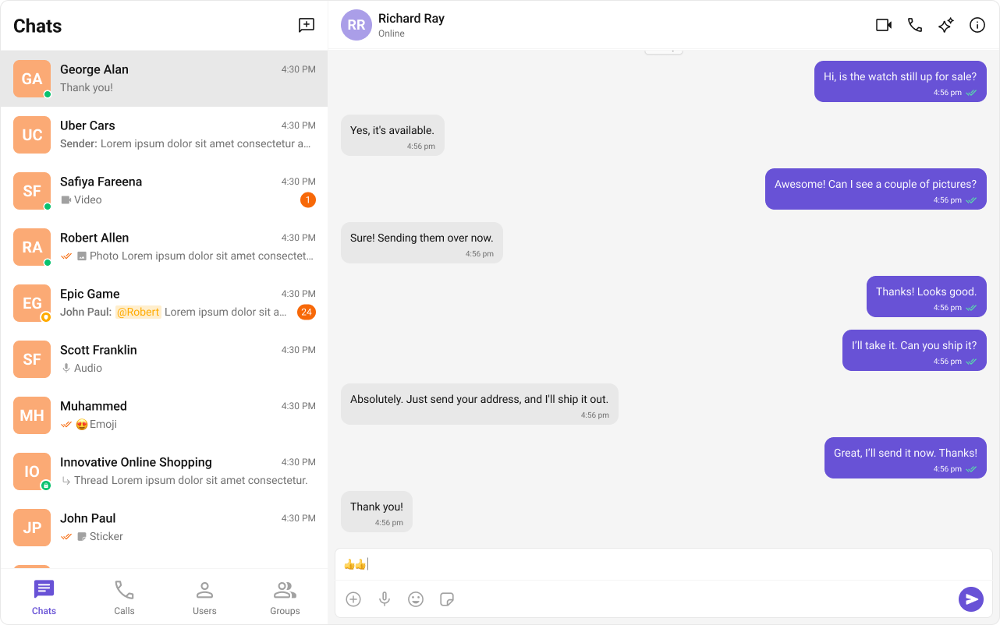
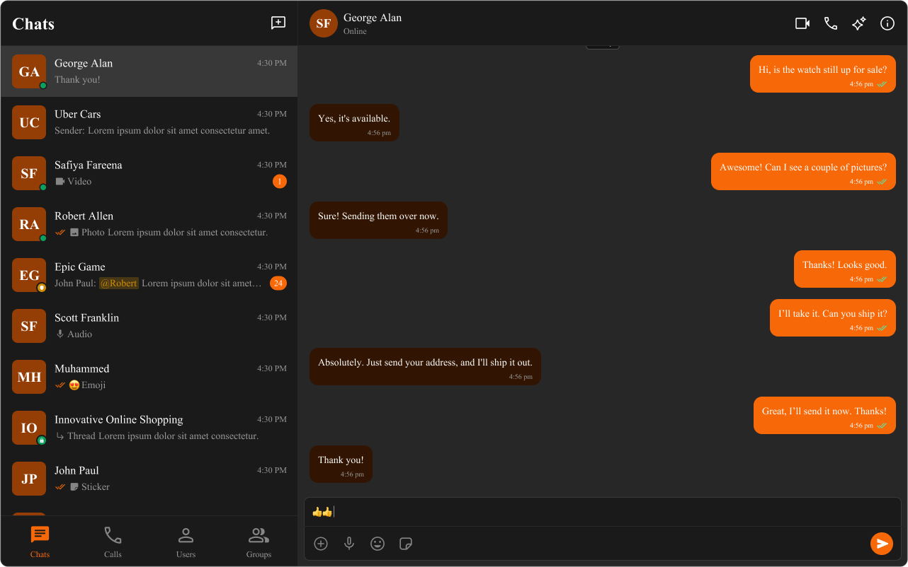

import Tabs from '@theme/Tabs';
import TabItem from '@theme/TabItem';

**Theming** allows you to define the look and feel of your app by adjusting colors, fonts, and other visual elements using CSS variables. This enables you to provide a cohesive and on-brand experience for your users.

## Importing the Stylesheet

To start theming, first, import the base stylesheet into your project. This stylesheet contains the default variables and styles for the chat UI.

<Tabs>
<TabItem value="css" label="App.css">

```css
@import url("../node_modules/@cometchat/chat-uikit-react/dist/styles/css-variables.css");
```

</TabItem>
</Tabs>

## Customization

Our theming provides various customization options through CSS variables. These variables cover colors, typography, spacing, and more.

### CSS Variables

Our theming provides various customization options through CSS variables. These variables cover colors, typography, spacing, and more.

#### Updating CSS variables globally

To apply changes globally across the chat UI, simply override the CSS variables in the root of your stylesheet. This will apply the updated values across all components.

Shown below is the default chat interface.


The customized chat interface is displayed below.


Use the following code to achieve the customization shown above.

<Tabs>
<TabItem value="tsx" label="App.tsx">

```tsx
import { useEffect } from "react";

const App = () => {
  useEffect(() => {
    const updateFontFamily = (newFontFamily: string) => {
      document.documentElement.style.setProperty(
        "--cometchat-font-family",
        newFontFamily
      );
    };

    updateFontFamily("'Times New Roman'");
  }, []);

  return <div className="cometchat-root">{/* Add view logic here. */}</div>;
};

export default App;
```

</TabItem>
<TabItem value="css" label="App.css">

```css
.cometchat {
  --cometchat-primary-color: #f76808;
  --cometchat-neutral-color-300: #fff;
  --cometchat-background-color-03: #feede1;
  --cometchat-extended-primary-color-500: #fbaa75;
  --cometchat-icon-color-highlight: #f76808;
  --cometchat-text-color-highlight: #f76808;
}
```

</TabItem>
</Tabs>

Here is the list for all the global css variables.

#### Updating CSS variables component wise

You can also apply specific variables to individual components. For example, if you want the message conversation avatar to differ from other elements, you can define these variables within the specific component’s CSS class.

The customized chat interface is displayed below.



Use the following code to achieve the customization shown above.

<Tabs>
<TabItem value="css" label="App.css">

```css
.cometchat .cometchat-conversations {
  --cometchat-primary-color: #f76808;
  --cometchat-extended-primary-color-500: #fbaa75;
  --cometchat-text-color-highlight: #ffab00;
  --cometchat-message-seen-color: #f76808;
  --cometchat-radius-max: 12px;
}
```

</TabItem>
</Tabs>

### CSS Overrides

If you need more control beyond CSS variables, you can use CSS overrides. These allow for detailed adjustments to the look and feel of each component by targeting the specific classes or elements within the chat UI.

<Tabs>
<TabItem value="css" label="App.css">

```css
.cometchat-conversations .cometchat-avatar,
.cometchat-conversations .cometchat-avatar__image {
  border-radius: 12px;
}
```

</TabItem>
</Tabs>

## Dark & Light Theme

The Chat UI Kit supports both dark and light themes by default. You can toggle between these themes based on user preference or system settings.

### Switching Themes with CSS Variables

To enable dark mode, you can redefine the CSS variables under a dark theme class or media query.

Here is the code to enable & toggle between dark & light mode.

<Tabs>
<TabItem value="tsx" label="App.tsx">

```tsx
import { useEffect, useState } from "react";

const App = (props: { theme?: string }) => {
  const [theme, setTheme] = useState<string>(props.theme!);

  useEffect(() => {
    const handleThemeChange = (e: MediaQueryListEvent) => {
      setTheme(e.matches ? "dark" : "light");
    };
    const mediaQuery = window.matchMedia("(prefers-color-scheme: dark)");
    setTheme(mediaQuery.matches ? "dark" : "light");
    mediaQuery.addEventListener("change", handleThemeChange);
    return () => {
      mediaQuery.removeEventListener("change", handleThemeChange);
    };
  }, []);

  return (
    <div className="cometchat-root" data-theme={theme}>
      {/* Add view logic here. */}
    </div>
  );
};

export default App;
```

</TabItem>
</Tabs>

Here is the what the dark mode will look like -


### Customising in Light & Dark theme

Here is how you can provide different color configurations for the dark and light themes:



Use the following code to achieve the customization shown above.

<Tabs>
<TabItem value="css" label="App.css">

```css
.cometchat {
  --cometchat-primary-color: #f76808;
  --cometchat-neutral-color-300: #fff;
  --cometchat-background-color-03: #feede1;
  --cometchat-extended-primary-color-500: #fbaa75;
  --cometchat-icon-color-highlight: #f76808;
  --cometchat-text-color-highlight: #f76808;
}

@media (prefers-color-scheme: dark) {
  .cometchat {
    --cometchat-primary-color: #f76808;
    --cometchat-neutral-color-300: #311502;
    --cometchat-background-color-03: #451d02;
    --cometchat-extended-primary-color-500: #943e05;
    --cometchat-icon-color-highlight: #f76808;
    --cometchat-text-color-highlight: #f76808;
    --cometchat-white-pressed: #383838;
    --cometchat-message-seen-color: #f76808;
    --cometchat-neutral-color-50: #1a1a1a;
  }
}
```

</TabItem>
</Tabs>
