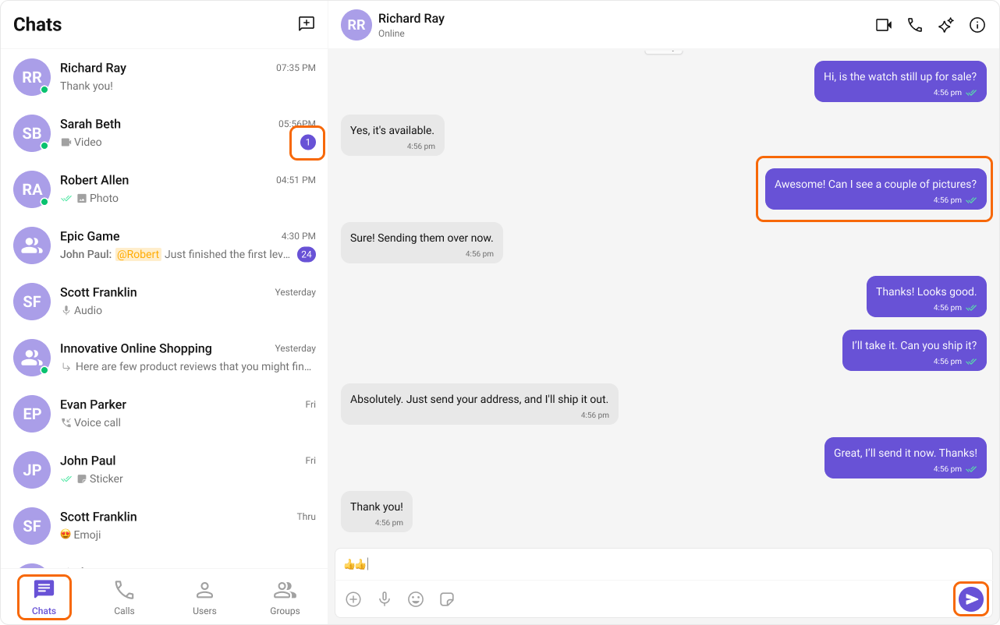
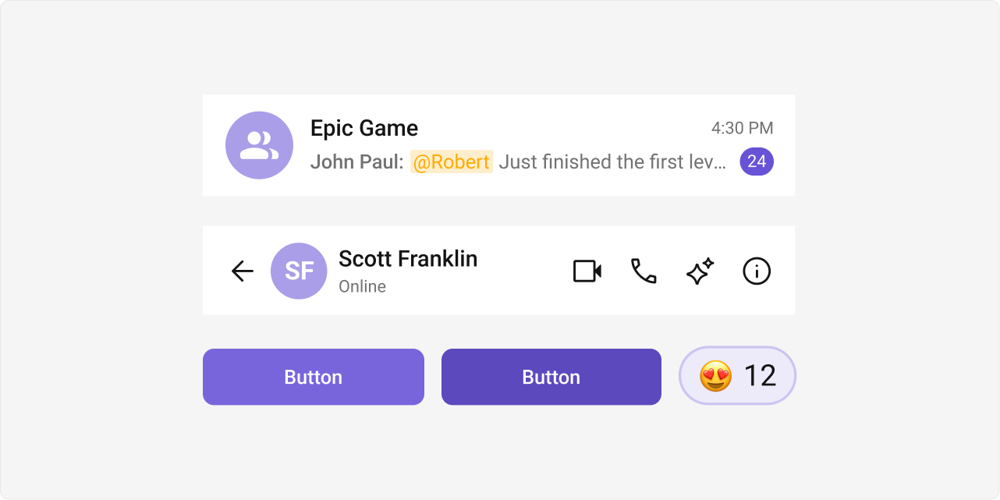
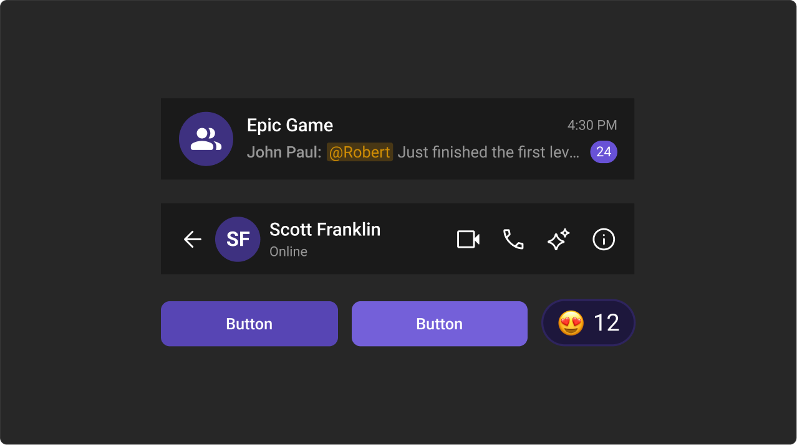

import loadingPlaceholder from '../assets/color_resources_figma_loader.png'; // Adjust path as needed

## Introduction

The Chat UI Kit comes with a carefully designed color palette to ensure a consistent and visually appealing user interface. It uses the Block, Element, Modifier (BEM) methodology, a standard naming convention for CSS classes. This approach allows for organized, scalable styling, and components can be easily customized by overwriting the applicable resources file in the Kit’s stylesheet.

## Color Palette

The primary color serves as the foundation of your chat UI, used for key actions, branding, and prominent interface elements, while the primary extended palette complements it with subtle variations suited for secondary and tertiary actions or supporting elements.

### Primary Color

**Light Mode:**



```css
--cometchat-primary-color: #6852d6;
--cometchat-extended-primary-color-50: #f9f8fd;
--cometchat-extended-primary-color-100: #edeafa;
--cometchat-extended-primary-color-200: #dcd7f6;
--cometchat-extended-primary-color-300: #ccc4f1;
--cometchat-extended-primary-color-400: #bbb1ed;
--cometchat-extended-primary-color-500: #aa9ee8;
--cometchat-extended-primary-color-600: #9a8be4;
--cometchat-extended-primary-color-700: #8978df;
--cometchat-extended-primary-color-800: #7965db;
--cometchat-extended-primary-color-900: #5d49be;
```

---

**Dark Mode:**


```css
--cometchat-primary-color: #6852d6;
--cometchat-extended-primary-color-50: #15102b;
--cometchat-extended-primary-color-100: #1d173c;
--cometchat-extended-primary-color-200: #251e4d;
--cometchat-extended-primary-color-300: #2e245e;
--cometchat-extended-primary-color-400: #362b6f;
--cometchat-extended-primary-color-500: #3e3180;
--cometchat-extended-primary-color-600: #473892;
--cometchat-extended-primary-color-700: #4f3ea3;
--cometchat-extended-primary-color-800: #5745b4;
--cometchat-extended-primary-color-900: #7460d9;
```

### Extended Primary Color

**Light Mode:**



**Dark Mode:**



---

## Resources for Developers and Designers

### GitHub Repository

Access the complete list of color variables and their hex values in our [GitHub](https://github.com/cometchat/cometchat-uikit-react/blob/v5/src/styles/css-variables.css#L198-L419) repository.

---

### Figma UI Kit

For designers, the Figma UI Kit includes a fully integrated color palette, making it easy to visualize and apply the colors in your designs.

<div style={{ width: "100%", height: "450px", position: "relative" }}>
  
  <iframe
    width="100%"
    height="100%"
    src="https://embed.figma.com/design/518OuvYeP2cvzIPWmr1fN7/Public-Web-Chat%E2%80%A8--UI-Kits?node-id=1-3&embed-host=share"
    loading="lazy"
    onLoad={(e) => (e.target.previousElementSibling.style.display = "none")}
  ></iframe>
</div>
