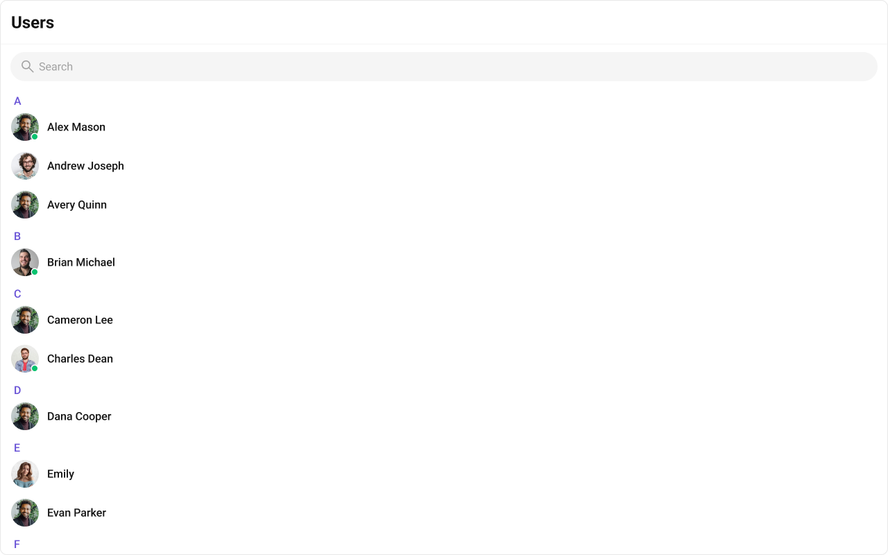
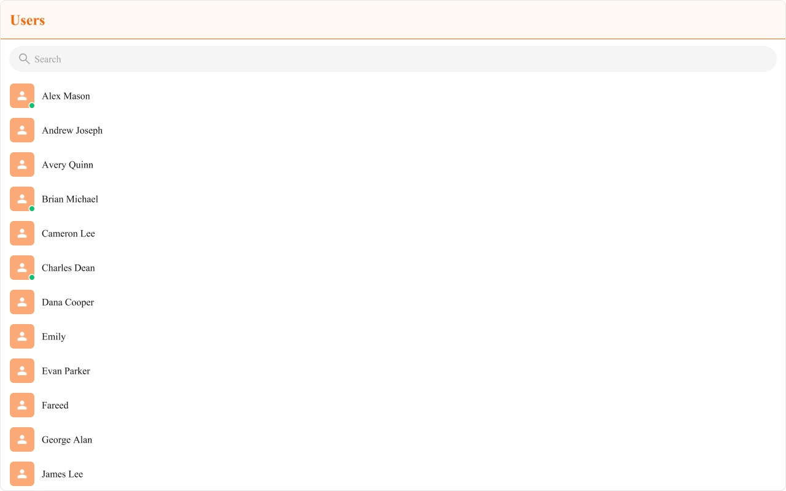
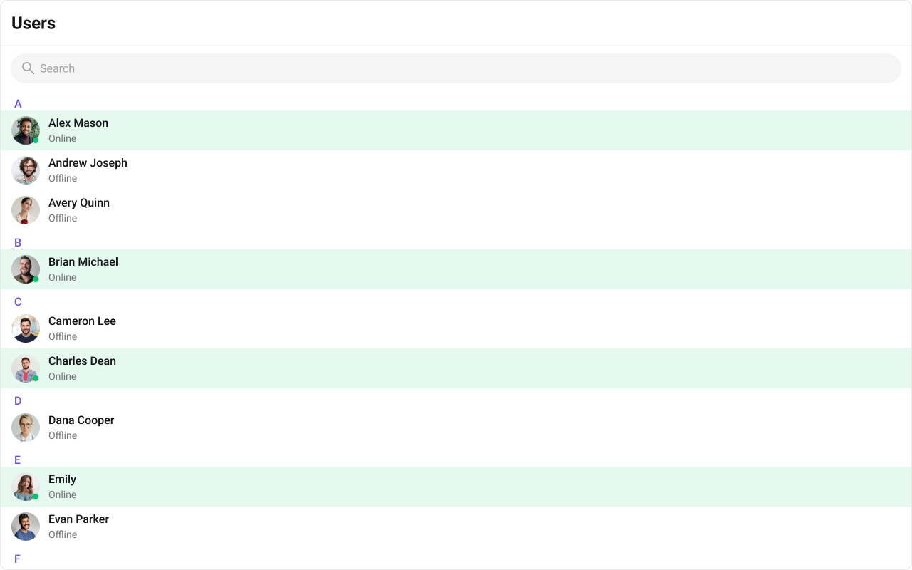
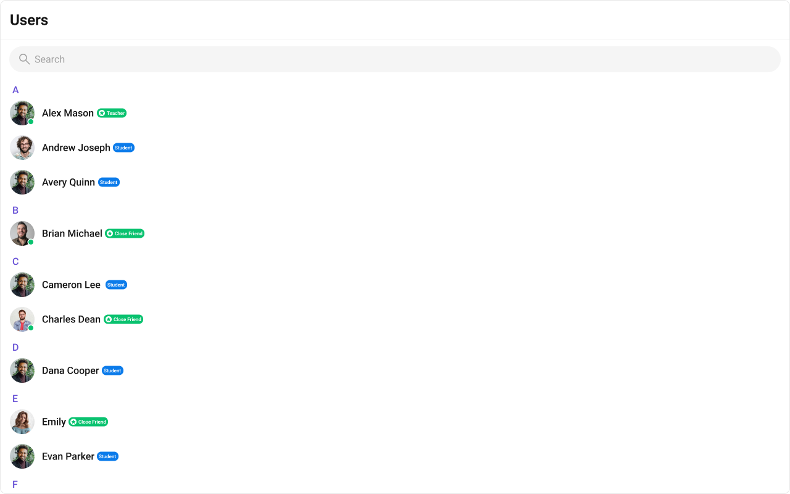
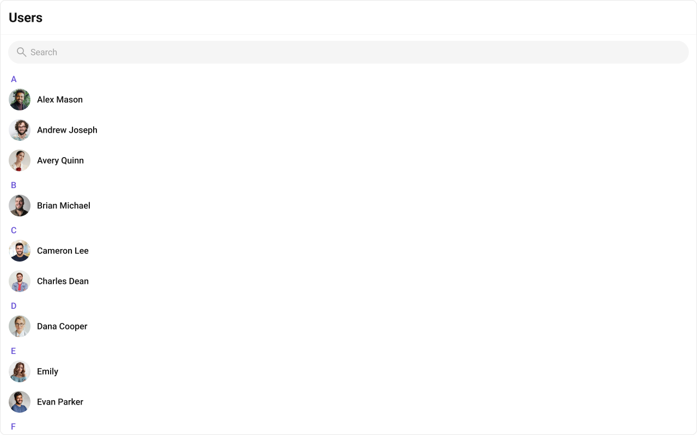
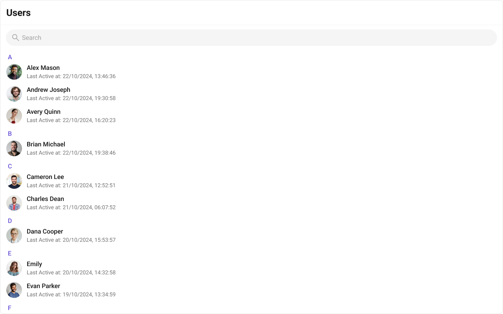
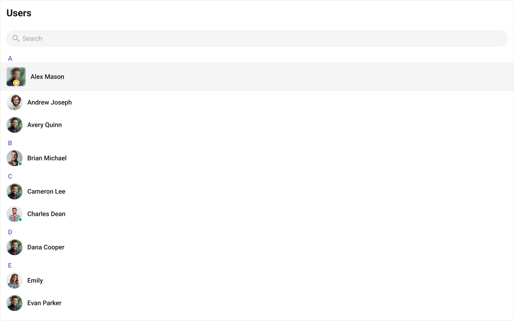
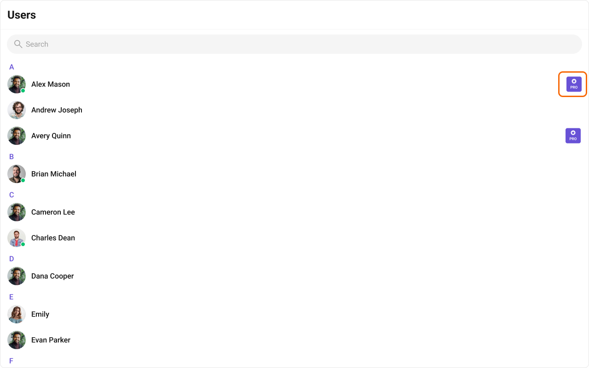
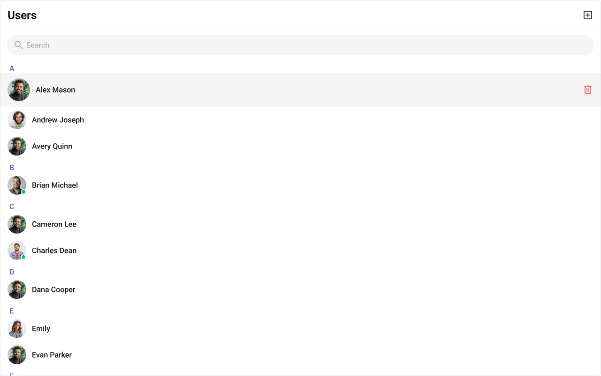

import Tabs from '@theme/Tabs';
import TabItem from '@theme/TabItem';

## Overview

The Users is a Component, showcasing an accessible list of all available users. It provides an integral search functionality, allowing you to locate any specific user swiftly and easily. For each user listed, the widget displays the user's name by default, in conjunction with their avatar when available. Furthermore, it includes a status indicator, visually informing you whether a user is currently online or offline.



The Users component is composed of the following BaseComponents:

| Components        | Description                                                                                                              |
| ----------------- | ------------------------------------------------------------------------------------------------------------------------ |
| CometChatList     | A reusable container component having title, search box, customisable background and a list view.                        |
| CometChatListItem | A component that renders data obtained from a User object on a Tile having a title, subtitle, leading and trailing view. |

---

## Usage

### Integration

The following code snippet illustrates how you can directly incorporate the Users component into your Application.

<Tabs>
<TabItem value="UsersDemo" label="UsersDemo.tsx">

```tsx
import { CometChatUsers } from "@cometchat/chat-uikit-react";

function UsersDemo() {
  return <CometChatUsers />;
}

export default UsersDemo;
```

</TabItem>
<TabItem value="App" label="App.tsx">

```tsx
import { UsersDemo } from "./UsersDemo";

export default function App() {
  return (
    <div className="App">
      <UsersDemo />
    </div>
  );
}
```

</TabItem>
</Tabs>

### Actions

[Actions](components-overview#actions) dictate how a component functions. They are divided into two types: Predefined and User-defined. You can override either type, allowing you to tailor the behavior of the component to fit your specific needs.

##### 1. onSelect

The `onSelect` action is activated when you select the done icon while in selection mode. This returns a list of all the users that you have selected.

This action does not come with any predefined behavior. However, you have the flexibility to override this event and tailor it to suit your needs using the following code snippet.

<Tabs>
<TabItem value="TypeScript" label="TypeScript">

```tsx
import { CometChatUsers, SelectionMode } from "@cometchat/chat-uikit-react";

function UsersDemo() {
  function handleOnSelect(users: CometChat.User, selected: boolean): void {
    console.log(users);
    //your custom onSelect actions
  }

  return (
    <CometChatUsers
      selectionMode={SelectionMode.multiple}
      onSelect={handleOnSelect}
    />
  );
}

export default UsersDemo;
```

</TabItem>
<TabItem value="JavaScript" label="JavaScript">

```jsx
import { CometChatUsers, SelectionMode } from "@cometchat/chat-uikit-react";

function UsersDemo() {
  function handleOnSelect(users, selected) {
    console.log(users);
    //your custom onSelect actions
  }

  return (
    <CometChatUsers
      selectionMode={SelectionMode.multiple}
      onSelect={handleOnSelect}
    />
  );
}

export default UsersDemo;
```

</TabItem>
</Tabs>

##### 2. onItemClick

The `OnItemClick` event is activated when you click on the UserList item. This action does not come with any predefined behavior. However, you have the flexibility to override this event and tailor it to suit your needs using the following code snippet.

<Tabs>
<TabItem value="TypeScript" label="TypeScript">

```tsx
import { CometChatUsers } from "@cometchat/chat-uikit-react";

function UsersDemo() {
  function handleOnItemClick(user: CometChat.User): void {
    console.log(user, "your custom on item click action");
  }
  return <CometChatUsers onItemClick={handleOnItemClick} />;
}

export default UsersDemo;
```

</TabItem>
<TabItem value="JavaScript" label="JavaScript">

```jsx
import { CometChatUsers } from "@cometchat/chat-uikit-react";

function UsersDemo() {
  function handleOnItemClick(user) {
    console.log(user, "your custom on item click action");
  }
  return <CometChatUsers onItemClick={handleOnItemClick} />;
}

export default UsersDemo;
```

</TabItem>
</Tabs>

##### 3. onEmpty

This action allows you to specify a callback function to be executed when a certain condition, typically the absence of data or content, is met within the component or element.

<Tabs>
<TabItem value="TypeScript" label="TypeScript">

```tsx
import { CometChatUsers } from "@cometchat/chat-uikit-react";

function UsersDemo() {
  function handleOnEmpty(): void {
    console.log("your custom on Empty action");
  }
  return <CometChatUsers onEmpty={handleOnEmpty} />;
}

export default UsersDemo;
```

</TabItem>
<TabItem value="JavaScript" label="JavaScript">

```jsx
import { CometChatUsers } from "@cometchat/chat-uikit-react";

function UsersDemo() {
  function handleOnEmpty() {
    console.log("your custom on Empty action");
  }

  return <CometChatUsers onEmpty={handleOnEmpty} />;
}

export default UsersDemo;
```

</TabItem>
</Tabs>

##### 4. onError

This action doesn't change the behavior of the component but rather listens for any errors that occur in the User component.

<Tabs>
<TabItem value="TypeScript" label="TypeScript">

```tsx
import { CometChatUsers } from "@cometchat/chat-uikit-react";

function UsersDemo() {
  const handleOnError = (error: CometChat.CometChatException) => {
    console.log("Your custom on error actions");
  };
  return <CometChatUsers onError={handleOnError} />;
}

export default UsersDemo;
```

</TabItem>
<TabItem value="JavaScript" label="JavaScript">

```jsx
import { CometChatUsers } from "@cometchat/chat-uikit-react";

function UsersDemo() {
  const handleOnError = (error) => {
    console.log("Your custom on error actions");
  };

  return <CometChatUsers onError={handleOnError} />;
}

export default UsersDemo;
```

</TabItem>
</Tabs>

### Filters

**Filters** allow you to customize the data displayed in a list within a Component. You can filter the list based on your specific criteria, allowing for a more customized. Filters can be applied using RequestBuilders of Chat SDK.

##### 1. UserRequestBuilder

The [UserRequestBuilder](/sdk/javascript/retrieve-users) enables you to filter and customize the user list based on available parameters in UserRequestBuilder. This feature allows you to create more specific and targeted queries when fetching users. The following are the parameters available in [UserRequestBuilder](/sdk/javascript/retrieve-users)

| Methods              | Type               | Description                                                                            |
| -------------------- | ------------------ | -------------------------------------------------------------------------------------- |
| **setLimit**         | number             | sets the number users that can be fetched in a single request, suitable for pagination |
| **setSearchKeyword** | String             | used for fetching users matching the passed string                                     |
| **hideBlockedUsers** | boolean            | used for fetching all those users who are not blocked by the logged in user            |
| **friendsOnly**      | boolean            | used for fetching only those users in which logged in user is a member                 |
| **setRoles**         | List&lt;String&gt; | used for fetching users containing the passed tags                                     |
| **setTags**          | List&lt;String&gt; | used for fetching users containing the passed tags                                     |
| **withTags**         | boolean            | used for fetching users containing tags                                                |
| **setStatus**        | String             | used for fetching users by their status online or offline                              |
| **setUIDs**          | List&lt;String&gt; | used for fetching users containing the passed users                                    |

**Example**

In the example below, we are applying a filter to the UserList based on Friends.

<Tabs>
<TabItem value="TypeScript" label="TypeScript">

```tsx
import { CometChat } from "@cometchat/chat-sdk-javascript";
import { CometChatUsers } from "@cometchat/chat-uikit-react";

function UsersDemo() {
  return (
    <CometChatUsers
      usersRequestBuilder={new CometChat.UsersRequestBuilder().friendsOnly(
        true
      )}
    />
  );
}

export default UsersDemo;
```

</TabItem>
<TabItem value="JavaScript" label="JavaScript">

```jsx
import { CometChat } from "@cometchat/chat-sdk-javascript";
import { CometChatUsers } from "@cometchat/chat-uikit-react";

function UsersDemo() {
  return (
    <CometChatUsers
      usersRequestBuilder={new CometChat.UsersRequestBuilder().friendsOnly(
        true
      )}
    />
  );
}

export default UsersDemo;
```

</TabItem>
</Tabs>

##### 2. SearchRequestBuilder

The SearchRequestBuilder uses [UserRequestBuilder](/sdk/javascript/retrieve-users) enables you to filter and customize the search list based on available parameters in UserRequestBuilder.
This feature allows you to keep uniformity between the displayed UserList and searched UserList.

**Example**

<Tabs>
<TabItem value="TypeScript" label="TypeScript">

```tsx
import { CometChat } from "@cometchat/chat-sdk-javascript";
import { CometChatUsers } from "@cometchat/chat-uikit-react";

function UsersDemo() {
  return (
    <CometChatUsers
      searchRequestBuilder={new CometChat.UsersRequestBuilder().setSearchKeyword(
        "**"
      )}
    />
  );
}

export default UsersDemo;
```

</TabItem>
<TabItem value="JavaScript" label="JavaScript">

```jsx
import { CometChat } from "@cometchat/chat-sdk-javascript";
import { CometChatUsers } from "@cometchat/chat-uikit-react";

function UsersDemo() {
  return (
    <CometChatUsers
      searchRequestBuilder={new CometChat.UsersRequestBuilder().setSearchKeyword(
        "**"
      )}
    />
  );
}

export default UsersDemo;
```

</TabItem>
</Tabs>

---

### Events

[Events](components-overview#events) are emitted by a `Component`. By using event you can extend existing functionality. Being global events, they can be applied in Multiple Locations and are capable of being Added or Removed.

To handle events supported by Users you have to add corresponding listeners by using `CometChatUserEvents`

The `Users` component does not produce any events directly.

---

## Customization

To fit your app's design requirements, you can customize the appearance of the Users component. We provide exposed methods that allow you to modify the experience and behavior according to your specific needs.

### Style

Using CSS you can customize the look and feel of the component in your app like the color, size, shape, and fonts.

**Example**



<Tabs>
<TabItem value="TypeScript" label="TypeScript">

```tsx
import { CometChatUsers } from "@cometchat/chat-uikit-react";

function UsersDemo() {
  return <CometChatUsers showSectionHeader={false} />;
}

export default UsersDemo;
```

</TabItem>
<TabItem value="JavaScript" label="JavaScript">

```jsx
import { CometChatUsers } from "@cometchat/chat-uikit-react";

function UsersDemo() {
  return <CometChatUsers showSectionHeader={false} />;
}

export default UsersDemo;
```

</TabItem>

<TabItem value="CSS" label="CSS">

```css
.cometchat .cometchat-users .cometchat-list__header-title {
  background-color: #fce9ea;
  color: #e5484d;
  border: 0px 1px 1px 0px solid #e5484d;
  font-family: "Times New Roman";
}

.cometchat .cometchat-users .cometchat-search-bar__input::placeholder {
  font-family: "Times New Roman";
  font-size: 16px;
  font-style: normal;
  font-weight: 400;
  line-height: 19.2px;
}

.cometchat .cometchat-users .cometchat-list-item__body-title {
  overflow: hidden;
  color: #141414;
  text-overflow: ellipsis;
  font-family: "Times New Roman";
  font-size: 16px;
  font-style: normal;
  font-weight: 400;
  line-height: 19.2px;
}

.cometchat .cometchat-users__list-item .cometchat-avatar {
  -webkit-mask: url("../assets/user-fill.svg") center center no-repeat;
  mask: url("../assets/user-fill.svg") center center no-repeat;
  display: flex;
  width: 24px;
  height: 24px;
  justify-content: center;
  align-items: center;
  flex-shrink: 0;
  background-color: #ffffff;
}

.cometchat .cometchat-users__list-item .cometchat-avatar__image {
  display: none;
}

.cometchat-list-item__leading-view {
  background: #f0999b;
  border-radius: 9.6px;
}
```

</TabItem>
</Tabs>

---

### Functionality

These are a set of small functional customizations that allow you to fine-tune the overall experience of the component. With these, you can change text, set custom icons, and toggle the visibility of UI elements.

<Tabs>
<TabItem value="TypeScript" label="TypeScript">

```tsx
import { CometChatUsers, TitleAlignment } from "@cometchat/chat-uikit-react";

function UsersDemo() {
  return (
    <CometChatUsers
      title="Your Custom Title"
      showSectionHeader={true}
      tileAlignment={TitleAlignment.center}
    />
  );
}

export default UsersDemo;
```

</TabItem>
<TabItem value="JavaScript" label="JavaScript">

```jsx
import { CometChatUsers, TitleAlignment } from "@cometchat/chat-uikit-react";

function UsersDemo() {
  return (
    <CometChatUsers
      title="Your Custom Title"
      showSectionHeader={true}
      tileAlignment={TitleAlignment.center}
    />
  );
}

export default UsersDemo;
```

</TabItem>
</Tabs>

<!-- Default:


Custom:
 -->

Below is a list of customizations along with corresponding code snippets
| Property | Description | Code |
| -------- | ----------- | ---- |
| **Hide Search** | Hides the default search bar. | `hideSearch={true}` |
| **Show Section Header** | Displays an alphabetical section header for the user list.| `showSectionHeader={true}` |
| **Hide Error** | Hides both the default and custom error view passed in `errorView` prop. | `hideError={true}` |
| **Hide User Status** | Hides the user's online/offline status indicator. | `hideUserStatus={true}` |
| **Active User** | Used to set the active user. If set to `true`, the status indicator of the default list item view is not displayed. | `activeUser={chatUser}` |
| **Search Keyword** | The search keyword used to filter the user list. | `searchKeyword="Alice"` |
| **Section Header Key** | The property on the user object used to extract the section header character. | `sectionHeaderKey={getName}` |
| **Selection Mode** | Selection mode to use for the default trailing view. | `selectionMode={SelectionMode.multiple}` |
| **Loading View** | A custom view to display during the loading state. | `loadingView={<>Custom Loading View</>}` |
| **Empty View** | A custom view to display when no users are available in the list. | `emptyView={<>Custom Empty View</>}` |
| **Error View** | A custom view to display when an error occurs. | `errorView={<>Custom Error View</>}` |

---

### Advanced

For advanced-level customization, you can set custom views to the component. This lets you tailor each aspect of the component to fit your exact needs and application aesthetics. You can create and define your views, layouts, and UI elements and then incorporate those into the component.

---

#### ItemView

A custom view to render for each user in the fetched list.

Shown below is the default chat interface.


The customized chat interface is displayed below.



Use the following code to achieve the customization shown above.

<Tabs>
<TabItem value="TypeScript" label="TypeScript">

```tsx
import { CometChat } from "@cometchat/chat-sdk-javascript";
import { CometChatUsers } from "@cometchat/chat-uikit-react";

function UsersDemo() {
  const getItemView = (user: CometChat.User) => {
    const status = user.getStatus();

    return (
      <div
        className={`cometchat-users__list-item cometchat-users__list-item-${status}
          ${status === "online" ? `cometchat-users__list-item-active` : ""}
          `}
      >
        <CometChatListItem
          title={user.getName()}
          subtitleView={user.getStatus()}
          avatarURL={user.getAvatar()}
          avatarName={user.getName()}
        />
      </div>
    );
  };

  return <CometChatUsers itemView={getItemView} />;
}

export default UsersDemo;
```

</TabItem>
<TabItem value="JavaScript" label="JavaScript">

```jsx
import { CometChat } from "@cometchat/chat-sdk-javascript";
import { CometChatUsers } from "@cometchat/chat-uikit-react";

function UsersDemo() {
  const getItemView = (user: CometChat.User) => {
    const status = user.getStatus();

    return (
      <div
        className={`cometchat-users__list-item cometchat-users__list-item-${status}
          ${status === "online" ? `cometchat-users__list-item-active` : ""}
         `}
      >
        <CometChatListItem
          title={user.getName()}
          subtitleView={user.getStatus()}
          avatarURL={user.getAvatar()}
          avatarName={user.getName()}
        />
      </div>
    );
  };

  return <CometChatUsers itemView={getItemView} />;
}

export default UsersDemo;
```

</TabItem>

<TabItem value="CSS" label="CSS">

```css
.cometchat .cometchat-users .cometchat-list-item__body-subtitle {
  overflow: hidden;
  color: #727272;
  text-overflow: ellipsis;
  white-space: nowrap;
  font-family: Roboto;
  font-size: 14px;
  font-style: normal;
  font-weight: 400;
  line-height: 16.8px;
}

.cometchat
  .cometchat-users
  .cometchat-users__list-item-active
  .cometchat-list-item {
  background: rgba(9, 194, 111, 0.1);
}
```

</TabItem>
</Tabs>

---
#### TitleView

The customized chat interface is displayed below.



Use the following code to achieve the customization shown above.

<Tabs>
<TabItem value="TypeScript" label="TypeScript">

```tsx
import React from "react";
import { CometChat } from "@cometchat/chat-sdk-javascript";
import { CometChatUsers } from "@cometchat/chat-uikit-react";

// Custom title view component
 const customTitleView = (user: CometChat.User) => {
    return <div className={`users__title-view users__title-view-${user.getRole()}`}>
      <span className="users__title-view-name">{user.getName()}</span>
      <span className="users__title-view-type"></img>{user.getRole()}</span>
     </div>;
  }

<CometChatUsers titleView={customTitleView} />;
```

</TabItem>
<TabItem value="CSS" label="CSS">

```css

.users__title-view{
  display: flex;
  align-items: center;
  gap: 4px;
  align-self: stretch;
  }
  .users__title-view-name{
  overflow: hidden;
  color: #141414;
  text-overflow: ellipsis;
  font:500 16px Roboto
  }
  .users__title-view-type{
  color: #FFF;
  font: 600 8px Roboto;
  display: flex;
  height: 15px;
  padding: 1px 3px;
  justify-content: center;
  align-items: center;
  gap: 3px;
  border-radius: 7px;
  background: #09C26F;
  }
  .users__title-view-type img{
    border-radius: 4px;
    height: 12px;
    width: 12px;
  }
  //different roles customisation
 .users__title-view-teacher .users__title-view-type{
 }
```

</TabItem>
</Tabs>
---

#### SubtitleView

A custom view to render the subtitle for each user.

Shown below is the default chat interface.



The customized chat interface is displayed below.



Use the following code to achieve the customization shown above.

<Tabs>
<TabItem value="TypeScript" label="TypeScript">

```tsx
import { CometChat } from "@cometchat/chat-sdk-javascript";
import { CometChatUsers } from "@cometchat/chat-uikit-react";

function UsersDemo() {
  function formatTime(timestamp: number) {
    const date = new Date(timestamp * 1000);
    return date.toLocaleString();
  }

  const getSubtitleView = (user: CometChat.User): JSX.Element => {
    if (!(user instanceof CometChat.User)) {
      return <></>;
    }

    return (
      <div className="users-subtitle">
        Last Active At: {formatTime(user.getLastActiveAt())}
      </div>
    );
  };

  return <CometChatUsers subtitleView={getSubtitleView} />;
}

export default UsersDemo;
```

</TabItem>
<TabItem value="JavaScript" label="JavaScript">

```jsx
import { CometChat } from "@cometchat/chat-sdk-javascript";
import { CometChatUsers } from "@cometchat/chat-uikit-react";

function UsersDemo() {
  const getSubtitleView = (user) => {
    if (!(user instanceof CometChat.User)) {
      return <></>;
    }

    return (
      <div className="users-subtitle">
        Last Active At: {formatTime(user.getLastActiveAt())}
      </div>
    );
  };

  return <CometChatUsers subtitleView={getSubtitleView} />;
}

export default UsersDemo;
```

</TabItem>

<TabItem value="CSS" label="CSS">

```css
.users-subtitle {
  overflow: hidden;
  color: #727272;
  text-overflow: ellipsis;
  white-space: nowrap;
  font-size: 14px;
  font-style: normal;
  font-weight: 400;
  line-height: 120%;
}
```

</TabItem>
</Tabs>
---

#### HeaderView

You can set the Custom headerView  to add more options to the Users component.

The customized chat interface is displayed below.


Use the following code to achieve the customization shown above.

<Tabs>
<TabItem value="TypeScript" label="TypeScript">

```tsx
import { CometChat } from "@cometchat/chat-sdk-javascript";
import { CometChatUsers,localize,CometChatButton } from "@cometchat/chat-uikit-react";
import React from "react";

const getHeaderView = () => {
    return (
        <div className="cometchat-users__header">
            <div className="cometchat-users__header__title">
                {localize("USERS")}
            </div>
            <CometChatButton 
                onClick={() => {
                    // logic here
                }}
                iconURL={ICON_URL} 
            />
        </div>
    );
};

<CometChatUsers headerView={getHeaderView()} />
```

</TabItem>
<TabItem value="CSS" label="CSS">

```css
.cometchat-users__header {
  display: flex;
  width: 100%;
  padding: 8px 16px;
  align-items: center;
  justify-content: space-between;
  gap: 12px;
  flex: 1 0 0;
  align-self: stretch;
  border-radius: 10px;
  border: 1px solid #E8E8E8;
  background: #EDEAFA;
}
.cometchat-users__header__title {
  overflow: hidden;
  color: #141414;
  text-overflow: ellipsis;
  font: 700 24px Roboto;
}
.cometchat-users__header .cometchat-button .cometchat-button__icon {
  background: #141414;
}
.cometchat-users__header .cometchat-button{
  width: 24px;
  border: none;
  background: transparent;
  border-radius: 0;
  display: block;
}
```

</TabItem>
</Tabs>

---
#### LeadingView

The customized chat interface is displayed below.



Use the following code to achieve the customization shown above.

<Tabs>
<TabItem value="TypeScript" label="TypeScript">

```tsx
import React from "react";
import { CometChat } from "@cometchat/chat-sdk-javascript";
import { CometChatUsers,CometChatAvatar } from "@cometchat/chat-uikit-react";

const customLeadingView = (user: CometChat.User): JSX.Element => {
    return (
      <div className={`users__leading-view users__leading-view-${user.getRole()}`}>
        <CometChatAvatar 
          image={user?.getAvatar()} 
          name={user?.getName()} 
        />
        <span className="users__leading-view-role"></span>
      </div>
    );
  };
<CometChatUsers leadingView={customLeadingView} />
```
</TabItem>
<TabItem value="CSS" label="CSS">

```css

 .cometchat-users .cometchat-list-item .users__leading-view .cometchat-avatar__image, .cometchat-users .cometchat-list-item .users__leading-view .cometchat-avatar{
  border-radius: 8px;
  height: 48px ;
  width: 48px ;
  filter: blur(1px);
  }
  .users__leading-view-role{
  display: flex;
  width: 48px;
  height: 15px;
  padding: 1px 3px;
  justify-content: center;
  align-items: center;
  font:600 8px/9.6px Roboto;
  position:absolute;
  bottom:-2px;
  }
  .users__leading-view{
  position: relative;
  }
  
 .users__leading-view-role img{
  height: 18px;
  width: 18px;
  margin-bottom: 3px;
 }
```

</TabItem>
</Tabs>

---

#### TrailingView

The customized chat interface is displayed below.



Use the following code to achieve the customization shown above.

<Tabs>
<TabItem value="TypeScript" label="TypeScript">

```tsx
import React from "react";
import { CometChat } from "@cometchat/chat-sdk-javascript";
import {
  CometChatUsers,
} from "@cometchat/chat-uikit-react";

const customTrailingButtonView = (user:CometChat.User) =>  {
  let tag = user?.getTags() ? user?.getTags()[0] : "";
  return <div className="users__trailing-view">
   <span className="users__trailing-view-icon">
   
   </span>
   <span className="users__trailing-view-text">{tag}</span>
  </div>
}

<CometChatUsers  trailingView={customTrailingButtonView} />;
```

</TabItem>

<TabItem value="CSS" label="CSS">

```css
.users__trailing-view{
 display: flex;
 width: 33px;
 padding: 5px 3px;
 flex-direction: column;
 justify-content: center;
 align-items: center;
 gap: 3px;
 border-radius: 4px;
 background: #6852D6;
}
.users__trailing-view-icon{
 width: 10px;
 height: 10px;
}
.users__trailing-view-icon img{
 height: inherit;
 width: inherit;
}
.users__trailing-view-text{
 font: 600 8px Inter;
 color: white;
}
```

</TabItem>
</Tabs>
---

#### Options

A function that returns a list of actions available when hovering over a user item.

Shown below is the default chat interface.


The customized chat interface is displayed below.



Use the following code to achieve the customization shown above.

<Tabs>
<TabItem value="TypeScript" label="TypeScript">

```tsx
import { CometChatUsers, CometChatOption } from "@cometchat/chat-uikit-react";

function UsersDemo() {
  const getOptions = (user: CometChat.User): CometChatOption[] => {
    return [
      new CometChatOption({
        id: "delete",
        title: "delete",
        onClick: () => {
          console.log("Custom option clicked for user:", user);
        },
      }),
    ];
  };

  return <CometChatUsers options={getOptions} />;
}

export default UsersDemo;
```

</TabItem>
<TabItem value="JavaScript" label="JavaScript">

```jsx
import { CometChatUsers, CometChatOption } from "@cometchat/chat-uikit-react";

function UsersDemo() {
  const getOptions = (user) => {
    return [
      new CometChatOption({
        id: "delete",
        title: "delete",
        onClick: () => {
          console.log("Custom option clicked for user:", user);
        },
      }),
    ];
  };

  return <CometChatUsers options={getOptions} />;
}

export default UsersDemo;
```

</TabItem>

<TabItem value="CSS" label="CSS">

```css
.cometchat .cometchat-users .cometchat-menu-list__menu {
  background: none;
}

.cometchat .cometchat-users .cometchat-menu-list__main-menu-item-icon {
  height: 24px;
  width: 24px;
  display: flex;
  align-items: center;
  justify-content: center;
  border: none;
  align-self: center;
  background: #f44649;
  flex-shrink: 0;
  -webkit-mask: url("../assets/delete.svg") center center no-repeat;
  mask: url("../assets/delete.svg") center center no-repeat;
  -webkit-mask-size: contain;
  mask-size: contain;
}
```

</TabItem>
</Tabs>
