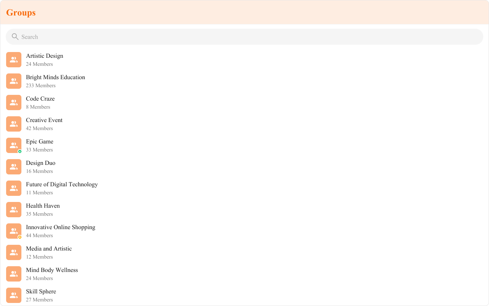
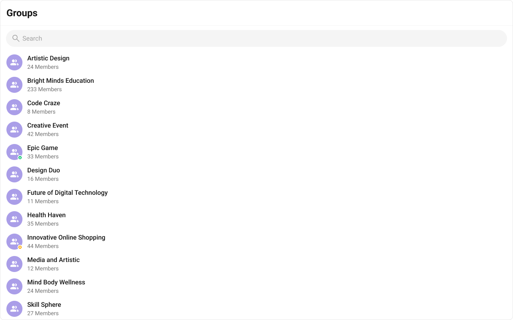
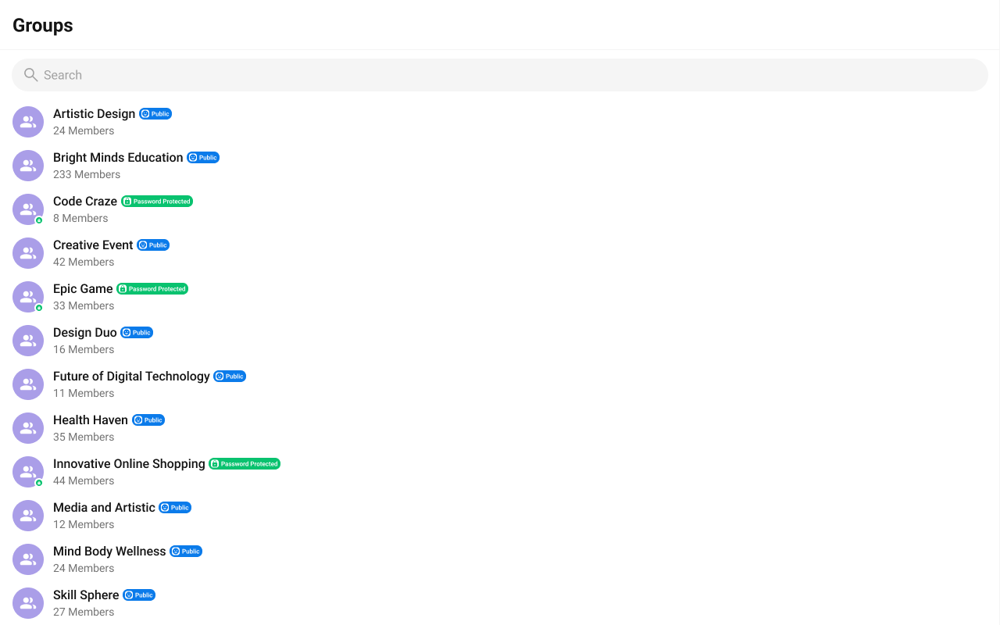
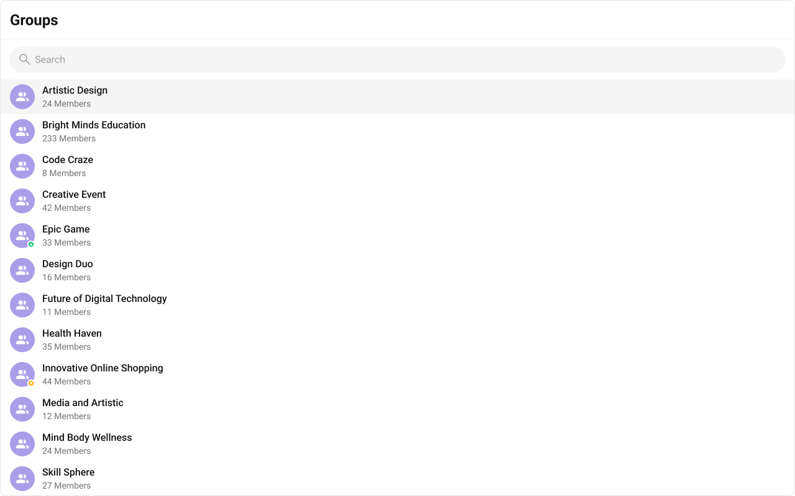
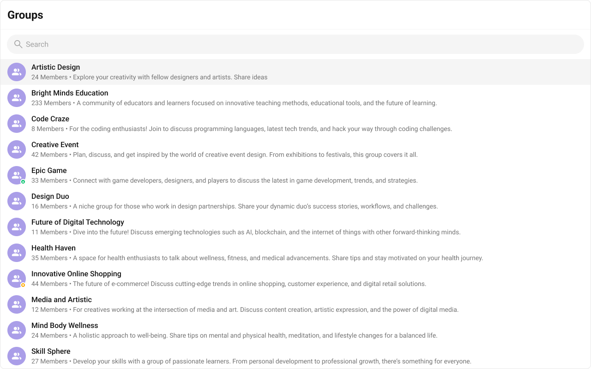
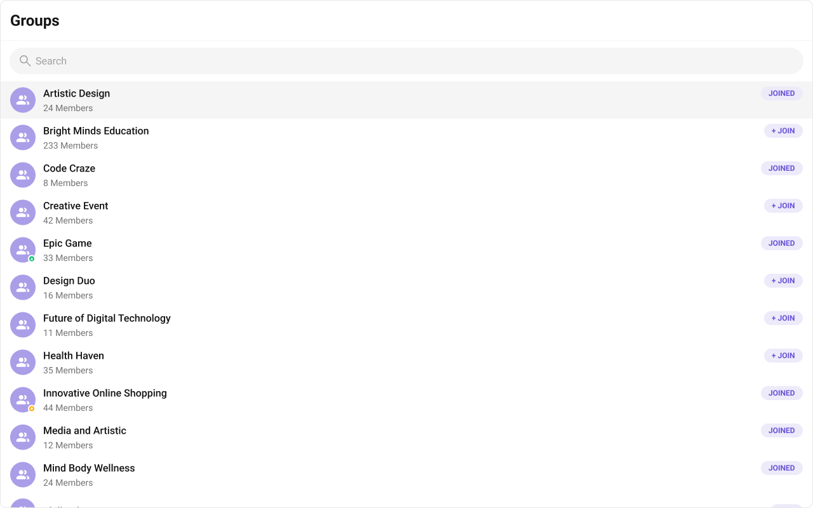
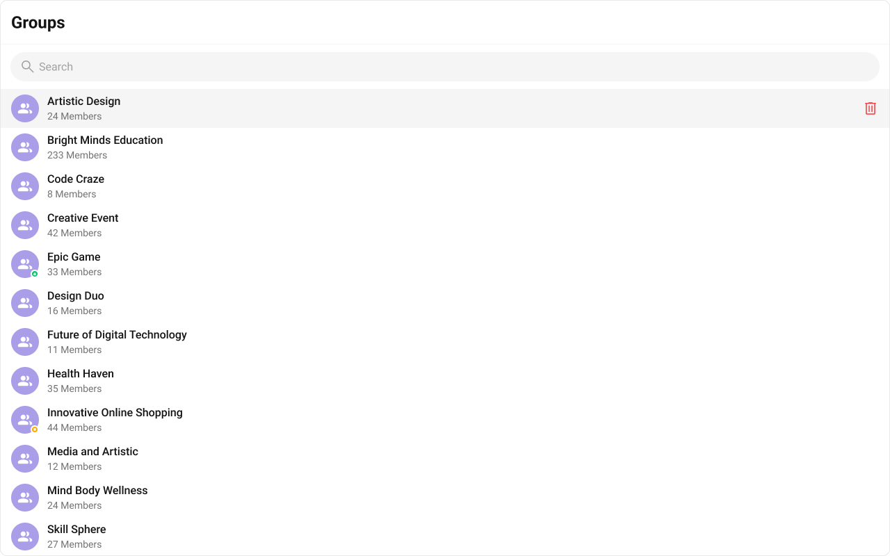

import Tabs from '@theme/Tabs';
import TabItem from '@theme/TabItem';

## Overview

The Groups is a Component, showcasing an accessible list of all available groups. It provides an integral search functionality, allowing you to locate any specific groups swiftly and easily. For each group listed, the group name is displayed by default, in conjunction with the group icon when available. Additionally, it provides a useful feature by displaying the number of members in each group as a subtitle, offering valuable context about group size and activity level.


The Groups component is composed of the following BaseComponents:

| Components        | Description                                                                                                               |
| ----------------- | ------------------------------------------------------------------------------------------------------------------------- |
| CometChatList     | A reusable container component having title, search box, customisable background and a list view.                         |
| CometChatListItem | A component that renders data obtained from a Group object on a Tile having a title, subtitle, leading and trailing view. |

---

## Usage

### Integration

The following code snippet illustrates how you can directly incorporate the Groups component into your Application.

<Tabs>
<TabItem value="GroupsDemo" label="GroupsDemo.tsx">

```tsx
import { CometChatGroups } from "@cometchat/chat-uikit-react";
import React from "react";

const GroupsDemo = () => {
  return <CometChatGroups />;
};

export default GroupsDemo;
```

</TabItem>
<TabItem value="App" label="App.tsx">

```tsx
import { GroupsDemo } from "./GroupsDemo";

export default function App() {
  return (
    <div className="App">
      <GroupsDemo />
    </div>
  );
}
```

</TabItem>
</Tabs>

---

### Actions

[Actions](components-overview#actions) dictate how a component functions. They are divided into two types: Predefined and User-defined. You can override either type, allowing you to tailor the behavior of the component to fit your specific needs.

##### 1. onSelect

The `onSelect` action is activated when you select the done icon while in selection mode. This returns the `group` object along with the boolean flag `selected` to indicate if the group was selected or unselected.

This action does not come with any predefined behavior. However, you have the flexibility to override this event and tailor it to suit your needs using the following code snippet.

<Tabs>
<TabItem value="TypeScript" label="TypeScript">

```tsx
import { CometChat } from "@cometchat/chat-sdk-javascript";
import { CometChatGroups, SelectionMode } from "@cometchat/chat-uikit-react";
import React from "react";

const GroupsDemo = () => {
  function handleOnSelect(group: CometChat.Group, selected: boolean): void {
    console.log(group);
    //your custom onSelect actions
  }
  return (
    <CometChatGroups
      selectionMode={SelectionMode.multiple}
      onSelect={handleOnSelect}
    />
  );
};

export default GroupsDemo;
```

</TabItem>
<TabItem value="JavaScript" label="JavaScript">

```jsx
import { CometChatGroups, SelectionMode } from "@cometchat/chat-uikit-react";
import React from "react";

const GroupsDemo = () => {
  function handleOnSelect(group, selected) {
    console.log(group);
    //your custom onSelect actions
  }
  return (
    <CometChatGroups
      selectionMode={SelectionMode.multiple}
      onSelect={handleOnSelect}
    />
  );
};

export default GroupsDemo;
```

</TabItem>
</Tabs>

##### 2. onItemClick

The `onItemClick` event is activated when you click on the Group List item. This action does not come with any predefined behavior. However, you have the flexibility to override this event and tailor it to suit your needs using the following code snippet.

<Tabs>
<TabItem value="TypeScript" label="TypeScript">

```tsx
import { CometChat } from "@cometchat/chat-sdk-javascript";
import { CometChatGroups } from "@cometchat/chat-uikit-react";
import React from "react";

const GroupsDemo = () => {
  function handleOnItemClick(group: CometChat.Group): void {
    console.log(group, "your custom on item click action");
  }
  return <CometChatGroups onItemClick={handleOnItemClick} />;
};

export default GroupsDemo;
```

</TabItem>
<TabItem value="JavaScript" label="JavaScript">

```jsx
import { CometChatGroups } from "@cometchat/chat-uikit-react";
import React from "react";

const GroupsDemo = () => {
  function handleOnItemClick(group) {
    console.log(group, "your custom on item click action");
  }
  return <CometChatGroups onItemClick={handleOnItemClick} />;
};

export default GroupsDemo;
```

</TabItem>
</Tabs>

##### 3. onError

This action doesn't change the behavior of the component but rather listens for any errors that occur in the Groups component.

<Tabs>
<TabItem value="TypeScript" label="TypeScript">

```tsx
import { CometChat } from "@cometchat/chat-sdk-javascript";
import { CometChatGroups } from "@cometchat/chat-uikit-react";
import React from "react";

const GroupsDemo = () => {
  const handleOnError = (error: CometChat.CometChatException) => {
    console.log("Your custom on error actions");
  };
  return <CometChatGroups onError={handleOnError} />;
};

export default GroupsDemo;
```

</TabItem>
<TabItem value="JavaScript" label="JavaScript">

```jsx
import { CometChatGroups } from "@cometchat/chat-uikit-react";
import React from "react";

const GroupsDemo = () => {
  const handleOnError = (error) => {
    console.log("Your custom on error actions");
  };
  return <CometChatGroups onError={handleOnError} />;
};

export default GroupsDemo;
```

</TabItem>
</Tabs>

### Filters

**Filters** allow you to customize the data displayed in a list within a Component. You can filter the list based on your specific criteria, allowing for a more customized. Filters can be applied using RequestBuilders of Chat SDK.

##### 1. GroupsRequestBuilder

The [GroupsRequestBuilder](/sdk/javascript/retrieve-groups) enables you to filter and customize the group list based on available parameters in [GroupsRequestBuilder](/sdk/javascript/retrieve-groups). This feature allows you to create more specific and targeted queries when fetching groups. The following are the parameters available in [GroupsRequestBuilder](/sdk/javascript/retrieve-groups)

| Methods              | Type                | Description                                                                             |
| -------------------- | ------------------- | --------------------------------------------------------------------------------------- |
| **setLimit**         | number              | sets the number groups that can be fetched in a single request, suitable for pagination |
| **setSearchKeyword** | String              | used for fetching groups matching the passed string                                     |
| **joinedOnly**       | boolean             | to fetch only joined groups.                                                            |
| **setTags**          | Array&lt;String&gt; | used for fetching groups containing the passed tags                                     |
| **withTags**         | boolean             | used to fetch tags data along with the list of groups                                   |

**Example**

In the example below, we are applying a filter to the Group List based on only joined groups and setting the limit to two.

<Tabs>
<TabItem value="TypeScript" label="TypeScript">

```tsx
import { CometChat } from "@cometchat/chat-sdk-javascript";
import { CometChatGroups } from "@cometchat/chat-uikit-react";
import React from "react";

const GroupsDemo = () => {
  return (
    <CometChatGroups
      groupsRequestBuilder={new CometChat.GroupsRequestBuilder()
        .setLimit(2)
        .joinedOnly(true)}
    />
  );
};

export default GroupsDemo;
```

</TabItem>
<TabItem value="JavaScript" label="JavaScript">

```jsx
import { CometChat } from "@cometchat/chat-sdk-javascript";
import { CometChatGroups } from "@cometchat/chat-uikit-react";
import React from "react";

const GroupsDemo = () => {
  return (
    <CometChatGroups
      groupsRequestBuilder={new CometChat.GroupsRequestBuilder()
        .setLimit(2)
        .joinedOnly(true)}
    />
  );
};

export default GroupsDemo;
```

</TabItem>
</Tabs>

##### 2. SearchRequestBuilder

The SearchRequestBuilder uses [GroupsRequestBuilder](/sdk/javascript/retrieve-groups) enables you to filter and customize the search list based on available parameters in GroupsRequestBuilder.
This feature allows you to keep uniformity between the displayed Groups List and searched Group List.

**Example**

<Tabs>
<TabItem value="TypeScript" label="TypeScript">

```tsx
import { CometChat } from "@cometchat/chat-sdk-javascript";
import { CometChatGroups } from "@cometchat/chat-uikit-react";
import React from "react";

const GroupsDemo = () => {
  return (
    <CometChatGroups
      searchRequestBuilder={new CometChat.GroupsRequestBuilder()
        .setLimit(2)
        .setSearchKeyword("your keyword")}
    />
  );
};

export default GroupsDemo;
```

</TabItem>
<TabItem value="JavaScript" label="JavaScript">

```jsx
import { CometChat } from "@cometchat/chat-sdk-javascript";
import { CometChatGroups } from "@cometchat/chat-uikit-react";
import React from "react";

const GroupsDemo = () => {
  return (
    <CometChatGroups
      searchRequestBuilder={new CometChat.GroupsRequestBuilder()
        .setLimit(2)
        .setSearchKeyword("your keyword")}
    />
  );
};

export default GroupsDemo;
```

</TabItem>
</Tabs>

---

### Events

[Events](components-overview#events) are emitted by a `Component`. By using event you can extend existing functionality. Being global events, they can be applied in Multiple Locations and are capable of being Added or Removed.

To handle events supported by Groups you have to add corresponding listeners by using `CometChatGroupEvents`

The `Groups` component does not produce any events directly.

---

## Customization

To fit your app's design requirements, you can customize the appearance of the Groups component. We provide exposed methods that allow you to modify the experience and behavior according to your specific needs.

### Style

Using CSS you can customize the look and feel of the component in your app like the color, size, shape, and fonts.

**Example**



<Tabs>
<TabItem value="TypeScript" label="TypeScript">

```tsx
import { CometChatGroups } from "@cometchat/chat-uikit-react";
import React from "react";

const GroupsDemo = () => {
  return <CometChatGroups />;
};

export default GroupsDemo;
```

</TabItem>
<TabItem value="JavaScript" label="JavaScript">

```jsx
import { CometChatGroups } from "@cometchat/chat-uikit-react";
import React from "react";

const GroupsDemo = () => {
  return <CometChatGroups />;
};

export default GroupsDemo;
```

</TabItem>

<TabItem value="CSS" label="CSS">

```css
.cometchat .cometchat-groups .cometchat-list__header-title {
  background-color: #edeafa;
  color: #6852d6;
  border-width: 0px 1px 1px 0px;
  border-style: solid;
  border-color: #6852d6;
  overflow: hidden;
  text-overflow: ellipsis;
  font-family: "Times New Roman";
  font-size: 24px;
  font-style: normal;
  font-weight: 700;
  line-height: 28.8px;
}

.cometchat .cometchat-groups .cometchat-search-bar__input::placeholder {
  font-family: "Times New Roman";
  font-size: 16px;
  font-style: normal;
  font-weight: 400;
  line-height: 19.2px;
}

.cometchat .cometchat-groups .cometchat-list-item {
  background: #fff;
  border-right: 1px solid #f5f5f5;
}

.cometchat .cometchat-groups__list-item .cometchat-avatar {
  background-color: #aa9ee8;
  border-radius: 6.67px;
}

.cometchat .cometchat-groups .cometchat-list-item__body-title {
  overflow: hidden;
  color: #141414;
  text-overflow: ellipsis;
  font-family: "Times New Roman";
  font-size: 16px;
  font-style: normal;
  font-weight: 400;
  line-height: 19.2px;
}

.cometchat .cometchat-groups .cometchat-groups__subtitle {
  overflow: hidden;
  color: #727272;
  text-overflow: ellipsis;
  white-space: nowrap;
  font-family: "Times New Roman";
  font-size: 14px;
  font-style: normal;
  font-weight: 400;
  line-height: 16.8px;
}
```

</TabItem>
</Tabs>

---

### Functionality

These are a set of small functional customizations that allow you to fine-tune the overall experience of the component. With these, you can change text, set custom icons, and toggle the visibility of UI elements.

<Tabs>
<TabItem value="TypeScript" label="TypeScript">

```tsx
import { CometChatGroups, TitleAlignment } from "@cometchat/chat-uikit-react";
import React from "react";

const GroupsDemo = () => {
  return (
    <CometChatGroups
      title="Your Custom Title"
      titleAlignment={TitleAlignment.center}
      hideSearch={true}
    />
  );
};

export default GroupsDemo;
```

</TabItem>
<TabItem value="JavaScript" label="JavaScript">

```jsx
import { CometChatGroups, TitleAlignment } from "@cometchat/chat-uikit-react";
import React from "react";

const GroupsDemo = () => {
  return (
    <CometChatGroups
      title="Your Custom Title"
      titleAlignment={TitleAlignment.center}
      hideSearch={true}
    />
  );
};

export default GroupsDemo;
```

</TabItem>
</Tabs>

<!-- Default:


Custom:
 -->

Below is a list of customizations along with corresponding code snippets:
| Property | Description | Code |
| -------- | ----------- | ---- |
| **Hide Search** | Hides the default search bar. | `hideSearch={true}` |
| **Hide Error** | Hides the default and custom error view passed in `errorView` prop. | `hideError={true}` |
| **Hide Group Type** | Hides the group type icon. | `hideGroupType={true}` |
| **Active Group** | The group to highlight in the list. | `activeGroup={chatGroup}` |
| **Selection Mode** | Selection mode to use for the default trailing view.| `selectionMode={SelectionMode.multiple}` |
| **Loading View** | A custom view to display during the loading state. | `loadingView={<>Custom Loading View</>}` |
| **Empty View** | Custom view for the empty state of the component.| `emptyView={<>Custom Empty View</>}` |
| **Error View** | A custom view to display when an error occurs. | `errorView={<>Custom Error View</>}` |

---

### Advanced

For advanced-level customization, you can set custom views to the component. This lets you tailor each aspect of the component to fit your exact needs and application aesthetics. You can create and define your views, layouts, and UI elements and then incorporate those into the component.

---

#### ItemView

A custom view to render for each group in the fetched list.

Shown below is the default chat interface.



The customized chat interface is displayed below.


Use the following code to achieve the customization shown above.

<Tabs>
<TabItem value="TypeScript" label="TypeScript">

```tsx
import { CometChat } from "@cometchat/chat-sdk-javascript";
import { CometChatGroups } from "@cometchat/chat-uikit-react";
import React from "react";

const GroupsDemo = () => {
  const getItemView = (group: CometChat.Group) => {
    return (
      <div className="group-list-item">
        <div className="group-list-item__title-wrapper">
          <div className="group-list-item__title">{group.getName()}</div>
          <div className="group-list-item__tail">JOIN</div>
        </div>
        <div className="group-list-item__subtitle">
          {group.getMembersCount()} Members • {group.getDescription()}
        </div>
      </div>
    );
  };

  return <CometChatGroups itemView={getItemView} />;
};

export default GroupsDemo;
```

</TabItem>
<TabItem value="JavaScript" label="JavaScript">

```jsx
import { CometChatGroups } from "@cometchat/chat-uikit-react";
import React from "react";

const GroupsDemo = () => {
  const getItemView = (group: CometChat.Group) => {
    return (
      <div className="group-list-item">
        <div className="group-list-item__title-wrapper">
          <div className="group-list-item__title">{group.getName()}</div>
          <div className="group-list-item__tail">JOIN</div>
        </div>
        <div className="group-list-item__subtitle">
          {group.getMembersCount()} Members • {group.getDescription()}
        </div>
      </div>
    );
  };

  return <CometChatGroups itemView={getItemView} />;
};

export default GroupsDemo;
```

</TabItem>

<TabItem value="CSS" label="CSS">

```css
.group-list-item {
  display: flex;
  flex-direction: column;
  text-align: left;
  display: flex;
  min-width: 240px;
  padding: 8px 16px;
  gap: 4px;
  flex: 1 0 0;
  border-right: 1px solid #f5f5f5;
  background: #fff;
}

.group-list-item:hover {
  background-color: #f5f5f5;
}

.group-list-item__title-wrapper {
  display: flex;
  justify-content: space-between;
  align-items: center;
  align-self: stretch;
}

.group-list-item__title {
  overflow: hidden;
  color: #141414;
  text-overflow: ellipsis;
  font-family: Roboto;
  font-size: var(--Size-H4, 16px);
  font-style: normal;
  font-weight: 500;
  line-height: 19.2px;
}

.group-list-item__tail {
  display: flex;
  padding: 4px 12px;
  justify-content: center;
  align-items: center;
  gap: 20px;
  border-radius: 1000px;
  background: #edeafa;
  overflow: hidden;
  color: #6852d6;
  text-overflow: ellipsis;
  font-family: Roboto;
  font-size: 12px;
  font-style: normal;
  font-weight: 700;
  line-height: 14.4px;
}

.group-list-item__subtitle {
  overflow: hidden;
  color: #727272;
  text-overflow: ellipsis;
  white-space: nowrap;
  font-family: Roboto;
  font-size: 14px;
  font-style: normal;
  font-weight: 400;
  line-height: 16.8px;
}
```

</TabItem>
</Tabs>

---
#### TitleView

The customized chat interface is displayed below.



Use the following code to achieve the customization shown above.

<Tabs>
<TabItem value="TypeScript" label="TypeScript">

```tsx
import React from "react";
import { CometChat } from "@cometchat/chat-sdk-javascript";
import { CometChatGroups } from "@cometchat/chat-uikit-react";

// Custom title view component
const customTitleView = (group: CometChat.Group) => {
   return <div className={`groups__title-view groups__title-view-${group.getType()}`}>
      <span className="groups__title-view-name">{group.getName()}</span>
      <span className="groups__title-view-type">{group.getType()}</span>
  </div>;
}

<CometChatGroups user={userObj} titleView={customTitleView} />;
```

</TabItem>
<TabItem value="CSS" label="CSS">

```css
.groups__title-view{
display: flex;
align-items: center;
gap: 4px;
align-self: stretch;
}
.groups__title-view-name{
overflow: hidden;
color: #141414;
text-overflow: ellipsis;
font:500 16px Roboto
}
.groups__title-view-type{
color: #FFF;
font: 600 8px Roboto;
display: flex;
height: 15px;
padding: 1px 3px;
justify-content: center;
align-items: center;
gap: 4px;
border-radius: 7px;
background: #09C26F;
}
.groups__title-view-public .groups__title-view-type{
background: #0B7BEA;
}
.groups__title-view-type img{
background: #fff;
border-radius: 4px;
height: 12px;
width: 12px;
}

```

</TabItem>
</Tabs>

---

#### SubtitleView

Custom subtitle view to be rendered for each group in the fetched list.

Shown below is the default chat interface.



The customized chat interface is displayed below.



Use the following code to achieve the customization shown above.

<Tabs>
<TabItem value="TypeScript" label="TypeScript">

```tsx
import { CometChat } from "@cometchat/chat-sdk-javascript";
import { CometChatGroups } from "@cometchat/chat-uikit-react";
import React from "react";

const GroupsDemo = () => {
  const getSubtitleView = (group: CometChat.Group): JSX.Element => {
    if (!(group instanceof CometChat.Group)) {
      return <></>;
    }

    return (
      <div className="group-subtitle">
        {group.getMembersCount()} Members • {group.getDescription()}
      </div>
    );
  };

  return <CometChatGroups subtitleView={getSubtitleView} />;
};

export default GroupsDemo;
```

</TabItem>
<TabItem value="JavaScript" label="JavaScript">

```jsx
import { CometChat } from "@cometchat/chat-sdk-javascript";
import { CometChatGroups } from "@cometchat/chat-uikit-react";
import React from "react";

const GroupsDemo = () => {
  const getSubtitleView = (group) => {
    if (!(group instanceof CometChat.Group)) {
      return <></>;
    }

    return (
      <div className="group-subtitle">
        {group.getMembersCount()} Members • {group.getDescription()}
      </div>
    );
  };

  return <CometChatGroups subtitleView={getSubtitleView} />;
};

export default GroupsDemo;
```

</TabItem>

<TabItem value="CSS" label="CSS">

```css
.cometchat .cometchat-groups .group-subtitle {
  overflow: hidden;
  color: #727272;
  text-overflow: ellipsis;
  white-space: nowrap;
  font-size: 14px;
  font-style: normal;
  font-weight: 400;
  line-height: 120%;
}
```

</TabItem>
</Tabs>

---
#### LeadingView

The customized chat interface is displayed below.


Use the following code to achieve the customization shown above.

<Tabs>
<TabItem value="TypeScript" label="TypeScript">

```tsx
import React from "react";
import { CometChat } from "@cometchat/chat-sdk-javascript";
import { CometChatGroups,CometChatAvatar } from "@cometchat/chat-uikit-react";

// Custom leading view component
 const customLeadingView = (group: CometChat.Group) => {
        return <>
            {group.getHasJoined() ? <div className="groups__leading-view groups__leading-view-joined">
                <CometChatAvatar
                    image={group?.getIcon()}
                    name={group?.getName()}
                />
                {/* Icon here */}
                <span className="groups__leading-view-info"> Joined</span>


            </div> : <div className="groups__leading-view">
                <CometChatAvatar
                    image={group?.getIcon()}
                    name={group?.getName()}
                />
                {/* Icon here */}
                <span className="groups__leading-view-info"> Join</span>


            </div>}</>;
    }

<CometChatGroups  leadingView={customLeadingView} />;
```

</TabItem>
<TabItem value="CSS" label="CSS">

```css

.cometchat-groups .cometchat-list-item .groups__leading-view .cometchat-avatar__image, .cometchat-groups .cometchat-list-item .groups__leading-view .cometchat-avatar{
  border-radius: 8px;
  height: 48px ;
  width: 48px ;
}

.groups__leading-view-info{
  display: flex;
  width: 48px;
  height: 15px;
  padding: 1px 3px;
  justify-content: center;
  align-items: center;
  color:#FFF;
  font:600 8px/9.6px Roboto;
  background:#FFAB00;
  position:absolute;
  bottom:-2px;
}
.groups__leading-view-joined .groups__leading-view-info{
   background:#09C26F;
}
.groups__leading-view{
  position: relative;
}

```

</TabItem>
</Tabs>
---

#### TrailingView

The customized chat interface is displayed below.



Use the following code to achieve the customization shown above.

<Tabs>
<TabItem value="TypeScript" label="TypeScript">

```tsx
import React from "react";
import { CometChat } from "@cometchat/chat-sdk-javascript";
import {
  CometChatGroups,
} from "@cometchat/chat-uikit-react";

// Custom trailing view component
const customTrailingButtonView = (group:CometChat.Group) =>  {
return <div className="groups__trailing-view">
 {group.getHasJoined() ? "JOINED" : "+ JOIN"}
</div>
}

<CometChatGroups  trailingView={customTrailingButtonView} />;
```

</TabItem>

<TabItem value="CSS" label="CSS">

```css
.groups__trailing-view{
display: flex;
padding: 4px 12px;
justify-content: center;
align-items: center;
border-radius: 1000px;
background: #EDEAFA;
overflow: hidden;
color: #6852D6;
text-overflow: ellipsis;
font:700 12px Roboto;
}
.cometchat-groups .cometchat-list-item__trailing-view{
width: fit-content;
height: fit-content;
}
```

</TabItem>
</Tabs>
---

#### Header View

A custom component to render in the top-right corner of the groups list.

The customized chat interface is displayed below.


Use the following code to achieve the customization shown above.

<Tabs>
<TabItem value="TypeScript" label="TypeScript">

```tsx
import { CometChatGroups } from "@cometchat/chat-uikit-react";
import React from "react";

const GroupsDemo = () => {
  const getHeaderView = () => {
    return <div className="group-header-view" />;
  };

  return <CometChatGroups headerView={getHeaderView()} />;
};

export default GroupsDemo;
```

</TabItem>
<TabItem value="JavaScript" label="JavaScript">

```jsx
import { CometChatGroups } from "@cometchat/chat-uikit-react";
import React from "react";

const GroupsDemo = () => {
  const getHeaderView = () => {
    return <div className="group-header-view" />;
  };

  return <CometChatGroups headerView={getHeaderView()} />;
};

export default GroupsDemo;
```

</TabItem>

<TabItem value="CSS" label="CSS">

```css
.group-header-view {
  height: 24px;
  width: 24px;
  display: flex;
  align-items: center;
  justify-content: center;
  border: none;
  align-self: center;
  background: #6852d6;
  flex-shrink: 0;
  -webkit-mask: url("../assets/create-group.svg") center center no-repeat;
  mask: url("../assets/create-group.svg") center center no-repeat;
  -webkit-mask-size: contain;
  mask-size: contain;
}
```

</TabItem>
</Tabs>

---

#### Options

You can set the Custom options to the Groups component.

The customized chat interface is displayed below.



Use the following code to achieve the customization shown above.

<Tabs>
<TabItem value="TypeScript" label="TypeScript">

```tsx
import { CometChatGroups, CometChatOption } from "@cometchat/chat-uikit-react";
import React from "react";

const GroupsDemo = () => {
  const getOptions = (group: CometChat.Group): CometChatOption[] => {
    return [
      new CometChatOption({
        id: "delete",
        title: "delete",
        onClick: () => {
          console.log("Custom option clicked for group:", group);
        },
      }),
    ];
  };

  return <CometChatGroups options={getOptions} />;
};

export default GroupsDemo;
```

</TabItem>
<TabItem value="JavaScript" label="JavaScript">

```jsx
import { CometChatGroups, CometChatOption } from "@cometchat/chat-uikit-react";
import React from "react";

const GroupsDemo = () => {
  const getOptions = (group: CometChat.Group): CometChatOption[] => {
    return [
      new CometChatOption({
        id: "delete",
        title: "delete",
        onClick: () => {
          console.log("Custom option clicked for group:", group);
        },
      }),
    ];
  };

  return <CometChatGroups options={getOptions} />;
};

export default GroupsDemo;
```

</TabItem>

<TabItem value="CSS" label="CSS">

```css
.cometchat .cometchat-groups .cometchat-menu-list__menu {
  background: none;
}
.cometchat .cometchat-groups .cometchat-menu-list__main-menu-item-icon {
  height: 24px;
  width: 24px;
  display: flex;
  align-items: center;
  justify-content: center;
  border: none;
  align-self: center;
  background: #f44649;
  flex-shrink: 0;
  -webkit-mask: url("../assets/delete.svg") center center no-repeat;
  mask: url("../assets/delete.svg") center center no-repeat;
  -webkit-mask-size: contain;
  mask-size: contain;
}
```

</TabItem>
</Tabs>
