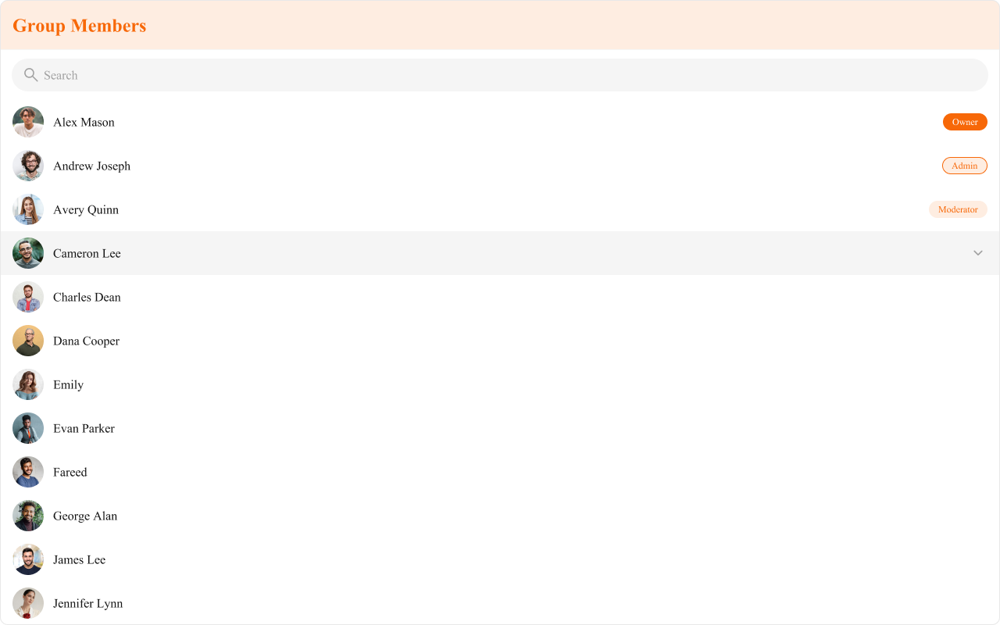
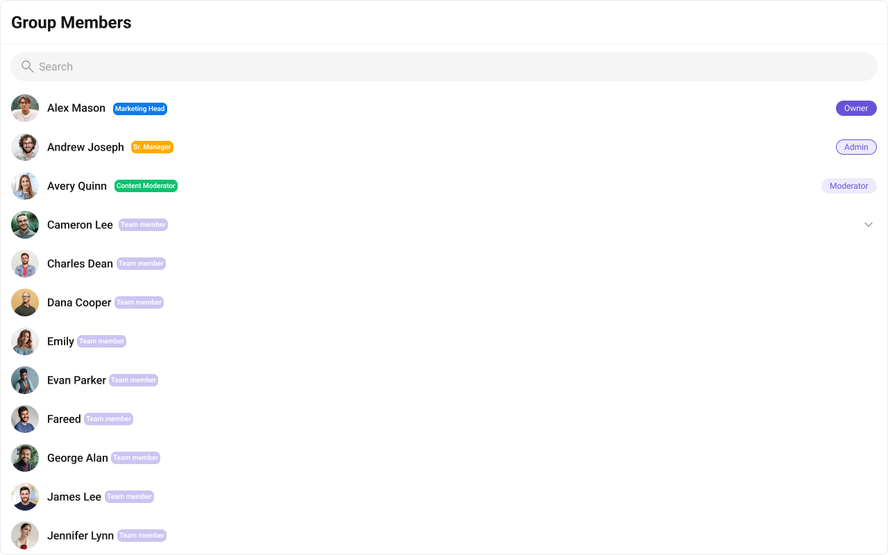
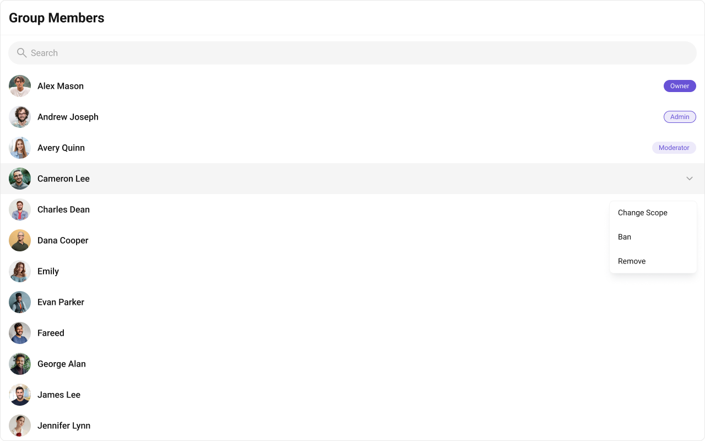
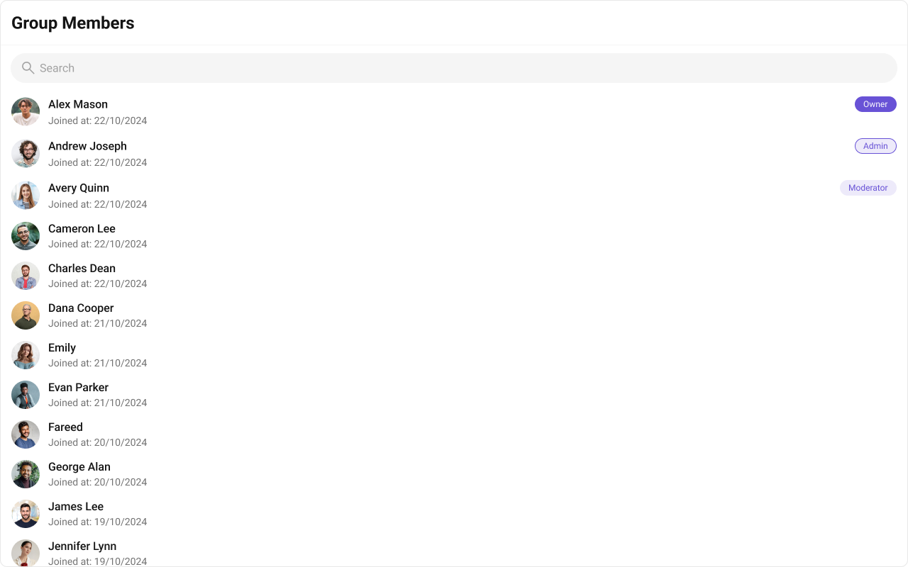
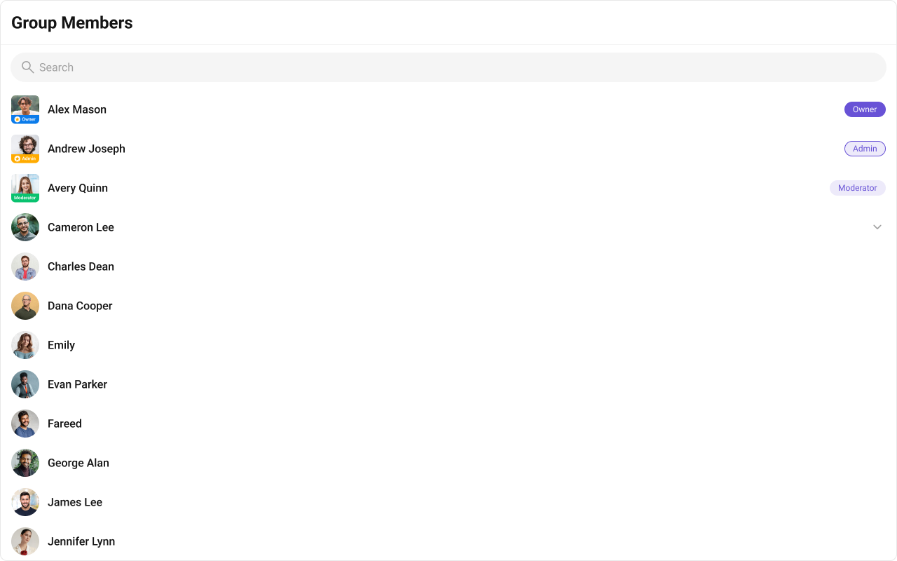
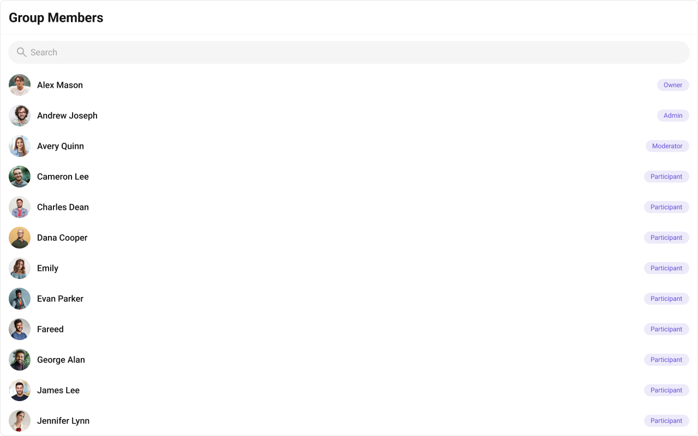

import Tabs from '@theme/Tabs';
import TabItem from '@theme/TabItem';

## Overview

`CometChatGroupMembers` is a Component that displays all users added or invited to a group, granting them access to group discussions, shared content, and collaborative features. Group members can communicate in real-time via messaging, voice and video calls, and other activities. They can interact, share files, and join calls based on group permissions set by the administrator or owner.


---

## Usage

### Integration

The following code snippet illustrates how you can directly incorporate the Group Members component into your Application.

<Tabs>
<TabItem value="GroupMembersDemo" label="GroupMembersDemo.tsx">

```tsx
import { CometChat } from "@cometchat/chat-sdk-javascript";
import { CometChatGroupMembers } from "@cometchat/chat-uikit-react";
import React from "react";

const GroupMembersDemo = () => {
  const [chatGroup, setChatGroup] = React.useState<CometChat.Group>();

  React.useEffect(() => {
    CometChat.getGroup("guid").then((group) => {
      setChatGroup(group);
    });
  }, []);

  return <>{chatGroup && <CometChatGroupMembers group={chatGroup} />}</>;
};

export default GroupMembersDemo;
```

</TabItem>
<TabItem value="App" label="App.tsx">

```tsx
import { GroupMembersDemo } from "./GroupMembersDemo";

export default function App() {
  return (
    <div className="App">
      <GroupMembersDemo />
    </div>
  );
}
```

</TabItem>
</Tabs>

---

### Actions

[Actions](components-overview#actions) dictate how a component functions. They are divided into two types: Predefined and User-defined. You can override either type, allowing you to tailor the behavior of the component to fit your specific needs.

##### 1. onSelect

The `onSelect` action is activated when you select the done icon while in selection mode. This returns a list of all the group members that you have selected.

This action does not come with any predefined behavior. However, you have the flexibility to override this event and tailor it to suit your needs using the following code snippet.

<Tabs>
<TabItem value="TypeScript" label="TypeScript">

```tsx
import { CometChat } from "@cometchat/chat-sdk-javascript";
import {
  CometChatGroupMembers,
  SelectionMode,
} from "@cometchat/chat-uikit-react";
import React from "react";

const GroupMembersDemo = () => {
  const [chatGroup, setChatGroup] = React.useState<CometChat.Group>();

  React.useEffect(() => {
    CometChat.getGroup("guid").then((group) => {
      setChatGroup(group);
    });
  }, []);

  function handleOnSelect(
    groupMembers: CometChat.GroupMember,
    selected: boolean
  ): void {
    console.log(groupMembers, selected);
    /** Your custom onSelect actions */
  }

  return (
    <>
      {chatGroup && (
        <CometChatGroupMembers
          group={chatGroup}
          selectionMode={SelectionMode.multiple}
          onSelect={handleOnSelect}
        />
      )}
    </>
  );
};

export default GroupMembersDemo;
```

</TabItem>
<TabItem value="JavaScript" label="JavaScript">

```jsx
import { CometChat } from "@cometchat/chat-sdk-javascript";
import {
    CometChatGroupMembers,
    SelectionMode,
} from "@cometchat/chat-uikit-react";
import React, { useEffect, useState } from "react";

const GroupMembersDemo = () => {
    const [chatGroup, setChatGroup] = useState(null);

    useEffect(() => {
        CometChat.getGroup("guid").then((group) => {
            setChatGroup(group);
        });
    }, []);

    function handleOnSelect(groupMembers, selected) {
        console.log(groupMembers);
        /** Your custom onSelect actions
    }

    return (
        <>
            {chatGroup && (
                <CometChatGroupMembers
                    group={chatGroup}
                    selectionMode={SelectionMode.multiple}
                    onSelect={handleOnSelect}
                />
            )}
        </>
    );
};

export default GroupMembersDemo;
```

</TabItem>
</Tabs>

##### 2. onItemClick

The `onItemClick` event is activated when you click on the Group Members List item. This action does not come with any predefined behavior. However, you have the flexibility to override this event and tailor it to suit your needs using the following code snippet.

<Tabs>
<TabItem value="TypeScript" label="TypeScript">

```tsx
import { CometChat } from "@cometchat/chat-sdk-javascript";
import { CometChatGroupMembers } from "@cometchat/chat-uikit-react";
import React from "react";

const GroupMembersDemo = () => {
  const [chatGroup, setChatGroup] = React.useState<CometChat.Group>();

  React.useEffect(() => {
    CometChat.getGroup("guid").then((group) => {
      setChatGroup(group);
    });
  }, []);

  function handleOnItemClick(groupMembers: CometChat.GroupMember): void {
    console.log(groupMembers, "your custom on item click action");
  }

  return (
    <>
      {chatGroup && (
        <CometChatGroupMembers
          group={chatGroup}
          onItemClick={handleOnItemClick}
        />
      )}
    </>
  );
};

export default GroupMembersDemo;
```

</TabItem>
<TabItem value="JavaScript" label="JavaScript">

```jsx
import { CometChat } from "@cometchat/chat-sdk-javascript";
import { CometChatGroupMembers } from "@cometchat/chat-uikit-react";
import { useEffect, useState } from "react";

const GroupMembersDemo = () => {
  const [chatGroup, setChatGroup] = useState(null);

  useEffect(() => {
    CometChat.getGroup("guid").then((group) => {
      setChatGroup(group);
    });
  }, []);

  function handleOnItemClick(groupMembers) {
    console.log(groupMembers, "your custom on item click action");
  }

  return (
    <>
      {chatGroup && (
        <CometChatGroupMembers
          group={chatGroup}
          onItemClick={handleOnItemClick}
        />
      )}
    </>
  );
};

export default GroupMembersDemo;
```

</TabItem>
</Tabs>

##### 3. onEmpty

This action allows you to specify a callback function to be executed when a certain condition, typically the absence of data or content, is met within the component or element.

<Tabs>
<TabItem value="TypeScript" label="TypeScript">

```tsx
import { CometChat } from "@cometchat/chat-sdk-javascript";
import { CometChatGroupMembers } from "@cometchat/chat-uikit-react";
import React from "react";

const GroupMembersDemo = () => {
  const [chatGroup, setChatGroup] = React.useState<CometChat.Group>();

  React.useEffect(() => {
    CometChat.getGroup("guid").then((group) => {
      setChatGroup(group);
    });
  }, []);

  function handleOnEmpty(): void {
    console.log("your custom on empty actions");
  }

  return (
    <>
      {chatGroup && (
        <CometChatGroupMembers group={chatGroup} onEmpty={handleOnEmpty} />
      )}
    </>
  );
};

export default GroupMembersDemo;
```

</TabItem>
<TabItem value="JavaScript" label="JavaScript">

```jsx
import { CometChat } from "@cometchat/chat-sdk-javascript";
import { CometChatGroupMembers } from "@cometchat/chat-uikit-react";
import { useEffect, useState } from "react";

const GroupMembersDemo = () => {
  const [chatGroup, setChatGroup] = useState(null);

  useEffect(() => {
    CometChat.getGroup("guid").then((group) => {
      setChatGroup(group);
    });
  }, []);

  function handleOnEmpty() {
    console.log("your custom on empty actions");
  }

  return (
    <>
      {chatGroup && (
        <CometChatGroupMembers group={chatGroup} onEmpty={handleOnEmpty} />
      )}
    </>
  );
};

export default GroupMembersDemo;
```

</TabItem>
</Tabs>

##### 4. onError

This action doesn't change the behavior of the component but rather listens for any errors that occur in the Group Members component.

<Tabs>
<TabItem value="TypeScript" label="TypeScript">

```tsx
import { CometChat } from "@cometchat/chat-sdk-javascript";
import { CometChatGroupMembers } from "@cometchat/chat-uikit-react";
import React from "react";

const GroupMembersDemo = () => {
  const [chatGroup, setChatGroup] = React.useState<CometChat.Group>();

  React.useEffect(() => {
    CometChat.getGroup("guid").then((group) => {
      setChatGroup(group);
    });
  }, []);

  function handleOnError(error: CometChat.CometChatException): void {
    /** Your Custom on error actions */
  }

  return (
    <>
      {chatGroup && (
        <CometChatGroupMembers group={chatGroup} onError={handleOnError} />
      )}
    </>
  );
};

export default GroupMembersDemo;
```

</TabItem>
<TabItem value="JavaScript" label="JavaScript">

```jsx
import { CometChat } from "@cometchat/chat-sdk-javascript";
import { CometChatGroupMembers } from "@cometchat/chat-uikit-react";
import { useEffect, useState } from "react";

const GroupMembersDemo = () => {
  const [chatGroup, setChatGroup] = useState(null);

  useEffect(() => {
    CometChat.getGroup("guid").then((group) => {
      setChatGroup(group);
    });
  }, []);

  function handleOnError(error) {
    /** Your Custom on error actions */
  }

  return (
    <>
      {chatGroup && (
        <CometChatGroupMembers group={chatGroup} onError={handleOnError} />
      )}
    </>
  );
};

export default GroupMembersDemo;
```

</TabItem>
</Tabs>

---

### Filters

**Filters** allow you to customize the data displayed in a list within a Component. You can filter the list based on your specific criteria, allowing for a more customized. Filters can be applied using RequestBuilders of Chat SDK.

##### 1. GroupMembersRequestBuilder

The [GroupMembersRequestBuilder](/sdk/javascript/retrieve-group-members) enables you to filter and customize the group members list based on available parameters in GroupMembersRequestBuilder. This feature allows you to create more specific and targeted queries when fetching groups. The following are the parameters available in [GroupMembersRequestBuilder](/sdk/javascript/retrieve-group-members)

| Methods              | Type                | Description                                                                                       |
| -------------------- | ------------------- | ------------------------------------------------------------------------------------------------- |
| **setLimit**         | number              | sets the number of group members that can be fetched in a single request, suitable for pagination |
| **setSearchKeyword** | String              | used for fetching group members matching the passed string                                        |
| **setScopes**        | Array&lt;String&gt; | used for fetching group members based on multiple scopes                                          |

**Example**

In the example below, we are applying a filter to the Group Members by setting the limit to two and setting the scope to show only admin and moderator.

<Tabs>
<TabItem value="TypeScript" label="TypeScript">

```tsx
import { CometChat } from "@cometchat/chat-sdk-javascript";
import { CometChatGroupMembers } from "@cometchat/chat-uikit-react";
import React from "react";

const GroupMembersDemo = () => {
  const [chatGroup, setChatGroup] = React.useState<CometChat.Group>();

  React.useEffect(() => {
    CometChat.getGroup("guid").then((group) => {
      setChatGroup(group);
    });
  }, []);

  return (
    <>
      {chatGroup && (
        <CometChatGroupMembers
          group={chatGroup}
          groupMemberRequestBuilder={new CometChat.GroupMembersRequestBuilder(
            "guid"
          )
            .setLimit(2)
            .setScopes(["admin", "moderator"])}
        />
      )}
    </>
  );
};

export default GroupMembersDemo;
```

</TabItem>
<TabItem value="JavaScript" label="JavaScript">

```jsx
import { CometChat } from "@cometchat/chat-sdk-javascript";
import { CometChatGroupMembers } from "@cometchat/chat-uikit-react";
import { useEffect, useState } from "react";

const GroupMembersDemo = () => {
  const [chatGroup, setChatGroup] = useState(null);

  useEffect(() => {
    CometChat.getGroup("guid").then((group) => {
      setChatGroup(group);
    });
  }, []);

  return (
    <>
      {chatGroup && (
        <CometChatGroupMembers
          group={chatGroup}
          groupMemberRequestBuilder={new CometChat.GroupMembersRequestBuilder(
            "uid"
          )
            .setLimit(2)
            .setScopes(["admin", "moderator"])}
        />
      )}
    </>
  );
};

export default GroupMembersDemo;
```

</TabItem>
</Tabs>

##### 2. SearchRequestBuilder

The SearchRequestBuilder uses [GroupMembersRequestBuilder](/sdk/javascript/retrieve-group-members) enables you to filter and customize the search list based on available parameters in GroupMembersRequestBuilder. This feature allows you to keep uniformity between the displayed Group Members List and searched Group Members List.

**Example**

<Tabs>
<TabItem value="TypeScript" label="TypeScript">

```tsx
import { CometChat } from "@cometchat/chat-sdk-javascript";
import { CometChatGroupMembers } from "@cometchat/chat-uikit-react";
import React from "react";

const GroupMembersDemo = () => {
  const [chatGroup, setChatGroup] = React.useState<CometChat.Group>();

  React.useEffect(() => {
    CometChat.getGroup("guid").then((group) => {
      setChatGroup(group);
    });
  }, []);

  return (
    <>
      {chatGroup && (
        <CometChatGroupMembers
          group={chatGroup}
          searchRequestBuilder={new CometChat.GroupMembersRequestBuilder("guid")
            .setLimit(2)
            .setSearchKeyword("**")}
        />
      )}
    </>
  );
};

export default GroupMembersDemo;
```

</TabItem>
<TabItem value="JavaScript" label="JavaScript">

```jsx
import { CometChat } from "@cometchat/chat-sdk-javascript";
import { CometChatGroupMembers } from "@cometchat/chat-uikit-react";
import { useEffect, useState } from "react";

const GroupMembersDemo = () => {
  const [chatGroup, setChatGroup] = useState(null);

  useEffect(() => {
    CometChat.getGroup("guid").then((group) => {
      setChatGroup(group);
    });
  }, []);

  return (
    <>
      {chatGroup && (
        <CometChatGroupMembers
          group={chatGroup}
          searchRequestBuilder={new CometChat.GroupMembersRequestBuilder(
            "guid"
          ).setLimit(2)}
        />
      )}
    </>
  );
};

export default GroupMembersDemo;
```

</TabItem>
</Tabs>

---

### Events

[Events](components-overview#events) are emitted by a `Component`. By using event you can extend existing functionality. Being global events, they can be applied in Multiple Locations and are capable of being Added or Removed.

Events emitted by the Group Members component is as follows.

| Event                         | Description                                                       |
| ----------------------------- | ----------------------------------------------------------------- |
| **ccGroupMemberBanned**       | Triggers when the group member banned from the group successfully |
| **ccGroupMemberKicked**       | Triggers when the group member kicked from the group successfully |
| **ccGroupMemberScopeChanged** | Triggers when the group member scope is changed in the group      |

<Tabs>
<TabItem value="js" label="Add Listener">

```javascript
const ccGroupMemberBanned = CometChatGroupEvents.ccGroupMemberBanned.subscribe(
  (item: IGroupMemberKickedBanned) => {
    /** Your Code */
  }
);

const ccGroupMemberKicked = CometChatGroupEvents.ccGroupMemberKicked.subscribe(
  (item: IGroupMemberKickedBanned) => {
    /** Your Code */
  }
);

const ccGroupMemberScopeChanged =
  CometChatGroupEvents.ccGroupMemberScopeChanged.subscribe(
    (item: IGroupMemberScopeChanged) => {
      /** Your Code */
    }
  );
```

</TabItem>
</Tabs>

---

<Tabs>
<TabItem value="js" label="Remove Listener">

```javascript
ccGroupMemberBanned?.unsubscribe();

ccGroupMemberKicked?.unsubscribe();

ccGroupMemberScopeChanged?.unsubscribe();
```

</TabItem>

</Tabs>

---

## Customization

To fit your app's design requirements, you can customize the appearance of the Group Members component.

### Style

Using CSS you can customize the look and feel of the component in your app like the color, size, shape, and fonts.



<Tabs>
<TabItem value="TypeScript" label="TypeScript">

```tsx
import { CometChat } from "@cometchat/chat-sdk-javascript";
import { CometChatGroupMembers } from "@cometchat/chat-uikit-react";
import React from "react";
import "./GroupMembersStyle.css";

const GroupMembersDemo = () => {
  const [chatGroup, setChatGroup] = React.useState<CometChat.Group>();

  React.useEffect(() => {
    CometChat.getGroup("guid").then((group) => {
      setChatGroup(group);
    });
  }, []);

  return <>{chatGroup && <CometChatGroupMembers group={chatGroup} />}</>;
};

export default GroupMembersDemo;
```

</TabItem>
<TabItem value="CSS" label="CSS">

```css
.cometchat-group-members .cometchat-list__header-title {
  background: #feede1;
  color: #f76808;
  font-family: "Times New Roman";
}

.cometchat-group-members .cometchat-list-item__body-title,
.cometchat-group-members .cometchat-search-bar__input::placeholder {
  font-family: "Times New Roman";
}

.cometchat-group-members .cometchat-group-members__trailing-view-options {
  background: #feede1;
  color: #f76808;
  font-family: "Times New Roman";
}

.cometchat-group-members .cometchat-group-members__trailing-view-options-admin {
  border: 1px solid #f76808;
}

.cometchat-group-members .cometchat-group-members__trailing-view-options-owner {
  background: #f76808;
  color: #fff;
  font-family: "Times New Roman";
}

.cometchat-group-members .cometchat-list-item__leading-view,
.cometchat-group-members .cometchat-avatar {
  height: 40px;
  width: 40px;
}
```

</TabItem>
</Tabs>

---

### Functionality

These are a set of small functional customizations that allow you to fine-tune the overall experience of the component. With these, you can change text, set custom icons, and toggle the visibility of UI elements.

<Tabs>
<TabItem value="TypeScript" label="TypeScript">

```tsx
import { CometChat } from "@cometchat/chat-sdk-javascript";
import { CometChatGroupMembers } from "@cometchat/chat-uikit-react";
import React from "react";

const GroupMembersDemo = () => {
  const [chatGroup, setChatGroup] = React.useState<CometChat.Group>();

  React.useEffect(() => {
    CometChat.getGroup("guid").then((group) => {
      setChatGroup(group);
    });
  }, []);

  return (
    <>
      {chatGroup && (
        <CometChatGroupMembers group={chatGroup} title="Your Custom Title" />
      )}
    </>
  );
};

export default GroupMembersDemo;
```

</TabItem>
<TabItem value="JavaScript" label="JavaScript">

```jsx
import { CometChat } from "@cometchat/chat-sdk-javascript";
import { CometChatGroupMembers } from "@cometchat/chat-uikit-react";
import { useEffect, useState } from "react";

const GroupMembersDemo = () => {
  const [chatGroup, setChatGroup] = useState(null);

  useEffect(() => {
    CometChat.getGroup("guid").then((group) => {
      setChatGroup(group);
    });
  }, []);

  return (
    <>
      {chatGroup && (
        <CometChatGroupMembers group={chatGroup} title="Your Custom Title" />
      )}
    </>
  );
};

export default GroupMembersDemo;
```

</TabItem>
</Tabs>

Below is a list of customizations along with corresponding code snippets,

| Property | Description | Code |
| -------- | ----------- | ---- |
| **Hide Search**                   | Hides the default search bar.                                                                                 | `hideSearch={true}`                             |
| **Hide Error**                    | Hides the default and custom error view passed in `errorView` prop.                                           | `hideError={true}`                              |
| **Hide Kick Member Option**       | Hides the option to kick a member from the group.                                                             | `hideKickMemberOption={true}`                   |
| **Hide Ban Member Option**        | Hides the option to ban a member from the group.                                                              | `hideBanMemberOption={true}`                    |
| **Hide Scope Change Option**      | Hides the option to change the scope of a group member.                                                       | `hideScopeChangeOption={true}`                  |
| **Hide User Status**              | Hides the user's online/offline status indicator.                                                             | `hideUserStatus={true}`                         |
| **Group**                         | The group for which members are being fetched.                                                                | `group={chatGroup}`                             |
| **Search Keyword**                | The keyword used to filter the group members list.                                                            | `searchKeyword="admin"`                         |
| **Selection Mode**                | Selection mode to use for the default list item view.                                                         | `selectionMode={SelectionMode.multiple}`        |
| **Loading View**                  | A custom view to display during the loading state.                                                            | `loadingView={<LoadingSpinner />}`              |
| **Error View**                    | Custom view for the error state of the component.                                                             | `errorView={<ErrorComponent />}`                |
| **Empty View**                    | A custom view to display when no group members are available in the list.   

---

### Advanced

For advanced-level customization, you can set custom views to the component. This lets you tailor each aspect of the component to fit your exact needs and application aesthetics. You can create and define your views, layouts, and UI elements and then incorporate those into the component.

---

#### ItemView

With this property, you can assign a custom ListItem to the Group Members Component.

Shown below is the default chat interface.


The customized chat interface is displayed below.


Use the following code to achieve the customization shown above.

<Tabs>
<TabItem value="TypeScript" label="TypeScript">

```tsx
import { CometChat, GroupMember } from "@cometchat/chat-sdk-javascript";
import React from "react";
import {
  CometChatAvatar,
  CometChatGroupMembers,
  CometChatOption,
  CometChatUIKitLoginListener,
  GroupMemberUtils,
  localize,
} from "@cometchat/chat-uikit-react";
import "./GroupMembersStyle.css";

const GroupMembersDemo = () => {
  const [chatGroup, setChatGroup] = React.useState<CometChat.Group>();

  React.useEffect(() => {
    CometChat.getGroup("guid").then((group) => {
      setChatGroup(group);
    });
  }, []);

  const getCustomItemView = (groupMember: GroupMember) => {
    const loggedInUser = CometChatUIKitLoginListener.getLoggedInUser();
    let scope: string | CometChatOption[] =
      GroupMemberUtils.getViewMemberOptions(
        groupMember,
        chatGroup!,
        loggedInUser?.getUid()
      );
    if (typeof scope !== "string") {
      scope = groupMember.getScope();
    }

    return (
      <div className="group-member-list-item">
        <div className="group-member-list-item__avatar">
          <CometChatAvatar
            image={groupMember.getAvatar()}
            name={groupMember.getName()}
          />
          {groupMember.getStatus() === "online" && (
            <div className="group-member-list-item__avatar-status" />
          )}
        </div>
        <div className="group-member-list-item__content">
          <div className="group-member-list-item__content-name">
            {groupMember.getName()}
          </div>
          <div
            className={`group-member-list-item__content-tag group-member-list-item__content-tag-${localize(
              scope.toUpperCase()
            ).toLowerCase()}`}
          >
            {localize(scope.toUpperCase())}
          </div>
        </div>
      </div>
    );
  };

  return (
    <>
      {chatGroup && (
        <CometChatGroupMembers
          group={chatGroup}
          itemView={getCustomItemView}
        />
      )}
    </>
  );
};

export default GroupMembersDemo;
```

</TabItem>
<TabItem value="CSS" label="CSS">

```css
.group-member-list-item {
  display: flex;
  min-width: 240px;
  max-width: 1440px;
  padding: 8px 16px;
  align-items: center;
  gap: 12px;
  flex: 1 0 0;
  border-right: 1px solid #f5f5f5;
  background: #fff;
}

.group-member-list-item__content {
  display: flex;
  justify-content: space-between;
  align-items: center;
  align-self: stretch;
  width: 100%;
}

.group-member-list-item__avatar {
  display: flex;
  width: 40px;
  height: 40px;
}

.group-member-list-item__avatar .cometchat-avatar,
.group-member-list-item__avatar .cometchat-avatar__image {
  height: 40px;
  width: 40px;
  border-radius: 12px;
}

.group-member-list-item__avatar-status {
  width: 10px;
  padding: 5px;
  height: 10px;
  border-radius: 1000px;
  border: 1px solid #fff;
  position: relative;
  background: #09c26f;
  left: -12px;
  top: 30px;
}

.group-member-list-item__content-name {
  overflow: hidden;
  color: #141414;
  text-overflow: ellipsis;
  font: 500 16px Roboto;
}

.group-member-list-item__content-tag {
  display: flex;
  padding: 4px 12px;
  justify-content: center;
  align-items: center;
  gap: 20px;
  border-radius: 1000px;
  background: #edeafa;
  overflow: hidden;
  color: #6852d6;
  text-overflow: ellipsis;
  font: 400 12px Roboto;
}

.group-member-list-item__content-tag-owner {
  background: #6852d6;
  color: #fff;
}

.group-member-list-item__content-tag-admin {
  border: 1px solid #6852d6;
}

.group-member-list-item__content-tag-participant {
  display: none;
}
```

</TabItem>
</Tabs>
---
#### TitleView

The customized chat interface is displayed below.



Use the following code to achieve the customization shown above.

<Tabs>
<TabItem value="TypeScript" label="TypeScript">

```tsx
import React from "react";
import { CometChat } from "@cometchat/chat-sdk-javascript";
import { CometChatGroups } from "@cometchat/chat-uikit-react";

// Custom title view component
const customTitleView = (member: CometChat.GroupMember) => {
  return <div className={`group-members__title-view group-members__title-view-${member.getRole()}`}>
          <span className="group-members__title-view-name">{member.getName()}</span>
          <span className="group-members__title-view-type"></img>{member.getRole()}</span>
   </div>;
}

<CometChatGroupMembers group={group}  titleView={customTitleView} />;
```

</TabItem>
<TabItem value="CSS" label="CSS">

```css
.group-members__title-view{
  display: flex;
  align-items: center;
  gap: 4px;
  align-self: stretch;
  }
  .group-members__title-view-name{
  overflow: hidden;
  color: #141414;
  text-overflow: ellipsis;
  font:500 16px Roboto
  }
  .group-members__title-view-type{
  color: #FFF;
  font: 600 8px Roboto;
  display: flex;
  height: 15px;
  padding: 1px 3px;
  justify-content: center;
  align-items: center;
  gap: 3px;
  border-radius: 7px;
  background: #09C26F;
  }
  .group-members__title-view-public .group-members__title-view-role{
    //add css based on roles
  background: #0B7BEA;
  }

```

</TabItem>
</Tabs>
---

#### SubtitleView

You can customize the subtitle view for each group members to meet your requirements.

Shown below is the default chat interface.



The customized chat interface is displayed below.



Use the following code to achieve the customization shown above.

<Tabs>
<TabItem value="TypeScript" label="TypeScript">

```tsx
import { CometChat, GroupMember } from "@cometchat/chat-sdk-javascript";
import React from "react";
import { CometChatGroupMembers } from "@cometchat/chat-uikit-react";
import "./GroupMembersStyle.css";

const GroupMembersDemo = () => {
  const [chatGroup, setChatGroup] = React.useState<CometChat.Group>();

  React.useEffect(() => {
    CometChat.getGroup("guid").then((group) => {
      setChatGroup(group);
    });
  }, []);

  const getCustomSubtitleView = (groupMember: GroupMember) => {
    const formatTime = (timestamp: number) => {
      const date = new Date(timestamp * 1000);
      return date.toLocaleDateString();
    };
    return (
      <div className="group-member-subtitle">
        {"Joined at: " + formatTime(groupMember.getJoinedAt())}
      </div>
    );
  };

  return (
    <>
      {chatGroup && (
        <CometChatGroupMembers
          group={chatGroup}
          subtitleView={getCustomSubtitleView}
        />
      )}
    </>
  );
};

export default GroupMembersDemo;
```

</TabItem>
<TabItem value="CSS" label="CSS">

```css
.group-member-subtitle {
  overflow: hidden;
  color: #727272;
  text-overflow: ellipsis;
  white-space: nowrap;
  font: 400 14px Roboto;
}
```

</TabItem>
</Tabs>

---
#### LeadingView

The customized chat interface is displayed below.



Use the following code to achieve the customization shown above.

<Tabs>
<TabItem value="TypeScript" label="TypeScript">

```tsx
import React from "react";
import { CometChat } from "@cometchat/chat-sdk-javascript";
import { CometChatGroupMembers,CometChatAvatar } from "@cometchat/chat-uikit-react";

// Custom leading view component
const customLeadingView = (member: CometChat.GroupMember): JSX.Element => {
  // Determine the member's scope or owner status
  const scope = member.getUid() === group.getOwner() ? "owner" : member.getScope();

  return (
    <div className={`group-member__leading-view group-member__leading-view-${scope}`}>
      <CometChatAvatar 
        image={member?.getAvatar()} 
        name={member?.getName()} 
      />
      
      <span className="group-member__leading-view-scope"></img>{scope}</span>
    </div>
  );
};
<CometChatGroupMembers group={group}  leadingView={customLeadingView} />;
```

</TabItem>
<TabItem value="CSS" label="CSS">

```css
.cometchat-group-members .cometchat-list-item .group-member__leading-view .cometchat-avatar__image, .cometchat-group-members .cometchat-list-item .group-member__leading-view .cometchat-avatar{
border-radius: 8px;
height: 48px ;
width: 48px ;
}
.group-member__leading-view-scope{
display: flex;
width: 48px;
height: 15px;
padding: 1px 3px;
justify-content: center;
align-items: center;
color:#FFF;
font:600 8px/9.6px Roboto;
background:#FFAB00;
position:absolute;
bottom:-2px;
}
.group-member__leading-view{
position: relative;
}

.group-member__leading-view-participant .group-member__leading-view-scope{
display: none;
}
.group-member__leading-view-owner .group-member__leading-view-scope{
background: #0B7BEA;
}
.group-member__leading-view-admin .group-member__leading-view-scope{
background: #FFAB00;
}
.group-member__leading-view-moderator .group-member__leading-view-scope{
background: #09C26F;
}
```

</TabItem>
</Tabs>
---


#### TrailingView

You can customize the trailing view for each group members to meet your requirements.

Shown below is the default chat interface.


The customized chat interface is displayed below.



Use the following code to achieve the customization shown above.

<Tabs>
<TabItem value="TypeScript" label="TypeScript">

```tsx
import { CometChat, GroupMember } from "@cometchat/chat-sdk-javascript";
import React from "react";
import {
  CometChatGroupMembers,
  CometChatOption,
  CometChatUIKitLoginListener,
  GroupMemberUtils,
  localize,
} from "@cometchat/chat-uikit-react";
import "./GroupMembersStyle.css";

const GroupMembersDemo = () => {
  const [chatGroup, setChatGroup] = React.useState<CometChat.Group>();

  React.useEffect(() => {
    CometChat.getGroup("guid").then((group) => {
      setChatGroup(group);
    });
  }, []);

  const getCustomTrailingView = (groupMember: GroupMember) => {
    const loggedInUser = CometChatUIKitLoginListener.getLoggedInUser();
    let scope: string | CometChatOption[] =
      GroupMemberUtils.getViewMemberOptions(
        groupMember,
        chatGroup!,
        loggedInUser?.getUid()
      );
    if (typeof scope !== "string") {
      scope = groupMember.getScope();
    }
    return (
      <div className="group-member-scope-tag">
        {localize((scope as string).toUpperCase())}
      </div>
    );
  };

  return (
    <>
      {chatGroup && (
        <CometChatGroupMembers group={chatGroup} trailingView={getCustomTrailingView} />
      )}
    </>
  );
};

export default GroupMembersDemo;
```

</TabItem>
<TabItem value="CSS" label="CSS">

```css
.group-member-scope-tag {
  display: flex;
  padding: 4px 12px;
  justify-content: center;
  align-items: center;
  gap: 20px;
  border-radius: 1000px;
  background: #edeafa;
  overflow: hidden;
  color: #6852d6;
  text-overflow: ellipsis;
  font: 400 12px Roboto;
}
```

</TabItem>
</Tabs>

---

#### HeaderView

You can set the Custom headerView  to add more options to the Group Members component.

The customized chat interface is displayed below.


Use the following code to achieve the customization shown above.

<Tabs>
<TabItem value="TypeScript" label="TypeScript">

```tsx
import { CometChat } from "@cometchat/chat-sdk-javascript";
import { CometChatGroupMembers,localize } from "@cometchat/chat-uikit-react";
import React from "react";

const getHeaderView = () => {
    return (
        <div className="cometchat-group-members__header">
            <div className="cometchat-group-members__header__title">
                {localize("GROUP_MEMBERS")}
            </div>
            <CometChatButton 
                onClick={() => {
                    // logic here
                }}
                iconURL={ICON_URL} 
            />
        </div>
    );
};

<CometChatGroupMembers group={chatGroup}  headerView={getHeaderView()} />
```

</TabItem>
<TabItem value="CSS" label="CSS">

```css
.cometchat-group-members__header {
  display: flex;
  width: 100%;
  padding: 8px 16px;
  align-items: center;
  justify-content: space-between;
  gap: 12px;
  flex: 1 0 0;
  align-self: stretch;
  border-radius: 10px;
  border: 1px solid #E8E8E8;
  background: #EDEAFA;
}
.cometchat-group-members__header__title {
  overflow: hidden;
  color: #141414;
  text-overflow: ellipsis;
  font: 700 24px Roboto;
}
.cometchat-group-members__header .cometchat-button .cometchat-button__icon {
  background: #6852D6;
}
.cometchat-group-members__header .cometchat-button{
  width: 24px;
  border: none;
  background: transparent;
  border-radius: 0;
  display: block;
}
```

</TabItem>
</Tabs>

---

#### Options

You can set the Custom options to the Group Members component.

The customized chat interface is displayed below.


Use the following code to achieve the customization shown above.

<Tabs>
<TabItem value="TypeScript" label="TypeScript">

```tsx
import { CometChat } from "@cometchat/chat-sdk-javascript";
import {
  CometChatGroupMembers,
  CometChatOption,
} from "@cometchat/chat-uikit-react";
import React from "react";
import "./GroupMembersStyle.css";

const GroupMembersDemo = () => {
  const [chatGroup, setChatGroup] = React.useState<CometChat.Group>();

  React.useEffect(() => {
    CometChat.getGroup("guid").then((group) => {
      setChatGroup(group);
    });
  }, []);

  return (
    <>
      {chatGroup && (
        <CometChatGroupMembers
          group={chatGroup}
          options={(
            group: CometChat.Group,
            groupMember: CometChat.GroupMember
          ) => {
            const customOptions = [
              new CometChatOption({
                id: "1",
                title: "Kick User",
                onClick: () => {
                  /** Your logic for handling click of custom option. */
                },
              }),
            ];
            return customOptions;
          }}
        />
      )}
    </>
  );
};

export default GroupMembersDemo;
```

</TabItem>

<TabItem value="CSS" label="CSS">

```css
.cometchat-group-members .cometchat-menu-list__main-menu-item-icon {
  height: 24px;
  width: 24px;
  -webkit-mask: url("./assets/delete.svg") center center no-repeat;
  background: #f44649;
}

.cometchat-group-members .cometchat-menu-list__menu,
.cometchat-group-members .cometchat-menu-list__main-menu-item {
  background: transparent;
  box-shadow: none;
}
```

</TabItem>
</Tabs>

---
