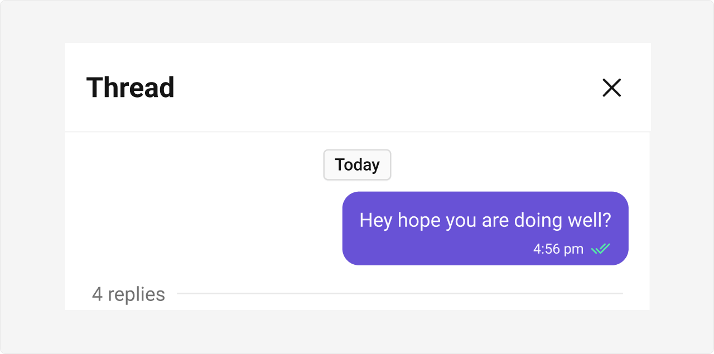
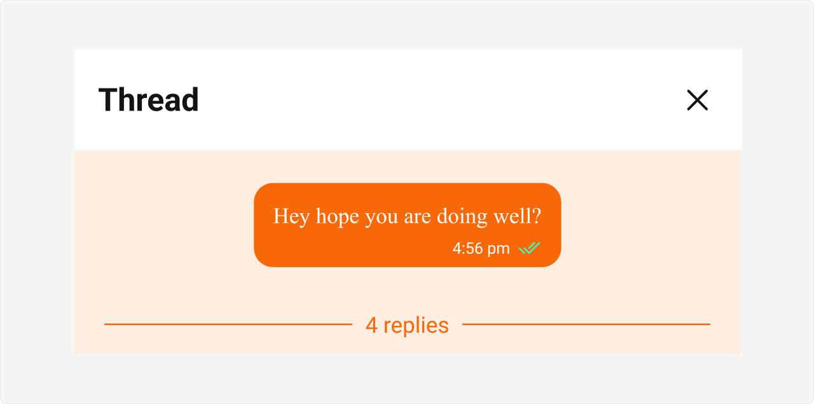

import Tabs from '@theme/Tabs';
import TabItem from '@theme/TabItem';

## Overview

CometChatThreadedMessagePreview is a Component that displays the parent message & number of replies of thread.



## Usage

### Integration

The following code snippet illustrates how you can directly incorporate the CometChatThreadedMessagePreview component into your Application.

<Tabs>
<TabItem value="ThreadedMessagePreviewDemo" label="ThreadedMessagePreviewDemo.tsx">

```tsx
import React from "react";
import { CometChatThreadedMessagePreview } from "@cometchat/chat-uikit-react";
import { CometChat } from "@cometchat/chat-sdk-javascript";

export function ThreadedMessagePreviewDemo() {
  const [parentMessage, setParentMessage] =
    React.useState<CometChat.BaseMessage>();
  const [chatWithUser, setChatWithUser] = React.useState<CometChat.User>();

  React.useEffect(() => {
    CometChat.getUser("uid").then((user) => {
      setChatWithUser(user);
    });
    CometChat.getMessageDetails("Parent Message Id").then((message) => {
      setParentMessage(message);
    });
  }, []);

  return chatWithUser && parentMessage ? (
    <CometChatThreadedMessagePreview parentMessage={parentMessage} />
  ) : null;
}
```

</TabItem>
<TabItem value="App" label="App.tsx">

```tsx
import { ThreadedMessagePreviewDemo } from "./ThreadedMessagePreviewDemo";

export default function App() {
  return (
    <div className="App">
      <div>
        <ThreadedMessagePreviewDemo />
      </div>
    </div>
  );
}
```

</TabItem>

</Tabs>

---

### Actions

[Actions](components-overview#actions) dictate how a component functions. They are divided into two types: Predefined and User-defined. You can override either type, allowing you to tailor the behavior of the component to fit your specific needs.

**Example**

In this example, we are overriding the `onClose` of the ThreadedMesssage Component.

<Tabs>
<TabItem value="ThreadedMessagePreviewDemo" label="ThreadedMessagePreviewDemo.tsx">

```tsx
import React from "react";
import { CometChatThreadedMessagePreview } from "@cometchat/chat-uikit-react";
import { CometChat } from "@cometchat/chat-sdk-javascript";

export function ThreadedMessagePreviewDemo() {
  const [parentMessage, setParentMessage] =
    React.useState<CometChat.BaseMessage>();
  const [chatWithUser, setChatWithUser] = React.useState<CometChat.User>();

  React.useEffect(() => {
    CometChat.getUser("uid").then((user) => {
      setChatWithUser(user);
    });
    CometChat.getMessageDetails("Parent Message Id").then((message) => {
      setParentMessage(message);
    });
  }, []);

  const handleClose = () => {
    console.log("your custom on close action");
  };

  return chatWithUser && parentMessage ? (
    <CometChatThreadedMessagePreview
      parentMessage={parentMessage}
      onClose={handleClose}
    />
  ) : null;
}
```

</TabItem>
</Tabs>

---

### Events

[Events](components-overview#events) are emitted by a `Component`. By using event you can extend existing functionality. Being global events, they can be applied in Multiple Locations and are capable of being Added or Removed.

The ThreadedMessagePreview Component does not emit any events of its own.

---

## Customization

To fit your app's design requirements, you can customize the appearance of the conversation component. We provide exposed methods that allow you to modify the experience and behavior according to your specific needs.

---

### Style

Using Style you can customize the look and feel of the component in your app, These parameters typically control elements such as the color, size, shape, and fonts used within the component.

**Example**



<Tabs>
<TabItem value="ThreadedMessagePreviewDemo" label="ThreadedMessagePreviewDemo.tsx">

```tsx
import React from "react";
import { CometChatThreadedMessagePreview } from "@cometchat/chat-uikit-react";
import { CometChat } from "@cometchat/chat-sdk-javascript";

export function ThreadedMessagePreviewDemo() {
  const [parentMessage, setParentMessage] =
    React.useState<CometChat.BaseMessage>();
  const [chatWithUser, setChatWithUser] = React.useState<CometChat.User>();

  React.useEffect(() => {
    CometChat.getUser("uid").then((user) => {
      setChatWithUser(user);
    });
    CometChat.getMessageDetails("Parent Message Id").then((message) => {
      setParentMessage(message);
    });
  }, []);

  return chatWithUser && parentMessage ? (
    <CometChatThreadedMessagePreview parentMessage={parentMessage} />
  ) : null;
}
```

</TabItem>

<TabItem value="ThreadedMessagePreviewDemo.css" label="ThreadedMessagePreviewDemo.css">

```css
.cometchat .cometchat-threaded-message-preview {
  background-color: #edeafa;
}

.cometchat .cometchat-threaded-message-preview__footer-reply-count {
  color: #6852d6;
}

.cometchat .cometchat-threaded-message-preview__footer-divider {
  color: #6852d6;
}
```

</TabItem>
</Tabs>

---

### Functionality

These are a set of small functional customizations that allow you to fine-tune the overall experience of the component. With these, you can change text, set custom icons, and toggle the visibility of UI elements.

<Tabs>
<TabItem value="ThreadedMessagePreviewDemo" label="ThreadedMessagePreviewDemo.tsx">

```tsx
import React from "react";
import { CometChatThreadedMessagePreview } from "@cometchat/chat-uikit-react";
import { CometChat } from "@cometchat/chat-sdk-javascript";

const messageBubbleView = () => {
  return <div>your custom bubble view</div>;
};

export function ThreadedMessagePreviewDemo() {
  const [parentMessage, setParentMessage] =
    React.useState<CometChat.BaseMessage>();
  const [chatWithUser, setChatWithUser] = React.useState<CometChat.User>();

  React.useEffect(() => {
    CometChat.getUser("uid").then((user) => {
      setChatWithUser(user);
    });

    CometChat.getMessageDetails("Parent Message Id").then((message) => {
      setParentMessage(message);
    });
  }, []);

  return chatWithUser && parentMessage ? (
    <CometChatThreadedMessagePreview
      parentMessage={parentMessage}
      messageBubbleView={messageBubbleView}
    />
  ) : null;
}
```

</TabItem>
</Tabs>

Below is a list of customizations along with corresponding code snippets

| Property | Description | Code |
| -------- | ----------- | ---- |
| **Hide Date**                    | Hides the visibility of the date header.                             | `hideDate={true}`                                                                 |
| **Hide Reply Count**             | Hides the visibility of the reply count.                             | `hideReplyCount={true}`                                                           |
| **Parent Message**               | Represents the parent message for displaying threaded conversations. | `parentMessage={message}`                                                         |
| [**Template**](message-template) | Template for customizing the appearance of the message.              | `template={"PASS_CUSTOM_MESSAGE_TEMPLATE"}`                                       |
| **Message Bubble View**          | A custom view for rendering the message bubble.                      | `messageBubbleView={(message: CometChat.BaseMessage) => <>Custom Bubble View</>}` |
| **On Error**                     | Callback function triggered when an error occurs.                    | `onError={(error: CometChat.CometChatException) => console.log(error)}`           |