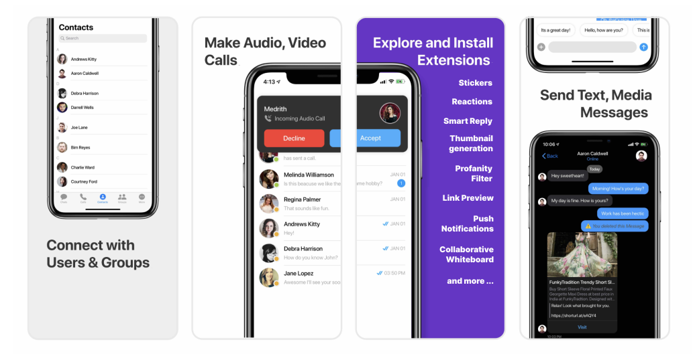

import Tabs from '@theme/Tabs';
import TabItem from '@theme/TabItem';

The CometChat React Native UI Kit is developed to keep developers in mind and aims to reduce development efforts significantly.



The UI Kit’s customizable UI components simplify the process of integrating text chat and voice/video calling features to your website or mobile application in a few minutes.


<div style={{display: 'flex', boxShadow: '0 0 4px 0 rgb(0 0 0 / 18%)', borderRadius: '3px'}}>
  <div style={{padding: '24px'}}>
    <h4 style={{fontWeight: 'bold'}}>**I want to checkout React Native Chat UI Kit.**</h4>
    <p>Follow the steps mentioned in the <code>README.md</code> file.</p>
    <p>Kindly, click on below button to download our React Native Chat UI Kit..</p>
    <p><a style={{display: 'inline-block', backgroundColor: '#7c55c9', padding: '8px', textAlign: 'center', textTransform: 'uppercase', border: '1px solid #e3e5e7', borderRadius: '3px', color: 'white', width: '100%', marginBottom: '8px'}} href="https://github.com/cometchat-pro/ui-kit/react-native/archive/master.zip">React Native Chat UI Kit</a></p>
    <p><a style={{display: 'inline-block', backgroundColor: '#7c55c9', padding: '8px', textAlign: 'center', textTransform: 'uppercase', border: '1px solid #e3e5e7', borderRadius: '3px', color: 'white', width: '100%'}} href="https://github.com/cometchat-pro/ui-kit/react-native" target="_blank">View on Github</a></p>
  </div>
  <div style={{padding: '24px', borderLeft: '1px solid #e3e5e7', justifySelf: 'flex-end'}}>
    <h4 style={{fontWeight: 'bold'}}>**I want to explore the sample app**</h4>
    <p>Kindly, click on below button to download our React Native Chat Sample App.</p>
    <a style={{display: 'inline-block', backgroundColor: '#7c55c9', padding: '8px', textAlign: 'center', textTransform: 'uppercase', border: '1px solid #e3e5e7', borderRadius: '3px', color: 'white', width: '100%', marginBottom: '8px'}} href="https://github.com/cometchat-pro/react-native-chat-app/archive/master.zip">React Native Sample App</a>
    <a style={{display: 'inline-block', backgroundColor: '#7c55c9', padding: '8px', textAlign: 'center', textTransform: 'uppercase', border: '1px solid #e3e5e7', borderRadius: '3px', color: 'white', width: '100%'}} href="https://github.com/cometchat-pro/react-native-chat-app" target="_blank">View on Github</a>
  </div>
</div>


## Prerequisites

 Before you begin, ensure you have met the following requirements:

1. A text editor. (e.g. Visual Studio Code, Notepad++, Sublime Text, Atom, or VIM)
2. [Node](https://nodejs.org/en/)
3. [npm](https://www.npmjs.com/get-npm)
4. [React-Native](https://reactnative.dev/docs/environment-setup)

## Installing React Native UI Kit

### Setup

1. Register on CometChat
    - To install React Native UI Kit, you need to first register on the CometChat Dashboard. Click [here](https://app.cometchat.com/) to Sign Up.

2. Get your application keys
    - Create a new app.
    - Head over to the QuickStart or API & Auth Keys section and note the App ID, Auth Key, and Region.

3. Add the CometChat dependency

<Tabs>
<TabItem value="js" label="CLI">

```cli
npm install @cometchat-pro/react-native-chat@2.4.0 --save
```

</TabItem>
</Tabs>


Other required dependencies
These packages help make the ui-kit smooth and functioning

```none
react-native-sound
react-native-vector-icons 
react-native-elements 
react-native-fast-image
react-native-image-picker
react-native-document-picker
react-native-gesture-handler
react-native-reanimated
reanimated-bottom-sheet
react-native-video
react-native-video-controls
@react-navigation_bottom-tabs
@react-navigation_native
@react-navigation_stack
@react-native-picker_picker
react-native-async-storage_async-storage
@cometchat-pro_react-native-calls
rn-fetch-blob
react-native-autolink
react-native-screens
emoji-mart-native
react-native-keep-awake
react-native-safe-area-context
react-native-webview
react-native-swipe-list-view
```


### Configure CometChat inside your app

- Initialize CometChat 🌟 

The init() method initializes the settings required for CometChat. We suggest calling the init() method on app startup, preferably in the created() method of the Application class.

<Tabs>
<TabItem value="js" label="Javascript">

```Javascript
import {CometChat} from '@cometchat-pro/react-native-chat';

const appID = 'APP_ID';
const region = 'REGION';
const appSetting = new CometChat.AppSettingsBuilder()
  .subscribePresenceForAllUsers()
  .setRegion(region)
  .build();
CometChat.init(appID, appSetting).then(
  () => {
    console.log('Initialization completed successfully');
    // You can now call login function.
  },
  (error) => {
    console.log('Initialization failed with error:', error);
    // Check the reason for error and take appropriate action.
  },
);
```

</TabItem>
</Tabs>


:::info Note

Replace APP_ID and REGION with your CometChat App ID and Region in the above code

:::


- Login your user 👤 

This method takes UID and Auth Key as input parameters and returns the User object containing all the information of the logged-in user.

<Tabs>
<TabItem value="js" label="Javascript">

```Javascript
import {CometChat} from '@cometchat-pro/react-native-chat';

const authKey = 'AUTH_KEY';
const uid = 'cometchat-uid-1';

CometChat.login(uid, authKey).then(
  (user) => {
    console.log('Login Successful:', { user });
  },
  (error) => {
    console.log('Login failed with exception:', { error });
  },
);
```

</TabItem>
</Tabs>


:::warning Note

Replace AUTH_KEY with your CometChat Auth Key in the above code.

:::

:::info Note

We have set up 5 users for testing having UIDs: cometchat-uid-1, cometchat-uid-2, cometchat-uid-3, cometchat-uid-4, and cometchat-uid-5.

We have used uid cometchat-uid-1 as an example here. You can create a User from CometChat Dashboard as well.

:::

### Add UI Kit to your project

- Clone this repository.

<Tabs>
<TabItem value="js" label="CLI">

```CLI
https://github.com/cometchat-pro/cometchat-pro-react-native-ui-kit.git
```

</TabItem>
</Tabs>


- Copy the `cometchat-pro-react-native-ui-kit` folder to your source folder.
- Copy all the peer dependencies from package.json into your project's package.json and install them using npm install

### Launch CometChat

CometChatUI is an option to launch a fully functional chat application using the UI Kit. In CometChatUI all the UI Components are interlinked and work together to launch a fully functional chat on your website/application.


<Tabs>
<TabItem value="js" label="Javascript">

```Javascript
import React from 'react';
import {View} from 'react-native';
import {CometChatUI} from '../cometchat-pro-react-native-ui-kit';

export default function CometChatUIView() {
  return (
    <View style={{flex: 1}}>
      <CometChatUI />
    </View>
  );
}
```

</TabItem>
</Tabs>


## Checkout our sample app

Visit our [React Native App repo](https://github.com/cometchat-pro/react-native-chat-app) to run the React Native sample app.