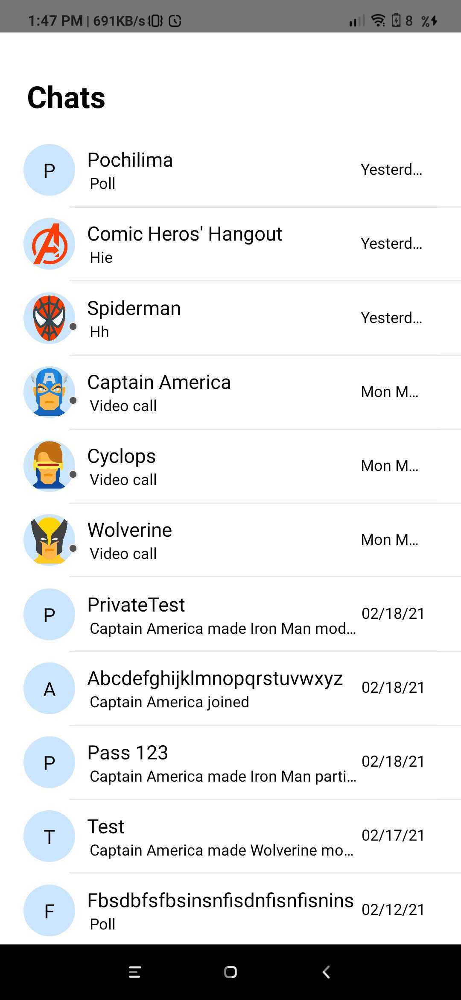
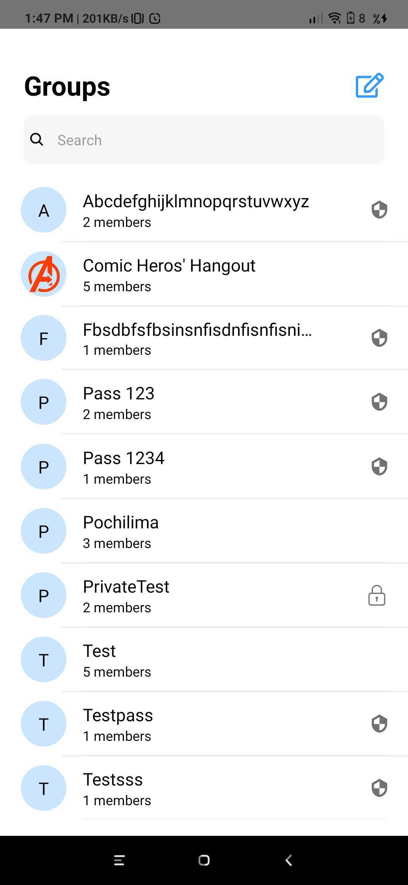
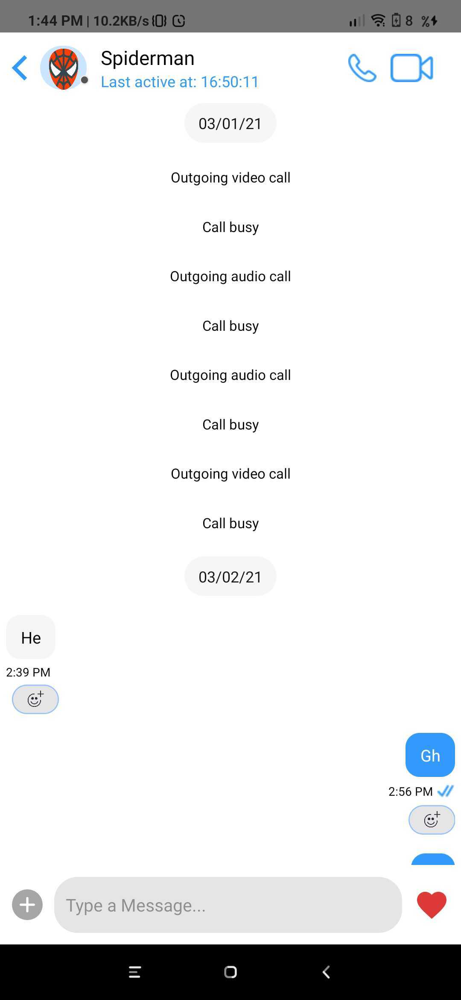
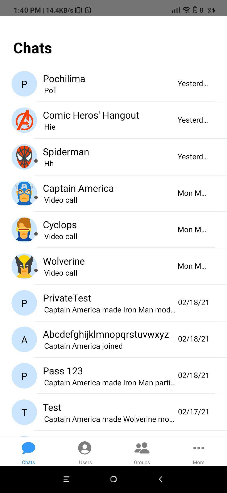
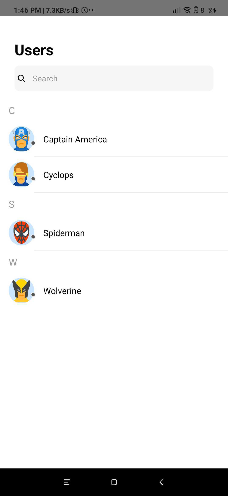
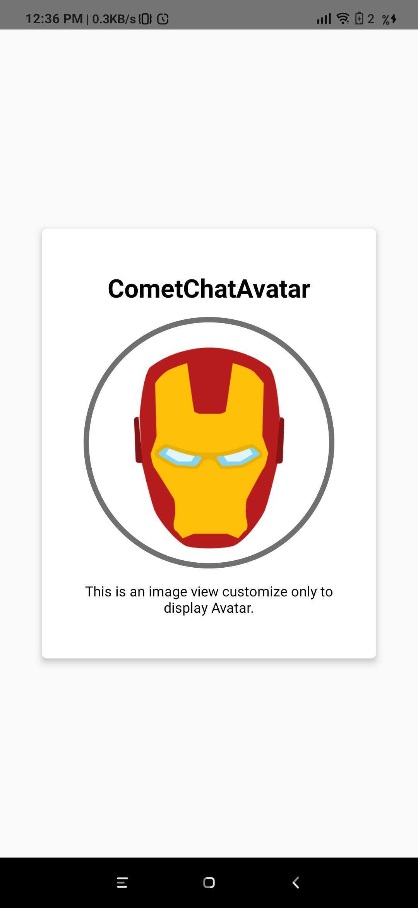
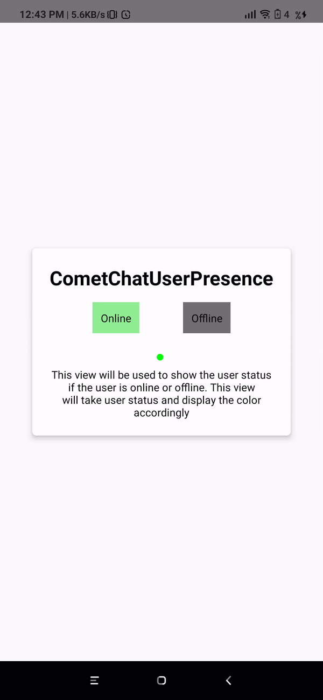
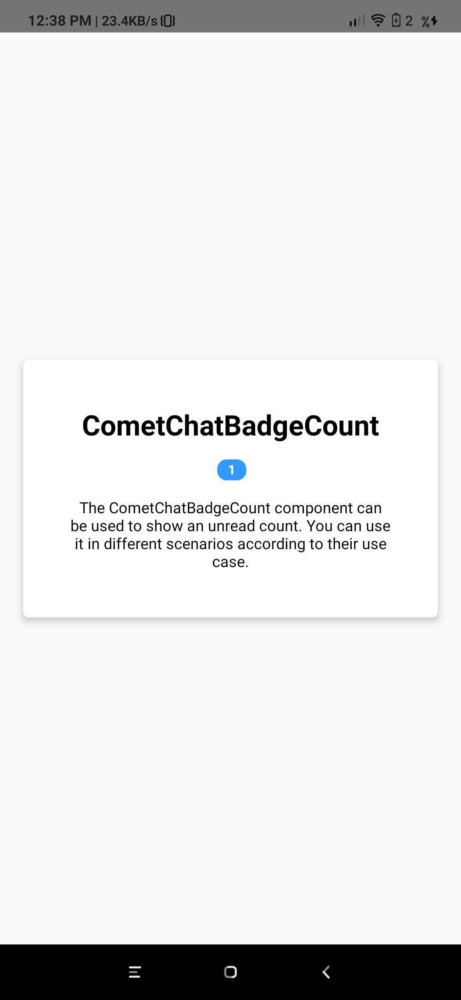

import Tabs from '@theme/Tabs';
import TabItem from '@theme/TabItem';

**UI Components** are building blocks of the UI Kit. **UI Components** are a set of custom classes specially designed to build a rich chat app. There are different UI Components available in the
UI Kit Library.

### CometChatUI

**CometChatUI** is an option to launch a fully functional chat application using the UI Kit. In **CometChatUI**  all the **UI Components** are interlinked and work together to launch a fully functional chat on your application.


<Tabs>
<TabItem value="js" label="Javascript">

```Javascript
import React from 'react';
import {View, Text} from 'react-native';
import {CometChatUI} from '../cometchat-pro-react-native-ui-kit';

export default function CometChatUIView() {
  return (
    <View style={{flex: 1}}>
      <CometChatUI />
    </View>
  );
}
```

</TabItem>
</Tabs>


### CometChatUserListWithMessages

 The `CometChatUserListWithMessages` is a component with a list of users. The component has all the necessary listeners and methods required to display the user's list and shows the set of the messages/chats of the selected user




<Tabs>
<TabItem value="js" label="Javascript">

```Javascript
import { CometChatUserListWithMessages } from '../cometchat-pro-react-native-ui-kit';

function StackNavigator(props) {
  const Stack = createStackNavigator();

  return (
    <NavigationContainer>
      <Stack.Navigator
        headerMode="none"
        initialRouteName={"UserListWithMessages"}>
          <Stack.Screen name="UserListWithMessages" component={CometChatUserListWithMessages} />
      </Stack.Navigator>
    </NavigationContainer>
  );
}
```

</TabItem>
</Tabs>


If you want to use this as a child component, then use the below code.

<Tabs>
<TabItem value="js" label="Javascript">

```Javascript
import React from 'react';
import {View} from 'react-native';
import {CometChatUserListWithMessages} from '../cometchat-pro-react-native-ui-kit';

export default function CometChatUserListWithMessagesView({navigation}) {
  return (
    <View style={{flex: 1}}>
      <CometChatUserListWithMessages navigation={navigation}/>
    </View>
  );
}
```

</TabItem>
</Tabs>


### CometChatGroupListWithMessages

 The `CometChatGroupWithMessages` is a component with a list of groups. The component has all the necessary listeners and methods required to display the group's list and shows the set of the messages/chats of the selected group




<Tabs>
<TabItem value="js" label="Javascript">

```Javascript
import { CometChatGroupListWithMessages } from '../cometchat-pro-react-native-ui-kit';

function StackNavigator(props) {
  const Stack = createStackNavigator();

  return (
    <NavigationContainer>
      <Stack.Navigator
        headerMode="none"
        initialRouteName={"GroupListWithMessages"}>
          <Stack.Screen name="GroupListWithMessages" component={CometChatGroupListWithMessages} />
      </Stack.Navigator>
    </NavigationContainer>
  );
}
```

</TabItem>
</Tabs>


If you want to use this as a child component, then use the below code.

<Tabs>
<TabItem value="js" label="Javascript">

```Javascript
import React from 'react';
import {View, Text} from 'react-native';
import {CometChatGroupListWithMessages} from '../cometchat-pro-react-native-ui-kit';

export default function CometChatGroupListWithMessagesView({navigation}) {
  return (
    <View style={{flex: 1}}>
      <CometChatGroupListWithMessages navigation={navigation} />
    </View>
  );
}
```

</TabItem>
</Tabs>


### CometChatMessages

 The `CometChatMessages` is a component with a list of messages/chats and shows the message component header and message composer.



<Tabs>
<TabItem value="js" label="Javascript">

```Javascript
import React, {useEffect, useState} from 'react';
import {View} from 'react-native';
import {CometChat} from '@cometchat-pro/react-native-chat';
import {CometChatMessages} from '../cometchat-pro-react-native-ui-kit';

export default function CometChatMessagesView({navigation}) {
  const [localUser, setLocalUser] = useState(null);
  useEffect(() => {
    var user = CometChat.getLoggedinUser().then(
      (user) => {
        console.log('user details:', {user});
        setLocalUser(user);
      },
      (error) => {
        console.log('error getting details:', {error});
      },
    );
  }, []);
  return (
    <View style={{flex: 1}}>
      {localUser ? (
        <CometChatMessages
          type={'user'}
          item={userOrGroupObject}//The object will be of user or group depending on type
          loggedInUser={localUser}
          actionGenerated={(actionType) => {
            console.log(actionType);
          }}
        />
      ) : null}
    </View>
  );
}
```

</TabItem>
</Tabs>


| Parameter | Description | Type | 
| ---- | ---- | ---- | 
| type | Value should be _string_.<br/>defines the type of chat. Its value can be _user_ or "group". | Optional | 
| item | Value should be _Object_.<br/>The object will be of user or group depending on type.<br/>This is an example object for user<br/>\{<br/>            hasBlockedMe: false,<br/>            blockedByMe: false,<br/>            uid: 'cometchat-uid-3',<br/>            name: 'Nancy Grace',<br/>            avatar:<br/>              '[https://data-us.cometchat.io/assets/images/avatars/cometchat-uid-3.webp'](https://data-us.cometchat.io/assets/images/avatars/cometchat-uid-3.webp'),<br />            lastActiveAt: 1614597611,<br/>            role: 'default',<br/>            status: 'offline',<br/>} | Required | 
| loggedInUser | Value should be _Object_.<br/>This props takes  the details of current logged in user, | Required | 
| actionGenerated | Value should be _function_.<br/>Tis is a callback function called when user perform certain actions on screen. <br/>List of actionType are as follow:<br/>1)groupDeleted: This is called when user deletes the group.<br/>2) membersUpdated: This is called when members of group are updated.<br/>3)messageRead : This is called when last message is read.<br/>4)messageComposed:  is called when new message is composed.<br/>5)messageDeleted: This is called when message is been deleted.<br/>6)viewActualImage: This is called when user clicks on Image.<br/>7)menuClicked: This is called when the menu in header has been clicked.<br/>8)threadMessageComposed: This is called when new thread message has been composed<br/>9)blockUser: This is called when user is blocked<br/>10)updateThreadMessage: This is called when thread message is updated.<br/>11)messageEdited: This is called when a message is edited.<br/>12)groupUpdated: This is called when a group property has been updated. | Required | 


### CometChatConversationListWithMessages

The `CometChatConversationListWithMessages` is a component with a list of recent conversations. The component has all the necessary listeners and methods required to display the recent conversation list and shows the set of the messages/chats of the selected recent conversation




<Tabs>
<TabItem value="js" label="Javascript">

```Javascript
import { CometChatConversationListWithMessages } from '../cometchat-pro-react-native-ui-kit';

function StackNavigator(props) {
  const Stack = createStackNavigator();

  return (
    <NavigationContainer>
      <Stack.Navigator
        headerMode="none"
        initialRouteName={"ConversationListWithMessages"}>
          <Stack.Screen name="ConversationListWithMessages" component={CometChatConversationListWithMessages} />
      </Stack.Navigator>
    </NavigationContainer>
  );
}
```

</TabItem>
</Tabs>


If you want to use this as a child component, then use the below code.

<Tabs>
<TabItem value="js" label="Javascript">

```Javascript
import React from 'react';
import {View, Text} from 'react-native';
import {CometChatConversationListWithMessages} from '../cometchat-pro-react-native-ui-kit';

export default function CometChatConversationListWithMessagesView({
  navigation,
}) {
  return (
    <View style={{flex: 1}}>
      <CometChatConversationListWithMessages navigation={navigation} />
    </View>
  );
}
```

</TabItem>
</Tabs>


### CometChatUserList

The `CometChatUserList` is a component that displays the list of users available to chat. You can use this component within your app if you wish to display the list of users.




<Tabs>
<TabItem value="js" label="Javascript">

```Javascript
import React from 'react';
import {View, Text} from 'react-native';
import {CometChatUserList} from '../cometchat-pro-react-native-ui-kit';

export default function CometChatUserListView({navigation}) {
  return (
    <View style={{flex: 1}}>
      <CometChatUserList
        friendsOnly={true}
        onItemClick={(item) => {
          console.log(item);
        }}
        navigation={navigation}
      />
    </View>
  );
}
```


</TabItem>
</Tabs>


| Parameter | Description | Type | 
| ---- | ---- | ---- | 
| friendsOnly | Value could be _Object_  or _Number_<br/>This property when set to true will return only the friends of the logged-in user<br/><br />Default value is _false_ | Optional | 
| onItemClick | Value should be _function_<br/>This is a callback called when a user is clicked on user list | Optional | 
| navigation | Value should be _Object_. <br/>Pass the navigation object, if you want to refresh list on focus | Optional | 


### CometChatGroupList

The `CometChatGroupList` is a component that displays the list of groups available. You can use this component within your app if you wish to display the list of groups.


<Tabs>
<TabItem value="js" label="Javascript">

```Javascript
import { CometChatGroupList } from '../cometchat-pro-react-native-ui-kit';

function StackNavigator(props) {
  const Stack = createStackNavigator();

  return (
    <NavigationContainer>
      <Stack.Navigator
        headerMode="none"
        initialRouteName={"GroupList"}>
          <Stack.Screen name="GroupList" component={CometChatGroupList} />
      </Stack.Navigator>
    </NavigationContainer>
  );
}
```

</TabItem>
</Tabs>


If you want to use this as a child component, then use the below code.

<Tabs>
<TabItem value="js" label="Javascript">

```Javascript
import React from 'react';
import {View} from 'react-native';
import {CometChatGroupList} from '../cometchat-pro-react-native-ui-kit';

export default function CometChatGroupListView({navigation}) {
  return (
    <View style={{flex: 1}}>
      <CometChatGroupList navigation={navigation} />
    </View>
  );
}
```

</TabItem>
</Tabs>


### CometChatConversationList

You can use the `CometChatConversationList` component to display the list of recent conversations that the logged-in user was a part of.


<Tabs>
<TabItem value="js" label="Javascript">

```Javascript
import { CometChatConversationList } from '../cometchat-pro-react-native-ui-kit';

function StackNavigator(props) {
  const Stack = createStackNavigator();

  return (
    <NavigationContainer>
      <Stack.Navigator
        headerMode="none"
        initialRouteName={"ConversationList"}>
          <Stack.Screen name="ConversationList" component={CometChatConversationList} />
      </Stack.Navigator>
    </NavigationContainer>
  );
}
```

</TabItem>
</Tabs>


If you want to use this as a child component, then use the below code.

<Tabs>
<TabItem value="js" label="Javascript">

```Javascript
import React from 'react';
import {View} from 'react-native';
import {CometChatConversationList} from '../cometchat-pro-react-native-ui-kit';

export default function CometChatConversationListView({navigation}) {
  return (
    <View style={{flex: 1}}>
      <CometChatConversationList navigation={navigation} />
    </View>
  );
}
```

</TabItem>
</Tabs>


### CometChatAvatar

This is an image view customize only to display Avatar.




<Tabs>
<TabItem value="js" label="Javascript">

```Javascript
import React from 'react';
import {View, Text} from 'react-native';
import {CometChatAvatar} from '../cometchat-pro-react-native-ui-kit';
export default function AvatarView({user}) {
  return (
    <View style={{flex: 1, justifyContent: 'center'}}>
      <View
        style={{
          margin: '10%',
          elevation: 5,
          backgroundColor: '#fff',
          padding: '10%',
          alignItems: 'center',
          borderRadius: 5,
        }}>
        <Text style={{fontWeight: 'bold', fontSize: 26, marginBottom: '5%'}}>
          CometChatAvatar
        </Text>
        <CometChatAvatar
          image={{uri: user.avatar}}
          borderWidth={5}
          cornerRadius={1000}
          borderColor={'#707070'}
          textColor={'#000'}
        />
        <Text style={{marginTop: '5%', textAlign: 'center'}}>
          This is an image view customize only to display Avatar.
        </Text>
      </View>
    </View>
  );
}
```

</TabItem>
</Tabs>


| Parameter | Description | Type | 
| ---- | ---- | ---- | 
| image | Value could be _Object_  or _Number_<br/>This property sets the source of avatar image. | Optional | 
| name | Value should be _String_ <br/>This property sets the user name in avatar. | Optional | 
| borderWidth | Value should be _Number_.<br/>This property sets the width of the component's four borders.<br/>Default value is _1_ | Optional | 
| cornerRadius | Value should be _Number_. <br/>This property sets border radius of the component.<br/>Default value is _1000_. | Optional | 
| textColor | Value should be _Color_.<br/>This property sets the text color of component.<br/>Default value is *black * | Optional | 


### CometChatUserPresence

This component will be used to show the user's online or offline status. This component will show the color based on the user's status.



<Tabs>
<TabItem value="js" label="Javascript">

```Javascript
import React, {useState} from 'react';
import {View, Text, TouchableOpacity} from 'react-native';
import {CometChatUserPresence} from '../cometchat-pro-react-native-ui-kit';
export default function CometChatUserPresenceView({user}) {
  const [status, setStatus] = useState(user.status);
  return (
    <View style={{flex: 1, justifyContent: 'center'}}>
      <View
        style={{
          margin: '10%',
          elevation: 5,
          backgroundColor: '#fff',
          padding: '5%',
          alignItems: 'center',
          borderRadius: 5,
        }}>
        <Text style={{fontWeight: 'bold', fontSize: 26, marginBottom: '5%'}}>
          CometChatUserPresence
        </Text>

        <View
          style={{
            flexDirection: 'row',
            justifyContent: 'space-evenly',
            width: '100%',
          }}>
          <TouchableOpacity
            onPress={() => setStatus('online')}
            style={{
              justifyContent: 'center',
              alignItems: 'center',
              padding: 10,
              backgroundColor: 'lightgreen',
            }}>
            <Text>Online</Text>
          </TouchableOpacity>
          <TouchableOpacity
            onPress={() => setStatus('')}
            style={{
              justifyContent: 'center',
              alignItems: 'center',
              padding: 10,
              backgroundColor: '#707070',
            }}>
            <Text>Offline</Text>
          </TouchableOpacity>
        </View>
        <View style={{position: 'relative'}}>
          <CometChatUserPresence
            status={status}
            borderWidth={0.5}
            borderColor={'red'}
            cornerRadius={0}
          />
        </View>
        <Text style={{marginTop: '15%', textAlign: 'center'}}>
          This view will be used to show the user status if the user is online
          or offline. This view will take user status and display the color
          accordingly
        </Text>
      </View>
    </View>
  );
}
```

</TabItem>
</Tabs>


| Parameter | Description | Type | 
| ---- | ---- | ---- | 
| borderWidth | Value should be _Number_ <br/>This property sets the width of the component's four borders<br/>Default value is _1_ | Optional | 
| borderColor | Value should be _Color_ <br/>This property sets the border colour of the component.<br/>Default value is *#AAA * | Optional | 
| cornerRadius | Value should be _Number_. <br/>This property sets border radius of the component  Default value is _4.5_ | Optional | 
| status | Value should be _String_<br/>Takes the status of _user_ | Optional | 


### CometChatBadgeCount

The CometChatBadgeCount component can be used to show an unread count. You can use it in different scenarios according to their use case.




<Tabs>
<TabItem value="js" label="Javascript">

```Javascript
import React from 'react';
import {View, Text} from 'react-native';
import {CometChatBadgeCount} from '../cometchat-pro-react-native-ui-kit';
export default function CometChatBadgeCountView() {
  return (
    <View style={{flex: 1, justifyContent: 'center'}}>
      <View
        style={{
          margin: '5%',
          elevation: 5,
          backgroundColor: '#fff',
          padding: '10%',
          alignItems: 'center',
          borderRadius: 5,
        }}>
        <Text style={{fontWeight: 'bold', fontSize: 26, marginBottom: '5%'}}>
          CometChatBadgeCount
        </Text>
        <View>
          <CometChatBadgeCount count={1} />
        </View>
        <Text style={{marginTop: '5%', textAlign: 'center'}}>
          The CometChatBadgeCount component can be used to show an unread count.
          You can use it in different scenarios according to their use case.
        </Text>
      </View>
    </View>
  );
}
```

</TabItem>
</Tabs>


| Parameter | Description | Type | 
| ---- | ---- | ---- | 
| count | Value should be _String_. <br/>This property sets the count on the badge | Optional | 
