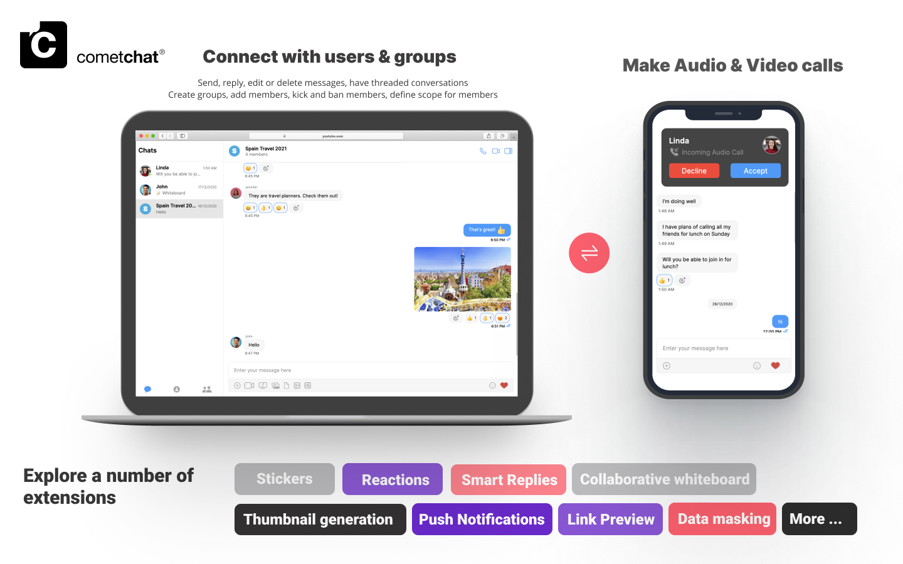
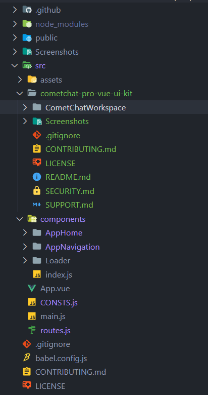
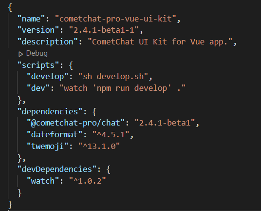

import Tabs from '@theme/Tabs';
import TabItem from '@theme/TabItem';

The CometChat Vue UI Kit is developed to keep developers in mind and aims to reduce development efforts significantly.




The UI Kit’s customizable UI components simplify the process of integrating text chat and voice/video calling features to your website or mobile application in a few minutes.

<div style={{display: 'flex', boxShadow: '0 0 4px 0 rgb(0 0 0 / 18%)', borderRadius: '3px'}}>
  <div style={{padding: '24px'}}>
  	<h4 style={{fontWeight: 'bold'}}>I want to checkout Vue UI Kit</h4>
    <p>Follow the steps mentioned in the <code>README.md</code> file.</p>
    <p>Kindly, click on below button to download our Vue UI Kit.</p>
    <a style={{display: 'inline-block', backgroundColor: '#7c55c9', padding: '8px', textAlign: 'center', textTransform: 'uppercase', border: '1px solid #e3e5e7', borderRadius: '3px', color: 'white', width: '100%', marginBottom: '8px'}} href="https://github.com/cometchat-pro/cometchat-pro-vue-ui-kit/archive/v2.zip">Vue UI Kit</a>
		<a style={{display: 'inline-block', backgroundColor: '#7c55c9', padding: '8px', textAlign: 'center', textTransform: 'uppercase', border: '1px solid #e3e5e7', borderRadius: '3px', color: 'white', width: '100%'}} href="https://github.com/cometchat-pro/cometchat-pro-vue-ui-kit/tree/v2" target="_blank">View on Github</a>
  </div>
  <div style={{padding: '24px', borderLeft: '1px solid #e3e5e7'}}>
  	<h4 style={{fontWeight: 'bold'}}>I want to explore the sample app</h4>
    <p>Kindly, click on below button to download our Vue Sample App.</p>
    <a style={{display: 'inline-block', backgroundColor: '#7c55c9', padding: '8px', textAlign: 'center', textTransform: 'uppercase', border: '1px solid #e3e5e7', borderRadius: '3px', color: 'white', width: '100%', marginBottom: '8px'}} href="https://github.com/cometchat-pro/javascript-vue-chat-app/archive/v2.zip">Vue Sample App</a>
    <a style={{display: 'inline-block', backgroundColor: '#7c55c9', padding: '8px', textAlign: 'center', textTransform: 'uppercase', border: '1px solid #e3e5e7', borderRadius: '3px', color: 'white', width: '100%'}} href="https://github.com/cometchat-pro/javascript-vue-chat-app/tree/v2" target="_blank">View on Github</a>
  </div>
</div>

## Prerequisites

Before you begin, ensure you have met the following requirements:

1. A text editor. (e.g. Visual Studio Code, Notepad++, Sublime Text, Atom, or VIM)
2. [Node](https://nodejs.org/en/)
3. [npm](https://www.npmjs.com/get-npm)
4. [Vue](https://vuejs.org/)

For installing Vue 2

<Tabs>
<TabItem value="cli" label="CLI">

```cli
npm install vue@2.6.14
```

</TabItem>
</Tabs>


For installing Vue 3

<Tabs>
<TabItem value="cli" label="CLI">

```cli
npm install vue@3.2.11
```

</TabItem>
</Tabs>


## Installing Vue UI Kit

### Setup

1. Register on CometChat 🔧
   - To install Vue UI Kit, you need to first register on the CometChat Dashboard. Click here to Sign Up.

2. Get your application keys 🔑
   a. Create a new app.
   b. Head over to the QuickStart or API & Auth Keys section and note the App ID, Auth Key, and Region.

3. Add the CometChat dependency 📦

<Tabs>
<TabItem value="cli" label="CLI">

```cli
npm install @cometchat-pro/chat@2.4.1-beta1 --save
```

</TabItem>
</Tabs>


### Configure CometChat inside your app

- Import CometChat SDK

<Tabs>
<TabItem value="javascript" label="Javascript">

```js
import { CometChat } from "@cometchat-pro/chat";
```

</TabItem>
</Tabs>


- Initialize CometChat 🌟 

The init() method initializes the settings required for CometChat.
We suggest calling the init() method on app startup, preferably in the created() method of the Application class.

<Tabs>
<TabItem value="javascript" label="Javascript">

```js
const appID = "APP_ID";
const region = "REGION";
const appSetting = new CometChat.AppSettingsBuilder()
  .subscribePresenceForAllUsers()
  .setRegion(region)
  .build();

CometChat.init(appID, appSetting).then(
  () => {
    console.log("Initialization completed successfully");
    // You can now call login function.
  },
  error => {
    console.log("Initialization failed with error:", error);
    // Check the reason for error and take appropriate action.
  }
);
```

</TabItem>
</Tabs>


:::warning Note

Replace APP_ID and REGION with your CometChat App ID and Region in the above code

:::

- Create user

This method takes a `User` object and the `Auth Key` as input parameters and returns the created `User` object if the request is successful.

<Tabs>
<TabItem value="javascript" label="Javascript">

```javascript
let authKey = "AUTH_KEY";
var uid = "user1";
var name = "Kevin";

var user = new CometChat.User(uid);
user.setName(name);
CometChat.createUser(user, authKey).then(
    user => {
        console.log("user created", user);
    },error => {
        console.log("error", error);
    }
)
```

</TabItem>
</Tabs>


- Login your user 👤 

This method takes UID and Auth Key as input parameters and returns the User object containing all the information of the logged-in user.

<Tabs>
<TabItem value="javascript" label="Javascript">

```javascript
const authKey = "AUTH_KEY";
const uid = "cometchat-uid-1";

CometChat.login(uid, authKey).then(
  user => {
    console.log("Login Successful:", { user });    
  },
  error => {
    console.log("Login failed with exception:", { error });    
  }
);
```

</TabItem>
</Tabs>


:::warning Note

Replace AUTH_KEY with your CometChat Auth Key in the above code.

:::


:::info Note

We have set up 5 users for testing having UIDs: cometchat-uid-1, cometchat-uid-2, cometchat-uid-3, cometchat-uid-4, and cometchat-uid-5.

We have used uid cometchat-uid-1 as an example here. You can create a User from CometChat Dashboard as well.

:::

### Add UI Kit to your project

- Clone this repository.

<Tabs>
<TabItem value="cli" label="CLI">

```cli
git clone https://github.com/cometchat-pro/cometchat-pro-vue-ui-kit.git -b v2
```

</TabItem>
</Tabs>


- Copy the folder to your source folder.



- Copy all the dependencies from package.json of `cometchat-pro-vue-ui-kit` into your project's package.json and install them.
- We are using [emoji-mart-vue-fast](https://www.npmjs.com/package/emoji-mart-vue-fast) Please install respective library depending on your Vue version
- 
    - For Vue2 : `npm install emoji-mart-vue-fast@7.0.7`
    - For Vue3 : `npm install emoji-mart-vue-fast@8.0.3`



### Launch CometChat

Using the `CometChatUI` component from the UI Kit, you can launch a fully functional chat application.
In this component, all the UI Components are interlinked and work together to launch a fully functional chat on your website/application.


### Usage

<Tabs>
<TabItem value="vue" label="Vue">

```javascript
<template>
 <div id="app">
   <CometChatUI />
 </div>
</template>

<script>
 import { CometChatUI } from "./cometchat-pro-vue-ui-kit/CometChatWorkspace/src";
 export default {
   name: "App",
   components: {
     CometChatUI,
   }
 };
</script>
```

</TabItem>
</Tabs>


## Checkout our sample app

Visit our [Vue sample app](https://github.com/cometchat-pro/javascript-vue-chat-app/tree/v2)  repo to run the Vue sample app.