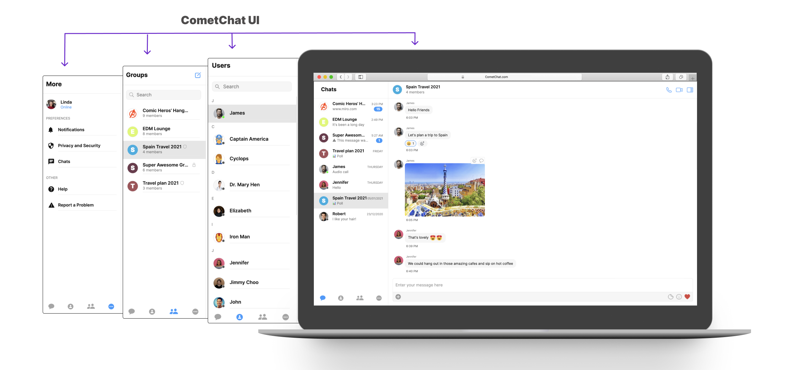
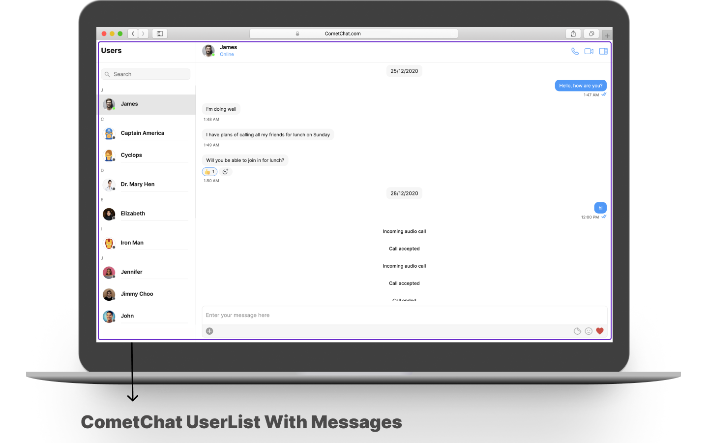
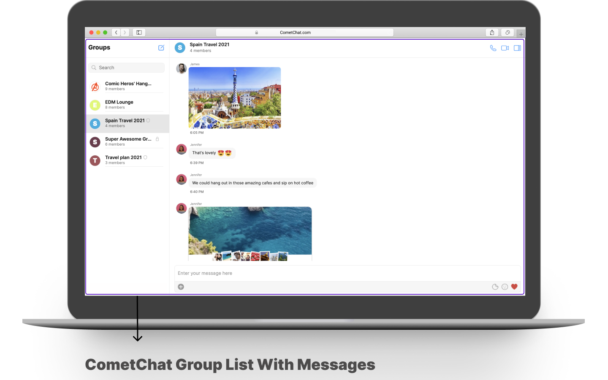
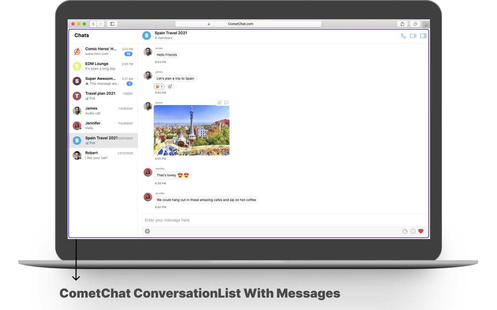
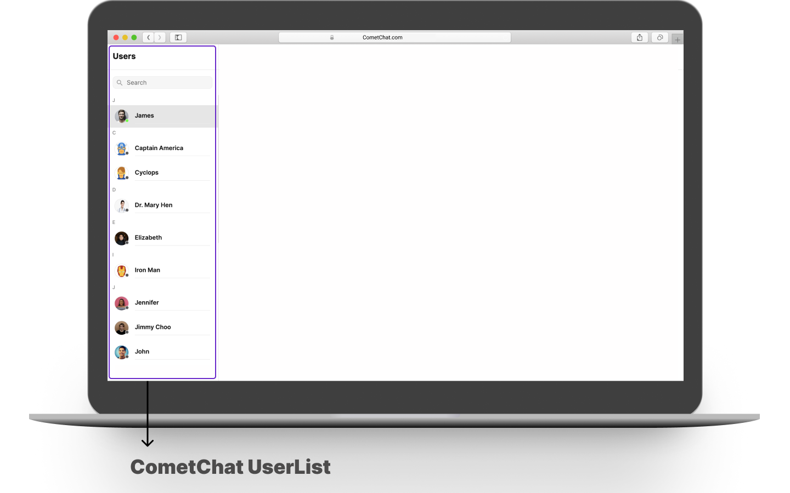
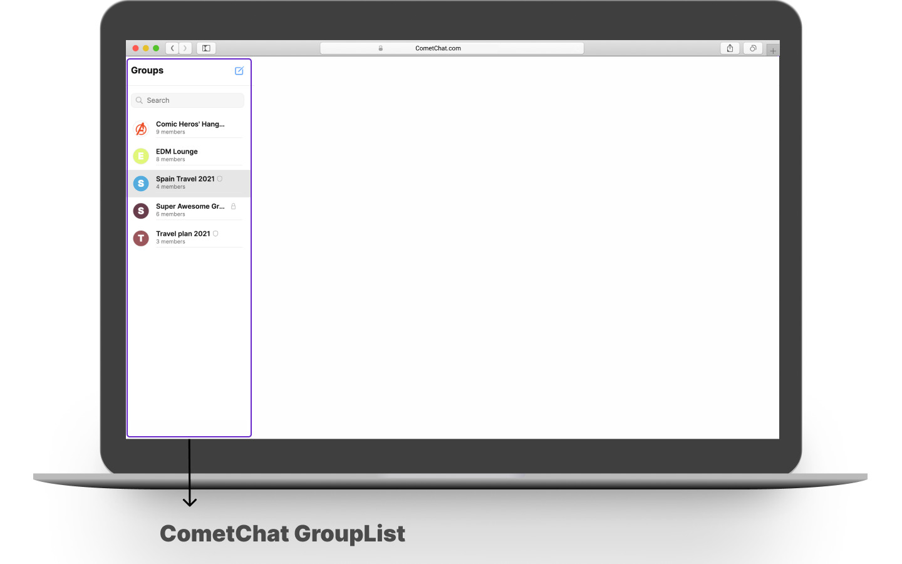
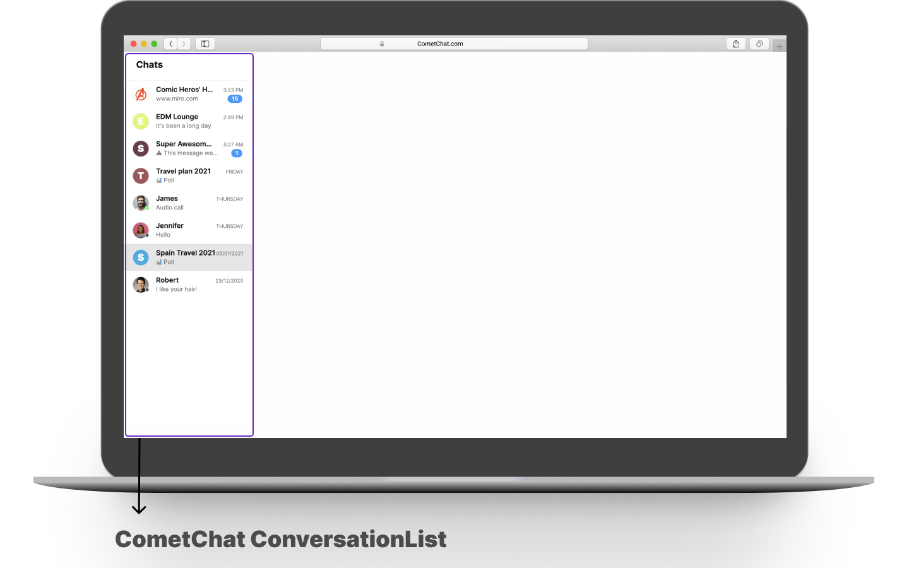

import Tabs from '@theme/Tabs';
import TabItem from '@theme/TabItem';

**UI Components** are building blocks of the UI Kit. **UI Components** are a set of custom classes specially designed to build a rich chat app. There are different UI Components available in the
UI Kit Library.

### CometChatUI

**CometChatUI** is an option to launch a fully functional chat application using the UI Kit. In **CometChatUI**  all the **UI Components** are interlinked and work together to launch a fully functional chat on your website/application



<Tabs>
<TabItem value="javascript" label="Vue">

```Javascript
<template>
 <div id="app">
   <CometChatUI />
 </div>
</template>

<script>
 import { CometChatUI } from "./cometchat-pro-vue-ui-kit/CometChatWorkspace/src";
 export default {
   name: "App",
   components: {
     CometChatUI,
   }
 };
</script>
```

</TabItem>
</Tabs>


### CometChatUserListWithMessages

The `CometChatUserListWithMessages` is a component with a list of users. The component has all the necessary listeners and methods required to display the user's list and shows the set of the messages/chats of the selected user



<Tabs>
<TabItem value="javascript" label="Vue">

```Javascript
<template>
 <div id="app">
   <CometChatUserListWithMessages />
 </div>
</template>
<script>
 import { CometChatUserListWithMessages } from "./cometchat-pro-vue-ui-kit/CometChatWorkspace/src";
 export default {
   name: "App",
   components: {
     CometChatUserListWithMessages,
   }
 };
</script>
```

</TabItem>
</Tabs>


### CometChatGroupListWithMessages

The `CometChatGroupListWithMessages` is a component with a list of groups. The component has all the necessary listeners and methods required to display the group's list and shows the set of the messages/chats of the selected group



<Tabs>
<TabItem value="javascript" label="Vue">

```Javascript
<template>
 <div id="app">
   <CometChatGroupListWithMessages />
 </div>
</template>
<script>
 import { CometChatGroupListWithMessages } from "./cometchat-pro-vue-ui-kit/CometChatWorkspace/src";
 export default {
   name: "App",
   components: {
     CometChatGroupListWithMessages,
   }
 };
</script>
```

</TabItem>
</Tabs>


### CometChatConversationListWithMessages

The `CometChatConversationListWithMessages` is a component with a list of recent conversations. The component has all the necessary listeners and methods required to display the recent conversation list and shows the set of the messages/chats of the selected recent conversation



<Tabs>
<TabItem value="javascript" label="Vue">

```Javascript
<template>
 <div id="app">
   <CometChatConversationListWithMessages />
 </div>
</template>
<script>
 import { CometChatConversationListWithMessages } from "./cometchat-pro-vue-ui-kit/CometChatWorkspace/src";
 export default {
   name: "App",
   components: {
     CometChatConversationListWithMessages,
   }
 };
</script>
```

</TabItem>
</Tabs>


### CometChatMessages

The `CometChatMessages` is a component with a list of messages/chats and shows the message component header and message composer.

### CometChatUserList

The `CometChatUserList` is a component that displays the list of users available to chat. You can use this component within your app if you wish to display the list of users.



<Tabs>
<TabItem value="javascript" label="Vue">

```Javascript
<template>
 <div id="app">
   <CometChatUserList 
        :friendsOnly=false />
 </div>
</template>
<script>
 import { CometChatUserList } from "./cometchat-pro-vue-ui-kit/CometChatWorkspace/src";
 export default {
   name: "App",
   components: {
     CometChatUserList,
   }
 };
</script>
```

</TabItem>
</Tabs>


| Type | Description | Parameter | 
| ---- | ---- | ---- | 
| friendsOnly | Value could be _true_ or _false_<br />This property when set to true will return only the friends of the logged-in user. | Optional | 


### CometChatGroupList

The `CometChatGroupListCometChatGroupList` is a component that displays the list of groups available. You can use this component within your app if you wish to display the list of groups.



<Tabs>
<TabItem value="javascript" label="Vue">

```Javascript
<template>
 <div id="app">
   <CometChatGroupList />
 </div>
</template>
<script>
 import { CometChatGroupList } from "./cometchat-pro-vue-ui-kit/CometChatWorkspace/src";
 export default {
   name: "App",
   components: {
     CometChatGroupList,
   }
 };
</script>
```

</TabItem>
</Tabs>


### CometChatConversationList

You can use the `CometChatConversationList` component to display the list of recent conversations that the logged-in user was a part of.



<Tabs>
<TabItem value="javascript" label="Vue">

```Javascript
<template>
 <div id=“app”>
   <CometChatConversationList />
 </div>
</template>
<script>
 import { CometChatConversationList } from “./cometchat-pro-vue-ui-kit/CometChatWorkspace/src”;
 export default {
   name: “App”,
   components: {
     CometChatConversationList,
   }
 };
</script>
```

</TabItem>
</Tabs>


